# 基础认知

## css初识
层叠样式表，html修改样式，让页面更美观

css语法规则

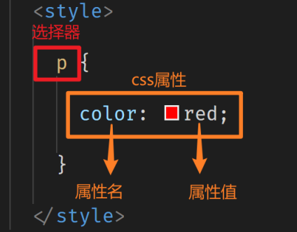


## css引入方式
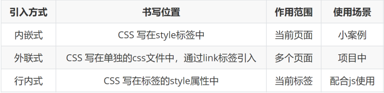

### 内嵌式
写在html的head头部中，只能控制当前的页面

```html
<head>
<style>
    选择器{
        属性1:属性值1;
        属性2:属性值2;
        属性3:隅性值3;
        ···
    }
</style>
</head>
```

```html
···
<head>
    ···
    <title>Document</title>
    <!-- 内嵌式 -->
    <style>
        div {
            color: pink;
        }
    </style>
</head>

<body>
    <div>我是一个盒子</div>
    <div>我是一个盒子</div>
    <div>我是一个盒子</div>
</body>
···
```


### 外联式
可以让多个文件统一调用一个css，方便管理和修改
```html
<head>
<link rel="stylesheet" href="css文件路径">
</head>

```
html5可省略：```type="text/css"```

```html
···
<head>
    ···
    <title>Document</title>
    <!-- 外部样式表 外联式 -->
    <link rel="stylesheet" href="./my.css">
</head>

<body>
    <div>我是div</div>
    <div>我是div</div>
    <div>我是div</div>
</body>
···
```

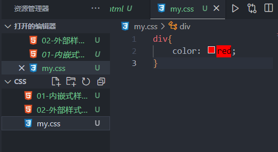


### 行内式
```
<标签名style="属性1:属性值1;属性2:属性值2;属性3:属性值3;">内容〈/标签名>
```
```html
<p style="color: green;">我是个p</p>
```


## 总结
> - style其实就是标签的属性
> - 样式属性和值中间是```:```
> - 多组属性值之间用```;```隔开


## 团队约定
属性一般换行书写，都用小写


# 基础选择器
把想要的标签选出来

## 标签选择器
- 结构：
```css
标签名 { css属性名：属性值；··· }
```
- 作用：通过标签名，找到页面中所有这类标签，设置样式

css:

```css
 p {
        /* 文字颜色 */
        color: red;
        /* 文字大小 */
        font-size: 20px;
    }
```

html:

```html
<p>我是一个段落</p>
<p>我是一个段落</p>
<p>我是一个段落</p>
```

> 注意点：
> 1. 标签选择器选择的是**所有**一类标签，而不是单独某一个
> 2. 标签选择器无论嵌套关系有多深，都能找到对应的标签


## 类选择器
- 结构：

    类名选择器：
    ```css
    .类名 { css属性名：属性值;...}
    ```

    标签：
    ```html
    <p class="类名"></p>
    ```
- 作用：通过类名，找到页面中所有带有这个类名的标签，设置样式

css:
```css
.red {
     color: red;
}
```
html:
```html
<span class="red">大牌5折购</span>
```
> 注意点：
> 1. 所有标签上都有class属性，class属性的属性值称为类名（类似于名字）
> 2. 类名可以由***数字、字母、下划线、中划线组成，但不能以数字或者中划线开头***
> 3. 一个标签可以同时有多个类名，类名之间以**空格**隔开
> 4. 类名可以重复，一个类选择器可以同时选中多个标签


## id选择器
- 结构：

    id选择器：
    ```css
    #id属性值 { css属性名：属性值；···}
    ```

    标签：
    ```html
    <p id="id名"></p>
    ```
- 作用：通过id属性值，找到页面中带有这个id属性值的标签，设置样式

css:
```css
#last {
    color: blue;
}
```
html:
```html
<div id="last">我是div</div>
```
> 注意点：
> 1. 所有标签上都有id属性
> 2. id属性值类似于身份证号码，在一个页面中是**唯一的，不可重复的！**
> 3. ***一个标签上只能有一个id属性值***
> 4. ***一个id选择器只能选中一个标签***

**类与id的区别：**

1. class类名与id属性值的区别
    - class类名=姓名，可重复，*一个标签可以同时有多个class类名*
    - id属性值=身份证号码，不可重复，*一个标签只能有一个id属性值*
2. 类选择器与id选择器的区别
    - 类选择器以 ```.``` 开头
    - id选择器以 ```# ```开头
3. 实际开发的情况
    - ***类选择器用的最多***
    - ***id一般配合js使用***，除非特殊情况，否则不要使用id设置样式
    - 实际开发中会遇到冗余代码的抽取 （可以将一些公共的代码抽取到一个公共的类中去）


## 通配符选择器
- 结构：
```css
* { css属性名：属性值；...}
```
- 作用：找到页面中所有的标签，设置样式

css：
```css
* {
    color: red;
}
```
html:
```html
<div>我是div</div>
<p>我是段落</p>
<h2>标题</h2>
```

开发中一般会这样用：

css：
```css
 * {
    /* 去除外边距 */
    margin: 0;
}
```

html:
```html
<div class="box">
    
    <h4>九号平衡车</h4>
    <p>成年人的玩具</p>
    <span>1999元</span>
</div>
```
> 注意点：
> 1. 开发中使用极少，只会在极特殊情况下才会用到，匹配所有元素，会降低页面响应速度，不建议使用
> 2. 在基础班小页面中可能会用于去除标签默认的margin和padding（比如使用了h4标签，则会用这个消除外边界。）


### 总结
- 尽量少用通用选择器```*```
- 尽量少用ID选择器
- 不使用无具体语义定义的标签选择器div span


# 字体和文本样式

## 字体大小
- 属性名：font-size

- 取值：数字 + px

- 单位：
  - 可用相对/绝对长度单位
  - 相对单位用得较多，**推荐使用px**，绝对单位基本不怎么用

    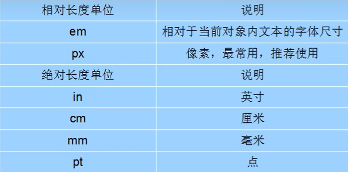

> 注意点：
> - 谷歌浏览器默认文字大小是16px
> - **单位需要设置，否则无效**


## 字体粗细
- 属性名：font-weight

- 取值：
  - 关键字：
  
    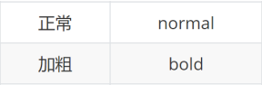

  - 纯数字：100~900的整百数：
  
    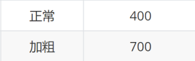

> 注意点：
> - 不是所有字体都提供了九种粗细，因此部分取值页面中无变化
> - 实际开发中以：正常、加粗两种取值使用最多。
> - 开发中常用于标题标签的字体不加粗，如：h1、h2、h3（出于网页结构考虑必须使用标题标签，而字体又必须是正常字体）


## 字体风格
- 属性名：font-style
- 取值：
    - 正常（默认值）：normal
    - 倾斜：italic

让倾斜的文字不倾斜：
```css
em {
    font-style: normal;
}
```

> - i开发中常用，因为类似于icon，但是图标里面有字的话又要字体不倾斜，所以会常用```fornt-style:normal```
> - 百度搜索的标题也会用em，但是要把字体正过来，所以也会常用```fornt-style:normal```


## 常见字体系列
- 无衬线字体（sans-serif）
  - 特点：文字笔画粗细均匀，并且首尾无装饰
  - 场景：网页中大多采用无衬线字体
  - 常见该系列字体：黑体、Arial
  
   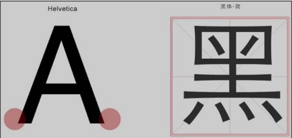

- 衬线字体（serif）
  - 特点：文字笔画粗细不均，并且首尾有笔锋装饰
  - 场景：报刊书籍中应用广泛
  - 常见该系列字体：宋体、Times New Roman
  
  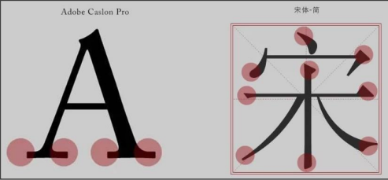

- 等宽字体（monospace）
  - 特点：每个字母或文字的宽度相等
  - 场景：一般用于程序代码编写，有利于代码的阅读和编写
  - 常见该系列字体：Consolas、fira code
  
  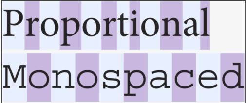


## 字体系列
- 属性名：font-family
- 常见取值：

    ```具体字体1,具体字体2,具体字体3,具体字体4,...,字体系列```
    - 具体字体："Microsoft YaHei"、微软雅黑、黑体、宋体、楷体等……
    - 字体系列：sans-serif、serif、monospace等……

渲染规则：
1. 从**左往右按照顺序**查找，如果电脑中未安装该字体，则显示下一个字体
2. 如果都不支持，此时会根据操作系统，显示最后字体系列的**默认**字体

```css
em {     
    font-family: 'Times New Roman', Times, serif，'微软雅黑'
}
```

> 注意点：
> 1. 字体名称中存在多个单词，推荐使用引号包裹
> 2. 中文字体需要加英文状态下的引号，英文字体一般不需要加引号。当需要设置英文字体时，英文字体名必须位于中文字体名之前
> 3. 字体名中包含```空格、#、$```等符号，则该字体必须**加英文状态下的单引号或双引号**，如```font-family:"TimesNea Roman"```;
> 4. 最后一项<font color="dd0000">字体系列不需要引号包裹</font>
> 5. 网页开发时，尽量使用系统常见自带字体，保证不同用户浏览网页都可以正确显示

### Unicode字体
- 为什么使用Unicode字体
  - 设置字体名称，可直接写中文。但在文件编码(GB2312、UTF-8等)不匹配时会产生乱码的错误
  - xp系统不支持类似微软雅黑的中文

- 解决:
  - 方案一：英文替代。如```font-family: "Aicrosoft Yahei"```
  - 方案二：直接使用Unicode编码来写字体名称可避免这些错误。使用Unicode写中文字体名称，浏览器是可以正确的解析的

```css
font-family: "\5FAENSF6F\96CS19ED1";    /* 表示设置字体为“微软雅黑”。 */
```
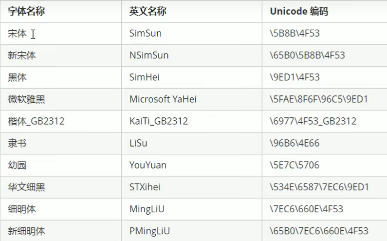


## 样式层叠问题
- 问题：
    - 给同一个标签设置了相同的样式，此时浏览器会如何渲染呢？

- 结果：
    - 如果给同一个标签设置了相同的属性，此时样式会层叠（覆盖），**<font color="dd0000">写在最下面的会生效</font>**
- TIP：
    - CSS （Cascading style sheets） 层叠样式表
    - 层叠即叠加的意思，表示样式可一层一层的层叠覆盖


## 字体font相关属性的连写

- 属性名：font

- 取值：
    - ```font : style weight size family;```

- 顺序要求：
   - swsf （稍微舒服）

- 省略要求：
    - 只能省略前两个，如果省略了相当于设置了默认值

 ```css
 .box { font: italic 700  30px "黑体";}
 ``` 
> 注意点：
>- **必须按照swsf的写法，不能颠倒**
>- **font-size和font-family绝对不能省**，否则连写失效（另两个可省）
> - 如果需要同时设置单独和连写形式
>   - 单独的样式写在连写的下面
>   - 单独的样式写在连写的里面

## 文本颜色
- 作用:
color属性用于定义文本的颜色
- 其取值方式有如下3种:

    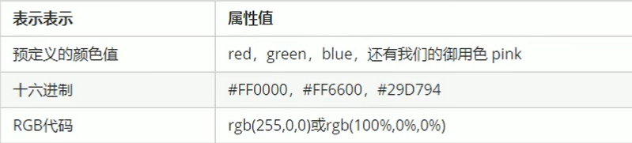

> 注意:
> 
> 实际工作中，用16进制的写法是最多的，而且我们更喜欢简写方式，比如#ff0000简写为#f00代表红色


## 文本缩进
- 属性名：text-indent
- 取值：
    - 数字+px
    - ***数字+em（推荐：1em = 当前标签font-size的大小）***

```css
 p {
    text-indent: 2em;
    /* 1em 就是当前一个文字的大小 单位 相对单位 */
}
```


## 文本水平对齐方式
- 属性名：text-align
- 取值：

    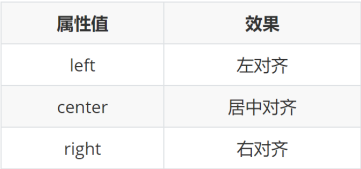

```css
h3 {
    /* 默认是左侧， center是中间 right 右侧 */
    text-align: center;
}
```

> 注意点：
> - 如果需要让文本水平居中，text-align属性给**文本所在标签（文本的父元素）**设置，**也可以让图片水平居中**


## 文本修饰
- 属性名：text-decoration
- 取值：

  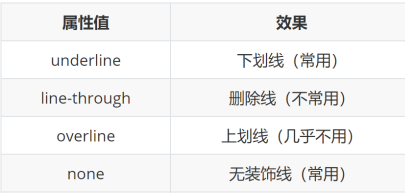  

css:
```css
a {
    color: #333;
    /* 取消下划线 一般的开发中最常用*/
    text-decoration: none;
}

/* 鼠标经过a的时候 */
a:hover {
            color: orange;
            /* 显示下划线 */
            text-decoration: underline;
}
```

html:
```html
<a href="#"> 小米 </a>
```


> 注意点：
> - 开发中会使用 <font color=#dd0000>text-decoration : none</font> ; 清除a标签默认的下划线


## 水平居中方法总结
### text-align
text-align : center 能让那些元素水平居中？
1. 文本
2. span标签、a标签
3. input标签、img标签

css：
```css
.box {
        text-align: center;
}
```
html:
```html
<div class="box">
    文字
    
    <a href="#">大闸蟹</a>
    <a href="#">小龙虾</a>
</div>
```
> 注意点：
> 1. 如果需要让以上元素水平居中， text-align : center 需要给以上元素的 <font color="#dd0000">父元素</font> 设置，直接给这些元素设置没用

### margin
- 如果需要让div、p、h（大盒子）水平居中？
    - 可以通过```margin: 0 auto;```实现

```css
box {
        width: 400px;
        height: 400px;
        background-color: pink;
        /* 可以让div盒子里面的内容水平居中 */
        text-align: center;
        /* 让div盒子在浏览器水平居中 */
        margin: 0 auto;
}
```

> 注意点：
> 1. 让 div、p、h（大盒子） 水平居中，直接给**当前元素本身**设置即可
> 2. ```margin：0 auto``` 一般针对于**固定宽度**的盒子，如果大盒子**没有设置宽度，此时会默认占满父元素的宽度**
> 
> /* 可以让div**盒子里面**的内容水平居中 */
> 
> text-align: center;
> 
> /* 让div盒子在**浏览器水平居中** */
>
>   margin: 0 auto;
        
        
      
## 行高

- 作用：控制一行的上下行间距
- 属性名：line-height
- 取值：
    - 数字+px（一般比字号大7、8像素即可）
    - 倍数（当前标签font-size的倍数）
  
- 应用：
  1. 让单行文本垂直居中可以设置 ```line-height: 文字父元素高度```
  2. 网页精准布局时，会设置 ```line-height: 1```可以取消上下间距

```css
font: 16px/28px '黑体';
```

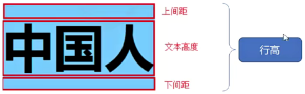

垂直居中：

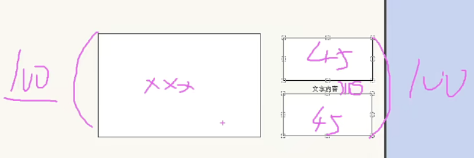

垂直偏下：

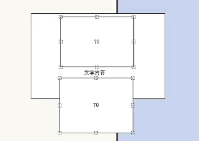
> 行高与font连写的注意点：
> - 如果同时设置了行高和font连写，注意覆盖问题
> - ```font: style weight size/line-height family;```

> 行高设置要点：
> 1. <font color="#dd0000">**如果行高***等于***盒子的高度，则里面的单行文字会垂直居中**</font>
> 2. 如果行高**大于**盒子的高度，则里面的单行文字会**垂直偏下**
> 3. 如果行高**小于**盒子的高度，则里面的单行文字会**垂直偏上**

> 设置图片的大小一般只给高度或者宽度，只给这两者之一即可

### 行高问题
给body添加行高的意思

让body里面所有的子元素有行高，子元素文字大小的1.5倍，比如当前元素字体的大小是16px，则当前元素默认的行高大小就是16x1.5=24px

这样写的好处

- 文字大的，行高就大
- 文字小的，行高就小
- 目的是读起来舒服
  
```css
body {
    /* 行高为 16x1.5=24px */
    line-height: 1.5;
}

div {
    /* line-height: 50; */
    /* line-height: 1.5; */
    background-color: pink;
    /* 若这个div没有写行高，则继承body里面写的行高，当前字体大小的1.5倍就是行高 */
    font-size: 12px;
}
```

## Chrome调试工具
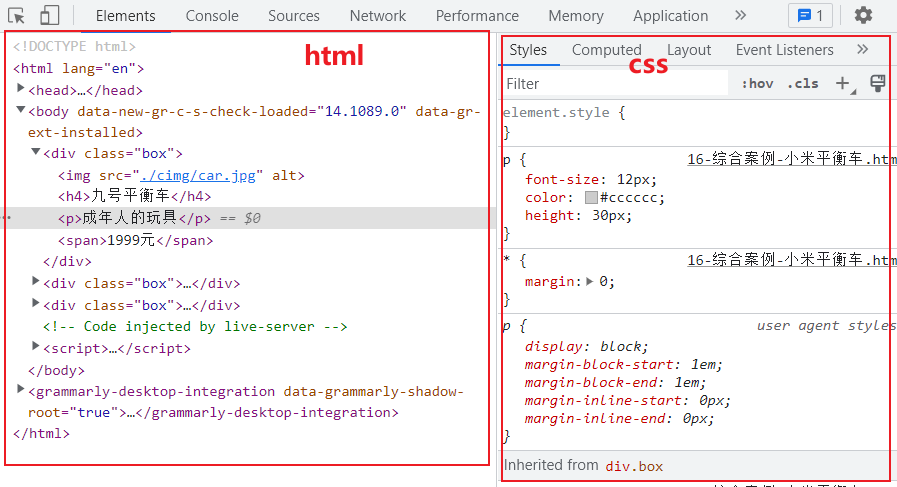

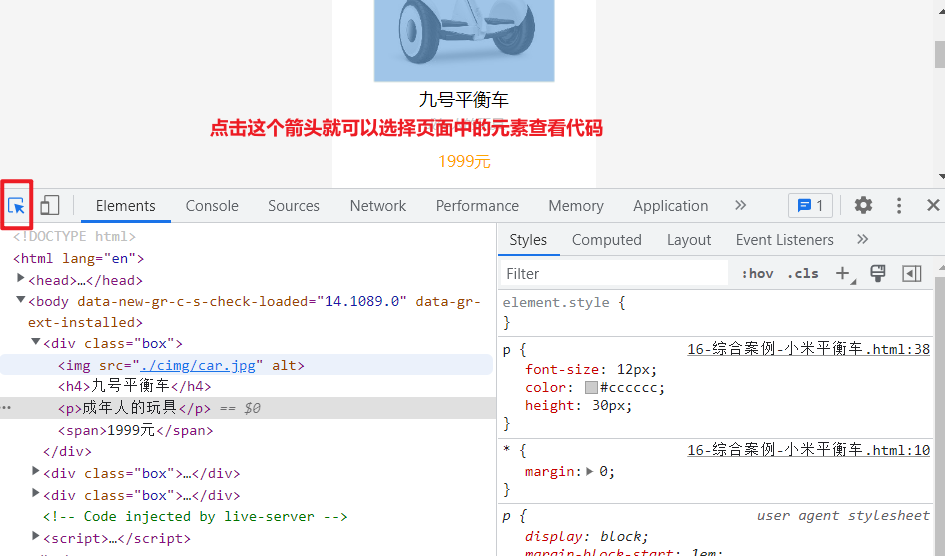

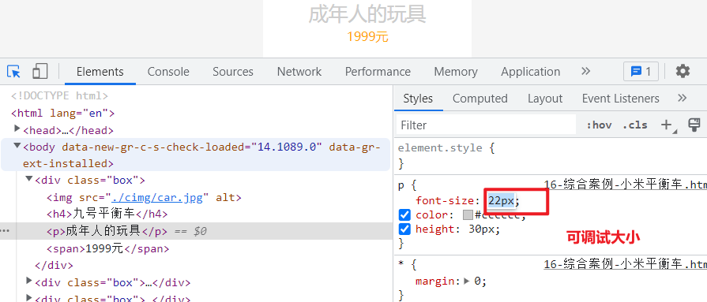

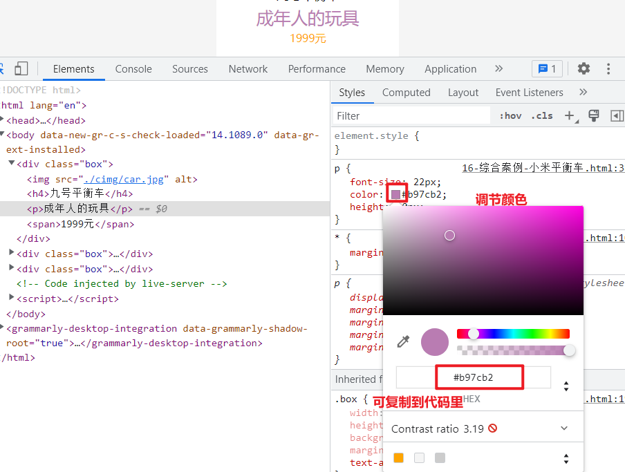

> 在chorme调节器里调节的不会改变源代码，可把调节后适合的代码复制到源代码里

场景1：

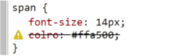

> 出现黄色感叹号，且被划掉，则该代码一定有错，可根据提示回源代码处修改

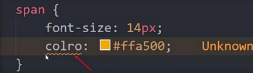

单词拼写错误

场景2：

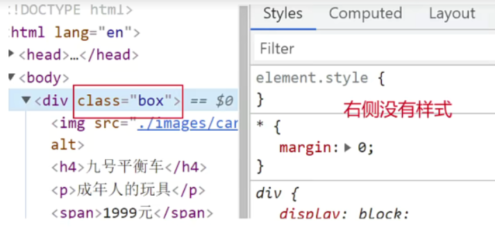

最大的可能是 类名拼写错误

修改方法：双击某一单词，则所有同类单词都会被选中，没选中的就是拼写错误

常见错误：
1. 上面的一行代码漏写括号错的
2. 单位漏写

基本使用：

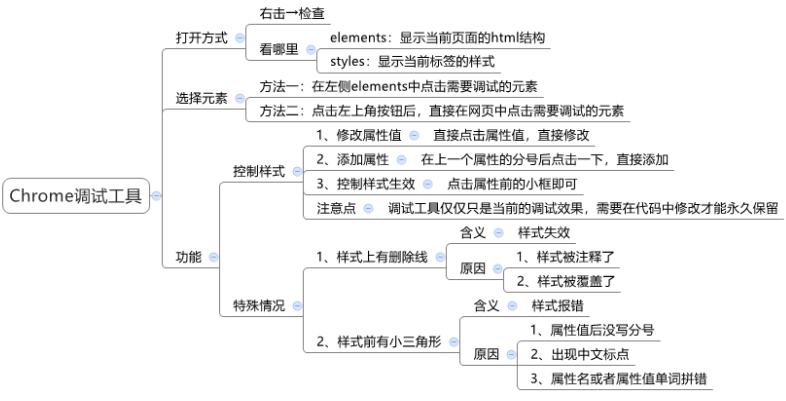

还可以点击切换成移动端，ctrl+0恢复原来浏览器的大小

查错流程：

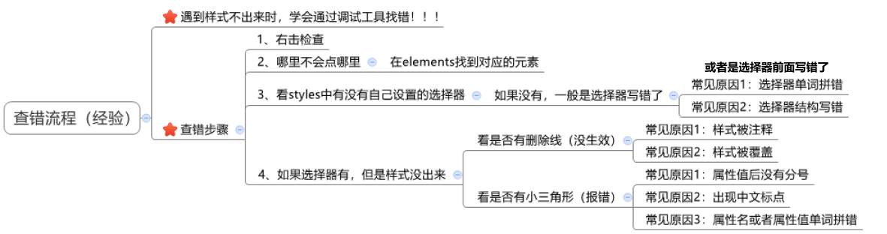

可以直接在调试工具里面写代码
查颜观色
选择最近的父盒子写选择器
注意要清楚浮动

一些操作技巧

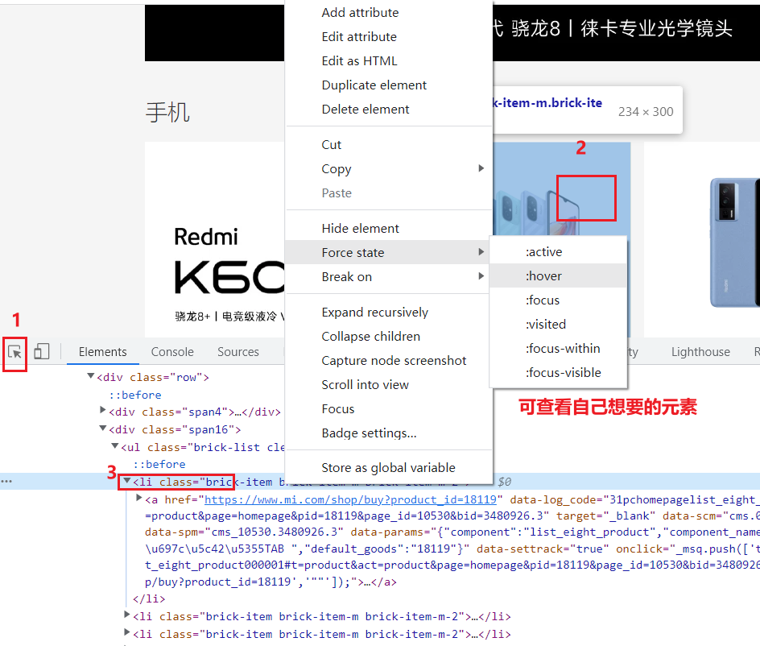