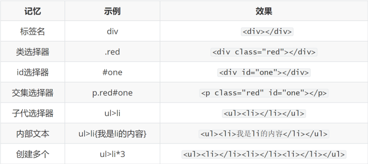
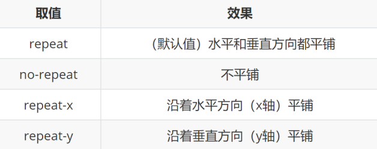
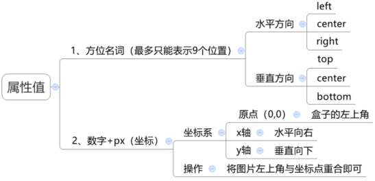
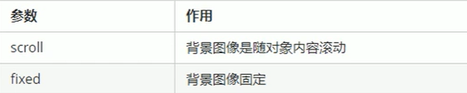
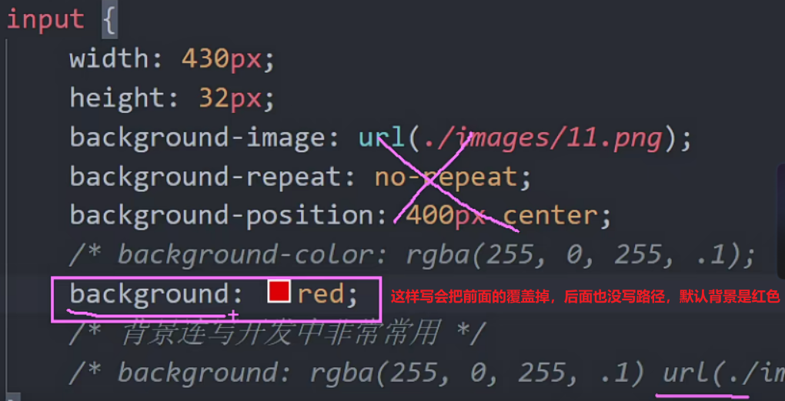
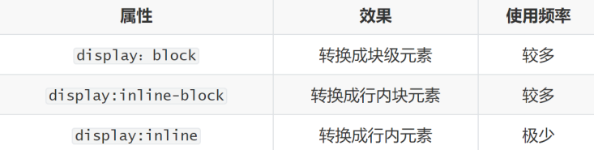
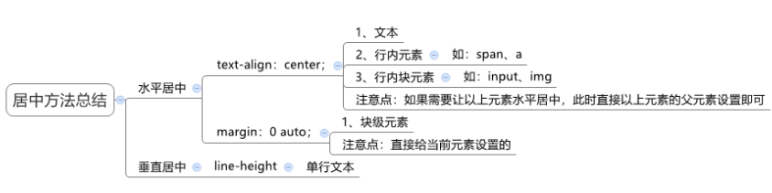
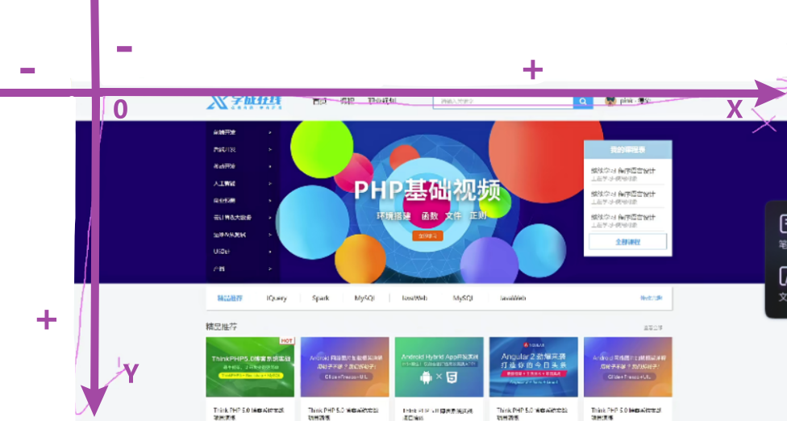
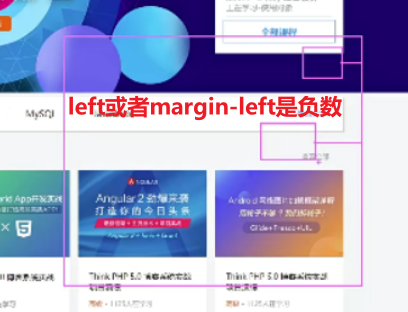

# 选择器进阶

## 复合选择器

### 后代选择器（重点）
- 作用：根据 HTML 标签的嵌套关系，选择**父元素**<font color="#dd0000">后代中</font>满足条件的元素（最常用）
- 选择器语法：

    ```css
    选择器1（父级） 选择器2（子级） { css... }
    ```
- 结果：
    - 在选择器1所找到标签的**后代（儿子、孙子、重孙子…）中**，找到满足选择器2的标签，设置样式

css:
```css
.nav a {
    font-size: 18px;
    color: #ff4400;
}
```

html:
```html
<div class="nav">
    <a href="#">侧边栏</a>
    <a href="#">侧边栏</a>
    <a href="#">侧边栏</a>
    <a href="#">侧边栏</a>
    <a href="#">侧边栏</a>
    <a href="#">侧边栏</a>
</div>
```
> 注意点：
> 1. 当标签发生嵌套时,  内层标签就成为外层标签的后代。
> 2. **后代包括：儿子、孙子、重孙子……**
> 3. 后代选择器中，选择器与选择器之前通过 <font color="#dd000">**空格** </font>隔开

### 子代选择器
- 作用：根据 HTML 标签的嵌套关系，选择**父元素**<font color="#dd000">子代中</font>满足条件的元素
- 选择器语法：

  ```css
  选择器1 > 选择器2 { css }
  ```

- 结果：
    - 在选择器1所找到标签的子代（儿子）中，找到满足选择器2的标签，设置样式

css:
```css
/* 子代选择器，只选亲儿子  */
.box>span {
    color: red;
}
```

html:
```html
<div class="box">
    <span>儿子</span>
    <span>儿子</span>
    <span>儿子</span>
    <span>儿子</span>
    <p>
        <span>孙子</span>
        <span>孙子</span>
        <span>孙子</span>
        <span>孙子</span>
    </p>
</div>
```

> 注意点：
> 1. 子代只包括：儿子
> 2. 子代选择器中，选择器与选择器之前通过<font color="#dd000">**>**</font>隔开
> 3. 特殊情况下使用


## 并集选择器（重点）
- 作用：同时选择多组标签，设置相同的样式
- 选择器语法：

    ```css  
    选择器1 ，选择器2 { css }
    ```

- 结果：
    - 找到 选择器1 和 选择器2 选中的标签，设置样式

css:
```css
em,
i,
.box{
    font-style: normal;
}
```

html:
```html
<em>倾斜</em>
<em>倾斜</em>
<em>倾斜</em>
<i>倾斜</i>
<i>倾斜</i>
<i>倾斜</i>
<i>倾斜</i>
<div class="box"></div>
```
> 注意点：
> 1. 并集选择器中的每组选择器之间通过 <font color="#dd000">**,**</font> 分隔 
> 2. 并集选择器中的每组选择器可以是**基础选择器**或者**复合选择器**
> 3. 并集选择器中的每组选择器通常**一行写一个**，提高代码的可读性


## 交集选择器
- 作用：选中页面中 同时满足 多个选择器的标签(少用)
- 选择器语法：

    ```css
    选择器1选择器2 { css }
    ```

- 结果：
    - （既又原则）找到页面中既能**被选择器1选中，又能被选择器2选中**的标签，设置样式

css:
```css
 p.one {
    color: red;
}
```

html:
```html
<div class="one">我是div</div>
<p class="one">我是段落</p>
<p class="one">我也是</p>
<p>我也是段落</p>
```

> 注意点：
> 1. 交集选择器中的选择器之间是**紧挨**着的，没有东西分隔
> 2. 交集选择器中如果**有标签选择器，标签选择器必须写在最前面**


## hover类选择器（重点）
- 作用：选中鼠标**悬停**在元素上的**状态**，设置样式
- 选择器语法：

    ```css
    选择器:hover { css }
    ```
css:
```css
/* 鼠标经过出现悬停的效果 没有空格*/
.box:hover {
    background-color: deeppink;
}
```

伪类选择器很多，比如链接伪类，结构伪类等等。这里的为链接伪类选择器（开发中一般只用hover）

- a:link  /*产未访问的链接*/
- a:visited /*已访问的链接*/
- a:hover /*鼠标移动到链接上*/ 
- a:active /*选定的链接*/
  
> 写的时候，顺序尽量不要颠倒，按照 lvha 的顺序，否则可能引起错误

> 注意点：
> 1. 伪类选择器选中的元素的**某种状态**


## emmet语法

- 作用：通过简写语法，快速生成代码
- 语法：
    - 类似于刚刚学习的选择器的写法
    

css:
```css
li {
    /* w100+h100+bc */
    width: 100px;
    height: 100px;
    background-color: red;
    /* lh28px */
    line-height: 28px;
    /* ti2em */
    text-indent: 2em;
}
```

html:
```html
<!-- ul>li{我是li}*3 -->
<ul>
    <li>我是li</li>
    <li>我是li</li>
    <li>我是li</li>
    <li>我是li</li>
    <li>我是li</li>
</ul>

<!-- ul>li{第$个li}*5 -->
<ul>
    <li>第1个li</li>
    <li>第2个li</li>
    <li>第3个li</li>
    <li>第4个li</li>
    <li>第5个li</li>
</ul>
```


# 背景相关属性

## 背景颜色
- 属性名：

    ```css
    background-color（bgc）
    ```

- 属性值：
    - 颜色取值：关键字、rgb表示法、rgba表示法、十六进制……

css:
```css
.box {
    width: 200px;
    height: 200px;
    /* background-color: pink; */
    /* transparent 透明的 默认的 */
    background-color: transparent;
    /* 半透明的写法 */
    background-color: rgba(0, 0, 0, .5);
    /* alpha 0~1 可以简写为.1 .5之类的*/
}
```

> 注意点：
> - 背景颜色默认值是透明： rgba(0,0,0,0) 、transparent
> - 背景颜色不会影响盒子大小，并且还能看清盒子的大小和位置，一般在布局中会习惯先给盒子设置背景颜色


## 背景图片

- 属性名：

    ```css  
    background-image（bgi）
    ```

- 属性值：
  
  ```css
  background-image: url('图片的路径');
  ```


> 注意点：
> - 背景图片中url中可以省略引号
> - 背景图片默认是在水平和垂直方向平铺的
> - 背景图片仅仅是指给盒子起到装饰效果，类似于背景颜色，是不能撑开盒子的
> - 不要忘记写url


## 背景平铺

- 属性名：
    
  ```css
  background-repeat（bgr）
  ```

- 属性值：
  
  


## 背景位置

- 属性名：

    ```css
    background-position（bgp）
    ```

- 属性值：
    
    ```css
    background-position:水平方向位置 垂直方向位置;
    ```

    

### 方位名词写法

css:
```css
.box{
    /* 背景位置 */
    background-position: 0 0;   x  y
    /* 方位名词 left right center */
    /* top  center  bottom 方位名词两个值之间没有顺序*/
    background-position: left center;
    background-position: center left;
    background-position: right bottom;
    background-position: center center;
    /* 如果只写一个值，则另外一个值默认是 center */
    background-position: left;
    background-position: top;
    background-position: center;
}

body {
    background-image: url(./cimg/hpjy.webp);
    background-repeat: no-repeat;
    /* 浏览器放大缩小的时候，图片始终在中间 */
    background-position: top center;
}
```
> 注意：
> - 默认的是左上角对齐
> - 如果只写一个值，则另外一个值是center
> - **方位名词两个值没有顺序**，left center和center left等价的

### 精确单位写法

css:
```css
.box{
    /* 2. 可以利用精确单位 */
    /* background-position: x坐标 y坐标; */
    background-position: 10px 20px;
    background-position: 20px 10px;
    /* 距离左侧是 40px ，垂直是  居中对齐 */
    background-position: 40px center;
}

input{
    /* 只能从左侧开始算距离  精确单位和方位名词结合使用*/
    background-position: 400px center;
}

```
> 注意:
> 1. 如果跟的是**精确的单位，则第一个值一定是x，第二个值一定是y**
> 2. 也可以**一个跟的精确单位，一个跟方位名词，但是也是有顺序的**

### 总结
> 注意点：
> - 方位名词取值和坐标取值可以混使用，第一个取值表示水平，第二个取值表示垂直


## 背景附着

解释背景是滚动的还是固定的

语法
    
```css
background-attachment : scroll|fixed  
```



## 背景连写
- 属性名：
  
  ```css
  background（bg）
  ```

- 属性值：
    - 单个属性值的合写，取值之间以空格隔开

- 书写顺序：
    - 推荐：

        ```css
        background：color image repeat (scroll) position
        ```

- 省略问题：
    - 可以按照需求省略
    - 特殊情况：在pc端，如果盒子大小和背景图片大小一样，此时可以直接写 background：url() 

css:
```css
.box{
    /* 背景连写开发中非常常用 */
    background: rgba(255, 0, 255, .1) url(./cimg/11.png) no-repeat 400px center;
}

.logo{
    /* 让图片的宽度和父盒子的一样宽 */
    width: 100%;
    /* 背景连写默认的背景颜色是透明的 */
    /* 记住，先连写 后单独写样式 */
    background: #ff4c00 url(./cimg/mi-logo.png);
}
```
常见错误：



> 注意:
> 1. 无顺序的，但提倡按照这个顺序写：```背景色  背景图  背景图平铺  背景图位置```
> 2. 中间用**空格**隔开
> - 如果需要设置单独的样式和连写
>   - ① 要么把单独的样式写在连写的下面
>   - ② 要么把单独的样式写在连写的里面
> 3. 注意与background-image:url( )区分，background-image:url()后面不能加no-repeat，因为是单属性


## 插入图片和背景图片（img标签）

什么时候时候插入图片，什么时候使用背景图片?
1. 插入图片

   比如广告图片，比如产品类(手机、平板等等）的图片这些都用插入图片。因为经常更换，img，更换方便

2. 背景图片

   超大的背景图片，作为背景显示比如1920宽，超小的**装饰类**的图片，都可以使用背景。logo经常使用背景来做

3. 移动位置

   插入图片只能通过内外边距，或者定位来移动

   但是，背景图片非常灵活，通过background-position来移动

> 注意：
> 
> 在网页中展示一张图片的方法：
>
> 方法一：直接写上img标签即可
>- img标签是一个标签，不设置宽高默认会以原尺寸显示，**会把盒子（如div）撑大**
> 
> 方法二：div标签 + 背景图片
> - 需要设置div的宽高，因为背景图片只是装饰的CSS样式，**不能撑开div标签**


# 元素显示模式

## 块级元素

显示特点：
1. 独占一行（一行只能显示一个）
2. 宽度默认是父元素的宽度，高度默认由内容撑开
3. 可以设置宽高
4. 里面可以放行内或者块级元素

- 代表标签：
    - **div、p、h系列**、ul、li、dl、dt、dd、form、header、nav、table、footer……

- 转换写法：```display: block```

> 注意：
> - 只有文字才能组成段落因此p里面不能放块级元素，特别是p不能放div
> - 同理还有这些标签h1,h2,h3,h4,h5,h6,dt，他们都是文字类块级标签，里面不能放其他块级元素。


## 行内元素

显示特点：
1. 一行可以显示多个
2. **宽度和高度默认由内容撑开**
3. **不可以设置宽高**
4. 行内元素只能容纳文本或则其他行内元素

- 代表标签：
    - **a、span** 、b、u、i、s、strong、ins、em、del……

- 转换写法：```display: inline```

行内元素转化为块级元素

css：

```css
a {
    /* 把行内元素转化为块级元素 一定要写在第一行*/
    display: block;
    width: 100px;
    height: 30px;
    background-color: pink;
    text-align: center;
    line-height: 30px;
    color: #ff4400;
    text-decoration: none;
    font-size: 14px;
}
```

html:
```html
<a href="#">人工客服</a>
```


> 注意:
> - 链接里面不能再放链接
> - 特殊情况a里面可以放块级元素，但是给a转换一下块级模式最安全


## 行内块元素

显示特点：
1. 一行可以显示多个
2. 可以设置宽高
3. 高度，行高、外边距以及内边距都可以控制。


- 代表标签：
    - **input、textarea**、button、select、img、td……
    - 特殊情况：img标签有行内块元素特点，但是Chrome调试工具中显示结果是inline

- 转换写法：```display: inline-block```


## 元素显示模式转换

- 目的：改变元素默认的显示特点，让元素符合布局要求
- 语法：

    


## html嵌套规范注意点

1. 块级元素里面可以放任何的元素
   - p里面一定不能放div ，p h这些文字类的标签里面尽量不要放块级元素
  
2. 行内元素里面只能放行内元素
    - a可以放任何元素。但是吐血建议，转换为块级元素
    - a里面不能再嵌套a标签


## 居中方式总结


## 网页常识
网页的坐标标准




案例

