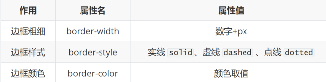

# CSS三大特性

## 继承性

子元素继承父元素的一些样式

**特点是跟文字类相关**的一些样式可以继承：

    1. color
    2. font-style、font-weight、font-size、font-family
    3. text-indent、text-align
    4. line-height
   
好处：可在一定程度上减少代码

常见应用场景：
1. 可以直接给ul设置 ```list-style:none```属性，去除列表默认的小圆点样式
2. 直接给body标签设置统一的font-size，统一不同浏览器默认文字大小

继承失效的特殊情况：

元素有浏览器默认样式，继承性仍存在，但是**优先显示浏览器的默认样式**
1. a标签的color会继承失效
    
    链接 有默认的蓝色，是浏览器给的，相当于浏览器默认加了一句```a{color:bule}```

    color属性实际已继承，但被浏览器默认设置的样式覆盖

2. h系列标签的font-size会继承失效
    
    font-size已继承，但被浏览器默认设置的样式覆盖

    如需修改则```h3 {
            font-size: 16px;
        }```

3. **div的高度不能继承**，但是宽度有类似于继承的效果
    
    **宽度属性不能继承**，但是div有独占一行的特性

> 注意：
> 
> 不是所有的样式都继承，比如宽度和高度就不继承，继承的是一些文字类的样式


## 层叠性
同一级别的样式重冲突，则会覆盖，后面覆盖前面，写在最后的生效

样式重不冲突，则叠加，同时加上相关样式


## 优先级

### 优先级介绍
- 特性：不同选择器具有不同的优先级，优先级高的选择器样式会覆盖优先级低选择器样式

- 优先级公式：
    ```
    继承 < 通配符选择器 < 标签选择器 < 类选择器 < id选择器 < 行内样式 < !important
    ```

css:
```css
* {
    color: pink !important;
}
/* .box {
        color: red
    } */

div {
    color: blue
}

p {
    color: pink;
}

#box {
    /* 继承父亲红色 */
    color: red;
}

/* 浏览器自己加相当于  1*/
a {
    color: blue;
}

a {
    color: red;
}
```

html:
```html
<div class="box" style="color: yellow;">我是一个盒子</div>

<div id="box">
    <p>我是文字</p>
    <a href="#">链接</a>
</div>
```

> 注意点：
> 1. <font color="#ff4400">**继承的权重是0**</font>，写样式写到执行的标签上去
> 2. !important写在属性值的后面，分号的前面！
> 3. !important不能提升继承的优先级，<font color="#ff4400">**只要是继承优先级最低！**</font>
> 4. 实际开发中不建议使用 !important ，推荐使用：后代 + 类选择器的形式更为便捷

### 权重叠加计算
如果是复合选择器，此时需要通过权重叠加计算方法，判断最终哪个选择器优先级最高会生效

不同选择器相当于的权重：


权重叠加计算公式：（每一级之间不存在进位）


继承的权重是0 ，写样式已经写到执行的标签上去

各个标签的权重:
- 标签选择器：  0,0,0,1    简单记忆1 
- 类选择器：    0.0,1,0    简单记忆10
- id选择器：    0,1,0,0    简单记忆100
- 行内样式表：  1,0,0,0    简单记忆1000

比较规则：
1. 先比较第一级数字，如果比较出来了，之后的统统不看
2. 如果第一级数字相同，此时再去比较第二级数字，如果比较出来了，之后的统统不看
3. ……
4. 如果最终所有数字都相同，表示优先级相同，则比较层叠性（谁写在下面，谁说了算!）

> 注意：
> 1. 复合选择器权重会叠加：div p   后代选择器：0001 + 0001 = 0002I
> 2. 不会有进位的情况，比如0.0.,0,10，开发中建议最多嵌套5层选择器
> 3. !important如果不是继承，则权重最高，天下第一！

### 权重叠加计算方法步骤
权重计算题解题步骤：
1. 先判断选择器<font color="#ff4d00">是否能直接选中标签</font>，如果**不能直接选中 → 是继承，优先级最低 → 直接pass**
2. 通过权重计算公式，判断谁权重最高

> 注意点：
> - 实际开发中选择选择标签需要精准，尽量避免多个选择器同时选中一个标签的情况，不要自己难为自己


# 盒子模型

## 盒子模型的介绍

盒子的概念
1. 页面中的每一个标签，都可看做是一个 “盒子”，通过盒子的视角更方便的进行布局
2. 浏览器在渲染（显示）网页时，会将网页中的元素看做是一个个的矩形区域，我们也形象的称之为盒子


盒子模型
- CSS 中规定每个盒子分别由：<font color="#fd4400">内容区域（content）、内边距区域（padding）、边框区域（border）、外边距区域（margin）</font>构成，这就是盒子模型


## 内容区域的宽高
设置盒子模型内容区域大小可以通过什么属性设置？
1. 宽度：width
2. 高度：height


## border相关属性介绍
- 作用：给设置边框粗细、边框样式、边框颜色效果

- 单个属性：

  

- 属性名：border
- 属性值：单个取值的连写，取值之间以空格隔开,顺序: 粗细 样式 颜色
    - 如：```border : 10px solid red;```
- 快捷键：bd + tab/ent

css:
```css
.box {
    width: 300px;
    height: 200px;
    /* 连写 */
    /* border:  粗细 样式 颜色 */
    border: 1px solid #000;
}
```

- 场景：只给盒子的某个方向单独设置边框
- 属性名：```border-方位名词```
- 属性值：连写的取值

```css
input {
    width: 520px;
    height: 28px;
    font-size: 25px;
    /* 取消文本框默认的边框 */
    border: 0;
    /* 取消文本框默认的轮廓线 */
    outline: 0;
    /* 给某个方向设置边框 */
    border-bottom: 1px solid #e7e7e7;
    background: url(./cimg/fdj.png) no-repeat left center;
}
```

### 表格的细边框

- 通过表格的```cellspacing="0"```,将单元格与单元格之间的距离设置为0
- 但是两个单元格之间的边框会出现重叠,从而使边框变粗
- 通过css属性:
```table{ border-collapse:collapse; }```
    - collapse:合并
    - border-collapse:collapse;表示相邻边框合并在一起

~~~css
table {
    width: 600px;
    height: 200px;
    margin: 100px auto;
    /* 合并相邻的边框 但是只限于表格里面使用 给表格添加哦~~~ */
    border-collapse: collapse;
    text-align: center;
}

table,
th,
td {
    border: 1px solid pink;
}
~~~


## padding取值介绍
- 作用：设置<font color="#fd4400">边框</font>与<font color="#fd4400">内容区域</font>之间的距离
- 属性名：padding
- 常见取值：

    

> 记忆规则：从上开始赋值，然后顺时针赋值，如果设置赋值的，看对面的！！


- 场景：只给盒子的某个方向单独设置内边距
- 属性名：```padding-方位名词```
- 属性值：数字 + px

```css
padding-left : 50px ;
```


## 盒子实际大小计算

- 盒子实际大小初级计算公式：

  ```盒子宽度 = 左边框 + 左padding + 内容宽度 + 右padding + 右边框```

  ```盒子高度 = 上边框 + 上padding + 内容宽度 + 下padding + 下边框```

- 当盒子被border和padding撑大后，如何满足需求？
    - 解决：计算多余大小，手动在内容中减去（手动内减）

  

> 注意:
> 
> ① 设置width和height是内容的宽高！
> 
> ② 设置border会撑大盒子！
> 
> ③ 设置padding会撑大盒子!


## CSS3盒模型（自动内减）
给盒子设置border或padding时，盒子会被撑大，如果不想盒子被撑大？
- 解决方法 ① ：手动内减
    - 操作：自己计算多余大小，手动在内容中减去
    - 缺点：项目中计算量太大，很麻烦
- 解决方法 ② ：自动内减
    - 操作：给盒子设置属性```box-sizing : border-box ;```即可
    - 优点：浏览器会自动计算多余大小，自动在内容中减去

css:
```css
.box2 {
    width: 200px;
    height: 200px;
    background-color: pink;
    padding: 0 15px;
    /* 默认的盒子模型 */
    box-sizing: content-box;
}

.box2 {
    /* CSS3 新增了一个盒子模型 */
    box-sizing: border-box;
    border: 10px solid red;
}
```


## margin的取值
- 作用：设置边框以外，盒子与盒子之间的距离
- 属性名：margin
- 常见取值：

    

> 记忆规则：从上开始赋值，然后顺时针赋值，如果设置赋值的，看对面的！！


- 场景：只给盒子的某个方向单独设置外边距
- 属性名：```margin-方位名词```
- 属性值：数字 + px


让一个**块级的盒子水平居中**方法:
1. 必须是块级盒子，有宽度
2. 让盒子左右的外边距改为auto即可
3. ```margin: 0 auto;```

比如:
> 1. 小米  margin-left: auto; marign-right: auto;
> 2. 京东  margin: auto;
> 3. 淘宝  margin: 0 auto;


## 清除默认内外边距
- 场景：浏览器会默认给部分标签设置默认的margin和padding，但一般在项目开始前需要先清除这些标签默认的margin和padding，后续自己设置
    - 比如：body标签默认有margin：8px
    - 比如：p标签默认有上下的margin
    - 比如：ul标签默认由上下的margin和padding-left

解决方法：


从处理效率上来说，淘宝的处理效率高，因为不用每个标签都执行一次运算


## 外边距的正常现象
场景：**水平布局**的盒子，左右的margin正常，互不影响

结果：最终两者距离为左右margin的和


## 外边距折叠现象-合并现象（上下的兄弟盒子）
场景：**垂直**布局的**块级**元素，上下的margin会合并

结果：最终两者距离为margin的最大值

解决方法：避免就好
- 只给其中一个盒子设置margin即可


## 外边距折叠现象-塌陷现象（上下的嵌套（父子）关系盒子）
场景：**互相嵌套**的**块级**元素，子元素的 margin-top会作用在父元素上

结果：导致父元素一起往下移动

解决方法：
1. 给父元素设置border-top 或者 padding-top（分隔父子元素的margin-top）
2. 给父元素设置overflow：hidden
3. 子元素转换成行内块元素
4. 设置浮动、定位
5. 其实，可以直接给父元素加padding-top: 100px;

```css
.father {
    width: 500px;
    height: 500px;
    background-color: pink;
    /* padding-top: 1px; */
    /* border-top: 1px solid transparent; */
    overflow: hidden;
}
.son {
    float: left;
    /* display: inline-block; */
    width: 200px;
    height: 200px;
    background-color: purple;
    margin: 0 auto;
    margin-top: 100px;
}
```


## 行内元素的margin和padding无效情况
场景：给行内元素设置margin和padding时

结果：
1. 水平方向的margin和padding布局中有效！
2. 垂直方向的margin和padding布局中无效！

> 注意：
> 1. **行内元素**我们只能哈左右的内外边距，不要给上下的内外边距
> 2. 如果非得给，请转换为块级元素或者行内块元索

## 盒子模型布局稳定性
根据稳定性来分，建议如下:

按照优先使用宽度(width)其次使用内边距(padding)再次外边距(margin)
```
width > padding >margin
```

## 盒子阴影
```
box-shadow
```

 

```css
box-shadow: 2px 2px 2px rgb(0,0,0,.2);
```


## 圆角边框

让盒子四个角变得圆润，增加页面细节，提升用户体验

属性名：```border-radius```

常见取值：数字+px 、百分比

原理：

  

赋值规则：从左上角开始赋值，然后顺时针赋值，没有赋值的看对角！

### 边框圆角的应用-正圆和胶囊按钮

#### 正圆：
1. 盒子必须是正方形
2. 设置边框圆角为盒子宽高的一半 → border-radius:50%

画正圆的原理：

  

```css
/* 让正方形变为圆的算法，宽或者高度的一半 */
border-radius: 50%;
border-radius: 100px;
```

#### 胶囊按钮：
1. 盒子要求是长方形
2. 设置 → border-radius：**必须是像素**，宽度或者高度的一半，**较小值的那个**
3. 如果写的是百分比，则显示的椭圆，而不是胶囊型

```css
.box3 {
    width: 50px;
    height: 300px;
    border: 1px solid purple;
    /* 哪个值小，就哪个值的一半即可 */
    border-radius: 25px;
}
```
效果：


原理图示总结:

  

### 圆角边框多个值的写法

```css
border-radius:  左上角  右上角  右下角  左下角；   顺时针
border-radius: 10px 20px 30px 40px;
```
书写顺序图示：

 


 ```css
 border-radius: 0 50%;  这种情况看对角
 ```
