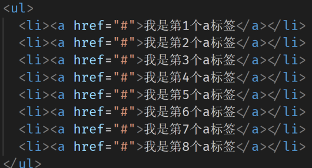

# 结构伪类选择器
使用结构伪类选择器在HTML中定位元素

因为有冒号所以是伪类

作用与优势：
1. 作用：根据元素在HTML中的结构关系查找元素
2. 优势：减少对于HTML中类的依赖，有利于保持代码整洁
3. 场景：常用于查找某父级选择器中的子元素

选择器


n的注意点：
1. n为：0、1、2、3、4、5、6、……或者关键字，如：even、odd
2. 通过n可以组成常见公式


注:第五个往后包含第五个


```css
 /* 3. 公式 n默认从 0 开始 0123456 */
ul li:nth-child(2n) {
    background-color: pink;
} 
```
> 注意
> 1. nth-child[1]	&ne;first-child{ }
> 2. nth-child[8J	&ne;last-child{ }
> 3. nth-child不能完全替代first和last-child  因为很多情况下，我们不知道有多少个孩子

## 结构伪类选择器的易错点
在下列案例中，如果需要找到第一个a标签，如何去查找？



```css
ul li:first-child a {
    color: red;
}
```


## nth-of-type结构伪类选择器


区别：
- :nth-child → 直接在所有孩子中数个数
- :nth-of-type → 先通过该<font color="#ff4d00">类型</font>找到符合的一堆子元素，然后在这一堆子元素中数个数


## 伪元素
伪元素：一般页面中的非主体内容可以使用伪元素

区别：
1. 元素：HTML 设置的标签
2. 伪元素：由 CSS 模拟出的标签效果

种类：


```::before```

1. 盒子，用css创建
2. 行内元素，直接设置宽高无效
3. 孩子，```box::before{}```这个before伪元素是box的一个子元素(孩子)
4. 放到box盒子**内容的最前面**

```::after```
1. 盒子，用css创建
2. 行内元素，直接设置宽高无效
3. 孩子， ```box::after{}```这个before伪元素是box的一个子元素(孩子)
4. 放到box盒子**内容的最后面**

```css
 ul li::before {
    /* content的''里面也可以什么都没有 */
        content: '♥';
        color: pink;
}
```

> 注意点：
> 1. **必须设置content属性才能生效（即使content里面没有东西写也要设置）**
> 2. **伪元素默认是行内元素**


# 标准流
网页布局：需要 标准流+浮动+定位

标准流：又称**文档流**，是浏览器在渲染显示网页内容时默认采用的一套排版规则，规定了应该以何种方式排列元素

常见标准流排版规则：
1. 块级元素：从上往下，**垂直**布局，独占一行
2. 行内元素 或 行内块元素：从左往右，**水平**布局，空间不够自动折行


# 浮动
## 浮动的作用
早期的作用：图文环绕

现在的作用：网页布局

• 场景：让垂直布局的盒子变成水平布局

把多个块级元素放到同一行上，打破标准流的限制

## 浮动的代码
属性名：float

属性值：


## 浮动的特点
1. 浮动元素会脱离标准流（简称：脱标），**在标准流中不占位置**
2. 浮动元素比标准流高半个级别，可以**覆盖标准流中的元素**
3. 浮动找浮动，下一个浮动元素会在上一个浮动元素后面左右浮动
4. 浮动元素受上面元素边界的影响
5. 浮动元素有特殊的显示效果
    - 一行可以显示多个
    - 可以设置宽高

浮动元素受上面元素影响的案例:


```css
.box1 {
    /* 左浮动 */
    float: left;
    width: 200px;
    height: 200px;
    background-color: pink;
}

.box2 {
    float: left;
    width: 250px;
    height: 250px;
    background-color: purple;
}
```
实现效果：


> 注意点：
> - 浮动的元素**不能**通过```text-align:center```或者```margin:0 auto```
> - **浮动元素压不住文字**，比如上一个元素浮动，下一个元素是标准流，上元素则会压住下元素的盒子，但是下元素中的文字会围绕上元素的盒子，不会被压住
> - 想要元素都在一行，必须全都设置浮动
> 右浮动可能会使得div模块顺序是倒序


## 浮动案例


a的权重很高，为了防止被搜索引擎认定作弊，一般都是用li包a

导航栏用li包裹a是为了保证我们网站的权重，会被搜索到

# 清除浮动

## 清除浮动的介绍
清除浮动带来的影响

影响：如果子元素浮动了，此时子元素不能撑开标准流的块级父元素

原因：
- 子元素浮动后脱标 → 不占位置

目的：
- 需要父元素有高度，从而不影响其他网页元素的布局

> 注意：
> 1. 很多情况下，父盒子不方使给高度
> 2. 但是如果里面的子盒子浮动了，浮动意味着脱标，脱标意味着不占有位置，若是父盒子下面再有一个盒子就会在子盒子的下面，对后续盒子布局造成影响
> 3. 我们期望的是:父盒子不给高度，而是让浮动的子盒子给撑开高度
> 4. 此时可以消除浮动: 浮动的子元素也能撑开父盒子


## 清除浮动的方法

### 1、直接设置父元素高度
特点：
- 优点：简单粗暴，方便
- 缺点：有些布局中不能固定父元素高度。如：新闻列表、京东推荐模块

```css
.father {
    width: 800px;
    background-color: pink;
    /* 给高度 */
    height: 200px;
}
```


### 2、额外标签法
操作：
1. 在父元素内容的最后（即在最后一个浮动元素后面）添加一个**块级元素**
2. 给添加的块级元素设置 ```clear:both;```

特点：
- 缺点：会在页面中添加额外的标签，会让页面的HTML结构变得复杂


```css
.son {
    float: left;
}
```
```html
 <div class="father clearfix">
    <div class="son"></div>
    <!-- 新加一个块级元素 -->
    <div style="clear:both;"></div>
</div>
    <div class="ershu"></div>
```


### 3、单伪元素清除法
操作：用伪元素替代了额外标签

① ：基本写法 
```css
.clearfix::after {
    content: '';
    display: block;
    clear: both;
}
```

② ：补充写法，后面加的两句话是为了适配所有浏览器才加的，有些浏览器没有后两句话会有高度
```css
 .clearfix::after {
    content: '';
    display: block;
    clear: both;
    /* 补充代码：在网页中看不到伪元素 */
    height: 0;
    /* 隐藏这个盒子 */
    visibility: hidden;
}
```

特点：
- 优点：项目中使用，直接给标签加类即可清除浮动


### 4、双伪元素清除法
操作：

实际开发一般用这个 

```css
.clearfix::before,
.clearfix::after {
    content: '';
    display: table;
}

.clearfix::after {
    clear: both;
}
```

特点：
- 优点：项目中使用，直接给标签加类即可清除浮动


> ```display:table```是想让前后两个伪元素在同一行上


### 5、给父元素设置overflow : hidden

操作：
1. 直接给父元素设置 overflow : hidden

特点：
- 优点：方便
- 缺点：超出父盒子的全部切掉，父盒子没有高度的话就会把整个父盒子切掉,有风险，实际开发很少这么写
 
```css
.father {
    /* 超出父盒子的全部切掉，有风险，实际开发很少这么写 */
    overflow: hidden;
    width: 800px;
    background-color: pink;
}
```


## BFC的介绍
块格式化上下文（Block Formatting Context）：BFC
- 是Web页面的可视CSS渲染的一部分，是块盒子的布局过程发生的区域，也是浮动元素与其他元素交互的区域。

创建BFC方法：
1. html标签是BFC盒子
2. 浮动元素是BFC盒子
3. 行内块元素是BFC盒子
4. overflow属性取值不为visible。如：auto、hidden…
5. ……

BFC盒子常见特点：
1. BFC盒子会默认包裹住内部子元素（标准流、浮动）→ 应用：清除浮动
2. BFC盒子本身与子元素之间不存在margin的塌陷现象 → 应用：解决margin的塌陷
3. ……


**一般在li里面写select,js寻找方便
写a的话很难找,不是亲兄弟**

css
```css
/* 加在li上会没有样式,因此在后面写个a,这样样式就可以保留 */
.box-hd .active a {
    background-color: #3983e5;
    color: #fff;
}
```

html
```html
<div class="box-hd">
    <ul>
        <li class="active"><a href="#">精选</a></li>
    </ul>
</div>
```