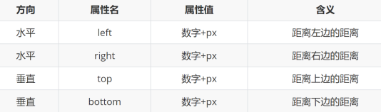

# 定位

## 定位的应用场景介绍
1. 可以解决盒子与盒子之间的层叠问题
- 定位之后的元素层级最高，可以层叠在其他盒子上面
  
  
2. 可以让盒子始终固定在屏幕中的某个位置
3. 
   

> 一个完整的网页需要：  **标准流 +  浮动 +  定位**  一起来布局

## 定位的基本使用步骤

设置定位方式
- 属性名：position
- 常见属性值：

  

设置偏移值
- 偏移值设置分为两个方向，水平和垂直方向各选一个使用即可
- 选取的原则一般是就近原则 （离哪边近用哪个）

  


## 静态定位

静态定位是默认值，就是之前认识的标准流


```css
position:static;
```

> 注意点：
> 1. 静态定位就是之前标准流，不能通过方位属性进行移动
> 2. 之后说的定位不包括静态定位，一般特指后几种：相对、绝对、固定


## 相对定位

相对于自己之前的位置进行移动


~~~css
position: relative;
top: 100px;
left: 100px;
~~~


特点
1.  需要配合方位属性实现移动
2. 相对于自己原来位置进行移动
3. 在页面中占位置 → 没有脱标
4. 加了相对定位的盒子通过 top left 移动距离 和 普通的盒子使用margin移动位置的区别
   - 普通的margin 移动距离会影响下面盒子，把其他盒子挤走
   - 而相对定位的盒子通过top 移动，则**不会**影响其余的盒子

应用场景：
1. 配合绝对定位组CP（子绝父相）
2. 用于小范围的移动


## 绝对定位
以最近一级**带有定位**的父级为准来移动距离。（static除外）
```css
/*1. 绝对定位 */
position: absolute;
/* 2. 偏移 */
top: 10px;
left: 10px;
```

特点：
1. 需要配合方位属性实现移动
2. 默认相对于浏览器可视区域进行移动
3. 在页面中不占位置 → 已经脱标

应用场景：
1. 配合绝对定位组CP（子绝父相）
2. 可以盖住任何盒子

绝对定位相对于谁移动？
1. 祖先元素中**没有**定位 → 默认相对于浏览器进行移动
2. 祖先元素中**有**定位 → 相对于**最近的 有定位**的祖先元素进行移动

> 绝对定位和浮动（脱标）的注意点：  
>
> 1. 如果盒子本身没有宽度， 加了浮动和绝对定位，则宽度改为内容的宽度。经常加 100%
> 2. 任何元素添加了浮动和绝对定位（固定定位），则不需要模式转换，就可以直接给宽度和高度


## 子绝父相
含义：
- 子元素：绝对定位
- 父元素：相对定位

应用场景：
- 让子元素相对于父元素进行自由移动

好处：
- 父元素是相对定位，则对网页布局影响最小

> 相对定位不脱标，占位，可保持网页布局；绝对定位脱标，不占位，通常可覆盖别的盒子

常用案例：


### 子绝父绝的特殊场景
场景：
- 在使用子绝父相的时候，发现父元素已经有绝对定位了，此时直接子绝即可！

原因：
- 父元素已经有定位已经满足要求，如果盲目修改父元素定位方式，可能会影响之前写好的布局


### 子绝父相水平居中案例

需求：使用子绝父相，让子盒子在父盒子中水平居中（父子元素任意宽度下都能实现，即使父元素的宽度改变了也继续保持居中）

步骤：
1. 子绝父相
2. 先让子盒子往右移动父盒子的一半
- left：50%

  

3. 再让子盒子往左移动自己的一半

  
- 普通做法：```margin-left：负的子盒子宽度的一半```

  - 缺点：子盒子宽度变化后需要重新改代码
- 优化做法：  ```transform:translateX(-50%)```

  - 优点：表示沿着X轴负方向（往左）始终移动自己宽度的一半，子盒子宽度变化不需要更改代码
  - 缺点：该方法可能会在低版本的浏览器里面不执行

###  位移小技巧

语法：

```css
transform   变形 包含了移动  
translate   移动
```

translate 移动 和  相对定位移动非常相似， 如果是百分比，按照自己的宽度/高度移动

```css
transform： translateY(50%);   往下走盒子自己高度的一半  
```

如果让一个定位的盒子水平和垂直居中，怎么写呢？

```css
top: 50%;
left: 50%;
transform: translate(-50%, -50%);
```

### 子绝父相水平垂直都居中案例
需求：使用子绝父相，让子盒子在父盒子中水平垂直都居中（父子元素任意宽高下都能实现）

步骤：
1. 子绝父相
2. 让子盒子往右走大盒子一半
  
    ```left：50%```
3. 让子盒子往下走大盒子一半
   
    ```top：50%```
4. 让子盒子往左+往上走自己的一半

   ```transform:translate(-50%，-50%);```

css：
```css
 .box {
    position: relative;
    width: 500px;
    height: 500px;
    background-color: pink;
    margin: 100px auto;
}

.s {
    /* float: left; */
    position: absolute;
    /* 走父盒子宽度的一半 */
    left: 50%;
    /* 往左侧走自己（小盒子），宽度的一半 */
    /* margin-left: -100px; */
    /* transform: translateX(-50%); */
    top: 50%;
    /* margin-top: -15px; */
    transform: translate(-50%, -50%);
    width: 300px;
    height: 30px;
    background-color: purple;
    /* margin: auto; */
}
```

html：
```html
<div class="box">
    <div class="s"></div>
</div>
```

效果：

  


## 固定定位
**相对于浏览器**进行定位移动
```css
position:fixed;
bottom: 0;
right: 0;
```

特点：
1. 需要配合方位属性实现移动
2. 相对于**浏览器<font color="#ff4d00">可视区域</font>**进行移动
3. 在页面中**不占位置 → 已经脱标**

应用场景：
1. 让盒子固定在屏幕中的某个位置

  

### 固定盒子靠近版心对齐

浏览器中线为中心，向右移动50%，再向左移动**版心的一半+间隙+自己的宽度**


```css
.subnav{
  position: fixed;
  /* left: 150px; */
  /* 放在左边 */
  /* 第一种方法 */
  /* left: 50%;
  margin-left: -803px; */
  /* 第二种方法 */
  /* right: 50%;
  margin-right: 620px; */
  /* 放在右边 */
  left: 50%;
  margin-left: 620px;
  /* 垂直居中 */
  top: 50%;
  margin-top: -240px;
  width: 183px;
  height: 470px;
  background-color: #fff;
}
```
> 注意：实际网页设计中一般放在右边较好写


## 粘性定位
应用场景及特点：保留原有位置 +根据情况固定在屏幕上

1. 属性值：```sticky```
2. 特点：
- **不脱标**，按照标准流布局
- 当屏幕滚动到某一个位置后，会固定在屏幕上
- 至少要指定一个边偏移属性

### 总结


## 元素的层级关系
不同布局方式元素的层级关系：

- **标准流 < 浮动 < 定位**

不同定位之间的层级关系：
- 相对、绝对、固定默认层级相同
- 此时HTML中写在***下面的元素层级更高，会覆盖上面的元素***


### 更改定位元素的层级

场景：改变定位元素的层级
```css
/* 数值可正可负 */
z-index: 1;
```
> 注意点：
> 1. 数字越大，层级约靠上。
> 2. 只有定位的元素才有这个属性
> 3. 数字后面不跟单位  
> ```font-weight: 400;```
> 还有定位后面的```left:10; top:10;```
> 4. 数字是整数。 可以是 负数、0 、正数      
> 比如 1、2、3、4
> 5. 默认值是  auto，就是跟父级一样大
> 6. **设置的定位如果后面没有设置left、right、top等值，则设置的定位无效**