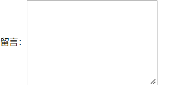
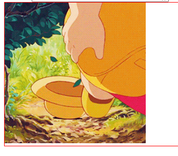
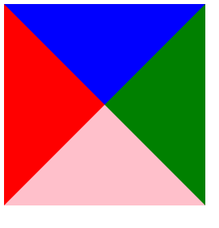
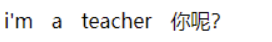
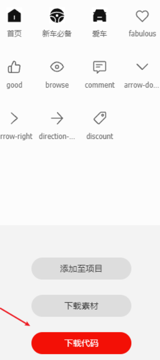

# 装饰
## 垂直对齐方式
基线：浏览器文字类型元素排版中存在用于对齐的基线（baseline）


属性名：```vertical-align```

属性值：


场景：解决***行内/行内块元素***垂直对齐问题

问题：当图片和文字在一行中显示时，其实底部不是对齐的


### vertical-align可以解决的问题
1. 文本框和表单按钮无法对齐问题
    
    解决方法：
   
   css:
    ```css
    input {
        width: 200px;
        height: 40px;
        vertical-align: bottom;
    }
    ```
    
    html:
    ```html
    <input type="text"> <button>点击</button>
    ```
    实现底部对齐：

    
2. input和img无法对齐问题
3. div中的文本框，文本框无法贴顶和文字和文本框对齐问题

    
4. div不设高度由img标签撑开，此时img标签下面会存在额外间隙问题

   

    原因： 图片和文字的基线对齐所有有缝隙

    解决方案：  

    1. 让图片和文字的底线对齐

    ~~~css
    img {
        vertical-align: middle;
    }
    ~~~

    2. 图片转换为块级元素

    ~~~css
    img {
        display: block;
    }
    ~~~
5. 使用line-height让img标签垂直居中问题


> 注意点：
> - 学习浮动之后，不推荐使用行内块元素让div一行中显示，因为可能会出现垂直对齐问题
> - 推荐优先使用浮动完成效果


## 光标
属性名：```cursor```

属性值：


css:

```css
li:nth-child(1) {
    cursor: default;
}
```

### 禁用按钮

添加 一个属性 ```disabled``` 

全写：```disabled="disabled"```
```html
 <button disabled class="not">-</button>
```

css 可以把鼠标设置为禁用样式

```css
.not {
  cursor: not-allowed;
}
```


## overflow溢出部分显示效果
属性名：```overflow```

属性值：


在网页中不想让盒子多余的部分遮住其他盒子的也可以使用这个

```css
.box {
    /* 溢出 隐藏 我们的文字 */
    /* overflow: hidden; */
    /* scroll 滚动条 无论是否超出都显示滚动条*/
    /* overflow: scroll; */
    /* auto 如果超出就显示滚动条，不超出不显示 */
    overflow: auto;
    width: 200px;
    height: 200px;
    border: 1px solid red;
}
```


## 显示与隐藏
场景：让某元素本身在屏幕中不可见。如：鼠标:hover之后元素隐藏

###  display 显示

显示：  ```display: block;```

隐藏： ```display：none;```

不能做过渡效果

### visibility 显示

显示： ```visibility: visible;```

隐藏： ```visibility: hidden;```

区别：
1. visibility：hidden 隐藏元素本身，并且在网页中**占位置** 
2. display：none 隐藏元素本身，并且在网页中**不占位置**

>注意点：
> 开发中经常会通过**display属性完成元素的显示隐藏切换**
> - display：none；（隐藏）
> - display：block；（显示）

案例注意点：
想要鼠标能停留在二维码上，只要把图片的定位和a的定位重合一点点即可，这样就不会默认离开a的模块


## 元素整体透明度
场景：让某元素整体（包括内容）一起变透明

属性名：```opacity```

属性值：**0~1之间的数字**
- 1：完全不透明
- 0：完全透明，当设置opacity:0时，此时元素完全透明，有元素隐藏的效果 

```css
opacity: 0.3;
```
>注意点：
>opacity会让元素整体透明，包括里面的内容，如：文字、子元素等……

### 罩盖案例

```css
/* 当我们鼠标经过li，则里面的before伪元素透明度改为1 */
.box li:hover::before {
    opacity: 1;
}
/* 区别下面这个含义：鼠标经过before的时候发生什么 */
li::before:hover{}
```
> 注意：li后面都不能有空格


## 过渡
作用：让元素的样式慢慢的变化，常配合hover使用，增强网页交互体验

```
transition:  属性  时间;
```

属性名：```transition```

取值：


```css
div {
    width: 200px;
    height: 200px;
    background-color: pink;
    /* 过渡  s必须写*/
    /* transition: width 1s, background-color 1s; */
    /* 所有有变化的属性 all  也可以省略 */
    /* transition: all 1s; */
    transition: .3s;
}
```
属性：  可以写单个属性， 开发中，我们经常写  all  

时间：  一定要加 单位 s    比如 1s  就是1秒     0.3s  
> 注意点：
> 1. 过渡需要：默认状态（原状态）和hover状态样式不同（**即在过度前后的代码里面都写了相关属性**），才能有过渡效果
> 2. transition属性给**需要过渡的元素本身加**
> 3. transition属性设置在不同状态中，效果不同的
>   - 给**默认状态**（原状态）设置，鼠标移入移出都有过渡效果
>   - 给**hover状态**设置，鼠标移入有过渡效果，**移出没有过渡效**

### 文本框获得焦点
~~~css
input:focus {
    width: 200px;
}
~~~

focus 焦点   光标   

鼠标 定到  表单里面才会触发的 样式 


## css绘制三角形
原理：
1. 利用边框之间的衔接处是斜线连接
2. 先将四个边都设置为 transparent 色
3. 需要哪个方向的三角形就设置哪个方向的 border 颜色

四个边框都有颜色的效果:




只有一个边框有颜色，得出来的就是三角形


三角形写法

```css
div {
/* width: 0;
    height: 0;
    border-left: 100px solid transparent;
    border-right: 100px solid transparent;
    border-top: 100px solid blue;
    border-bottom: 100px solid transparent; */

    /* 一般用这种写法 */
    width: 0;
    height: 0;
    border: 100px solid transparent;
    border-left-color: pink;
}
```

### css填充三角形对话框

```css
.box {
    position: relative;
    width: 200px;
    height: 300px;
    background-color: pink;
    margin: 100px auto;
}

.box::before {
    position: absolute;
    top: -50px;
    left: 70px;
    content: '';
    width: 0;
    height: 0;
    border: 25px solid transparent;
    border-bottom-color: pink;
}
```

显示：


### css 边框三角形对话框
```css
 .box {
     position: relative;
     width: 200px;
     height: 300px;
     /* background-color: pink; */
     margin: 100px auto;
     border: 1px solid pink;
}

.box::before,
.box::after {
    position: absolute;
    top: -50px;
    left: 70px;
    content: '';
    width: 0;
    height: 0;
    border: 25px solid transparent;
    border-bottom-color: pink;
}

.box::after {
    border-bottom-color: #fff;
    top: -49px;
}
```
其实也是通过压线实现

原理图和显示：


另一种方法：
```css
.arr {
    width: 50px;
    height: 50px;
    border-top: 1px solid pink;
    border-right: 1px solid pink;
    /* 然后再转个角度 */
    transform: rotate(-45deg);
}
```


### css压线效果
原理：


```css
.box {
    position: relative;
    width: 800px;
    height: 0;
    border-bottom: 3px solid #000;
    margin: 100px auto;
}

.box h3 {
    position: absolute;
    left: 50%;
    top: -45px;
    margin-left: -100px;
    width: 200px;
    height: 50px;
    text-align: center;
    line-height: 50px;
    font-size: 20px;
    /* 核心代码 */
    background-color: #fff;
}
```

显示：


## 链接伪类选择器
场景：常用于选中超链接的不同状态

选择器语法：


一般实际项目中只会这么用：
```css
 a {
    color: #333;
    text-decoration: none;
}

a:hover {
    color: #f40;
}
```
> 注意点：
> - 如果需要同时实现以上四种伪类状态效果，需要按照**LVHA**顺序书写
> - 其中 :hover伪类选择器 使用更为频繁，常用于选择各类元素的悬停状态

> 注意：类选择器、伪类选择器，权重为 10


## 属性选择器
属性选择器可以根据元素特定属性的来选择元素，这样就可以不用借助于类或者id选择器


css:
```css
/* 必须是button这类元素 同时这个button必须带有disabled属性 */
/* 只需要选择 无需调用 */
/* 权重11 */
/* 前面这个button没有也可以，表示选择所有具有disabled属性的元素*/
button[disabled] {
    cursor: not-allowed;
}
```
html：
```html
<button disabled>-</button>
```

**可以根据属性值来选择 不同的元素**

```css
/* 这个input也是可以省略，省略之后意义同上 */
input[type=submit] {
    color: red;
}
```

这样只选择提交按钮

```html
<input type="reset" value="重置">
<input type="submit" value="提交">
```
通过name属性来区别不同的表单
> 注意：类选择器、属性选择器、伪类选择器，权重为 10


## 精灵图

场景：项目中将多张小图片，合并成一张大图片，这张大图片称之为精灵图


优点：减少服务器发送次数，减轻服务器的压力，提高页面加载速度


例如：需要在网页中展示8张小图片
- 8张小图片分别发送 → 发送8次
- 合成一张精灵图发送 → 发送1次

### 精灵图的使用步骤
1. 创建一个盒子
2. **设置盒子大小为小图片大小**
3. **设置精灵图为盒子的背景图片**
4. 将小图片左上角坐标取负值，设置给盒子的```background-position:x y```


原理：


实际项目中的操作
1. 先测出需要用到的图标大小
   
   

2. 接着测出该图片的坐标
   
   

3. 测出的数据用在代码里面
   ```css
    span:nth-child(1) {
        width: 96px;
        height: 111px;
        background-position: -494px -276px;

    }
   ```
购物车案例


```css
.shopcar:hover {
    background-position: bottom center;
}
```


## 背景图片大小
作用：设置背景图片的大小

语法：

~~~css
background-size：宽度 高度；
~~~

取值：

   

### background连写拓展
完整连写：
```background: color image repeat position/size;```


```css
/* 连写 */
background: url(./cimg/1.jpg) no-repeat 0 0/cover;
/* 单独写 */
background-size: cover;
```
注意点：
- background-size和background连写同时设置时，需要注意覆盖问题

解决：
1. 要么单独的样式写连写的下面
2. 要么单独的样式写在连写的里面


## 背景固定  

```css
background-attachment: fixed；
```

**连写：**

```css
background: url(../images/bg1.jpg) no-repeat top center fixed;
```


## 溢出文字显示省略号

单行文字显示省略号，使用步骤分为三步：

1. **必定给宽度**，隐藏多余的文字
2. 强制一行显示文字。（否则换行了）
3. 超出的部分显示省略号

```css
.box {
    width: 160px;
    border: 1px solid red;
    /* 1.强制文字一行显示 (nowrap 不允许换行)*/
    white-space: nowrap;
    /* 2. 溢出隐藏 */
    overflow: hidden;
    /* 3. 溢出的文字省略号(ellipsis)显示 */
    text-overflow: ellipsis;
}
```

## 字间距

```css
letter-spacing: 1px; 
```

中文就是字间距， 英文就是字母间距


## 单词间距

```css
word-spacing: 10px;
```

英文单词间距， 中文无效



## 文字阴影

作用：给文字添加阴影效果，吸引用户注意，开发中少用

属性名：```text-shadow```

取值：


```css
text-shadow： 水平阴影  垂直阴影  模糊大小  阴影颜色；
text-shadow： 2px 2px 2px rgba(0,0,0,.4);
```

拓展：
- 阴影可以叠加设置，每组阴影取值之间以逗号隔开


## 字体图标

常见的**装饰类小图标**我们经常使用**精灵图**或者**字体图标**

**精灵图：**

  比较复杂的小图标，如渐变或多种颜色，或公司独一无二的小图标

**字体图标：**

   简单的，常用的小图标，如小箭头，放大镜，购物车等

字体图标网站建议使用阿里巴巴字体图标

### 字体图标优点

1. 兼容性好
2. 修改样式和布局超级方便，把它当文字来看
3. 放大缩小不失真
4. 更换非常方便
5. .....反正很好用

### 字体图标网站

https://www.iconfont.cn/    阿里巴巴字体库


一般网页美工都有账号，或者公司都有专门的账号以供我们使用，个人练习可以自行注册

### 下载字体图标

1. 官方字体图标库


2. 选择


3. 挑选需要的字体图标

 

4. 点击购物车

 

5. 下载代码

 

6. 得到压缩包

 

### 使用字体图标

#### 字体图标引入文件
1. 新建一个fonts文件夹

2. 从压缩包里面取出2个文件

    

3. 把两个文件放入 fonts文件夹内

4. html 页面引入 iconfont.css 文件

```css
<link rel="stylesheet" href="./fonts/iconfont.css">
```

> 注意：写在首页的css文件前面，因为先引入文字css其他css才能使用
> ```html
><!-- 引入图标字体的css文件 -->
> <link rel="stylesheet" href="./fonts/iconfont.css">
><!-- 引入首页的css文件 -->
><link rel="stylesheet" href="./css/index.css">
>```

#### 调用字体图标

##### 方法一：直接在标签里面写样式

```css
<span class="iconfont icon-xxx"></span>
```
在下载的压缩包打开该文件


在demo页面中 选择 Font class 选项


css：

```css
.eye {
    /* 可以当作字体来直接改大小和颜色了 */
    color: red;
    font-size: 18px;
}
```

html：

```html
<div class="iconfont icon-browse eye"></div>
```

> 如果发现样式无法改，则直接使用Chrome检查，按下图步骤更改即可
> 
> 


##### 方法二：在标签里面写样式和字体符号

先在页面把该字体的值复制下来


css：

```css
button {
    width: 50px;
    height: 30px;
    background-color: #f40;
    color: #fff;
    border: 0;
}

button:hover {
    background-color: pink;
    color: red;
}
```

html：

```html
<!-- 该方法只适合在标签里面写，不适合在伪元素里面写 -->
<button class="iconfont">&#xe66f</button>
```

>注意：该方法只适合在标签里面写，不适合在伪元素里面写 ,类似&#xe66f这样的值后面有没有"```;```"都可以

##### 方法三：伪元素里面使用

css：

```css
ul li {
    width: 300px;
    height: 50px;
    border: 1px solid pink;
    line-height: 50px;
}

ul li:after {
    content: '\e666';
    float: right;
}
```

html：

```html
<ul>
    <li class="iconfont">我是pink老师</li>
</ul>
```

##### 伪元素里面content字体图标值的获取

1. 小发现，不一定正确
    
    如：&#xe66f，去掉e前面的所有值，再加上"```\```"就是content的值
    ```content: '\e66f';```

2. 根据引入的链接打开字体的css文件
    ```css
    <link rel="stylesheet" href="./fonts/iconfont.css">
    ```
    找到该字体图标的名字

    

    在字体css文件里面找相应名字的代码

    ```css
    .icon-arrow-right:before {
            content: "\e666";
    }
    ```

    把该content值复制下来即可


> 注意：iconfont这个类名也可以修改
> 1. 打开iconfont.css文件
>
> 2. 
>   
>
> 3. 
>   
>
> 4. 修改完成之后，引用时类名变为：
> ```css
> <span class="pink">&#xe677;</span>
> ```


