#  伪类和伪元素

## 伪类和伪元素的区别

1. 作用不同

   **伪类是一种状态**，可以看看做是**选择器**。比如鼠标经过伪类   :hover, 比如  结构伪类   li:nth-child，  一个冒号

   **伪元素是元素,默认是行内元素**， 简单来说，就是用css模拟出来了一个盒子,***其目的就是为了省元素,方便加载***

2. 权重不相同

   1. 伪类 是  10     （类、属性选择器 [type=submit]）
   2. 伪元素 是  1    (标签选择器    )

3. 使用场景不同

   1.  比如 鼠标经过盒子，盒子里面的样式会有变化，则需要使用 **伪类**
   2.  如果想在盒子内部插入一个小盒子，此时可以使用 **伪元素**

## 伪元素最常见的使用场景

做一些 **装饰类** 的小图标的时候，可以使用伪元素

如:

 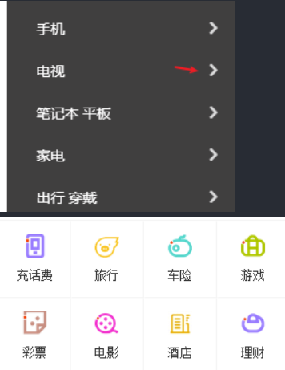


> 注意： 不要迷恋伪元素，非常重要的信息，不要使用伪元素。比如 产品标题，产品介绍等。它主要用来装饰作用的

## 伪类和伪元素的使用

遇到这个场景：  

 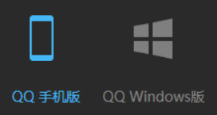

这个  小手机  模块可以使用伪元素来做： 因为是插入手机模块

如：

```css
div::before {
    content: '';
    width: 20px;
    height: 50px;
    background:  url(./plats1.png) no-repeat 0 0;
}
```

当我们鼠标经过这个div盒子的时候，是div盒子变图片还是里面的before变颜色呢？

答案是 里面的before 变图片位置

写法:  鼠标经过div，里面的before这个伪元素变化背景位置

```css
div:hover::before {
    background-position: -100px 0;
}
```

### 考核题1：  

有如下结构, 请回答2个问题：

```html
<ul>
    <li>手机</li>
    <li>电脑</li>
    <li>榴莲</li>
</ul>
```

1. 如果想要给第1个li   改变背景位置怎么写呢？

   ```css
   ul li:nth-child(1) {
       background-position: -100px 0;
   }
   ```

2. 如果想要第一个li，改变伪元素 before 里面的背景位置如何写？

   ```css
   ul li:nth-child(1)::before{
        background-position: -100px 0;
   }
   ```

3. 如果想要鼠标经过第一个li，改变伪元素 before 里面的背景位置如何写？

   ```css
   ul li:nth-child(1):hover::before {
        background-position: -100px 0;
   }
   ```

## before和after伪元素做遮罩层

借助于定位，一定要给宽度和高度哦~


# 盒子显示和隐藏

css 做的显示和隐藏主要做一些装饰类的效果。 比如显示隐藏遮罩层

像下拉菜单，左右的菜单，都是js来做

但不管css还是js都是用  ```display: none```和 ```display: block```来做

css部分

```css
.box {
    position: relative;
    width: 200px;
    height: 200px;
    background-color: pink;
    margin: 100px auto;
}

/* 伪元素默认的是行内元素 */
.box::before {
    /* 隐藏的  不占位置 */
    display: none;
    content: '';
    position: absolute;
    top: 0;
    left: 0;
    width: 100%;
    height: 100%;
    background-color: rgba(0, 0, 0, 0.5);
}

/* 鼠标经过box，显示的是 before */
.box:hover::before {
    /* 显示出来 */
    display: block;
}
```

##  结构伪类 nth-child 

根据结构来选择标签，选儿子（亲儿子） 选择第几个，比如选择第4、8个元素等，这是结构伪类的使用场景

但是，结构伪类nth-child使用，是有具体要求的， **如果非要按按照顺序来使用，必须是亲兄弟**

比如：这个排序比较简单

```html
<ul>
    <li>手机</li>
    <li>电脑</li>
    <li>榴莲</li>
</ul>
```

```css
选择第3个li
ul li:nth-child(3) {
    color: red;
}
```

但是，如果是这样，则排序就不对：

```html
<div class="box">
     <a href="#">链接</a>
     <p>我是段落</p>
     <p>我是段落</p>
     <p>我是段落</p>
     <p>我是段落</p>
</div>
```

nth-child() 选孩子的时候，不一定是同类的,依次来排号。

**进行选择的时候，先执行 nth-child(n)  先按照序号找到这个元素， 然后再看前面的标签选择器能否匹配**

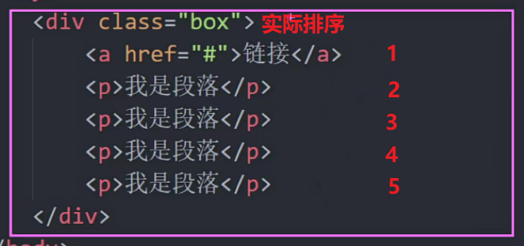

```css
.box p:nth-child(5) {
    color: red;
}
```


### 拓展： 

可使用另一个选择器  ```li:nth-of-type()``` 选择的时候可以分类, 必须是同一类

```css
p:nth-of-type(1)
```

**执行顺序： 先看 p， 再执行 nth-of-type 从1开始排号**

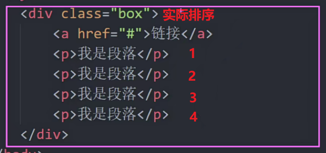

### 考核题

请问下面结构中，如果把榴莲的颜色改为红色：

```html
<ul>
    <li><a href="#">手机</a></li>
    <li><a href="#">电脑</a></li>
    <li><a href="#">榴莲</a></li>
</ul>
```

答案：

```css
ul li:nth-child(3) a {
   color: red;
}
```


# 清除浮动

## 清除浮动的原因

浮动元素的父级没有高（没有高度的原因可能是因为不方便给高度，也可能是因为你忘记给高度啦！！！）

父级没有高度，则会影响下面的标准流盒子，下面的盒子会升上来，从来影响页面布局

**清除浮动目的：**  让父元素自动检测浮动子元素的设置高度。 父元素有高度了，就不会影响页面布局

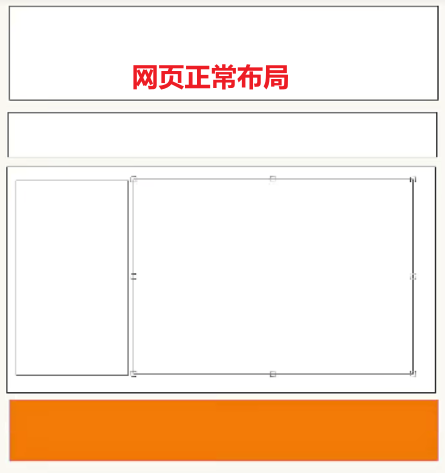

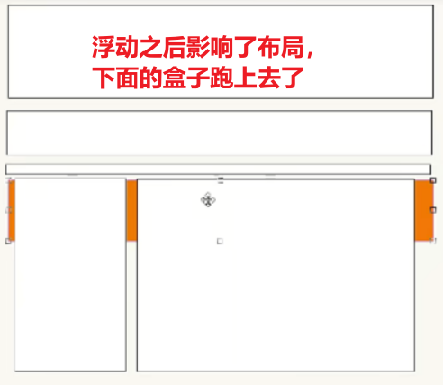

## 解决方案

1. 给父级一个高度
2. 额外标签法。  额外新增一个标签，页面的标签会越来越多，不好~~~
3. 伪元素方法（单、双伪元素）。 算是额外标签法的一个升级版本，因为不需要增加额外的标签。 **好处就是省标签,浮动越多，网页打开越慢**

```css
/* 双伪元素清除浮动 */
.clearfix::before,
.clearfix::after {
  content: "";
  display: table;
}
.clearfix::after {
  clear: both;
}
```

> 注意： 清除浮动的位置，是找到浮动元素的**最近父级**就可以了，调用 clearfix 类

```html
<ul class="xtx clearfix">
    <li></li>
    <li></li>
</ul>
```

## 水平和垂直对齐 

##  水平居中

### 一、非块级的盒子水平居中

盒子里面的***文字、图片、行内元素、行内块元素***水平居中， 给**块级的父盒子**添加   ```text-align:center;```即可

> 注意：
> 1. 父亲是块级盒子
> 2. 孩子可以是文字、图片、行内元素、行内块元素


html 部分

```html
 <!-- 文字可以直接水平居中 -->
<div class="box">
    文字可以水平居中
</div>
<!-- 图片可以水平居中 -->
<div class="box">
    
</div>
<!-- 行内块元素水平居中 -->
<div class="box">
    <input type="text">
</div>
```

css部分

```css
.box {
    text-align: center;
}
```

### 二、块级盒子水平居中

不脱标的块级盒子只能通过  margin 左右auto 水平居中， 无法实现垂直居中

## 垂直居中

### 一、非块级的盒子垂直居中

让行高等于高度可以让非块级盒子垂直居中

注意：

1. 父亲是块级盒子
2. 孩子可以是**单行文字、图片、行内元素、行内块元素**

html部分

```html
<!-- 单行文字可以直接垂直居中 -->
<div class="box">
    单行文字可以垂直居中
</div>
<!-- 图片可以垂直居中 -->
<div class="box">
    
</div>
<!-- 行内块元素垂直居中 -->
<div class="box">
    <input type="text">
</div>
```

css 部分

```css
.box {
     height: 100px;
     line-height: 100px;
}
```

### 二、块级的盒子

无法直接垂直居中，只能通过margin或者父级的padding 挤下来

## 脱标的盒子水平和垂直居中

脱标的盒子包含： 浮动、绝对定位、固定定位

1. 浮动无法实现水平和垂直居中，只能靠padding和margin

2. 固定和绝对定位， 通过算法

   ```css
   .box {
       position: absolute;
       top: 50%;
       left: 50%;
       transform: translate(-50%, -50%);
   }
   ```
3. 定位的盒子如果没有宽高，默认和内容一样大小

### 小技巧

如果父盒子里面的子盒子，距离要求不是很精确，可以把子盒子转换为行内块元素，则可以实现垂直和水平居中

html 部分

```html
<div class="box">
    <a href="#">第一页</a>
    <a href="#">第二页</a>
    <a href="#">第三页</a>
</div>
```

css部分

```css
.box {
    height: 50px;
    background-color: pink;
    /* 让三个子盒子水平居中 */
    text-align: center;
    /* 让三个子盒子垂直居中 */
    line-height: 50px;
}

.box a {
    display: inline-block;
    width: 50px;
    height: 30px;
    background-color: purple;
    /* 要从新设置行高，不然会继承父亲 */
    line-height: 30px;
    font-size: 12px;
    text-decoration: none;
    color: #fff;
}
```

效果：

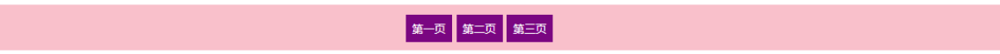

开发中看到场景：

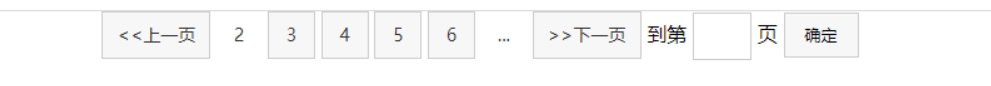

> 1. 注意不要让子盒子继承父盒子的行高就可以了
> 2. line-height对于块级是无效的
> 3. 对于有两行字的line-height无效,line-height只能给单行的做出垂直居中的效果
> 4. 两行的最好套一个父盒子

## vertical-align 垂直居中

1. 主要使用场景是让行内块元素和文字垂直对齐（让行内块和文字中线对齐）
2. 可以去除图片底部空白缝隙

使用场景：
 
 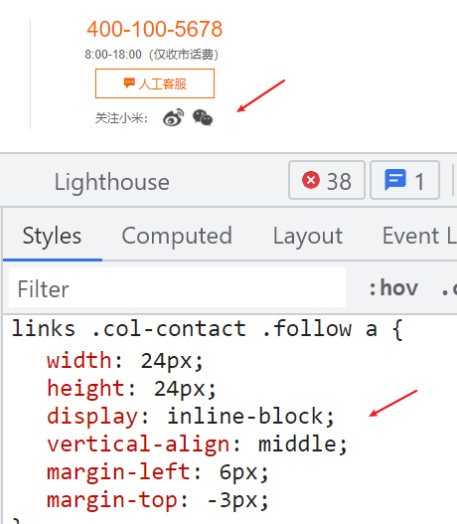


## 小技巧

如果一个盒子里面有图片和文字如何实现垂直居中呢？  图片左右有文字也么关系

```css
.box {
    height: 500px;
    background-color: pink;
    /* 让三个子盒子水平居中 */
    text-align: center;
    /* 让三个子盒子垂直居中 */
    line-height: 500px;
    /* vertical-align: middle; */
}

.box img {
    vertical-align: middle;
}
```

效果：

 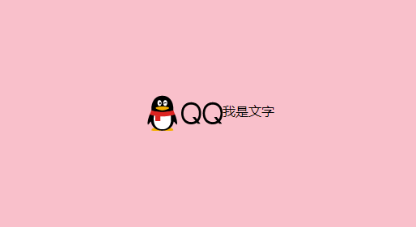

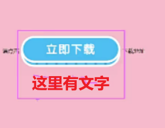


## 外边距塌陷和合并

外边距塌陷和合并主要发生下**垂直**情况下,意思是**只有标准流才会有**

**脱标**的盒子即使是垂直的也**不会**发生外边距合并（塌陷）

**已经加了固定和绝对定位不会有塌陷问题**

**能用padding，不用margin**防止外边距塌陷

如果非得要用margin，而且是标准流，会发生塌陷：

解决方案：

1.  给父亲添加 上   padding 或者 border  
2. 给父亲添加```overflow:hidden;``` 
3. 给它脱标

## 切图

切图是网页美工来做的，如果想要自己切图，需要按照ps （最好是完整版的）

参看视频


# 小技巧答疑

1. 关于标题 h 系列有默认的上下空隙解决方法

   ```css
   h1 {
       line-height: 1;
       /* 文字大小的1倍 */
   }
   ```

2. 一些装饰类的小图标，我们经常喜欢用的标签是 i  em span 等

   因为i和icon相似

3. 关于active 的使用。 给 **亲兄弟的盒子加**  如下 **给li** 不是给 a

    javascript角度找亲兄弟比较容易

   ```css
    <ul>
           <li>
               <a href="#">孩儿1</a>
           </li>
           <li class="active">
               <a href="#">孩儿2</a>
           </li>
           <li>
               <a href="#">孩儿3</a>
           </li>
           <li>
               <a href="#">孩儿4</a>
           </li>
       </ul>
   ```

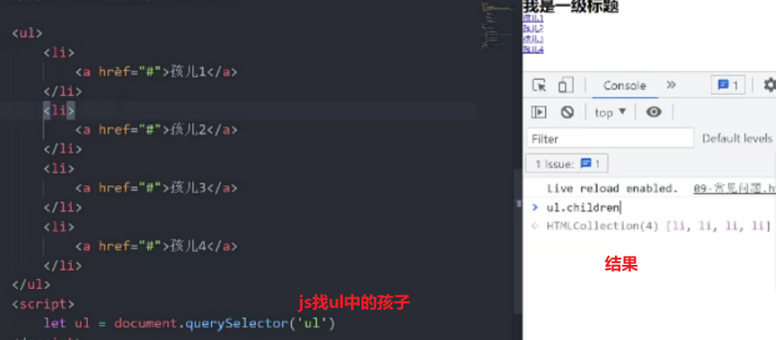


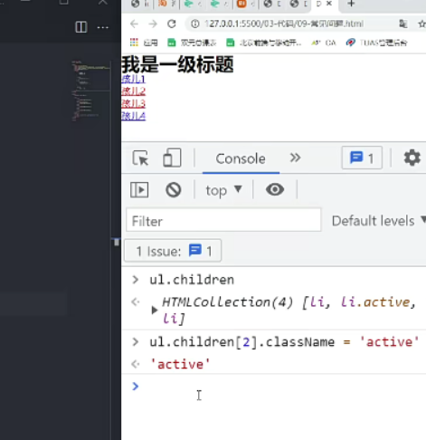


4. 链接什么使用li ，什么时候直接用链接

   - 重要的部分，比如导航栏 这些一定 li 包a  
   - 不太重要的部分，比如页面底部版权部分，就用 一大坨a 就可以
   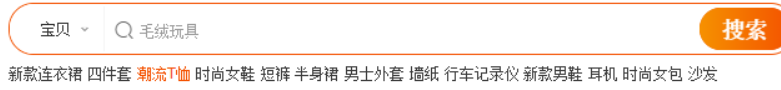

   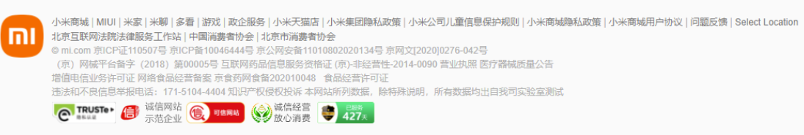

1. 盒子的命名问题,按英文翻译即可,不要用中文和拼音

2. 表格千万不要从来布局，主要用来展示数据的

3. 伪元素添加过渡效果

   ```css
    ul li::after {
        content: '\e666';
        float: right;
        transition: all .4s;
   }

   ul li:hover::after {
       transform: rotate(90deg);
   }
   ```

4. 权重问题
    查看权重

    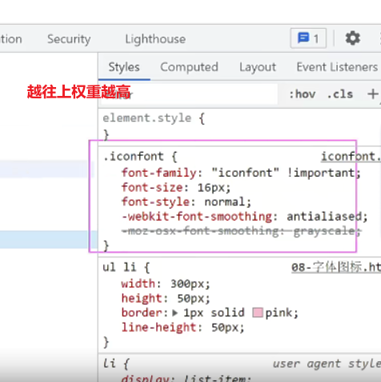

    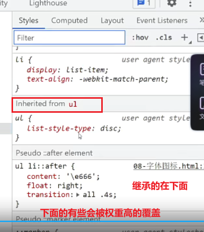


nofollow不重要链接

网页logo一般用h包