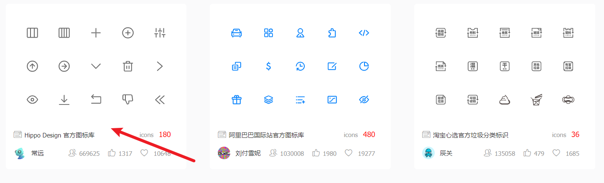
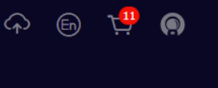
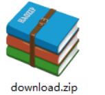
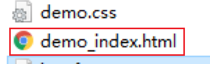
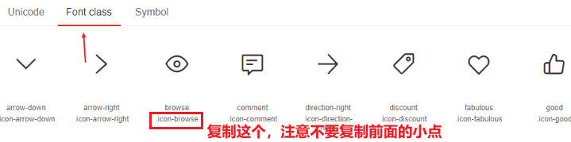
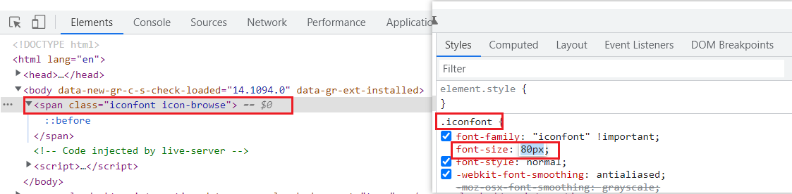
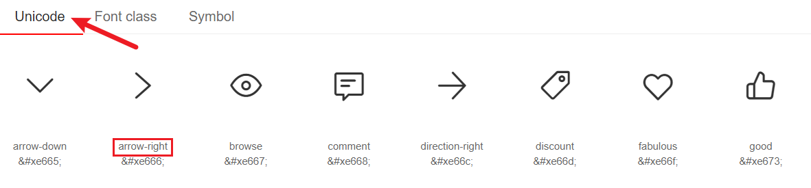
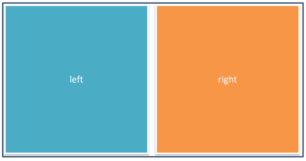

# 字体图标

常见的**装饰类小图标**我们经常使用**精灵图**或者**字体图标**

**精灵图：**

  比较复杂的小图标，如渐变或多种颜色，或公司独一无二的小图标

**字体图标：**

   简单的，常用的小图标，如小箭头，放大镜，购物车等

字体图标网站建议使用阿里巴巴字体图标

## 字体图标优点

1. 兼容性好
2. 修改样式和布局超级方便，把它当文字来看
3. 放大缩小不失真
4. 更换非常方便
5. .....反正很好用

## 字体图标网站

https://www.iconfont.cn/    阿里巴巴字体库


一般网页美工都有账号，或者公司都有专门的账号以供我们使用，个人练习可以自行注册

## 下载字体图标

 登录（新浪微博） → 选择图标库 → 选择图标，加入购物车 → 购物车 → 添加至项目 → 下载至本地（前端要干的活）

1. 官方字体图标库


2. 选择



3. 挑选需要的字体图标

 

4. 点击购物车

 

5. 下载代码

 

6. 得到压缩包

 

## 使用字体图标

### 字体图标引入文件

原理：iconfont.css文件是引入tff、woff这类字体文件，而HTML中又引用了iconfont.css，所以可以使用字体

iconfont.css文件的开头声明部分最重要，删除了将无法使用这些字体

iconfont.css文件声明部分的font-family说明这些字体的名称是什么

步骤：

1. 直接在项目的根目录新建一个fonts文件夹

2. 从压缩包里面取出2个文件，尾缀是 .ttf .woff的也可以复制

    

3. 把两个文件放入 fonts文件夹内

4. html 页面引入 iconfont.css 文件

```css
<link rel="stylesheet" href="./fonts/iconfont.css">
```

> 注意：写在首页的css文件前面，因为先引入文字css其他css才能使用
> ```html
><!-- 引入图标字体的css文件 -->
> <link rel="stylesheet" href="./fonts/iconfont.css">
><!-- 引入首页的css文件 -->
><link rel="stylesheet" href="./css/index.css">
>```

### 调用字体图标

#### 方法一：使用类名引入字体图标（重点记住）

```css
<span class="iconfont icon-xxx"></span>
```
在下载的压缩包打开该文件



在demo页面中 选择 Font class 选项



调用图标对应的类名，必须调用2个类名：
- iconfont类：基本样式，包含字体的使用等
- icon-xxx：图标对应的类名

css：

```css
.eye {
    /* 可以当作字体来直接改大小和颜色了 */
    color: red;
    font-size: 18px;
}
```

html：

```html
<div class="iconfont icon-browse eye"></div>
```

> 如果发现样式无法改，则直接使用Chrome检查，按下图步骤更改即可
> 
> 
>
> 根本原因是只有一个span权重不够
> 
> 改为这样既可
> ```css
> span.iconfont {
>   color: red;
>   font-size: 50px;
> }
> ```


#### 方法二：使用unicode编码

先在页面把该字体的值复制下来


css 要指定当前标签的文字是字体图标，必须要声明

css：

```css
button {
    width: 50px;
    height: 30px;
    background-color: #f40;
    color: #fff;
    border: 0;
}

button:hover {
    background-color: pink;
    color: red;
}
```

html：

```html
<!-- 该方法只适合在标签里面写，不适合在伪元素里面写 -->
<button class="iconfont">&#xe66f;</button>
```

>注意：该方法只适合在标签里面写，不适合在伪元素里面写 ,类似&#xe66f这样的值后面不可以省"```;```"

#### 方法三：使用伪元素字体图标

css：

```css
ul li {
    width: 300px;
    height: 50px;
    border: 1px solid pink;
    line-height: 50px;
}

ul li:after {
    content: '\e666';
    float: right;
}
```

html：

```html
<ul>
    <li class="iconfont">我是pink老师</li>
</ul>
```

另一种写法：

```html
<div class="car1">购物车</div>
```

这样结构比较的清晰，省了很多的小盒子

```css
.car {
      width: 200px;
      height: 45px;
      border: 1px solid pink;
      text-align: center;
      line-height: 45px;
      font-family: 'iconfont';
    }
.car::before {
    content: "\e63b";

}
.car::after {
    content: "\e686";
}
```
>注意： 使用伪元素字体图标，一定要声明字体。  font-family: "iconfont"


#### 伪元素里面content字体图标值的获取

1. 小发现，不一定正确
    
    如：&#xe66f，去掉e前面的所有值，再加上"```\```"就是content的值
    ```content: '\e66f';```

2. 根据引入的链接打开字体的css文件
    ```html
    <link rel="stylesheet" href="./fonts/iconfont.css">
    ```
    找到该字体图标的名字

    

    在字体css文件里面找相应名字的代码

    ```css
    .icon-arrow-right:before {
            content: "\e666";
    }
    ```

    把该content值复制下来即可


> 注意：iconfont这个类名也可以修改
> 1. 打开iconfont.css文件
>
> 2. 
>   
>
> 3. 
>   
>
> 4. 修改完成之后，引用时类名变为：
> ```html
> <span class="pink">&#xe677;</span>
> ```

### 如果图标库没有项目所需的图标怎么办？

IconFont网站上传矢量图生成字体图标
1. 与设计师沟通，得到SVG矢量图
2. IconFont网站上传图标，下载使用

上传矢量图：
- 上传 → 上传SVG图标
- 浏览本地图标 → 去除颜色提交
- 加入购物车 → 下载使用


### 小结

 开发中， 字体图标上传，选择，都是网页美工做的

重点是下载和使用

字体图标使用可以整体分为两大步骤：

1. 复制相关文件到网站根目录下，并引入css文件到html页面中

   - 通常都放到fonts文件夹里面
   - 通常iconfont.css 和字体放一起

2. 调用

   - 开发中最常用的是使用类名来调用，所以重点记住这个就可以了

     ```html
     <span class="iconfont icon-daohangdizhi"></span>
     ```
    - **一般开发都直接喜欢加小i就可以了，不需要加before、after**


# 平面转换

改变盒子在平面内的形态（位移、旋转、缩放）

2D转换

平面转换属性
- transform

## 变形 transform（2D）

## 位移 translate

translate可以让盒子沿着x轴或者y轴来移动。

语法：

```css
transform: translate(x, y);
transform: translateX(x);
transform: translateY(y);
transform: translateX(100%);
```

取值（**正负均可**）
- 像素单位数值
- 百分比（**参照物为盒子自身尺寸**）

技巧
- translate()如果只给出一个值, 表示x轴方向移动距离
- 单独设置某个方向的移动距离：translateX() & translateY()


与margin的区别：
   - margin移动盒子**会**影响其余的盒子。把其他人挤走
   - 位移translate移动盒子**不会**影响其他的盒子。不脱标
   - 可根据上面这两个区别来选用哪个

### 应用- 盒子水平和垂直

可以让一个子盒子在父盒子里面水平和垂直居中

```css
.inner {
  position: absolute;
  top: 50%;
  left: 50%;
  width: 100px;
  height: 100px;
  background-color: skyblue;
  transform: translate(-50%, -50%);
}

/* .inner {
  position: absolute;
  top: 0;
  left: 0;
  right: 0;
  bottom: 0;
  margin: auto;
  width: 200px;
  height: 200px;
  background-color: skyblue;
} */


/* 左侧全部充满 */
/* margin-left: auto; */
/* 右侧全部充满 */
/* margin-right: auto; */
```

### 开门大吉案例

效果：


分析：

①：准备一个大盒子

②：左右两个子盒子

③：鼠标经过，左右两个盒子分别两边拉动

④：鼠标离开，还原



要注意背景图片的位置

一开始默认位置是左上


要把盒子移动到右边


background-position: right;

```css
.box {
  overflow: hidden;
  width: 1366px;
  height: 600px;
  margin: 0 auto;
  background: url(./images/bg.jpg) no-repeat;
}

.box::before,
.box::after {
  content: '';
  width: 50%;
  height: 600px;
  /* 过渡 */
  transition: all .4s;
  background: url(./images/fm.jpg) no-repeat;
}

.box::before {
  float: left;
}

.box::after {
  float: right;
  background-color: purple;
  /* 背景图片右侧对齐 */
  background-position: right;
}

/* 鼠标经过谁 box，谁拉开  after before*/
/* before走的left盒子自身的宽度 */
.box:hover::before {
  transform: translateY(-100%);
}

.box:hover::after {
  transform: translateY(100%);
}
```


## 旋转 rotate

旋转可以让盒子旋转角度 

语法：

```css
transform: rotate(45deg);    一定写单位
```

> 角度单位是deg
>
> 取值正负均可
> 
> 如果是正度数，则是顺时针旋转
>
> 如果是负度数，则是逆时针旋转

### 设置中心点  transform-origin

**默认圆点是盒子中心点**

语法：

```css
transform-origin: 原点水平位置 原点垂直位置; 
```

取值：
- 方位名词（left、top、right、bottom、center）
- 像素单位数值
- 百分比（参照盒子自身尺寸计算）


```css
transform-origin: right bottom;
transform-origin: 20px 20px;
```

### 多形态变形小技巧

多重转换原理
- **旋转会改变网页元素的坐标轴向**
- 先写旋转，则后面的转换效果的轴向*以旋转后的轴向为准，会影响转换结果*

1. 如果需要移动，也需要旋转，则***一定先写移动，后写旋转, css属性书写顺序影响代码执行***

   ```css
    transform: translate(-50%, -50%) rotate(360deg);
   ```

2. 注意，多个值之前用 空格隔开

### 旋转效果案例


由于图片需要旋转，下面的代码会覆盖原先的位置代码，所以采取复合书写形式

```css
/* 鼠标经过大盒子 里面的1和3旋转 */
.an-box:hover .inner-img1 {
  /* 原来的定位会被冲突掉，所以要复合写 */
  transform: translate(-50%, -50%) rotate(-360deg);
}
```


## 缩放 scale

语法：

```css
transform: scale(x轴缩放倍数, y轴缩放倍数);
```

> 一般情况下, 只为scale设置一个值, 表示x轴和y轴等比例缩放
> ```transform: scale(缩放倍数);```
> 
> scale值>1表示放大, scale值<1表示缩小

用宽度和高度直接放大效果是沿着网页的x轴和y轴直接放大，没有过渡效果

比使用宽度和高度直接放大的的**优势**： 用中心点来进行缩放的，同时不会影响其他盒子，不占位


### 和平精英案例


多行文字超过显示省略号：
- display: -webkit-box;
- -webkit-box-orient: vertical;
- -webkit-line-clamp: 2;
- overflow: hidden;

## 斜切扭曲

```css
/* 如果第二个参数未提供，则默认值为0  */
transform: skew(x,y);
transform: skewx(x);
transform: skewy(y);
```


```css
.box {
  width: 200px;
  height: 200px;
  background-color: pink;
  margin: 100px auto;
  /* 变换： 倾斜 */
  /* transform: skew(度数); */
  transform: skew(-30deg);
}

.box:hover {
  transform: skew(0deg);
  transition: all .3s;
}
```


> 注意：度数是正数，扭向逆时针；复数是顺时针


# 渐变

使用background-image属性实现渐变背景效果

渐变是多个颜色逐渐变化的视觉效果

一般用于设置盒子的背景

基本语法：

```css
background-image: linear-gradient(方向，颜色1...，颜色n);
```

90deg：左到右

0deg：上到下

百分比：从哪个区域到哪个区域

css:

```css
linear-gradient(90deg, 
		#6fc2aa 5%, 
		#54b196 100%);

background-image: linear-gradient(rgba(0, 0, 0, 0), rgba(0, 0, 0, .5));

background-image: linear-gradient(to right, red, green, blue);
```

>  默认的方向是 to bottom 
> 
> 不写image也可以，但是习惯一般都写


# 空间转换

空间：是从坐标轴角度定义的。 x 、y 和z三条坐标轴构成了一个立体空间，z轴位置与视线方向相同

空间转换也叫3D转换

属性：transform

## 3D坐标系


>**一定要记住3个坐标轴取值的正反：**
>
>- X 轴 往右越大，是正值， 否则反之
>- Y 轴 往下越大，是正值，否则反之
>- Z轴 （指向我们）越大，是正值，否则反之   

## 3D位移

完整写法：

```css
transform: translate3d(x, y, z);
```
合起来写能把分开写的都做出来

只不过在很多情况下，我们经常喜欢分开写：

```css
transform: translateX(值);
transform: translateY(值);
transform: translateZ(值);
```

取值（正负均可）
- 像素单位数值
- 百分比（自身作为参考）

## 透视

透视的作用： 空间转换时，为元素添加近大远小、近实远虚的视觉效果（特别是z轴的移动加透视才看得出来）

语法:

```css
perspective: 800px;
```

**透视注意事项：**

1. 取值范围经常在**800px ~  1200px**之间（200看不见，201刚好占满屏幕）

2. **一定**给**父盒子**添加

3. 透视距离也称为视距，所谓的视距就是人的眼睛到屏幕的距离

   - 其中 d 为透视的距离
   - z 是 `translateZ` 的距离， 这个距离靠近我们，盒子越大，视距越小越明显
   - 肉眼看着像变大了，但元素实际宽高不变

   


perspective属性和translateZ( )都可以实现元素的近大远小的功能


## 3D旋转
  
**有了透视的加持，我们3d旋转效果会比较明显**

语法

```css
transform: rotateZ(值);
transform: rotateX(值);
transform: rotateY(值);
```
### rotateZ

和平面转圈类似

### rotateX 


> 注意：默认的旋转中心在盒子的中心位置

```css
 body {
     /* 父级添加透视 */
     perspective: 400px;
}

img {
    transition: all 1s;
}

img:hover {
    transform: rotateX(360deg);
}
```

效果展示：

 

### rotateY 

```css
body {
    perspective: 400px;
}

img {
    transition: all 1s;
}

img:hover {
    transform: rotateY(360deg);
}
```

效果如下：

 

### 拓展
- ```rotate3d(x, y, z, 角度度数) ```：用来设置自定义旋转轴的位置及旋转的角度
- x，y，z 取值为0-1之间的数字

## 左手法则

左手法则
- 判断旋转方向: 左手握住旋转轴, 拇指指向正值方向, 手指弯曲方向为旋转正值方向

 

规则：

1. 大拇指指向X轴正向方（右）， 则四指指向的方向是旋转的方向
2. 大拇指指向Y轴正向方（下）， 则四指指向的方向是旋转的方向


## 立体呈现 

让子盒子在父盒子内有空间的展示，此时可以给**父盒子**添加

```css
transform-style: preserve-3d;
```

- 添加 transform-style: preserve-3d;
- 使子元素处于真正的3d空间
- **默认值flat, 表示子元素处于2D平面内呈现**

呈现立体图形步骤：
1. 盒子**父元素**添加```transform-style: preserve-3d；```
2. 按需求设置子盒子的位置（位移或旋转）

> 注意：空间内，转换元素都有自已独立的坐标轴，互不干扰


### 实际操作中需要注意的

盒子的宽高刚好是200，则其中一面往前拉200正好是立体的

但是拉和自己盒子边框长度一样的距离不是很正确，原因如下图：


正确的做法是前后分别拉100，这样就是以盒子中心为轴线旋转了

```css
.front {
  background-color: orange;
  /* 向我们面前拉（移动）100像素 正值 */
  transform: translateZ(100px);
}

.back {
  background-color: green;
  transform: translateZ(-100px);
}
```
效果：


立体呈现有时候并不需要透视

一定要先移动在旋转


### 3d导航栏案例

1. 先让两个盒子叠放在一起
  ```css
  .nav li a span {
    /* 加定位才会叠放在一起 */
    position: absolute;
    top: 0;
    left: 0;
    width: 100%;
    height: 100%;
  }
  ```

2. 两者之间再进行相应的移动
   
   


**ul加透视不准，一般在li上面加**

   


**有a可以加透视，转起来更立体**

**通过a加旋转和3d转换是最好的**

**不要给非常大的盒子加透视，不然焦点会偏，最好是父盒子和子盒子一样大，然后给父盒子加透视**


## 3d缩放

语法

```css
transform: scaleX(倍数);
transform: scaleY(倍数);
transform: scaleZ(倍数);
transform: scale3d(x, y, z);
```


# 动画


构成动画的最小单元：帧或动画帧

常用的帧是：1s25张

动画最大的特点可以不用鼠标触发，自动的，反复的执行某些动画

## 动画使用分为定义和调用

**1. 定义：**

   ```css
   /* 1. 定义的动画 */
   @keyframes 动画名称 {

       from {
           transform: scale(1)
       }

       to {
           transform: scale(1.5)
       }
   }
   ```

   或者是

   ```css
    /* 1. 定义的动画 */
       @keyframes 动画名称 {

          0% {
           transform: scale(1)
         }  
         ...
         100% {
           transform: scale(1.5)
         }
       }
   ```

> @：声明的意思
>
> from... to... 只能改变开头和结尾的状态
>
> 开始就是初始状态可以省略from和0%，但是一般都是不省的，可以看动画从哪开始（绝对不能省！！！）
>
> 百分比是相对于调用时的动画时长来说的
>  
> 

**2. 调用**

  ```css
   img {
       /* 2. 使用动画  animation: 动画名称 动画时间;   infinite 循环*/
       animation: dance .5s infinite;
   }
  ```

## 使用animation相关属性控制动画执行过程


```css
animation:动画名称 动画时长 速度曲线 延迟时间 重复次数 动画方向 执行完毕时状态
```

> 注意：
> - **动画名称和动画时长必须赋值**
> - **取值不分先后顺序**
> - 动画时长和延迟时间别忘了带单位 s
> - 如果有2个时间值，第一个时间表示动画时长，第二个时间表示延迟时间


速度曲线如下图所示：


常使用的属性：


### 使用steps实现逐帧动画

补间动画：看起像发条一样拉动

逐帧动画：和平常看的动画一样


```animation-timing-function: steps(N)；```
- 将动画过程等分成N

精灵动画制作步骤
- 准备显示区域
  - 设置盒子尺寸是一张**小图(小人物的大小)**的尺寸，背景图为当前精灵图（**小图多大盒子就多大**）
- 定义动画
  - **改变背景图的位置**（**移动的距离就是精灵图的宽度**）
- 使用动画
  - 添加速度曲线steps(N)，**N与精灵图上小图个数相同（即图上有多少个小人），速度可调**
  - 添加无限重复效果

### 鼠标经过暂停动画

```css
/* 鼠标经过box，  则 ul 停止动画 */
.box:hover ul {
    animation-play-state: paused;
}
```
哪个元素使用了动画，就给哪个元素暂停

## 使用animation属性给一个元素添加多个动画效果

###  多组动画

如果想让小人跑远一些，该如何实现？
- 精灵动画的同时添加盒子位移动画

语法：

```css
animation:动画1,动画2,动画N
```

css：

```css
animation:run 1s steps(12) infinite,move 3s linear forwards;
```

> 多组动画不能合并，只能用逗号分隔

案例：

```css
.box {
  width: 140px;
  height: 140px;
  /* background-color: pink; */
  background: url(./images/bg.png) no-repeat;
  /* 调用动画   step 步  分几步走 */
  /* 多组动画用逗号分割 */
  animation: move 1s steps(12) infinite, run 5s forwards;
  /* animation: run 2s; */
}

/* 定义动画 逐帧动画*/
@keyframes move {
  from {
    background-position: 0 0;
  }

  to {
    background-position: -1680px 0;
  }
}

/* 移动的动画 */
@keyframes run {
  from {
    transform: translateX(0px);
  }

  to {
    transform: translateX(800px);
  }
}
```

## 综合案例

### 跑马灯

1. 让li左浮动,发现有些图片在第二行，这个时候把ul加长，ul的长度=所有图片加起来的总长

   

2. **给ul加动画效果**，移动的长度=ul的width（ul动即可，li有7个动起来会很乱）
   
   动起来发现有缝隙

   
  
3. 需要在ul后面补长度（**盒子显示几个就补几个的长度，补的是和前几个显示的一样**）
   
   

4. 开始设置动画，注意这时还是走新的ul的长度（不一定是ul的长，但肯定是所有li的加起来的长度）
   
   
    
   
### 全民出游案例

动画的效果，放大、缩小、放大

会动的尽量放在中间再去绝对定位移动

会动的元素放在一组里面，先整体移动到中间，个别在进行位移(一ing木中间以屏幕中间为轴)

   

   

   


# 总结

## transition 和  animation的区别
   ```css
   transition:  属性  花费时间   速度曲线   延时时间;
   ```

  ```css
  transition: width 2s ease 1s;   
  ```

  ```css
  animation: 动画名称   花费时间  速度曲线  延时时间   重复次数  动画方向  执行完毕的状态;
  ```

   - 过渡经常配合鼠标经过使用，只能设置起始和结束状态

   - 动画可以自动执行也可以暂停，而且无限循环等。（其中 动画名称和花费时间必须要写）


## perspective 和 transform-style 区别
   - perspective  是透视，可以让电脑模拟 3d效果， 实现近大远小的效果
   -  transform-style 立体呈现 可以让 子元素 里面按照设置位移，旋转，缩放，扭曲等。如果不给父元素这个属性，这里面所有的子盒子都是平面的
   - 正常情况下： **爷爷设置perspective、父亲设置transform-style: preserve-3d、孩子们设置位移，旋转，缩放，扭曲等**
