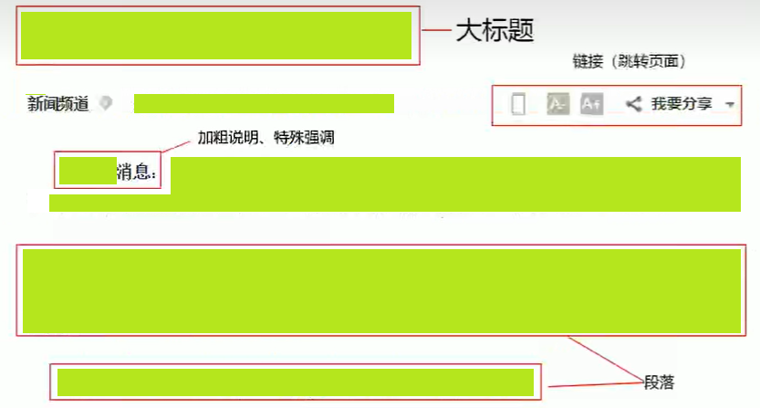

# HTML初识
## HTML骨架标签
```html
<html>
    <head>
        <title></title>
    </head>
    <body>
    </body>
</html>
````
### 团队约定大小写
HTML 标签名、类名、标签属性和大部分属性值统一用小写（推荐）

### 总结


## HTML 元素标签分类

1、常规元素（双标签）
```html
<标签名></标签名>
```
2、空元素（单标签）
```html
<标签名/>
```


## HTML标签关系
1、嵌套关系(父子) 最好缩进
```html
<head>
    <title></title>
</head>
```
2、并列关系(兄弟)
```html
<head></head>
<body></body>
```


# 文档类型
```html
<!DOCTYPE html>
```
告知文档使用的是HTML或XHTML规范

**团队约定**

使用DOCTYPE说明使用HTML5

# 页面语言lang
指定html标签 内容 所用的语言为中文
**团队约定**
zh-CN

**扩展阅读**

可告诉浏览器，搜索引擎，一些处理Html的程序对页语言内容来做一些对应的处理或者事情。
比如：
- 根据根据lang属性来设定不同语言的css样式，或者字体
- 告诉搜索引擎做精确的识别
- 让语法检查程序做语言识别
- 帮助翻译工具做识别

# 字符集
```html
<meta chartset="UTF-8"/>
```
```
字符集(Character set)是多个字符的集合。
计算机要准确的处理各种字符集文字。需要进行字符编码，以便计算机能够识别和存储备种文字。
```
utf-8是目前最常用的字符集编码方式，常用的字符集编码方式还有gbk和gb2312。
- gb2312简单中文包括6763个汉字GUO BIAO
- BIG5繁体中文港澳台等用
- GBK包含全部中文字符是GB2312的扩展，加入对繁体字的支持，兼容GB2312
- UTF-8则基本包含全世界所有国家需要用到的字符。
- ***这句代码非常关键，是必须要写的代码，否则可能引起乱码的情况。***
```
让html文件是以UTF-8编码保存的，浏览器根据编码去解码对应的html内容
```
**团队约定**

一股情况下统一使用“UTF-8”编码

# HTML标签的语义化
标签的含义

语义化目的：
根据标签的语义,在合适的地方给一个最为合理的标签，让结构更清晰。
1. 方便代码的阅读和维护
2. 同时让浏览器或是网络爬虫可以很好地解析，从而更好分析其中的内容
3. 使用语义化标签会具有更好地搜索引擎优化

语义是否良好：去掉CSS后，网页结构依然组织有序，并且有良好的可读性。(裸奔起来一样好看)

遵循的原则：先确定语义的HTML，再选合适的CSS。据语义记忆。HTML网页中任何元素的实现都要依靠HTML标签




