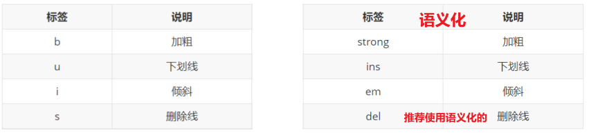
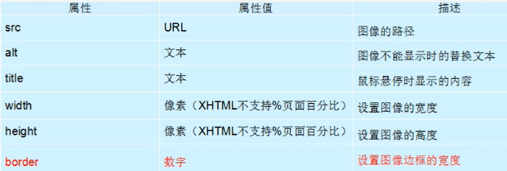
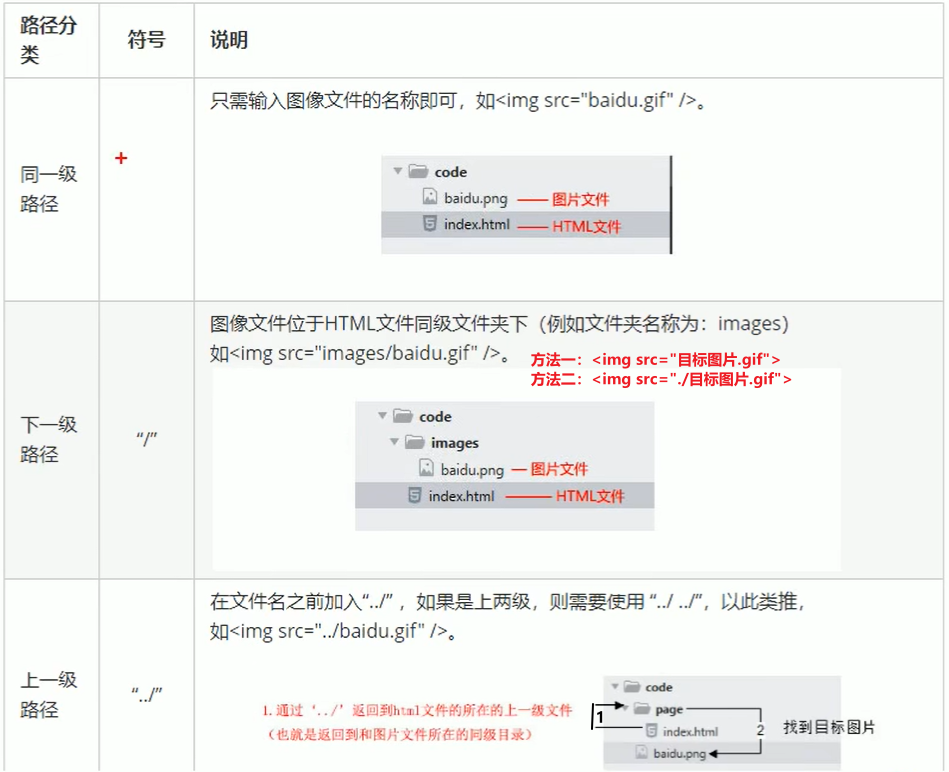
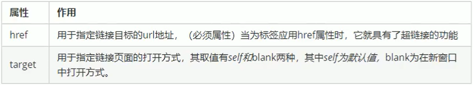
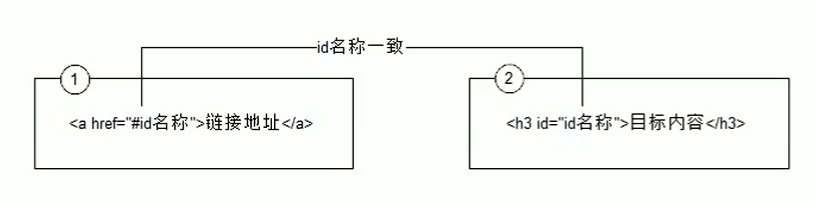
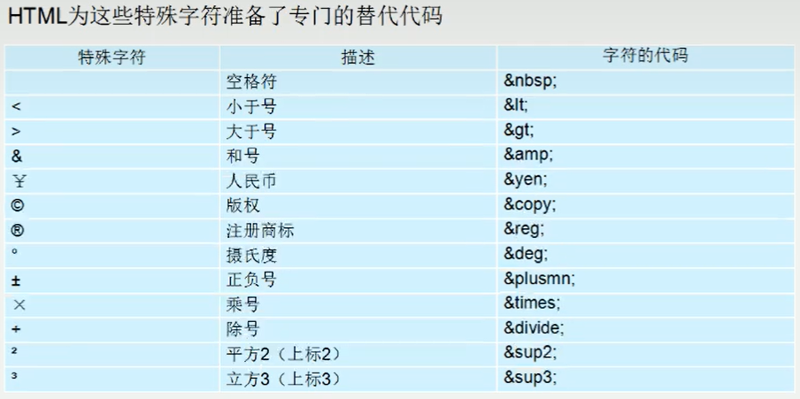
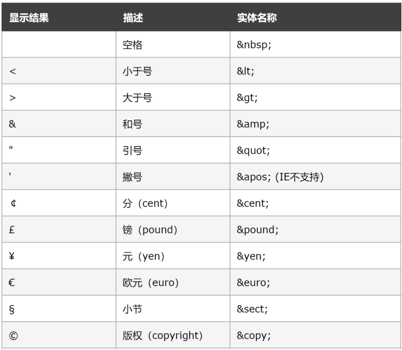
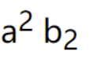

# HTML常用标签
## 排版标签
主要搭配css，显示网页结构，网页布局最常用
### 标题标签 h
单词缩写：head头部.标题title文档标题

为了使网页更具有语义化，我们经常会在页面中用到标题标签，HTML提供了6个等级的标题，即**标题标签语义**：作为标题使用。并且依据重要性递减

其基本语法格式如下:
```html
<h1>一级标题</h1>
<h2>二级标题</h2>
<h3>三级标题</h3>
<h4>四级标题</h4>
<h5>五级标题</h5>
<h6>六级标题</h6>
```
> 只有6级标题
> 
> 一行只能放一个标题


### 段落标签 p
```html
<p>文本内容</p>
```
会根据浏览器的大小自动换行

### 水平线标签 hr
创建横跨网页水平线的标签
```html
<hr/>
```
### 换行标签 br
```html
<br/>或者<br>
```
### div和span标签
div span  是没有语义的 网页布局主要的2个盒子  css+div

div 分割，分区的意思 其实有很多div来组合网页。

span 跨度，跨距;范围

语法格式:
```html
<div>这是头部</div>  <span>今日价格</span>
```
都是盒子，用来装我们网页元素的，区别：
- div：布局一行只能放一个div
- span：布局，一行可有多个span


## 文本格式化标签

实际开发中选择标签的原则：标签语义化,即：根据语义选择对应正确的标签
- 标题，用h系列标签
- 段落，用p标签
- ……
  
好处：
- 对人：好理解，好记忆
- 对机器：有利于机器解析，**对搜索引擎（SEO）**有帮助

## 标签属性
```html
<标签名 属性1="属性值1" 属性2="属性值2" ...>内容</标签名>
```
属性注意点：
1. 标签的属性写在开始标签内部
2. 标签上可以同时存在多个属性
3. 属性之间以空格隔开
4. 标签名与属性之间必须以空格隔开
5. 属性之间没有顺序之分
   

## 媒体标签
### 图像标签
```html

```
**``````标记属性**


注意：
- border会用css来做，一般在这不使用
- 只设置width或height中的一个，另一个没设置的会自动等比例缩放（此时图片不会变形）
- 同时设置了width和height两个，若设置不当此时图片可能会变形
  
### 路径
***目录文件夹***

    同一素材，同一文件夹下面

***根目录***

    打开目录文件夹的第一层


#### 绝对路径
目录下的绝对位置，可直接到达目标位置，通常从盘符开始的路径

如：
- 盘符开头：D:\day01\images\1.jpg
- 完整的网络地址：https://www.itcast.cn/2018czgw/images/logo.gif（了解）

#### 相对路径



VSCode中路径的快捷操作？
- 同级和下级目录：./ 之后选择即可
- 上级目录：../ 之后选择即可

### 音频标签
```html
<!-- 属性值=属性名的可以省略 -->
    <audio src="./img/music.mp3" controls autoplay loop>
        您的浏览器版本太低了，请换一个
    </audio>
    <!-- 无法播放时会显示该文字 -->

```
常见属性：
- controls：显示播放音频的控件（该属性属性值可省略）
- autoplay：音频加载完毕会自动播放（该属性部分浏览器不支持，了解）
- loop：当音频结束时重新开始播放（了解）

注意点：
- 音频标签是HTML5中新增标签，老版本浏览器无法识别（兼容性问题）
- 音频标签目前支持三种格式：MP3（最多/好这种）、Wav、Ogg


### 视频标签
```html
 <!-- muted 静音  视频就可以自动播放了 -->
    <video src="./img/video.mp4" controls autoplay muted></video>
    <!-- 视频太大，一般不保存在本地，可在B站复制代码 -->
    <iframe src="//player.bilibili.com/player.html?aid=648492810&bvid=BV1Se4y1u7aX&cid=913889142&page=1" scrolling="no"
        border="0" frameborder="no" framespacing="0" allowfullscreen="true" width="600" height="600"> </iframe>
```
常见属性：
- controls：显示播放视频的控件（该属性属性值可省略）
- autoplay：视频加载完毕会自动播放（拓展：在谷歌浏览器中可以配合muted属性实现自动静音播放）
- loop：当视频结束时重新开始播放（了解）

注意点：
- 视频标签是HTML5中新增标签，老版本浏览器无法识别（兼容性问题）
  ```html
  <video src="./img/video.mp4" controls autoplay muted>
        您的浏览器版本太低了，无法播放视频！
  </video>
    <!-- 无法播放时会显示该文字 -->
    ```
- 视频标签目前支持三种格式：MP4, WebM, 和 Ogg

## 链接标签
```html
<a href="跳转目标" target="目的窗口弹出方式">文本或图像</a>
```



1. <font color="dd0000">**外部链接**</font>：
   
   如 
   ```html 
   <a href="http://www.baidu.com">百度一下</a >
   ```
2. <font color="dd0000">**内部链接**</font>：
   
   直接链接内部页面名称，比如
   
   ```html 
   <a href="index.html">首页</a >
   ```
3. <font color="dd0000">**空链接**</font>：
   
   点击之后回到网页顶部
   
   开发中不确定该链接最终跳转位置（先用空链接占个位置），如
   ```html
   <a href="#">星座</a>
   ```
4. 不仅可以创建文本超链接，在网页中各种网页元素，如图像、表格、音频、视频等都可以添加超链接
    
   如，图像链接：
   ```html
   <a href="http://www.baidu.com" target="_blank"></a>
   ```

## 注释标签
```html
   <!-- 注释语句 --> 快捷键：ctrl+/ 
```
**团队约定**

注释位于代码的上面，单独一行
```html
<!-- Comment Text -->
<div>...</div>
```

# 拓展阅读
## 锚点定位
快速定位到目标内容。

创建锚点链接分为两步:
```html
1. 使用相应的id名标注跳转目标的位置。(找目标)
   <h3 id="two">第2集</h3>

2．使用<a href"=id名">链接文本</a>创建链接文本（被点击的）（拉关系）我也有一个姓毕的姥爷..
   <a href="#two">
```


## base标签
```html
<base target="_blank"/>
```
所有链接以新窗口打开页面

总结:
1. base可以设置整体链接的打开状态
2. base 写到```<head> </head>```之间
3. 把所有的连接都默认添加 target=" _blank"
   
## 预格式化文本pre标签

定义预格式化的文本。|
被包围在```<pre>```标签元素中的文本通常会保留空格和换行符。而文本也会呈现为等宽字体。
```html
<pre>
此例演示如何使用pre标签

对空行和 空格

进行控制
</pre>
```
按照我们预先写好的文字格式来显示页面，保留空格和换行等。
因不好整体控制，比较少用

## 特殊字符
很难或者不方便直接使用的




重点记住空格、大于号、小于号
总结:
1. 是以运算符&开头，以分号运算符;结尾。
2. 他们不是标签，而是符号。
3. HTML中不能使用小于号"<"和大于号">"特殊字符，浏览器会将它们作为标签解析，若要正确显示，在HTML源代码中使用字符实体

**团队约定**

```html
<a href="#">more &gt;&gt;</a>
```
不推荐:
```html
<a href="#">more >> </ a>
```

## 上标和下标
sup上标
    
sub下标

```html
a <sup>2</sup> 
b <sub>2</sub>
```

效果：



