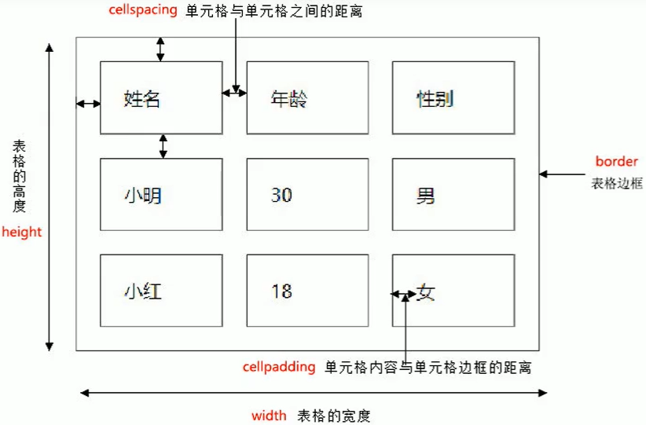
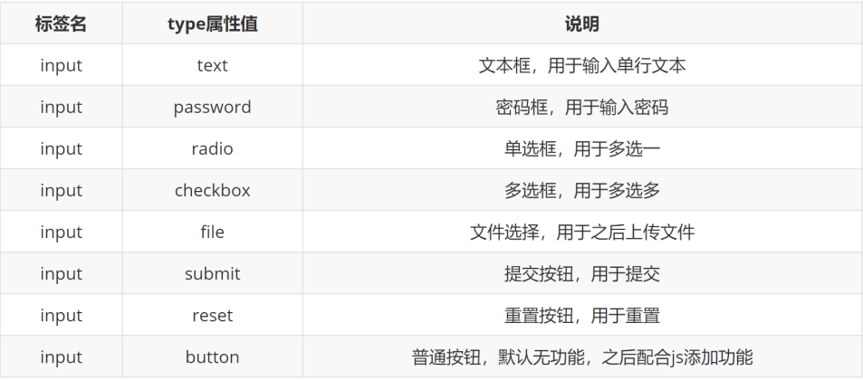

# 列表标签

## 无序列表(最常用)
```html
<ul>
    <li>列表项1</li>
    <li>列表项2</li>
    <li>列表项3</li>
    ...
</ul>
```
在网页中表示一组无顺序之分的列表

显示特点：
- 列表的每一项前默认显示圆点标识
- 样式一般用CSS来写
> 注意点：
> - ul标签中只允许包含li标签
> - li标签可以包含任意内容

如：
```html
<ul>
    <li>苹果</li>
    <li>
        <p>蔬菜水果</p>
        <ul>
            <li>圣女果</li>
            <li>黄瓜</li>
            <li>
                <div></div>
                
                ...
            </li>

        </ul>
    </li>
</ul>
```
一般用来布局


## 有序列表(偶尔用)
```html
<ol>
    <li>列表项1</li>
    <li>列表项2</li>
    <li>列表项3</li>
    ...
</ol>
```
在网页中表示一组有顺序之分的列表

显示特点：
- 列表的每一项前默认显示序号标识
> 注意点：
> - ol标签中只允许包含li标签
> - li标签可以包含任意内容


## 自定义列表(底部导航用)
```html
<dl>
    <dt>名词1</dt>
    <dd>名词1解释1</dd>
    <dd>名词1解释2</dd>
    ...
    <dt>名词2</dt>
    <dd>名词2解释1</dd>
    <dd>名词2解释2</dd>
    ...
</dl>
```
在网页的底部导航中通常会使用自定义列表实现

显示特点：
- dd前会默认显示缩进效果
> 注意点：
> - dl标签中只允许包含dt/dd标签
> - dt/dd标签可以包含任意内容
如：
```html
<dl>
    <dt>帮助中心</dt>
    <dd>账户管理</dd>
    <dd>购物指南</dd>
    <dd>订单操作</dd>
</dl>
```


# 表格标签

## 基本标签
```html
<table>
    <tr>
        <td>单元格内的文字</td>
        ...
    </tr>
    ...
</table>
```
在网页中以行+列的单元格的方式整齐展示和数据

> 注意点：
> - 标签的嵌套关系：table > tr > td 
>- 表格的主要目的是用来显示特殊数据的
>- 一个完整的表格有表格标签(table)，行标签(tr)，单元格标签(td)组成，无列的标签  
> - ```<tr></tr>```中只能嵌套```<td></td>```类的单元格
>- ```<td></td>```标签，他就像一个容器，可以容纳所有的元素


## 相关属性



> 注意点：
> - 实际开发时针对于样式效果推荐用CSS设置


## 表格标题和表头单元格标签
在表格中表示整体大标题和一列小标题

> 注意点：
> - caption标签书写在table标签内部，只在表格里才有意义
> - th标签书写在tr标签内部（用于替换td标签）

### 表头单元格：


### 表格标题
```html
<table>
    <caption>我是表格标题</caption>
</table>
```


## 表格的结构标签
让表格的内容结构分组，突出表格的不同部分（头部、主体、底部），使语义更加清晰


> 注意点：
> - 表格结构标签内部用于包裹tr标签
> - 表格的结构标签可以省略
> - ```<thead></thead>```：用于定义表格的头部。用来放标题之类的东西。```<thead>```内部必须拥有```<tr>```标签
> - ```<tbody</tbody>```：用于定义表格的主体。放数据本体
> - ```<tfoot></tfoot>```放表格的脚注之类。
> - 以上标签都是放到table标签中


## 合并单元格
将水平或垂直多个单元格合并成一个单元格

### 合并单元格思路
合并单元格步骤：
1. 明确合并哪几个单元格
2. 通过左上原则，确定保留谁删除谁
   - 上下合并→只保留最上的，删除其他
   - 左右合并→只保留最左的，删除其他
3. 给保留的单元格设置：跨行合并（rowspan）或者跨列合并（colspan）
   


> 注意点：
> - 只有同一个结构标签中的单元格才能合并，不能跨结构标签合并（不能跨：thead、tbody、tfoot）


# 表单信息
在HTML中，一个完整的表单通常由表单控件(也称为表单元素)、提示信息和表单域3个部分构成。


## input系列标签
```html
<input type="属性值" placeholder="请您输入昵称">
```
在网页中显示收集用户信息的表单效果
- input输入的意思
- ```<input />```标签为单标签
- type属性设置不同的属性值用来指定不同的控件类型
- 除了type属性还有别的属性

常用属性:




### 文本框
输入单行文本的表单控件

type属性值：text

常用属性：


### 密码框
输入密码的表单控件

type属性值：password

常用属性（同文本框）
> - type属性值不要拼错或者多加空格，否则相当于设置了默认值状态：text→文本框
> - 密码是否可见其实是type的值在text/password之间切换

### 单选框
```html
 <input type="radio" name="sex" checked> 
```
多选一的单选表单控件

type属性值：radio

常用属性：


> 注意点：
> - name属性对于单选框有分组功能，主要作用就是区分不同的表单，在ajax和后台的时候必须使用
> - 有相同name属性值的单选框为一组，一组中只能同时有一个被选中
> - checked可以只写checked，因为属性和属性值名称相同

### 复选框
多选多的多选表单控件

type属性值：checkbox

常用属性（同单选框）：


### 文件选择
显示文件选择的表单控件

默认只能选一个文件

type属性值：file

常用属性：


### 按钮
```html
<!-- value 值  可以改变按钮显示的文字-->
<input type="submit" value="提交所填">
<input type="reset" value="重新填写">
<input type="button" value="普通按钮">
<!-- 图片提交按钮 里面必须包含src属性 -->
<input type="image" src="img/cat.gif" alt="">
```
显示不同功能的按钮表单控件

type属性值：


> 注意点：
> - 如果需要实现以上按钮功能，需要配合form标签使用，form标签会把所有数据提交到后台
> - form使用方法：用form标签把表单标签一起包裹起来即可


## button按钮标签
```html
<!-- <button type="reset">重置按钮</button>
    <button type="submit">提交按钮</button>
    <button type="button">普通按钮</button> 
     一般不会这么写  -->
    <button>搜索</button> 
    <!-- 开发中一般用这种写法 -->
```
显示用户点击的按钮

type属性值（同input的按钮系列）：


>  注意点：
> - 谷歌浏览器中button默认是提交按钮
> - button标签是双标签，更便于包裹其他内容：文字、图片等


## select下拉菜单标签(开发中很少用到)
提供多个选择项的下拉菜单表单控件

标签组成：
- select标签：下拉菜单的整体
- option标签：下拉菜单的每一项

常见属性：
- selected：下拉菜单的默认选中


## textarea文本域标签
提供可输入多行文本的表单控件

常见属性：
- cols：规定了文本域内可见宽度
- rows：规定了文本域内可见行数
> 注意点：
> - 右下角可以拖拽改变大小（实际开发中最好不要）
> - 实际开发时针对于样式效果推荐用CSS设置
> - 实际开发中不会用cols和rows，一般只有maxlength

文本框和文本域的区别


## label标签
用于绑定内容与表单标签的关系

目标：label标签主要目的是为了提高用户体验。为用户提高最优秀的服务。

概念：label标签为input元素定义标注〔标签)。

作用：用于绑定一个表单元素，当点击label标签的时候被绑定的表单元素就会获得输入焦点。

使用方法①：
1. 使用label标签把内容（如：文本）包裹起来
2. 在表单标签上添加id属性
3. 在label标签的for属性中设置对应的id属性值
```html
<input type="radio" name="sex" id="nv">
<label for="nv">女</label>
```
使用方法②：
1. 直接使用label标签把内容（如：文本）和表单标签一起包裹起来
2. 需要把label标签的for属性删除即可
```html
<label>
    <input type="radio" name="marry" id="">
    未婚
</label>
```


# 表单域

```html
<form action="url地址" method="提交方式" name="表单名称">
    各种表单控件...
</form>
```

收集的用户信息通过form表单域递给服务器

目的：在HTML中，form标签被用于定义表单域，以实现用户信息的收集和传递，form中的所有内容都会被提交给服务器。

常见属性：


> 注意:
> 
> 每个表单都应该有自己表单域。我们现在做页面，不写看不到效果，但是如果后面学ajax后台交互的时候，必须需要form表单域。


# 布局标签

## 没有语义的布局标签
场景：实际开发网页时会大量频繁的使用到div和span这两个没语义的布局标签

div标签：一行只显示一个（独占一行）

span标签：一行可以显示多个


## 有语义的布局标签
在HTML5新版本中，推出了一些有语义的布局标签供开发者使用，一般是在移动端使用


> 注意点：
> 以上标签显示特点和div一致，但是比div多了不同的语义