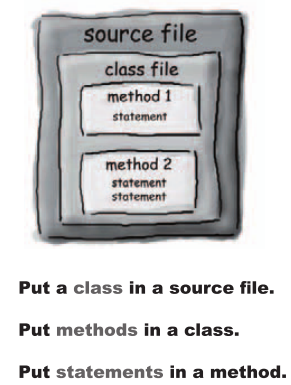
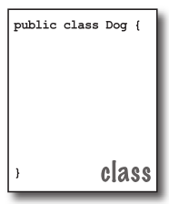
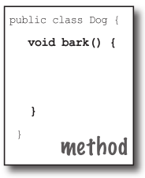
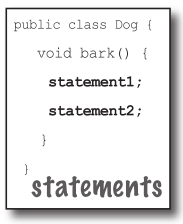
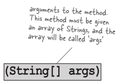
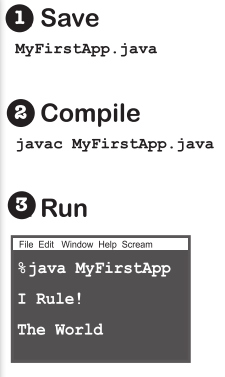

# Java基本知识

# Java中的4个重要概念

Java支持<span style="color:red;">**抽象、封装、多态和继承**</span>。这是面向对象程序设计的4大理论原则。
但是Java还使用了三个进一步的OOP概念：关联、聚合和组合。

抽象：abstraction

封装：encapsulation

多态：polymorphism

继承：inheritance

关联：association

聚合：aggregation

组合：composition

# Java的基本结构和知识

## 版本

Micro Edition（J2ME） for Mobile Applications

Standard Edition （J2SE）

Enterprise Edition（J2EE）

## Java的执行机制

键入一个源代码文件，使用javac编译器对其进行编译，然后在Java虚拟机上运行编译后的字节码

当Java被编译时，它并不被编译成特定于平台的机器，而是被编译成与平台无关的字节码。这个字节码分布在web上，并由运行它的平台上的虚拟机 (JVM) 解释

### 1. Source

输入你的源代码另存为：Party.java

### 2. Compiler

通过运行javac(编译器应用程序)编译Party.java文件。如果没有错误，您将得到第二个名为Party.class的文档

编译器生成的party.class文件由字节码组成

### 3. Output(code)

编译代码：Party.class

### 4. Virtual Machines

通过使用Party.class文件启动Java虚拟机（JVM）来运行程序。JVM将字节码转换为底层平台能够理解的东西并运行程序

## java的代码结构



### 源代码文件里包含什么

一个源代码文件(扩展名为.java)包含一个类定义。类表示程序的一部分，尽管一个非常小的应用程序可能只需要一个类。这个类必须在一对花括号内



### 类里面有什么

一个类有一个或多个方法。在Dog类中，bark方法将包含Dog应该如何吠叫的指令。你的方法必须在类内声明（换句话说，在类的花括号内声明）



### 方法里面有什么

在方法的花括号内，写出如何执行该方法的说明。方法代码基本上是一组语句，现在你可以把方法想象成一个函数或过程



## 类的分析

当JVM开始运行时，它会查找你在命令行给它的类。然后开始寻找一个专门编写的方法，看起来就像

```java
public static void main (String[] args) {
		// your code goes here
}
```

接下来，JVM运行main方法的花括号{}之间的所有内容。<span style="color:red;">**每个Java应用程序**</span>必须<span style="color:red;">**至少有一个类和至少一个main方法**</span>（不是每个类有一个main；每个应用程序只有个main）



## 写一个带有main函数的类

在Java中，所有的东西都放在一个类中

键入源代码文件（扩展名为.java），然后将其编译成一个新的类文件(扩展名为.class)。当你运行程序时，你实际上是在运行一个类。

运行程序意味着告诉Java虚拟机(JVM)“加载Hello类，然后开始执行它的`main()`方法。继续运行，直到main中的所有代码完成。”

如何编写Java代码，使它可以运行?

一切都是从`main()`开始的。`main()`方法是程序开始运行的地方。无论程序有多大（换句话说，无论程序使用多少个类），都必须有一个`main()`方法才能开始工作

```java
public class MyFirstApp {
		public static void main (String[] args) {
				System.out.println("I Rule!");
				System.out.println("The World");
		}
}
```



## 方法里面可以做些什么

语句：声明、赋值、方法调用等

循环

条件判断

### 常见的语法

每句话后面必须要有分号

单行注释以两个正斜杠开始

多出来的空格没关系    `x   =   3`

变量声明必须包含<span style="color:red;">**类型**</span>和<span style="color:red;">**名字**</span>

类和方法必须在一对花括号内定义

不是每个类都要写主函数，整个程序只需要一个

赋值运算符是一个等号  `=`

equals运算符使用两个等号   `==`   

while循环运行其块(由花括号定义)中的所有内容，只要条件测试为true
如果条件测试为false，则while循环代码块将不运行执行将向下移动到紧接在循环块之后的代码

在圆括号内放一个布尔测试

## 一些疑问

### 为什么所有的东西都要在一个类?

Java是一种面向对象（OO）语言。它不像过去那样使用蒸汽驱动的编译器，用一堆过程编写一个单一的源文件。类是对象的蓝图，<span style="color:red;">**Java中几乎所有的东西都是对象**</span>

### Java中，可以对一个整数进行布尔测试吗，比如：

```java
int x = 1;
while(x){}
```

<span style="color:red;">**数字布尔和整数在Java中是不兼容的类型**</span>。因为条件测试的结果必须是布尔值，所以唯一可以直接测试的变量（不使用比较运算符）就是布尔值。例如，可以这样：

```java
boolean isHot = true;
while(isHot){}
```

## 区别

> **`System.out.print`**   vs.   **`System.out.println`**
>
>**`System.out.println`** 插入一个换行符（可以将`printIn`看作`printnewline`）
>
>**`System.out.print`** 保持打印到同一行
如果想打印出来的每一个东西都在它自己的行上，使用 **`System.out.println`**
>
>如果想让所有的东西都在一条线上，使用 **`System.out.print`**

## 虚拟机和编译器

### 虚拟机

真正运行程序的，执行编译器给的.class文件

有些错误还是通过了，可以抛出class- CastException，有时候会遇到有人试图把错误类型的东西放到一个声明了其他东西的数组中

也做相同的安全工作，虽然只是为了确保没有人偷偷在编译器之后，改变了字节码，然后再运行它

### 编译器

Java被设计成使用字节码编译器是有原因的，。如果Java是一种纯粹的解释性语言，在运行时，虚拟机必须直接从文本编辑器翻译源代码，那么Java程序的运行速度将非常缓慢。Java花了很大的时间说服人们它的速度和功能终于足以胜任大多数工作

Java是一种强类型语言，这意味着编译器不能允许变量保存错误类型的数据。这是一个至关重要的安全功能，能够在还没有到达虚拟机之前阻止绝大多数违规行为

那里可能出现的一些数据类型异常运行时运行，但其中一些必须是允许支持Java的另一个重要特性一一动态绑定。在运行时，Java程序可以包含新的对象，这些对象甚至是原始程序员所不知道的，所以必须允许一定的灵活性

但本工作是阻止任何在运行时永远不会成功的东西，通常我可以告诉什么时候东西不会工作，例如，如果一个程序员意外地试图使用一个按钮对象作为一个Socke连接，会检测到这一点，从而保护他在运行时造成伤害

安全的第一道防线。如果允许前面描述的数据类型违规行为显现出来它们可能会在程序中造成严重破坏

防止访问冲突，比如代码试图调用私有方法，或者更改出于安全原因永远不能更改的方法

阻止人们接触他们不想看到的代码，包括试图访问另一个类的关键数据的代码

如果编译器不阻止可能高达99%的潜在问题，JVM会慢慢停下来