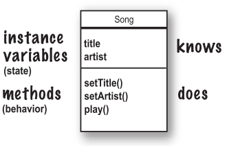
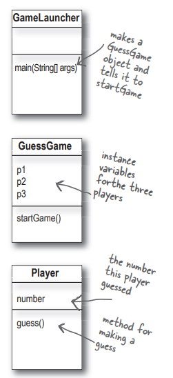

# 设计类时要考虑的

在设计Java类的时候，你需要考虑的最基本的东西是什么?你需要问自己的问题是什么?

在设计类时，要考虑对象需要了解的数据，还设计操作该数据的方法

当你设计一个类的时候，考虑从这个类类型创建的对象想一想：

对象知道的事情（实例变量）

对象所做的事情（方法）

<span style="background-color: #fbf3db;">实例变量</span>：对象所知道的关于自身的东西，表示对象的状态（即数据），并且对于该类型的每个对象，它们可以具有唯一的值

<span style="background-color: #fbf3db;">方法</span>：对象能够执行的操作



将实例理解为表示对象的另一种方式

一个<span style="color:red;">**对象**</span>通常具有<span style="color:red;">**读取或写入实例变量值**</span>的方法。例如，闹钟对象具有一个实例变量来保存闹钟时间，并具有用于获取和设置闹钟时间的两个方法

对象有实例变量和方法，但这些<span style="color:red;">**实例变量和方法是作为类的一部分设计的**</span>

# 对象和类的不同

类不是对象，是用于构造对象

类是对象的蓝图。它告诉虚拟机如何创建特定类型的对象。由该类生成的每个对象都可以为该类的实例变量设置自己的值。例如，可以使用Button类来制作几十个不同的按钮，每个按钮可能都有自己的颜色、大小、形状、标签等

# 创建第一个对象

创建和使用对象需要两个类。一个类用于所要使用的对象类型（例如Dog、AlarmClock、Television等），另一个类用于测试新类。测试类是放置主方法的地方，在该main()方法中，可以创建和访问新类类型的对象

测试类只有一个任务：尝试新对象类类型的方法和变量

真正的类——真正想要使用的对象的类

另一个类是测试类，称为`<whateverYourClassNameIs>TestDrive`。如，创建一个Bungee类，还需要一个BungeeTestDrive类

只有`<someClassName>TestDrive`类将有一个`main()`方法，<span style="color:red;">**唯一目的是创建新类型的对象**</span>（而不是测试类），然后<span style="color:red;">**使用点运算符（.）访问新对象的方法和变量**</span>

## 点运算符

点运算符（.）允许访问对象的状态和行为(实例变量和方法）

```java
//创建一个新的对象
Dog d=new Dog();
//告诉它通过使用d变量的点运算符调用bark()
d.bark()
//使用点运算符设置其大小
d.size=40
```

# 创建实例的步骤

## 1、编写类

```java
class Dog{
	//实例变量
	int size;
	String breed;
	String name;
	
	// 方法
	void bark(){
		System.out.println("Ruff! Ruff!");
	}
}
```

## 2、编写测试程序(TestDrive)类

只是一个主方法类代码在这里(会在下一个步骤把代码放进去)

```java
public class Test {
   public static void main(String args[]) {
		//Dog test code goes here
   }
}
```

## 3、在测试器中，创建一个对象并访问该对象的变量和方法

```java
public class Test {
   public static void main(String args[]) {
		Dog d = new Dog();    //创建一个Dog的对象
		d.size = 40;          //使用点运算符（.）设置Dog的大小
		d.bark();             //使用点运算符（.）调用它的brak()方法

   }
}
```

# main()方法的一些陷阱

只要在main()方法中，并没有真正进入对象设计的思想

在一个真正的面向对象应用程序中，对象之间应该相互通信，而不是一个静态的main()方法创建和测试对象

main方法的两个用途：

1. 用于测试真实类
2. 用于启动Java应用程序

一个真正的Java应用程序实质上就是对象之间的相互通信。在这种情况下，<span style="color:red;">**通信指的是对象相互调用彼此的方法**</span>

前面介绍了使用独立的TestDrive类的main()方法来创建和测试另一个类的方法和变量。后面将研究如何使用带有main()方法的类来启动一个真正的Java应用程序（通过创建对象，然后释放这些对象与其他对象进行交互等）

这个例子的<span style="color:red;">**关键点是对象之间的相互通信**</span>

<div style="overflow: hidden;" >
  <div style="float: left; width: 30%;">
    Guessing Game的例子</br>
    Classes:：</br>
    GuessGame.class</br>
    Player.class</br>
    Gamelauncher.class
  </div>
  <div style="float: right; width: 70%; text-align: right;"></div>
</div>

1. GameLauncher类是应用程序启动的地方；它有main()方法
2. 在main()方法中，创建了一个GuessGame对象，并调用其startGame()方法
3. GuessGame对象的startGame()方法是整个游戏进行的地方。它创建了三个玩家，然后"想出"了一个随机数（玩家要猜测的目标）。然后，它要求每个玩家猜测，检查结果，要么打印关于获胜玩家的信息，要么要求他们再次猜测

GuessGame.java

```java
public class GuessGame{
	Player p1;     //GuessGame有三个实例变量用于三个Player对象
	Player p2;
	Player p3;
	
	public void startGame(){
		p1 = new Player();      //创建三个Player对象并将其分配给三个Player实例变量
		p2 = new Player();
		p3 = new Player();
		
		int guessp1 = 0;       //声明三个变量来保存参与者的三次猜测
		int guessp2 = 0; 
		int guessp3 = 0;
		
		boolean p1isRight = false;   //声明三个变量，根据玩家的答案来判断真假
		boolean p2isRight = false;
		boolean p3isRight = false;
		
		int targetNumber = (int)(Math.random()*10);  //生成要猜测的目标数
		System.out.println("I'm thinking of a number between 0 and 9...");
		
		while(true){
			System.out.println("Number to guess is"+targetNumber);
			 
			 p1.guess();    //调用每一个players的guess()方法
			 p2.guess();
			 p3.guess();
			 
			 guessp1 = p1.number;  //通过访问每个玩家的number变量来获得每个玩家的猜测(他们猜测的结果(方法运行)
			 System.out.println("Player one guessed" + guessp1);
			 
			 guessp2 = p2.number;
			 System.out.println("Player two guessed" + guessp2);
			 
			 guessp3 = p3.number;
			 System.out.println("Player three guessed" + guessp3);
			 
			 if(guessp1 == targetNumber){   //按段是否猜对
				 p1isRight = true;
			 }
			 if(guessp2 == targetNumber){
				 p2isRight = true;
			 }
			 if(guessp3 == targetNumber){
				 p3isRight = true;
			 }
			 
			 if(p1isRight || p2isRight || p3isRight){   //有一个对的即可
				 System.out.println("we have a winner!");
				 System.out.println("Player one got it right?" + plisRight);
				 System.out.println("player two got it right?"  + p2isRight);
				 System.out.println("Player three got it right? " + p3isRight);
				 System.out.printIn("Game is over.") ;
				 break;
			 }else{
				 System.out.printIn("Players will have to try again.");  //否则继续循环
			 }
		}	
	}
}
```

Player.java

```java
public class Player{
	int number = 0;
	
	public void guess(){
		number = (int) (Math.random() * 10);
		System.out.println("I'm guessing" + number);
	}
}
```

GameLauncher.java

```java
public class GameLauncher {
   public static void main(String args[]) {
		GuessGame game = new Dog();
		game.startGame();
   }
}
```

# 垃圾回收机制

每次在Java中创建对象时，它都进入一个称为"堆（The Heap）"的内存区域

所有对象 - 无论何时、何地或如何创建 - 都存在于堆上。但这不仅仅是任何旧的内存堆

Java堆实际上被称为"垃圾可回收堆（The Garbage-Collectible Heap）"

创建对象时，Java根据该对象需要的内存空间在堆上分配内存

当你需要回收该空间时会发生什么呢？当你使用完一个对象时，如何将对象从堆中取出？Java会为你管理那块内存！当Java虚拟机（JVM）可以"看到"一个对象永远不会再次使用时，该对象变得符合垃圾收集条件。如果内存不足，垃圾收集器将运行，将不可达的对象丢弃，并释放空间，以便重新使用

# 关键问题

## 如果我需要全局变量和方法，那么如果所有东西都必须放在类中，我该怎么办呢？

<span style="color:red;">**在Java面向对象程序中，没有"全局"变量和方法的概念**</span>。然而，在实际使用中，有时希望某个方法（或常量）在程序的任何部分都可用。联想到Phrase-O-Matic应用中的random()方法；它是一个应该可以<span style="color:red;">**从任何地方调用的方法**</span>。再比如像π这样的常量呢？后面将了解<span style="color:red;">**将方法标记为public和static使其表现得很像一个'全局'方法**</span>。你的应用程序的任何类中的任何代码都可以访问public static method。如果<span style="color:red;">**将变量标记为public、static和final，实际上已经创建了一个全局可用的常量**</span>

## 那么如果你仍然可以创建全局函数和全局数据，这怎么符合面向对象的设计原则呢？

首先，Java中的所有东西都放在类中。因此，虽然pi常量和random()方法都是public和static的，但它们是在Math类内部定义的。<span style="color:red;">**必须记住，这些静态（类似全局的）元素在Java中属于例外而不是规则**</span>。它们<span style="color:red;">**代表了一个非常特殊的情况，即你不需要多个实例/对象**</span>

## 什么是Java程序，实际传递的是什么？

<span style="color:red;">**Java程序是一堆类（或至少一个类）**</span>。在Java应用程序中，其中一个类必须有一个main方法，用于启动程序。因此，作为程序员，编写一个或多个类。这些类就是需要交付的内容

如果终端用户没有JVM，那么还需要将它与应用程序的类一起提供，以便他们可以运行你的程序

有许多安装程序可以让你将你的类与各种JVM捆绑在一起（例如，针对不同平台的JVM），然后放在CD-ROM上。然后，最终用户可以安装JVM的正确版本（假设他们在计算机上还没有安装它）

## 如果我有一百个类？或者一千个呢？逐个交付所有这些文件不是很麻烦吗？我能不能将它们捆绑成一个应用程序呢？

是的，逐个交付大量文件给最终用户会很麻烦。但你不必这样做。你可以将所有的应用程序文件放入一个Java归档文件（.jar文件），该文件基于pkzip格式。在jar文件中，你可以包含一个简单的文本文件，格式化为称为清单的东西，该清单定义了在该jar中包含哪个类具有应该运行的main()方法

# 总结

- 面向对象编程允许在不必触及先前经过测试的工作代码的情况下扩展程序
- 所有的Java代码都定义在一个类中
- 一个类描述了如何制作该类类型的对象。类似于一个蓝图
- 一个对象可以自己照顾自己；不需要知道或关心对象是如何做到的
- 一个对象知道和做一些事情
- 一个对象知道自己的一些事情被称为实例变量。它们表示对象的状态
- 一个对象执行的一些事情被称为方法。它们表示对象的行为
- 当创建一个类时，可能还希望创建一个单独的测试类，用于创建您新类类型的对象
- 一个类可以从更抽象的超类继承实例变量和方法
- 在运行时，Java程序不过是对象之间的“对话”

注：类和对象都被认为具有状态和行为。它们在类中定义，但也说对象拥有它们