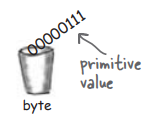
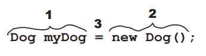
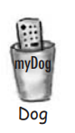
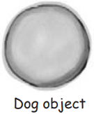
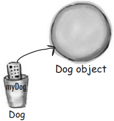
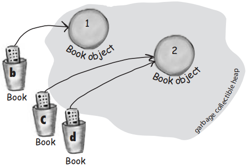

# 了解变量

java很关注类型，不同类型不能互相放入

编译器可发现多数问题：`Rabbit hopper = new Giraffe();`不要指望它能编译

为了使所有这些类型安全发挥作用，必须声明变量的类型

两种类型：

<span style="color: red; background-color: #edf3ec;">**原始类型和引用类型**</span>

原始类型保存基本值，包括整数、布尔值和浮点数

对象引用保存引用对象的引用

使用变量的地方：

- 对象状态（实例变量）
- 局部变量（在方法内声明的变量）
- 参数（由调用代码发送给方法的值）
- 返回类型（发送回方法的调用者的值）
- 声明为简单原始整数值（int 类型）的变量
- 声明为更复杂的类型，如字符串或数组的变量

# 声明变量

必须遵守的两个规则：

<span style="color:red;">**变量必须拥有类型和名字**</span>


> Note: When you see a statement like: “an object of type X", think of type and class as synonyms
> 

# 变量的类型

变量就是一个容器，装一些东西，有size和type

## 原始类型

有不同的size、value和name，在Java中声明一个变量时，必须使用特定的类型来声明它

long，int，short，byte

每个原始类型变量都有固定数量的bit

### boolean and char

| Type    | Bit Depth    | Value Range   |
| ------- | ------------ | ------------- |
| boolean | JVM-specific | true or false |
| char    | 16 bits      | 0 to 65535    |

### numeric (all are signed)

**integer**

| Type  | Bit Depth | Value Range               |
| ----- | --------- | ------------------------- |
| byte  | 8 bits    | -128 to 127               |
| short | 16 bits   | -32768 to 32767           |
| int   | 32 bits   | -2147483648 to 2147483647 |
| long  | 64 bits   | -huge to huge             |

**floating point**

| Type   | Bit Depth | Value Range |
| ------ | --------- | ----------- |
| float  | 32 bits   | varies      |
| double | 64 bits   | varies      |

## 带有赋值的声明

```java
int x;
x= 234;
byte b= 89;
boolean isFun = true;
double d= 3456.98;
char c='f';
int z = x;
boolean isPunkRock;
isPunkRock= false;
boolean powerOn;
powerOn= isFun;
long big = 3456789;
float f= 32.5f;
```

> 注意f，它必须和浮点数一起使用，因为Java认为任何带浮点数的都是双精度浮点数除非用f
> 

# 值溢出

编译器能判断出来

比如  `int x =24; byte b = x;`  不会工作

为什么这个不能用？毕竟x的值是24，24绝对小到可以装进一个字节。但编译器所关心的是试图把大的放到小的里面，而且有可能会溢出。不要期望编译器知道x的值是多少

可通过几种方式之一将值赋给一个变量，包括：

- 在等号后面输入字面值（`x = 12,isGood = true`，等等）
- 将一个变量的值赋给另一个变量（`x = y`）
- 使用结合两者的表达式（`x = y + 43`）

<span style="color:red;">**但是小的值可以放到大的值里面**</span>

# 命名规则，远离关键字

可以根据以下规则命名类、方法或变量（真正的规则稍微灵活一些但这些会保证你的安全）

## 关键字

1. <span style="color:red;">必须以字母、下划线（_）或美元符号（$）开头。不能以数字开头</span>
2. 第一个字符之后，可以使用数字。只是不要以数字开头
3. 可以是任何你喜欢的东西，只要符合上述两条规则，<span style="color:red;">只要不是Java的保留字</span>

不要使用保留字和关键字，否则编译器会很困扰

boolean char byte short int long float double

And here's a mnemonic for remembering them:

Be Careful! Bears Shouldn't ingest Large Furry Dogs

## 保留字表

| boolean   | byte     | char       | double | float      | int       | long         | short     | public   | private |
| --------- | -------- | ---------- | ------ | ---------- | --------- | ------------ | --------- | -------- | ------- |
| protected | abstract | final      | native | static     | strictfp  | synchronized | transient | volatile | if      |
| else      | do       | while      | switch | case       | default   | for          | break     | continue | assert  |
| class     | extends  | implements | import | instanceof | interface | new          | package   | super    | this    |
| catch     | finally  | try        | throw  | throws     | return    | void         | const     | goto     | enum    |

# 对象引用变量

对象怎么处理？

- 实际上，<span style="color:red;">**并不存在对象变量这样的东西**</span>
- <span style="color:red;">**只有对象引用变量**</span>
- 对象引用变量存储的是一些bit，表示访问对象的一种方式
- 它并不保存对象本身，而是保存类似于指针或地址的东西。但是，在Java中，我们实际上不知道引用变量内部是什么。我们只知道，无论它是什么，它代表一个且仅一个对象。而JVM知道如何使用引用来访问对象

不能把一个对象塞进一个变量里

我们经常这样想，“把字符串传递给了 System.out.println() 方法。”或者，“这个方法返回一个 Dog”，或者，“把一个新的 Foo 对象放进名为 myFoo 的变量中。”

但实际情况并非如此。并不存在可以随着对象大小变化的巨大可扩展的容器。<span style="color:red;">**对象只存在于一个地方——垃圾收集堆中！**</span>

<span style="color:red;">**尽管原始类型变量中装满了表示变量实际值的bits，但对象引用变量中装满了表示访问对象的方法的bits**</span>

在引用变量上使用点运算符（.）表示："使用点前的东西来获取点后的东西"。例如：`myDog.bark();`

表示 "使用变量 `myDog` 引用的对象来调用 `bark()` 方法"。在对象引用变量上使用点操作符时，就像按下该对象遥控器上的按钮一样。

想象一个 Dog 引用变量就像是一台 Dog 的遥控器！可以用它来让对象做一些事情（调用方法）

**对象引用变量只是另一个变量值**，可以放在容器里的东西，只不过这个值类似远程遥控

### 原始变量

<div style="overflow: hidden;">
  <div style="float: left; width: 30%;">
    <code>byte x = 7;</code></br></br>
    代表 7 的bits进入变量(00000111)
  </div>
  <div style="float: right; width: 70%; text-align: right;">
    
  </div>
</div>


### 引用变量

<div style="overflow: hidden;">
  <div style="float: left; width: 30%;">
    <code>Dog myDog = new Dog();</code></br></br>
    表示获取 Dog 对象的方法的bits将存入变量
  </div>
  <div style="float: right; width: 70%; text-align: right;">
    
  </div>
</div>

<span style="color:red;">**Dog 对象本身不进入变量！**</span>

## 对象声明、创建和赋值 3 个步骤



### 1. 声明一个引用变量

<div style="overflow: hidden;">
  <div style="float: left; width: 50%;">
    <pre><code>Dog myDog = new Dog()</code></pre>
  </div>
  <div style="float: right; width: 50%; text-align: right;">
    
  </div>
</div>

告诉 JVM 为引用变量分配空间，并将该变量命名为 myDog。换句话说，遥控器上的按钮可以控制 Dog，但不能控制 Cat、Button 或 Socket

### 2. 创建一个对象

<div style="overflow: hidden;">
  <div style="float: left; width: 50%;">
    <pre><code>new Dog()</code></pre>
  </div>
  <div style="float: right; width: 50%; text-align: right;">
    
  </div>
</div>

告诉 JVM 在堆上为新的 Dog 对象分配空间

### 3. 链接对象和引用

<div style="overflow: hidden;">
  <div style="float: left; width: 50%;">
    <pre><code>=</code></pre>
  </div>
  <div style="float: right; width: 50%; text-align: right;">
    
  </div>
</div>


将新的 Dog 赋值给引用变量 myDog。换句话说，就是为遥控器编程

# 引用变量有多大？

不知道。除非你和 JVM 开发团队中的某个人关系密切，否则你不会知道引用是如何表示的。<span style="color:red;">**讨论内存分配问题时，最关心的应该是创建了多少对象（而不是对象引用），以及它们（对象）到底有多大**</span>

# 所有对象引用的大小都是一样的，而与它们所引用的实际对象的大小无关

是的。给定 JVM 的所有引用都是一样大的，不管它们引用的对象是什么，但每个 JVM 表示引用的方式可能不同，因此一个 JVM 上的引用可能比另一个 JVM 上的引用小，也可能比另一个 JVM 上的引用大

# Java不是C语言，不能对引用变量做算术运算，增加它

# 对象引用

遥控器，可以通过编程来控制不同的对象

同一个对象引用可以指向同类型的不同对象，除非前面有final保留字，只能指向同类型的特定对象，或者编程为也可以

可以指向NULL，NULL也是一个值，但是浪费bits，如果是某个特定对象的唯一引用，然后对象引用设置为空值（解除编程），这意味着现在没人能访问曾经引用过的那个对象，再也见不到，该对象有资格被垃圾回收机制回收了

# **可回收堆中对象的生命周期**

```java
Book b = new Book();
Book c = new Book();
```


声明两个Book引用变量，创建两个新的Book对象，将Book对象分配给引用变量

两个Book对象都在堆上

<div style="background-color: #f6f3f8; margin-bottom: 20px;">
  引用：2</br>
  对象：2
</div>


```java
Book d = c;
```



与其创建新的第三个 Book 对象，不如将变量 c 的值赋值给变量 d

把 c 中的内容复制一份，然后把复制的内容放入 d 中

c 和 d 指的是同一个对象

c 变量和 d 变量是同一值的两个不同副本

<div style="background-color: #f6f3f8; margin-bottom: 20px;" >
  引用：3</br>
  对象：2
</div>


```java
c = b;
```


将变量 b 的值赋值给变量 c

变量 b 内部的bits被复制，新的copy被塞入变量 c

b 和 c 指向同一个对象

<div style="background-color: #f6f3f8; margin-bottom: 20px;" >
  引用：3</br>
  对象：2
</div>

# **堆内存中对象的生命周期**

```java
Book b = new Book();
Book c = new Book();
```


声明两个Book引用变量，创建两个新的Book对象，将Book对象分配给引用变量

两个Book对象都在堆上

<div style="background-color: #f6f3f8; margin-bottom: 20px;" >
  活动引用： 2</br>
  可访问对象：2
</div>


```java
b = c;
```


将变量 c 的值赋值给变量 b。变量 c 内部的bits被复制，新的copy被塞入变量 b

b 和 c 都指向同一个对象。对象 1 已被废弃，符合垃圾回收 (GC) 的条件

<div style="background-color: #f6f3f8; margin-bottom: 20px;" >
  活动引用： 2</br>
  可访问对象：1</br>
  废弃对象： 1
</div>


第一个被引用的对象（对象 1）已不再被引用

```java
c = null;
```


将值 null 赋给变量 c。这将使 c 成为空引用，即它不引用任何东西。但它仍然是一个引用变量，另一个 Book 对象仍然可以赋值给它

对象 2 仍有一个活动引用 (b)，只要它还存在，该对象就不符合 GC 条件

<div style="background-color: #f6f3f8; margin-bottom: 20px;" >
  活动引用： 1</br>
  无效引用：1</br>
  可访问对象：1</br> 
  废弃对象： 1
</div>


# 数组也是对象

声明一个 int 数组变量。数组变量是一个数组对象的远程控制

```java
int[] nums;
```

新建一个长度为 7 的 int 数组，并将其赋值给先前声明的 int[] 变量 nums

```java
nums = new int[7];
```

为数组中的每个元素赋予一个 int 值。记住，<span style="color:red;">int 数组中的元素就是 int 变量</span>

```java
nums[0] = 6;
nums[1] = 19;
nums[2] = 44;
nums[3] = 42;
nums[4] = 10;
nums[5] = 20;
nums[6] = 1 ;
```


Java 标准库包含许多复杂的数据结构，包括maps、trees和sets

想快速获得一个有序、高效的列表时，数组是个不错的选择

数组使用索引位置来访问数组中的任意元素，从而实现快速随机存取

数组中的每个元素都是一个变量。换句话说，它是八种原始变量类型之一或者是一个引用变量

在该类型变量中的任何内容都可以赋值给该类型的数组元素

因此，在 int 类型的数组（int[]）中，每个元素都可以存放一个 int

在 Dog 数组中，每个元素都可以<span style="color:red;">**保存一个指向 Dog 的远程控制，**</span>当然，还必须创建 Dog 对象

<aside style="background-color: #f1f1ef">
💡 数组是一个对象，尽管它是一个原始数组
数组始终是对象，无论它们被声明为存放基元还是对象引用。但是，可以拥有一个声明用于保存基元值的数组对象。换句话说，数组对象可以有元素是基元，但数组本身绝不是基元！
</aside>

# 制作一个Dogs数组

声明一个 Dog 数组变量

```java
Dog[] pets;
```

新建一个长度为 7 的 Dog 数组，并将其赋值给之前声明的 Dog[ ] 变量 pets

```java
pets = new Dog[7];
```


少了什么？
<span style="color:red;">狗！我们有一个 "狗 "引用数组，但没有实际的 "狗 "对象！</span>

创建新的 Dog 对象，并将它们赋值给数组元素

<span style="color:red;">**记住，Dog 数组中的元素只是 Dog 引用变量。仍然需要 Dog！**</span>

```java
pets[0] = new Dog();
pets[1] = new Dog();
```


# 用引用变量控制Dog

```java
Dog fido = new Dog();
fido.name = "Fido";
```


创建一个Dog对象，并使用fido引用变量的点运算符（.）访问name变量

可以使用fido引用让Dog bark() 或者 eat() 或者 chaseCat()

## Dog 位于 Dog 数组中，会发生什么情况？

使用点运算符访问 Dog 的实例变量和方法，但访问什么呢？

当 Dog 位于数组中时，没有实际的变量名（如 fido）

相反，**使用数组符号，并在数组中的特定索引（位置）上**按下对象的遥控按钮（点运算符）：

```java
Dog[] myDogs = new Dog[3];
myDogs[0] = new Dog();
myDogs[0].name ="rido";
myDogs[0].bark();
```

Java 关心类型

一旦声明了数组，除了声明的数组类型之外，就不能再往里放任何东西了

例如，不能把Cat放进Dogs数组中，不能把 double 放进 int 数组里（溢出）

不过，可以把byte放进 int 数组里，因为byte 总是可以放进 int 大小的杯子里

就是所谓的隐式扩展

编译器会根据数组的声明类型不会让你把错误的东西放进数组