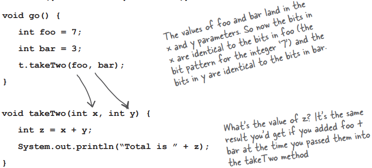

# 对象行为

状态影响行为，行为影响状态

对象有状态和行为，表示为实例变量和方法

类的每个实例（特定类型的每个对象）的实例变量都可以有自己的唯一值

狗 A 的名字可以是 "Fido"，体重可以是 70 磅。狗 B 的名字是 "杀手"，体重 9 磅。如果狗类有一个 makeNoise() 方法，那么，你不觉得 70 磅的狗比 9 磅的狗叫得更厉害一些吗？(换句话说，**方法使用实例变量值**。 比如，"如果狗的体重小于 14 磅，就发出叫声，否则...... "或 "体重增加 5 磅"。让我们去改变一些状态吧

# 类描述了一个对象知道什么和做什么

<div style="overflow: hidden; margin-bottom: 20px;">
  <div style="float: left; width: 30%; ">
    对象有状态和方法</br></br>
    类是对象的蓝图
  </div>
  <div style="float: right; width: 70%; text-align: right;">
    
  </div>
</div>

<span style="color:red;">**编写一个类时，就是在描述 JVM 应该如何创建该类型的对象**</span>

<span style="color:red;">**该类型的每个对象都可以有不同的实例变量值**</span>

<span style="color:red;">**该类型的每个对象都有不同的方法行为**</span>

特定类的每个实例都有相同的方法，但这些方法会根据实例变量的值而有不同的行为

歌曲类有两个实例变量：title和artist

play() 方法可以播放歌曲，但调用 play() 的实例将播放该实例的 title 实例变量值所代表的歌曲。因此，如果你在一个实例上调用 play() 方法，你会听到 "Politik "这首歌，而另一个实例则会播放 "Darkstar"

```java
void play(){
	soundPlayer.playSound(title);
}

Song t2 = new Song();
t2.setArtist("Travis");
t2.setTitle("sing");

Song s3 = new Song();
s3.setArtist("Sex Pistols");
s3.setTitle("My way");
```


# 方法使用实例变量

小狗的叫声不同于大狗的叫声。Dog 类有一个实例变量 size，bak() 方法使用它来决定发出何种吠声

```java
class Dog{
	int size;
	String name;

	void bark(){
		if (size > 60) {
			System.out.println("wooof! wooof!");
		}else if (size > 14) {
			System.out.println("Ruff!Ruff!");
		}else {
			System.out.println("yip! yip!");
		}
	}
}

class DogTestDrive{
	public static void main(String []args) {
		Dog one = new Dog();
		one.size = 70;
		Dog two = new Dog();
		two.size = 8;
		Dog three = new Dog();
		three.size = 35;

		one.bark();
		two.bark();
		three.bark();
	}
}

wooof! wooof!
yip! yip!
Ruff!Ruff!
```

# 方法参数

## 可以向方法传递值

可能会使用arguments或parameters来表示传递到方法中的值，其实可以随心所欲称呼，但我们是这样做的：

> A method **uses** **parameters**. A caller **passes** **arguments**.
> 

方法使用参数，调用者传递参数

**`arguments`**：传递给方法的东西。调用方法的时候，可以传递一些arguments（比如 2， “Foo”，或者一个指向 Dog 对象的引用）给方法，这些arguments就会被赋给方法中定义的parameters（也就是局部变量）

**`parameters`**：局部变量。一个有type和name的变量，可以在方法的主体中使用

> 但重要的是： 如果方法使用parameters，必须给它传递一些值，而且这些值必须和方法定义的参数类型相匹配
> 


# 方法可以返回值

**方法使用实例变量**

每个方法都声明了返回类型

 void 返回类型，意味着不会返回任何值

```java
void go(){
}
```

可以声明一个方法，将特定类型的值返回给调用者，例如

```java
int givesecret(){
	return 42;
}
```

如果声明一个方法来返回值，则<span style="color:red;">**必须返回所声明类型的值**</span>或者<span style="color:red;">**一个与声明类型兼容的值**</span>，编译器不会让你返回错误类型的东西

无论你说要返回什么，最好都能返回


# 多个参数

可以向一个方法发送多个参数

方法可以有多个parameters。声明时用逗号分隔parameters，传递参数时用逗号分隔arguments

<span style="color:red;">**最重要的是，如果一个方法有parameters，必须传递正确类型和顺序的arguments**</span>

## 调用一个双parameters方法，并向其发送两个arguments


# 只要变量类型与parameters类型一致，就可以向方法中传递变量



# Java 中的参数传递方式是按值传递，传递的是参数的copy

方法使用实例变量

调用一个方法时，传递的是参数的值的拷贝，而不是参数本身的引用

这种传递方式的结果是，方法中的参数是原始参数的副本，对它们的修改不会影响原始参数的值


# 参数和返回值

## 如果要传递的arguments是对象而不是基元，会发生什么情况？

但Java 通过值传递一切。但是......值是指变量内部的bits

记住，不能把对象塞进变量；变量是一个远程控制——对象的引用

因此，如果你在方法中传递对象的引用，就等于传递了一个远程控制的副本

## 一个方法可以声明多个返回值吗？

算是吧。一个方法只能声明一个返回值。但是如果想返回三个 int 值，那么可以声明一个返回类型是int的数组

将这些 int 放入数组，然后再传回。要返回不同类型的多个值，涉及的问题会更多一些

## 必须对方法的返回值做些什么吗？可以忽略它吗？

Java 并不要求确认返回值。
在这种情况下，调用方法是为了它在方法内部所做的工作，而不是为了方法的返回值。在 Java 中，不必赋值或使用返回值

> 提醒： Java 关心类型！
>
>当返回类型声明为 Rabbit 时，就不能返回 Giraffe。parameters也是一样。不能将 Giraffe 传递到接受 Rabbit 的方法中
> 

## 要点

- 类定义了一个对象知道什么和做什么
- 对象知道的是它的实例变量（状态）
- 对象所做的事情是它的方法（行为）
- 方法可以使用实例变量，因此相同类型的对象可以有不同的行为
- 方法可以有参数，可以向方法传递一个或多个值
- 传入值的数量和类型必须与方法声明的参数顺序和类型一致
- 传入和传出方法的值可以隐式提升为较大的类型，也可以显式转换为较小的类型
- 作为参数传递给方法的值可以是字面值（2、'c'等），也可以是已声明参数类型的变量（例如 x，其中 x 是一个 int 变量），(还有其他一些东西可以作为参数传递）
- 方法必须声明返回类型， void 返回类型意味着方法不返回任何内容
- 如果方法声明了非 void 返回类型，则必须返回一个与声明的返回类型兼容的值

# 使用参数和返回类型的酷功能

方法使用实例变量

## Getters 和 Setters

更正式的话，你也可以称它们为访问器（Accessors）和修改器（Mutators）

但是Getters 和 Setters 符合 Java 的命名规则，所以就叫它们 Getters 和 Setters

Getters 和 Setters 可以让你获取和设置事物

**`Getter`**：唯一目的，将特定 Getter 应该获取的值作为返回值发送回来

**`Setter`** ：为了获取arguments值并用它来设置实例变量的值而存在

> getter 方法根据定义具有返回类型


```java
class ElectricGuitar{
	String brand;
	int numofPickups;
	boolean rockstarUsesIt;

	String getBrand(){
		return brand;
	}

	void setBrand(string aBrand){
		brand = aBrand;
	}

	int getNumOfPickups(){
		return numOfPickups;
	}

	void setNumOfPickups(int num){
		numOfPickups = num;
	}

	boolean getRockStarUsesIt(){
		return rockStarUsesIt;
	}

	void setRockStarUsesIt(boolean yesOrNo){
		rockStarUsesIt = yesOrNo;
}
```

# 封装

暴露数据是严重的错误

将数据公之于众，让任何人都能看到，甚至触摸到

暴露意味着可以使用点操作符来访问，例如：`theCat.height=27;`

在坏人手中，引用变量是相当危险的武器

因为 `theCat.height = 0;` ，这将是一件坏事

需要为所有实例变量建立setter 方法，并找到一种方法迫使其他代码调用setter，而不是直接访问数据


## 隐藏数据

是的，就是这么简单，就能从一个容易产生不良数据的程序变成一个既能保护你的数据，又能保护你日后修改程序的权利的程序

好吧，那么究竟如何隐藏数据呢？

使用 **`public`** 和 **`private`** 修改器

一条封装入门经验法则：将实例变量标记为`private`，并提供`public` getters和setters来进行访问控制

当你掌握了更多 Java 设计和编码技巧后，可能会采用不同的方法，但现在，这种方法将确保安全

<aside style="background-color: #edf3ec">
💡 将实例变量标记为private </br>
将getters和setters标记为public
</aside></br>

大多数实例变量的值都是基于某些值的边界的假设来编码的。比如，想想如果允许使用负数会导致什么问题？

### 封装是如何设定边界的？

强制其他代码通过setter方法。这样，setter 方法就可以验证参数，并决定是否可以执行。也许该方法会拒绝该参数并什么也不做，或者会抛出一个异常，或者该方法会或者将传入的parameters四舍五入到最接近的合理值。重点是，你可以在 setter 方法中做任何你想做的事，而如果你的实例变量是public，你就什么也做不了

### 有的 setter 方法只是简单地设置值，而不进行任何检查。如果有一个没有边界的实例变量，那么这个 setter 方法难道不会产生不必要的开销吗？会影响性能吗？

<div style="color:#d44c47;background-color: #fdebec;font-weight: bold;">setter、getter 的意义在于，可以在以后改变主意，而不会破坏别人的代码</div></br>

如果你的类里面的实例变量都是public的，被很多人使用，有一天意识到要改成setter方法，所有人的代码会受到影响

**封装的酷之处在于，你可以改变你的想法，而且没有人会受伤，直接使用变量的性能提升是如此微不足道，几乎永远都不值得**

# 对象的行为方式

## 封装GoodDog类

```java
class Dog{

	private int size;    // Make the instance variable private.

	public int getSize(){
		return size;
	}
													// Make the getter and setter methods public.
	public void setSize(int s){
		size = s;
	}

	void bark(){
		if (size > 60) {
			System.out.println("Wooof! Wooof!");
		}else if (size > 14) {
			System.out.println("Ruff!Ruff!");
		}else {
				System.out.println("Yip! Yip!");
		}
	}
}

class DogTestDrive{
	public static void main(String []args) {
		Dog one = new Dog();
		one.setSize(70);
		Dog two = new Dog();
		two.setSize(8);
		one.bark();
		two.bark();
	}
}
```


尽管这些方法并没有真正增加新的功能，但最酷的是，你可以稍后再改变主意

在任何可以使用特定值的地方，都可以使用返回该类型的方法调用

instead of:

```java
int x = 3 + 24;
```

you can say:

```java
int x = 3 + one.getSize();
```

# 数组中的对象是怎么行为的？

方法使用实例变量

就像任何其他对象一样。唯一不同的是如何获取它们。换句话说，就是如何获得遥控器

## 1. 声明并创建一个 Dog 数组，用于保存 7 个 Dog 引用

```java
Dog[1] = pets;
pets = new Dog[7];
```


## 2. 创建两个新的 Dog 对象，并将它们赋值给前两个数组元素

```java
pets[0] = new Dog();
pets[1]= new Dog();
```

## 3. 调用两个 Dog 对象的方法

```java
pets[0].setSize(30);
int x = pets[0].getSize();
pets[1].setSize(8);
```


# 声明和初始化实例变量

声明变量至少需要一个名字和类型，声明的同时可以对变量进行初始化（给变量赋值），如下：

```java
int size = 420;
String name = "Donny";
```

在初始化之前实例变量的值是什么？

实例变量总是有一个**默认值**  对于实例变量不必初始化也行

如果没有显式地给实例变量赋值，或者没有调用 setter 方法，实例变量仍然有一个值！默认值如下：

| type            | default value |
| --------------- | ------------- |
| integers        | 0             |
| floating points | 0.0           |
| booleans        | false         |
| references      | null          |

记住，"null"只是指一个遥控器，它不控制任何东西，也不对任何东西编程。是引用，但没有实际对象

```java

class PoorDog { 
	private int size;          //declare two instanle variables,but don't assign a value
	private String name;

	public int getsize(){
		return size;
	}                           // What will these return??
	public string getName(){
		return name;
	}

	public class PoorDogTestDrive {
		public static void main(String[] args){
			PoorDog one = new PoorDog();
			System.out.println("Dog size is"+ one.getSize());   //Will this even compile?
			System.out.printn("Dog name is"+ one.getName());
	}
}

Dog size is 0
Dog name is null
```

# 实例变量与局部变量的区别

方法使用实例变量

## 1. 实例变量在类中声明，但不在方法中声明

```java
class Horse {
	private double height = 15.2;
	private String breed;
	// more code...
}
```

## 2. 局部变量在方法中声明

```java
class AddThing {
	int a;
	int b = 12;
	
	public int add(){
		int total = a + b;
		return total;
	}
}
```

## 3. 本地变量在使用前必须初始化！

```java
class Foo {
	public void go(){
		int x;
		int z = x + 3;
	}
}

Foo.java:4:variable x might not have been initialized
			int z = x + 3
							^
1 error
```

无法编译，可以声明不带值的 x，但一旦尝试使用它，编译就会出错

> 局部变量没有默认值！如果在变量初始化**之前**尝试使用局部变量，编译器会发出抱怨
> 

# 方法的parameters呢？关于局部变量的规则如何适用于它们？

方法parameters<span style="color:red;">**与局部变量实际上是一样的**</span>--它们是在方法内部声明的（严格来说，它们是<span style="color:red;">**在方法的arguments列表中声明的，而不是在方法的主体中，但它们仍然是局部变量，而不是实例变量**</span>）

但方法parameters永远不会被未初始化，所以永远不会收到编译器关于某个parameters变量可能未被初始化的错误提示

这是因为如果你在没有发送方法所需的arguments的情况下尝试调用方法，编译器就会给你一个错误

所以parameters总是被初始化的，因为编译器保证调用方法时总是使用与方法所声明的parameters相匹配的arguments，并且arguments会被自动分配给parameters

# 比较变量（原始或者引用）

> 使用 **`==`** 运算符判断两个基元是否相同，或者判断两个引用变量是否指向堆上的同一个对象
> 

> 使用 **`.equals()`** 方法判断两个对象是否相等，比如两个String对象都代表“Fred”的字符
> 

<span style="color:red;">**对象相等的概念取决于对象的类型**</span>

原始类型，例如，如果两个不同的字符串对象具有相同的字符（如 "expeditious"），那么无论它们在堆上是否是两个不同的对象，它们的意义都是完全等同的

引用类型，但一只狗呢？如果两只狗碰巧具有相同的大小和重量，你会认为它们是等价的吗？可能不会

因此，两个不同的对象是否应该被视为相等，取决于对特定对象类型的意义（即什么样的条件判断这两个相等）

现在只需明白，== 运算符仅用于比较两个变量中的bits

这些bits代表什么并不重要，bits要么相同，要么不相同

<div style="color:#d44c47;background-color: #e7f3f8;font-weight: bold;">要比较两个原始类型变量，使用 == 运算符</div></br>

`==` 运算符可以用来比较任何类型的两个变量，它只是比较bits
`if (a == b) {...}` 查看 a 和 b 中的位，如果位模式（bit pattern）相同，则返回 true（不过它并不关心变量的大小，所以左端的所有额外 0 都无关紧要）

```java
int a = 3;
byte b = 3;
if(a == b){ // true  }
```


<div style="color:#d44c47;background-color: #e7f3f8;font-weight: bold;">要查看两个引用是否相同（即它们引用堆上的同一个对象），请使用 == 运算符</div></br>

**请记住，`==` 运算符只关心变量中的位模式**

无论变量是引用还是原始类型，规则都一样

因此，如果两个<font color = red>**引用变量指向同一个对象**</font>，则 `==` 运算符<font color = red>**返回 true**！</font>

在这种情况下，我们不知道位模式是什么（因为它取决于 JVM，并且对我们隐藏），但我们知道无论它看起来如何，对于指向同一个对象的两个引用，它都是相同的

```java
Foo a = new Foo();
Foo b = new Foo();
Foo c = a;
if(a == b){ // false }
if(a == c){ // true }
if(b == c){ // false }
```

