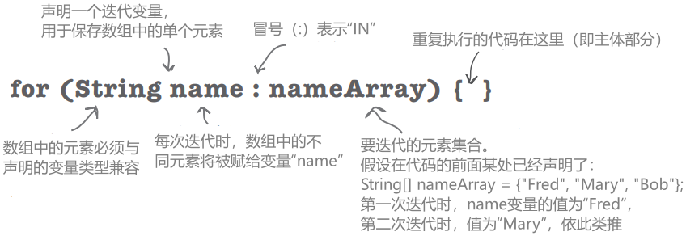

# 强化方法

# 创建一个真实的游戏

做的是 "沉没一个 Dot Com"游戏，游戏中有一个 7 x 7 的网格和三个 Dot Com。每个 Dot com 占三个单元格

与电脑对抗的游戏，任务是在最少的猜测次数内杀死的 Dot Coms

目标：在最少的猜测次数内击沉电脑上所有的 Dot Coms。根据表现获得评级或等级

设置： 启动游戏程序后，电脑会在一个 7 x 7 的虚拟网格上放置三个 Dot Com。完成后，游戏会询问您的第一次猜测

玩法：还没有学 GUl，所以这个版本是在命令行下运行的。计算机会提示你输入一个猜测（一个单元格），命令行中输入 "A3"、"C5 "等）

根据猜测，在命令行中看到一个结果，要么是 "命中"，要么是 "未中"，要么是 "你击沉了 Pets.com"（或当天的幸运 Dot Com）。当把所有三个 Dot Com 都送上天空中的 404 号大船时，游戏结束，并打印出等级

<div style="overflow: hidden;">
  <div style="float: left; width: 50%;">
    
  </div>
  <div style="float: right; width: 50%; text-align: right;">
    
  </div>
</div>


# 1、高层设计

知道有类和方法，但是他们应该是什么

首先，我们需要弄清楚游戏的一般流程。以下是基本的思路：

1. 用户启动游戏
    1. 游戏创建三个 Dot Com
    2. 游戏将三个 Dot Com 放到一个虚拟网格上
2. 游戏开始
    
    复以下步骤，直到没有 Dot Com：
    
    1. 提示用户猜测（"A2"、"Co"等）
    2. 根据所有 Dot Com 检查用户的猜测，看是否有未命中、命中或击杀的情况。采取适当措施：如果命中，删除单元格（A2、D4 等）。如果猜中，则删除 Dot Com
3. 游戏结束
    1. 根据猜测次数给用户评分
    
    
    

现在我们已经知道程序需要做哪些事情了。下一步就是弄清楚我们需要什么样的对象来完成这些工作。<font color = red>**记住，首先关注程序中的事物而不是过程**</font>

# 简单版游戏

至少需要两个类，一个是Game类，另一个是Dot Com类。但在构建完整的 Sink Dot Com 游戏之前，我们将先制作一个精简版的 Dot Com 游戏，即 "简单 Dot Com 游戏"

这个游戏一切从简。将 Dot Com 隐藏在单行中，而不是二维网格中。用一个 Dot Com 代替三个 Dot Com

但目标是一样的，所以游戏仍然**需要创建一个 DotCom 实例，将其分配一行中的某个位置，获取用户输入，当 DotCom 的所有单元格都被击中时结束游戏**。这个简化版的游戏为构建完整的游戏提供了一个良好的开端，如果能让这个小游戏正常运行，以后就可以把它升级到更复杂的游戏

在这个简单版本中，游戏类没有实例变量，所有的游戏代码都在`main()`方法中，换句话说，**当程序启动并开始运行 `main ()` 时，它将创建唯一的 DotCom 实例，为其选择一个位置（在单个虚拟的七个单元格行上的三个连续单元格），询问用户猜测，检查猜测，并重复，直到所有三个单元格都被击中**

**请记住，虚拟行是......虚拟的。换句话说，它在程序中并不存在**。只要游戏和用户都知道 DotCom 隐藏在可能的七个连续单元格中的三个中（从零开始），那么这行本身就不需要用代码来表示。可能想建立一个由七个 int 组成的数组，然后将 DotCom 赋值给数组中七个元素中的三个，但并不需要这样做。**需要的只是一个数组，它只保存 DotCom 所占的三个单元格**

1. **游戏starts**，创建一个 DotCom，并将其放置在七个单元格行中的三个单元格上。而不是“A2”，“C4”等，位置是整数（例如：在这张图片中，1、2、3是单元格的位置）：
    
    
    
2. **游戏play begins**。提示用户猜测，然后检查是否击中了 DotCom 三个单元格中的任何一个，如果命中，增加 numOfHits 变量
3. 当所有三个单元格都被击中时（numOfHits 变量值为 3），**游戏结束**，并告诉用户击沉 DotCom所用的猜测次数

<div style="overflow: hidden;">
  <div style="float: left; width: 50%;">
    
  </div>
  <div style="float: right; width: 50%; text-align: right;">
    
  </div>
</div>

# 编写类

本书的顺序旨在帮助你了解（并学习）我们在编写代码时的想法

当创建一个 Java 类作为 "学习经验" 时，通常会这样做：

- 确定类的目的和功能
- 列出实例变量和方法
- 为方法编写预处理代码
- 为方法编写测试代码
- 实现类
- 测试方法
- 调试并根据需要重新实现
- 感谢我们不必在真实用户身上测试我们所谓的学习体验应用程序

三个我们给每个类写的东西：

**预处理代码**

伪代码的一种形式，可帮助专注于逻辑，而不必担心语法问题

**测试代码**

测试真实代码的类或方法，用于验证代码的正确性

**真实代码**

类的实际实现。这是真正的 Java 代码


在编写程序时，你如何决定首先构建哪个类或哪些类？

假设除了最微小的程序外，所有程序都需要一个以上的类（如果你遵循良好的 面向对象原则，没有让一个类做许多不同的工作），你从哪里开始呢？

## SimpleDotCom class prep code

多数预处理代码包括三个部分：实例变量声明、方法声明、方法逻辑

<font color = red>**预处理代码中最重要的部分是方法逻辑，因为它定义了必须发生的事情，而我们在实际编写方法代码时会将其转化为如何实现**</font>


声明一个 int 数组来保存位置单元格。将其称为 `locationCells`

声明一个 int ，用于保存命中次数。将其命名为 `numOfHits`，并设置为 0

---

声明 `checkYourself()` 方法，该方法接收用户猜测的字符串（"I"、"3 "等），对其进行检查，并返回代表 "命中"、"未命中 "或 "击杀 "的结果

声明一个 `setLocationCells()` 的setter方法，它接收一个 int 数组作为参数（包含三个单元格位置的整数（2、3、4等）

---


## 编写方法实现，编写测试代码

不过，在开始编写方法代码之前，先备份并编写一些代码来测试方法。没错，在有东西可测试之前就编写了测试代码！

首先编写测试代码的概念是极限编程（XP）的一种实践，它可以让你更轻松（也更快速）地编写代码。我们并不一定说你应该使用 XP，但我们确实喜欢先编写测试的这一部分。而且 XP 听起来很酷

### 极限编程XP

XP的核心理念是，客户在需要时能够得到他想要的，即使在游戏后期规格发生变化时也是如此。
XP基于一系列被证明有效的实践，这些实践都旨在协同工作，尽管许多人会挑选和选择，并只采纳XP规则的一部分。这些实践包括：

- 做小而频繁的发布
- 在迭代周期中进行开发
- 不要添加任何未在规格中的内容（无论您有多大的诱惑去添加“未来”功能）
- 先编写测试代码
- 不要制定过于紧张的计划表；按常规工作时间工作
- 每当有机会时都要重构（改进代码）
- 在所有测试都通过之前不要发布任何内容
- 根据小的发布设置实际可行的计划
- 保持简单
- 进行成对编程，并在团队中交叉安排人员，以便每个人都基本了解代码的全部内容

## SimpleDotCom class test code

下面是我们应该测试的内容：

1. 例化一个 SimpleDotCom 对象
2. 为其分配一个位置（一个由 3 个 int 组成的数组，如{2,3,4}）
3. 创建一个字符串来表示用户的猜测（"2"、"0" 等）
4. 调用 `checkYourself()` 方法，并传递虚假的用户猜测
5. 打印结果以查看是否正确（“通过”或“失败”）

### 不存在的东西怎么测试？

因为不是从运行测试开始而是从编写测试开始

在编写测试代码时，不会有任何东西来运行测试，所以可能无法编译它，直到编写了可以编译的 "存根" 代码，但它总是会导致测试失败（比如，返回 null）

### 为什么不等到写完代码，再拿出测试代码呢？

通过思考（并编写）测试代码，有助于理清方法本身需要做什么的思路

只要你的实现代码完成了，你就已经有测试代码在等着验证它了。此外，你知道如果现在不做，就永远不会做。总有更有趣的事情要做

理想情况下，先编写一些测试代码，然后只编写必要的实现代码以通过该测试。然后编写更多的测试代码，只编写必要的新实现代码以通过该新测试

在每次测试迭代时，都要运行以前编写的所有测试，这样就能始终证明最新添加的代码不会破坏以前测试过的代码

### test code

```java
public class SimpleDotComTestDrive{
	public static void main(String[] args) {
		SimpleDotCom dot = new SimpleDotCom(); //实例化SimpleDotComo对象
		
		int [] locations = {2,4,3};   //为dot com的位置创建一个int数组（7个int中的3个连续的int）
		dot.setLocationCells(locations); //调用dot com上的setter方法
		
		String userGuess="2";  //伪造用户猜测
		String result = dot.checkYourself(userGuess); //调用dot com对象上的checkYourself()方法，并将假猜测传给它
		String testResult = "failed";
		if(result.equals("hit")){
			testResult = "passed"; //如果假guess（2）返回一个“命中”，那就说明它有效
		}
		
		System.out.println(testResult); //打印测试结果（通过或失败）
	}
}
```

接下来，实现SimpleDotCom类，然后返回到测试类。看看上面的测试代码，还有什么需要补充的吗?在这段代码中没有测试什么，应该测试什么?

## SimpleDotCom class real code

### checkYourself() 方法

从预处理代码到Java代码没有完美的映射，会有些调整

预处理代码让我们对代码需要做什么有了更清楚的认识，现在我们要做的就是找到能够实现这些功能的 Java 代码

在脑海中考虑一下你可能想要（或需要）改进的代码部分

```java
public String checkYourself(String stringGuess){  //得到user的guess
		int guess = Integer.parseInt(stringGuess);   //String转换为int
		String result = "miss";   //创建一个变量来保存将返回的结果。将“miss”作为默认值放入其中（即假设是“miss”）
		
		for(int cell:locationCells){ //对于locationCells数组中的每个单元格（对象的每个单元格位置），重复执行以下步骤
			if(guess == cell){ //将用户猜测和数组中此元素（单元格）进行比较
				result = "hit";
				numOfHits++;     //得到“hit”
				break;           //退出循环，无需测试其他单元格
			}    //end if
		}     //end for
		
		if(numOfHits == locationCells.length){  //确定是否是最后一个单元格
			result = "kill";  //已经退出循环，看看现在是否“死亡”（被击中3次），并将结果字符串更改为“Kill”
		}
		
		System.out.println(result); //为用户显示结果（"未击中"，除非改为 "击中" 或 "杀死"）
		return result;  //将结果返回给调用方法
	}
```

### 如果传递的内容不是数字，`Integer.parseInt()`方法会发生什么？它是否能识别拼写出来的数字，比如 "three"？

`integer.parselnt()`仅适用于表示数字的 ascii 值的字符串，如：（0、1、2、3、4、5、6、7、8、9）
如果尝试解析类似于 "two" 或 "blurp" 的内容，代码将在运行时发生错误。（实际上，所谓的错误是指抛出一个异常）

### 在本书的开头，有一个 for 循环的例子，它与这个例子确实不同，是不是有两种不同风格的 for 循环？

是的！从 Java 的第一个版本开始，就只有一种 for 循环，看起来像这样：

```java
for (int i = 0; i < 10; i++) {
    // 进行10次操作
}
```

您可以在任何需要的循环中使用这种格式

但是从 Java 5.0（Tiger）开始，当循环需要迭代数组中的元素（或其他类型的集合）时，也可以使用增强型 for 循环。你总是可以使用普通的 for 循环来迭代数组，但增强型 for 循环使这变得更容易

## SimpleDotCom 和 SimpleDotComTester 的最终代码

```java
public class SimpleDotComTestDrive{
	public static void main(String[] args) {
		SimpleDotCom dot = new SimpleDotCom(); 
		int [] locations = {2,4,3};   
		dot.setLocationCells(locations); 
		String userGuess="2"; 
		String result = dot.checkYourself(userGuess); 
	}
}
```

```java
public class SimpleDotCom{
	int[] locationCells;
	int numOfHits = 0;
	
	public void setLocationCells(int[] locs){
		locationCells = locs;
	}
	
	public String checkYourself(String stringGuess){  
		int guess = Integer.parseInt(stringGuess);   
		String result = "miss";   
		
		for(int cell:locationCells){ 
			if(guess == cell){ 
				result = "hit";
				numOfHits++;     
				break;           
			} 
		}     //out of the loop
		
		if(numOfHits == locationCells.length){  
			result = "kill";  
		}
		
		System.out.println(result); 
		return result;  
	}
}
```

这个代码有点bug，不用担心后面会改正

如果正确，结果是这样：hit

## SimpleDotComGame class prep code

SimpleDotComGame 需要执行以下操作：

1. 创建单个 SimpleDotCom 对象
2. 为其创建位置（在虚拟的七个单元格行上连续的三个单元格）
3. 请求用户猜测
4. 检查猜测
5. 重复步骤 3 和步骤 4，直到 DotCom 被击沉
6. 告诉用户猜测了多少次才击沉 DotCom

有些事情你需要相信。例如，我们的一行预处理代码说，“从命令行获取用户输入”。让我告诉你，这比我们现在想从零开始实现的要多一点

但是幸运的是，我们使用面向对象编程。这意味着可以请求其他类/对象为你做一些事情，而不必担心它是如何做到的

当编写预处理代码时，应该假设无论如何都能够做到需要做的事情，这样就可以将所有的脑力投入到逻辑推理中


## SimpleDotComGame clasa real code

游戏的 main() 方法

就像你在 SimpleDotCom类中所做的那样，考虑一下你可能想要（或需要）改进代码的部分
为什么跳过这个类的测试代码阶段，我们并不需要为游戏设计一个测试类，它只有一个方法，那么你在测试代码中要做什么呢？在这个类上单独创建一个调用 main() 的类吗？我们没有这么做

```java
public class SimpleDotComGame {
	public static void main(String[] args) {
			int numOfGuesses = 0;   //做一个变量来跟踪用户猜了多少次
			GameHelper helper = new GameHelper(); //自己编写的特殊类，其中包含获取用户输入的方法。目前，假装它是Java的一部分
		
			SimpleDotCom theDotCom = new SimpleDotCom();  //创建dot com对象
			int randomNum = (int)(Math.random()*5);  
		                                       // 为第一个单元格生成一个随机数，并使用它来创建单元格位置数组
			int[] locations = {randomNum,randomNum+1,randomNum+2};
			theDotCom.setLocationCells(locations);  //给出dot com的位置(数组)
			boolean isAlive = true;
			//创建一个布尔变量来跟踪游戏是否仍在进行中，在 while 循环测试中使用，只要游戏仍在进行中就重复执行
			while(isAlive == true){
				String guess = helper.getUserInput("enter a number"); //获取用户输入字符串
				String result = theDotCom.checkYourself(guess);  //询问dot com检查用户猜测；将返回的结果保存在一个字符串中
				numOfGuesses++;     //增加猜测次数
			
				if(result.equals("kill")){  //是“kill”吗？如果是，将isAlive设置为false（这样就不会重新进入循环），并打印用户猜测次数
					isAlive = false;
					System.out.println("You took" + numOfGuesses +"guess");
				}	
			}
		}
}
```

## GameHelper Class real code

只需复制下面的代码并将其编译到名为GameHelper的类中。将所有三个类(SimpleDotCom、SimpleDotComGame、GameHelper)放到同一个目录中，并将其作为工作目录

```java
import java.io.*;
public class GameHelper {
	public String getUserInput(String prompt){
		String inputLine = null;
		System.out.print(prompt + " ");
		try{
			BufferedReader is = new BufferedReader(
			new InputStreamReader(System.in));
			inputLine = is.readLine();
			if(inputLine.length() == 0) return null;
		}catch(IOException e){
			System.out.println("IOException: " + e);
		}
		return inputLine;
	}
}
```

发现有bug，同样的位置也计数，但其实只击中了一个位置，后面修复bug

# for循环

## 常规（非增强）for循环


简单来说，意思是 重复 100 次

编译器解析方式：

- 创建变量 i 并将其设置为 0
- 当 i 小于 100 时重复
- 在每次循环迭代结束时，将 i 加 1

第一部分：**初始化**

在这部分中，声明并初始化一个变量，用于在循环体内使用。你通常会将这个变量用作计数器。你实际上可以在这里初始化多个变量

第二部分：**布尔测试**

这是条件测试的地方。无论其中是什么，它都必须解析为布尔值（你知道，true或false）。你可以有一个测试，比如 (x >= 4)，或者甚至可以调用返回布尔值的方法

第三部分：**迭代表达式**

在这部分中，放置你希望在每次循环中发生的一个或多个事情。请记住，这些事情发生在每次循环的末尾

## 遍历一个循环

```java
for(int i = 0; i < 8; i++){
	System.out.println(i);
}
System.out.println("done");
```


### for 和 while 的区别

while 循环只有布尔测试，没有内置初始化或迭代表达式。如果不知道要循环多少次，只想在某个条件为真时继续循环，while 循环就很好

但是，如果知道需要循环多少次（比如数组的长度，或者固定的次数，比如7次等），for循环更加简洁。下面是上述循环使用while重写的例子

```java
int i = 0;     //必须声明并初始化计数器
while(i < 8){
	System.out.println(i);
	i++;     //必须增加计数器
}
System.out.println("done");
```

# ++ - - 操作符

## 前/后递增/递减运算符

从变量中加 1 或减 1 的快捷方式

`x++;`   等同于   `x = x + 1;`

在这种情况下，它们的意思是一样的："在 x 的当前值上加 1 "或 "将 x 增 1"

同样地：
`x--;`   等同于   `x = x - 1;`

操作符的位置（变量之前或之后）会影响结果

将运算符放在变量之前（例如，++x）意味着：“先将 x 增加 1，然后使用这个新值 x”
这只有在 ++x 是更大表达式的一部分，而不只是在单个语句中时才有意义
`int x = 0; int z = ++x;`

结果：x 为 1，z 为 1

但是把 ++ 放在 x 后面会得到不同的结果：
`int x = 0; int z = x++;`

产生的结果是：x 为 1，但 z 为 0！

z 得到 x 的值，然后 x 递增

## 增强的for循环

从 Java 5.0（Tiger）开始，Java 语言有了第二种 for 循环，称为增强 for 循环，它使得遍历数组或其他类型的集合更加简单

增强型 for 循环实际上只是为了让遍历集合中的所有元素更加简便，但由于这是 for 循环最常见的用法之一，所以将其添加到语言中是值得的



简单来说，对于nameArray中的每个元素，将该元素赋值给'name'变量，并运行循环体

编译器的解析方式如下：

- 创建一个名为name的String变量，并将其设置为null
- 将 nameArray 中的第一个值赋值给 name
- 运行循环体（花括号中的代码块）
- 将 nameArray 中的下一个值赋值给 name
- 当数组中仍有元素时，重复执行

第一部分：**迭代变量声明**

使用此部分声明和初始化一个在循环体内使用的变量。在循环的每次迭代中，该变量将保存集合中的一个不同元素。该变量的类型必须与数组中的元素兼容！例如，不能声明一个int类型的迭代变量用于String[]数组

第二部分：**实际集合**

这必须是对数组或其他集合的引用。同样，暂时不要担心其他非数组类型的集合

> 注：根据过去使用的编程语言，有些人将增强型 for 称为 "for each" 或 "for in" 循环，因为它的读法是这样的：“对于集合中的每个元素…”（for EACH thing IN the collection...）
> 

# 将String转换为int

`int guess = Integer.parseInt(stringGuess);`

当游戏提示时，用户在命令行键入猜测

用户的猜测以字符串形式输入（"2"、"0"等），游戏会将该字符串传入 checkYourself() 方法

但是，单元格的位置只是数组中的 int，无法将 int 与字符串进行比较
例如，这样做就行不通：

`String num ="2"; int x= 2; if (x == num) // 可怕的爆炸！`

尝试编译时，编译器会报错

因此，为了解决问题，必须将String"2" 转换成 int 2

Java 类库中有一个名为 integer 的类（Integer 类，不是 int 基元类），它的工作之一就是将表示数字的字符串转换成实际的数字

# 基元转换

long 可以转换为 short

但是可能会丢失某些东西


[](https://bing.com/search?q=translate+from+english+to+chinese)在第三章中，我们讨论了各种基本类型的大小，以及不能把一个大的东西直接塞进一个小的东西

```java
long y = 42;
int x = y; // won't compile
```

long 比 int 大，编译器无法确定这个 long 在哪里。它可能和其他 long 一起取得非常大的值

要强制编译器把一个更大的基本变量的值塞进一个更小的一个，可以使用强制转换运算符。它看起来是这样的：

```java
long y = 42;// so far so good
int x = (int) y;// x = 42 coo1!
```

将y进行类型转换告诉编译器获取y的值，将其裁剪至int大小，然后将 x 设为剩下的值
如果 y 的值大于 x 的最大值，那么剩下的将是一个奇怪（但可以计算，涉及符号位、二进制、二进制和其他）的数字

```java
long y = 40002;
//40002 exceeds the 16-bit limit of a short
short x = (short)y;//x now equals -25534!
```

不过，关键是编译器允许你这么做。比方说，你有一个浮点数，而你只想获取其中的整数（int）部分：

```java
float f = 3.14f;
int x = (int) f; // x will equal 3
```

<font color = red>**不要想把任何东西转换成布尔值，反之亦然--走开就是了**</font>