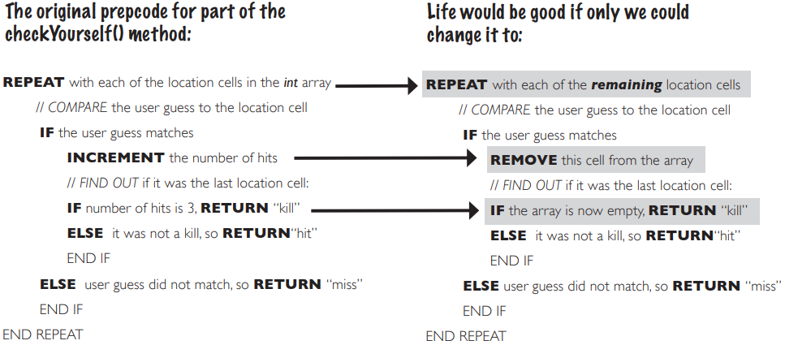
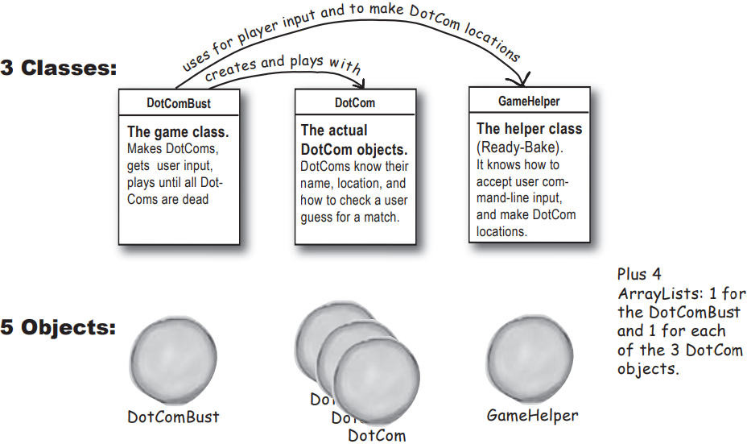

# 使用Java库

Java 提供了数以百计的预建类。如果知道如何在 Java 库（即 Java APl）中找到所需的类，不必重新发明轮子，如果要编写代码，最好只编写真正为应用程序定制的部分
核心 Java 库是一大堆类，像搭积木一样使用，从大部分预建代码中组装出自己的程序

Java APl 中有需要键入和不需要键入的代码，所需要做的就是学会使用它

上一章的bug：在当前版本中，一旦击中目标，只需再重复两次即可完成击杀！即使击中的完全是同一个位置

```java
public String checkYourself(String stringGuess){  
		int guess = Integer.parseInt(stringGuess);   
		String result = "miss";   
		
		for(int cell:locationCells){ 
			**if(guess == cell){    // 问题就出在这里
				result = "hit";    // 每当用户猜中一个单元格位置就计算一次命中
				numOfHits++;      //**即使该位置已经被命中过！**
				break;           
			} 
		}    
		
		if(numOfHits == locationCells.length){  
			result = "kill";  
		}
		
		System.out.println(result); 
		return result;  
	}
```

需要一种方法来确定当用户命中时，他之前没有命中过该单元格。如果他之前已经命中过，那么我们就不想将其计算为一次命中

# 修复bug

先看看我们目前知道了什么

有一列由 7 个单元格组成的虚拟行，一个 DotCom 将占据该行的三个连续单元格

该虚拟行显示一个 DotCom 放置在 4、5 和 6 单元格的位置上


DotCom 有一个实例变量——int 数组——用来保存 DotCom 对象的单元格位置


## 方案一

建立第二个数组，用户每次点击时，将点击存储到第二个数组中，然后每次点击时都检查该数组，看看该单元格是否被点击过


方案一过于笨拙

方案一似乎比想象的要费事得多。这意味着每当用户点击一次，就必须改变第二个数组（"hitCells "数组）的状态，但首先必须检查 "hitCells "数组，看看该单元格是否已经被点击过。这样做是可行的，但一定有更好的办法...

## 方案二

可以只保留一个原始数组，但将任何被击中的单元格的值改为-1。这样，只需检查和操作一个数组


方案二稍好一些，但仍然很笨重

方案二没有方案一那么笨拙，但效率不高。即使一个或多个已经无效，因为它们已经被“击中”（并且具有-1值），你仍然需要循环遍历数组中的所有三个插槽（索引位置）。一定有更好的解决方案…

## 方案三  prep code

当每个单元格被击中时，就删除它，然后修改数组使其变小。但数组无法改变其大小，所以必须创建一个新数组，并将旧数组中剩余的单元格复制到新的较小数组中


如果数组可以收缩，方案三就会更好，这样就不必新建一个更小的数组，将剩余的值复制进去，然后重新分配引用



如果能找到一个数组，当删除某些东西时它可以自动收缩就好了。而且不需要遍历每个元素来检查，而是可以直接询问它是否包含要找的东西。它还会让你从中获取东西，而不必确切地知道这些东西在哪个位置

# 当数组不足以胜任时，看看库里的资源

但它不是一个数组，而是一个 ArrayList，这是 Java 核心库（API）中的一个类
Java 标准版（除非微型版）附带了数百个预先构建的类，这些内置类已经编译好了，意味着不用打字，直接使用它们

这只是 ArrayList 中部分方法的示例

## add(object elem)

Adds the object parameter to the list

## remove(int index)

Removes the object at the index parameter

## remove(Object elem)

Removes this object (if it's in the ArrayList)

## contains(Object elem)

Returns 'true' if there's a match for the object parameter

## isEmpty()

Returns 'true' if the list has no elements

## indexOf(object elem)

Returns either the index of the object parameter, or -1

## size()

Returns the number of elements currently in the list

## get(int index)

Returns the object currently at the index parameter

> 注：add(Object elem) 方法实际上比我们在这里展示的方法看起来更奇怪....，现在，只需将其视为一个 add() 方法，其中包含了你想要添加的对象
> 

# 使用 ArrayList 可以做的一些事情

## 1、做一个

```java
ArrayList<Egg> myList = new ArrayList<Egg>();
```


现在不用担心这个新的`<Egg>`角括号语法，它只是表示 "将其作为 Egg 对象的列表"

## 2、往里面放点东西

```java
Egg s= new Egg();
myList.add(s);
```


## 3、再往里放一个东西

```java
Egg b = new Egg();
myList.add(b);
```


## 4、找出里面有多少东西

```java
int theSize = myList.size();//ArrayList中有2个对象，所以size()方法返回2
```

## 5、查找是否包含某些内容

```java
boolean isIn = myList.contains(s); //ArrayList包含了由's'引用的Egg对象，因此contains()返回true
```

## 6、查找某物的位置（即其索引）

```java
int idx = myList.indexOf(b); //ArrayList基于0（表示第一个索引为0），由于"b"引用的对象是列表中的第二个对象，因此indexOf()返回1
```

## 7、查看是否为空

```java
boolean empty = myList.isEmpty(); //肯定不是空的，所以isEmpty()返回false
```

## 8、从中删除某些内容

```java
myList.remove(s);
```


# ArrayList很酷，但怎么知道它的存在呢？

问题其实是："我怎么知道API 中有什么？"而这正是作为 Java 程序员取得成功的关键所在

更不用说，这也是你在构建软件的过程中尽可能偷懒的关键所在

当别人已经完成了大部分繁重的工作，而你只需介入并创建有趣的部分时，你可能会惊讶于自己能节省多少时间

不过，我们还是想说点题外话......简而言之，你需要花些时间学习 APl 的核心内容

# 但这是一个相当大的问题。我不仅需要知道 Java 库带有 ArrayList，更重要的是我必须知道 ArrayList 能够实现我想要的功能！那么，我怎样才能从 "需要做某件事情" 到 "使用 APl 做某件事情"呢？

现在你真正进入了核心。当你读完这本书的时候，你已经很好地掌握了这门语言，剩下的学习过程就是知道如何从一个问题到一个解决方案，而你所写的代码量是最少的

ArrayList是一个对象，存在于堆上

数组和ArrayList不是一个东西

数组存在于堆上，但数组仍然只是想成为 ArrayList。一个冒牌货，对象有状态和行为，对吧？我们对此很清楚。但真的尝试过在数组上调用方法吗？

只关心在数组中放入和取出的东西上调用方法，而不是数组本身

下面这种说法是错误的

`Dog d = dogArray[1]`，从数组中获取索引为 1 的 Dog 对象

**没有从数组中移除那个 Dog，所做的只是复制了对 Dog 的引用，并将其分配给另一个 Dog 变量   数组可以把引用设置为null**

ArrayList是一个一流的对象，所以有方法，实际上可以做一些事情，比如从自己身上移除 Dog 的引用，而不仅仅是将其设置为 null，而且可以动态地改变自己的大小，但是数组做不到

ArrayList在某些情况下效率比数组的低，但是为了微乎其微的性能提升而放弃所有这些功能不值得，具有极大的灵活性

ArrayList不能容纳原始数据类型，但是当然可以把原始数据类型放进ArrayList，只要它被包装在一个原始数据类型的包装类中

如果使用的是原始数据类型的ArrayList，使用数组可能会更快，因为需要进行大量的包装和解包，但是…… 现在谁真的还在使用原始数据类型呢？

# ArrayList和普通数组之间的区别

| ArrayList                                            | regular array                     |
| ---------------------------------------------------- | --------------------------------- |
| ArrayList <String> myList = new ArrayList<String>(); | String [] myList = new String[2]; |
| String a = new String("whoohoo");                    | String a = new String("whoohoo"); |
| myList.add(a);                                       | myList[0] = a;                    |
| String b = new String("Frog");                       | String b = new String("Frog");    |
| myList.add(b);                                       | myList[1] = b;                    |
| int theSize = myList.size();                         | int theSize = myList.length;      |
| Object o = myList.get(1);                            | String o = myList[1];             |
| myList.remove(1);                                    | myList[1] = null;             |
| boolean isIn = myList.contains(b);                   | boolean isIn = false;     </br> for (String item : myList){ </br> &nbsp;&nbsp;&nbsp;&nbsp; if (b.equals(item)){ </br> &nbsp;&nbsp;&nbsp;&nbsp;&nbsp;&nbsp;&nbsp;&nbsp; isIn = true; </br> &nbsp;&nbsp;&nbsp;&nbsp;&nbsp;&nbsp;&nbsp;&nbsp; break; </br> &nbsp;&nbsp;&nbsp;&nbsp;}</br>} |

<blockquote style="background-color: #fdebec;">注意：使用 ArrayList 时，你是在处理一个类型为 ArrayList 的对象，所以你只是在一个普通的对象上调用普通的方法，使用普通的点操作符

对于数组，使用特殊的数组语法（比如 `myList[0] = foo`），这种语法除了在数组中以外几乎不会在其他地方用到。尽管数组是一个对象，它生存在自己的特殊世界里，不能对其调用任何方法，尽管可以访问它唯一的实例变量 length</blockquote>


# ArrayList 与普通数组的比较

## 1、普通的数组在创建时必须知道它的大小，但是对于ArrayList，只需创建一个ArrayList类型的对象

ArrayList永远不需要知道应该有多大，因为随着对象的添加或删除，它会增长和收缩

```java
// 普通数组需要指定大小
String[] array = new String[2];

// ArrayList不需要指定大小（尽管你可以给它指定大小）
ArrayList<String> arrayList = new ArrayList<String>();
```

## 2、要将对象放入常规数组中，必须将其指定到特定位置(从 0 到比数组长度小 1 的索引），ArrayList不需要

```java
// 需要指定索引
myList[1] = b;
```

如果该索引超出了数组的边界（例如，数组的声明大小为 2，而现在试图将某个内容赋值给索引 3），运行时就会崩溃

对于ArrayList，可以使用`add(anInt, anObject)`方法指定索引，或者可以简单地使用`add(anObject)`，<font color = red> **ArrayList会不断增长以为新的对象腾出空间** </font>

```java
// 不需要指定索引
myList.add(b);
```

## 3、数组使用在Java中其他地方都不使用的数组语法。但ArrayList是普通的Java对象，所以它们没有特殊的语法

```java
// 数组使用 []，这是专门用于数组的特殊语法
myList[1]
```

## 4、在Java 5.0中，ArrayLists是参数化的

与数组不同，ArrayLists 没有特殊的语法。但它们确实使用了 Java 5.0 Tiger 中添加的特殊内容——参数化类型

```java
ArrayList<String>
```

`<String>`中的尖括号是“类型参数”。`ArrayList<String>`表示 "字符串列表"，而 `ArrayList<Dog>`表示 "狗列表"

在Java 5.0之前，没有办法声明要放入ArrayList的对象的类型，因此对于编译器来说，所有的ArrayLists都只是对象的异构集合。但现在，使用`<typeGoesHere>`语法，我们可以声明和创建一个ArrayList，它知道（并限制）它可以保存的对象的类型，现阶段只需知道这是一种强制编译器只允许特定类型的对象（尖括号中的类型）进入ArrayList的方法即可

# 修复 DotCom 代码

原来有bug的代码，重命名类，SimpleDotCom改为DotCom

```java
public class DotCom{
	int[] locationCells;
	int numOfHits = 0;
	
	public void setLocationCells(int[] locs){
		locationCells = locs;
	}
	
	public String checkYourself(String stringGuess){  
		int guess = Integer.parseInt(stringGuess);   
		String result = "miss";   
		
		for(int cell:locationCells){ 
			if(guess == cell){ 
				result = "hit";     //bug的地方
				numOfHits++;  
				break;           
			} 
		}     //out of the loop
		
		if(numOfHits == locationCells.length){  
			result = "kill";  
		}
		
		System.out.println(result); 
		return result;  
	}
}
```

## 全新改进的 DotCom 类  real code

加上ArraryList的力量

```java
import java.util.ArrayList;

public class DotCom{
	private ArrayList<String> locationCells;
	//private numOfHits;
	//dont't need that now      
	                        // 将字符串数组更改为保存字符串的ArrayList
	public void setLocationCells(ArrayList<String> locs){
		locationCells = locs;
	}
	
	public String checkYourself(String userInput){  //新的、改进后的argument名称 
		   
		String result = "miss";
		
		int index = locationCells.indexOf(userInput); //通过询问其索引来查找用户猜测是否在ArrayList中。如果不在列表中，那么indexOf()返回-1
		
		if(index >= 0){
			locationCells.remove(index);  //**如果索引大于或等于零，则用户猜测肯定在列表中，因此将其删除

			
			if(locationCells.isEmpty()){ //**如果列表为空，这就是致命一击！
				result = "kill";
			}else{
				result = "hit";
			}
		}
		return result;
	}
}
```

# 制作DotComBust建立真正的游戏：“击沉DotCom”

将构建Sink a Dot Com游戏，使用7 x 7网格和三个Dot Coms。每个Dot Com占据三个单元格

现在构建真正的版本。将使用网格来代替单行，并且不再使用一个DotCom，而是使用三个

**目标**：在最少的猜测次数内击沉电脑上的所有 Dot Com。根据表现好坏，会获得一个评级水平

**设置**： 游戏程序启动后，电脑会在虚拟的 7 x 7 网格上随机放置三个 Dot Com。完成后，游戏会要求您进行第一次猜测

**玩法**：还没有学会构建GUI，因此此版本在命令行上运行。电脑会提示你输入一个猜测（一个单元格），你在命令行中输入（如 "A3"、"C5"等）。根据你的猜测，你将在命令行中看到一个结果，要么是 "命中"，要么是 "未中"，要么是 "你击沉了 Pets.com"（或当天的幸运 Dot Com）。当你把三个 Dot Com 都送上天空中的 404 号大船后，游戏结束，打印出你的评分

<div style="overflow: hidden;">
  <div style="float: left; width: 50%;">
    
  </div>
  <div style="float: right; width: 50%; text-align: right;">
    
  </div>
</div>

# 有什么需要改变

有三个类需要更改：DotCom 类（现在称为 DotCom，而不是 SimpleDotCom）、游戏类（DotComBust）和游戏辅助类（暂时不用管）

## A. Dotcom 类

添加一个 name 变量来保存 DotCom 的名称（如“Pets.com”，“Go2.com”等），这样每个 DotCom 在被杀死时都能打印出自己的名称

## B. DotComBust 类（游戏）

创建三个 DotCom，而不是一个

为这三个 DotCom 中的每一个分配一个名称，在每个 DotCom 实例上调用一个 setter 方法，这样 DotCom 就可以将名称赋值给它的 name 实例变量

### 将DotComs放在一个网格上，而不只是单行，并为所有三个DotComs执行此操作

如果要随机放置DotComs，这一步比以前复杂得多。由于不想在这里搞数学，所以将为DotComs分配位置的算法放入GameHelper（现成的）类中

### 用所有三个DotComs检查每个用户的猜测，而不是只用一个

### 继续玩游戏（即接受用户的猜测并用剩余的DotComs进行检查），直到没有活的DotComs为止

### 退出main方法。我们保留了简单的main方法，只是为了...保持简单。但这不是我们想要的真正游戏



# 游戏的详细结构：
DotComBust游戏中谁在做什么（以及何时）


# the DotComBust class (the game)  prep code


### 真正的 DotComBust 类的预备代码

DotComBust 类有三项主要工作：设置游戏、玩游戏直到DotComs被击败，以及结束游戏。虽然我们可以将这三项工作直接映射为三个方法，但为了保持较小的粒度，将中间的工作（玩游戏）分成了两个方法。更小的方法（意味着更小的功能块）有助于我们更轻松地测试、调试和修改代码


# the DotComBust class (the game)  real code

```java
import java.util.*;
public class DotComBust{
                          //声明和初始化我们需要的变量
	private GameHelper helper = new GameHelper();
	//创建一个DotCom对象的ArrayList（换句话说，一个只包含DotCom对象的列表，就像DotCom[]表示DotCom对象的数组一样）
	private ArrayList<DotCom> dotComsList = new ArrayList<DotCom>(); 
	private int numOfGuesses = 0;
	
	private void setUpGame(){
		//first make some dot coms and give them locations
		DotCom one = new DotCom();
		one.setName("Pets.com");
		DotCom two = new DotCom();
		two.setName("eToys.com");  //创建三个DotCom对象，给它们命名，并将它们放入ArrayList中。
		DotCom three = new DotCom();
		three.setName("Go2.com");
		dotComsList.add(one);
		dotComsList.add(two);
		dotComsList.add(three);

		// 打印简要的用户说明
		System.out.println("Your goal is to sink three dot coms.");
		System.out.println("Pets.com, eToys.com, Go2.com");
		System.out.println("Try to sink them all in the fewest number of quesses");
		
		for(DotCom dotComToSet : dotComsList){//对列表中的每个DotCom重复操作
			ArrayList<String> newLocation = helper.placeDotCom(3);//向helper请求一个DotCom的位置（一个字符串的ArrayList）
			dotComToSet.setLocationCells(newLocation);//调用这个DotCom的setter方法，将刚刚从helper那里得到的位置赋给它
		}
	}
	
	private void startPlaying(){
    //只要 DotCom 列表不为空（"！"表示 "不"，即为 false），就等于（dotComsList.isEmpty() == false）
		while(!dotComsList.isEmpty()){
			String userGuess = helper.getUserInput("Enter a guess");//获取用户的输入
			checkUserGuess(userGuess);//调用我们自己的checkUserGuess方法
		}
		finishGame();//调用我们自己的finishGame方法
	}
	
	private void checkUserGuess(String userGuess){
		numOfGuesses++;   //增加用户的猜测次数
		String result = "miss"; //假设它是一个“未命中”，除非另有说明
		
		for(DotCom dotComToSet : dotComsList){ //对列表中的每个DotCom重复操作
			result = dotComToSet.checkYourself(userGuess);//要求DotCom检查用户的猜测，寻找命中（或击杀）
			if(result.equals("hit")){
				break;   //提前跳出循环，没有必要测试其他DotCom
			}
			if(result.equals("kill")){
				dotComsList.remove(dotComToSet);//这个家伙已经挂了，所以把他从DotComs列表中移除，然后跳出循环
				break;
			}
		}
		System.out.println(result);//给用户打印出结果
	}

//这个家伙已经挂了，所以把他从DotComs列表中移除，然后跳出循环
	private void finishGame(){
		System.out.println("All Dot Coms are dead!Your stock is now worthless.");
		if(numOfGuesses <= 18){
			System.out.println("It only took you" + numQfGuesses + "guesses.");
			System.out.println(" You got out before your options sank.");
		}else {
			System.out.println("Took you long enough." + numOfGuesses + "guesses.");
			System.out.println("Fish are dancing with your options.");
		}
	}
	
	public static void main(String[] args){
		DotComBust game = new DotComBust();  //创建game对象
		game.setUpGame();  //告诉game对象设置游戏
		game.startPlaying();//告诉game对象启动主游戏循环（持续询问用户输入并检查猜测）
	}
}
```

# the DotCom class real code

```java
import java.util.ArrayList;

//DotCom 的实例变量：
//-单元格位置的 ArrayList
//-DotCom 的名称
public class DotCom{                         
	private ArrayList<String> locationCells;
	private String name;
     
	//一个setter方法，用于更新DotCom的位置（由GameHelper的placeDotCom()方法提供随机位置）                        
	public void setLocationCells(ArrayList<String> locs){
		locationCells = locs;
	}
	
		public void setName(String n){ //你最基本的setter方法
		name = n;
}

	public String checkYourself(String userInput){  
		String result = "miss";
		int index = locationCells.indexOf(userInput); //ArrayList的indexOf()方法的使用！如果用户的猜测是ArrayList中的一个条目，indexOf()将返回其ArrayList位置。如果不是，indexOf()将返回-1
		if(index >= 0){
			locationCells.remove(index);  //使用ArrayList的remove()方法来删除一个条目

			if(locationCells.isEmpty()){ //使用isEmpty()方法来查看是否所有位置都已经被猜测
				result = "kill";
				System.out.println("Ouch! You sunk "+name+" : (");
			}else{
				result = "hit";
			}
		}
		return result;
	}
}
```

# 超级强大的布尔表达式

## “And" 和 "Or" 运算符（ `&&` , `||` )

当你编写一个`chooseCamera()`方法时，其中有很多关于选择哪个相机的规则。也许你可以选择价格从$50到$1000的相机，但在某些情况下，你希望更精确地限制价格范围。你想要说的是：
如果价格范围在$300到$400之间，则选择X

```java
if (price >= 300 && price < 400) {
    camera = "X";
}
```

假设有十个可用的相机品牌，有一些逻辑只适用于列表中的几个品牌：

```java
if (brand.equals("A") || brand.equals("B")) {
    // 仅对品牌A或品牌B执行操作
}
```

布尔表达式可能变得非常庞大和复杂：

```java
if ((zoomType.equals("optical") && 
		(zoomDegree >= 3 && zoomDegree <= 8)) || 
		(zoomType.equals("digital") && 
		(zoomDegree >= 5 && zoomDegree <= 12))) {
    // 执行适当的缩放操作
}
```

如果你想要变得非常技术化，你可能会想知道这些操作符的优先级。但我们建议使用括号使代码清晰，而不是成为优先级的专家

## 不等于（ `!=` 和 `!` ）

假设有这样的逻辑，“在十种可用的相机型号中，除了一种之外，其他都是真实的。”

```java
if (model != 2000) {
    // 对非2000型号执行操作
}
```

或者对于比较对象，比如字符串...

```java
if (!brand.equals("x")) {
    // 对非品牌X执行操作
}
```

## 短路运算符（ `&&`，`||` ）

运算符`&&`和`||`被称为短路运算符。对于`&&`运算符，在`&&`的两边=真时，整个表达式才为真。因此，如果JVM看到`&&`表达式的左边是假的，它就会立即停止！甚至不会去看右边

类似地，对于`||`运算符，如果任一边为真，整个表达式就为真，因此如果JVM看到左边是真的，它就会声明整个语句为真，并且不会去检查右边

为什么这很棒？假设有一个引用变量，不确定它是否已被赋值给一个对象。如果尝试使用这个空引用变量调用一个方法（即没有分配对象），会得到一个NullPointerException

所以，试试这个：

```java
if (refVar != null && refVar.isValidType()) {
    // 执行“获得了有效类型”的操作
    // do 'got a valid type' stuff
}
```

## 非短路运算符（`&`，`|`）

用于布尔表达式时，`&` 和 `|` 运算符的行为与 `&&` 和 `||` 对应项相似，不同之处在于它们<font color = red> **强制JVM始终检查表达式的两边**</font>。通常，`&` 和 `|` 用于另一种上下文，用于操作位

# Ready-bake: GameHelper

除了用户输入方法（提示用户并从命令行读取输入）外，该辅助类的主要功能是为 DotComs 创建单元格位置

记住，在编译 DotComBust 游戏类之前，必须先编译这个类

注意：为了获得额外的分数，可以尝试 "取消 "placeDotCom( ) 方法中的 System.out.print(ln) 的注释，以观察它的运行情况！这些打印语句会让你 "作弊"，给出 DotComs 的位置，但也有助于进行测试

```java
import java.io.*;
import java.util.*;

public class GameHelper {
	
	private static final String alphabet = "abcdefg";
	private int gridLength = 7;
	private int gridSize = 49;
	private int [] grid = new int[gridSize];
	private int comCount = 0:
		
	public String getUserInput(String prompt){
		String inputLine = null;
		System.out.print(prompt + " ");
		try{
			BufferedReader is = new BufferedReader(
			new InputStreamReader(System.in));
			inputLine = is.readLine();
			if(inputLine.length() == 0) return null;
		}catch(IOException e){
			System.out.println("IOException: " + e);
		}
		return inputLine.toLowerCase();
	}
	
	public ArrayList<String> placeDotCom(int comSize){
		ArrayList<String> alphaCells = new ArrayList<string>();
		String [] alphacoords = new String [comSize]; 		// holds 'f6' type coords
		String temp = null; 								// temporary String for concat
		int [] coords = new int[comSize];					// current candidate coords
		int attempts = 0;    								// current attempts counter
		boolean success = false;							// flag = found a good location ?
		int location = 0; 									// current starting location

		comCount++;          								// nth dot com to place
		int incr = 1;        								// set horizontal increment
		if((comCount % 2) == 1){    						// if odd dot com(place vertically)
			incr = gridLength;      						// set vertical increment
		}

		while(!success & attempts++ < 200){        			// main search loop(32)
			location =(int)(Math.random() * qridSize);		// get random starting point
			//System.out.print(" try " + location);
			int x = 0;										// nth position in dotcom to place
				success = true;								// assume success
				while (success && x < comSize){				// look for adjacent unused spots		
					if(grid[location] == 0){				// if not already used

						coords[x++] = location;					// save location
						location += incr;						// try 'next' adjacent
						if (location >= gridSize){				// out of bounds -'bottom'
							success = false;					// failure
						}						
						if (x>0 &&(location % gridLength == 0)){	// out of bounds - right edge
							success = false;						// failure
						}
					}else {											// found already used location
						//System.out.print(" used " + location);
						success = false;							// failure
					}
				}
		}															// end while	

		int x = 0;													// turn location into alpha coords
		int row = 0;
		int column = 0;
		// System.out.printin("\n");
		while(x < comSize){
			grid[coords[x]] = 1;									// mark master grid pts. as 'used'
			row = (int)(coords[x] / gridLength);					// get row value
			column = coords[x] % gridLength;						// get numeric column value
			temp = String.valueOf(alphabet.charAt(column));			// convert to alpha

			alphaCells.add(temp.concat(Integer.toString(row)));
			x++;
			//System.out.print(" coord " +x+" = " + aiphaCells.get(x-1));// This is the statemat that tells you exactly where the DotCom is located.
		}

		//System.out.println("n");
		
		return alphaCells;
	}
}
```

# 使用Java API

在Java API中，类被分组到包中

要使用API中的类，必须知道类所在的包

Java 库中的每个类都属于一个包

这个包有一个名字，如 **`javax.swing`**（包含了一些 Swing GUl 类）

ArrayList 位于名为 **`java.util`** 的包中，这个包中包含了大量实用程序类
现在，只想使用 Java 自带的一些类

在自己的代码中使用 APl 中的类非常简单。只需把这个类当作是你自己编写的......就像你编译了它一样，它就在那里，等着你去使用

但有一个很大的不同：必须在代码的某个地方指明你要使用的库类的全名，这意味着`包名 + 类名`

System (`System.out.println`)，String 和 Math (`Math.random()`) 都属于 **`java.lang`** 包

# 代码中，必须知道类的完整名称（除非类在java.lang包中）

ArrayList不是ArrayList的全名，ArrayList的全名如下：


必须告诉 Java 要使用哪个 ArrayList。有两个选择：

## A 导入

在源代码文件的顶部放置一个导入语句

```java
import java.util.ArrayList;
public class MyClass {...}
```

## B 类型

在代码的任何地方（每次在哪里使用）都要完整地写上它的名称

### 声明和/或实例化时：

```java
java.util.ArrayList<Dog> list = new java.util.ArrayList<Dog>();
```

### 当将它用作参数类型时：

```java
public void go(java.util.ArrayList<Dog> list){...}
```

### 当将它用作返回类型时：

```java
public java.util.ArrayList<Dog> foo(){...}
```

# 为什么必须有一个完整的名称？这难道是包的唯一目的吗？

包之所以重要，主要有三个原因：

<font color = red> **首先，有助于项目或程序库的整体组织**</font>，而不是只有一大堆可怕的类，它们都被归类为特定功能的包（如 GUl、数据结构或数据库等）

<font color = red> **其次，包给你命名空间，以防止冲突**</font>，如果你和其他12个程序员在你的公司都决定使用相同名称的类。如果你有一个叫做Set的类，而另一个人（包括Java API）也有一个叫做Set的类，你需要一种方法告诉JVM你想使用哪个Set类

<font color = red> **最后，包提供了一定程度的安全性**</font>，因为你可以限制你编写的代码，只有相同包中的其他类才能访问它

# 回到名字冲突的问题上来。全名到底有什么用？如何防止两个人给一个类取相同的包名？

Java 有一个命名约定，通常可以防止这种情况发生，只要开发人员遵守它。后面章节会讲到

# 那个 "x" 是怎么来的？（或者说，当一个包以javax开头时，这意味着什么？）

在Java的前两个版本（1.02和1.1）中，所有与 Java 一起发布的类（换句话说，标准库）都在以 java开头的包中，当然也有无需导入的 `java.lang`。此外还有 `java.net`、`java.io`、`java.util`（虽然那时还没有 ArrayList）和其他一些包，包括保存GUI相关类的`java.awt`包。

不过，还有一些未包含在标准库中的其他包。这些类被称为扩展类，主要有两种：标准扩展类和非标准扩展类。标准扩展类是Sun认为是官方的，而不是实验性的、早期访问的或测试版的包，这些包可能永远不会见天日。

按照惯例，标准扩展包都以普通java包的前缀附加一个'x'开头。标准扩展之母是 Swing 库。它包括多个软件包，都以 javax.swing 开头。

但是，标准扩展可以晋升为一流的、随 Java 一起提供的、开箱即用的标准库包。这就是 Swing 从 1.2 版（最终成为被称为 Java 2'的第一个版本）开始发生的事情。

每个人（包括我们自己）都觉得 "酷"，现在，每个拥有 Java 的人都将拥有 Swing 类，而我们不必弄清楚如何让最终用户安装这些类。

然而，麻烦就潜伏在表面之下，因为当软件包被升级时，它们当然必须以 java 而不是 javax 开头。每个人都知道，标准库中的包没有 "x"，只有扩展包才有 "x"，所以，就在1.2 版本正式发布之前，Sun 更改了包名，删除了 "x"（还有其他改动）。新名称下的 Swing 代码被印刷成书，并出现在商店里。命名约定保持不变。Java 世界一切正常。

除了那两万多名叫苦不迭的开发人员，他们意识到，名称的简单改变带来了灾难！他们所有使用 Swing 的代码都必须更改！太可怕了 想想那些以 javax 开头的导入语句...

在绝望的最后时刻，开发人员说服了 Sun，"去他妈的约定俗成，拯救我们的代码"。因此，当你在库中看到一个以 javax 开头的包时，你就知道它一开始是一个扩展，然后得到了提升。

# 导入会使我的类变大吗？是否会将导入的类或包编译到我的代码中？

与 C 语言不一样，所以答案是否定的。记住："<font color = red> **import 语句可以让你免于键入。**</font>"就是这样，你不必担心你的代码会因为导入过多而变得臃肿或速度变慢。
<font color = red> **导入仅仅是向 Java 提供类的全名的一种方式**</font>

# 好吧，为什么从来不需要导入 String 类？或者 System？

记住，java.lang 包是免费 "预导入" 的。因为 `java.lang` 中的类非常基本，所以不必使用全名。只有一个 `java.lang.String` 类和一个 `java.lang.System` 类，Java 非常清楚在哪里可以找到它们

# 我必须把自己的类放入包中吗？我该怎么做？我能做到吗？

在现实世界中（你应该尽量避免这样做），是的，你需要把你的类放到包中。后面章节会讨论这点，现在，我们不会把示例代码放在包中

# 如何玩转 APl

你想知道的两件事：

1. 库中有哪些类？
2. 找到一个类后，如何知道它能做什么？

步骤：

1. **浏览图书**
    1. 翻阅参考书是了解 Java 库中有哪些内容的好方法,只需浏览页面，你就可以轻松地偶然发现看起来有用的包或类
2. **使用 HTML API 文档**
    
    
    

Java 自带在线文档，被称为 Java API

可以下载这些文档到硬盘上，以防万一网络连接在最坏的情况下发生故障

API 文档是获取更多有关包中内容以及包中类和接口所提供功能（如方法和功能）的详细信息的最佳参考资料

根据使用的 Java 版本不同，文档的外观也不同

请确保查看的是对应 Java 版本的文档！

Java 9 引入了 Java 模块系统，我们将不在本书中介绍。要理解文档，需要知道的是 **JDK 现在被分成了多个模块。这些模块将相关的包组合在一起**。这可以让你更容易找到感兴趣的类，因为它们是**按功能分组**的。到目前为止，我们在本书中涉及的所有类都在 `java.base` 模块中；该模块包含核心 Java 包，如`java.lang` 和`java.util`

# 使用类文档

无论使用的是哪个版本的 Java 文档，它们都有类似的布局来显示特定类的信息 关于特定类的信息。这就是细节所在

比方说，浏览参考书时发现了 java.util 中一个名为 ArrayList 的类

书中告诉了你一些关于它的信息，足以让你知道这确实是你想使用的类，但你仍然需要了解更多方法。在参考书中，可以找到 indexOf() 方法。但如果只知道有一个方法叫 `indexOf()`，它接收一个对象并返回该对象的索引（一个 int），那么还需要知道一件至关重要的事情：如果对象不在 ArrayList 中，会发生什么？

单看方法签名并不能告诉你它是如何工作的。但是 API 文档会（大多数时候，无论如何）

API 文档告诉你，如果对象参数不在 ArrayList 中，则 `indexOf()`方法将返回 -1。所以现在我们知道，我们既可以用它来检查一个对象是否在 ArrayList 中，也可以同时获取它的索引（如果该对象在那里）。但是如果没有 API 文档，我们可能会认为如果对象不在 ArrayList 中，`indexOf()`方法会失效