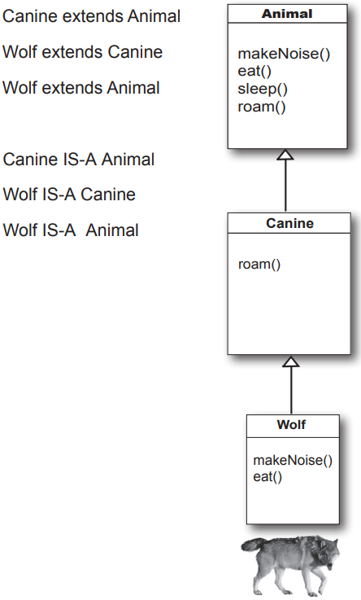
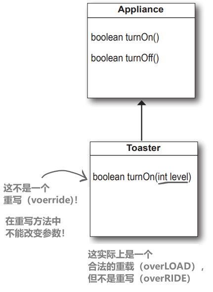

# 继承和多态性

# 继承的力量

## 对象继承是如何工作的


可以理解为 Square 继承自 Shape、Circle 继承自 Shape，依此类推。我从其他形状中移除了 `rotate()` 和 `playSound()` 方法，所以现在只需维护一个副本

Shape 类被称为其他四个类的超类。其他四个类是 Shape 的子类。<font color = red>**子类继承超类的方法**</font>。换句话说，如果 Shape 类具有某些功能，那么子类将自动获得相同的功能

## 重写方法

如果Amoeba 从Shape类继承功能，它怎么能做不同的事情呢？
这是最后一步。Amoeba 类会覆盖（override） Shape 类中需要特定的 Amoeba 行为的任何方法。然后在运行时，当Amoeba 旋转时，JVM 可以准确知道要运行哪个 rotate() 方法


## 继承的运作方式

当使用继承进行设计时，你将共同的代码放在一个类中，然后告诉其他更具体的类，这个共同的（更抽象的）类是它们的超类。当一个类从另一个类继承时，<font color = red>**子类从超类继承**</font>

在 Java 中，我们说<font color = red>**子类扩展（extends）了超类**</font>。继承关系意味着子类继承了超类的成员。当我们说 "<font color = red>**类的成员**</font>"时，我们指的是<font color = red>**实例变量和方法**</font>。例如，如果 PantherMan 是 SuperHero 的子类，那么 PantherMan 类就会自动继承所有SuperHero共有的实例变量和方法，包括suit（服装）、tights（紧身衣）、specialPower（特殊能力）、useSpecialPower()（使用特殊能力）等等。<font color = red>**但 PantherMan 子类可以添加自己的新方法和实例变量，也可以覆盖从超类 SuperHero 继承的方法**</font>


FriedEggMan不需要任何独特的行为，所以他没有覆盖任何方法。SuperHero类中的方法和实例变量已经足够了不过，然而，PantherMan 有特殊的服装和特殊能力要求，因此在 PantherMan 类中会覆盖 useSpecialPower() 和 putOnSuit() 方法

<font color = red>**实例变量不会被覆盖**</font>，因为它们不需要被覆盖。它们没有定义任何特殊行为，因此子类可以给继承的实例变量赋予任何值。PantherMan 可以将其继承的紧身衣设置为紫色，而 FriedEggMan 则将其继承的紧身衣设置为白色

尽管它们可以在子类中重新定义，但这不是一回事，而且几乎没有必要这么做

> "override" 在 Java 中通常翻译为 "重写" 或者 “覆盖”，而不是 "overwrite"。"overwrite" 通常用于指错误地覆盖或替换文件或数据，在Java中并不是一个准确的术语，更合适的说法是"override”。而在编程中，"override" 更准确地表示子类重新定义或实现其父类的方法
> 

## 继承的例子

```java
public class Doctor {
  boolean worksAtHospital;
  void treatPatient() {
	 // perform a checkup
  }
}
```

```java
public class FamilyDoctor extends Doctor {
  boolean makesHouseCalls;
  void giveAdvice() {
		// give homespun advice
  }
}
```

```java
public class Surgeon extends Doctor {
	void treatPatient() {
		// perform surgery
	}
	void makeIncision() {
		// make incision (yikes!)
	}
}
```


# 为动物模拟程序设计继承树

我一些将出现在程序中的动物列表，但并非全部

每个动物将由一个对象表示，并且这些对象将在环境中移动，执行它们各自被编程要执行的任务

希望其他程序员能够随时为程序添加新的动物种类

首先，必须找出所有动物都具有的共同、抽象的特征，并将这些特征构建到一个所有动物类都可以扩展的类中

## 1、查找具有共同属性和行为的对象

不同类型的动物相同的点在哪？这有助于抽象出行为（第2步）

这些类型之间有什么关系？这有助于定义继承树关系（第 4-5 步）

## 2、设计一个表示通用状态和行为的类

这些对象都是动物，因此将创建一个名为 "动物" 的普通超类

将添加所有动物可能需要的方法和实例变量

有五个实例变量：

- picture - 表示此动物的JPEG文件名
- food - 此动物所吃食物的类型。现在，可能只有两个值：meat（肉）或grass（草）
- hunger - 表示动物饥饿水平的整数。它会根据动物吃饭的时间（和数量）而改变
- boundaries - 表示动物将在其中漫游的“空间”的高度和宽度的值（例如，640 x 480）
- location - 动物在空间中的X和Y坐标

有四种方法：

- makeNoise() - 当动物应该发出声音时的行为
- eat() - 当动物遇到其首选食物来源（肉或草）时的行为
- sleep() - 当动物被认为是在睡觉时的行为
- roam() - 当动物不在吃饭或睡觉时的行为（可能只是四处闲逛，等待撞到食物来源或边界）


## 3、决定子类是否需要特定于该子类类型的行为（方法实现）

通过观察Animal类，决定eat()和makeNoise()应该被各个子类重写

每个动物吃的不一样，叫声也不一样，所以实例变量不可能适用与所有的动物，需要被重写


最好覆盖这两个方法，eat()和makeNoise()，这样每种动物类型都可以定义自己特定的进食和发声行为。目前看来，sleep()和roam()可以保持通用

## 4、通过寻找两个或更多可能需要共同行为的子类，寻找更多使用抽象的机会

看到Wolf和Dog可能有一些共同的行为，同样，Lion、Tiger和Cat也可能如此

重写之后动物之间的行为就不会混为一谈

但是或许可以查看Animal的子类是否可以以某种方式将两个或多个子类组合在一起，并给出只有该新组才通用的代码

比如狮子、老虎、猫是猫科动物，狼和狗是犬科动物


## 5、完成类层次结构

由于动物已经有一个组织层次结构（整个界、属、门的事情），可以使用最合理的级别进行类设计。将使用生物学上的“科”来组织动物，创建一个Feline类和一个Canine类

决定Canines可以使用一个共同的roam()方法，因为它们倾向于成群移动。还看到Felines可以使用一个共同的roam()方法，因为它们倾向于避开同类。将让Hippo继续使用其继承的roam()方法——即它从Animal那里获得的通用方法。所以目前我们对设计已经完成了；我们会在本章后期回过头来看


# 调用哪个方法？

Wolf类有四个方法。一个继承自Animal，一个继承自Canine（实际上是Animal类中一个被覆盖的方法），另外两个在Wolf类中被覆盖。当创建一个Wolf对象并将其分配给一个变量时，你可以使用该引用变量的点运算符来调用所有四个方法。但是哪个版本的这些方法被调用了呢？


当你在对象引用上调用一个方法时，你调用的是该对象类型的最具体版本的方法。换句话说，是继承树中最低的那一个！“最低”指的是在继承树中最低的位置。Canine比Animal低，而Wolf比Canine低，所以在对Wolf对象的引用上调用一个方法意味着JVM首先在Wolf类中查找。如果JVM在Wolf类中找不到方法的版本，它会开始沿着继承层次结构向上查找，直到找到一个匹配的方法

# 你说JVM会从你调用方法的类类型开始沿着继承树向上查找（就像上一页的Wolf示例）。但是如果JVM永远找不到匹配的方法，会发生什么呢？

问得好！但不必担心这个问题。编译器会保证特定的方法可以被特定的引用类型调用，但它不会在运行时说明（或关心）该方法实际上来自哪个类。以 Wolf 为例，编译器会检查是否有 sleep() 方法，但并不关心 sleep() 实际上是在 Animal 类中定义（并从该类继承）的。请记住，如果一个类继承了一个方法，它就拥有了这个方法

继承的方法在哪里定义（换句话说，在哪个超类中定义）对编译器来说并不重要。但在运行时，JVM总是会选择正确的方法。而正确的方法意味着针对该特定对象的最具体版本

# 使用 IS-A 和 HAS-A

请记住，当一个类继承自另一个类时，我们说子类扩展了超类。当你想知道一个事物是否应该扩展另一个事物时，可以使用 IS-A 测试

三角形IS-A形状，可以

猫IS-A猫科动物，可以

外科医生IS-A医生，可以

浴缸延伸浴室，听起来很合理。直到你应用 IS-A 测试。**要想知道你的类型设计是否正确，可以问："`X 类型 IS-A Y 类型`说得通吗？“**

如果不是，那么你就知道设计有问题，所以如果应用IS-A测试，浴缸IS-A浴室肯定是错误的。如果我们将其反转为浴室扩展浴缸呢？这仍然不起作用，浴室IS-A浴缸也不行。浴缸和浴室有关联，但不是通过继承

浴缸和浴室之间通过HAS-A关系连接。说 "浴室 HAS-A 浴缸" 有意义吗？如果是，那么这意味着 Bathroom 有一个 Tub 实例变量。换句话说，Bathroom 拥有对 Tub 的引用，但 Bathroom 并没有扩展 Tub，反之亦然


Bathroom HAS-A Tub and Tub HAS-A Bubbles

但没有人继承（扩展）其他人

## 利用对象的力量（拓展）

IS-A 测试适用于继承树中的任何地方。如果你的继承树设计得很好，那么当你询问任何子类是否 IS-A 它的任何超类时，IS-A 测试应该是有意义的

如果类 B 扩展了类 A，则类 B IS-A 类 A。如果类 C 扩展了类 B，那么类 C 对 B 和 A 都通过了 IS-A 测试



在这里所示的继承树中，你总是可以说 "Wolf extends Animal"（Wolf 扩展了 Animal）或 "Wolf 是 Animal"（Wolf IS-A Animal）。如果 Animal 是 Wolf 的超类的超类，也没有什么区别。事实上，只要 Animal 在继承层次结构中的某个位置高于 Wolf，Wolf IS-A Animal 就永远为真

Animal继承树的结构表明："Wolf IS-A Canine，所以 Wolf 可以做任何 Canine 可以做的事情。而Wolf是Animal，所以Wolf可以做任何Animal能做的事情。”

即使 Wolf 覆盖了 Animal 或 Canine 中的某些方法，也没有关系。对于世界（其他代码）而言，Wolf可以执行这四种方法。他如何执行它们，或者在哪个类中对它们进行了覆盖，都没有关系。Wolf可以makeNoise()，eat()，sleep()和roam()，因为Wolf扩展自Animal类

# 如何判断继承的设计是否正确？

显然，这里涉及的内容比我们到目前为止所讨论的要多，但将在下一章节中探讨更多面向对象的问题（在那里会对本章的一些设计工作进行完善和改进）

不过现在，使用 IS-A 测试是一个很好的指导原则。如果 "X IS-A Y "是有意义的，那么这两个类（X 和 Y）就应该在同一个继承层次中。它们有可能具有相同或重叠的行为

请记住，IS-A 继承关系只在一个方向上起作用！Triangle IS-A Shape是有意义的，所以可以让Triangle extend Shape。但是反过来--Shape IS-A Triangle--就说不通了，所以 Shape 不应该扩展 Triangle。**请记住，IS-A 关系意味着如果 X IS-A Y，那么 X 可以做任何 Y 可以做的事情（可能还不止这些）**

## 如果超类想使用子类版本的方法呢？

超类不一定知道它的任何子类。你可能编写了一个类，很久以后有人来扩展它。但是，即使超类的创建者知道（并想使用）某个方法的子类版本，也不存在反向或逆向继承。想想看，子类继承父类，而不是相反

## 在子类中，如果想同时使用一个方法的超类版本和我的覆盖子类版本，该怎么办？换句话说，我不想完全替换超类版本，我只想在其中添加更多内容

可以做到这一点！这是一项重要的设计功能。将 "extends"一词理解为 "我想扩展超类的功能"

```java
public void roam() {
	super.roam();       //这调用了继承的roam()版本，然后再回来执行你自己的子类特定代码
	// my own roam stuff
}
```

你可以设计超类方法，使其包含适用于任何子类的方法实现，即使子类可能仍需要 "附加" 更多代码。在子类覆盖方法中，可以使用关键字 **`super`** 调用超类版本。这就好像在说："先运行超类版本，然后回来完成我自己的代码......”

# 如何知道子类可以从超类继承什么？

子类继承超类的成员。成员包括实例变量和方法，当然本书后面我们还会介绍其他继承成员。超类可以通过特定成员的访问级别来选择是否让子类继承该成员。
本书将介绍四种访问级别。从最严格到最不严格，这四个访问级别是


访问级别控制着谁能看到什么，对于设计良好、功能强大的 Java 代码至关重要。现在我们只关注 public 和 private。这两者的规则很简单：

- public成员被继承
- private成员不被继承

当子类继承一个成员时，就好像子类自己定义了该成员。在Shape示例中，Square 继承了 rotate() 和 playSound() 方法，对于外界（其他代码）来说，Square 类只有 rotate() 和 playSound() 方法

类的成员包括类中定义的变量和方法，以及从超类继承的任何内容

# 在使用继承进行设计时，你是在使用还是在滥用？

虽然这些规则背后的一些原因要到本书的后面部分才会揭示，但现在，只需了解一些规则，就能帮助你构建更好的继承设计

**`当一个类是超类的更具体类型时，请使用继承`**

例如：Willow 是 Tree 的一个更具体的类型，所以 Willow 扩展 Tree 是合理的

**`当你有行为（执行代码）需要在同一类型的多个类中共享时，请考虑使用继承`**

例如：正方形、圆形和三角形都需要旋转和播放声音，所以将这些功能放在一个超类Shape中可能是合理的，并且更易于维护和扩展

但要注意，虽然继承是面向对象编程的关键特性之一，但它并不一定是实现行为重用的最佳方式。它可以让你入门，并且通常是正确的设计选择，但设计模式将帮助你看到其他更微妙和灵活的选项。如果你不了解设计模式，一个很好的后续读物是《Head First Design Patterns》

**`如果超类和子类之间的关系违反了上述两条规则中的任何一条，切勿为了重复使用其他类的代码而使用继承`**。例如，假设你在 Animal 类中编写了特殊的打印代码，现在你需要在 Potato 类中编写打印代码。你可能会考虑让 Potato 扩展 Animal，这样 Potato 就继承了打印代码。这没有任何意义！土豆不是动物！（因此，打印代码应该在一个Printer类中，所有可打印对象都可以通过HAS-A关系利用它）

**`如果子类和超类没有通过 IS-A 测试，切勿使用继承`**。始终问问自己子类是否是超类的更具体类型。例如 茶 IS-A 饮料是合理的。饮料 IS-A 茶 则不然

# 继承带来了什么

通过继承设计，可以获得很多面向对象的优势。可以通过将一组类共同的行为抽象出来，并将该代码放入超类中，来消除重复的代码。这样，当需要修改代码时，只需更新一个地方，而所有继承该行为的类都会反映出代码的变化

这很简单：进行修改并重新编译类。就是这样

<font color = red>**不需要触及子类！只需提供新修改过的超类，所有扩展它的类将自动使用新版本**</font>

Java 程序不过是一堆类，所以**子类不必为了使用新版本的超类而重新编译**。只要超类不破坏子类的任何功能，一切都没问题。(我们将在本书稍后讨论 "破坏 "一词的含义。现在，可以把它理解为修改超类中子类所依赖的东西，比如某个方法的参数、返回类型、方法名称等）

1、避免代码重复。将常用代码放在一处，让子类从超类继承这些代码。当你想改变这种行为时，只需在一个地方修改，其他人（即所有子类）就能看到变化

2、可以为一组类定义一个通用协议

# 继承保证了所有归类到某个超类型下的类都拥有超类型的所有方法*

<font color = red>**换句话说，你为一组通过继承产生关联的类定义了一个通用协议**</font>

当你在超类中定义可以被子类继承的方法时，你就向其他代码宣布了一种协议，即 "我的所有子类（即子类）都可以用这些方法做这些事情，这些方法看起来像这样......" 换句话说，你建立了一个契约

Animal类为所有Animal子类型建立了一个共同的协议：


记住，当我们说任何动物时，我们指的是Animal类以及任何继承自Animal类的类。换句话说，任何在继承层次结构中Animal类位于其上方的类都可以被视为“动物”

但还没到最酷的部分，因为我们将最好的——多态性——留到了最后

当你为一组类定义了一个超类型时，任何继承自这个类的子类都可以在需要超类型的地方进行替换，换句话说，可以使用子类的实例来代替超类型的实例

> *当我们说 "所有方法" 时，我们指的是 "所有可继承的方法"。现在实际上指的是 "所有公共方法"
> 

可以利用多态性的优势

可以使用声明为超类的引用来引用子类对象

说意味着可以编写非常灵活的代码

代码更简洁（更高效、更简单）。代码不仅更易于开发，而且更易于扩展，这是你在最初编写代码时从未想象过的。这意味着，当你的同事更新程序时，你可以去热带度假，而你的同事甚至可能不需要你的源代码

# 多态性的工作原理

要了解多态是如何工作的，必须回过头来看看通常如何声明一个引用并创建一个对象...

## 对象声明和赋值的 3 个步骤


### 1、声明引用变量

<div style="overflow: hidden;">
  <div style="float: left; width: 50%;">
    <pre><code>Dog myDog = new Dog()</code></pre>
  </div>
  <div style="float: right; width: 50%; text-align: right;">
    
  </div>
</div>

告诉 JVM 为引用变量分配空间。该引用变量永远是 Dog 类型。换句话说，它就像是一个遥控器，有按钮可以控制一只狗，但不能控制一只猫、一个按钮或一个插座

### 2、创建对象

<div style="overflow: hidden;">
  <div style="float: left; width: 50%;">
    <pre><code>new Dog()</code></pre>
  </div>
  <div style="float: right; width: 50%; text-align: right;">
    
  </div>
</div>

告诉 JVM 在垃圾回收堆上为新的 Dog 对象分配空间

### 3、链接对象和引用

<div style="overflow: hidden;">
  <div style="float: left; width: 50%;">
    <pre><code>=</code></pre>
  </div>
  <div style="float: right; width: 50%; text-align: right;">
    
  </div>
</div>

将新的 Dog 赋值给引用变量 myDog。换句话说，为遥控器编程

## 重要的一点是，引用类型和对象类型是相同的。在本例中，两者都是 Dog


## <font color = red>但在多态性中，引用类型和对象类型可以是不同的</font>

```java
Animal myDog = new Dog();
```


# 多态性的作用

<font color = red>**通过多态性，引用类型可以是实际对象类型的超类**</font>

声明引用变量时，任何通过引用类型 IS-A 测试的对象都可以赋值给该变量。换句话说，任何扩展了所声明的引用变量类型的东西都可以赋值给该引用变量。这样，就可以创建多态数组

例子：

```java
Animal[] animals = new Animal[5]; //声明一个类型为Animal的数组。换句话说，这个数组将存放类型为Animal的对象
animals[0] = new Dog();  
animals[1] = new Cat();
animals[2] = new Wolf();  //但看看你能做什么......可以把任何Animal的子类放进Animal数组里！
animals[3] = new Hippo();
animals[4] = new Lion();
for (Animal animal : animals) {  //这就是最棒的多态部分（整个例子的存在理由）：你可以遍历数组并调用Animal类的某个方法，每个对象都会做正确的事情
  animal.eat();   //在第一次通过循环时，animal 是一只狗，所以你得到的是狗的 eat() 方法。下一次通过时，animal 是一只猫，所以你得到的是猫的 eat() 方法
  animal.roam();  //roam()同理
}
```

但是，等等！还有更多！你可以拥有多态arguments和返回类型。如果你可以声明一个超类型的引用变量，比如说 Animal，然后给它赋值一个子类对象，比如说 Dog，想一想当引用作为方法的argument时该如何工作…

```java
class Vet {
	public void giveShot(Animal a) {
		// do horrible things to the Animal at 
		// the other end of the ‘a’ parameter
		a.makeNoise();
	}
}
```

‘a’ parameter可以接受任何Animal类型作为argument。兽医打完针后，会告诉Animal **`makeNoise()`**，而堆上真正的 **`Animal`** 对象，无论是哪种，都会运行它自己的 **`makeNoise()`** 方


```java
class PetOwner {
	public void start() {
		Vet vet = new Vet();
		Dog dog = new Dog();   //"Vet"类的"giveShot()"方法可以接受任何你传递给它的"Animal"对象作为参数。只要你传递的对象是"Animal"类的子类，这个方法就可以正常工作
		Hippo hippo = new Hippo();
		vet.giveShot(dog);   //Dog 的 makeNoise() 运行
		vet.giveShot(hippo); //Hippo 的 makeNoise() 运行
	}
}
```

<blockquote style="background-color: #fbecdd;">param作为parameter的简称，arg作为argument的简称</blockquote>

<font color = red>**使用多态参数编写代码，将方法param声明为超类类型，就可以在运行时传入任何子类对象**</font>。因为这也意味着，可以在写完代码后去度假，别人可以在程序中添加新的子类类型，而我的方法仍然可以工作......

有了多态性，当你在程序中引入新的子类类型时，就可以编写无需更改的代码。如果在编写Vet类时将args声明为Animal类型，那么你的代码就可以处理任何Animal子类

这意味着，如果其他人想利用你的Vet类，只需确保他们的新Animal类型扩展了Animal类。尽管Vet类在编写时并不了解Vet将要处理的新Animal子类，但Vet方法仍能正常工作

为什么多态性能保证以这种方式工作？为什么总是可以安全地假定任何子类类型都具有你认为要调用的超类类型（即你使用点操作符的超类引用类型）上的方法？

# 子类的级别有什么实际限制吗？能做到多深？

在Java API中，大多数继承层次结构都是宽而不深的。大多数不会超过一两个层级，尽管也有例外情况（特别是在GUI类中）。你会发现，通常将继承树保持较浅是更合理的，但并没有硬性限制（至少你不太可能遇到）

# 无法访问某个类的源代码，但又想改变该类的方法，能用子类来实现吗？扩展这个 "坏" 类，然后用自己的更好的代码覆盖这个方法？

可以。这是面向对象编程的一个很酷的特性，有时它可以让你不必从头开始重写类，也不必追查隐藏源代码的程序员，你可以通过子类化来扩展那个“坏”类，并使用你自己更好的代码来覆盖（override）方法

# 可以扩展任何类吗？还是像类成员一样，如果类是私有的，你就不能继承它......

 没有所谓的私有类，除了一种非常特殊的情况，即内部类

有三种情况可以阻止一个类被子类化：

1. **访问控制**
    
    尽管类不能被标记为私有，但类可以是非公有的（如果不将类声明为公有，就会得到非公有类）。非公有类只能被同一个包内的类子类化，不同包内中的类不能子类化（甚至不能使用）非公有类
    
2. **关键字修饰符 final**
    
    final 类意味着继承线的终点。任何人都不能扩展 final 类
    
3. **如果一个类只有私有构造函数，它就不能被子类化**

# 为什么要创建final类？防止类被子类化有什么好处？

通常情况下，你不会把类设为final类。但如果你需要安全性--知道方法将始终按照你编写的方式工作（因为它们不能被覆盖），那么 final 类就能给你带来这种安全性。因此，Java API 中的很多类都是 final 类。例如，String类就是 final 类，因为想象一下，如果有人改变了String的行为方式会造成多大的破坏

# 可以将一个方法设为 final，而不是整个类吗？

如果你想保护某个特定方法不被覆盖，可以用 final 修饰符标记该方法。如果你想保证类中的所有方法都不会被覆盖，则可以将整个类标记为 final

# 覆盖方法——遵守合约：覆盖的规则

当覆盖一个超类的方法时，就意味着你同意履行契约。例如，合约中写道："不接受任何参数且返回一个布尔值"。换句话说，重载方法的参数和返回类型在外界看来必须与超类中的重载方法一模一样

**方法就是契约**

如果要实现多态性，那么在运行时，Toaster版本的重写方法必须能够从Appliance继承并正常工作。请记住，编译器会查看引用类型，以决定是否可以调用引用上的特定方法


当你有一个指向Toaster的Appliance引用时，编译器只关心类 Appliance 是否具有你在 Appliance 引用上调用的方法。但在运行时，JVM 不会查看引用类型（Appliance），而是查看堆上实际的 Toaster 对象



因此，如果编译器已经批准了方法调用，那么<font color = red>**唯一可行的方法就是覆盖方法具有相同的args和返回类型**</font>。否则，拥有 Appliance 引用的人会将`turnOn()`作为无参数方法调用，即使 Toaster 中有一个使用 int 的版本。运行时调用哪一个？Appliance 中的那个。换句话说，**Toaster 中的`turnOn(int level)`方法不是重载！**

> 在Java中，overload（重载）和override（重写）是两种不同的概念：
> 
> 1. **重载（Overloading）**：
>     - 发生在同一个类中
>     - 方法名相同，但是参数列表不同（参数类型、个数或顺序不同）
>     - 返回类型可以不同，不影响重载
>     - 重载是编译时的多态性表现
> 2. **重写（Overriding）**：
>     - 发生在父子类之间
>     - 方法名和参数列表都必须相同
>     - 返回类型和声明的异常类型要兼容（子类可以缩小返回类型，抛出更具体的异常）
>     - 重写是运行时的多态性表现
>     - 子类方法不能有更严格的访问权限
> 
> 简单来说，重载是在一个类里面，方法名相同但参数不同；重写是在继承关系中，子类改写父类的方法
> 

# <font color = red>1. arguments必须相同，返回类型必须兼容</font>

超类的契约定义了其他代码如何使用方法。无论超类将什么作为arg，覆盖该方法的子类都必须使用相同的arg。无论超类声明了什么返回类型，重写方法都必须声明相同类型或子类类型。请记住，子类对象保证能够执行其超类声明的任何操作，所以在需要超类的地方返回子类是安全的

# <font color = red>2. 方法的访问权限不能低</font>

这意味着**访问级别必须相同或更友好**。例如，你不能覆盖一个public方法并将其设为private。如果在运行时JVM突然关闭了门，因为在运行时调用的重写版本是私有的，那么对于在编译时认为它是公有方法的代码来说，这将是多么的震惊！


到目前为止，了解了两个访问级别：private和public。另外两个在[附录B](./21-附录B.md#访问级别和访问修饰符谁能看到什么)中。关于重写的还有另一个规则与异常处理相关，但将等到第13章，“风险行为”，再讨论这个话题

# 重载（overloading）方法

方法重载不过是<font color = red>**两个名称相同但args列表不同**</font>的方法。重载方法不涉及多态性！

重载让你可以用不同的args列表为一个方法创建多个版本，以方便调用者。例如，如果你有一个只接受 int 的方法，那么调用代码在调用你的方法之前，必须先将 double 转换为 int。但如果你将该方法重载为另一个使用 double 的版本，那么为调用者简化了操作

由于重载方法并不试图满足其超类定义的多态性契约，因此重载方法具有更大的灵活性

## 1. 返回类型可以不同

可以在重载方法中自由更改返回类型，只要参数列表不同

## 2. 不能只改变返回类型

如果只有返回类型不同，那就不是有效的重载——编译器会认为你试图覆盖（override）方法。即使是这样，除非返回类型是超类中声明的返回类型的子类型，否则也是不合法的。<font color = red>要重载一个方法，必须更改参数列表，尽管你可以将返回类型改为任何类型</font>

## 3. 可以在任何方向上改变访问级别

你可以用一个限制性更强的方法来重载一个方法。这并不重要，因为新方法没有义务履行重载方法的契约

重载的方法只是一个具有相同方法名的不同方法。它与继承和多态性无关。重载（overloaded）的方法与重写（overridden）的方法不同

重载方法的合法例子：

```java
public class Overloads {
	String uniqueID;

	public int addNums(int a, int b) {
		return a + b;
	}

	public double addNums(double a, double b) {
		return a + b;
	}

	public void setUniqueID(String theID) {
		// lots of validation code, and then:
		uniqueID = theID;
	}

	public void setUniqueID(int ssNumber) {
		String numString = "" + ssNumber;
		setUniqueID(numString);
	}
}
```