# 接口和抽象类

**接口**：100% 抽象类

**抽象类**：无法实例化的类

在设计时是否忘记了什么？

这个类的结构还不错。我们在设计时尽量减少了重复代码，并重写了我们认为应该有特定子类实现的方法。从多态性的角度来看，我们将其设计得既漂亮又灵活，因为我们在设计使用 Animal 的程序时，可以使用 Animal 参数（和数组声明），这样任何 Animal 子类型（包括我们在编写代码时从未想到过的子类型）都可以在运行时传入并使用。我们已经将所有动物的通用协议（我们希望全世界都知道所有动物都有的四种方法）放到了动物超类中，现在我们可以开始制作新的狮子、老虎和河马了

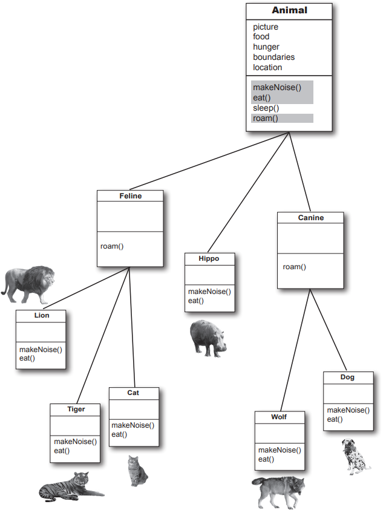

可以这样：

```java
Wolf aWolf = new Wolf();
```

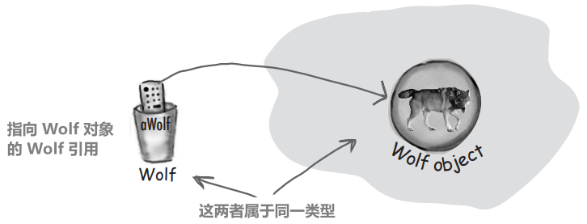

还可以这样：

```java
Animal aHippo = new Hippo();
```

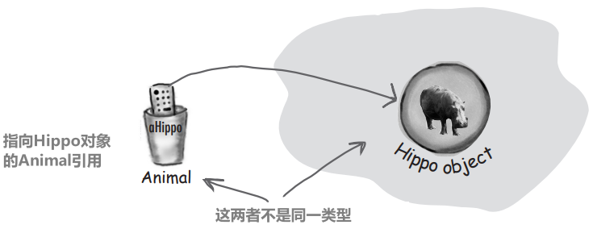

奇怪的地方：

```java
Animal anim = new Animal();
```

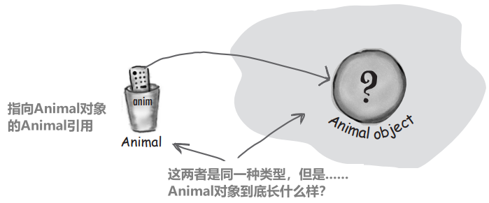

# 当对象变坏的时候，一个新的Animal类看起来是什么

实例变量值是什么？

有些类不该被实例化

要创建狼、河马或老虎的对象是有意义的，但是Animal对象到底是什么？它的形状是什么？颜色、大小、腿的数量是多少？

尝试创建一个Animal类型的对象就像是《星际迷航》中的传送器事故一样，就是在传送过程中缓冲区发生了一些不好的事情

但我们该如何处理这个问题？我们需要一个Animal类，用于继承和多态性。但我们希望程序员只实例化Animal类的更具体的子类，而不是Animal本身。我们想要的是老虎对象和狮子对象，而不是Animal对象

有一种简单的方法可以防止一个类被实例化。换句话说，阻止任何人对该类型使用“new”。通过将类标记为`abstract`，通过将类标记为抽象类，编译器将阻止任何代码在任何地方创建该类型的实例

你仍然可以将该抽象类型用作引用类型。事实上，这也是你创建抽象类的主要原因（将其用作多态参数或返回类型，或创建多态数组）

在设计类继承结构时，你必须决定哪些类是抽象的，哪些是具体的。具体类是那些具体到可以实例化的类。具体类只意味着可以创建该类型的对象

创建抽象类很简单，在类声明前加上关键字 **`abstract`** 即可：

```java
abstract class Canine extends Animal {
	public void roam() { }
}
```

# 编译器不会让你实例化一个抽象类

抽象类意味着没有人可以创建该类的新实例。出于多态性的目的，你仍然可以将该抽象类用作已声明的引用类型，但不必担心有人会创建该类型的对象。编译器会保证这一点

```java
abstract public class Canine extends Animal 
{
	public void roam() { }
}
```

```java
public class MakeCanine {
	public void go() {
		Canine c; 
		c = new Dog();  //这是可以的，因为你总是可以将一个子类对象赋给一个超类引用，即使这个超类是抽象的
		c = new Canine(); //类 Canine 被标记为抽象的，那么编译器将不允许这样做
		c.roam();
	}
}
```

除非对抽象类进行扩展，否则它几乎*没有任何用途、价值和意义。有了抽象类，运行时工作的是抽象类的子类实例

*但有一个例外——抽象类可以有静态成员（参见第 10 章）

# 抽象类 vs. 具体类

不抽象的类称为具体类（Concrete Class）。在动物继承树中，如果我们将 Animal、Canine 和 Feline 抽象化，那么具体子类就剩下 Hippo、Wolf、Dog、Tiger、Lion 和 Cat

在Java API中，你会发现很多抽象类，尤其是在图形用户界面（GUI）库中。GUI 组件是什么样的？Component类是所有GUI相关类的超类，这些类包括按钮、文本区域、滚动条、对话框等。你不能创建一个通用组件（Component）的实例，然后把它放到屏幕上；你需要创建一个 JButton

换句话说，你只能实例化 Component 的一个具体子类，而不能实例化 Component 本身

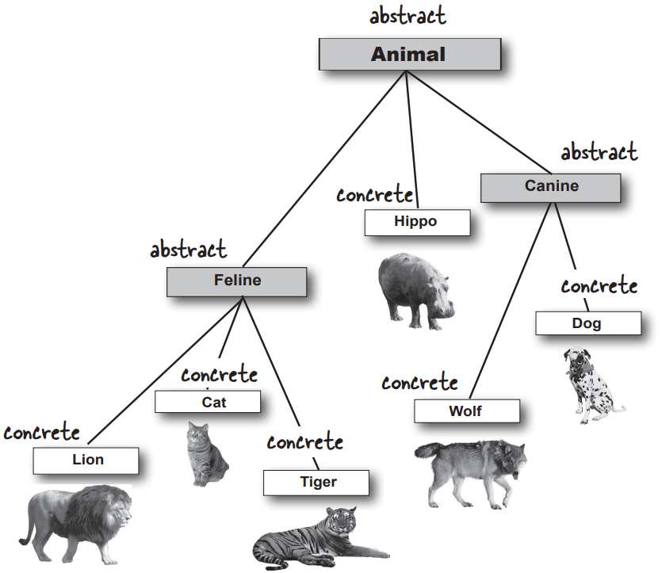

如何判断一个类应该是抽象类？葡萄酒可能是抽象的。那么红葡萄酒和白葡萄酒呢？同样可能是抽象的（反正对我们中的某些人来说）。但是，在层次结构中，什么时候事情会变得具体呢？

是将 PinotNoir 具体化，还是抽象化？看起来，无论如何，Camelot Vineyards 1997 Pinot Noir都可能是具体的。但你如何确定呢？

看看上面的动物继承树。我们对哪些类是抽象类，哪些是具体类所做的选择看起来合适吗？你会改变动物继承树中的任何内容吗（当然，除了增加更多的动物之外）？

# 抽象方法

除了类，还可以将方法标记为抽象（abstract）方法。抽象（abstract）类表示该类必须被扩展；抽象方法表示该方法必须被重写（overridden）。你可能会认为抽象类中的某些（或全部）行为没有任何意义，除非由更具体的子类来实现。换句话说，你无法想到任何可能对子类有用的通用方法实现。通用的 eat() 方法是什么样的呢？

<blockquote style="background-color: #fdebec;"> <b>抽象方法没有主体！</b></blockquote>


因为已经确定抽象方法中没有任何代码是有意义的，所以不会在方法中加入主体。所以不用大括号，只用分号结束声明

```java
public abstract void eat(); //没有方法体！以分号结尾
```

<blockquote style="color:red;background-color: #fdebec;"> <b>如果声明了一个抽象方法，必须将该类也标记为抽象类。非抽象类中不能有抽象方法</b></blockquote>


如果在一个类中放置了哪怕一个抽象方法，就必须使这个类成为抽象类。**但可以在抽象类中混合使用抽象和非抽象方法**

# 抽象方法有什么意义？我以为抽象类的全部意义就在于拥有可以被子类继承的通用代码

可继承的方法实现（换句话说，有实际主体的方法）放在超类中是件好事。当它有意义的时候。而在抽象类中，通常是没有意义的，因为你不可能想出任何子类会觉得有用的通用代码。抽象方法的意义在于，即使你没有输入任何实际的方法代码，你仍然为一组子类（子类）定义了部分协议

# 这很好，因为...

多态性！记住，你想要的是能够将超类类型（通常是抽象类型）作为方法args、返回类型或数组类型使用。这样，你就可以在不需要重写（或添加）新方法来处理这些新类型的情况下，向你的程序中添加新的子类型（比如一个新的Animal子类）。试想一下，如果Vet类不使用Animal作为方法的args类型，你将如何改变它。每个Animal子类都必须有一个单独的方法！一个接受Lion的方法，一个接受Wolf的方法，一个接受…你懂的。因此，有了抽象方法，你就可以说："这个类型的所有子类都有这个方法"，从而获得多态性的好处

# 必须实现所有抽象方法

<blockquote style="background-color: #fdebec;"> 实现抽象方法就像重写（overriding）方法一样</blockquote>


抽象方法没有主体；它们的存在完全是为了多态性。这意味着<font color = red>**继承树中的第一个具体类必须实现所有抽象方法**</font>

不过，你可以通过抽象自己来推卸责任。例如，如果 Animal 和 Canine 都是抽象类，并且都有抽象方法，那么类 Canine 就不必实现 Animal 的抽象方法。
但只要进入第一个具体子类，如 Dog，该子类就必须实现 Animal 和 Canine 的所有抽象方法。但请记住，一个抽象类可以同时拥有抽象方法和非抽象方法，因此例如 Canine 可以实现 Animal 的一个抽象方法，这样 Dog 就不必实现。但如果 Canine 对 Animal 的抽象方法只字不提，那么 Dog 就必须实现 Animal 的所有抽象方法

当我们说 <font color = red>"必须实现抽象方法"</font> 时，这意味着<font color = red>**必须提供一个主体**</font>。这意味着你必须在你的类中创建一个非抽象方法，该方法具有相同的方法签名（名称和argumrents）以及与抽象方法声明的返回类型兼容的返回类型。至于该方法的内容，则由你自己决定。Java 关心的只是该方法是否存在于你的具体子类中

# 多态性的作用

多态性的例子

假设我们想编写自己的列表类，一个可以保存 Dog 对象的列表类，但先假装我们不知道 ArrayList 类。首先，只给它一个 add() 方法。我们将使用一个简单的 Dog 数组 (Dog[]) 来保存添加的 Dog 对象，长度为 5。当我们达到 5 个 Dog 对象的上限时，仍然可以调用 add() 方法，但它不会做任何事情。如果我们没有达到上限，add() 方法会将 Dog 放入数组中下一个可用索引位置，然后递增下一个可用索引 (nextIndex)

创建我们自己的狗狗专用列表（也许这是世界上最糟糕的尝试，我们从零开始创建了自己的 ArrayList 类）

```java
public class MyDogList {
	private Dog[] dogs = new Dog[5]; //在幕后使用一个普通的 Dog 数组
	private int nextIndex = 0; //每次添加新的 Dog 时，我们都会递增这个数组

	public void add(Dog d) {
		if (nextIndex < dogs.length) { //如果我们还没有达到 Dog 数组的极限，则添加 Dog 并打印一条信息
			dogs[nextIndex] = d;
			System.out.println("Dog added at " + nextIndex);
			nextIndex++; //增加，以便给我们提供下一个要使用的索引
		}
	}
}
```

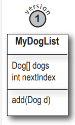

# 还需要一个猫

有几种选择：

1. 创建一个单独的类 MyCatList 来保存猫对象。非常笨重
2. 创建一个类 DogAndCatList，将两个不同的数组作为实例变量，并使用两个不同的 add() 方法：addCat(Cat c) 和 addDog(Dog d)。也是笨拙的解决方案
3. 创建一个异构的 AnimalList 类，该类可以接受任何种类的 Animal 子类（如果规范改为添加Cat，那么迟早也会添加其他种类的动物）。最喜欢这个选项，所以修改类，使它更通用，可以接受 Aminal 而不仅仅是 Dog。突出显示了关键的改动（当然，逻辑是一样的，但代码中的所有地方都将类型从 Dog 变成了 Animal）

# 创建我们自己的动物特定列表

```java
public class MyAnimalList {
	private Animal[] animals = new Animal[5]; //别慌。我们不是在创建一个新的Animal对象，而是在创建一个新的Animal类型的数组对象。(记住，不能创建一个抽象类型的新实例，但你可以创建一个数组对象来声明**持有**该类型）
	private int nextIndex = 0;
	
	public void add(Animal a) {
		if (nextIndex < animals.length) {
		animals[nextIndex] = a;
		System.out.println("Animal added at " + nextIndex);
		nextIndex++;
		}
	}
}
```

```java
public class AnimalTestDrive {
	public static void main(String[] args) {
		MyAnimalList list = new MyAnimalList();
		Dog dog = new Dog();
		Cat cat = new Cat();
		list.add(dog);
		list.add(cat);
	}
}
```

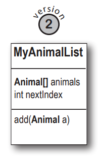

```java
% java AnimalTestDrive
Animal added at 0
Animal added at 1
```

# 终极超类： 对象（Object）

非动物类呢？为什么不创建一个类足够通用到可以接受任何东西

你知道这是怎么回事。要把数组的类型，连同 add() 方法的arg，改成比 Animal 更高级的类型。比 Animal 更通用、更抽象的类型。但该怎么做？我们没有 Animal 的超类。不过，也许可以…

## <font color = red>Java 中的每个类都扩展了 Object 类</font>

**类 Object 是所有类之母；它是一切类的超类**

即使利用了多态性，仍然必须创建一个类，该类的方法可以接收和返回你的多态类型。如果 Java 中没有一个适用于所有事物的通用超类，Java 开发人员就没有办法创建带有方法的类，这些方法可以使用自定义类型......这些类型是他们在编写库类时所不知道的

因此，你从一开始就在创建 Object 类的子类，而你却浑然不知。你编写的每一个类都扩展了 Object，而你根本不需要说出来。但你可以把它想象成你编写的类是这样的：

```java
public class Dog extends Object { }
```

Dog 已经扩展了Canine。没关系，编译器会让 Canine 扩展 Object。除非Canine 扩展了 Animal。没问题，编译器会让 Animal 扩展 Object

## <font color = red>任何没有显式扩展另一个类的类都隐式扩展了Object</font>

因此，由于 Dog 扩展了 Canine，所以它并没有直接扩展 Object（尽管它确实间接扩展了 Object），Canine 也是如此，但 Animal 确实直接扩展了 Object

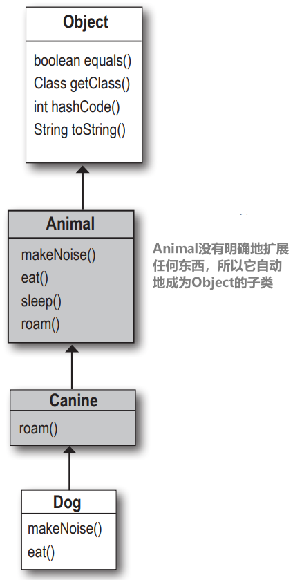

# 超级大的Object类中有什么呢？

如果你是 Java，你希望每个对象都有哪些行为？嗯......让我想想......让你找出一个对象是否等于另一个对象的方法怎么样？一个能告诉你该对象实际类类型的方法怎么样？也许还有一种方法能给你一个对象的哈希码，这样你就可以在哈希表中使用这个对象了。哦，还有一个不错的方法--打印出该对象的字符串信息

你知道吗？就像变魔术一样，Object 类确实有实现这四件事的方法。这还不是全部，但这些才是我们真正关心的

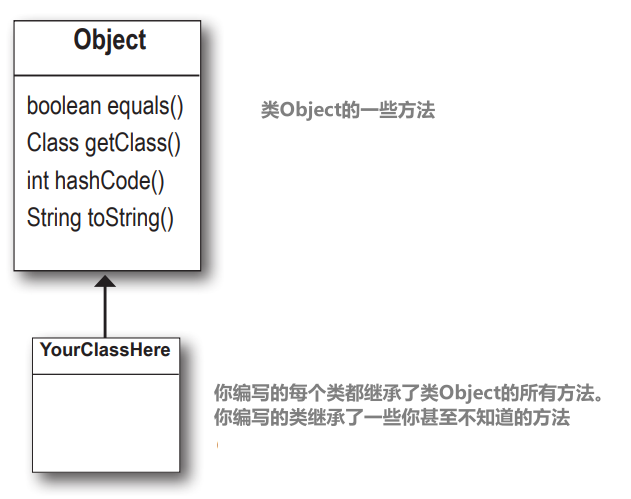

## equals(Object o)

```java
Dog a = new Dog();
Cat c = new Cat();
 
if (a.equals(c)) {
	System.out.println("true");
} else {
	System.out.println("false");
}
```

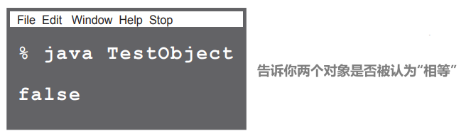

## getClass()

```java
Cat c = new Cat();
System.out.println(c.getClass());
```

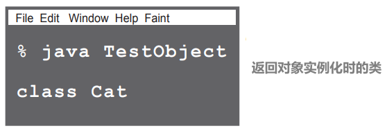

## hashCode()

```java
Cat c = new Cat();
System.out.println(c.hashCode());
```

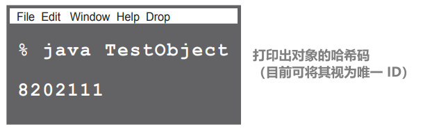

## toString()

```java
Cat c = new Cat();
System.out.println(c.toString());
```

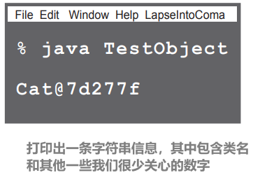

# 类 Object 是抽象的吗？

不是，反正不是正式 Java 意义上的抽象。Object 是一个非抽象类，因为它的方法实现代码是所有类都可以继承和使用的，而无需覆盖这些方法

# 可以覆盖 Object 中的方法吗？

部分可以。但有些方法被标记为 `final`，这意味着不能覆盖它们。我们（强烈）鼓励你在自己的类中覆盖 `hashCode()`、`equals()` 和 `toString()`。但有些方法，如 getClass()，必须以特定的、有保证的方式运行

# 你怎么能让别人创建Object对象？这不是和创建Animal对象一样奇怪吗？

问得好！为什么可以创建一个新的 Object 实例？因为有时你只是想要一个通用对象作为一个对象使用。一个轻量级对象。现在，就把这个问题放在一边，假设你很少会创建Object类型的对象，即使你可以

# 那么是不是可以说，Object 类型的主要目的是用作多态参数和返回类型？

Object 类有两个主要用途：充当多态类型，用于需要在你或其他人创建的任何类上工作的方法；提供 Java 中所有对象在运行时都需要的真正的方法代码（将它们放在 Object 类中意味着所有其他类都继承它们）。Object 中的一些最重要的方法与线程有关，将在本书的后面部分看到这些

# 如果使用多态类型这么好，为什么你不让所有的方法都接受和返回Object类型呢？

啊......想想会发生什么吧。首先，你会破坏 "类型安全" 的全部意义，这是Java为你的代码提供的最大保护机制之一。有了类型安全，Java 保证你不会要求错误的对象去做你想让另一种对象类型做的事情。比如，让一辆法拉利（你以为是个烤面包机）自烹

但事实上，即使你对所有东西都使用Object引用，也不必担心法拉利会着火。因为当对象被Object引用类型引用时，Java 会认为它引用的是Object类型的实例。这意味着只能调用Object类中声明的方法！

因此，如果说 `Object o = new Ferrari(); o.goFast(); //Not legal！`

甚至连编译器都无法通过。因为 Java 是一种强类型语言，编译器会检查以确保确保你调用的方法是对象实际上能够响应的。换句话说，<font color = red>**只有当引用类型的类确实拥有该方法时，才能调用对象引用上的方法**</font>

# 使用类型为Object的多态引用是有代价的...

在你开始使用 Object 类型来处理所有超灵活的参数和返回类型之前，你需要考虑一个将 Object 类型用作引用的小问题。请记住，我们不是在讨论创建 Object 类型的实例；我们是在讨论创建其他类型的实例，但使用的是 Object 类型的引用

当你将一个对象放入 `ArrayList<Dog>` 时，它进去时是一只 Dog，出来时也是一只 Dog：

```java
ArrayList<Dog> myDogArrayList = new ArrayList<Dog>(); //创建一个 ArrayList，用于保存 Dog 对象
Dog aDog = new Dog(); //创建Dog
myDogArrayList.add(aDog); //创建Dog
Dog d = myDogArrayList.get(0); //将列表中的 Dog 赋值给一个新的 Dog 引用变量。(把它想象成 get() 方法声明了一个 Dog 返回类型，因为你使用了 ArrayList**<Dog>**）
```

但如果将其声明为 `ArrayList<Object>`会发生什么呢？如果想创建一个可以接受任何类型对象的 ArrayList，可以这样声明：

```java
ArrayList<Object> myDogArrayList = new ArrayList<Object>(); //创建一个 ArrayList，声明它可以容纳任何类型的对象
Dog aDog = new Dog(); //创建Dog
myDogArrayList.add(aDog); //创建Dog   这两步和上面的例子相同
```

但是，当你尝试获取 Dog 对象并将其赋值给 Dog 引用，会发生什么呢？

```java
Dog d = myDogArrayList.get(0);
```

不！无法编译！当你使用`ArrayList<Object>`时，`get()`方法返回的类型是Object。编译器只知道该对象继承自Object（在其继承树的某处），但它并不知道这是一个Dog！

无论实际对象是什么，或者将对象添加到列表时的引用类型是什么，所有从`ArrayList<Object>`中取出的都是Object类型的引用

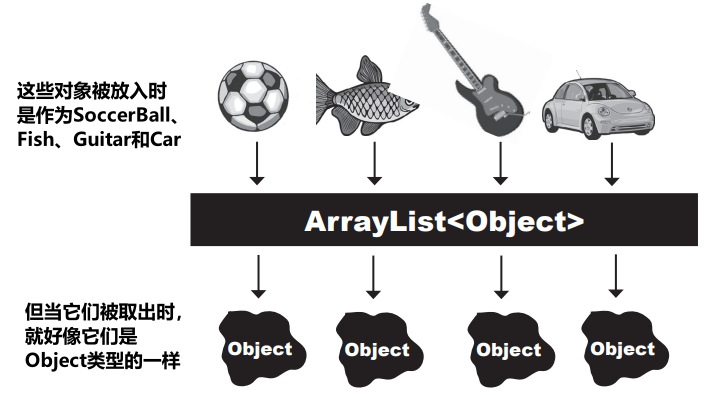

从`ArrayList<Object>`中取出对象时，这些对象就像是`Object`类的通用实例。编译器不能假设取出的对象是除`Object`以外的任何类型

# 当Dog表现得不像Dog

把所有东西都多态地视为Object的问题在于，对象似乎失去了（但不是永久失去）其真正的本质。“狗”似乎失去了它的 "狗性"。当我们将一只 Dog 传递给一个方法，而该方法返回的是同一个 Dog 对象的引用，但将返回类型声明为 Object 而不是 Dog 时，会发生什么

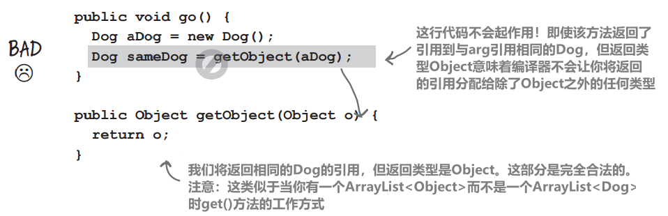

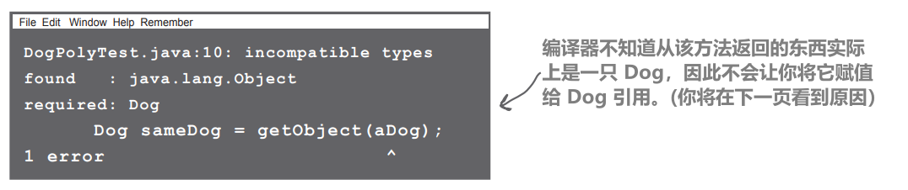

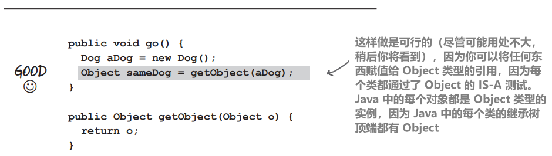

# Object不会bark

现在我们知道，当一个对象被一个声明为类型Object的变量引用时，它不能被赋值给一个声明为实际对象类型的变量。我们也知道，当返回类型或参数声明为类型Object时，这种情况可能发生，例如，当对象被放入一个ArrayList类型为Object的ArrayList中时。但这会有什么影响呢？将一个Dog对象引用变量引用到一个Object对象上是否是一个问题呢？让我们尝试在我们的Dog-That-Compiler-Thinks-Is-AnObject上调用Dog方法：

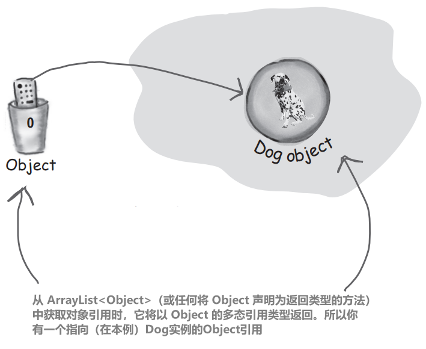

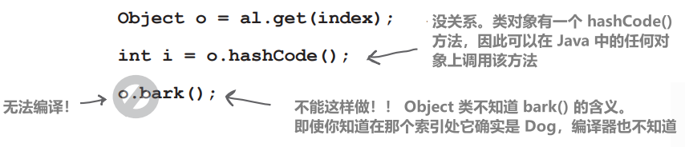

<blockquote style="color:red;background-color: #fdebec;"> <b>编译器会根据引用类型而不是实际对象类型来决定是否可以调用方法
</b></blockquote>

即使你知道这个对象是有能力的（"......但它确实是一只Dog，真的......"），编译器也只能将其视为一个通用对象。编译器只知道你放了一个 Button 对象。或者一个 Microwave 对象。或者是其他不知道如何bark的东西

编译器会检查引用类型的类，而不是对象类型，以确定是否可以使用该引用调用方法

在引用上调用的方法必须在该引用类型的类中。实际对象是什么并不重要

"o" 引用被声明为Object类型，因此只有Object类中的方法才能被调用

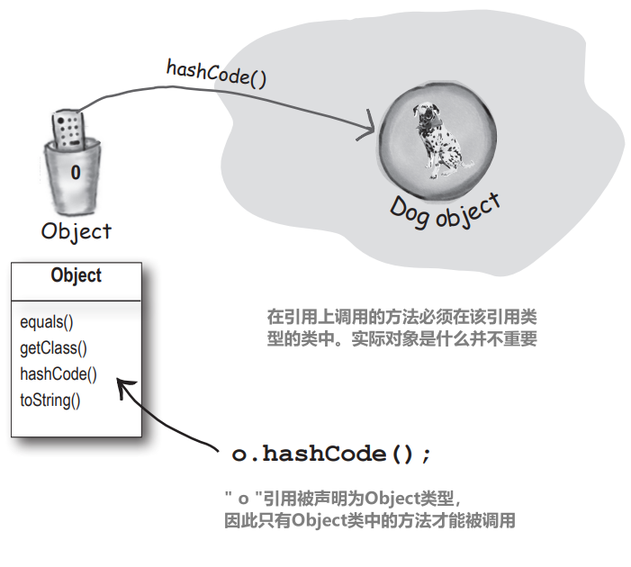

# 内在对象（inner Object）

一个对象包含它从每个超类继承的所有内容。这意味着每个对象，无论其实际类类型如何，都是Object类的实例。这意味着 Java 中的任何对象不仅可以被视为 Dog、Button 或 Snowboard，还可以被视为 Object。当你说 `new Snowboard()`时，会在堆上得到一个单独的对象——一个 Snowboard 对象，但是这个 Snowboard 将自己围绕在一个Object对象（大写 "O"）部分的内核周围

<div style="overflow: hidden;">
  <div style="float: left; width: 50%;">
    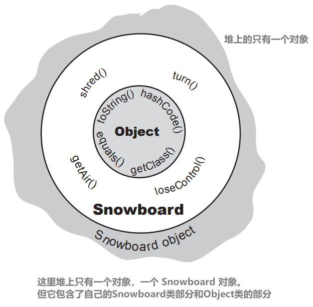
  </div>
  <div style="float: right; width: 50%; text-align: right;">
    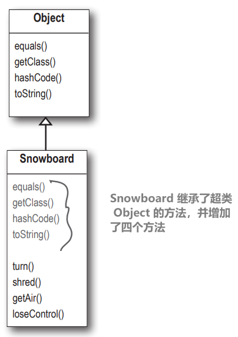
  </div>
</div>

## 多态意味着 "多种形式"。可以将Snowboard视为Snowboard，也可以将其视为Object

如果说引用就像遥控器，那么随着继承树的向下移动，遥控器上的按钮就会越来越多。Object类型的遥控器（引用）只有几个按钮，即Obbject类公开方法的按钮。但是，Snowboard类型的遥控器包括Object类的所有按钮，以及 Snowboard类的任何新按钮（对应新方法）。类越具体，按钮就越多

当然，这并不总是正确的；子类可能不会添加任何新方法，而只是覆盖其超类的方法。<font color = red>**关键在于，即使对象属于 Snowboard 类型，一个指向Snowboard对象的Object引用也无法看到Snowboard特有的方法**</font>

当将一个对象放入`ArrayList<Object>`时，无论你放入时它的类型是什么，只能将其视为一个Object。当你从`ArrayList<Object>`获取一个引用时，该引用总是Object类型的。这意味着你得到的是一个Object类型的遥控器

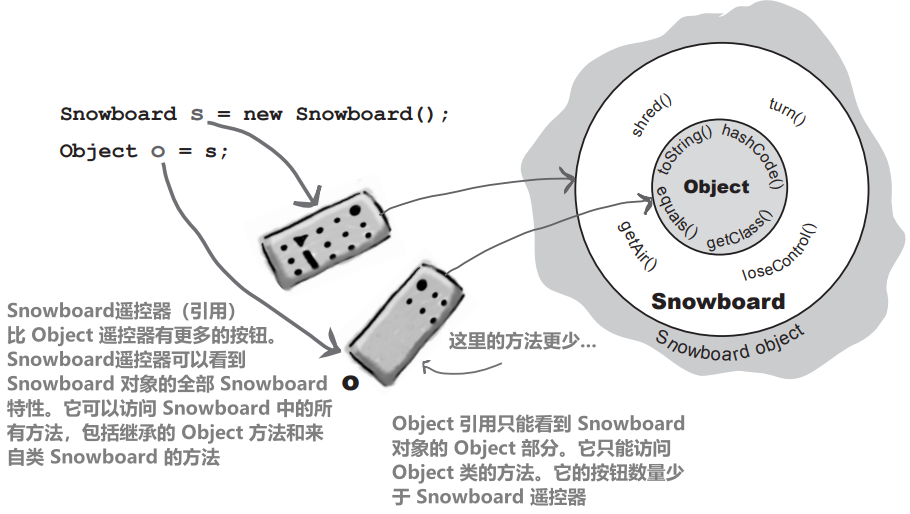

# 将对象引用转换回实际类型

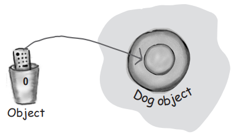

它确实还是一个 Dog 对象，但如果要调用特定于 Dog 的方法，就需要一个声明为 Dog 类型的引用。如果确定对象确实是 Dog，就可以通过复制Object引用来创建一个新的 Dog 引用，并使用`cast(Dog)`强制将该副本赋值给 Dog 引用变量。你可以使用新的 Dog 引用来调用 Dog 方法

```java
Object o = al.get(index);
Dog d = (Dog) o; //将 Object 强制转换回我们知道的 Dog
d.roam();
```

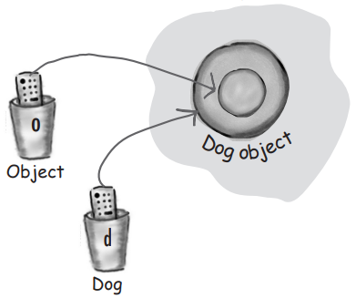

如果你不确定它是一只狗，你可以使用 `instanceof`操作符来检查。因为如果你在转换时出错了，你就会在运行时收到 `ClassCastException` 异常，然后突然停止

```java
if (o instanceof Dog) {
	Dog d = (Dog) o;
}
```

## 现在已经知道 Java 对引用变量所属类中的方法有多在意

## 只有当引用变量的类中有该方法时，才能调用对象上的方法

## 把类中的公共方法看作是你的契约，是你对外界关于你能做的事情的承诺

当你编写一个类时，几乎总是要向类外的代码公开其中的一些方法。公开一个方法意味着你可以访问一个方法，通常是通过标记它为public来实现

想象一下这样的场景：你正在为一个小型企业的会计程序编写代码。这是为西蒙冲浪店定制的应用程序。作为一个优秀的重复用户，你找到了一个 Account 类，根据文档，它似乎完全满足需求。每个账户实例都代表一个客户在商店的账户。因此，当你在调用 Account 对象的 credit() 和 debit() 方法时，发现自己需要获取某个账户的余额。没问题，有一个 getBalance() 方法就可以了

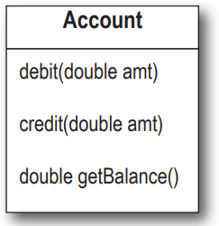

只是......当你调用 getBalance() 方法时，整个程序在运行时就会崩溃。别管文档了，这个类没有这个方法

但这种情况不会发生在你身上，因为每次在引用上使用点运算符（`a.doStuff()`）时，编译器都会查看引用类型（"a" 被声明的类型）并检查该类确保该类具有该方法，而且该方法确实接受了你传递的参数并返回了你期望返回的值

<blockquote style="color:red;background-color: #fdebec;"> <b>请记住，编译器检查的是引用变量的类，而不是引用另一端实际对象的类</b></blockquote>

# 修改类树（类的继承结构，class tree）

如果需要修改契约怎么办

好吧，就当你是一只狗。你的 Dog 类并不是定义你的唯一契约。请记住，你从所有的超类中继承了可访问的（通常是public）方法

的确，你的 Dog 类<font color = red>**定义了一个契约，但并不是你所有的契约**</font>

Canine 类中的一切都是你合约的一部分

Animal 类中的一切都是你合约的一部分

Object类中的一切都是你合约的一部分

根据 IS-A 测试，你就是这些事物中的每一个——Canine、Animal和Object

但是，如果设计你的类的人考虑的是Animal模拟程序，而现在他想用你（Dog类）来做一个关于动物对象的科学展示教程

没关系，你可能可以重复使用

但如果以后他想用你来编写宠物商店程序呢？你没有任何宠物行为。宠物需要 `beFriendly()` 和 `play()` 这样的方法

好吧，现在假装你是 Dog 类程序员。没问题吧？只要在 Dog 类中增加一些方法就可以了。你没有因为添加方法而破坏其他人的代码，因为你并没有触及其他人的代码可能在 Dog 对象上调用的现有方法

你觉得这种方法（在 Dog 类中添加 Pet 方法）有什么缺点吗？

想一想，如果你是 Dog 类的程序员，需要修改 Dog，让它也能做Pet的事情，你会怎么做？我们知道，只要在 Dog 类中添加新的Pet行为（方法）就可以了，而且不会破坏其他人的代码

但是......这是一个 PetShop 程序。它不只有Dogs！如果有人想在一个有野生Dogs的程序中使用你的 Dog 类呢？你的选择是什么？在不考虑 Java 如何处理问题的情况下，试着想象一下如何解决修改你的一些Animal类以包含Pet行为的问题

# 让我们探讨一下在 PetShop 程序中重复使用一些现有类的设计方案

## 第一个方案

采取简单的方法，把pet方法放在Animal类中

**优点：**

所有 Animals 都将立即继承宠物行为。完全不必触动现有的 Animal 子类，将来创建的任何 Animal 子类也将继承这些方法。这样，在任何想把动物当作宠物的程序中，类 Animal 都可以用作多态类型

**缺点：**

那么......你上次在宠物店看到河马是什么时候？狮子？狼？给非宠物提供宠物方法可能很危险

此外，我们几乎肯定会接触到宠物类，如狗和猫，因为狗和猫在执行宠物行为时往往会有很大的不同

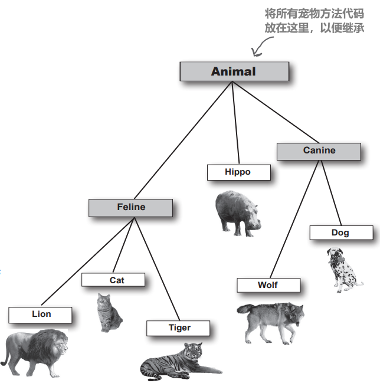

## 方案二

我们从方案一开始，将 pet 方法放在 Animal 类中，但我们将这些方法抽象化，迫使 Animal 子类覆盖这些方法

**优点：**

这样，我们就能获得方案一的所有好处，但没有非宠物动物使用宠物方法（如 `beFriendly()`）的缺点。所有的动物类都将拥有该方法（因为它在 Animal 类中），但因为它是抽象的，所以非宠物的 Animal 类不会继承任何功能。所有类都必须覆盖这些方法，但它们可以让这些方法 "不做任何事"

**缺点：**

因为 Animal 类中的宠物方法都是抽象的，所以具体的 Animal 子类必须实现他们所有的方法。(记住，所有抽象方法都必须由继承树下的第一个具体子类实现）。真是浪费时间！你必须坐在那里，在每一个具体的非宠物类以及所有未来的子类中键入每一个宠物方法。虽然这的确解决了非宠物实际上做宠物事情的问题（如果它们从Animal类继承了宠物功能，它们会这样做），但这种契约是很糟糕的。每个非宠物类都会向全世界宣布，它也有这些宠物方法，尽管这些方法在被调用时实际上不会做任何事情

这种方法看起来一点也不好。因为不止一个 Animal 类型需要就将所有Animal 类可能需要的东西都塞进Animal类似乎是不对的，除非它适用于所有的 Animal 子类

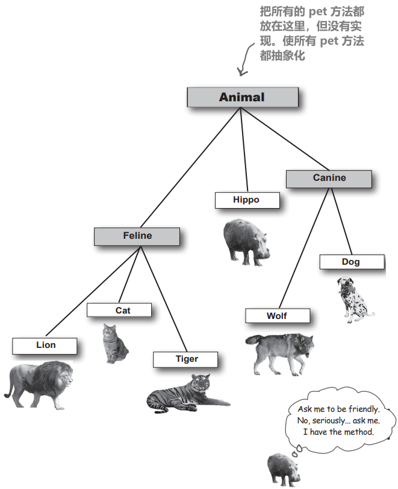

## 方案三

仅将 pet 方法放在它们所属的类中

**优点：**

再也不用担心河马会在门口迎接你或舔你的脸了。这些方法放在了它们应该在的地方，而且只在那里。狗可以实现这些方法，猫也可以实现这些方法，但其他动物就不必知道这些方法了

**缺点：**

这种方法的两大问题。首先，你必须同意一个协议，现在和将来所有宠物动物类的程序员都必须了解该协议。通过协议，我们指的是我们决定所有宠物都应该采用的确切方法。没有任何支持下的宠物合同。但是，如果其中一个程序员犯了一点点错误怎么办？比如，一个方法在它应该接受 int 时接受 String？或者他们将其命名为`doFriendly()`而不是`beFriendly()`？由于它不在协议中，因此编译器无法检查你是否正确实现了这些方法。有人可以很容易地使用宠物动物类，并发现并非所有类都运行良好

其次，你不能使用多态性来调用宠物方法。每个需要使用宠物行为的类都得知道每一个具体的类！换句话说，你现在不能使用 Animal 作为多态类型，因为编译器不允许你在 Animal 引用上调用 Pet 方法（即使它实际上是一个 Dog 对象），因为类 Animal 没有该方法

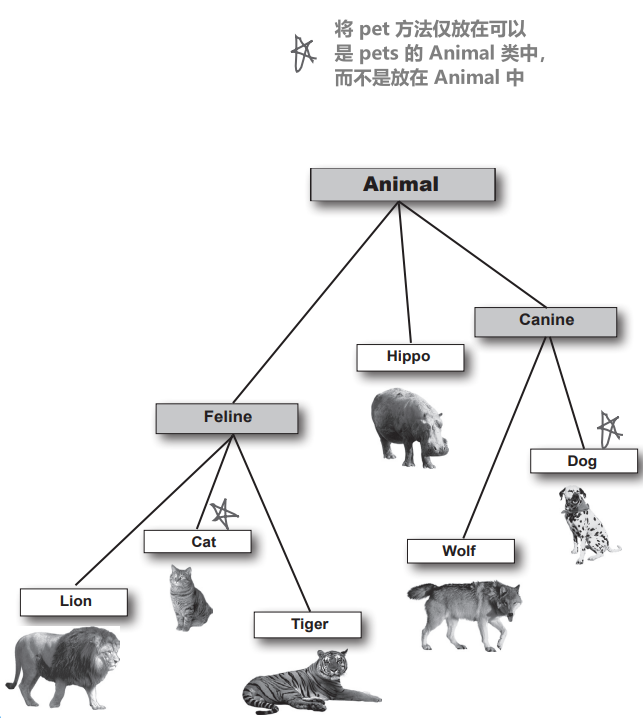

## 真正需要的是

一种只在Pet类中有宠物行为的方法

保证所有Pet类都定义了相同的方法（相同的名称、相同的args、相同的返回类型、没有遗漏的的方法等），而不是指望所有程序员都能做对

一种利用多态性的方法，使所有宠物都能调用其宠物方法，而不必为每个Pet类使用参数、返回类型和数组

### 看起来需要在顶部有两个超类

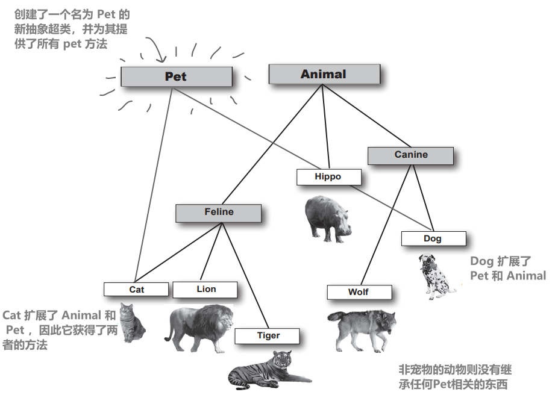

两个超类的方法只有一个问题…

## 这就是所谓的 "多重继承"，可能是件非常糟糕的事情

也就是说，如果可以在 Java 中实现的话。但这是不可能的，因为多重继承有一个被称为 "死亡之钻"（The Deadly Diamond of Death）的问题

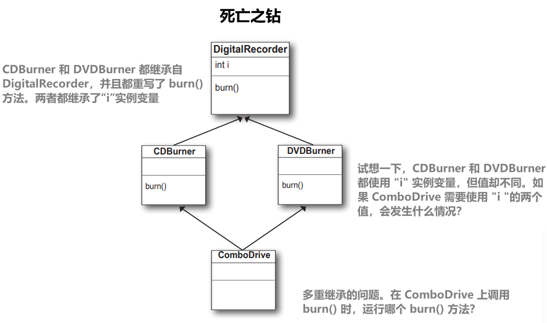

允许出现“死亡之钻”问题的语言可能导致一些复杂且难看的问题，因为你需要有特殊规则来处理潜在的歧义。而额外的规则意味着对你而言既要花时间学习这些规则，也要留心那些“特殊情况”。Java旨在保持简单，拥有一致的规则，不会在某些情况下出现问题。所以Java（不像C++）保护你不需要考虑“死亡之钻”的问题。但这又让我们回到了原始问题！我们如何处理Animal/Pet的情况呢？

# 接口来解决这个问题

Java 提供了一种解决方案——接口。这里的接口不是指图形用户界面（GUI）接口，也不是泛指如“Button类API的公共接口”，而是Java中的关键字 **`interface`**

Java 接口解决了多重继承的问题，它给你带来了多重继承的多态性优势，却没有“死亡之钻”（DDD）带来的痛苦和折磨

接口避免 DDD 的方法非常简单：将所有方法抽象化！这样，子类就必须实现这些方法（记住，抽象方法必须由第一个具体子类实现），因此在运行时，JVM 不会搞不清楚它应该调用两个继承版本中的哪一个

## Java 接口就像一个 100% 的纯抽象类

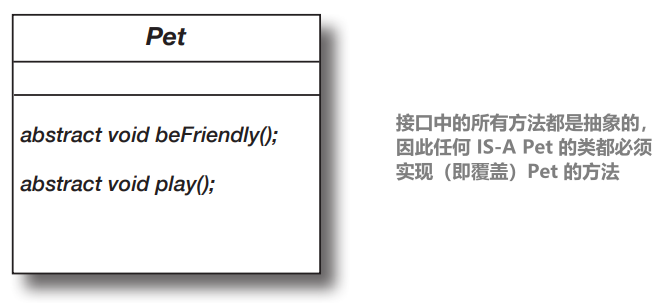

## 定义（define）接口：

使用关键字 **`interface`** 而不是`class`

```java
public interface Pet {...}
```

## 实现（implement）接口：

使用关键字`implements`后跟接口名称。注意，当你实现一个接口时，你仍然可以扩展一个类

```java
public class Dog extends Canine implements Pet {...}
```

# 制作并实现 Pet 接口

接口方法是默认公开和抽象的，因此输入“public”和“abstract”是可选的（事实上，输入单词并不被认为是“好的风格”，但我们在这里这样做只是为了加强它）

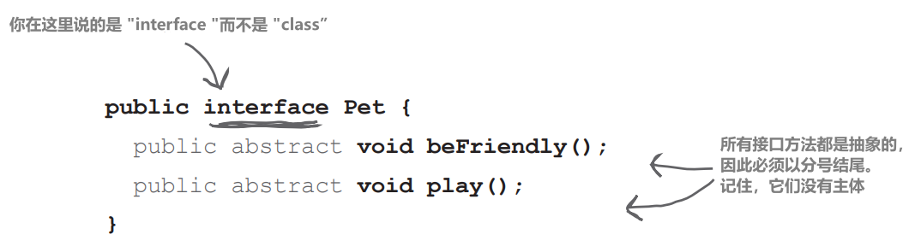

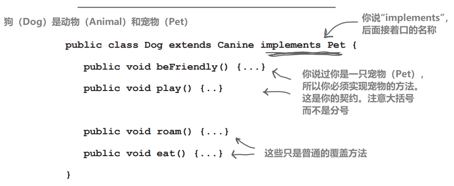

# 等等，接口并不能真正实现多重继承，因为你不能在接口中加入任何实现代码。如果所有的方法都是抽象的，那么接口又能给你带来什么呢？

实际上......在某些情况下，接口可以有实现代码（例如静态和默认方法），但我们在这里不打算讨论它们

接口的主要目的是多态性、多态性、多态性。接口是灵活性的终极体现，因为如果你使用接口而不是具体类（甚至是抽象类）作为args和返回类型，你就可以传递任何实现该接口的东西。有了接口，一个类就不必只来自一棵继承树。一个类可以扩展一个类，并实现一个接口。但另一个类可能实现了相同的接口，却来自完全不同的继承树！

因此，你可以根据一个对象所扮演的角色来对待它，而不是根据它的实例化类类型来对待它

事实上，如果你使用接口编写代码，你甚至不必给任何人提供一个超类来扩展。你只需给他们一个接口，然后说："给，我不管你来自什么样的类继承结构，只要实现这个接口就可以了。“

# 接口多样性

## 来自不同继承树的类可以实现相同的接口

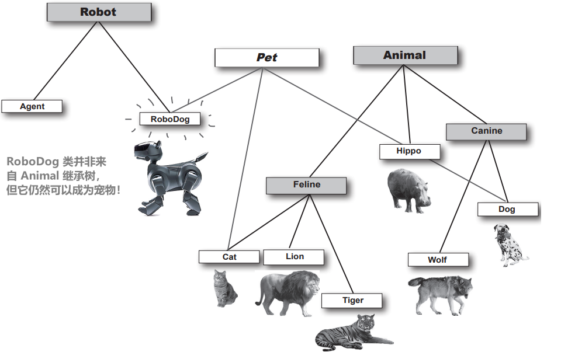

当你使用一个**类作为多态类型**时（比如一个 Animal 类型的数组或一个接收 Canine arg的方法），你可以加入该类型中的对象必须来自相同的继承树。但不仅仅是继承树中的任何地方；**这些对象必须来自多态类型的子类**。Canine 类型的arg可以接受 Wolf 和 Dog，但不能接受 Cat 或 Hippo

但如果**使用接口作为多态类型**（如Pets数组），则对象可以来自继承树中的任何地方。唯一的要求是，对象来自实现了该接口的类。允许不同继承树中的类实现一个通用接口在 Java API 中至关重要。你希望对象能够将其状态保存到文件中吗？那就实现 Serializable 接口吧。你需要对象在单独的执行线程中运行其方法吗？那就实现 Runnable。你就明白了。关于 Serializable 和 Runnable，你将在后面的章节中了解更多，但现在请记住，继承树中任何位置的类都可能需要实现这些接口。几乎任何类都可能需要可保存或可运行

<font color = red>**更妙的是，一个类可以实现多个接口！**</font>

一个Dog对象是Canine，也是Animal，也是Object，都通过继承得来。但是通过接口实现，一个Dog是Pet，而且Dog也可能实现其他接口。你可以说：

```java
public class Dog extends Animal implements Pet, Saveable, Paintable { ... }
```

只 extend 一个，但 implement 两个

在Java中，每个类只能有一个父类（超类），这个父类定义了你是谁。但是你可以实现多个接口，这些接口定义了你可以扮演的角色

### 怎样决定是创建一个类、一个子类、一个抽象类还是一个接口呢？

- 当你的新类没有通过任何其他类型的 IS-A 测试时，可以创建一个不扩展任何东西（除了Object）的类
- 只有当需要创建一个**更具体**的类，并需要重写或添加新行为时，才创建一个子类（换句话说，扩展一个类）
- 当想为一组子类定义**模板**，并且至少有一些实现代码可供所有子类使用时，请使用抽象类。当想保证没人能够创建该类型的对象时，将类设为抽象
- 当想定义一个其他类也能扮演的角色时，请使用接口，无论这些类在继承树中处于什么位置

# 调用方法的超类版本

使用super

## 如果你创建了一个具体的子类，需要重写一个方法，但你希望保留父类版本方法的行为怎么办？换句话说，如果你不需要用重写来替换方法，而是想在其中添加一些额外的特定代码

啊...想想“extends”这个词的含义。良好的面向对象设计之一是考虑如何设计具体代码，以便被重写。换句话说，你在一个抽象类中编写方法代码，它的通用性足以支持典型的具体实现。但是，具体代码不足以处理所有子类特有的工作。因此，子类会覆盖该方法，并通过添加其余代码来扩展该方法。关键字 super 可以让你在子类中调用被重写方法的超类版本

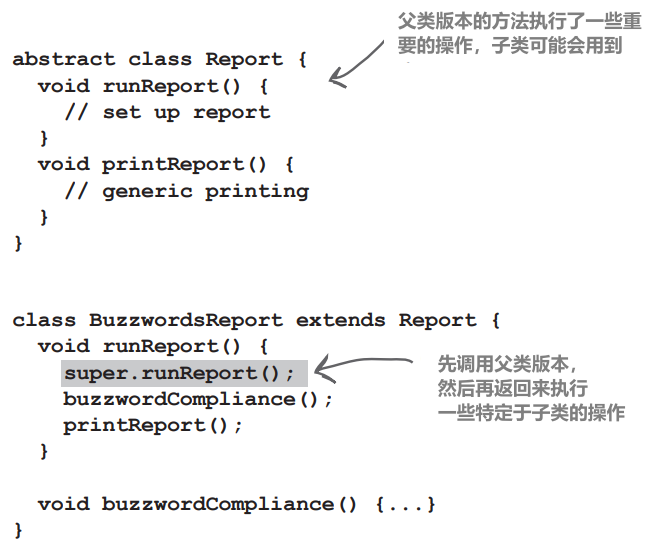

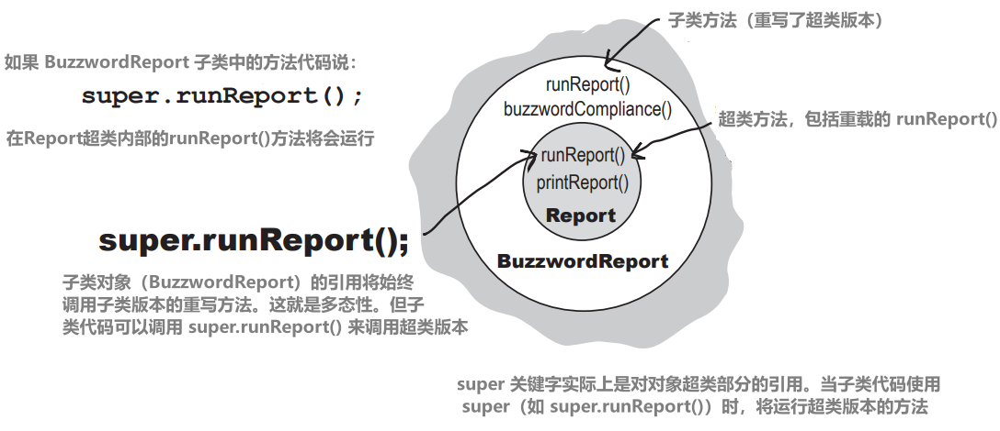

# 这里仍然有一些奇怪的地方......你从来没有解释过 `ArrayList<Dog>` 是如何返回不需要类型转换的 `Dog` 引用。`ArrayList<Dog>` 有什么特别之处？

你说这是一种特殊的技巧是对的。事实上，这确实是一个特殊的技巧，因为`ArrayList<Dog>`能够返回`Dog`对象，而你不需要进行任何类型转换，尽管看起来`ArrayList`的方法对`Dog`或除`Object`之外的任何类型都不了解

简而言之，编译器为你完成了类型转换！当你声明`ArrayList<Dog>`时，并没有一个特殊的类拥有接受和返回`Dog`对象的方法，相反，`<Dog>`是给编译器的一个信号，表示你希望编译器只允许你将`Dog`对象放入其中，如果你试图在列表中添加任何其他类型，编译器就会阻止你。由于编译器会阻止你向`ArrayList`中添加除`Dog`以外的任何对象，因此编译器也知道将`ArrayList`中的任何对象转换为`Dog`引用是安全的。换句话说，使用`ArrayList<Dog>`可以让你不必将强制转换返回的`Dog`。但它的重要性远不止于此.....因为请记住，类型转换在运行时可能会失败，难道你不希望在编译时就发生错误，而不是在你的客户使用它来处理一些重要的事情时发生错误吗？