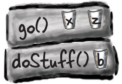

# 构造函数和垃圾回收

对象的生命周期

Objects are born and objects die

你负责一个对象的生命周期。你决定何时以及如何构建（construct）它。你决定何时销毁（destroy）它。但实际上，你并不是自己销毁对象，你只是放弃它。但一旦它被放弃，无情的垃圾收集器（Garbage Collector——gc）可以将其永久销毁，回收对象所占用的内存。如果要编写 Java，就必须创建对象。迟早有一天，你必须让其中一些对象消失，否则就会面临内存耗尽的风险

# 栈和堆：事物生活的地方

在了解创建对象时到底会发生什么之前，我们必须退一步。我们需要进一步了解 Java 中所有东西的存放位置（以及存放时间）。这意味着我们需要更多地了解两个内存区域——栈（Stack）和堆（Heap）。当 JVM 启动时，它会从底层操作系统获取一大块内存并用于运行你的 Java 程序。内存的多少以及是否可以调整，取决于你运行的 JVM 版本（以及平台）。但通常情况下，你可能无法干预这个问题 。如果程序设计得好，你可能也不会在意（这一点稍后再谈）

在 Java 中，我们（程序员）关心对象所在的内存区域（堆）以及方法调用和局部变量所在的内存区域（栈）

我们知道所有对象都位于可垃圾收集的堆上，但我们还没有研究过变量的存放位置。变量的位置取决于它是哪种变量。这里的“kind”不是指数据类型（type）（即基本类型或对象引用）。而是指实例变量和局部变量。局部变量也被称为栈变量，这是它们存在的位置的一个重要线索


## 实例变量 （Instance Variables）

实例变量在类内部声明，但不在方法中声明。它们代表每个对象所拥有的 "字段"（可以为类的每个实例填充不同的值）。实例变量存在于它们所属的对象中


## 局部变量（Local Variables）

局部变量在方法内部声明，包括方法parameter。它们是临时的，并且仅当该方法位于堆栈上时才存在（换句话说，只要方法还没有到达结束大括号）


# 方法堆栈

构造器和垃圾回收堆

当你调用一个方法时，该方法会落到调用栈的顶部。实际上压入栈的新东西就是栈帧（stack frame），它保存着方法的状态，包括正在执行的代码行以及所有局部变量的值。栈顶的方法始终是该栈当前运行的方法（暂时假设只有一个堆栈）。一个方法会一直停留在栈上，直到该方法碰到它的结束大括号（这意味着方法执行完毕）。如果方法`foo()`调用了方法`bar()`，那么方法`bar()`就会被堆叠在方法`foo()`上

## <font color = red>栈顶的方法始终是当前正在执行的方法</font>


栈的情景

下面的代码是一个包含三个方法的代码片段。第一个方法（`doStuff()`）调用第二个方法（`go()`），第二个方法调用第三个方法（`crazy()`）。每个方法都在方法体中声明了一个局部变量（b、z 和 c），方法`go()`还声明了一个参数变量（这意味着`go()`有两个局部变量 x 和 z）

```java
public void doStuff() {
	boolean b = true;
	go(4);
}

public void go(int x) {
	int z = x + 24;
	crazy();
	// imagine more code here
}

public void crazy() {
	char c = 'a';
}
```
<div style="overflow: hidden;">
  <div style="float: left; width: 50%;">
    1、另一个类的代码调用<code>doStuff()</code>，<code>doStuff()</code>进入栈顶部的栈帧。名为"b"的布尔变量进入<code>doStuff()</code>
  </div>
  <div style="float: right; width: 50%; text-align: right;">
    
  </div>
</div>
</br>
<div style="overflow: hidden;">
  <div style="float: left; width: 50%;">
    2、<code>doStuff()</code>调用<code>go()</code>，<code>go()</code>被压入栈顶。变量 "x" 和 "z" 位于<code>go()</code>栈帧中
  </div>
  <div style="float: right; width: 50%; text-align: right;">
    
  </div>
</div>
</br>
<div style="overflow: hidden;">
  <div style="float: left; width: 50%;">
    3、<code>go()</code>调用<code>crazy()</code>，<code>crazy()</code>现在位于栈顶，变量 "c" 位于帧中
  </div>
  <div style="float: right; width: 50%; text-align: right;">
    
  </div>
</div>
</br>
<div style="overflow: hidden;">
  <div style="float: left; width: 50%;">
    4、<code>crazy()</code>完成后，它的栈帧被弹出栈。执行返回<code>go()</code>方法，并在调用<code>crazy()</code>之后的行继续执行
  </div>
  <div style="float: right; width: 50%; text-align: right;">
    
  </div>
</div>


# 栈中的对象引用

那么作为对象的局部变量呢？

请记住，非原始变量保存的是对象的引用，而不是对象本身。你已经知道对象在堆中的位置。它们在哪里声明或创建并不重要。**如果局部变量是对对象的引用，那么只有变量（引用/遥控器）存放在栈上**

```java
public class StackRef {
	public void foof() {
		barf();
	}

	public void barf() {
		Duck d = new Duck();
	}
}
```


# 为什么要学习栈/堆的知识？这有什么帮助？真的需要学习它吗？

如果想了解变量作用域、对象创建问题、内存管理、线程和异常处理，了解 Java 栈和堆的基础知识至关重要。我们将在后面的章节中介绍线程和异常处理。你不需要知道任何特定JVM和/或平台上如何实现栈和堆。有关栈和堆的所有知识都在本页和上一页中。如果你掌握了这几页的内容，那么其他所有依赖于你了解得这些知识的主题都会变得简单得多

# 如果局部变量在栈中，那么实例变量在哪里？

当你说 `new CellPhone()` 时，Java 必须在堆上为该 `CellPhone` 分配空间。但是需要多少空间呢？足以容纳对象，这意味着足以容纳所有对象的实例变量。没错，实例变量存储在堆上，存储在它们所属的对象内部

记住，对象的实例变量值存储在对象内部。如果实例变量全是原始类型，Java 根据原始类型为实例变量分配空间。一个 int 需要 32 位，一个 long 需要 64 位，以此类推。Java 不关心原始变量内部的值；int 变量的位大小是相同的（32 位），无论 int 的值是 32,000,000 还是 32

但是如果实例变量是对象呢？如果 `CellPhone` 有一个 `Antenna`，也就是说，`CellPhone` 有一个类型为 `Antenna` 的引用变量

当新对象具有对象引用而不是原始类型的实例变量时，**真正的问题是：对象是否需要为它所持有的所有对象分配引用空间？答案是，不完全是。无论如何，Java 必须为实例变量值分配空间。但要记住，引用变量值不是整个对象，而只是对象的遥控器**。因此，如果 `CellPhone` 有一个声明为非原始类型 `Antenna` 的实例变量，则 Java 仅为 `CellPhone` 对象内部的 `Antenna` 的遥控器（即引用变量）分配空间，而不是 `Antenna` 对象本身

那么，`Antenna` 对象何时在堆上分配空间呢？首先，我们必须弄清楚 **`Antenna`** 对象自身何时被创建。这取决于实例变量的声明。如果实例变量已声明但没有对象分配给它，则只创建引用变量（遥控器）的空间

```java
private Antenna ant;
```

只有在将引用变量分配给一个新的 `Antenna` 对象时，才会在堆上创建实际的 `Antenna` 对象

```java
private Antenna ant = new Antenna();
```


# 对象创建

既然知道了变量和对象的位置，我们就可以进入创建对象的神秘世界了。请记住对象声明和赋值的三个步骤：声明引用变量、创建对象、将对象赋值给引用。
但直到现在，但直到现在，第二步——新对象“诞生”的地方——一直是个大谜团。准备好了解对象生命周期的事实吧


我们是在调用一个名为 Duck（） 的方法吗？因为看起来确实是这样


## 不，我们调用的是Duck 构造函数（constructor）

构造函数在外观和感觉上很像方法，但它不是方法。当你说 `new` 时，它就会运行代码。换句话说，就是在实例化对象时运行的代码

调用构造函数的唯一方法是使用关键字 **`new 和类名`**。JVM 会找到该类并调用该类中的构造函数。(从技术上讲，这并不是调用构造函数的唯一方法。但**这是从构造函数外部调用构造函数的唯一方法。你可以在另一个构造函数中调用构造函数，但有一些限制**，我们将在本章后面讨论）

但构造函数在哪里？如果不是我们写的，那是谁写的？

你可以为你的类写一个构造函数，<font color = red>**但如果你不写，编译器会为你写一个！**</font> 下面是编译器默认的构造函数： 

```java
public Duck() {

}
```

发现缺少什么？这与方法有何不同？


<blockquote style="background-color: #fdebec;"> 构造函数包含实例化对象时运行的代码。换句话说，就是当你对一个类类型说 new 时运行的代码。你编写的每个类都有一个构造函数，即使不是你自己编写的</blockquote>

# 构造一个Duck（Construct a Duck）

<font color = red>**构造函数的关键特点是在将对象赋值给引用之前运行**</font>。这就意味着你有机会介入，为对象的使用做好准备。换句话说，在任何人使用对象的遥控器之前，对象都有机会帮助构建自身。在我们的 Duck 构造函数中，我们没有做任何有用的事情，只是演示了事件发生的顺序

构造函数给了你进入 new 过程的机会

```java
public class Duck {
	public Duck() {
		System.out.println("Quack");//构造函数代码
	}
}

public class UseADuck {
	public static void main (String[] args) {
		Duck d = new Duck();//这里调用了 Duck 构造函数
	}
}

% java UseADuck
Quack
```

# 初始化 new Duck 的状态

大多数人使用构造函数来初始化对象的状态。换句话说，就是创建并给对象的实例变量赋值

```java
public Duck() {
	size = 34;
}
```

当 Duck 类的开发者知道 Duck 对象应该有多大时，这种方法很好。但是如果我们希望使用 Duck 的程序员决定特定 Duck 的大小呢？

假设 Duck 有一个 size 实例变量，而你希望使用你的 Duck 类的程序员设置新 Duck 的大小。怎么做呢？

你可以在类中添加一个 `setSize()` setter方法。但是<font color = red>**这会导致 Duck 暂时没有 size**</font>* 了，并且强制 Duck 用户编写两个语句——一个用于创建 Duck，另一个用于调用 setSize() 方法。下面的代码使用 setter 方法设置新 Duck 的初始大小


> <font color = red>**实例变量有默认值。数值原始类型为0或0.0，布尔型为false，引用类型为null**</font>


# 如果编译器会为你编写一个构造函数，为什么还需要编写？

如果你需要编写代码来帮助初始化对象并使其准备就绪以供使用，你将必须编写自己的构造函数。例如，你可能依赖于用户的输入，然后才能完成对象的准备工作。即使你自己不需要任何构造函数代码，你可能也必须编写构造函数的另一个原因与你的超类构造函数有关

# 怎样区分构造函数和方法？类的方法也可以与类同名吗？

Java允许声明与类同名的方法。但这并不意味着它是一个构造函数。将方法与构造函数区分开的是返回类型。方法必须有一个返回类型，但构造函数不能有返回类型

`public Duck() { } // 构造函数`

`public void Duck() { } // 方法，void返回类型`

编译器会允许这些方法，但不要这样做。这违反了正常的命名约定（方法以小写字母开头），但更重要的是，这样做会非常令人困惑

# 构造函数会被继承吗？如果你不提供构造函数，但你的超类提供了，你会得到超类的构造函数而不是默认的吗？

不会。构造函数不会被继承

# 使用构造函数初始化重要的Duck状态

并不意味着所有Duck状态都不重要

如果**一个对象在其状态（实例变量）的一个或多个部分初始化之前不应该被使用，那么在完成初始化之前，不要让任何人获得 Duck 对象**！通常来说，让某人创建并获取一个新的Duck对象的引用，然后等待该人调用setSize()方法使对象准备就绪，这种做法风险过高。因为在对象准备就绪之前，可能会被误用。Duck 用户怎么会知道他需要在创建新 Duck 后调用 setter 方法呢？

 初始化代码最好放在构造函数中。你需要做的就是创建一个带有args的构造函数


# 确保你有一个无参构造函数，使得创建Duck对象变得简单

如果Duck构造函数需要一个arg，会发生什么想想看。在上一页中，只有一个 Duck 构造函数，它需要一个 int 参数来表示 Duck 的大小。这可能不是什么大问题，但它确实增加了程序员创建新 Duck 对象的难度，特别是如果程序员不知道Duck 的大小时。如果为鸭子设置一个默认尺寸，这样如果用户不知道合适的尺寸，他们仍然可以制作一个可以使用的 Duck ，这不是很有帮助吗？

想象一下，你希望 Duck 用户在制作 Duck 时有两种选择——一种是提供 Duck 大小（作为构造函数arg），另一种是不指定大小，从而获得默认的 Duck 大小

如果只有一个构造函数，就无法做到这一点。请记住，如果一个方法（或构造函数——规则相同）有一个param，那么在调用该方法或构造函数时就必须传递一个适当的arg。你不能说："如果有人不给构造函数传递任何参数，那么就使用默认大小吧"，因为如果不给构造函数调用传递一个 int 参数，他们甚至无法编译。可以像下面这样做一些笨拙的事情：


但这意味着程序员在创建新的 Duck 对象时，必须知道传递 "0" 是获取默认 Duck 大小的协议。这很难看。如果其他程序员不知道呢？或者他们真的想要一个大小为零的Duck呢？(假设允许零大小的 Duck。如果你不想要零大小的 Duck 对象，可以在构造函数中加入验证代码来防止这种情况发生）。问题的关键在于，并不是总能区分真正的 "我想要大小为零" 的构造函数arg和 "我发送零，所以你会给我默认大小，不管那是什么" 的构造函数arg

## 你真的需要两种制作新 Duck 的方法：

```java
public class Duck2 {
	int size;
	public Duck2() {
		// supply default size
		size = 27;
	}

	public Duck2(int duckSize) {
		// use duckSize parameter
		size = duckSize;
	}
}
```

当你知道大小时制作一只Duck：

```java
Duck2 d = new Duck2(15);
```

当你不知道大小时制作一只Duck：

```java
Duck2 d2 = new Duck2();
```

所以，这个两种选择来制作Duck的想法需要两个构造函数。一个带有int参数，一个不带参数。**如果在一个类中有多个构造函数，这意味着你有重载（overloaded）的构造函数**

# 重载和默认构造函数
编译器不是会总为你创建一个无参数构造函数吗？<font color = red>不是的！</font>

你可能会认为，如果你只编写了一个带参数的构造函数，编译器就会发现你没有无参数构造函数，并为你添加一个。但事实并非如此。<font color = red>**只有当你对构造函数只字未提时，编译器才会参与构造函数的生成**</font>

<font color = red>**如果你编写了一个需要args的构造函数，但你仍然想要一个无参数（no-arg）构造函数，那么你就必须自己创建no-arg构造函数！**</font>

只要你提供了一个构造函数，无论哪种构造函数，编译器都会退一步说："好吧，够公平，看来你现在负责构造函数了。“

<font color = red>**如果一个类中有多个构造函数，那么这些构造函数必须有不同的args列表**</font>

参数列表包括参数的顺序和类型。只要参数不同，就可以有多个构造函数。方法也可以这样做

## 重载构造函数意味着你的类中有多个构造函数

## <font color = red>为了编译通过，每个构造函数必须具有不同的arg列表！</font>

下面的类是合法的，因为所有五个构造函数都有不同的参数列表。举例来说，如果有两个构造函数只接受一个 int，这个类就无法编译。<font color = red>**param变量的名称并不重要。重要的是变量的type（int、Dog 等）和顺序**。**只要顺序不同，可以有两个类型相同的构造函数**</font>。一个构造函数先接收String，然后接收 int，这与一个构造函数先接收 int，然后接收String是不同的

五种不同的构造函数意味着五种不同的制作new mushroom的方法


# 你在前面说过，有一个无参数构造函数是件好事，这样如果人们调用无参数构造函数，我们就可以为 "缺少的" 参数提供默认值。但是，难道没有不可能提供默认值的时候吗？是不是有些时候不应该在类中使用无参数构造函数？

你说得对。有时无参数构造函数是没有意义的。你会在 Java API 中看到这种情况——有些类没有无参数构造函数。例如，Color 类表示......颜色。例如，Color 对象用于设置或更改屏幕字体或 GUI 按钮的颜色。当你创建一个 Color 实例时，该实例将是一种特定的颜色（如死巧克力棕色、蓝屏蓝色、丑闻红等）

如果你创建一个Color对象，你必须以某种方式指定颜色

`Color c = new Color(3,45,200);`

(这里我们使用三个 int 来表示 RGB 值。稍后会在第15章中介绍如何使用Color，在你的Swing上工作）。否则，你会得到什么？Java API 程序员可能会认为，如果调用一个无参数的 Color 构造函数，就会得到可爱的淡紫色。但是，好品味还是占了上风

如果你尝试创建一个没有提供参数的Color：

`Color c = new Color();`

编译器会抓狂，因为它无法在 Color 类中找到匹配的无参数构造函数


# 微观复习：关于构造函数的四点记忆

1、构造函数是在有人对类类型说 new 时运行的代码：

```java
Duck d = **new Duck();**
```

2、构造函数必须与类名相同，并且没有返回类型：

```java
public **Duck**(int size) { } 
```

3、如果不在类中加入构造函数，编译器就会加入一个默认构造函数。默认构造函数总是无参数构造函数

```java
public Duck() { }
```

4、只要参数列表不同，类中可以有多个构造函数。一个类中有多个构造函数意味着有重载的构造函数：

```java
public Duck() { }
public Duck(int size) { }
public Duck(String name) { }
public Duck(String name, int size) { }
```

# 构造函数必须是public？

构造函数可以是public、protected、private或默认的（即没有任何访问修饰符）。我们将在[附录B](./21-附录B.md#default-and-protected)中更多地了解默认访问

# 私有构造函数怎么会有用？没人能调用它，所以也就没人能创建一个新对象！

不完全正确。标记为私有并不意味着没有人可以访问它；它只是意味着类外没有人可以访问它。你肯定在想 "第 22 条陷阱"。只有与 "具有私有构造函数的类" 相同的类中的代码才能从该类中创建一个新对象，但如果不首先创建一个对象，又如何运行该类中的代码呢？你又如何访问该类中的任何内容？

# 对象超类部分的空间

# 等等......我们从没讨论过超类和继承，以及它们如何与构造函数结合在一起

这就是有趣的地方。还记得上一章我们讨论了Snowboard对象，它包裹着表示Snowboard类 Object 部分的内核吗？关键点在于每个对象不仅包含自己声明的实例变量，还包含其超类的所有内容（至少是Object类，因为每个类都扩展自Object）
因此，当一个对象被创建时（因为有人说了new；除了某人在类 type 上说了new之外，没有其他方式来创建对象），该对象为所有实例变量获取空间，从继承树的最顶层开始。想一想......超类可能有封装私有变量的 setter 方法。但是这些变量必须存放在某处。当创建一个对象时，几乎就像多个对象实体化一样——被新建的对象和每个超类的一个对象。不过，从概念上讲，我们最好把它想象成下图这样，正在创建的对象具有代表每个超类的层

<div style="overflow: hidden;">
  <div style="float: left; width: 50%;">
    
  </div>
  <div style="float: right; width: 50%; text-align: right;">
    
  </div>
</div>


# 超类构造函数在对象生命周期中的作用

<font color = red>**创建新对象时，必须运行对象继承树中的所有构造函数**</font>

让我们来理解一下

这意味着每个超类都有一个构造函数（因为每个类都有一个构造函数），并且在创建子类对象时，层次结构中的每个构造函数都会运行

调用new是一件大事。它启动了整个构造函数链式反应。是的，即使抽象类也有构造函数。尽管你永远不可能在抽象类上使用new，但抽象类仍然是一个超类，因此当有人创建一个具体子类的实例时，它的构造函数就会运行 

**超类构造函数的运行将构建出对象的超类部分。请记住，子类可能会继承依赖于超类状态（换句话说，超类中实例变量的值）的方法。要使一个对象完全成型，它自身的所有超类部分都必须完全成型，这就是超类构造函数必须运行的原因。继承树中每个类的所有实例变量都必须声明和初始化。** 即使 Animal 有一些 Hippo 并不继承的实例变量（例如，如果这些变量是私有的），Hippo 仍然依赖于使用这些变量的 Animal 方法

当一个构造函数运行时，它会立即调用它的超类构造函数，一直向上调用，直到调用到 Object 类的构造函数

在接下来的几页中，你将学习如何调用超类构造函数，以及如何自己调用它们。你还将了解如果超类构造函数有参数该怎么办！


# 对象构造

# 创建一个Hippo意味着同时创建Animal和Object的部分...

```java
public class Animal {
	public Animal() {
		System.out.println("Making an Animal");
	}
}

public class Hippo extends Animal {
	public Hippo() {
		System.out.println("Making a Hippo");
	}
}

public class TestHippo {
	public static void main(String[] args) {
		System.out.println("Starting...");
		Hippo h = new Hippo();
	}
}
```

考虑到上面的类层次结构，我们可以逐步解释创建一个新的Hippo对象的过程


输出结果：


Hippo() 构造函数是第一个调用的，但是Animal()构造函数是第一个完成的

# 如何调用超类构造函数？

你可能会认为，在某个地方，比如说，一个 Duck 构造函数，如果 Duck 扩展了 Animal，会调用 Animal（）。但事实并非如此：


调用超类构造函数的唯一方法是调用 **`super()`**。没错，**`super()`** 调用<font color = red>**超类构造函数**</font>。巧合率有多大？


在构造函数中调用 super() 会将超类构造函数放到栈顶层。你认为超类构造函数会做什么？调用它的超类构造函数。如此往复，直到 Object 构造函数位于栈顶部。一旦 Object() 完成，它就会从栈中弹出，而栈中的下一个东西（调用 Object() 的子类构造函数）现在就在栈顶端。该构造函数完成后，就这样一直运行下去，直到原始构造函数位于栈顶端，在那里它才能完成

# 之前为什么没有调用 super() 呢？

你可能已经知道了。

<font color = red>**编译器会在你没有调用时插入一个super()**</font>

因此，编译器会以两种方式参与构造函数的创建：

1、如果你没有提供构造函数

编译器会插入一个看起来像这样的构造函数：

```java
public ClassName() {
    super();
}
```

2、如果你提供了构造函数但没有调用super()

<font color = red>**编译器会在每个重载构造函数中调用 super()（除非该构造函数调用了另一个重载的构造函数）**</font>

编译器提供的调用看起来像这样：

```java
super();
```

它总是这样的。<font color = red>**编译器插入的 super() 调用总是无参数调用**。**如果超类有重载构造函数，则只调用无参数构造函数**</font>

# 对象生命周期

## 子类能够在父类之前存在吗？

如果把超类视为子类的父类，就能够确定哪个必须先存在。一个对象的超类部分必须在子类部分构建之前完全形成（完全建立）。记住，子类对象可能依赖于它从超类继承的东西，因此这些继承的东西必须完成。没有其他办法。超类构造函数必须在子类构造函数之前完成

再看看第 254 页的Stack系列，你你会发现尽管Hippo构造函数是第一个被调用的（它是Stack上的第一个东西），但它是最后一个完成的！每个子类构造函数都会立即调用自己的超类构造函数，直到 Object 构造函数位于栈顶。然后，Object 的构造函数完成，我们再从栈返回到 Animal 的构造函数。只有在 Animal 的构造函数完成后，我们才最终回到Hippo构造函数的剩余部分，因此：

<font color = red>**每个构造函数中调用super()必须是第一个语句！（此规则有一个例外，后面会了解）**</font>


# 有args的超类构造函数

如果超类构造函数有args怎么办？你能在 super() 调用中传递一些参数吗？当然可以。如果不能，你就永远无法扩展一个没有无参数构造函数的类。想象一下这样的场景：所有动物都有一个名字。在 Animal 类中有一个 getName() 方法，它返回 name 实例变量的值。该实例变量被标记为私有，但子类（本例中为Hippo）继承了 getName() 方法。问题就在这里：Hippo 拥有 getName() 方法（通过继承），但没有 name 实例变量。Hippo 必须依靠自身的 Animal 部分来保存 name 实例变量，并在有人在Hippo对象上调用 getName() 时返回它。但是......Animal部分如何获取 name 呢？Hippo 对自己的 Animal 部分的唯一引用是通过 super()，所以 Hippo 就是在这个地方把 Hippo 的 name 发送给自己的 Animal 部分，这样Animal部分就可以将它存储在私有的name实例变量中

<div style="overflow: hidden;">
  <div style="float: left; width: 50%;">
    
  </div>
  <div style="float: right; width: 50%; text-align: right;">
    
  </div>
</div></br>


```java
public abstract class Animal {
	private String name; //所有动物（包括超类）都有名字
	
	public String getName() { //Hippo 继承的 getter 方法
		return name;
	}

	public Animal(String theName) {
		name = theName; //接受名字并将其分配给 name 实例变量的构造函数
	}
}

Animal.java文件中
-----------------------------------------------------

public class Hippo extends Animal {
	public Hippo(String name) {  //Hippo构造函数接受一个名字
		super(name); //它将名字发送到Animal构造函数的栈上
	}
}

Hippo.java文件中
------------------------------------------------------

public class MakeHippo {
	public static void main(String[] args) {
		Hippo h = new Hippo("Buffy"); //创建一个Hippo，将名字“Buffy”传递给Hippo构造函数
		System.out.println(h.getName()); //然后调用 Hippo 继承的 getName() 方法
	}
}

MakeHippo.java文件中

%java MakeHippo
Buffy

```

虚线表示放在不同的文件，或者分块也是不同文件

# 从另一个重载构造函数调用另一个重载构造函数

如果你有一些重载的构造函数，除了处理不同的参数类型外，都做着同样的事情，该怎么办？你知道你不希望在每个构造函数中都有重复的代码（维护起来很麻烦等），所以你只想把大部分构造函数代码（包括调用 `super()`）放在其中一个重载构造函数中。无论哪个构造函数第一个被调用，都要调用真正的构造函数，让真正的构造函数完成构造工作。这很简单：只需说 `this()`。或者 `this(aString)`. 或者 `this(27, x)`。换句话说，把关键字 this 想象成**对当前对象**的引用

**你只能在构造函数中使用 `this()`，而且必须是构造函数中的第一条语句！**

但这是个问题，不是吗？前面我们说过，super() 必须是构造函数中的第一条语句。这就意味着你要做出选择

<font color = red>**每个构造函数都可以调用 super() 或 this()，但不能同时调用！**</font>

你需要根据你拥有的值，需要设置的值，以及本类或超类提供的构造函数来选择调用哪一个

> 使用this()来在同一类中的另一个重载构造函数中调用构造函数
对this()的调用只能在构造函数中使用，并且必须是构造函数中的第一条语句
一个构造函数可以调用super()或this()，但不能同时使用！
> 


# 一个对象能存活多久

对象生命周期

一个对象的生命周期完全取决于引用指向它的生命周期。如果引用被认为是 "活着" 的，那么对象在堆上就仍然活着。如果引用死了（我们稍后再看这意味着什么），对象也就死了

因此，如果一个对象的生命周期取决于引用变量的生命周期，那么变量会存活多长时间呢？

这取决于变量是局部变量还是实例变量。下面的代码展示了局部变量的生命周期。在示例中，变量是一个基本类型，但无论是基本类型还是引用变量，变量的生命周期都是相同的


## 1、局部变量只存在于声明该变量的方法中

变量"s"只能在read()方法中使用。换句话说，该变量只在其自己的方法中有效。类中的其他代码（或任何其他类）无法看到"s"

```java
public void read() {
	int s = 42;
	// ‘s’ can be used only
	// within this method.
	// When this method ends,
	// ‘s’ disappears completely.
}
```

## 2、实例变量的生存周期与对象一样长。如果对象还活着，那么它的实例变量也是活着的

变量's'（这次是一个方法参数）只在 `setSize()` 方法的作用域内。但是，实例变量size的作用域是对象的生命周期，而不是方法的生命周期

```java
public class Life {
  int size;

  public void setSize(int s) {
    size = s;
	// ‘s’ disappears at the 
	// end of this method,
	// but ‘size’ can be used
	// anywhere in the class
  }
}
```

## 局部变量的生命周期与作用域的区别：

### 生命周期

只要栈帧还在栈上，局部变量就是有生命的。换句话说，直到方法完成

### 作用域 scope

局部变量仅在声明它的方法内部有效。当变量自身的方法调用另一个方法时，变量是存活的，但不在作用域中，直到其方法恢复。**只有当变量处于作用域中时，才能使用它**


让我们逐步分析当某物调用doStuff()方法时栈上会发生什么：


在局部变量存活期间，其状态持续存在。例如，只要方法doStuff()在栈上，变量“b”保持其值不变。但是，“b”变量只能在doStuff()的栈帧位于顶部时使用。换句话说，你只能在局部变量所在的方法实际运行时使用局部变量（而不是等待更高的栈帧完成）

# 引用变量呢？

对于基本类型和引用类型，规则都是一样的。引用变量只有在作用域内才能使用，这意味着除非你有一个处于作用域内的引用变量，否则你无法使用对象的远程控制。真正的问题是：
“变量的生命周期如何影响对象的生命周期？”

只要有活的引用指向对象，对象就是活的。如果一个引用变量离开了作用域，但仍然活着，那么它所引用的对象在堆上也仍然活着。然后你要问...... "当方法结束时，存放引用的栈帧从栈中弹出时，会发生什么情况？

如果这是对象的唯一有效引用，那么该对象现在就被丢弃在堆上了。引用变量与栈帧一起解体了，所以被遗弃的对象现在正式被丢弃。诀窍在于知道对象何时有资格进行垃圾回收

一旦对象符合垃圾回收（GC）条件，你就不必担心回收该对象使用的内存了。如果程序内存不足，GC 会销毁部分或全部符合条件的对象，以防止内存耗尽。你仍然可能会耗尽内存，但前提是所有符合条件的对象都已被拖到转储中。你的工作就是确保在使用完对象后将其丢弃（即使其符合 GC 条件），以便垃圾收集器有东西可以回收。如果你坚持使用对象，GC 就不能帮助你，你的程序就有可能因为内存耗尽而死亡

一个对象的生命周期没有价值、没有意义、没有意义，除非有人持有对它的引用

如果你无法访问它，你就无法要求它做任何事情，它只是一个巨大的比特浪费

但如果一个对象无法访问，垃圾回收器就会找出来。早晚，这个对象会被销毁

## 当对象的最后一个活动引用消失时，该对象才有资格进入 GC

### 消除对象引用的三种方法：

1、引用永久退出作用域

```java
void go() {
	Life z = new Life(); //引用 'z' 在方法结束时消失
}
```

2、将引用分配给另一个对象

```java
Life z = new Life();
z = new Life(); //当 'z' 被 '重新编程' 到一个新对象时，第一个对象被遗弃
```

3、引用被明确设置为空

```java
Life z = new Life();
z = null; //当 'z' 被 '取消编程' 时，第一个对象被遗弃
```

## 对象杀手#1

### 引用永久退出作用域

```java
public class StackRef {
	public void foof() {
		barf();
	}
	
	public void barf() {
		Duck d = new Duck();
	}
}
```


## 对象杀手#2

### 将引用赋值给另一个对象

```java
public class ReRef {
	Duck d = new Duck();

	public void go() {
		d = new Duck();
	}
}
```


## 对象杀手#3

### 显式将引用设置为 null

```java
public class ReRef {
	Duck d = new Duck();

	public void go() {
		d = null;
	}
}
```


## null的意义

当你将引用设置为 null 时，你就在解除遥控器的编程。换句话说，你有一个遥控器，但另一端却没有电视。null 引用有代表 " null "的位（我们不知道也不关心这些位是什么，只要 JVM 知道就行）

在现实世界中，如果你有一个未编程的遥控器，按下按钮时它不会产生任何作用。但在 Java 中，你不能在 null 引用上按按钮（即使用点运算符），因为 JVM 知道（这是运行时问题，而不是编译器错误）你在期待吠叫，但那里没有 Dog 来做这件事！

**如果在 null 引用上使用点操作符，运行时会出现 NullPointerException 异常**。你将在第 13 章 "风险行为" 中了解到异常的全部内容

等待别的方法完成的时候，期间局部变量什么也不做