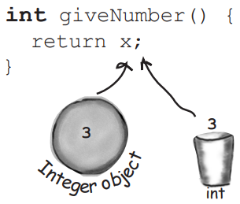
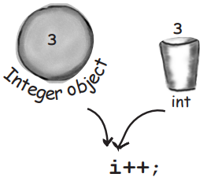
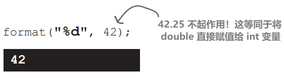

# numbers and statics

java中关于数字调整的功能或者方法通常是static，静态的

# 数学方法：尽可能接近全局方法

在Java中没有全局变量。但是a想象一下：假设你有一个方法，其行为不依赖于实例变量的值。以 Math 类中的 round() 方法为例，它每次都执行相同的操作——将浮点数（方法的 arg）四舍五入到最接近的整数。每次都是这样。如果你有 10,000 个 Math 类的实例，并运行 round(42.2) 方法，你将得到一个整数值 42。每次都是如此。换句话说，该方法作用于参数，但从不受实例变量状态的影响。唯一改变 round() 方法运行方式的是传递给方法的参数！

仅仅为了运行 round() 方法而创建一个 Math 类实例，这难道不是在浪费堆空间吗？那么其他的数学方法呢，比如 min()，它接受两个数值原始类型并返回较小的一个。或者 max()。或者 abs()，它返回一个数的绝对值

这些方法从不使用实例变量值。事实上，Math 类没有任何实例变量。因此，创建一个 Math 类的实例并没有什么好处。你猜怎么着？你不必这么做。事实上，你也做不到

如果你尝试给 Math 创建一个实例：`Math mathObject = new Math();`

你会得到下面的错误


> **Math 类中的方法不使用任何实例变量值。而且由于这些方法是“static”，因此你不需要具有 Math 实例。你所需要的只是 Math 类**
> 

```java
long x = Math.round(42.2);
int y = Math.min(56, 12);
int z = Math.abs(-343);
```

这些方法从不使用实例变量，因此它们的行为不需要知道特定对象

# 常规（非静态）方法和静态方法的区别

Java 是面向对象的，但偶尔会遇到特殊情况，通常是实用方法（如 Math 方法），这些情况下不需要类的实例。关键字 `static` 允许方法在没有任何类实例的情况下运行。静态方法意味着“行为不依赖于实例变量，因此不需要实例/对象，只需要类本身。”

## 常规（非静态）方法


## 静态方法


# 拥有具有静态方法的类意味着什么

**通常情况下（尽管并不总是），带有静态方法的类并不是用来实例化的**。在第 8 章 "严肃的多态性" 中，我们谈到了抽象类，以及如何使用抽象修饰符标记一个类，使得任何人都无法对该类类型说 "new"。换句话说，不可能实例化抽象类

但你可以通过将构造函数标记为 private 来限制其他代码实例化非抽象类。请记住，标记为 private 的方法意味着只有类内的代码才能调用该方法。标记为 private 的构造函数的含义基本相同——只有类内部的代码可以调用构造函数。没有人可以在类外说 "new"。例如，Math 类就是如此。构造函数是私有的，你不能创建一个新的 Math 实例。编译器知道你的代码无法访问该私有构造函数

这并不意味着具有一个或多个静态方法的类永远不应该被实例化。事实上，每一个包含 `main()` 方法的类都是一个包含静态方法的类！通常情况下，使用 `main()` 方法是为了启动或测试另一个类，几乎总是通过在 main 中实例化一个类，然后调用这个新实例的方法

因此，你可以在类中自由组合静态和非静态方法，尽管即使是一个非静态方法也意味着必须有某种方法来创建类的实例。获得新对象的唯一方法是通过 "new" 或反序列化（或称为 Java Reflection API 的东西，我们就不多说了）没有其他方式。但确切地说谁调用了new可能是一个有趣的问题，我们稍后在本章中将对此进行一些探讨

# 静态方法不能使用非静态（实例）变量！

静态方法在运行时不需要知道静态方法类的任何特定实例。正如你在前面几页中看到的，可能根本就不存在该类的任何实例。由于静态方法是使用类（Math.random()）而不是实例引用（t2.play()）来调用的，因此静态方法不能引用类的任何实例变量。静态方法不知道要使用哪个实例的变量值

如果尝试编译此代码：


你会得到这个错误：


如果你试图在静态方法中使用一个实例变量，编译器会认为："我不知道你正在谈论哪个对象的实例变量！" 如果堆上有十个 Duck 对象，静态方法对它们一无所知

# 静态方法也不能使用非静态方法！

<font color = red>**非静态方法通常使用实例变量状态来影响方法的行为**</font>。getName() 方法返回 name 变量的值。谁的名字？调用 getName() 方法的对象

这个不会编译：


静态方法无法访问实例变量状态

# 如果你尝试从静态方法中调用一个非静态方法，但是非静态方法并不使用任何实例变量，编译器会允许吗？

不会。编译器知道，无论你是否在非静态方法中使用实例变量，你都可以这样做。想想其含义...如果允许编译这样的情况，那么如果将来你想改变该非静态方法的实现，使其有一天使用实例变量呢？或者更糟糕的是，如果子类覆盖该方法并在覆盖版本中使用实例变量会发生什么？

# 我发誓我见过使用引用变量而不是类名来调用静态方法的代码

你可以这么做，但正如你妈妈经常告诉你的那样，"合法并不意味着好"。虽然使用类的任何实例来调用静态方法都是可行的，但它会使代码产生误导（不易读）。你可以说，`Duck d = new Duck(); String[] s = {}; d.main(s);` 这段代码是合法的，但**编译器还是会将它解析回真正的类**（"好吧，d 是 Duck 类型，而 main() 是静态的，所以我调用类 Duck 中的静态 main()"）。换句话说，使用 d 来调用 main() 并不意味着 main() 对 d 所引用的对象有任何特殊的了解。这只是调用静态方法的另一种方式，但方法仍然是静态的！

# 静态变量：所有类的实例共享相同的值

想象一下，你想计算程序运行时创建了多少 Duck 实例。你会怎么做呢？也许是一个在构造函数中递增的实例变量？


不，这行不通，因为 duckCount 是一个实例变量，对每只Duck来说都从 0 开始。你可以尝试在另一个类中调用一个方法，但这样做很笨拙。你需要一个只有一个变量副本的类，所有实例共享这一个副本

这就是静态变量的作用：每个类共享一个值，而不是每个实例一个值


<font color = red>**静态变量只会在第一次加载的时候初始化**</font>

静态变量是共享的。同一个类的所有实例共享静态变量的单个副本

实例变量：每个实例 1 个 

静态变量：每个类 1 个

静态变量在类加载时初始化。类的加载是由JVM决定的，通常是因为某个地方尝试首次创建该类的新实例，或者使用该类的静态方法或变量。作为程序员，你也可以告诉JVM加载一个类，但你不太可能需要这样做。在几乎所有情况下，最好让JVM决定何时加载类

关于静态初始化，有两个保证：

- **类中的静态变量在该类的任何对象被创建之前被初始化**
- **类中的静态变量在该类的任何静态方法运行之前被初始化**


<blockquote style="background-color: #e7f3f8;">声明但未初始化的静态变量和实例变量的默认值相同：</br>
基本整数（long、short等）：0</br>
基本浮点数（float、double）：0.0</br>
布尔值：false</br>
对象引用：null</blockquote>

如果你没有显式地初始化一个静态变量（在声明它时给它赋值），它将获得默认值，所以 int 变量被初始化为 0，这意味着无需显式说 `playerCount = 0`。 声明但没有初始化一个静态变量，意味着该静态变量将得到该变量类型的默认值，就像在声明时为实例变量分配默认值一样

# 静态 final 变量是常量

一个标记为 final 的变量意味着一旦初始化，它就不能改变。换句话说，静态 final 变量的值会在类加载期间保持不变。在 API 中查找 Math.PI，你会找到：

```java
public static final double PI = 3.141592653589793;
```

变量被标记为 `public`，以便任何代码都可以访问它

变量被标记为 `static`，这样你就不需要类 Math 的实例（记住，你不允许创建类 Math 的实例）

变量被标记为 `final`，因为 PI 不会改变（就 Java 而言）

除了使用命名约定识别常量之外，没有其他方法将变量标记为常量。<font color = red>**常量变量的名称通常全部大写！**</font>

静态初始化程序是一段在类加载时运行的代码块，在任何其他代码使用类之前运行，因此它是初始化静态 final 变量的绝佳位置

```java
class ConstantInit1 {
	final static int X;
	static {
		X = 42;
	}
}
```

## 初始化 final 静态变量

### 1、当你声明它的时候：

注意命名约定——静态 final 变量是常量，因此名称应全部大写，单词之间用下划线分隔


### 2、在静态初始化块中：


如果没有在这两个地方之一为 final 变量赋值：


编译器会捕获到这个错误：


# final 不仅适用于静态变量...…

你也可以使用关键字 final 来修改非静态变量，包括实例变量、局部变量甚至方法params。在每种情况下，它的含义都是一样的：该值无法被改变。不过，你也可以使用 final 来阻止他人重写方法或创建子类

## 非静态 final 变量

```java
class Foof {
	final int size = 3; //现在你不可以改变size
	final int whuffie;
 
	Foof() {
		whuffie = 42;  //现在你不可以改变whuffie
	}
 
	void doStuff(final int x) {
		// you can’t change x
	}
 
	void doMore() {
		final int z = 7;
		// you can’t change z
	}
}
```

## final 方法

```java
class Poof {
	final void calcWhuffie() {
		// important things
		// that must never be overridden
	}
}
```

## final 类

```java
final class MyMostPerfectClass {
	// cannot be extended
}
```

<font color = red>

**一个 final 变量意味着你不能更改它的值**

**final 方法意味着不能覆盖该方法**

**final 类意味着不能扩展该类（即不能创建子类）**

</font>

# 静态方法不能访问非静态变量。但非静态方法可以访问静态变量吗？

当然可以。类中的非静态方法总是可以调用类中的静态方法或访问类的静态变量

# 为什么要把类变成 final 类？这不是违背了 面向对象的整个目的吗？

是，也不是。将类设为 final 的一个典型原因是为了安全。例如，你不能创建 String 类的子类。想象一下，如果有人扩展了 String 类，并在需要 String 对象的地方用多态的方式替换了自己的 String 子类对象，那将会造成多大的破坏。如果你需要依赖于类中方法的特定实现，就将该类标记为 final

# 如果类是 final 的，那么标记方法为 final 不是多余的吗？

如果类是 final 的，就不需要标记方法为 final。想想看，如果一个类是 final 的，它就永远不能被子类化，因此没有一个方法可以被重写。另一方面，如果你确实想让其他人扩展你的类，并希望他们能重写某些方法，但不是所有方法，那么就不要将类标记为 final，而是有选择性地将特定方法标记为 final。final 方法意味着子类不能覆盖该特定方法

# Math 方法

现在我们知道了静态方法的工作原理，让我们来看一些在 Math 类中的静态方法。这不是全部，只是其中的一些重点。查看 API 获取其余方法，包括 cos()、sin()、tan()、ceil()、floor() 和 asin()

## Math.abs()

返回参数的绝对值，如果参数是 int 类型，则返回 int，如果参数是 double 类型，则返回 double

```java
int x = Math.abs(-240); // returns 240
double d = Math.abs(240.45); // returns 240.45
```

## Math.random()

返回一个 double 类型的值，该值在 0.0 到 1.0 之间（包括 0.0，但不包括 1.0）

```java
double r1 = Math.random();
int r2 = (int) (Math.random() * 5);
```

到目前为止，我们一直在使用这个方法，但还有一个 java.util.Random 更好用

## Math.round()

```java
int x = Math.round(-24.8f); // returns -25  返回四舍五入为最接近整数的 int 或 long（取决于参数是 float 还是 double）
int y = Math.round(24.45f); // returns 24   记住，浮点数字面量默认是双精度浮点数，除非你添加了 'f'
long z = Math.round(24.45); // returns 24L  这是double
```

## Math.min()

返回两个参数的最小值。该方法可重载，以获取 ints、longs、floats 或 doubles

```java
int x = Math.min(24,240); // returns 24
double y = Math.min(90876.5, 90876.49); // returns 90876.49
```

## Math.max()

返回两个参数的最大值。该方法可重载，以获取 ints、longs、floats 或 doubles

```java
int x = Math.max(24,240); // returns 240
double y = Math.max(90876.5, 90876.49); // returns 90876.5
```

## Math.sqrt()

返回参数的正平方根。该方法使用一个 double，当然也可以输入任何适合 double 的值

```java
double x = Math.sqrt(9); //return 3
double y = Math.sqrt(42.0); // returns 6.48074069840786
```

# 包装一个原始类型

有时你想把一个原始类型当作一个对象来处理。例如，像ArrayList这样的集合只能与对象一起使用：`ArrayList<???> list;`  可以给 ints 创建一个ArrayList吗

每个基本类型都有一个包装类，由于封装类在 java.lang 包中，因此无需导入。你可以通过包装类的命名方式来识别它们，因为每个包装类的名称都与它所包装的基本类型相同，但首字母大写，以符合类命名约定

哦，对了，由于某些绝对没有人可以确定的原因，API 设计者决定不将名称从基元类型精确映射到类类型。你会明白我们的意思的：


## 包装（warpping）一个值

```java
int i = 288;
Integer iWrap = new Integer(i);//将原始值传递给包装器构造函数。就是这样。
```

## 解包（unwrapping）一个值

```java
int unWrapped = iWrap.intValue();
```

所有的包装器都是这样工作的。Boolean有一个 **`booleanValue()`**，Character有一个 **`charValue()`**，依此类推

当你需要将原始类型作为对象处理时，进行包装

<div style="overflow: hidden;">
  <div style="float: left; width: 50%;">
    
  </div>
  <div style="float: right; width: 50%; text-align: right;">
    
  </div>
</div></br>


想象成巧克力的包装即可

包装和解包数值是为了让原始数据类型和对象类型之间能够互相转换，并能够在需要时使用对象的特性和功能

这太愚蠢了。你的意思是我不能简单地创建一个 int 的 ArrayList 吗？？？我必须把每一个该死的 int 都包装成一个新的 Integer 对象，然后在尝试访问 ArrayList 中的值时再将其解包？这简直是浪费时间，而且随时可能出错…

# Java会自动为你装箱基本类型

在Java 5 之前，确实得自己手动包装和拆分基本类型。幸运的是，现在这一切都是自动完成的。让我们看看当我们想要创建一个用于保存 int 的 ArrayList 时会发生什么

## 原始 int 的 ArrayList


# 如果要保存 int，为什么不声明 ArrayList<int>？

因为……你不能。至少，在本书涵盖的 Java 版本中不能（语言不断发展，事情可能会改变！）。请记住，泛型类型的规则是你只能指定类或接口类型，不能是原始类型。因此，ArrayList<int> 不会编译。但正如你从上面的代码中看到的那样，这并不重要，因为编译器允许你将 int 放入 ArrayList<Integer> 中。实际上，没有办法阻止你将原始类型放入一个类型为该原始类型的包装类的 ArrayList 中，因为自动装箱会自动发生。因此，你可以将布尔原始类型放入 `ArrayList<Boolean>` 中，将字符放入 `ArrayList<Character>` 中

# 自动装箱（Autoboxing）几乎无处不在

自动装箱不仅仅允许你进行显而易见的封装和解封装，以便在集合中使用原始类型...它还允许你在任何一个需要的地方使用原始类型或其包装类型。想想这个！

## 自动装箱的有趣之处

### 方法的args

如果一个方法接受一个包装类型，你可以传递一个匹配类型的包装类型的引用或一个原始类型的值。当然，反过来也是成立的——如果一个方法接受一个原始类型，你可以传递一个兼容的原始类型值或一个包装类型的引用


### 返回值

如果一个方法声明了一个原始类型的返回类型，你可以返回一个兼容的原始类型值或一个包装类型的引用。而如果一个方法声明了一个包装类型的返回类型，你可以返回一个包装类型的引用或一个匹配类型的原始类型值



### 布尔表达式

在任何需要布尔值的地方，你可以使用一个求值为布尔值的表达式（4 > 2），一个原始布尔值，或者一个Boolean 包装类型的引用


### 数字运算

这可能是最奇怪的一个问题——是的，在需要使用原始类型的操作中，可以使用包装类型作为操作数。这意味着你可以对一个整数对象的引用使用增量运算符！

但别担心——这只是一个编译器的技巧。语言并没有被修改以使操作符对对象起作用；编译器只是在操作之前将对象转换为其原始类型。尽管看起来确实很奇怪

```java
Integer i = new Integer(42);
i++;
```

这意味着还可以执行以下操作：

```java
Integer j = new Integer(5);
Integer k = j + 3;
```



## 分配

你可以将匹配的包装类型或原始类型分配给声明为相匹配的包装类型或原始类型的变量。例如，一个原始的 int 变量可以分配给一个 Integer 引用变量，反之亦然——一个 Integer 对象的引用可以分配给一个声明为 int 原始类型的变量


# 包装类也有静态实用方法！

除了像普通类一样运行外，包装器还有很多非常有用的静态方法

例如，解析方法接受一个字符串并返回一个原始值


## 将 String 转换为原始值很简单：

```java
String s = "2";
```

```java
int x = Integer.parseInt(s);//将字符串"2"解析为2没有问题
```

```java
double d = Double.parseDouble("420.24");
```

`parseBoolean()` 方法忽略字符串参数中的字符大小写

```java
boolean b = Boolean.parseBoolean("True");
```

## 但是如果你尝试这样做：


每个解析字符串的方法或构造函数都可以抛出NumberFormatException。它是一个运行时异常，所以你不必处理或声明它。但你可能想要处理它。（将在第13章《风险行为》中讨论异常。）

# 将原始数字转换为字符串

你可能想把一个数字转换为字符串，例如当你想要将这个数字显示给用户或放入消息中时。有几种方法可以将数字转换为字符串。最简单的方法是将数字与现有的字符串连接起来

记住，在Java中，**`“+”`** 运算符被重载了（是唯一被重载的运算符），作为字符串连接符。添加到字符串中的任何内容都会变成字符串

```java
double d = 42.5;
String doubleString = ""  + d;
```

另一种方法是使用 Double 类中的静态方法

```java
double d = 42.5;
String doubleString = Double.toString(d);
```

在 String 上还有一个重载的静态方法 **`valueOf`**，可以获取几乎任何东西的 String 值

```java
double d = 42.5;
String doubleString = String.valueOf(d);
```

# 数字格式化

在 Java 中，格式化数字和日期不必与 I/O 相结合。想想看。向用户显示数字的最典型方式之一是通过图形用户界面。你可以将字符串放入滚动文本区域，也可以放入表格。如果格式化只包含在打印语句中，那么你就永远无法将数字格式化为漂亮的字符串显示在图形用户界面（GUI）中

Java API 使用 java.util 中的 Formatter 类提供了强大而灵活的格式化功能。但通常你并不需要自己创建和调用 Formatter 类的方法，因为 Java API 在一些 I/O 类（包括 printf()）和 String 类中提供了方便的方法。因此，只需调用静态 `String.format()` 方法，并将需要格式化的内容和格式化说明传给它即可

当然，你必须知道如何提供格式化指令，除非你熟悉 C/C++ 中的 printf() 函数，否则这需要花费一些精力。幸运的是，即使你不知道 printf()，你也可以简单地按照配方来完成最基本的工作（我们将在本章中展示）。但是，如果你想通过混合和匹配得到你想要的任何东西，你就需要学习如何格式化。

我们将从一个基本的例子开始，然后看看它是如何工作的。(注：我们将在第 16 章 "保存对象" 中再次讨论格式化问题）

## 用下划线让大数字更易读，快速绕行

在我们讨论格式化数字之前，让我们进行一个小而有用的跳转。有时，你可能希望声明具有大初始值的变量。让我们看看三个分配相同大值（十亿）给长整型基本类型的声明


## 使用逗号格式化数字


# 格式解构…

在最基本的级别上，格式化由两个主要部分组成（还有更多，但我们将从这里开始以保持清晰）:

## 1、格式指令

可以使用特殊的格式说明符来描述参数的格式

## 2、要格式化的参数

虽然可以有多个参数，但我们只从一个参数开始。参数类型不能是任何东西......它必须是可以使用格式说明符进行格式化的东西。例如，如果你的格式说明符指定浮点数，你不能传递一只狗，甚至是一个看起来像浮点数的字符串


这些指令实际上是什么意思？

“取这个方法的第二个参数，并将其格式化为十进制整数，并插入逗号。”

它们是怎么表达这个意思的？

在下一页，我们将更详细地看看`%,d`语法实际上意味着什么，但首先，无论何时在格式字符串中看到百分号（%），都可以将其视为表示一个变量，并且该变量是format()方法的另一个arg。百分号后面的其余字符描述了该参数的格式化指令

# 百分号 (%) 表示：“在此处插入参数”（并按照这些指令进行格式化）

format()方法

format() 方法的第一个参数称为格式字符串（format String），它实际上可以包含你只想按原样打印而不想额外格式化的字符。不过，当你看到 % 号时，请将百分号视为一个变量，代表该方法的另一个参数


"%" 符号告诉格式化器在此处插入另一个方法参数（format()的第二个参数，即数字），并使用百分号后的".2f" 字符进行格式化。然后，格式字符串的其余部分 "bugs to fix" 将被添加到最终输出中

## 添加逗号


# 格式字符串使用自己的小语言语法

显然，你不能在 "%" 符号后随便添加任何内容。百分号后面的语法遵循非常特定的规则，描述了如何格式化在结果（格式化）字符串中插入的参数

你已经看过一些例子：

**`%,d`** ：插入逗号并将数字格式化为十进制整数

**`%.2f`** ：将数字格式化为精度为小数点后两位的浮点数

**`%,.2f`** ：插入逗号并将数字格式化为精度为小数点后两位的浮点数

真正的问题是：“我如何知道在百分号后面放什么才能达到我想要的效果？”这包括知道符号（如“d”代表十进制，“f”代表浮点数）以及在百分号后面放置指令的顺序。例如，如果你把逗号放在“d”后面，像“%d,”而不是“%,d”，就无法运行！

还是不行？你觉得这样会怎么样？

`String.format("I have %.2f, bugs to fix.", 476578.09876);`

# 格式说明符

百分号之后的所有字符，包括类型指示符（如 "d "或 "f"），都是格式化指令的一部分。类型指示符之后，格式化器会假定下一组字符是输出字符串的一部分，直到或除非遇到另一个百分号 (%)。嗯......这可能吗？可以有多个格式化参数变量吗？这个问题先放一放，几分钟后我们再来讨论。现在，让我们来看看格式说明符的语法——百分号（%）后面的内容，描述了参数应该如何格式化

一个格式说明符最多可以有五个不同的部分（不包括“%”）。下面方括号内的所有内容都是可选的，因此只有**百分比（%）和类型是必需的**。但是，顺序也是强制的，所以你使用的任何部分都必须按照这个顺序


# 唯一需要的说明是 TYPE

虽然 type 是唯一必需的说明符，但请记住，如果确实放入其他任何内容，type 必须始终位于最后！有十几种不同的类型修饰符（不包括日期和时间，它们有自己的一套），但大多数情况下，你可能会使用 %d（小数）或 %f（浮点）。通常情况下，你会将 %f 与精度指示符结合使用，以设置输出中需要的小数位数

**TYPE 是必填项，其他都是选填项**

## %d   十进制整数



arg必须与 int 兼容，因此只能是 byte、short、int 和 char（或其包装类型）

## %f 浮点数


参数必须是浮点类型，因此只能是float或double（基本类型或包装类型），以及称为BigDecimal的东西（在本书中不讨论）

## %x 十六进制


参数必须是 byte、short、int、long（包括基本类型和包装类型），以及 BigInteger

## %c 字符


参数必须是 byte、short、char 或 int（包括基本类型和包装类型）

在你的格式说明中必须包含一个类型，并且如果指定了类型之外的其他内容，则类型必须始终位于最后。大多数情况下，你可能会使用“d”表示十进制或“f”表示浮点数来格式化数字

# 如果我有多个args会怎样？

format args

想象一下，你想要一个如下所示的字符串：

"在 100,567,890.24 中，排名是 20,456,654 位"

但这些数字来自变量。怎么办呢？你只需在格式字符串（第一个参数）后添加两个参数，这样调用 `format()` 时就会有三个参数，而不是两个。在第一个参数（格式字符串）中，将有两个不同的格式说明符（两个以"%"开头的参数）。第一个格式说明符将插入方法的第二个参数，第二个格式说明符将插入方法的第三个参数。换句话说，format String 中插入的变量使用了其他参数传递到 format() 方法中的顺序


当我们讨论日期格式化时，你会发现，你可能真的希望对同一个参数应用不同的格式化规范。在你看到日期格式化（与我们一直在做的数字格式化不同）的工作原理之前，可能很难想象这一点。稍后，你就会知道如何更具体地确定哪些格式规范适用于哪些参数

# 嗯，这里发生了一件非常奇怪的事情。我能传递多少个参数？我是说，String 类中有多少个重载的 format() 方法？那么，如果我想传递十个不同的参数来格式化一个输出字符串，会发生什么呢？

好问题。是的，确实有些奇怪，而且也没有一堆重载的 format() 方法来接受不同数量的可能参数。为了支持 Java 中的这种格式化（类似 printf）API，Java 语言需要另一种特性——变量参数列表（简称 varargs）。我们将在附录 B 中详细讨论 varargs

# 静态导入

静态导入是一个真正的两面刃。有些人喜欢这个想法，有些人讨厌它。静态导入存在的目的是为了让你的代码变得更短。如果你讨厌打字或者讨厌长长的代码行，你可能会喜欢这个功能。静态导入的缺点是——如果你不小心使用它们，会使你的代码变得更难阅读

静态导入的基本原理是，当你使用静态类、静态变量或枚举（稍后将详细介绍）时，可以通过导入它们，节省一些打字

## 没有静态导入：


## 注意事项和问题

1、使用静态导入会移除静态成员所属的类的信息。我们建议，只有当静态方法或变量在没有类名前缀的情况下仍然有意义时，才使用静态导入

2、静态导入的一个大问题是很容易产生命名冲突。例如，如果你有两个不同的类都有一个 "add()" 方法，你和编译器怎么知道该使用哪个呢？因此，最好不要在可能引起冲突的情况下使用静态导入

3、请注意，你可以在静态导入声明中使用通配符（.*）
