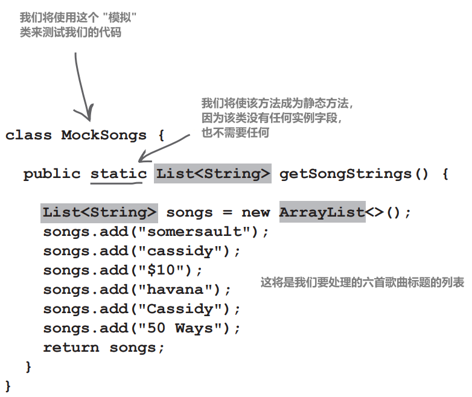
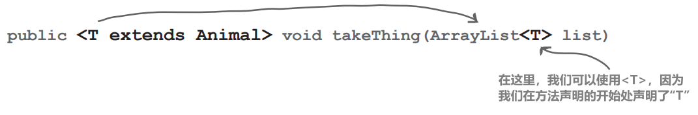
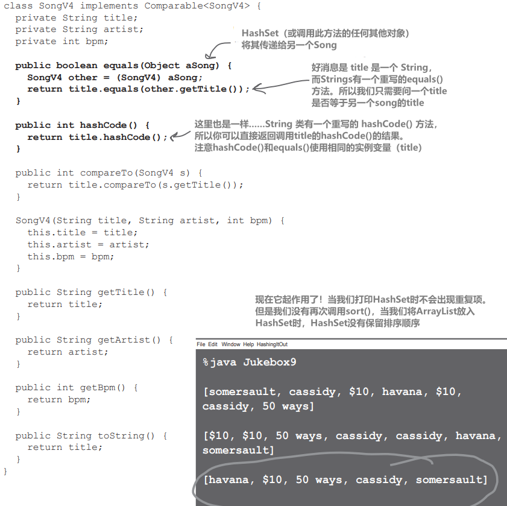

# 数据结构

集合泛型

# 对列表进行排序

恭喜你获得了新工作——在Lou's Diner管理自动点唱机系统。点唱机本身没有Java，但每次有人播放一首歌，歌曲数据就会追加到一个简单的文本文件

你的工作是管理数据，跟踪歌曲的流行程度，生成报告，并操作播放列表。你不需要编写整个应用程序——其他一些软件开发人员也参与其中，但你负责管理和排序Java应用程序中的数据。由于Lou对数据库有意见，这是严格的内存数据收集。另一个程序员将编写代码，从文件中读取歌曲数据并将歌曲放入List中。（在几章中，你将学习如何从文件中读取数据，以及如何将数据写入文件。）你将获得的只是一个包含点唱机不断添加的歌曲数据的List

让我们不要等待其他程序员提供实际的歌曲文件；让我们创建一个小的测试程序，以提供一些我们可以使用的示例数据。我们已经与另一个程序员达成一致，她最终将提供一个Songs类，其中包含一个我们将用来获取数据的`getSongs`方法。有了这些信息，我们可以编写一个小类来暂时“代替”实际的代码。用来代替其他代码的代码通常被称为“模拟（**mock**）”代码

你经常需要编写一些临时代码，以代替稍后的真正代码。这就是所谓的 "模拟（mocking）"



因为 ArrayList IS-A List，所以我们可以创建一个 ArrayList，并将其存储在一个List类型的方法中，并返回。在现实世界中，你经常会看到返回接口类型（List）而隐藏实现类型（ArrayList）的 Java 代码

# 你的第一份工作，按字母顺序对歌曲进行排序

我们将首先创建代码，从模拟的Songs类中读取数据并打印出获取的内容。由于 ArrayList 的元素是按照添加的顺序排列的，因此歌曲名尚未按字母顺序排列也就不足为奇了

```java
import java.util.*;

public class Jukebox1 {
	public static void main(String[] args) {
		new Jukebox1().go();
	}
	
	public void go() {
		List<String> songList = MockSongs.getSongStrings(); //将歌曲标题存储在字符串列表中
		System.out.println(songList); //然后打印 songList 的内容
	}
}

//以下是“模拟”代码。这是对其他程序员稍后提供的实际I/O代码的替代

class MockSongs {
	public static List<String> getSongStrings() {
		List<String> songs = new ArrayList<>();
		songs.add("somersault");
		songs.add("cassidy");
		songs.add("$10");
		songs.add("havana");
		songs.add("Cassidy");
		songs.add("50 Ways");
		return songs;
	}
}
```

这里没什么特别的......只是一些示例数据，我们可以用来处理排序代码


在开始排序之前，我对上一页中声明 songDB ArrayList 的方式有一个疑问通常情况下，你必须在等号两侧的尖括号内放置ArrayList中对象的类型。但是在上一页中，右侧有一对空的括号。这是特殊的语法吗？

# 太棒了！你发现了钻石操作符

到目前为止，我们通过两次显示元素类型来声明 ArrayLists：

```java
ArrayList<String> songs = new ArrayList<String>();
```

大多数情况下，我们不需要重复说相同的事情。编译器可以从左侧你写的内容中推断出你可能需要右侧的内容。它使用类型推断来推断你需要的类型

```java
ArrayList<String> songs = new ArrayList<>(); //无需类型
```

这种语法称为钻石操作符（因为它呈钻石形状！），它在Java 7中引入，所以它已经存在一段时间了，很可能在你的Java版本中也是可用的

随着时间的推移，Java不断演变，从其语法中删除了不必要的代码重复。如果编译器可以推断出类型，你并不总是需要完整地写出它

# 是否应该一直使用钻石操作符？有什么缺点吗？

钻石操作符是"语法糖"，这意味着它的存在使我们在编写（和阅读）代码时更轻松，但它对底层字节码没有任何影响。因此，如果你担心使用钻石操作符是否与使用具体类型有所不同，不用担心！这基本上是一回事。不过，有时你可能会选择写出完整的类型。这样做的主要原因是为了帮助别人阅读你的代码。例如，如果变量的声明位置与初始化位置相距甚远，那么在初始化变量时可能需要使用类型，这样就可以清楚地看到变量中包含了哪些对象

```java
ArrayList<String> songs;
// 在这些代码之间有很多代码...
songs = new ArrayList<String>();
```

# 编译器还能在其他地方帮我确定类型吗？

有！例如 `var` 关键字（"局部变量类型推断"），我们将在附录 B 中讨论。另一个重要的例子是 `lambda` 表达式，我们将在本章稍后部分介绍

# 我看到你创建了一个 ArrayList，但将其赋值给了一个 List 引用，而且你创建了一个 ArrayList，但从方法中返回了一个 List。为什么不在所有地方都使用 ArrayList 呢？

多态性的优点之一是代码不需要知道对象的具体实现类型就能很好地使用它。`List` 是一个众所周知、广为人知的接口（我们将在本章中详细介绍）。使用 `ArrayList` 的代码通常不需要知道它是 ArrayList。它可能是一个 LinkedList。或者是 `List` 的一种特殊类型。处理 `List` 的代码只需要知道它可以调用 `List` 方法（如 `add()`、`size()` 等）。通常比较安全的做法是传递接口类型（即 List），而不是实现。这样，其他代码就不会以一种从未想过的方式在你的对象中到处乱窜。这也意味着，如果你以后想从 ArrayList 变为 LinkedList 或 CopyOnWriteArrayList（参见第 18 章，处理并发问题），你可以不必更改 List 的所有使用位置

# 探索 java.util API、列表（List）和集合（Collections）

我们知道，在ArrayList或任何List中，元素都是按照添加的顺序排列的。因此，我们需要对歌曲列表中的元素进行排序。在本章中，我们将学习 `java.util` 包中一些最重要、最常用的集合类，但现在我们只讨论两个类：`java.util.List` 和 `java.util.Collections`

我们已经使用 ArrayList 有一段时间了。因为 ArrayList 是 List 的一种，而且我们熟悉的许多 ArrayList 方法都来自 List，所以我们可以轻松地将处理 ArrayLists 的大部分知识迁移到 List 中

Collections 类被称为 "实用程序"  类。该类拥有大量方便的方法，可用于处理各种集合类型

## API摘录

**java.util.List**

- `sort(Comparator)`：根据指定的Comparator引发的顺序对此列表进行排序

**java.util.Collections**

- `sort(List)`：根据其元素的自然顺序，将指定的列表按升序排序
- `sort(List, Comparator)`：根据Comparator定义的顺序对指定的列表进行排序

## 在“真实世界”中，有很多种排序方法

我们并不总是希望我们的列表按字母顺序排序。我们可能想按尺寸对衣服进行排序，或者按电影获得五星好评的数量进行排序。Java 可以让你按字母顺序进行传统排序，也可以让你创建自己的自定义排序方法。上面提到的 "比较器（Comparator）"的引用与自定义排序有关，我们将在本章后面介绍。所以现在，让我们坚持使用 "自然排序"（按字母顺序）

既然我们知道我们有一个 List，看起来我们已经找到了完美的方法 **`Collections.sort()`**

# "自然排序"，Java 对字母排序的理解

Lou 希望你 "按字母顺序" 对歌曲进行排序，但这究竟是什么意思呢？A-Z 部分显而易见，但小写字母和大写字母呢？数字和特殊字符呢？嗯，这又是一个复杂的话题，但 Java 使用 Unicode，对于我们许多 "西方人" 来说，这意味着数字排序在大写字母之前，大写字母排序在小写字母之前，有些特殊字符排序在数字之前，有些排序在数字之后。很清楚了吧？哈！那么，结果就是，默认情况下，Java 中的排序是按照所谓的 "自然顺序" 进行的，即或多或少按照字母顺序排列。让我们看看歌曲列表排序时会发生什么：

```java
public void go() {
	List<String> songList = MockSongs.getSongStrings();
	System.out.println(songList);
	Collections.sort(songList); //使用“自然排序”对我们的歌曲标题进行排序
	System.out.println(songList);
	}
}
```


# 但现在你需要的是 Song 对象，而不仅仅是简单的字符串

排列自己的对象

现在你的老板Lou想要列表中实际的Song类实例，而不仅仅是字符串，这样每个歌曲就可以有更多的数据。新的点唱机设备输出更多信息，因此实际的歌曲文件将为每首歌曲提供三个信息

Song 类非常简单，只有一个有趣的特性——重写的`toString()`方法。请记住，`toString()`方法是在 Object 类中定义，因此 Java 中的每个类都继承了该方法。由于 `toString()` 方法是在打印对象时调用的`System.out.println(anObject)`，因此应该重写该方法，以便打印出比默认唯一标识符代码更具可读性的内容。打印列表时，`toString()`方法将在每个对象上调用


```java
class SongV2 {
	private String title;
	private String artist;
	private int bpm;

	SongV2(String title, String artist, int bpm) {
		this.title = title;
		this.artist = artist;
		this.bpm = bpm;
	}
	public String getTitle() {
		return title;
	}
	public String getArtist() {
		return artist;
	}
	public int getBpm() {
		return bpm;
	}
	public String toString() {
		return title;
	}
}
```

```java
class MockSongs {
	public static List<String> getSongStrings() { ... }
	
	public static List<SongV2> getSongsV2() {
		List<SongV2> songs = new ArrayList<>();
		songs.add(new SongV2("somersault", "zero 7", 147));
		songs.add(new SongV2("cassidy", "grateful dead", 158));
		songs.add(new SongV2("$10", "hitchhiker", 140));
		
		songs.add(new SongV2("havana", "cabello", 105));
		songs.add(new SongV2("Cassidy", "grateful dead", 158));
		songs.add(new SongV2("50 ways", "simon", 102));
		return songs;
	}
}
```

# 修改点唱机代码，使用Songs而不是Strings

你的代码变化不大。最大的变化是 List 的类型将由 <String> 变为 <SongV2>


```java
import java.util.*;

public class Jukebox2 {
	public static void main(String[] args) {
		new Jukebox2().go();
	}

    public void go() {
      List<SongV2> songList = MockSongs.getSongsV2();
      System.out.println(songList);
      Collections.sort(songList);
      System.out.println(songList);
    }
}
```

# Collections.sort()不会编译

对于排序问题，Collections类确实显示了一个接受List的 sort() 方法。它应该可以工作

但它却没有！

编译器表示找不到一个接受 `List<SongV2>` 的sort方法，所以也许它不喜欢Song对象的List？它对 `List<String>` 没有任何问题，那么Song和String之间的重要区别是什么？是什么区别导致编译器失败？


当然，你可能已经问过自己："排序的依据是什么？sort方法如何知道一首Song大于或小于另一首Song？很明显，如果你想让歌曲的标题作为决定歌曲排序方式的值，你就需要用某种方法告诉sort方法它需要使用标题，而不是比如说每分钟的节拍

我们将在几页之后讨论这些问题，但首先，让我们弄清楚为什么编译器甚至不允许我们向 sort() 方法传递 SongV2 List

# sort() 方法声明


从 API 文档（查找 java.util.Collections 类并滚动到 sort() 方法）来看，sort() 方法的声明......很奇怪。或者至少与我们目前看到的任何方法都不同

这是因为 sort() 方法（以及 Java 中整个集合框架中的其他内容）大量使用了泛型。任何时候，只要你在 Java 源代码或文档中看到带角括号的东西，它就意味着泛型——Java 5 中添加的功能。因此，看来我们必须先学会如何解释文档，然后才能弄明白为什么我们能对 List 中的 String 对象排序，却不能对 Song 对象的 List 排序

# 泛型意味着更多的类型安全

尽管泛型可以以其他方式使用，但你经常会使用泛型来编写类型安全的集合。换句话说，编写的代码可以让编译器阻止你将一个Dog放入一个Ducks的列表中

如果没有泛型，编译器对你将什么放入集合中并不关心，因为所有的集合实现都持有类型Object。在没有泛型的情况下，你可以将任何东西放入任何ArrayList中；这就像ArrayList被声明为 `ArrayList<Object>` 一样


如果没有泛型，编译器会很乐意让你把一个Pumpkin放进一个应该只包含Cat对象的ArrayList中

有了泛型，你可以创建类型安全的集合，在编译时捕获更多的问题，而不是在运行时

# 学习泛型

关于泛型，有数十种你可以学习的内容，但对大多数程序员来说，只有三个是真正重要的：

## 1、创建泛型*类*的实例（如 ArrayList）

在创建 ArrayList 时，你必须告诉它允许在列表中使用的对象类型，就像使用普通数组一样

```java
new ArrayList<Song>()
```

## 2、声明和赋值泛型类型的*变量*

泛型类型的多态性到底是如何工作的？如果你有一个 `ArrayList<Animal>` 引用变量，你能把一个 `ArrayList<Dog>` 赋给它吗？`List<Animal>` 引用呢？你能把一个 `ArrayList<Animal>` 赋给它吗？你将看到...

```java
List<Song> songList = new ArrayList<Song>()
```

## 3、声明（和调用）使用泛型类型的*方法*

如果有一个方法的 param 是 Animal 对象的 ArrayList，那真正的含义是什么？你能把一个 Dog 对象的 ArrayList 传给它吗？我们将探讨一些微妙而棘手的多态性问题，这些问题与编写使用普通数组的方法截然不同

(这一点实际上与 #2 相同，但这说明了我们认为这一点有多么重要）

```java
void foo(List<Song> list)

x.foo(songList)
```

# 但是我不是也需要学习如何创建自己的泛型类吗？如果我想要创建一个类，让实例化该类的人决定该类将使用的类型呢？

你可能不会做太多这样的事情。想想看，API 设计者制作了一整套集合类库，涵盖了你需要的大多数数据结构，<font color = red>**真正需要泛型的东西是集合类或在集合上工作的类和方法。还有一些其他情况（比如Optional，我们将在下一章中看到）**</font>。通常，泛型类是指持有或操作某种其他类型对象的类，它们对该类型对象一无所知。是的，你可能想要创建泛型类，但这是相当高级的，所以我们在这里不会涉及到。 （但你可以从我们所涵盖的内容中找出解决方法。）

# 使用泛型类

由于 ArrayList 是我们最常用的泛型类之一，因此我们将首先查看其文档。泛型类中需要关注的两个关键区域是：

1. 类的声明
2. 允许你添加元素的方法声明

了解 ArrayList 文档（或者，"E" 的真正含义是什么？）


“E" 代表用于创建 ArrayList 实例的类型。当你在 ArrayList 文档中看到 "E" 时，你可以在头脑中进行查找/替换，将它替换为你用来实例化 ArrayList 的任何`<type>`

因此，`new ArrayList<Song>` 意味着在任何使用 "E" 的方法或变量声明中，"E" 都会变成 "Song"

把 “E” 看作是 “你希望这个集合保存和返回的元素类型” 的代表。（E代表Element）

# 使用ArrayList的类型参数


换句话说，"E" 会被创建 ArrayList 时使用的真实类型（也称为类型param）所取代。这就是为什么 ArrayList 的 add() 方法不允许添加任何对象，除非是与 "E" 类型兼容的引用类型的对象。因此，如果你创建了一个 `ArrayList<String>`，`add()` 方法就会突然变成 `add(String o)`。如果你将 ArrayList 设为 Dog 类型，add() 方法会突然变成 `add(Dog o)`

# 只有"E"可以放在这里吗？因为sort的文档使用了“T”…

你可以使用任何合法的 Java 标识符。也就是说，任何可以用于方法或变量名的东西都可以作为类型param。但你经常会看到使用单字母。另一个惯例是使用 "T"（"Type"），除非你明确地编写一个集合类，在那种情况下，你会使用“E”来代表“集合将保存的Element的类型”。有时你会看到“R”代表“Return type”

# 使用泛型方法

泛型类是指类声明中包含一个类型param。泛型方法是指方法声明在其签名中使用了类型param

在方法中使用类型参数有几种不同的方式：

## 1、使用类声明中定义的类型param


当你为类声明一个类型param时，你可以简单地在任何地方使用该类型，就像使用一个真正的类或接口类型一样。方法args中声明的类型基本上会被实例化类时使用的类型所取代

## 2、使用未在类声明中定义的类型param



如果类本身不使用类型参数，你仍然可以为方法指定一个类型参数，方法是在**返回类型之前**的一个非常不寻常（但可用）的位置声明的。这个方法表示 T 可以是 "任何类型的动物"

等等...这不太对。如果你可以使用Animal的列表，为什么不直接这样说呢？使用 `takeThing(ArrayList<Animal> list)` 有什么问题吗？

# 这就是有些奇怪的地方…

这：

```java
public <T extends Animal> void takeThing(ArrayList<T> list)
```

与此不同：

```java
public void takeThing(ArrayList<Animal> list)
```

这两种方法都是合法的，但又有所不同！

第一种方法中，`<T extends Animal>` 是方法声明的一部分，意味着任何声明为 Animal 类型或 Animal 的子类型（如Dog或Cat）的 ArrayList 都是合法的。因此，你可以使用 `ArrayList<Dog>`、`ArrayList<Cat>` 或 `ArrayList<Animal>` 来调用顶部方法

但是......底部的方法arg是（`ArrayList<Animal> list`），这意味着只有 `ArrayList<Animal>` 才是合法的。换句话说，虽然第一个版本接受任何类型为 Animal 类型的 ArrayList（Animal、Dog、Cat等），但第二个版本只接受类型为 Animal 的 ArrayList。不是 `ArrayList<Dog>` 或 `ArrayList<Cat>`，而是只有 `ArrayList<Animal>`

是的，这看起来确实违反了多态性的要点，但当我们在本章末尾详细讨论这个问题时就会明白了。现在，请记住，我们只是因为仍然在尝试弄清楚如何对 SongList 进行排序而查看了 sort() 方法的API，而这导致我们查看了这个奇怪的泛型类型声明

现在，你只需知道顶层版本的语法是合法的，这意味着你可以传入一个实例化为 Animal 或任何 Animal 子类型的 ArrayList 对象

现在回到我们的 sort() 方法...

这仍然不能解释为什么排序方法在 Songs 列表上失败，但对 Strings 列表有效…


```java
import java.util.*;
public class Jukebox2 {
	public static void main(String[] args) {
		new Jukebox2().go();
	}

	public void go() {
		List<SongV2> songList = MockSongs.getSongsV2();
		System.out.println(songList);
		Collections.sort(songList);  //这就是问题所在！当传入一个List<String>时，它运行得很好，但是当我们尝试对一个List<SongV2>进行排序时，它失败了
		System.out.println(songList);
	}
}
```

# 回顾sort()方法

所以我们在这里，尝试阅读 sort() 方法的文档，找出为什么对字符串列表进行排序没问题，但对歌曲对象列表排序就有问题。看起来答案是...


## sort() 方法只能处理 Comparable 对象的列表

**Song不是Comparable的子类型，所以你不能对Song的列表进行排序**

**至少目前还不能...**


嗯......我刚刚查看了 String 的文档，String 并没有EXTEND Comparable，而是IMPLEMENTS Comparable。Comparable 是一个接口。所以说 `<T extends Comparable>` 是没有意义的

```java
public final class String
	implements java.io.Serializable, Comparable<String>, CharSequence {
```

说得好，值得给个完整的答复！翻过这一页…

# 在泛型中，“extends”意味着“extends or implements”

Java 工程师必须提供一种方法来对parameterized类型进行约束，以便将其限制为，例如，只允许使用 Animal 的子类。但是，你也需要约束一个类型，使其只允许实现特定接口的类。因此，在这种情况下，我们需要一种语法同时适用于继承（inheritance）和实现（implementation）两种情况。换句话说，这种语法同时适用于 extends 和 implements

胜出的词是......extends。但它的真正意思是 "IS-A"，而且无论右边的类型是接口还是类，它都能使用

**在泛型中，关键字 "extends" 的真正含义是 "IS-A"，并且适用于类和接口**


# 他们为什么不直接创建一个新关键字 "is"？

向语言中添加一个新的关键字是一件非常重大的事情，因为它有可能破坏你在早期版本中编写的Java代码。想想看——你可能正在使用一个变量“is”（我们在本书中用它表示输入流）。由于不允许在代码中使用关键字作为标识符，这意味着在关键字成为保留字之前使用该关键字的任何早期代码都会被破坏。因此，只要语言工程师有机会重新使用一个已有的关键字，就像他们在这里使用 "extends" 一样，他们通常会选择这个关键字。但有时他们别无选择

近年来，新的 "类似关键字" 的术语被添加到语言中，但实际上并没有使其成为一个关键字，这样就不会破坏你的早期代码。例如，我们将在附录 B 中讨论的标识符 var 是一个保留类型名，而不是一个关键字。这意味着任何使用 var（例如作为变量名）的现有代码在编译到支持 var 的 Java 版本时都不会被破坏

# 最后我们知道了问题所在... Song类需要实现Comparable接口

只有当 Song 类实现（implements）了 Comparable 时，我们才能将 `ArrayList<Song>` 传递给 sort() 方法，因为 sort() 方法就是这样声明的。快速查看一下 API 文档，就会发现 Comparable 接口非常简单，只需实现一个方法：


**最大的问题是：是什么让一首歌曲小于、等于或大于另一首歌曲？**

**在做出这个决定之前，你无法实现 Comparable 接口**

看起来，compareTo() 方法将在一个Song对象上调用，将另一个 Song 的引用传递给该Song。运行compareTo()方法的 Song 必须确定传递给它的 Song 应该在列表中排序得更高、更低还是相同

你现在的主要任务是决定什么使一首歌大于另一首歌，然后实现 compareTo() 方法来反映这一点。返回一个负数（任何负数）表示你传递的 Song 大于运行该方法的 Song。返回一个正数表示运行该方法的 Song 大于传递给 compareTo() 方法的 Song。返回零表示 Songs 相等（至少在排序的目的上...这并不一定意味着它们是同一个对象）。例如，你可能有两首不同艺术家的同名歌曲

（这引出了一个我们稍后会讨论的完全不同的问题...）

Comparable接口

# 改进后的可比较的Song类

我们决定按标题排序，因此我们实现了 compareTo() 方法，将传递给该方法的歌曲标题与调用 compareTo() 方法的歌曲标题进行比较。换句话说，运行该方法的歌曲必须决定它的标题与方法 param 的标题之间的比较

嗯......我们知道 String 类必须知道字母顺序，因为 sort() 方法是在一个 Strings 列表上运行的。我们知道 String 有一个 compareTo() 方法，为什么不直接调用它呢？这样，我们就可以简单地让一个标题字符串与另一个进行比较，而不必编写比较/按字母顺序排列的算法！


```java
class SongV3 implements Comparable<SongV3> {
private String title;
private String artist;
private int bpm;
 
	public int compareTo(SongV3 s) {
		return title.compareTo(s.getTitle());
	}

	SongV3(String title, String artist, int bpm) {
		this.title = title;
		this.artist = artist;
		this.bpm = bpm;
	}

	public String getTitle() {
		return title;
	}
 
	public String getArtist() {
		return artist;
	}
 
	public int getBpm() {
		return bpm;
	}
 
	public String toString() {
		return title;
	}
}
```

# 我们可以对列表进行排序，但是...…

有一个新问题——Lou 希望对歌曲列表有两种不同的视图，一种是按歌曲名，另一种是按艺术家！

但是当你让一个集合元素具有可比性时（通过让它实现 Comparable），你只有一次机会来实现 compareTo() 方法。那该怎么办呢？

最可怕的办法是在Song类中使用一个标志变量，然后在 compareTo() 中进行 if 测试，并根据标志是否设置为使用标题或艺术家进行比较，给出不同的结果。

但这种解决方案既糟糕又脆弱，而且还有更好的办法。当你想用多种方式对同一内容进行排序时，API中内置的一些功能正好可以实现这一目的

再看看 API 文档。Collections中有第二个sort()方法，并且它接受一个Comparator。列表(List)上也有一个接受 Comparator 的 sort()方法

## API 摘录

java.util.Collections 

`sort(List)`： 根据元素的自然排序，将指定的列表按升序排序&nbsp;&nbsp;&nbsp;&nbsp;&nbsp;&nbsp;&nbsp;&nbsp;存储在param里的类可以同时实现Comparator和Comparable

`sort(List, Comparator)`： 根据指定的Comparator引入的顺序对指定的列表进行排序&nbsp;&nbsp;&nbsp;&nbsp;&nbsp;&nbsp;&nbsp;&nbsp;Collections的sort()方法重载了，可以接受一个称为Comparator的东西

java.util.List

`sort(Comparator)`： 根据指定的Comparator引入的顺序对此列表进行排序&nbsp;&nbsp;&nbsp;&nbsp;&nbsp;&nbsp;&nbsp;&nbsp;List上也有一个sort()方法，它接受一个Comparator

# 使用自定义比较器（Comparator）

一个列表中的可比较（Comparable）元素只能使用其 `compareTo()` 方法以一种方式与另一个相同类型的元素进行比较。但比较器（Comparator）位于你要比较类型的外部，它是一个独立的类。因此，你可以随心所欲地制作比较器！想按艺术家比较歌曲？制作一个 ArtistComparator。按每分钟节拍排序？制作一个 BpmComparator

然后，你只需调用接受比较器的 `sort()` 方法（Collections.sort 或 List.sort），它将使用该比较器对元素进行排序

使用比较器的 `sort()` 方法在对元素进行排序时，将使用比较器而不是元素本身的 `compareTo()` 方法。换句话说，如果你的 `sort()` 方法获取了一个比较器，它甚至不会调用列表中元素的 `compareTo()` 方法。`sort()` 方法将调用 Comparator 上的 `compare()` 方法

总而言之，规则如下

1、调用 `Collections.sort(List list)` 方法意味着由列表元素的 `compareTo()` 方法决定顺序。列表中的元素必须实现 Comparable 接口

2、调用`List.sort(Comparator c)`或`Collections.sort(List list, Comparator c)`方法意味着将使用 Comparator 的 `compare()` 方法。这意味着列表中的元素不需要实现 Comparable 接口，但如果他们实现了，列表元素的 `compareTo()` 方法将不会被调用

**如果向 sort() 方法传递比较器，排序顺序将由比较器决定**

**如果不传递比较器，且元素是 Comparable，则排序顺序由元素的 compareTo() 方法决定**


# 为什么有两种排序方法在两个不同的类上使用比较器？我应该使用哪种排序方法？

`Collections.sort(List, Comparator)` 和 `List.sort(Comparator)`这两种使用比较器的排序方法都做同样的事情；你可以使用其中任何一个，并期望得到完全相同的结果。`List.sort` 是在 Java 8 中引入的，因此旧代码必须使用 `Collections.sort(List, Comparator)`。我们使用 `List.sort` 是因为它更简短一些，并且通常你已经有了要排序的列表，所以在该列表上调用排序方法是有意义的

更新Jukebox以使用比较器
我们将通过三种方式更新 Jukebox 代码：

1. 创建一个单独的类来实现比较器（从而创建 `compare()` 方法来完成之前由 `compareTo()` 完成的工作）
2. 创建 Comparator 类的实例
3. 调用 `List.sort()` 方法，将 Comparator 类的实例交给它


```java
import java.util.*;

public class Jukebox4 {
	public static void main(String[] args) {
		new Jukebox4().go();
	}

	public void go() {
		List<SongV3> songList = MockSongs.getSongsV3();
		System.out.println(songList);

		Collections.sort(songList);
		System.out.println(songList);
 
		ArtistCompare artistCompare = new ArtistCompare();
		songList.sort(artistCompare);
		System.out.println(songList);
	}
}

class ArtistCompare implements Comparator<SongV3> {
	public int compare(SongV3 one, SongV3 two) {
		return one.getArtist().compareTo(two.getArtist());
	}
}
```

# 但是等等！我们以两种不同的方式进行排序！

现在我们能够以两种方式对歌曲列表进行排序：

1. 使用 `Collections.sort(songList)`，因为 Song 实现了 Comparable 接口
2. 使用 `songLists.sort(artistCompare)`，因为 ArtistCompare 类实现了 Comparator 接口

虽然我们的新代码允许我们按标题和艺术家对歌曲进行排序，但它有点像弗兰肯斯坦的怪物，一点一点地拼凑起来


**一个更好的方法是将所有的排序定义放在实现Comparator接口的类中处理**

# 那么这是否意味着，如果你有一个没有实现 Comparable 的类，而你又没有源代码，你仍然可以通过创建一个 Comparator 来按顺序排列？

没错。另一个选择（如果可能的话）是创建子类并使子类实现Comparable接口

# 但为什么不是每个类都实现 Comparable 呢？

你真的认为所有东西都可以排序吗？如果你的元素类型不适合任何自然排序，那么如果你实现了 Comparable，就会误导其他程序员。如果你不实现 Comparable，也不会有什么问题，因为程序员可以使用自己自定义Comparator以任何他们选择的方式来比较任何东西

# 仅使用比较器进行排序

让Song实现 Comparable 并创建一个自定义 Comparator 来按艺术家排序绝对可行，但依靠两种不同的机制来排序会令人困惑。无论 Lou 希望歌曲如何排序，如果我们的代码都使用相同的技术进行排序会更清晰明了。下面的代码已更新为使用 Comparators 按标题和艺术家排序；新代码以粗体显示


```java
public class Jukebox5 {
	public static void main(String[] args) {
		new Jukebox5().go();
	}

	public void go() {
		List<SongV3> songList = MockSongs.getSongsV3();
		System.out.println(songList);
 
		TitleCompare titleCompare = new TitleCompare();
		songList.sort(titleCompare);
		System.out.println(songList);

		ArtistCompare artistCompare = new ArtistCompare();
		songList.sort(artistCompare);
		System.out.println(songList);
	}
}
class TitleCompare implements Comparator<SongV3> {
	public int compare(SongV3 one, SongV3 two) {
		return one.getTitle().compareTo(two.getTitle());
	}
}
class ArtistCompare implements Comparator<SongV3> {
	public int compare(SongV3 one, SongV3 two) {
	 return one.getArtist().compareTo(two.getArtist());
 }
}
// more specialized Comparator classes could go here, 
// e.g. BpmCompare
```

仅仅按照两种不同的顺序排列歌曲，就需要这么多代码。难道没有更好的办法吗？

# 只有重要的代码

Jukebox 类中确实有很多需要排序的代码。让我们放大一下我们为 Lou 编写的一个比较器类。首先要注意的是，我们真正想要对集合进行排序的是类中间的一行代码。其余的代码只是冗长的语法，用于告诉编译器这是什么类型的类，以及它实现了哪个方法


声明类似于这样的小功能块有多种方法。其中一种方法是内部类，我们将在后面的章节中介绍。你甚至可以在使用它的地方直接声明内部类（而不是在类文件的末尾声明），这有时被称为 "参数定义的匿名内部类"。听起来已经很有趣了：

```java
songList.sort(new Comparator<SongV3>() {
	public int compare(SongV3 one, SongV3 two) {
		return one.getTitle().compareTo(two.getTitle());
	}
});
```

虽然这样我们就可以在我们需要的位置（调用 sort 方法的位置，而不是在一个单独的类）声明排序逻辑，但仍然有很多代码是用来说 "请按标题排序" 的）

我们不会学习如何编写 "参数定义的匿名内部类"！我们只是想让你看看这个示例，以防你在真实代码中偶然发现它

# 编译器已经知道我们真正需要什么来进行排序


让我们来看看 List 上 sort 方法的 API 文档：


如果我们大声解释下面这行代码：

**`songList.sort(titleCompare);`**

我们可以这样说：
"调用歌曲列表上的 sort 方法①，并将一个 Comparator 对象的引用传递给它，该比较器对象专门用于对 Song 对象进行排序②"

老实说，我们甚至都不用看 TitleCompare 类，就能说出这番话。我们只需查看一下 sort 的文档和我们要排序的列表类型，就可以得出结论！

你认为编译器会在意 "TitleCompare"这个名字吗？如果类的名称改为 "FooBar"，代码还能正常工作吗？

怎么简化一下代码

# lambda 表达式

**引入Lambda表达式！利用编译器可以推断出的内容**


如果Comparator需要你实现一个以上的方法，你认为会发生什么？编译器能帮你实现多少？

# 那些代码都去哪儿了？

为了回答这个问题，让我们来看一下Comparator接口的API文档


由于equals 方法已由 Object 实现，所以如果我们创建一个自定义比较器，只需要实现 `compare` 方法

我们也清楚地知道该方法的形式——它必须返回一个 int，并且需要两个 T 类型的参数（还记得泛型吗？） 我们的 lambda 表达式实现了 `compare()` 方法，无需声明类或方法，只需声明 `compare()` 方法主体的细节

**有些接口只有一种实现方法**

对于 Comparator 这样的接口，我们只需实现**一个抽象方法**，简称 SAM。这些接口非常重要，他们有几个特殊的名称：

SAM 接口又称函数式（Functional）接口

**如果一个接口只有一个方法需要实现，那么该接口就可以用 lambda 表达式来实现**。你不需要创建一个完整的类来实现接口；编译器知道这个类和方法会是什么样子。编译器不知道的是该方法内部的逻辑

# 使用 lambdas 更新 Jukebox 代码


编写 lambda 表达式，以这些方式对歌曲进行排序（答案在本章末尾）：

按 BPM **升序**排序

```java
songList.sort((one, two) -> one.getBpm() - two.getBpm());
```

按标题降序排序

```java
songList.sort((one, two) -> two.getTitle().compareTo(one.getTitle()));
```

```java
%java SharpenLambdas
[50 ways, havana, $10, somersault, cassidy, Cassidy]
[somersault, havana, cassidy, Cassidy, 50 ways, $10]
```

山的高度是降序排序

```java
import java.util.*;
public class SortMountains {
	public static void main(String[] args) {
		new SortMountains().go();
	}

	public void go() {
		List<Mountain> mountains = new ArrayList<>();
		mountains.add(new Mountain("Longs", 14255));
		mountains.add(new Mountain("Elbert", 14433));
		mountains.add(new Mountain("Maroon", 14156));
		mountains.add(new Mountain("Castle", 14265));
		System.out.println("as entered:\n" + mountains);

		mountains.sort((mount1, mount2) -> mount1.name.compareTo(mount2.name));
		System.out.println("by name:\n" + mountains);

		mountains.sort((mount1, mount2) -> mount2.height - mount1.height); //你注意到高度列表是按降序排列的吗？
		System.out.println("by height:\n" + mountains);
	}
}

class Mountain {
	String name;
	int height;

	Mountain(String name, int height) {
		this.name = name;
		this.height = height;
	}
	public String toString( ) {
		return name + " " + height;
	}
}

%java SortMountains
as entered:
[Longs 14255, Elbert 14433, Maroon 14156, Castle 14265]
by name:
[Castle 14265, Elbert 14433, Longs 14255, Maroon 14156]
by height:
[Elbert 14433, Castle 14265, Longs 14255, Maroon 14156]
```

# Uh-oh. 所有的排序都正常工作了，但现在我们有了重复的元素…

排序效果很好；现在我们知道如何根据标题和艺术家进行排序了。但在测试jukebox songs样本时，我们没有注意到一个新问题——排序后的列表包含重复的歌曲

与模拟代码不同，Lou 真正的 jukebox 应用程序似乎只是不停地向文件写入，而不管同一首歌是否已经被播放（并因此被写入）到文本文件中。SongListMore.txt jukebox 文本文件就是一个例子。它完整记录了播放过的每一首歌曲，并可能多次包含同一首歌


# 我们需要使用 Set 而不是 List

从集合 API 中，我们可以找到三个主要接口：List、Set 和 Map。ArrayList 是一个 List，但看起来 Set 正是我们需要的

## LIST - 当顺序很重要时

了解**索引位置**的集合

Lists 知道某物在列表中的位置。你可以有多个元素引用同一个对象


## SET - 当唯一性很重要时

**不允许重复**的集合

集合知道某个对象是否已经存在于集合中。永远不能有一个以上的元素引用同一个对象（或者有一个以上的元素引用两个被认为相等的对象—我们稍后会讨论对象相等的含义）


## MAP - 按键值查找重要内容时

使用键值对的集合

映射知道与给定键相关的值。可以有两个键引用相同的值，但不能有重复的键。键可以是任何对象


# 集合 API（部分）

请注意，Map 接口实际上并没有扩展 Collection 接口，但 Map 仍被视为 "Collection Framework"（也称为 "Collection API"）的一部分。因此，尽管 Map 在其继承树中不包括 java.util.Collection，但仍然被视为集合

(注：这并不是完整的集合 API；还有其他类和接口，但这些是我们最关心的）


# 使用 HashSet 代替 ArrayList


```java
import java.util.*;

public class Jukebox8 {
	public static void main(String[] args) {
		new Jukebox8().go();
	}

	public void go() {
		List<SongV3> songList = MockMoreSongs.getSongsV3();
		System.out.println(songList);
 
		songList.sort((one, two) -> one.getTitle().compareTo(two.getTitle()));
		System.out.println(songList);
 
		Set<SongV3> songSet = new HashSet<>(songList);
		System.out.println(songSet);
	}
}
```

Set 没有帮助！我们仍然有所有的重复项！


# 是什么让两个对象相等？

要弄清楚为什么使用 Set 没有移除重复项，我们必须问一下——是什么使得两个 Song 引用成为重复项？它们必须被认为是相等的。是指两个引用指向完全相同的对象，还是两个单独的对象都具有相同的标题？

这引出了一个关键问题：引用相等 vs. 对象相等

如果两个对象 foo 和 bar 相等，则 foo.equals(bar) 和 bar.equals(foo) 必须为 true，并且 foo 和 bar 必须从 hashCode() 返回相同的值。为了使 Set 将两个对象视为重复项，你必须重写从 Object 类继承的 hashCode() 和 equals() 方法，以便你可以将两个不同的对象视为相等

## 引用相等

**两个引用，堆上一个对象**

指向堆上同一对象的两个引用是相等的。期间。如果在两个引用上调用 `hashCode()` 方法，结果是一样的。如果不重写 `hashCode()` 方法，默认情况下（请记住，你是从 Object 类继承的），每个对象都将获得一个唯一的编号（Java 的大多数版本都是根据对象在堆上的内存地址来分配哈希码的，因此不会有两个对象具有相同的哈希码）

如果想知道两个引用是否真的指向同一个对象，请使用 **`==`** 运算符，该运算符（请记住）比较变量中的bits。如果两个引用都指向同一个对象，则bits将是相同的

```java
if (song1 == song2) { 
	//两个引用都引用堆上的同一对象
}
```


## 对象相等

**两个引用，堆上的两个对象，但这些对象在含义上被认为是等价的**

如果想要将两个不同的 Song 对象视为相等（例如，如果决定两个 Song 的标题变量匹配，则它们相同），则必须重写从 Object 类继承的 `hashCode()` 和 `equals()` 方法

如上所述，如果不重写 `hashCode()`，（从 Object 继承的）默认行为是给每个对象一个唯一的哈希码值。因此，必须重写 `hashCode()`，以确保两个等价对象返回相同的哈希码。但同时也必须重写 `equals()`，以便在任何一个对象上调用它时，传入的另一个对象总是返回 true


```java
if (song1.equals(song2) && song1.hashCode() == song2.hashCode()) { 
	//两个引用要么指向单个对象，要么指向两个相等的对象
}
```

# HashSet使用hashCode()和equals()方法来检查重复项

将对象放入 HashSet 时，HashSet 会调用对象的 hashCode 方法来确定对象在Set 中的位置。但它也会将对象的哈希码与 HashSet 中所有其他对象的哈希码进行比较，如果没有匹配的哈希码，HashSet就会假定这个新对象不是重复的

换句话说，如果哈希码不同，HashSet 就会认为这些对象不可能相等！

因此，你必须重写 hashCode() 以确保对象具有相同的值

但是，具有相同哈希码的两个对象可能并不相等（下一页将详细介绍），因此，如果 HashSet 为两个对象找到了匹配的哈希码——一个是你正在插入的对象，另一个是已经在集合中的对象——HashSet 就会调用对象的 equals() 方法，看看这些哈希码匹配的对象是否真的相等

如果它们相等，HashSet 就会知道你要添加的对象与集合中的某个对象重复，因此添加操作不会发生

虽然不会出现异常，但 HashSet 的 add() 方法会返回一个布尔值，告诉你（如果你关心的话）新对象是否已添加。因此，如果 add() 方法返回 false，你就知道新对象与集合中已有的对象重复了


# 具有重写hashCode()和equals()的 Song 类



```java
class SongV4 implements Comparable<SongV4> {
	private String title;
	private String artist;
	private int bpm;

	public boolean equals(Object aSong) {
		SongV4 other = (SongV4) aSong;
		return title.equals(other.getTitle());
	}
 
	public int hashCode() {
		return title.hashCode();
	}

	public int compareTo(SongV4 s) {
		return title.compareTo(s.getTitle());
	}

	SongV4(String title, String artist, int bpm) {
		this.title = title;
		this.artist = artist;
		this.bpm = bpm;
	}

	public String getTitle() {
		return title;
	}

	public String getArtist() {
		return artist;
	}

	public int getBpm() {
		return bpm;
	}
 
	public String toString() {
		return title;
	}
}
```

# 为什么即使对象不相等，哈希码也可以相同？

HashSet使用哈希码以一种使得访问变得更快的方式来存储元素。如果你试图通过向 ArrayList 提供对象的副本（而不是索引值）来查找 ArrayList 中的对象，那么 ArrayList 必须从头开始搜索，查看列表中的每个元素是否匹配。但 HashSet 可以更快地找到对象，因为它使用哈希码作为存储元素的 "桶" 上的一种标签。因此，如果你说："我想让你在集合（set）中找到一个与这个对象一模一样的对象......"，HashSet会从你给它的Song副本（比如 742）中获取哈希码值，然后 HashSet 会说："哦，我知道散列代码为 #742 的对象存放在哪里了......"，然后它就会直接进入 #742 桶

这并不是计算机科学课上的全部内容，但足以让你有效地使用 HashSets。实际上，开发一个好的哈希算法是许多博士论文的主题，这超出了我们在本书中想要涵盖的范围

问题的关键在于，哈希码可以是相同的，但不一定能保证对象相等，因为在 hashCode() 方法中使用的 "哈希算法" 可能会碰巧为多个对象返回相同的值。没错，这意味着多个对象都会落入HashSet中的相同哈希码桶中，但这并不是世界末日。HashSet 的效率可能会低一些，因为如果 HashSet 在同一个哈希代码桶中发现多个对象，它就必须对所有这些对象使用 equals() 来查看是否完全匹配

## Java对象hashCode()和equals()规则

类Object的API文档阐明了你必须遵循的规则：

- 如果两个对象相等，它们必须有匹配的哈希码
- 如果两个对象相等，在其中一个对象上调用 equals() 必须返回 true。换句话说，如果(a.equals(b))，那么(b.equals(a))也必须成立
- 如果两个对象的哈希码值相同，它们不必相等。但如果它们相等，则它们的哈希码值必须相同
- 因此，如果重写 equals()，就必须重写 hashCode()
- hashCode()的默认行为是为堆上的每个对象生成一个唯一的整数。因此，如果你在一个类中没有重写hashCode()方法，那么该类型的两个对象永远不可能被视为相等
- equals() 的默认行为是进行 **`==`** 比较。换句话说，就是测试两个引用是否指向堆上的一个对象。因此，如果不在类中重写 equals()，就永远不能认为任何两个对象是相等的，因为对两个不同对象的引用总是包含不同的位模式

`a.equals(b)`也必须意味着`a.hashCode() == b.hashCode()`

但`a.hashCode() == b.hashCode()`不一定意味着`a.equals(b)`

# 如果我们希望集合保持排序，我们可以使用 TreeSet

TreeSet 与 HashSet 类似，可以防止重复项。但它也能保持列表排序。它的工作原理与 sort() 方法类似，如果你在创建 TreeSet 时没有给它一个Comparator，那么 TreeSet 会使用每个对象的 compareTo() 方法进行排序。但你也可以选择将一个Comparator传递给TreeSet的构造函数，以代替使用compareTo()方法进行排序

TreeSet 的缺点是，如果你不需要排序，你仍然要为此付出性能上的代价。但你可能会发现，对于大多数应用程序来说，这种影响几乎无法察觉


```java
public class Jukebox10 {
	public static void main(String[] args) {
		new Jukebox10().go();
	}

	public void go() {
		List<SongV4> songList = MockMoreSongs.getSongsV4();
		System.out.println(songList);

		songList.sort((one, two) -> one.getTitle().compareTo(two.getTitle()));
		System.out.println(songList);

		**Set<SongV4> songSet = new TreeSet<>(songList);**
		System.out.println(songSet);
	}
}
```

如果我们想让 TreeSet 以不同的方式排序（即不使用 SongV4 的 compareTo() 方法），我们需要向 TreeSet 构造函数传递一个比较器（或 lambda）。然后，我们就可以使用 `songSet.addAll()` 将 songList 的值添加到 TreeSet 中


```java
Set<SongV4> songSet = new TreeSet<>((o1, o2) -> o1.getBpm() - o2.getBpm());
songSet.addAll(songList);
```

# 关于 TreeSet 你必须知道的...…

TreeSet 看起来很简单，但要确保你真正理解使用它需要做什么。我们认为这一点非常重要，所以把它作为一个练习，让你不得不去思考。在做完之前，请不要翻页


1. 编译这段代码的结果是什么？
它编译正确
2. 如果编译成功，运行 TestTree 类时结果如何？
它抛出一个异常：</br>
Exception in thread "main" java.lang.ClassCastException: class Book cannot be cast to class java.lang.Comparable at java.base/java.util.TreeMap.compare(TreeMap.java:1291) at java.base/java.util.TreeMap.put(TreeMap.java:536) at java.base/java.util.TreeSet.add(TreeSet.java:255) at TestTree.go(TestTree.java:16) at TestTree.main(TestTree.java:7)
3. 如果这段代码有问题（编译时或运行时），你将如何解决？</br>
Make Book implement Comparable, or pass the TreeSet a Comparator

# TreeSet 元素必须具有可比性

**TreeSet 无法读懂程序员的想法，也就无法知道应该如何对对象进行排序。你必须告诉 TreeSet 如何排序**

## 要使用 TreeSet，以下条件之一必须为真：

### 列表中的元素必须是实现Comparable接口的类型

上一页中的 Book 类没有实现 Comparable 接口，因此在运行时无法工作。想想看，可怜的 TreeSet 生命中的唯一目的就是让你的元素排序，而它又一次不知道如何排序 Book 对象！编译时并没有失败，因为TreeSet的add()方法不接受Comparable类型。TreeSet的add()方法接受你在创建TreeSet时使用的任何类型。换句话说，如果你说 `new TreeSet<Book>()`，add() 方法本质上就是 `add(Book)`。而且并不要求 Book 类实现 Comparable 接口！但是，当你向集合添加第二个元素时，运行时就会失败。这是集合第一次尝试调用对象的 compareTo() 方法，但......调用失败

```java
class Book implements Comparable<Book> {
	private String title;
	public Book(String t) {
		title = t;
	}

	public int compareTo(Book other) {
		return title.compareTo(other.title);
	}
}
```

或者

## 你可以使用 TreeSet 的重载构造函数，该构造函数接收一个Comparator

TreeSet 的工作方式很像 sort() 方法——你可以选择使用元素的compareTo()方法，假设元素类型实现了Comparable接口，或者你可以使用一个自定义的Comparator，该Comparator知道如何对集合中的元素进行排序。要使用自定义的Comparator，你调用接受Comparator参数的TreeSet构造函数

```java
class BookCompare implements Comparator<Book> {
	public int compare(Book one, Book two) {
		return one.title.compareTo(two.title);
	}
}  //你可以使用 lambda 代替声明一个新的 Comparator 类
public class TestTreeComparator {
	public void go() {
		Book b1 = new Book("How Cats Work");
		Book b2 = new Book("Remix your Body");
		Book b3 = new Book("Finding Emo");
		BookCompare bookCompare = new BookCompare();
		Set<Book> tree = new TreeSet<>(bookCompare);
		tree.add(b1);
		tree.add(b2);
		tree.add(b3);
		System.out.println(tree);
	}
}
```

# 我们已经看到了 Lists 和 Sets，现在我们将使用 Map

列表和集合很棒，但有时Map是最好的集合（注意，Map是Java集合的一部分，但它们不实现Collection接口）

想象一下，你想要一个行为类似于属性列表的集合，你给它一个名称，它会返回与该名称关联的值。键可以是任何Java对象（或通过自动装箱，原始类型），但你经常会看到String键（即属性名称）或Integer键（例如，代表唯一ID）

**Map中的每个元素实际上是两个对象：一个键和一个值。你可以有重复的值，但不能有重复的键**


```java
public class TestMap {
	public static void main(String[] args) {
		Map<String, Integer> scores = new HashMap<>();

		scores.put("Kathy", 42); 
		scores.put("Bert", 343);
		scores.put("Skyler", 420);

		System.out.println(scores);
		System.out.println(scores.get("Bert"));
	}
}
```

# 创建并填充集合

工厂方法集合

我一直看到同样的代码一次又一次地出现来创建集合。肯定有什么办法可以让这更容易些

说得好！让我来创建一些工厂方法

创建和填充集合的代码一次又一次地出现。你已经多次看到了创建ArrayList并向其中添加元素的代码。代码如下：

```java
List<String> songs = new ArrayList<>();
songs.add("somersault");
songs.add("cassidy");
songs.add("$10");
```

无论创建的是 List、Set 还是 Map，看起来都非常相似。更重要的是，这些类型的集合通常在一开始我们就知道数据是什么，而且在集合的生命周期内我们根本不打算更改数据。如果我们想真正确保在创建集合后无人更改，就必须增加一个额外的步骤：

```java
List<String> songs = new ArrayList<>();
songs.add("somersault");
songs.add("cassidy");
songs.add("$10");
return Collections.unmodifiableList(songs);
```


这需要很多代码！而且对于我们可能经常要做的普通事情来说，代码量也很大

幸运的是，Java 现在有了 "便利的集合工厂方法"（在 Java 9 中添加）。我们只需调用一次方法，就能使用这些方法创建常用数据结构并填充数据

# 集合的便利工厂方法

集合的便利工厂方法允许你轻松创建已预先填充了已知数据的List, Set, or Map。关于使用它们有几点需要理解：

1、生成的集合不能更改。你不能向其中添加内容或更改值；事实上，你甚至不能进行排序，我们在本章中已经看到了这一点。

2、生成的集合不是我们所见过的标准集合。它们不是 ArrayList、HashSet、HashMap 等。你可以依靠它们按照它们的接口行事：List 将始终保持元素放置的顺序；Set 永远不会有重复的元素。但你不能依赖于它们是  List、Set 或 Map 的特定实现 

方便的工厂方法只是一种方便的方法，在大多数情况下都适用于创建预填充数据的集合。对于那些不适用于这些工厂方法的情况，你仍然可以使用集合构造函数和 add() 或 put() 方法

## 创建一个List： `List.of()`

要创建上一页中的字符串列表，我们不需要五行代码，只需要一行：

```java
List<String> strings = List.of("somersault", "cassidy", "$10");
```

如果你想添加 Song 对象而不是简单的字符串，代码仍然简洁清晰：

```java
List<SongV4> songs = List.of(new SongV4("somersault", "zero 7", 147),
                             new SongV4("cassidy", "grateful dead", 158),
                             new SongV4("$10", "hitchhiker", 140));
```

## 创建一个Set：`Set.of()`

创建集合的语法非常相似：

```java
Set<Book> books = Set.of(new Book("How Cats Work"),
                         new Book("Remix your Body"),
                         new Book("Finding Emo"));
```

## 创建一个 Map：`Map.of(), Map.ofEntries()`

Map 则不同，因为它的每个 "条目" 都包含两个对象——键和值。如果想在 Map 中加入少于 10 个条目，可以使用 `Map.of`，传递 key、value、key、value 等：

```java
Map<String, Integer> scores = Map.of("Kathy", 42,
                                     "Bert", 343,
                                     "Skyler", 420);
```

如果有超过 10 个条目，或者你想更清楚地了解键与值的配对方式，则可以使用 `Map.ofEntries` 代替：

```java
Map<String, String> stores = Map.ofEntries(Map.entry("Riley", "Supersports"),
                             Map.entry("Brooklyn", "Camera World"),
                             Map.entry("Jay", "Homecase"));
```

为了缩短行的长度，可以在 `Map.entry` 上使用静态导入（我们在第 10 章中讨论过静态导入）

# 最后，回到泛型

还记得我们在本章前半部分谈到过，使用泛型参数的方法可能会......很奇怪。我们指的是多态意义上的奇怪。如果在这里开始感到有些奇怪，只需继续前进 - 需要几页才能真正讲清楚整个故事。示例将使用一个动物类层次结构

简化的动物类层次结构

```java
abstract class Animal {
	void eat() {
		System.out.println("animal eating");
	}
}
class Dog extends Animal {
	void bark() { }
}
class Cat extends Animal {
	void meow() { }
}
```

## 使用多态参数和泛型

当涉及到在泛型类型（尖括号内的类）中使用多态时，泛型可能有点...反直觉。让我们创建一个接受 List<Animal> 的方法，并用它来进行实验


```java
public class TestGenerics1 {
	public static void main(String[] args) {

		List<Animal> animals = List.of(new Dog(), new Cat(), new Dog());
		takeAnimals(animals);
	}

	public static void takeAnimals(List<Animal> animals) {
		for (Animal a : animals) {
			a.eat();
		}
	}
}
```

# 但是，它能在 List<Dog> 上工作吗？

`List<Animal>` arg 可以传递给带有 `List<Animal>` param 的方法。因此，最大的问题是，`List<Animal>` param 会接受 `List<Dog>` 吗？这不正是多态性的作用吗？


```java
public void go() {
	List<Animal> animals = List.of(new Dog(), new Cat(), new Dog());
	takeAnimals(animals);

	List<Dog> dogs = List.of(new Dog(), new Dog());
	takeAnimals(dogs);
}

public void takeAnimals(List<Animal> animals) {
	for (Animal a : animals) {
		a.eat();
	}
}
```

# 如果允许这样做会发生什么呢...？

想象一下编译器允许你这样做。它允许你将 `List<Dog>` 传递给声明为：

```java
public void takeAnimals(List<Animal> animals) {
	for (Animal a : animals) {
		a.eat();
	}
}
```

这个方法看起来没有什么危险的地方，对吧？毕竟，多态的整个目的是，任何 Animal 都能做的事情（在这种情况下是 eat() 方法），Dog 也能做到。那么在每个 Dog 引用上调用 eat() 方法有什么问题呢？

这段代码没有问题。但想象一下下面这段代码：


这就是问题所在。将 Cat 添加到 `List<Animal>` 中当然没有问题，这正是将一个超类型的列表声明为 Animal 的意义所在——这样你就可以将所有类型的动物放在一个单一的 Animal List 中

但是，如果你传递了一个 Dog 列表——一个只能容纳 Dog 的列表——给这个方法，这个方法接受的是 Animal 列表，那么突然间你的 Dog 列表中就会有一只 Cat。编译器知道，如果它允许你将一个 Dog List 传递到这样的方法中，那么在运行时就会有人在你的 Dog List 中添加一只 Cat。因此，编译器不会让你冒这个险

**如果你声明了一个接收 `List<Animal>` 的方法，那么它只能接收 `List<Animal>`，而不能接收 `List<Dog>` 或 `List<Cat>`**

确实，我认为应该有一种方法可以使用多态的集合类型作为方法args，这样兽医程序就可以接受狗列表和猫列表。然后就可以遍历这些列表并调用它们的immunize()方法。必须确保是安全的，以防止将猫添加到狗列表中

# 我们可以使用通配符来实现

这看起来很不寻常，但有一种方法可以创建一个方法 arg，它可以接受任何 Animal 子类型的 List。最简单的方法是使用通配符


```java
public void takeAnimals(List<? extends Animal> animals) {
	for (Animal a : animals) {
		a.eat();
	}
}
```

现在你会问，"有什么区别吗？你的问题不是和以前一样吗？"

你的疑问是对的。答案是否定的。当你在声明中使用通配符`<?>` 时，编译器不会允许你执行任何添加到列表的操作！

> 在方法arg中使用通配符时，编译器会阻止你做任何可能损害方法param引用的列表的事情
>
>你仍然可以调用列表中元素的方法，但不能向列表中添加元素
>
>换句话说，你可以对列表元素执行操作，但不能向列表中添加新元素


# 在我们第一次看到泛型方法时，有一个看起来很相似的方法，它在方法名前面声明了泛型类型。这个方法和 takeAnimals 方法的作用一样吗？

没错！在本章开头，有一个类似的方法： `<T extends Animal> void takeThing(List<T> list)` 我们实际上可以使用这种语法来实现类似的功能，但它的工作方式略有不同。是的，你可以在方法中传递 `List<Animal>` 和 `List<Dog>`，但你还可以在其他地方使用泛型 `T`，这是额外的好处

# 使用方法的泛型param

如果我们这样定义方法，我们能做什么？

```java
public <T extends Animal> void takeAnimals(List<T> list) { }
```

就目前的方法而言，我们不需要使用 "T" 来做任何事情。但是，如果我们对方法进行了修改，返回一个 List，例如我们成功接种疫苗的所有动物，我们就可以声明返回的 List 与传入的 List 具有相同的泛型：

```java
public <T extends Animal> List<T> takeAnimals(List<T> list) { }
```

当你调用该方法时，你就会知道返回的列表类型与你输入的相同

```java
List<Dog> dogs = List.of(new Dog(), new Dog());
List<Dog> vaccinatedDogs = takeAnimals(dogs);

//我们从 takeAnimals 方法返回的 List 总是与我们传入的 List 类型相同

List<Animal> animals = List.of(new Dog(), new Cat());
List<Animal> vaccinatedAnimals = takeAnimals(animals);
```

如果方法param和返回类型都使用通配符，就无法保证它们是同一类型。事实上，除了 "某种动物" 之外，任何调用该方法的人几乎都不知道集合中会有什么

```java
public void go() {
	List<Dog> dogs = List.of(new Dog(), new Dog());
	List<? extends Animal> vaccinatedSomethings = takeAnimals(dogs);
}

public List<? extends Animal> takeAnimals(List<? extends Animal> animals) { }
```

**使用通配符（“? extends”）在你不太关心泛型类型时是可以的，你只是想允许某种类型的所有子类型**

**使用类型参数（"T"）会更有帮助，因为你需要对类型本身做更多的处理，例如在方法的返回值中**