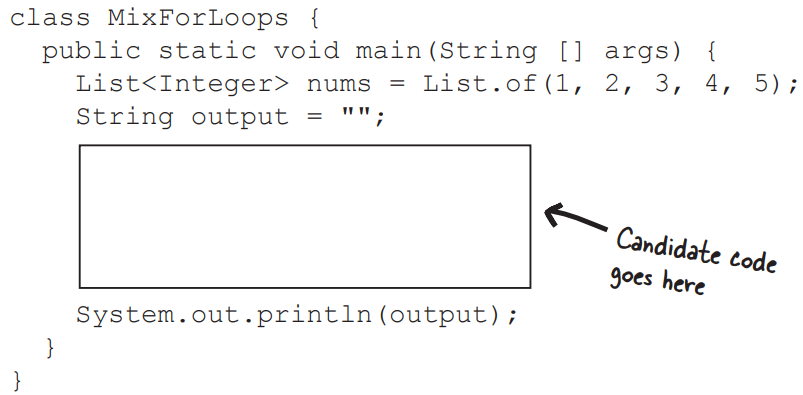
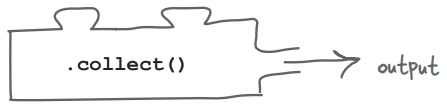
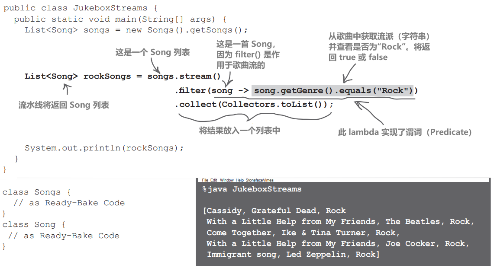
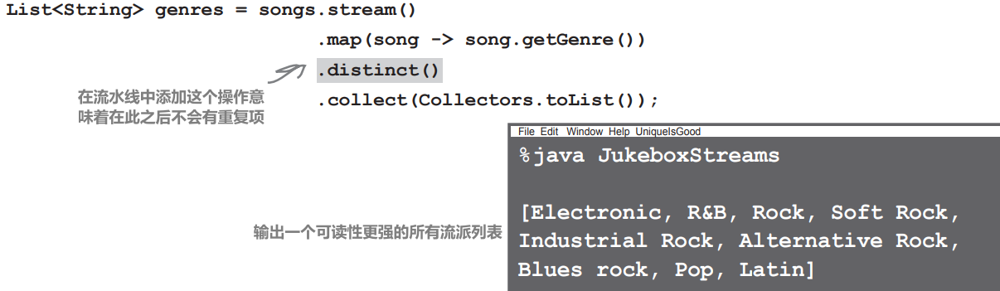

# Lambda表达式和流


# 告诉电脑你想要什么

是要什么而不是怎么做


```java
List<String> allColors = List.of("Red", "Blue", "Yellow");
for (String color : allColors) {
	System.out.println(color);
}
```

但是，对列表中的每个条目进行操作是一件非常常见的事情。因此，我们可以调用 `Iterable` 接口中的 `forEach` 方法，而不是每次都创建一个 for 循环，因为 List 实现了 Iterable，所以它拥有 Iterable 接口中的所有方法

<div style="overflow: hidden;">
  <div style="float: left; width: 68%;">
    
  </div>
  <div style="float: right; width: 20%; text-align: right;">
    
  </div>
</div></br>


```java
List<String> allColors = List.of("Red", "Blue", "Yellow");
allColors.forEach(color -> System.out.println(color));
```

**list 的 `forEach` 方法使用 lambda 表达式，我们在上一章中第一次看到了这个表达式。这是一种向方法传递行为（"遵循这些指令"）的方式，而不是传递包含数据的对象（"这里有一个供你使用的对象"）**

# 当 for 循环出错时

使用forEach而不是for循环意味着少些一点打字，而且专注于告诉编译器你想做什么而不是怎么做。让库来处理这样的常规代码还有另一个优势——可以减少意外错误

下面列出了一个简短的 Java 程序。程序中缺少一个程序块。我们预计程序的输出应该是 "1 2 3 4 5"，但有时很难让 for 循环恰到好处。

你的挑战是将候选代码块（在左边）与插入该代码块后的输出相匹配。并非所有的输出行都会被使用，有些输出行可能会被使用不止一次




# 普通代码中的小错误很难被发现

前面练习中的 for 循环看起来都很相似，乍一看，它们似乎都会按顺序打印出 List 中的所有值。编译器错误最容易发现，因为你的IDE或编译器会告诉你代码有错误，异常（我们将在第13章《风险行为》中看到）也可以指出代码中的问题。但是，通过查看代码来发现产生错误输出的代码可能会更加棘手

使用 forEach 这样的方法可以解决 "模板" 问题，即像 for 循环这样的重复和常见代码。使用 forEach，只传递我们想做的事情，可以减少代码中的意外错误

如果我们可以要求API对 “每个元素” 执行某些操作，那么似乎还有其他常见任务可以让API为我们完成

是的，确实如此，事实上，Java 8引入了一整套方法，专门用于此目的。Java 8引入了Streams API，一组新的方法，可以用于许多类，包括我们在前一章中看到的Collections类

Streams API 不仅仅是一堆有用的方法，还是一种略有不同的工作方式。它可以让我们建立一整套需求，也可以说是我们想要了解的数据的配方

# 常见操作的构件块

常用集合操作

即使在包含不同类型对象的不同类型的集合上，我们搜索集合的方式以及我们希望从这些集合中输出的信息类型也可能非常相似

试想一下，你想对一个集合做什么？"只给我符合某些条件的条目"、"使用这些步骤更改所有条目"、"删除所有重复条目"，以及我们在上一章讨论过的示例： "以这种方式对元素进行排序"

我们还可以更进一步，假设这些操作中的每一个都可以有一个名称，告诉我们这些操作会对我们的集合产生什么影响

## 流（Stream）操作中常见的操作：

1. map：将流中的当前元素转换为其他内容
2. limit：设置可以从该流中输出的最大元素数量
3. skip：当满足给定条件时，不处理元素
4. filter：只允许符合给定条件的元素保留在流中
5. takeWhile：只在满足给定条件时处理元素
6. sorted：指定流的结果应以某种方式排序
7. skipWhile：这是在流开始处不会被处理的元素数量
8. distinct：用于确保删除重复元素

# Streams API 简介

Streams API 是我们可以对集合执行的一系列操作，因此当我们在代码中读取这些操作时，就可以理解我们要对集合数据做什么。如果你成功完成了上一页的 "谁做什么？"练习（完整答案在本章末尾），那么你应该已经看到操作的名称描述了它们的操作

这些只是 Stream 中的一些方法......还有很多

java.util.stream.Stream

`Stream<T> distinct()`

返回由不同元素组成的流

`Stream<T> filter(Predicate<? super T> predicate)`

返回与给定谓词匹配的元素组成的流

`Stream<T> limit(long maxSize)`

返回截断后长度不超过 maxSize 的元素流

`<R> Stream<R> map(Function<? super T,? extends R> mapper)`

返回一个流，其中包含对该流中的元素应用给定函数的结果

`Stream<T> skip(long n)`

在丢弃数据流的前 n 个元素后，返回数据流中剩余元素的数据流

`Stream<T> sorted()`

返回一个按自然顺序排序的数据流

// more

你不必太在意 Stream 方法上的泛型；你会发现使用 Streams 就像你期望的那样 "正常工作"

如果你感兴趣的话：

- <span style="background-color: #e7f3f8;"> **`<T>`** 通常是流中对象的类型</span>
- <span style="background-color: #e7f3f8;"> **`<R>`** 通常是方法的结果类型</span>

# 开始使用 Streams

构建模块

在开始详细介绍 Streams API 是什么、有什么作用以及如何使用之前，我们将为你提供一些非常基本的工具，以便你开始尝试使用

要使用 Streams 方法，我们显然需要一个 Stream 对象（显而易见）。如果我们有一个像List这样的集合，它并不实现Stream。然而，Collection接口有一个方法，即stream，它返回该集合的一个Stream对象


```java
List<String> strings = List.of("I", "am", "a", "list", "of", "Strings");
Stream<String> stream = strings.stream();
```

现在我们可以调用Streams API的方法。例如，我们可以使用limit来指定我们想要最多四个元素


```java
Stream<String> limit = stream.limit(4);
```

如果我们尝试打印出调用 limit() 的结果，会发生什么呢？

```java
System.out.println("limit = " + limit);
```


与 Java 中的所有内容一样，示例中的stream变量也是对象。但流并不包含集合中的元素。它更像是对集合数据执行操作的指令集

返回另一个流的流方法称为中间操作（Intermediate Operations）。这些是要执行的操作的指令，但它们本身不会执行操作

# Streams就像菜谱：除非有人真的去做，否则什么也不会发生

书中的食谱只是告诉人们如何烹饪或烘焙某样东西。打开食谱并不能自动看到一个新鲜出炉的巧克力蛋糕。你需要根据食谱收集配料，并严格按照说明操作，才能得到你想要的结果

集合不是原料，一个仅限于四个条目的列表也不是一块巧克力蛋糕（很遗憾）。但是你确实需要调用 Stream 中的一个 "执行" 方法才能得到你想要的结果。这些 "执行" 方法被称为 "终端操作"（Terminal Operations），这些方法实际上会返回一些东西给你

这里有一些Stream上的终端操作

java.util.stream.Stream

`boolean anyMatch(Predicate<? super T> predicate)`

如果有元素符合所提供的断言，则返回 true

`long count()`

返回流中元素的数量

`<R,A> R collect(Collector<? super T,A,R> collector)`

使用 Collector 在此流的元素上执行可变归约操作

是的，这看起来甚至比 map 方法更复杂！不要惊慌，这些泛型类型帮助编译器，但当我们实际使用这个方法时，我们不必考虑这些泛型类型

`Optional<T> findFirst()`

返回描述该数据流第一个元素的 Optional，如果流为空，则返回空 Optional

// more

# 获取流的结果

是的，我们已经向你抛出了很多新词：流、中间操作、终端操作...... 我们还没有告诉你流可以做什么！

为了让大家开始了解我们能用流做什么，我们将展示简单使用流 API 的代码。之后，我们将回过头来进一步了解我们在这里看到的内容

```java
List<String> strings = List.of("I", "am", "a", "list", "of", "Strings");

Stream<String> stream = strings.stream();
Stream<String> limit = stream.limit(4);
long result = limit.count();   //调用 count 终端操作符，并将输出存储在一个名为 result 的变量中
System.out.println("result = " + result);

%java LimitWithStream
result = 4
```

这虽然可行，但用处不大。使用流最常做的一件事就是将结果放入另一种类型的集合中。虽然这个方法的 API 文档可能看起来让人畏惧，因为涉及到许多泛型类型，但最简单的情况很简单：


```java
List<String> result = limit.collect(Collectors.toList());
System.out.println("result = " + result);

%java LimitWithStream
result = [I, am, a, list]
```

最后，我们得到了一个结果，看起来就像我们预期的那样：我们有一个字符串列表，我们要求将该列表限制为前四个项，然后将这四个项收集到一个新的列表中

我们稍后将详细介绍 collect() 和 Collectors

现在，`collect(Collectors.toList)` 是一个神奇的咒语，用于将流管道的输出收集到一个列表中

# 流操作是构建块

为了输出列表中的前四个元素，我们写了很多代码。我们还引入了很多新术语：流、中间操作和终端操作。让我们把所有这些放在一起：你可以从三种不同类型的构建模块中创建一个流管道（stream pipeline）

<div style="overflow: hidden;">
  <div style="float: left; width: 50%;">
    1、从源（source）集合中获取流
  </div>
  <div style="float: right; width: 50%; text-align: right;">
    
  </div>
</div></br>

<div style="overflow: hidden;">
  <div style="float: left; width: 50%;">
    2、在流上调用零个或多个中间操作（intermediate operations）
  </div>
  <div style="float: right; width: 50%; text-align: right;">
    
  </div>
</div></br>

<div style="overflow: hidden;">
  <div style="float: left; width: 50%;">
    3、使用终端操作输出结果
  </div>
  <div style="float: right; width: 50%; text-align: right;">
    
  </div>
</div></br>

要使用 Streams API，至少需要拼图的第一块和最后一块。不过，你不需要将每个步骤分配给自己的变量（这是我们在上一页中做的）。事实上，这些操作被设计成可以链接，因此你可以在前一个操作后立即调用下一个阶段，而无需将每个阶段放在自己的变量中

在上一页，突出显示了流的所有构建块（stream、limit、count、collect）。我们可以将这些构建块取出，以这种方式重写limit和collect操作：


```java
List<String> strings = List.of("I", "am", "a", "list", "of", "Strings");
List<String> result = strings.stream()
                             .limit(4)
                             .collect(Collectors.toList());
System.out.println("result = " + result);
```

# 构件可以堆叠和组合

每个中间操作都作用于一个流并返回一个流。这意味着，在调用终端操作输出结果之前，堆叠任意数量的这些操作

<div style="overflow: hidden;">
  <div style="float: left; width: 50%;">
    
  </div>
  <div style="float: right; width: 50%; text-align: left;font-weight: bold">
    源、中间操作和终端操作组合在一起形成了流水线（Stream Pipeline）。
  这个流水线代表了对原始集合的查询
  </div>
</div></br>


这就是 Streams API 真正有用的地方。在前面的示例中，我们需要三个构建模块（stream、limit、collect）来创建原始 List 的一个较短版本，这对于一个简单的操作来说似乎很费事

但如果要做更复杂的事情，我们可以在单个流水线中堆叠多个操作

例如，我们可以在应用 limit 之前对流中的元素进行排序：


```java
List<String> strings = List.of("I", "am", "a", "list", "of", "Strings");
List<String> result = strings.stream()
                             .sorted()
                             .limit(4)
                             .collect(Collectors.toList());
System.out.println("result = " + result);
```

# 自定义构建块

我们可以将各种操作堆叠在一起，对我们的数据集进行更高级的查询。我们还可以自定义块的操作。例如，我们通过传递要返回的最大条目数（4）来定制 limit 方法

如果我们不想使用自然排序对字符串进行排序，我们可以定义一种特定的排序方式。我们可以为 sorted 方法设置排序条件（还记得我们在上一章给 Lou 的歌曲列表排序时做过类似的事情）


```java
List<String> result = strings.stream()
                             .sorted((s1, s2) -> s1.compareToIgnoreCase(s2))
                             .limit(4)
                             .collect(Collectors.toList());
```

# 逐个构建复杂的流水线

每添加一个新操作到流水线中都会改变流水线的输出。每个操作都会告诉 Streams API 你想做什么


```java
List<String> result = strings.stream()
                             .sorted((s1, s2) -> s1.compareToIgnoreCase(s2))
                             .skip(2)
                             .limit(4)
                             .collect(Collectors.toList());
```

是的，使用更长的流水线，你不希望计算机单独执行每个操作，然后再执行下一个操作，对吧？因此，我们需要一个终端操作，这样库就只在知道流水线中的所有操作时才“执行”

# 是的，因为流很懒

这并不意味着它们很慢或毫无用处！这意味着每个中间操作只是关于要做什么的指令；它本身并不执行指令。中间操作是惰性求值的

终端操作负责查看整个指令列表，即流水线中的所有中间操作，然后一次性运行整个指令集。终端操作是急迫的，一旦被调用就会立即运行

这意味着理论上可以最高效的方式运行指令组合。与每次中间操作都要遍历原始集合相比，只需遍历一次数据即可完成所有操作

# 终端操作承担所有工作

由于中间操作比较懒惰，所以一切都要靠终端操作来完成

1、尽可能高效地执行所有中间操作。理想情况下，只需对原始数据进行一次处理

2、计算出操作的结果，这个结果由终端操作本身定义。例如，这可以是一组值、单个值或布尔值（真/假）

3、返回结果

# 收集到列表

现在我们更清楚终端操作中发生了什么，让我们更仔细地看看返回结果列表的“魔法咒语”


```java
List<String> result = strings.stream()
                             .sorted()
                             .skip(2)
                             .limit(4)
                             .collect(Collectors.toList());
```

# 流工作指南

就像任何拼图或游戏一样，要让流构件正常工作也是有规则可循的

## 1、创建流管道至少需要第一块和最后一块

没有 stream() 部分，就根本不会有流；没有终端操作，就不会有任何结果

## 2、不能重复使用流

存储代表查询的 Stream 并在多个地方重复使用它似乎很有用，这可能是因为查询本身很有用，也可能是因为你想在它的基础上进行扩展。但是，一旦在流上调用了终端操作，就不能重复使用该流的任何部分，而必须创建一个新的流。一旦一个流水线执行完毕，该流就会关闭，无法在另一个流水线中使用，即使你将其中的一部分存储在变量中以便在其他地方重用。 如果尝试以任何方式重用流，将会出现异常


## 3、不能在流操作期间更改基础集合

如果这样做，就会出现奇怪的结果或异常。想想看，如果有人问你购物清单上有什么，而同时又有人在购物清单上乱写乱画，你也会给出令人困惑的答案

因此，如果在查询时不改变基础集合，那么流操作也不会改变集合，对吗？

## 正确！流操作不会改变原始集合

流 API 是查询集合的一种方式，但它不会更改集合本身。你可以使用 Streams API 查看该集合，并根据集合内容返回结果，但原始集合将保持不变。

这实际上非常有用。这意味着你可以在程序的任何地方查询集合并输出结果，而且知道原始集合中的数据是安全的；它不会被任何这些查询所改变（"突变"）

你可以通过在使用流 API 查询后打印原始集合的内容来验证这一点


```java
List<String> strings = List.of("I", "am", "a", "list", "of", "Strings");
Stream<String> limit = strings.stream()
                               .limit(4)
                               .collect(Collectors.toList());
System.out.println("strings = " + strings);
System.out.println("result = " + result);
```

# 流水线中的中间操作数量有限制吗？

没有，你可以根据需要链式连接这些操作。但请记住，阅读和理解这些代码的不仅仅是计算机，还有人类！如果流水线非常长，可能会太复杂而难以理解。这时，你可能需要将其拆分并将各个部分分配给变量，这样你就可以给这些变量起一个有用的名称

# 没有中间操作的流水线有什么意义吗？

是的，你可能会发现有一种终端操作可以将原始集合以某种新的形式输出，这正好符合你的需要。不过要注意的是，有些终端操作类似于集合上已有的方法；你并不总是需要使用流。例如，如果你只是在流上使用 count，那么如果你的原始集合是 List，你也许可以使用 size 来代替。同样，任何可迭代的集合（如 List）都已经有了 forEach 方法；你不需要使用 stream().forEach()

# 你说过在流操作过程中不要更改源集合。如果我的代码正在执行流操作，怎么可能改变集合呢？

问得好！可以编写同时运行不同代码的程序。我们将在涉及并发性的第 17 章和第 18 章中学习这方面的知识。为了安全起见，如果你知道不需要更改集合，通常最好（不仅仅是流，而是一般情况下）创建不能更改的集合

# 如何从 collect 终端操作输出一个不能改变的 List？

如果你使用的是 Java 10 或更高版本，你可以在调用 collect 时使用 `Collectors.toUnmodifiableList`，而不是使用 `Collectors.toList`

# 能否在非 List 集合中获取流水线的结果？

可以！在上一章中，我们了解到有几种不同用途的集合。Collectors 类有用于收集 `toList`、`toSet` 和 `toMap` 的方便方法，以及（自 Java 10 起）`toUnmodifiableList`、`toUnmodifiableSet` 和 `toUnmodifiableMap` 的方便方法

# 你好 Lambda，我（不是这样）的老朋友

到目前为止，Lambda 表达式已经在流示例中出现过，在本章结束之前，你还会看到更多的 Lambda 表达式

更好地理解 lambda 表达式将使得使用 Streams API 时更加轻松，因此让我们来仔细看看Lambda表达式

# 传递行为

如果你编写了一个 forEach 方法，它可能看起来像这样：


你会在"????? "的位置放什么呢？它需要以某种方式将代码块放入这个漂亮的空白方格中

然后，你希望调用该方法的人可以说


现在，我们需要用某种符号替换“do this”，表示这段代码不会立即执行，而是需要传递到方法中。我们可以使用`->`作为这个符号

然后，我们需要一种方法来表示 "看，这段代码需要处理其他地方的值"。我们可以把代码需要的东西放在“do this”符号的左侧....


# Lambda表达式是对象，并通过调用它们的Single Abstract Method来运行它们

记住，在Java中，一切都是对象（除了基本类型），Lambda表达式也不例外

Lambda表达式实现了一个Functional Interface

这意味着 lambda 表达式的引用将是一个函数式接口（Functional Interface）。因此，如果你想让你的方法接受 lambda 表达式，你需要有一个类型是Functional Interface的param。该函数式接口必须与 lambda 的 "形状" 相匹配

回到我们想象中的 forEach 例子；我们的 param 需要实现一个Functional Interface。我们还需要以某种方式调用 lambda 表达式，并传递列表元素

请记住，Functional Interface有一个Single Abstract Method（SAM）。当我们要运行 lambda 代码时，就会调用这个方法（无论其名称如何）


```java
void forEach( SomeFunctionalInterface lambda ) {
	for (Element element : list) {
		lambda.singleAbstractMethodName(element);
	}
}
```

Lambda 并不是魔法；它们只是像其他所有类一样的类

# Lambda 表达式的形式

我们已经看到了两个实现了Comparator接口的lambda表达式：上一章中用于对Lou的歌曲进行排序的示例，以及我们传递给sorted()流操作的lambda表达式。将最后一个示例与Comparator函数式接口相对照


你可能想知道，在 lambda 表达式中，return 关键字在哪里。简而言之：你不需要它。较长的版本是，如果lambda表达式是单行的，并且如果函数接口的方法签名需要返回值，编译器就会假设你的一行代码会生成要返回的值

如果你想要添加lambda表达式可能具有的所有部分，lambda表达式也可以这样写：

```java
(String s1, String s2) -> {
	return s1.compareToIgnoreCase(s2);
}
```

# lambda 表达式剖析

如果你仔细观察一下这个实现了 `Comparator<String>` 的 lambda 表达式的扩展版本，就会发现它与标准 Java 方法并无太大区别


lambda的形状（其参数、返回类型以及可以合理期望它执行的操作）由它实现的Functional Interface所决定

# 多样性是生活的调味品

Lambda 表达式可以有各种形状和大小，但仍然符合我们所看到的基本规则

## Lambda可能会有多行

Lambda表达式实际上是一个方法，可以像任何其他方法一样拥有多行。多行 lambda 表达式必须放在大括号内。然后，与其他方法代码一样，每行都必须以分号结束，如果方法应该返回某些东西，lambda体必须包含像任何普通方法一样的“return”关键字


```java
(str1, str2) -> {
	int l1 = str1.length();
	int l2 = str2.length();
	return l2 - l1;
}
```

## 单行的Lambda表达式不需要繁琐的语法

如果你的 lambda 表达式是单行的，编译器就更容易猜出其中的含义。因此，我们可以省去很多 "模板" 语法。如果我们将上一个示例中的 lambda 表达式缩成一行，它看起来就像这样：


这是相同的函数式接口（Comparator），执行相同的操作。无论你使用多行Lambda还是单行Lambda完全取决于你。这可能取决于Lambda表达式中的逻辑有多复杂，以及你认为这种写法是否容易阅读——有时候更长的代码可能更具描述性

稍后，我们将看到另一种处理长 Lambda 表达式的方法

## lambda 可能不会返回任何值

函数式接口的方法可能声明为void，即它不返回任何值。在这种情况下，Lambda内部的代码简单地被执行，你不需要从Lambda体中返回任何值

forEach 方法中的 lambda 表达式就是这种情况


# 一个lambda可能有0，1或者很多的params

lambda 表达式所需的 params 数量取决于函数式接口方法接受的 params 数量。param 类型（如名称 "String"）通常不是必需的，但如果你认为这样更容易理解代码，也可以添加它们。如果编译器不能自动确定你的 lambda 实现了哪个函数式接口，则可能需要添加参数类型


# 如何判断一个方法是否接受 lambda？

现在你已经知道，lambda 表达式是函数式接口的实现，也就是具有单一抽象方法的接口。这意味着 lambda 表达式的类型是这个接口

继续创建一个 lambda 表达式。将其赋值给一个变量，而不是像我们之前那样将其传递给某个方法。你会发现它可以像Java中的任何其他对象一样对待，因为Java中的一切都是对象。变量的类型就是函数式接口

```java
Comparator<String> comparator = (s1, s2) -> s1.compareToIgnoreCase(s2); 

Runnable runnable = () -> System.out.println("Hello!"); 

Consumer<String> consumer = str -> System.out.println(str); 
```

这如何帮助我们判断一个方法是否接受 lambda 表达式？方法的 param 类型将是函数式接口（Functional Interface）。请看流 API 中的一些示例：


# 识别函数式接口

到目前为止，我们看到的函数式接口都标有 **`@FunctionalInterface`** 注解（我们将在附录 B 中介绍注解），这很方便地告诉我们这个接口有单一的抽象方法（Single Abstract Method），并且可以用 lambda 表达式来实现

并非所有的函数式接口都是这样标记的，尤其是在旧代码中，因此了解如何识别函数式接口是很有用的

最初，接口中唯一允许使用的方法是抽象方法，这些方法需要被实现该接口的任何类重写。但从 Java 8 开始，接口也可以包含默认方法和静态方法

你在第 10 章 "数字的重要性" 中见过静态方法，在本章后面也会看到。这些方法不需要属于某个实例，通常用作辅助方法

默认方法略有不同。还记得第 8 章 "严肃的多态性" 中的抽象类吗？它们有需要被重写的抽象方法，以及带有方法体的标准方法。在接口中，默认方法的作用有点像抽象类中的标准方法——它们有一个方法体，并将被子类继承

默认方法和静态方法都有一个具有定义行为的方法体。对于接口来说，任何未被定义为默认方法或静态方法的方法都是必须被重写的抽象方法

# 野生的功能接口

既然我们知道接口可以有非抽象方法，我们可以看到识别具有单个抽象方法的接口会有些技巧。看看我们的老朋友Comparator。它有很多方法！但它仍然是一个 SAM 类型；它只有一个单一抽象方法。它是一个我们可以用lambda表达式实现的函数式接口


# 流作为查询

**Lou’s back!**

Lou 运行上一章中的新点唱机管理软件已经有一段时间了，他想了解更多关于餐厅点唱机播放歌曲的信息。现在，他已经掌握了这些数据，他想把它们切成小块，再组合成新的形状，就像他处理著名的特制煎蛋卷的配料一样！

他在思考可以从播放的歌曲中了解到各种信息，比如：

- 最常播放的五首歌曲是哪些？
- 播放的音乐类型有哪些？
- 是否有不同艺术家演唱的同名歌曲？

要达到这些目标，他可以通过for循环迭代歌曲数据，使用 if 语句进行条件检查，并将歌曲、标题或艺术家放入不同的集合中以找到这些问题的答案

**但既然我们已经了解了 Streams API，就知道还有更简单的方法....**

下一页的代码就是你的模拟代码；调用 `Songs.getSongs()` 会得到一个 Song 对象列表，你可以假定它与 Lou 点唱机中的真实数据一样

准备好的代码

```java
class Songs {
    public List<Song> getSongs() {
        return List.of(
                   new Song("$10", "Hitchhiker", "Electronic", 2016, 183),
                   new Song("Havana", "Camila Cabello", "R&B", 2017, 324),
                   new Song("Cassidy", "Grateful Dead", "Rock", 1972, 123),
                   new Song("50 ways", "Paul Simon", "Soft Rock", 1975, 199),
                   new Song("Hurt", "Nine Inch Nails", "Industrial Rock", 1995, 257),
                   new Song("Silence", "Delerium", "Electronic", 1999, 134),
                   new Song("Hurt", "Johnny Cash", "Soft Rock", 2002, 392),
                   new Song("Watercolour", "Pendulum", "Electronic", 2010, 155),
                   new Song("The Outsider", "A Perfect Circle", "Alternative Rock", 2004, 312),
                   new Song("With a Little Help from My Friends", "The Beatles", "Rock", 1967, 168),
                   new Song("Come Together", "The Beatles", "Blues rock", 1968, 173),
                   new Song("Come Together", "Ike & Tina Turner", "Rock", 1970, 165),
                   new Song("With a Little Help from My Friends", "Joe Cocker", "Rock", 1968, 46),
                   new Song("Immigrant Song", "Karen O", "Industrial Rock", 2011, 12),
                   new Song("Breathe", "The Prodigy", "Electronic", 1996, 337),
                   new Song("What's Going On", "Gaye", "R&B", 1971, 420),
                   new Song("Hallucinate", "Dua Lipa", "Pop", 2020, 75),
                   new Song("Walk Me Home", "P!nk", "Pop", 2019, 459),
                   new Song("I am not a woman, I'm a god", "Halsey", "Alternative Rock", 2021, 384),
                   new Song("Pasos de cero", "Pablo Alborán", "Latin", 2014, 117),
                   new Song("Smooth", "Santana", "Latin", 1999, 244),
                   new Song("Immigrant song", "Led Zeppelin", "Rock", 1970, 484));
    }
}
public class Song {
    private final String title;
    private final String artist;
    private final String genre;
    private final int year;
    private final int timesPlayed;
// Practice for you! Create a constructor, all the getters and a toString()
}
```

# 过滤流

## Lou的挑战＃1：找到所有的“摇滚”歌曲

更新的歌曲列表中包含歌曲的流派信息。Lou注意到餐馆的客户似乎更喜欢摇滚乐，他想要看到所有属于某种“摇滚”流派的歌曲列表

这是流的章节，所以显然解决方案将涉及到Streams API。请记住，我们可以组合三种类型的片段来形成解决方案


幸运的是，根据Lou给我们的要求，有关如何创建一个Streams API调用的提示：他想要筛选出具有特定流派的歌曲，并将它们收集到一个新的列表中


## 过滤流以保留某些元素

让我们看看如何对歌曲列表进行过滤操作


## 让我们来摇滚

因此，添加一个过滤操作就能过滤掉我们不想要的元素，而数据流就会继续保留符合我们标准的元素。我们可以使用 lambda 表达式来说明我们希望在流中保留哪些元素

过滤器方法接受一个谓词（Predicate）


鉴于我们对 lambda 表达式形式的了解，我们应该能够想出如何编写一个实现 Predicate 的 lambda 表达式

当我们将单个参数插入 Stream 操作时，我们就会知道它的类型，因为 lambda 的输入类型将由流的类型决定



```java
public class JukeboxStreams {
    public static void main(String[] args) {
        List<Song> songs = new Songs().getSongs();
        List<Song> rockSongs = songs.stream()
                                    .filter(song -> song.getGenre().equals("Rock"))
                                    .collect(Collectors.toList());

        System.out.println(rockSongs);
    }
}

class Songs {
    // as Ready-Bake Code
}
class Song {
    // as Ready-Bake Code
}
```

## 巧用过滤器

filter方法，以其“简单”的true或false返回值，可以包含复杂的逻辑来筛选流中的元素。让我们进一步扩展我们的筛选器，实际上做到了Lou所要求的：

他想要看到所有属于某种“摇滚”流派的歌曲列表

他不想只看到被归类为“Rock”的歌曲，而是想看到任何有点像摇滚的流派。我们应该搜索任何包含“Rock”这个词的流派

在String中有一个可以帮助我们的方法，它叫做contains


```java
List<Song> rockSongs = songs.stream()
                            .filter(song -> song.getGenre().contains("Rock"))
                            .collect(Collectors.toList());
```

# 转换元素

## Lou的挑战＃2：列出所有的流派

Lou现在感觉到餐馆客人听的音乐流派比他想象的要复杂。他想要一个列出所有已播放歌曲流派的列表

到目前为止，我们所有的流返回的类型都与开始时相同。先前的示例是字符串流，返回的是字符串列表。Lou 之前的挑战是从歌曲列表开始的，最后得到的是一个（更小的）歌曲列表

Lou 现在想要一个流派列表，这意味着我们需要以某种方式将流中的歌曲元素转化为流派（字符串）元素。这就是 map 的作用。map 操作说明了如何从一种类型映射到另一种类型


## 从一种类型映射到另一种类型

map方法接受一个Function。泛型的定义有些模糊，这使得理解起来有些棘手，但是Function只做一件事：它们接受一种类型的东西，并返回另一种类型的东西。从一种类型映射到另一种类型所需的确切操作因类型而异


让我们看看当我们在流水线中使用 map 时它是什么样子的


```java
List<String> genres = songs.stream()
                           .map(song -> song.getGenre())
                           .collect(toList());
```

map的 lambda 表达式类似于filter的 lambda 表达式；它接受一首歌并将其转换为其他内容。它不返回布尔值，而是返回另一个对象，这里是一个包含歌曲流派的字符串


# 唯一元素

## 移除重复项

我们在测试数据中有所有流派的列表，但Lou可能不想翻阅所有这些重复的流派。单独使用map操作将导致输出列表与输入列表大小相同。由于流操作设计为可以堆叠在一起使用，也许有另一个操作可以用来只获取流中每个元素的一个副本？


## 每种类型只有一个

只需要在流水线中添加一个distinct操作，就能获得每种流派中的唯一一个



```java
List<String> genres = songs.stream()
                           .map(song -> song.getGenre())
                           .distinct()
                           .collect(Collectors.toList());
```

## 继续构建

流管道可以有任意数量的中间操作。Streams API 的强大之处在于，我们可以用易于理解的构建块来构建复杂的查询。该库将以尽可能高效的方式运行此查询。例如，我们可以使用 map 操作和多个筛选器来创建一个查询，返回所有翻唱过某首歌曲的艺术家列表，但不包括原唱艺术家

```java
String songTitle = "With a Little Help from My Friends";
List<String> result = allSongs.stream()
                              .filter(song -> song.getTitle().equals(songTitle))
                              .map(song -> song.getArtist())
                              .filter(artist -> !artist.equals("The Beatles"))
                              .collect(Collectors.toList());
```

# 方法引用

## 有时甚至不需要 lambda 表达式

根据 param 类型或函数式接口的形状，有些 lambda 表达式可以做一些简单且可预测的事情。再看一下 map 操作的 lambda 表达式

```java
Function<Song, String> getGenre = song -> song.getGenre();
```

我们可以使用方法引用将编译器指向一个可以执行我们所需的操作的方法，而不是完整地书写这个操作


```java
Function<Song, String> getGenre = Song::getGenre;
```

**方法引用可以替代 lambda 表达式，但并非必须使用。有时，方法引用会让代码更容易理解**

在许多不同的情况下，方法引用可以替代 lambda 表达式。一般来说，如果方法引用能让代码更易读，我们可能会使用它

以我们的老朋友比较器（Comparator）为例。Comparator接口上有许多辅助方法，当与方法引用结合使用时，可以让你看到用于排序的值以及排序方向。举个例子，要将歌曲按年份从旧到新排序

```java
List<Song> result = allSongs.stream()
                            .sorted((o1, o2) -> o1.getYear() - o2.getYear())
                            .collect(toList());
```

使用方法引用结合 Comparator 的静态辅助方法来说明比较的内容：

```java
List<Song> result = allSongs.stream()
                            .sorted(Comparator.comparingInt(Song::getYear))
                            .collect(toList());
```

如果不习惯使用方法引用，就不必使用。重要的是要能够识别“**`::`**”语法，特别是在流水线中

# 收集结果的不同方式

虽然 `Collectors.toList` 是最常用的收集器，但还有其他有用的 Collectors。例如，我们可以将结果收集到一个不允许重复的 Set 中，而不是使用 distinct 来解决上一个挑战。使用这种方法的好处是，任何使用结果的其他程序都知道，因为这是一个 Set，所以根据定义，不会有重复的结果


```java
Set<String> genres = songs.stream()
                          .map(song -> song.getGenre())
                          .collect(Collectors.toSet());
```

## Collectors.toList 和 Collectors.toUnmodifiableList

你已经看过 toList 了。另外，你还可以使用 `Collectors.toUnmodifableList` 来获得一个不可更改的 List（不能添加、替换或删除任何元素）。这只有 Java 10 以后才有


## Collectors.toSet 和 Collectors.toUnmodifiableSet

使用这些方法可将结果放入集合（Set）而不是列表（List）中。请记住，Set 不能包含重复项，并且通常不是有序的。如果你使用的是 Java 10 或更高版本，你可以使用 `Collectors.toUnmodifiableSet` 来确保结果不会被任何东西改变


## Collectors.toMap 和 Collectors.toUnmodifiableMap

你可以将流收集到键/值对的 Map 中。你需要提供一些函数来告诉收集器什么是键，什么是值。从 Java 10 开始，你可以使用 `Collectors.toUnmodifiableMap` 创建一个不可更改的 Map


## Collectors.joining

你可以从流中创建一个字符串结果。它将所有流元素连接成一个单独的字符串。你可以选择定义分隔符，即用于分隔每个元素的字符。如果你想把数据流转换成逗号分隔值（CSV）字符串，这将非常有用

# 等等！还有很多！

终端操作

收集结果并不是唯一的游戏；收集只是众多终端操作中的一个

## 检查是否存在某个元素

你可以使用返回布尔值的终端操作在流中查找某些东西。例如，我们可以查看餐馆是否播放了任何R&B歌曲

```java
boolean result = songs.stream()
                      .anyMatch(s -> s.getGenre().equals("R&B"));
```

```java
boolean anyMatch(Predicate p);
boolean allMatch(Predicate p);
boolean noneMatch(Predicate p);
```

## 查找特定内容

返回 Optional 值的终端操作在流中查找某些东西。例如，我们可以找到1995年发行的第一首播放的歌曲

```java
Optional<Song> result = songs.stream()
                             .filter(s -> s.getYear() == 1995)
                             .findFirst();
```

```java
Optional<T> findAny();
Optional<T> findFirst();
Optional<T> max(Comparator c);
Optional<T> min(Comparator c);
Optional<T> reduce(BinaryOperator a);
```

## 计算项目数量

有一个 count 操作，你可以用来找出流中元素的数量。例如，我们可以找出唯一艺术家的数量

```java
long result = songs.stream()
                   .map(Song::getArtist)
                   .distinct()
                   .count();
```

```java
long count();
```

**还有更多终端操作，其中一些取决于你正在使用的流类型**

**请记住，API 文档可以帮助你确定是否有内置操作可以实现你想要的功能**

等等。结果怎么可能是 "可选的"（ Optional ）？这到底是什么意思？

# 有些操作可能会返回一些值，也可能不会返回任何值

方法可能会或可能不会返回一个值，这可能看起来有些奇怪，但在现实生活中经常发生

想象一下，你在一个冰淇淋摊前，要了一份草莓冰淇淋


很容易理解，对吧？但是如果他们没有草莓呢？冰淇淋摊主可能会告诉你“我们没有那种口味”


然后由你决定接下来做什么 ——也许是点巧克力味的，也许是找另一家冰淇淋店，也许是回家为没有冰淇淋而生闷气

想象一下在 Java 世界中这样做的情景。在第一个例子中，你会得到一个冰淇淋实例。在第二个例子中，你会得到......一条字符串消息？但是一条消息并不适合放在一个冰淇淋形状的变量中。空值？但 null 到底是什么意思呢？

<div style="overflow: hidden;">
  <div style="float: left; width: 50%;">
    
  </div>
  <div style="float: right; width: 50%; text-align: right;">
    
  </div>
</div></br>

# Optional 是一个包装器

自 Java 8 起，方法声明有时可能不返回结果的正常方式而是返回一个可选项。这是一个包装结果的对象，因此你可以问 "我得到结果了吗？还是空的？"然后再决定下一步该怎么做


<blockquote style="background-color: #e7f3f8;">区别

wrap：通常翻译为 "包装”。用于描述将一个对象放入另一个对象中的过程

encapsulation：通常翻译为 "封装”。常用于描述将数据和对数据的操作封装到一个类中的过程，以实现信息隐藏和代码重用
</blockquote>

你刚给我介绍了两个新步骤，让我可以吃到冰淇淋！

## 是的，但现在我们有办法询问是否有结果了

Optional 为我们提供了一种方法来了解和处理你吃不到冰淇淋的情况


过去，在这种情况下，方法可能会抛出异常，或返回 "null"，或返回一种特殊类型的 “Not Found” 冰淇淋实例。从方法中返回一个 Optional 可以清楚地表明，任何调用该方法的人都需要先检查是否有结果，然后自行决定如果没有结果该怎么办

# 不要忘记与 Optional 包装器交流

关于 Optional 结果的重要一点是它们可以为空。如果你不先检查一下是否有值存在，而结果为空，你将会得到一个异常


如果不调用`isPresent()`，它会爆炸！

在解包之前，需要询问 Optional 对象是否包含某些内容；否则，如果没有结果，就会出现异常