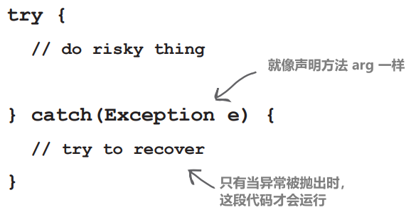
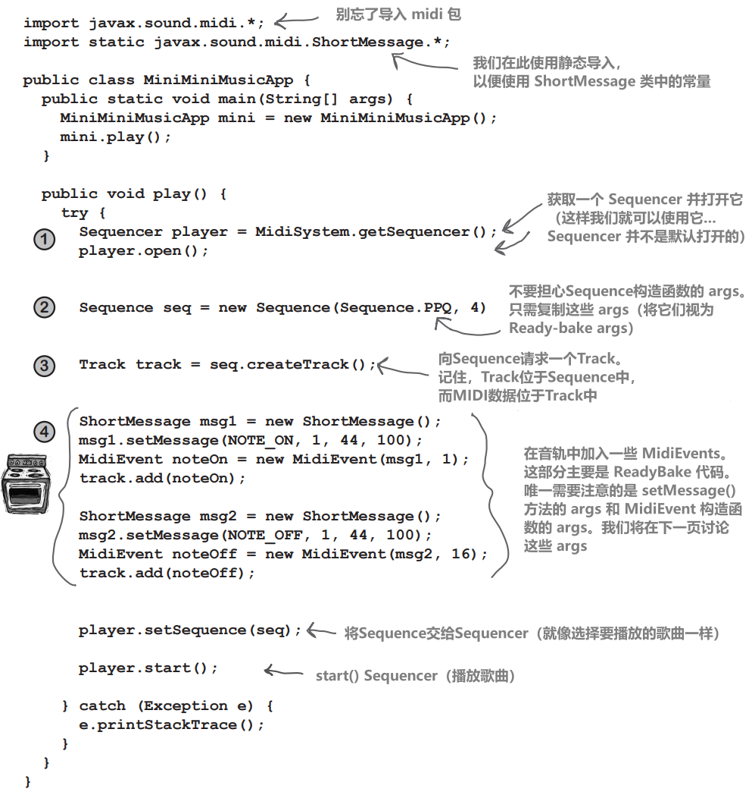
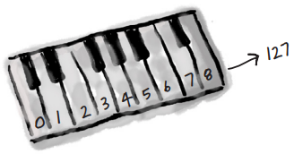

# 异常处理

# 风险行为

# 让我们制作一台音乐机器

制作 MIDI 音乐播放器

在接下来的三章中，我们我们将构建几个不同的声音应用程序，包括 BeatBox 鼓机。事实上，在本书完成之前，我们将制作一个多人版本，这样你就可以把你的鼓循环发送给另一个玩家，就像在社交媒体上分享一样。虽然你可以选择使用 Ready-Bake 代码来编写 GUI 部分，但整个过程都将由你来编写。好吧，不是每个 IT 部门都在寻找新的 BeatBox 服务器，但我们这样做是为了更多地了解 Java。构建 BeatBox 只是我们学习 Java 时的一种娱乐方式

完成后的 BeatBox 看起来是这样的：


请注意 16 个 "节拍" 中每个方框内的勾选标记。例如，在第 1 拍（16 拍中的第 1 拍），Bass drum 和  Maracas 会播放，在第2拍中没有任何声音，第 3 拍 Maracas 和 Closed Hi-Hat ......你就明白了。当你按下 Start 键时，它会循环播放你的模式，直到你按下 Stop 键。在任何时候，你都可以通过发送它到BeatBox服务器来 “捕获” 自己的模式（这意味着任何其他玩家都可以听到它）。你还可以通过点击信息加载任何传入的模式

# 我们从最基本的开始

显然，在整个程序完成之前，我们还有一些东西要学，包括如何构建图形用户界面（GUI）、如何通过网络连接到另一台机器，以及一些I/O，这样我们就可以向另一台机器发送一些内容

对了，还有 JavaSound API。我们将从本章开始学习。现在，你可以忘掉GUI，忘掉网络和 I/O，只需专注于让电脑发出一些 MIDI 产生的声音。如果你对 MIDI 一窍不通，也不懂如何阅读或制作音乐，也不用担心。这里涵盖了你需要学习的一切。你几乎可以闻到唱片合约的味道

## JavaSound API

JavaSound 是 Java 早在 1.3 版中添加的一组类和接口。它们不是特殊的附加组件，而是标准 Java SE 类库的一部分。JavaSound 分成两部分： MIDI 和 Sampled 。我们在本书中只使用 MIDI。MIDI 是乐器数字接口（Musical Instrument Digital Interface）的缩写，是让不同种类的电子音响设备进行通信的标准协议。但对于我们的 BeatBox 应用程序来说，你可以将 MIDI 视为一种乐谱，将其输入到高科技 "演奏钢琴" 之类的设备中。换句话说，MIDI 数据实际上并不包含任何声音，但它包含了 MIDI 读取设备可以播放的指令。或者换个比喻，你可以把 MIDI 文件想象成 HTML 文档，而渲染 MIDI 文件（即播放文件）的工具就像网络浏览器

MIDI 数据说明了要做什么（弹奏中音 C，这里说明了击打的力度，这里说明了保持的时间，等等），但它完全没有说明你听到的实际声音。MIDI 不知道如何制作长笛、钢琴或 Jimi Hendrix 吉他的声音。要发出实际的声音，我们需要一个能读取和播放 MIDI 文件的乐器（MIDI 设备）。但这种设备通常更像是一个整个乐队或管弦乐队的乐器。这种乐器可能是物理设备，如键盘，也可能是完全用软件制作的乐器，存在于你的电脑中

在 BeatBox 中，我们只使用 Java 内置的纯软件乐器。它被称为合成器（有些人称之为软件合成器），因为它能产生声音。你能听到的声音


看起来有点简单

# 首先我们需要一个序列器（Sequencer）

在播放任何声音之前，我们需要一个 Sequencer 对象。Sequencer 是接收所有 MIDI 数据并将其发送到正确乐器的对象。它是播放音乐的东西。Sequencer 可以做很多不同的事情，但在本书中，我们严格将其用作播放设备。它就像一个播放音乐的设备，只是增加了一些功能。序列器类属于 `javax.sound.midi` 包。因此，我们首先要确保能创建（或获取）一个 Sequencer 对象


# 当你想调用的方法（可能在你没有编写的类中）有风险时会发生什么？

1、假设你想调用一个你没有编写的类中的方法


2、这个方法有风险，运行时可能无法正常工作


3、你需要知道你要调用的方法是有风险的


4、然后，你编写能够处理失败情况的代码。你需要做好准备，以防万一


当可能出现问题时

# Java 中的方法使用异常（exceptions）来告诉调用代码 "发生了不好的事情。我失败了“

Java 的异常处理机制是一种清晰、明了的方式来处理在运行时出现的“异常情况”；它允许你将所有错误处理代码放在一个易于阅读的地方。它基于你要调用的方法告诉你它有风险（即该方法可能会产生异常），这样你就可以编写代码来处理这种可能性。如果你知道在调用某个方法时可能会出现异常，你就可以做好准备，甚至有可能从导致异常的问题中恢复过来

那么，一个方法如何告诉你它可能会抛出异常呢？你会在有风险的方法声明中找到一个 throws 子句

`getSequencer()` 方法存在风险。它可能在运行时失败。因此，在调用该方法时，必须 "声明" 所承担的风险 


# 编译器需要知道你知道自己在调用一个有风险的方法

如果用 **`try/catch`** 将有风险的代码包装起来，编译器就会放松

try/catch 代码块告诉编译器，你知道你调用的方法可能会发生异常情况，并且你已经准备好处理它。编译器不关心你如何处理它；它只关心你说你正在处理它


```java
import javax.sound.midi.*;
public class MusicTest1 {
	public void play() {
		try {
			Sequencer sequencer = MidiSystem.getSequencer();
			System.out.println("Successfully got a sequencer");
		} catch(MidiUnavailableException e) {
			System.out.println("Bummer");
		}
	}

	public static void main(String[] args) {
		MusicTest1 mt = new MusicTest1();
		mt.play();
	}
}
```

# 异常是一种对象... 类型为Exception

这是幸运的，因为如果异常是西兰花类型的，那就更难记住了

记住在多态性章节（第7和第8章）中，Exception 类型的对象可以是 Exception 的任何子类的实例


因为 Exception 是一个对象，所以你捕获的也是一个对象。在下面的代码中，catch 参数被声明为 Exception 类型，参数引用变量为 ex



在 catch 块中写什么取决于抛出的异常。例如，如果服务器宕机，你可以使用 catch 块尝试另一个服务器。如果文件不在，可以请用户帮助查找

# 如果是你的代码捕获了异常，那么是谁的代码抛出了它呢？

在 Java 代码编写过程中，处理异常的时间要远远多于自己创建和抛出异常的时间。现在，你只需知道，当你的代码调用一个有风险的方法时——一个声明了异常的方法——是这个有风险的方法将异常抛回给你，即调用者


实际上，可能是你编写了这两个类。谁写代码并不重要......重要的是知道哪个方法抛出 (throws) 异常，哪个方法捕获 (catches) 异常

当有人编写可能抛出异常的代码时，他们必须声明异常（exception）

## 1、有风险、抛出异常的代码：


```java
 public void takeRisk() throws BadException {
	 if (abandonAllHope) {
		 throw new BadException();
	 }
 }
```

## 2、你的代码调用风险方法


```java
public void crossFingers() {
	try {
		anObject.takeRisk();
	} catch (BadException e) {
		System.out.println("Aaargh!");
		e.printStackTrace();
	}
}
```

# 编译器会检查除 RuntimeExceptions 以外的所有异常

已检查和未检查的异常

编译器保证：

1、如果在代码中抛出异常，必须在方法声明中使用 throws 关键字进行声明

2、如果调用一个抛出异常的方法（换句话说，调用一个声明自己抛出异常的方法），则必须承认自己意识到异常的可能性。满足编译器要求的一种方法是将调用包装在 try/catch 中。(本章稍后将介绍第二种方法）


# 等一下！这是我们第一次必须使用try/catch来捕获异常吗？那我已经得到的异常（如 NullPointerException 和 DivideByZero 异常）又是怎么回事？我甚至还从 Integer.parseInt() 方法中得到了一个 NumberFormatException 异常。为什么我们不必捕获这些异常？

编译器关心所有Exception的子类，除非它们是一个特殊类型，即RuntimeException。任何继承RuntimeException的异常类都可以直接抛出，无需throws声明或try/catch块。编译器不会检查一个方法是否声明了它会抛出一个RuntimeException，或者调用者是否意识到他们可能在运行时得到该异常

# 我想知道，为什么编译器不关心这些运行时异常呢？它们不同样有可能导致整个程序停止吗？

大多数 RuntimeException 都来自代码逻辑中的问题，而不是运行时以你无法预测或预防的方式出现的故障。你无法保证文件是否存在，无法保证服务器是否正常。但你可以确保你的代码不会在数组的末尾建立索引（这就是 .length 属性的作用）。你希望RuntimeException在开发和测试阶段发生。例如，你不想在代码中加入 try/catch，也不想为了捕获本来就不应该发生的异常而增加开销。try/catch 用于处理特殊情况，而不是代码中的缺陷。在你的catch块中尝试恢复你不能保证成功的情况。或者至少，向用户输出一条消息和一个堆栈跟踪，以便有人能够弄清楚发生了什么

<blockquote style="background-color: #e7f3f8;">

可能抛出检查异常的方法必须用 throws SomeException 声明

如果你的代码调用了会抛出校验异常的方法，则必须向编译器保证已经采取了预防措施

如果准备处理异常，就用 try/catch 包装调用，并将异常处理/恢复代码放在 catch 块中
 
如果不准备处理异常，也可以通过正式"回避"异常来让编译器满意。本章稍后我们将讨论 "回避"
</blockquote>

异常和流程控制

# try/catch 块中的流程控制

当你调用一个有风险的方法时，有两种情况可能发生。要么风险方法成功，try 块完成，要么有风险的方法将异常抛回到你的调用方法

## 如果try成功（`doRiskyThing()`不会抛出异常）


## 如果 try 失败（因为 `doRiskyThing()` 抛出异常）


# Finally：无论如何都要执行的操作

如果你想做饭，首先要打开烤箱

如果你尝试的事情完全失败，你就必须关掉烤箱

如果尝试成功了，就必须关掉烤箱

无论如何，你都必须关闭烤箱！

**finally代码块用于放置无论是否出现异常都必须运行的代码**

```java
try {
	turnOvenOn();
	x.bake(); 
} catch (BakingException e) { 
	e.printStackTrace();
} finally {
	turnOvenOff();
}
```

如果没有finally，你必须在try和catch中都放置turnOvenOff()，因为你无论如何都必须关闭烤箱。finally块允许你把所有重要的清理代码放在一个地方，而不是像这样重复放置：


<blockquote style="background-color: #edf3ec;">
如果try块<b>失败</b>（有异常），流程立即转到catch块。当catch块完成后，finally块运行。当finally块完成后，方法的其余部分继续执行
</blockquote>

<blockquote style="background-color: #edf3ec;">
如果try块<b>成功</b>（没有异常），流程跳过catch块并移动到finally块。当finally块完成后，方法的其余部分继续执行
</blockquote>

<blockquote style="background-color: #edf3ec;">
如果try或catch块有<b>返回语句</b>，finally仍然会运行！流程跳转到finally，然后返回到return
</blockquote>

# 一个方法可以抛出多个异常

如果有必要，一个方法可以抛出多个异常。但方法的声明必须声明它可以抛出的所有已检查异常（尽管如果两个或多个异常有一个共同的超类，方法可以只声明超类）

## 捕获多个异常

编译器会确保你已经处理了你调用的方法抛出的所有受检异常。在try下面依次堆叠catch块。有时候，堆叠catch块的顺序很重要，但我们稍后会详细讨论


# 异常是多态的

请记住，异常（Exceptions）是对象。除了它是一个可以被抛出的对象外，它并没有什么特别之处。因此，与所有优秀的对象一样，异常也可以多态引用。例如，一个LingerieException对象可以赋值给一个ClothingException引用。一个PantsException可以赋值给一个Exception引用。你就明白了。异常的好处在于，方法不必明确声明它可能抛出的每一个异常；它可以声明异常的超类。对于catch块也是一样的，只要你的catch（或catches）能够处理抛出的任何异常，你就不必为每一个可能的异常编写一个catch块


# 1、可以使用抛出异常的超类来 DECLARE 异常


# 2、你可以使用抛出异常的超类来捕获异常


## 你可以用一个大的超级多态 catch 来捕获所有异常，但这并不总是意味着你应该这样做

你可以在编写异常处理代码时只指定一个 catch 块，在 catch 子句中使用超类 Exception，这样就能捕获任何可能抛出的异常


## 为每个需要独特处理的异常编写不同的catch块

例如，如果你的代码处理（或从中恢复）TeeShirtException和LingerieException的方式不同，请为每种异常编写一个 catch 块。但如果你对所有其他类型的ClothingException采取相同的处理方式，那么就添加一个 ClothingException catch 来处理其余的


# 多个catch块必须按照从小到大的顺序排列


继承树越高，catch“篮子”越大。随着继承树的向下移动，面向越来越多的专门化的异常类，catch“篮子”就越小。这就是普通的多态性

`ShirtException` 的 catch 大到足以捕获 `TeeShirtException` 或 `DressShirtException`（以及任何扩展`ShirtException`的任何未来子类）。`ClothingException` 甚至更大（即使用`ClothingException`类型引用的东西更多）。它可以接收 `ClothingException` 类型的异常（咄）和任何 `ClothingException` 子类： `PantsException`、`UniformException`、`LingerieException` 和 `ShirtException`。所有catch args 的最大者是`Exception`类型；它可以捕获任何异常，包括运行时（未检查）异常，因此在测试之外可能不会使用它


# 不能把更大的篮子放在更小的篮子上面

可以，但编译不了。catch 块与重载方法不同，后者会选择最匹配的方法。对于 catch 块，JVM 只需从第一个开始向下处理，直到找到一个足够宽泛（换句话说，在继承树上足够高）的 catch 来处理异常。如果你的第一个 catch 块是 `catch(Exception ex)`，编译器就知道没有添加其他catch块是没有意义的——它们永远不会被执行到


有多个 catch 块时，size 很重要。最大篮子的必须在底部。否则，较小篮子的将无用

<span style="background-color: #edf3ec;"> 
<b>同级异常（在层次结构树中处于同一层次的异常，如 PantsException 和 LingerieException）可以按任何顺序排列，因为它们无法捕获彼此的异常</b>
</span>

你可以把 ShirtException 放在 LingerieException 的上面，没有人会介意。因为尽管 ShirtException 是一个更大（更广泛）的类型，因为它可以捕获其他类（它自己的子类），但 ShirtException 无法捕获 LingerieException，所以不会有问题

# 不想处理异常时......就回避 （duck）它

**如果不想处理异常，可以通过声明（declare）来避免（duck）**

当你调用一个有风险的方法时，编译器需要你确认它。大多数情况下，这意味着将有风险的调用包装在 try/catch 中。但你还有另一种选择：简单地回避它，让调用你的方法捕获异常

这很简单，你只需声明你抛出了异常。尽管从技术上讲，你并没有抛出异常，但这并不重要。你还是那个让异常迅速地通过的人

但如果你回避了异常，那么你就没有 try/catch，那么当有风险的方法（doLaundry()）确实抛出异常时会发生什么呢？

当一个方法抛出一个异常时，这个方法会立即从调用栈中弹出，异常会被抛给调用栈中的下一个方法——也就是调用者。但如果调用者是一个“ducker”（在这里指的是没有准备捕获该异常的方法），那么就没有对应的`catch`语句来捕获这个异常，所以调用者也会立即从调用栈中弹出，异常继续被抛给下一个方法，以此类推……这个过程会在哪里结束？你稍后会看到


# 规避（通过声明）只是推迟了不可避免的结果

**迟早有人必须处理它。 但如果主方法main()也规避了异常呢？**


<div style="display: flex;
            justify-content: space-around;
            align-items: center;
            flex-wrap: wrap;">
  <div style=" height: auto; width: 25%;">
    
  </div>
  <div style=" height: auto; width: 20%;">
    
  </div>
  <div style=" height: auto; width: 20%;">
    
  </div>
  <div style=" height: auto; width: 20%;">
    
  </div>
</div></br>


# 处理（Handle）或声明（Declare）。这是规定

现在我们已经看到了调用风险（抛出异常）方法时满足编译器的两种方式

## 1、处理（Handle）

将风险调用包装在try/catch中


## 2、声明（Declare）（回避它）

声明你的方法与你调用的风险方法抛出相同的异常


但现在，这意味着无论谁调用 foo() 方法，都必须遵守Handle or Declare法则。如果 foo() 回避了异常（通过声明），而 main() 调用了 foo()，那么 main() 就必须处理异常


修复Sequencer代码

# 回到我们的音乐代码...

现在你已经完全忘记了，本章开始时我们先看了一些 JavaSound 代码。我们创建了一个 Sequencer 对象，但它无法编译，因为方法 Midi.getSequencer() 声明了一个已检查异常 (MidiUnavailableException)。但现在我们可以通过在try/catch块中包装调用来修复这个问题


## 异常规则

### 1、如果没有 try，就不能有 catch 或 finally


### 2、不能在 try 和 catch 之间放置代码


### 3、try 必须后跟 catch 或 finally


### 4、只有finally（没有catch）的try仍然必须声明异常


# 生成实际声音  JavaSound MIDI classes

还记得在本章的开头，我们讨论过 MIDI 数据如何保存演奏指令（以及如何演奏），我们还说过 MIDI 数据实际上并不能产生任何你能听到的声音。要让扬声器发出声音，MIDI 数据必须通过某种 MIDI 设备发送，该设备通过触发硬件乐器或 "虚拟" 乐器（软件合成器），接收 MIDI 指令并将其转换成声音。在本书中，我们只使用软件设备，以下是 JavaSound 的工作原理：

## 你需要四样东西：


## 并且你需要五个步骤：

1. 获取一个 Sequencer 并打开它

```java
Sequencer player = MidiSystem.getSequencer();
player.open();
```

1. 创建一个新的Sequence

```java
Sequence seq = new Sequence(timing,4);
```

1. 从Sequence中获取一个新的 Track

```java
Track t = seq.createTrack();
```

1. 用 MidiEvents 填充Track，并将 Sequence 提供给 Sequencer

```java
t.add(myMidiEvent1);
player.setSequence(seq);
```

1. 按下播放按钮，你必须start() Sequencer！

```java
player.start();
```

# 版本 1：你的第一个声音播放器应用程序

a sound application

输入并运行它。你会听到有人在钢琴上弹奏一个音符的声音！(好吧，也许不是某个人，而是某些东西）



```java
import javax.sound.midi.*;
import static javax.sound.midi.ShortMessage.*;
public class MiniMiniMusicApp {
    public static void main(String[] args) {
        MiniMiniMusicApp mini = new MiniMiniMusicApp();
        mini.play();
    }

    public void play() {
        try {
            Sequencer player = MidiSystem.getSequencer();
            player.open();
			
            Sequence seq = new Sequence(Sequence.PPQ, 4);
			
            Track track = seq.createTrack();
			
            ShortMessage msg1 = new ShortMessage();
			
            msg1.setMessage(NOTE_ON, 1, 44, 100);
            MidiEvent noteOn = new MidiEvent(msg1, 1);
            track.add(noteOn);
			
            ShortMessage msg2 = new ShortMessage();
            msg2.setMessage(NOTE_OFF, 1, 44, 100);
            MidiEvent noteOff = new MidiEvent(msg2, 16);
            track.add(noteOff);
			
            player.setSequence(seq);
			
            player.start();
        } catch (Exception e) {
            e.printStackTrace();
        }
    }
}
```

# 制作 MidiEvent（歌曲数据）

MidiEvent 是歌曲的一部分指令。一系列 MidiEvents 有点像乐谱或钢琴演奏卷。我们关心的大多数 MidiEvents 都描述了要做的一件事和做这件事的时间。时间点部分很重要，因为在音乐中时间就是一切。这个音符紧跟着这个音符，以此类推。由于 MidiEvents 非常详细，你必须说明什么时候开始演奏音符（NOTE ON事件）以及什么时候停止演奏音符（NOTE OFF事件）。因此可以想象，在 "开始演奏音符 G"（NOTE ON）之前发出 "停止演奏音符 G"（NOTE OFF）是行不通的

MIDI 指令实际上是一个 Message 对象；MidiEvent 是 Message 和 Message "触发" 时间的组合。换句话说，Message 可能会说："开始演奏中C"，而 MidiEvent 会说："在第 4 拍触发这条信息"

因此，我们总是需要一个 Message 和一个 MidiEvent

信息说明要做什么，而 MidiEvent 则说明何时要做

**一个 MidiEvent 说明要做什么以及何时做**

**每个指令都必须包括该指令的时间安排**

**换句话说，指定这个事件应该发生在哪一拍**

## 1、创建一条信息

```java
ShortMessage msg = new ShortMessage();
```

## 2、在信息中输入指令

```java
msg.setMessage(144, 1, 44, 100);
```

该信息表示 "开始演奏音符 44"（我们将在下一页查看其他数字）

## 3、使用 Message 创建一个新的 MidiEvent

```java
MidiEvent noteOn = new MidiEvent(a, 1);
```

指令在消息中，但 MidiEvent 增加了触发指令的时间点。这个 MidiEvent 表示在第一拍（第 1 拍）触发信息 "a"

## 4、将 MidiEvent 添加到 Track

```java
track.add(noteOn);
```

一个 Track 保存了所有 MidiEvent 对象。Sequence 会根据每个事件的发生时间将它们组织起来，然后 Sequencer 按照顺序播放它们。你可以让许多事件在同一时刻发生。例如，你可能希望同时演奏两个音符，甚至不同的乐器同时演奏不同的声音

# MIDI message：MidiEvent 的核心

Midi 事件的内容

MIDI message 是事件中说明要做什么的部分。它是你希望 Sequencer 执行的实际指令。指令的第一个 arg 总是 message 的 type。你传递给其他三个 args 的值取决于消息类型。例如，类型为 144 的消息表示“NOTE ON”。但是为了执行 NOTE ON，Sequencer 需要知道一些信息。想象一下 Sequencer 说：“好的，我会演奏一个音符，但是使用哪个通道（channel）？换句话说，你希望我演奏的是鼓音还是钢琴音？还有，你希望演奏哪个音符（note）？中音C？D#？还有，顺便问一下，我应该以什么速度（velocity）演奏这个音符？

要制作 MIDI message，可以创建一个 ShortMessage 实例并调用 setMessage() 方法，输入信息的四个 args。但请记住，信息只说明了要做什么，所以你仍然需要将信息添加到一个事件中，该事件会添加信息 "触发" 的时间 

# 消息剖析

setMessage() 的第一个 args 总是代表 message "类型"，而其他三个 args 则根据 message 类型代表不同的内容

Message 表示要做什么，MidiEvent 表示何时做


<div style="overflow: hidden;">
  <div style="float: left; width: 50%;">
    
  </div>
  <div style="float: right; width: 50%; text-align: right;">
    
  </div>
</div></br>

<div style="overflow: hidden;">
  <div style="float: left; width: 50%;">
    
  </div>
  <div style="float: right; width: 48%; text-align: right;">
    
  </div>
</div></br>


# 更改消息

既然知道了 MIDI 消息的内容，就可以开始尝试了。你可以更改演奏的音符、音符持续的时间、添加更多音符，甚至更改乐器

## 1、更改音符

在"音符开启"和"音符关闭"消息中输入 0 至 127 之间的数字

<div style="overflow: hidden;">
  <div style="float: left; width: 50%;">
    
  </div>
  <div style="float: right; width: 50%; text-align: right;">
    
  </div>
</div></br>

## 2、更改音符的持续时间

更改音符关闭事件（而不是消息），使其发生在较早或较晚的节拍上

<div style="overflow: hidden;">
  <div style="float: left; width: 60%;">
    
  </div>
  <div style="float: right; width: 36%; text-align: right;">
    
  </div>
</div></br>

## 3、更改乐器

在播放音符消息之前添加一个新消息，将通道 1 中的乐器设置为默认钢琴以外的其他乐器。更改乐器信息为 "192"，第三个参数代表实际乐器（请尝试 0 至 127 之间的数字）

<div style="overflow: hidden;">
  <div style="float: left; width: 60%;">
    
  </div>
  <div style="float: right; width: 40%; text-align: right;">
    
  </div>
</div></br>

# 版本 2：使用命令行参数来尝试不同的声音

改换乐器和音符

这个版本仍然只播放一个音符，但你可以使用命令行 args 来更改乐器和音符。你可以输入 0 至 127 之间的两个 int 值来进行实验。第一个 int 设置乐器；第二个 int 设置要演奏的音符

```java
import javax.sound.midi.*;
import static javax.sound.midi.ShortMessage.*;

public class MiniMusicCmdLine {
    public static void main(String[] args) {
        MiniMusicCmdLine mini = new MiniMusicCmdLine();
        if (args.length < 2) {
            System.out.println("Don’t forget the instrument and note args");
        } else {
            int instrument = Integer.parseInt(args[0]);
            int note = Integer.parseInt(args[1]);
            mini.play(instrument, note);
        }
    }
    
    public void play(int instrument, int note) {
        try {
            Sequencer player = MidiSystem.getSequencer();
            player.open();
            Sequence seq = new Sequence(Sequence.PPQ, 4);
            Track track = seq.createTrack();
            
            ShortMessage msg1 = new ShortMessage();
            msg1.setMessage(PROGRAM_CHANGE, 1, instrument, 0);
            MidiEvent changeInstrument = new MidiEvent(msg1, 1);
            track.add(changeInstrument);
            
            ShortMessage msg2 = new ShortMessage();
            msg2.setMessage(NOTE_ON, 1, note, 100);
            MidiEvent noteOn = new MidiEvent(msg2, 1);
            track.add(noteOn);
            
            ShortMessage msg3 = new ShortMessage();
            msg3.setMessage(NOTE_OFF, 1, note, 100);
            MidiEvent noteOff = new MidiEvent(msg3, 16);
            track.add(noteOff);
            
            player.setSequence(seq);
            player.start();
        } catch (Exception ex) {
            ex.printStackTrace();
        }
    }
}
```


# 我们与CodeKitchens其他成员的合作方向

## 第 17 章：目标

我们的目标是构建一个能够同时作为 BeatBox 和 Drum Chat 客户端的工作应用程序。我们需要学习 GUI（包括事件处理）、输入/输出、网络和线程。接下来的三章（第 14、15 和 16 章）将帮助我们实现这一目标


## 第 14 章：MIDI 事件

这个 CodeKitchen 让我们制作一个小的 "音乐视频"（这么叫有点夸张......），它会随着 MIDI 音乐的节拍随机绘制矩形。我们将学习如何构建和播放大量 MIDI 事件（而不是像本章那样只播放几个事件）


## 第 15 章：独立 BeatBox

现在，我们将实际制作真正的 BeatBox，包括 GUI 和所有功能。但这是有限制的——一旦你改变了一个模式，之前的模式就会丢失。它没有保存和恢复功能，也不能与网络通信。(但你仍然可以用它来练习你的鼓点技巧）


## 第 16 章：保存和还原

你已经制作了完美的模式，现在你可以将它保存到文件中，并在想再次演奏时重新加载。这就为最终版本（第 15 章）做好了准备，在最终版本中，我们不再将模式写入文件，而是通过网络将其发送到聊天服务器

