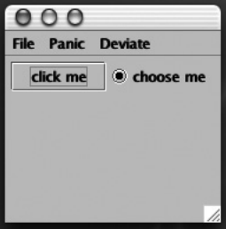
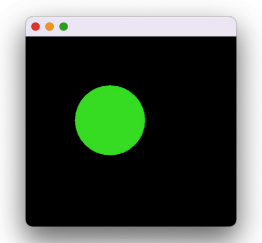
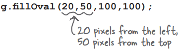
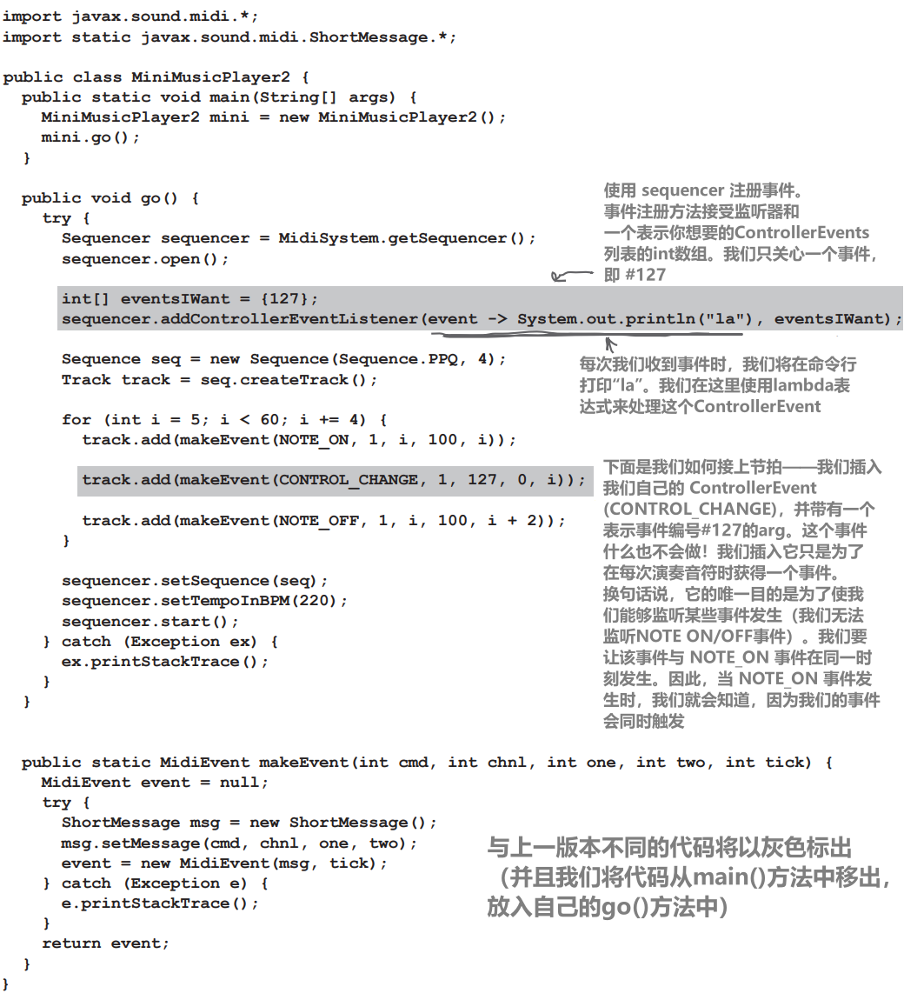

# 获取GUI

# 一切从一扇window开始

JFrame 是代表屏幕上窗口的对象。你可以在其中放置所有的界面元素，如按钮、复选框、文本字段等。它可以有一个包含菜单项的真正的菜单栏。其中包含菜单项。它还具有用于最小化、最大化和关闭窗口的所有小窗口图标，具体取决于你所在的平台

JFrame 的外观因平台而异。这是旧版 Mac OS X 上的 JFrame：


## 在窗口中放置部件（widgets）

一旦你有了一个 JFrame，你可以通过将它们添加到 JFrame 中来将小部件放入其中。你可以添加大量 Swing 组件；可以在 javax.swing 包中找到许多 Swing 组件。最常见的包括 JButton、JRadioButton、JCheckBox、JLabel、JList、JScrollPane、JSlider、JTextArea、JTextField 和 JTable。大多数组件使用起来都非常简单，但有些组件（如 JTable）可能比较复杂

## 制作 GUI 很简单：

1、创建一个框架（JFrame）

```java
JFrame frame = new JFrame();
```

2、制作一个部件（按钮、文本字段等）

```java
JButton button = new JButton("click me");
```

3、将部件添加到框架中

```java
frame.getContentPane().add(button);
```

你不能直接向框架添加内容。将框架视为窗口周围的装饰，然后在窗口窗格中添加内容

4、显示（确定大小并使其可见）

```java
frame.setSize(300,300);
frame.setVisible(true);
```

# 你的第一个GUI：框架上的按钮


```java
import javax.swing.*;
public class SimpleGui1 {
	public static void main(String[] args) {
		JFrame frame = new JFrame();
		JButton button = new JButton("click me");
		frame.setDefaultCloseOperation(JFrame.EXIT_ON_CLOSE);
		frame.getContentPane().add(button);
		frame.setSize(300, 300);
		frame.setVisible(true);
	}
}
```

看看运行的时候会发生什么：


哇哦 这个按钮真大！

按钮占满了框架的所有可用空间。稍后我们将学习如何控制按钮在框架上的位置和大小

# 但是当我点击的时候什么也没发生….

用户界面事件

这不完全正确。当你按下按钮时，它会显示 "按下" 或 "推入" 的样子（这取决于平台的外观和感觉，但它总是会在按下时做一些显示）

真正的问题是：“当用户点击按钮时，如何使按钮执行特定的操作？”

## 我们需要两样东西：

1、当用户点击时要调用的**方法**（你希望按钮点击后发生的事情）

2、一种**知道**何时触发该方法的方法。换句话说，一种知道用户何时点击按钮的方法！

当用户点击时，我们想知道。

我们对  user-takes-action-on-a-button 事件感兴趣

# 我听说现在已经没有人使用 Swing 了

还有其他选择，比如 JavaFX。但是，在 "应该使用哪种方法来制作 Java GUI？"这场无休止、持续不断的争论中，并没有明显的赢家。好消息是，如果你学习了一些 Swing 知识，那么无论最终选择哪种方法，这些知识都会对你有所帮助。例如，如果你想从事 Android 开发，学习 Swing 将使学习编写 Android 应用程序变得更容易

# 在 Windows 上运行时，按钮看起来会像 Windows 按钮吗？

如果你想的话。你可以从核心库中的一些 "外观和感觉" 类中进行选择，这些类可以控制界面的外观。在大多数情况下，你至少可以选择两种不同的外观。本书中的屏幕使用了多种“外观和感觉”，包括默认的系统外观和感觉（用于 macOS），OS X Aqua 外观和感觉，或者 Metal（跨平台）外观和感觉

# Aqua 是不是很老了？

是的，但我们喜欢

# 获取用户事件

想象一下，当用户按下按钮时，按钮上的文本从 click me 变成 I've been clicked。首先，我们可以编写一个方法来更改按钮上的文本（快速浏览一下 API 就能找到该方法）：

```java
public void changeIt() {
	button.setText("I've been clicked!");
}
```

但现在怎么办？我们如何知道该方法何时运行？我们如何知道按钮何时被点击？

在 Java 中，获取和处理用户事件的过程称为事件处理。Java 中有许多不同的事件类型，但大多数都涉及 GUI 用户操作。如果用户点击按钮，这就是一个事件。一个事件表示 "用户希望这个按钮的操作发生"。如果是一个 "放慢节奏" 按钮，用户希望发生放慢音乐节奏的操作。如果是聊天客户端上的 "发送" 按钮，用户希望发生 "发送我的信息" 的操作。因此，最直接的事件是用户单击按钮，表示他们希望执行某个操作

对于按钮，你通常不会关心任何中间事件，比如按钮正在被按下和按钮正在释放。你想对按钮说的是，"我不管用户怎么玩这个按钮，也不管他们把鼠标放在按钮上多长时间，也不管他们改变主意并在松手前滚动了多少次，等等。**只当用户认真的时候告诉我！** 换句话说，除非用户点击的方式表明他想要这个该死的按钮，否则不要调用我！”

**首先，按钮需要知道我们关心它**


**其次，按钮需要有一种方法，在发生 "点击" 事件时回调我们**

# 事件监听器（listener）

**如果你关心按钮的事件，那就实现一个 "我正在监听你的事件" 的接口**

**监听器接口是监听器 listener（你）和事件源 event source（按钮）之间的桥梁**

Swing GUI 组件是事件源。在 Java 中，事件源是一个对象，它可以将用户操作（点击鼠标、键盘输入、关闭窗口）转换为事件。就像 Java 中几乎所有其他东西一样，事件也是以对象的形式表示的。某个事件类的对象。如果你在 API 中浏览 java.awt.event 包，就会看到许多事件类（很容易认出——它们的名称中都有 Event）。你会发现 MouseEvent、KeyEvent、WindowEvent、ActionEvent 和其他一些事件类

事件源（如按钮）会在用户执行重要操作（如点击按钮）时创建一个事件对象。你编写的大部分代码（以及本书中的所有代码）都将接收事件，而不是创建事件。换句话说，你将把大部分时间花在事件监听器上，而不是事件源上

每种事件类型都有一个匹配的监听器接口。如果你想要 MouseEvents，就实现 MouseListener 接口。想要 WindowEvents？实现 WindowListener。你就明白了。记住你的接口规则——实现接口时，你必须声明你实现了该接口（class Dog implements Pet），这意味着你必须为接口中的每个方法编写实现方法

有些接口有不止一个方法，因为事件本身有不同的类型。例如，如果你实现了 MouseListener，你就可以获得 mousePressed、mouseReleased、mouseMoved 等事件。在接口中，每个鼠标事件都有一个单独的方法，即使它们都接收 MouseEvent。如果你实现了 MouseListener，当用户（你猜对了）按下鼠标时，将调用 mousePressed() 方法。当用户松开鼠标时，将调用 mouseReleased() 方法。因此，对于鼠标事件，只有一个事件对象 MouseEvent，但却有多个不同的事件方法，分别代表不同类型的鼠标事件

实现监听器接口后，按钮就有了回调的方法。接口是回调方法的声明位置

# listener 和 source 来源如何交流


## 监听器

如果你的类想知道按钮的 ActionEvents，你需要实现 ActionListener 接口。按钮需要知道你对它感兴趣，所以你通过调用它的 addActionListener(this) 并传递一个 ActionListener 引用来注册该按钮。在我们的第一个示例中，你是 ActionListener，所以你传递了 this，但更常见的做法是创建一个专门的类来监听事件。当事件发生时，按钮需要一种回调方式，因此它会调用监听器接口中的方法。作为 ActionListener，你必须实现该接口的唯一方法 actionPerformed()。编译器保证会这样做

## 事件源

按钮是 ActionEvents 的源，因此它必须知道哪些对象是感兴趣的监听器。按钮有一个 addActionListener() 方法，可以让感兴趣的对象（监听者）告诉按钮它们感兴趣

当按钮的 addActionListener() 方法运行时（因为潜在的监听器调用了该方法），按钮会获取param（监听器对象的引用）并将其存储在列表中。当用户点击按钮时，按钮通过调用列表中每个监听器的 actionPerformed() 方法来“触发”事件

# 获取按钮的 ActionEvent


```java
import javax.swing.*;
import java.awt.event.*;

public class SimpleGui2 implements ActionListener {
	private JButton button;
	
	public static void main(String[] args) {
		SimpleGui2 gui = new SimpleGui2();
		gui.go();
	}

	public void go() {
		JFrame frame = new JFrame();
		button = new JButton("click me");

		button.addActionListener(this);

		frame.getContentPane().add(button);
		frame.setDefaultCloseOperation(JFrame.EXIT_ON_CLOSE);
		frame.setSize(300, 300);
		frame.setVisible(true);
	}
 
	public void actionPerformed(ActionEvent event) {
		button.setText("I've been clicked!");
	}
}
```

# Listeners, Sources, and Events

在你辉煌的 Java 生涯中，你大部分时间都不会成为事件的源头

(无论你多么幻想自己是社交宇宙的中心）

习惯就好。你的工作就是做一个好的倾听者。(如果你真心实意地去做，就能改善你的社交生活）

## Listener GETS the event

作为一名监听器，我的工作就是**实现（implement）** 接口、**注册（register）** 按钮并提供事件处理

## Source SENDS the event

<div style="overflow: hidden;">
  <div style="float: left; width: 50%;">
    作为事件源，我的工作是接受（来自监听器的）注册，从用户处获取事件，并调用监听器的事件处理方法（当用户点击我时）
  </div>
  <div style="float: right; width: 50%; text-align: right;">
    
  </div>
</div></br>

## Event object HOLDS DATA about the event

<div style="overflow: hidden;">
  <div style="float: left; width: 50%;">
    嘿，那我呢？我也是一个参与者，你知道的！作为一个事件对象，我是事件回调方法（来自接口）的arg，我的工作是将事件数据传回监听器
  </div>
  <div style="float: right; width: 50%; text-align: right;">
    
  </div>
</div></br>

# 为什么我不能成为事件源？

你可以。我们刚刚说过，你更多时候会是事件的接收者而不是发起者（至少在你辉煌的 Java 职业生涯的早期是这样）。你可能关心的大多数事件都是由 Java API 中的类“触发”的，你所要做的就是成为它们的监听器。但是，你可能会设计需要自定义事件的程序，例如，当你的股票市场观察应用程序发现它认为发现重要信息时抛出 `StockMarketEvent`。在这种情况下，你可以将 `StockWatcher` 对象作为一个事件源，然后做与按钮（或任何其他事件源）相同的事情——为自定义事件创建一个监听器接口，提供一个注册方法（`addStockListener()`），当有人调用该方法时，将调用者（监听器）添加到监听器列表中。然后，当股票事件发生时，实例化一个 `StockEvent` 对象（另一个你将编写的类），并通过调用它们的 `stockChanged(StockEvent ev)` 方法将其发送给你的列表中的监听器。不要忘记，对于每种事件类型，必须有一个匹配的监听器接口（因此你将创建一个带有 `stockChanged()` 方法的 `StockListener` 接口）

# 我不知道传递给事件回调方法的事件对象有多重要。如果有人调用我的 mousePressed 方法，我还需要什么其他信息？

很多时候，对于大多数设计来说，你并不需要事件对象。它只不过是一个小小的数据载体，用来发送有关事件的更多信息。但有时你可能需要查询事件，以了解事件的具体细节。例如，如果调用了 `mousePressed()` 方法，你就知道鼠标被按下了。但如果你想知道鼠标被按下的具体位置呢？换句话说，如果你想知道鼠标被按下的 X 和 Y 屏幕坐标呢？

有时，你可能想在多个对象上注册同一个监听器。例如，屏幕上的计算器有 10 个数字键，由于它们做的都是同样的事情，你可能不想为每个键都制作一个单独的监听器。相反，你可以将一个监听器注册到这 10 个键中的每一个上，当你收到事件时（因为你的事件回调方法被调用），你可以调用事件对象上的一个方法来找出真正的事件源。换句话说，是哪个键发送了这个事件

# 如何知道一个对象是否是事件源？

查看 API

# 好的。找什么？

寻找以“add”开头，以“Listener”结尾，并接受监听器接口 arg 的方法。如果你看到：`addKeyListener(KeyListener k)`，你就知道有这个方法的类是 KeyEvents 的源。这是一种命名模式

# 回到图形...

现在我们对事件的工作原理有了一些了解（稍后我们将学习更多），让我们回到在屏幕上显示图形的工作中来。在回到事件处理之前，我们将花几分钟来玩一些有趣的图形方式

在图形用户界面上放置东西的三种方法：

## 1、在框架上放置部件

添加按钮、菜单、单选按钮等

```java
frame.getContentPane().add(myButton);
```



javax.swing 软件包有十多种 widget 类型

## 2、在 widget 上绘制 2D 图形

使用图形对象绘制图形

```java
graphics.fillOval(70,70,100,100);
```


除了方框和圆形，你还可以绘制更多的图形；Java2D API 中有很多有趣、复杂的图形方法

## 3、在 widget 上放置 JPEG

你可以在 widget 上放置自己的图片

```java
graphics.drawImage(myPic,10,10,this);
```


# 制作绘图面板

制作自己的绘图小部件

如果你想在屏幕上显示自己的图形，最好的办法就是制作自己的可绘画部件。就像按钮或其他小部件一样，你可以把小部件放在框架上，但当它显示出来时，上面就会有你的图片。你甚至可以让这些图像动起来，做成动画，或者在每次点击按钮时让屏幕上的颜色发生变化

这简直易如反掌

**创建一个 JPanel 的子类并重写一个方法，`paintComponent()`**

你所有的图形代码都将在 paintComponent() 方法中完成。把 paintComponent() 方法看作是系统调用的方法，系统会说："嘿，小部件，该给自己画画了"。如果你想画一个圆，paintComponent() 方法就会包含画圆的代码。当包含你的绘图面板的框架显示时，paintComponent() 被调用，然后你的圆就会出现。如果用户将窗口图标化/最小化，JVM 知道框架在去图标化时需要 "修复"，因此会再次调用 paintComponent()。只要 JVM 认为显示需要刷新，就会调用 paintComponent() 方法

还有一点，你永远不要自己调用这个方法！该方法的 arg（一个 Graphics 对象）是实际的绘图画布，会被贴到真实显示屏上。你不能自己得到它，它必须由系统交给你。不过，稍后你将看到，你可以要求系统刷新显示屏（`repaint()`），这最终会导致调用 paintComponent()


```java
import javax.swing.*;
import java.awt.*;

class MyDrawPanel extends JPanel {
	 public void paintComponent(Graphics g) {
		 g.setColor(Color.orange);
		 g.fillRect(20, 50, 100, 100);
	 }
}
```


# 在 paintComponent() 中进行的有趣操作

在 paintComponent() 中有更多有趣的事情可以做。不过，最有趣的还是你自己开始试验的时候。试着调整数字，查看 Graphics 类的 API（稍后我们会看到除了 Graphics 类中的内容外，还有更多你可以做的事情）

## 显示JPEG


```java
public void paintComponent(Graphics g) {
	Image image = new ImageIcon("catzilla.jpg").getImage();
	g.drawImage(image, 3, 4, this);
}
```

## 在黑色背景上画一个随机着色的圆圈


```java
public void paintComponent(Graphics g) {

	g.fillRect(0, 0, this.getWidth(), this.getHeight());

	Random random = new Random();
	int red = random.nextInt(256);
	int green = random.nextInt(256);
	int blue = random.nextInt(256);

	Color randomColor = new Color(red, green, blue);
	g.setColor(randomColor);
	g.fillOval(70, 70, 100, 100);
}
```



# 每个好的 Graphics 参考背后都有一个 Graphics2D 对象

使用 Graphics2D 绘制渐变

`paintComponent()` 的 arg 被声明为 Graphics 类型（java.awt.Graphics）

```java
public void paintComponent(Graphics g) { }
```

所以param “g” IS-A Graphics对象。这意味着它可能是 Graphics 的子类（因为存在多态性）。事实上，它就是

**被“g”参数引用的对象实际上是 `Graphics2D` 类的一个实例**

为什么要关心这个问题？因为有些事情你可以用 `Graphics2D` 引用做，而`Graphics` 引用做不到。Graphics2D 对象比 Graphics 对象能做更多的事情，而且在 Graphics 引用的背后隐藏着一个真正的 Graphics2D 对象

请记住你的多态性。编译器会根据引用类型而不是对象类型来决定你可以调用哪些方法。如果一个 Dog 对象被一个 Animal 引用变量引用，那么：

`Animal a = new Dog();`

你不能说：

`a.bark();`

即使你知道它后面确实是一只狗。编译器会查看 "a"，发现它属于 Animal 类型，发现Animal类中没有bark()的遥控按钮。但你仍然可以把对象转回它实际上的Dog：

```java
Dog d = (Dog) a;
d.bark();
```

所以关于Graphics对象的底线是：

**如果需要使用 Graphics2D 类中的方法，你不能直接使用paintComponent param（“g”）中的方法。但你可以用一个新的 Graphics2D 变量对它进行转换：**

```java
Graphics2D g2d = (Graphics2D) g;
```

## 调用Graphics引用的方法：

```java
drawImage()
drawLine()
drawPolygon
drawRect()
drawOval()
fillRect()
fillRoundRect()
setColor()
```

## 将 Graphics2D 对象转换为 Graphics2D 引用：

```java
Graphics2D g2d = (Graphics2D) g;
```

## 可以在 Graphics2D 引用上调用的方法：

```java
fill3DRect()
draw3DRect()
rotate()
scale()
shear()
transform()
setRenderingHints()
```

(这些并不是完整的方法列表，更多信息请查看 API）

# 因为生命太短暂，当有渐变色等着你时，就没有必要只给圆涂上纯色了


这个方法和上面的方法一样，只不过它为渐变的起始色和终止色添加了随机颜色。试试看

```java
 public void paintComponent(Graphics g) {
	 Graphics2D g2d = (Graphics2D) g;
 
	 Random random = new Random();
	 int red = random.nextInt(256);
	 int green = random.nextInt(256);
	 int blue = random.nextInt(256);
	 Color startColor = new Color(red, green, blue);
 
	 red = random.nextInt(256);
	 green = random.nextInt(256);
	 blue = random.nextInt(256);
	 Color endColor = new Color(red, green, blue);
 
	 GradientPaint gradient = new GradientPaint(70, 70, startColor, 150, 150, endColor);
	 g2d.setPaint(gradient);
	 g2d.fillOval(70, 70, 100, 100);
 }
```

# 我们能够获得一个事件，我们能够绘制图形。但是，我们能在获得事件时绘制图形吗？

让我们将事件与绘图面板中的变化挂钩。每次点击按钮时，我们都会让圆改变颜色。程序流程如下：


# GUI布局：在一个框架上放置多个部件

我们将在下一章介绍 GUI 布局，但在这里我们将做一个快速学习，让你快速上手。默认情况下，一个框架有五个区域可以添加部件。你只能在框架的每个区域添加一样东西，但不要惊慌！这一个内容可以是一个面板，它包含另外三个内容，包括一个面板，其中又包含了两个内容，依此类推......你懂的。事实上，我们在框架中添加按钮时是在 "作弊"：


## 每次点击按钮，圆圈都会变色


```java
import javax.swing.*;
import java.awt.*;
import java.awt.event.*;
public class SimpleGui3 implements ActionListener {
    private JFrame frame;
    
    public static void main(String[] args) {
        SimpleGui3 gui = new SimpleGui3();
        gui.go();
    }
    
    public void go() {
        frame = new JFrame();
        frame.setDefaultCloseOperation(JFrame.EXIT_ON_CLOSE);
        
        JButton button = new JButton("Change colors");
        button.addActionListener(this);
        
        MyDrawPanel drawPanel = new MyDrawPanel();
        frame.getContentPane().add(BorderLayout.SOUTH, button);
        frame.getContentPane().add(BorderLayout.CENTER, drawPanel);
        frame.setSize(300, 300);
        frame.setVisible(true);
    }
    
    public void actionPerformed(ActionEvent event) {
        frame.repaint();
    }
}
```

```java
import javax.swing.*;
import java.awt.*;
import java.util.Random;

class MyDrawPanel extends JPanel {
    public void paintComponent(Graphics g) {
		// Code to fill the oval with a random color
		// See page 365 for the code](https://www.notion.so/GUI-33bb3ac0fa1246cf86d213ce40f6cc68?pvs=21)
    }
}
```

# 让我们用两个按钮试试看

多个监听器

南边的按钮将像现在一样，简单地在框架上调用repaint。第二个按钮（我们将把它放在东边区域）将更改标签上的文字。(标签就是屏幕上的文字）

**因此，我们现在需要四个部件**


**我们需要获取两个事件**

啊哦。这可能吗？如果只有一个 `actionPerformed()` 方法，如何获取两个事件？


## 当每个按钮都需要执行不同的操作时，如何为两个不同的按钮获取操作事件？

### 选项一  实施两个 actionPerformed() 方法


缺陷：不能！不能在一个 Java 类中实现同一个方法两次。它将无法编译。即使可以，事件源又怎么知道要调用这两个方法中的哪个呢？

### 选项二 将相同的监听器注册到两个按钮上


缺陷：虽然这样做是可行的，但在大多数情况下并不是很面向对象。一个事件处理程序要做许多不同的事情，这意味着你要用一个方法做许多不同的事情。如果你需要改变一个源的处理方式，你就不得不搞乱每个人的事件处理程序。有时这是一个很好的解决方案，但通常会损害可维护性和可扩展性

### 选项三 创建两个独立的 ActionListener 类


缺陷：这些类无法访问它们需要操作的变量 "frame" 和 "label"。你可以解决这个问题，但你必须给每个监听器类一个指向主 GUI 类的引用，这样监听器就可以在 `actionPerformed()` 方法中使用 GUI 类的引用来访问 GUI 类的变量。但这样会破坏封装，所以我们可能需要为GUI部件添加getter方法（getFrame()，getLabel()等）。你可能还需要在监听器类中添加一个构造函数，以便在监听器实例化时将 GUI 引用传递给监听器。这样一来，事情就变得越来越复杂了

一定有更好的方法！

# 内部类拯救！

你可以让一个类嵌套在另一个类中。这很简单。只需确保内层类的定义位于外层类的大括号内


内部类获得特殊权限来使用外部类的东西，即使是私有的东西。内部类可以使用外部类的私有变量和方法，就好像这些变量和成员是在内部类中定义的一样。这就是内层类的方便之处——它们拥有普通类的大部分优点，但有特殊的访问权限


**内部类可以使用外部类的所有方法和变量，甚至包括私有变量**

**内部类可以使用这些变量和方法，就好像这些方法和变量是在内部类中声明的一样**

# 内部类实例必须与外部类实例绑定*

记住，当我们谈论内部类访问外部类中的某些内容时，实际上我们谈论的是内部类的实例访问外部类实例中的某些内容。但是是哪个实例呢？

内部类的任意实例都能访问外部类任意实例的方法和变量吗？不能！

**内部对象必须与堆上的特定外部对象绑定**

**内部对象与外部对象之间有一种特殊的联系**


> *有一个例外情况，非常特殊——在静态方法中定义的内部类。但我们不会涉及到这一点，你可能在整个Java生涯中从未遇到过这种情况
> 

# 如何创建内部类实例

内部类实例

如果从外部类中的代码实例化内部类，则外部类的实例将与内部对象“绑定”。例如，如果方法中的代码实例化了内部类，内部对象就会与方法正在运行的实例绑定

外部类中的代码可以实例化其自己的内部类，与实例化任何其他类的方式完全相同...... **`new MyInner()`**

<div style="overflow: hidden;">
  <div style="float: left; width: 65%;">
    
  </div>
  <div style="float: right; width: 35%; text-align: right;">
    
  </div>
</div></br>

## 其他选项

你可以从外部类之外运行的代码中实例化一个内部实例，但必须使用特殊的语法。在你的整个 Java 生活中，你可能永远都不需要从外部创建一个内部类，但万一你有兴趣的话...…


## 现在我们可以让这个双按钮代码工作了


```java
import javax.swing.*;
import java.awt.*;
import java.awt.event.ActionListener;
import java.awt.event.ActionEvent;

public class TwoButtons {
    private JFrame frame;
    private JLabel label;
    
    public static void main(String[] args) {
        TwoButtons gui = new TwoButtons();
        gui.go();
    }
    public void go() {
        frame = new JFrame();
        frame.setDefaultCloseOperation(JFrame.EXIT_ON_CLOSE);
		
        JButton labelButton = new JButton("Change Label");
        labelButton.addActionListener(new LabelListener());
		
        JButton colorButton = new JButton("Change Circle");
        colorButton.addActionListener(new ColorListener());
		
        label = new JLabel("I’m a label");
        MyDrawPanel drawPanel = new MyDrawPanel();
		
        frame.getContentPane().add(BorderLayout.SOUTH, colorButton);
        frame.getContentPane().add(BorderLayout.CENTER, drawPanel);
        frame.getContentPane().add(BorderLayout.EAST, labelButton);
        frame.getContentPane().add(BorderLayout.WEST, label);
		
        frame.setSize(500, 400);
        frame.setVisible(true);
    }
	
    class LabelListener implements ActionListener {
        public void actionPerformed(ActionEvent event) {
            label.setText("Ouch!");
        }
    }
	
    class ColorListener implements ActionListener {
        public void actionPerformed(ActionEvent event) {
            frame.repaint();
        }
    }
}
```

一般的java类只能 implement 一个接口，但是有内部类之后，一个内部类可以实现多个接口或者多次实现同一个接口

每当需要一个单独的类，但仍然希望该类的行为就像它是另一个类的一部分一样，内部类是最好的（有时是唯一的）方法

我在这里仍然很困惑。如果你想让内部类表现得像它属于外部类，为什么首先要有一个单独的类呢？为什么内部类代码一开始就不在外部类中呢？

即使不使用一个接口的多个实现，也可能需要两个不同的类，因为这些类代表两种不同的东西。这是良好的面向对象设计

我认为OO设计的很大一部分是关于重用和维护的。你知道，如果你有两个单独的类，它们可以分别被修改和独立使用，而不是把它们都塞进一个类中。最终你还是只用了一个真正的类，对吧？封闭类是唯一一个可重用且与其他所有类分开的类。内部类并不完全可重用。实际上，我听说过它们被称为“无法重用——一遍又一遍无用”

是的，内部类确实不是可重用的，事实上有时根本不可重用，因为它与外部类的实例变量和方法密切相关。但是它——

——这只能证明我的观点！如果它们不可重用，为什么还要费心使用单独的类呢？我的意思是，除了接口问题，听起来像是一种变通方法

正如我所说，需要考虑 IS-A 和多态性

因为外部类和内部类可能需要通过不同的 IS-A 测试！我们从多态的GUI监听器示按钮的监听器注册方法的声明 arg 类型来看，必须传递一个监听器给 addActionListener()方法，在这种情况下，要实现特定的监听器接口，比如ActionListener

在多态上，你有一个只采用一种特定类型的方法。通过 ActionListener 的 IS-A 测试的内容。但是，这是一件大事，如果你的类需要是类类型而不是接口的 IS-A，该怎么办？

你不会让你的类仅拓展你需要成为其中一部分的类？这难道不是子类工作的全部意义吗？如果 B 是 A 的子类，那么任何需要 A 的地方都可以使用 B。整个 pass-a-Dog-where-an-Animal-is-the-declared-type 的东西

是的！ bingo！那么，现在如果你需要通过两个不同类的 IS-A 测试，会发生什么？不在同一继承层次结构中的类？

内部对象可以实现多个接口，但只能扩展一个类。在类类型方面，只能是一种 IS-A，不能既是 Dog 又是 Button。但如果是一只 Dog，有时需要成为一个 Button（以便将自己传递给需要 Button 的方法），那么 Dog 类（它扩展了 Animal，因此不能扩展 Button）可以有一个内部类，通过扩展 Button 来代表 Dog 充当 Button，这样，在需要 Button 的地方，Dog 就可以传递他的内部 Button 而不是他自己。换句话说，Dog 对象调用 x.takeButton(this)，而不是 `x.takeButton(new MyInnerButton())`

绘图面板，我们在其中创建了自己的 JPanel 子类。现在，该类是一个独立的、非内部类。这很好，因为该类不需要对主 GUI 的实例变量进行特殊访问。但如果需要呢？如果我们在面板上做动画，它的坐标来自主应用程序（比如，基于用户在GUI其他地方的操作）。在这种情况下，如果我们将绘制面板设置为内部类，那么绘制面板类就会成为 JPanel 的子类，而外层类仍然可以自由地成为其他类的子类

绘图面板并不足以成为一个独立的类，因为它实际上是专门为这一个GUI应用程序而绘制的

外部实例可以同时与多个内部对象绑定

如果外部类有三个按钮，它就需要三个不同的内部类（因此需要三个不同的内部类对象）来处理事件

现在大部分使用 lambda 替代内部类

# 救命的 Lambdas！（再次）


解释这两行突出显示的代码的一种方法是

“当 labelButton ActionListener 收到事件时，setText("Ouch");”

不仅这两个想法在代码中相互分离，内部类还需要五行代码才能调用 setText 方法。当然，我们所说的关于 labelButton 代码的所有内容同样适用于 colorButton 代码

还记得几页前我们说过，为了实现 ActionListener 接口，你必须为其 actionPerformed 方法提供代码吗？嗯...这是否让你想起了什么？

ActionListener 是一个函数式接口

请记住，lambda 为函数式接口的唯一抽象方法提供了一个实现

既然 ActionListener 是一个函数式接口，那么我们就可以用 lambda 表达式替换上一页中的内部类


**lambdas，更清晰、更简洁**

好吧，也许还没有，但一旦你习惯了阅读 lambdas，我们相信你会同意它们能让你的代码更清晰

# 使用内部类制作动画

我们已经了解了为什么内部类可以方便地用于事件监听器，因为你可以多次实现相同的事件处理方法。现在我们来看看，当内部类用作外部类没有扩展的子类时，它有多大用处。换句话说，当外部类和内部类处于不同的继承树中时，内层类有多大用处！

我们的目标是制作一个简单的动画，让圆在屏幕上从左上方向右下方移动


## 简单动画的工作原理

1、在特定的 x 和 y 坐标处绘制一个对象



2、在不同的 x 和 y 坐标重新绘制对象


3、重复上一步，改变 x 坐标和 y 坐标值，动画要持续多久就持续多久

# 我们为什么要在这里学习动画？我怀疑我是否会制作游戏

你可能不会制作游戏，但你可能会制作模拟，让事物随着时间的推移而变化，以显示过程的结果。或者，你可能会制作一个可视化工具，例如，通过更新图形来显示程序正在使用多少内存，或者向你显示有多少流量通过你的负载均衡服务器。任何需要将一组持续变化的数字转化为有用的东西，以便从这些数字中获取信息。听起来是不是很商业化？当然，这只是 “官方理由”。我们在这里介绍它的真正原因，只是因为它是一种简单的方法，可以在任何情况下使用

# 我们真正想要的是类似于以下的东西...


# 完整的简单动画代码

使用内部类的动画


## 它起作用了吗？

可能无法获得预期的流畅动画效果

我们做错了什么？

在 paintComponent() 方法中有一个小缺陷

**我们需要擦除已经存在的东西！否则我们可能会得到拖尾效果**


要修复它，我们只需在每次绘制圆之前用背景色填充整个面板即可。下面的代码在方法的开头添加了两行：一行用于将颜色设置为白色（绘图面板的背景色），另一行用于将该颜色填充整个面板矩形。简单来说，下面的代码说，“从x和y的0开始填充一个矩形（左侧0像素，顶部0像素），使其宽度和高度与当前面板相同。”


```java
import javax.swing.*;
import java.awt.*;
import java.util.concurrent.TimeUnit;

public class SimpleAnimation {
    private int xPos = 70;
    private int yPos = 70;
	
    public static void main(String[] args) {
        SimpleAnimation gui = new SimpleAnimation();
        gui.go();
    }
	
    public void go() {
        JFrame frame = new JFrame();
        frame.setDefaultCloseOperation(JFrame.EXIT_ON_CLOSE);
		
        MyDrawPanel drawPanel = new MyDrawPanel();
		
        frame.getContentPane().add(drawPanel);
        frame.setSize(300, 300);
        frame.setVisible(true);
		
        for (int i = 0; i < 130; i++) {
            xPos++;
            yPos++;
			
            drawPanel.repaint();
			
            try {
                TimeUnit.MILLISECONDS.sleep(50);
            } catch (Exception e) {
                e.printStackTrace();
            }
        }
    }
    class MyDrawPanel extends JPanel {
        public void paintComponent(Graphics g) {
            g.setColor(Color.white);
            g.fillRect(0, 0, this.getWidth(), this.getHeight());
			
            g.setColor(Color.green);
            g.fillOval(xPos, yPos, 40, 40);
        }
    }
}
```

让我们来制作一段音乐视频。我们将使用 Java 生成的随机图形来配合音乐节拍。在这个过程中，我们将注册（并监听）一种新的非图形用户界面事件，由音乐本身触发。 第一拍 第二拍 第三拍 第四拍 ... 

记住，这部分都是可选的。但我们认为这对你有好处。而且你会喜欢的。而且你可以用它来给人留下深刻的印象。（好吧，当然，它可能只对那些容易被打动的人有效，但还是……）

# 监听非 GUI 事件

好吧，也许不是音乐视频，但我们将制作一个程序，随着音乐节拍在屏幕上随机绘制图形。简而言之，程序会监听音乐节拍，并在每一拍中随机绘制一个矩形图形

这给我们带来了一些新问题。到目前为止，我们只监听 GUI 事件，但现在我们需要监听特定类型的 MIDI 事件。原来，监听非 GUI 事件就像监听 GUI 事件一样：实现一个监听器接口，将监听器注册到事件源，然后坐等事件源调用事件处理方法（监听器接口定义的方法）

监听音乐节拍的最简单方法是注册并监听实际的 MIDI 事件，这样只要 sequencer 收到事件，我们的代码也会收到，并能绘制图形。但是......有一个问题。实际上是一个bug， 它不会让我们监听我们正在制作的MIDI事件（NOTE ON的事件）

因此，我们必须做一点变通。我们可以监听另一种类型的 MIDI 事件，称为ControllerEvent。我们的解决方案是注册 ControllerEvents，然后确保每一个 NOTE ON 事件都会在同一 "节拍" 触发一个匹配的 ControllerEvent。如何确保 ControllerEvent 在同一时间触发？我们将其添加到音轨中，就像添加其他事件一样！换句话说，我们的音乐序列是这样的：

第一拍 - NOTE ON，CONTROLLER EVENT

第二拍 - NOTE OFF

第三拍 - NOTE ON，CONTROLLER EVENT

第四拍 - NOTE OFF

以此类推

在我们深入了解整个程序之前，让我们先让制作和添加 MIDI 信息/事件变得更容易一些，因为在这个程序中，我们要制作大量的 MIDI 信息/事件

## 音乐艺术程序需要做的事情：

1、创建一系列 MIDI 信息/事件，在钢琴（或你选择的任何乐器）上播放随机音符

2、为事件注册一个监听器

3、启动 sequencer 进行播放

4、每当监听器的事件处理方法被调用时，在绘图面板上绘制一个随机矩形，并调用repaint方法

## 我们将分三次迭代构建它：

1、版本一：简化制作和添加 MIDI 事件的代码，因为我们将制作大量的 MIDI 事件

2、版本二： 注册和监听事件，但不带图形。每个节拍在命令行打印一条信息

3、版本三： 真正的版本。在第二版的基础上增加了图形

# 制作信息/事件的简便方法

事件的实用方法

目前，在音轨中制作和添加信息和事件非常繁琐。对于每条消息，我们都必须创建消息实例（本例中为 ShortMessage）、调用 setMessage()、为消息创建 MidiEvent 并将事件添加到音轨。在前一章的代码中，我们为每个消息执行了每个步骤。这意味着仅仅为了播放一个音符然后停止播放就需要八行代码！四行代码来添加NOTE ON事件，四行代码来添加NOTE OFF事件

```java
ShortMessage msg1 = new ShortMessage();
msg1.setMessage(NOTE_ON, 1, 44, 100);
MidiEvent noteOn = new MidiEvent(msg1, 1);
track.add(noteOn);

ShortMessage msg2 = new ShortMessage();
msg2.setMessage(NOTE_OFF, 1, 44, 100);
MidiEvent noteOff = new MidiEvent(msg2, 16);
track.add(noteOff);
```

## 每个事件必须发生的事情：

1、创建一个消息实例

2、使用说明调用 setMessage()

3、为信息创建一个 MidiEvent 实例

4、将事件添加到音轨

## 让我们创建一个静态实用程序方法，制作一条 message 并返回一个 MidiEvent


# 版本一：使用新的静态 makeEvent() 方法

这里没有事件处理或图形，只有 15 个音符的序列，沿着音阶上升。这段代码的目的只是为了学习如何使用新的 makeEvent() 方法。由于有了这个方法，下两个版本的代码要简短得多，也更简单


```java
import javax.sound.midi.*;
import static javax.sound.midi.ShortMessage.*;

public class MiniMusicPlayer1 {
    public static void main(String[] args) {
        try {
            Sequencer sequencer = MidiSystem.getSequencer();
            sequencer.open();
            
            Sequence seq = new Sequence(Sequence.PPQ, 4);
            Track track = seq.createTrack();
            
            for (int i = 5; i < 61; i += 4) {
                track.add(makeEvent(NOTE_ON, 1, i, 100, i));
                track.add(makeEvent(NOTE_OFF, 1, i, 100, i + 2));
            }
            
            sequencer.setSequence(seq);
            sequencer.setTempoInBPM(220);
            sequencer.start();
        } catch (Exception ex) {
            ex.printStackTrace();
        }
    }
    
    public static MidiEvent makeEvent(int cmd, int chnl, int one, int two, int tick) {
        MidiEvent event = null;
        try {
            ShortMessage msg = new ShortMessage();
            msg.setMessage(cmd, chnl, one, two);
            event = new MidiEvent(msg, tick);
        } catch (Exception e) {
            e.printStackTrace();
        }
        return event;
    }
}
```

# 版本二：注册和获取 ControllerEvents



```java
import javax.sound.midi.*;
import static javax.sound.midi.ShortMessage.*;

public class MiniMusicPlayer2 {
    public static void main(String[] args) {
        MiniMusicPlayer2 mini = new MiniMusicPlayer2();
        mini.go();
    }
    
    public void go() {
        try {
            Sequencer sequencer = MidiSystem.getSequencer();
            sequencer.open();
            
            int[] eventsIWant = {127};
            sequencer.addControllerEventListener(event -> System.out.println("la"), eventsIWant);
            
            Sequence seq = new Sequence(Sequence.PPQ, 4);
            Track track = seq.createTrack();
            
            for (int i = 5; i < 60; i += 4) {
                track.add(makeEvent(NOTE_ON, 1, i, 100, i));
                
                track.add(makeEvent(CONTROL_CHANGE, 1, 127, 0, i));
                
                track.add(makeEvent(NOTE_OFF, 1, i, 100, i + 2));
            }
            
            sequencer.setSequence(seq);
            sequencer.setTempoInBPM(220);
            sequencer.start();
        } catch (Exception ex) {
            ex.printStackTrace();
        }
    }
    
    public static MidiEvent makeEvent(int cmd, int chnl, int one, int two, int tick) {
        MidiEvent event = null;
        try {
            ShortMessage msg = new ShortMessage();
            msg.setMessage(cmd, chnl, one, two);
            event = new MidiEvent(msg, tick);
        } catch (Exception e) {
            e.printStackTrace();
        }
        return event;
    }
}
```

# 版本三：随音乐绘制图形

这个最终版本在第二版的基础上增加了 GUI 部分。我们构建了一个框架，并在其中添加了一个绘图面板，每当收到一个事件，我们就会绘制一个新的矩形并重新绘制屏幕

与第二版相比，唯一的其他变化是音符会随机播放，而不是简单地沿着音阶上升。代码中最重要的变化（除了构建一个简单的 GUI 外）是我们让绘图面板实现了 ControllerEventListener，而不是程序本身。这样，当绘图面板（一个内部类）收到事件时，它就知道如何通过绘制矩形来处理自己

下一页是该版本的完整代码

绘图面板内部类：


完整代码

```java
import javax.sound.midi.*;
import javax.swing.*;
import java.awt.*;
import java.util.Random;

import static javax.sound.midi.ShortMessage.*;

public class MiniMusicPlayer3 {
    private MyDrawPanel panel;
    private Random random = new Random();
    
    public static void main(String[] args) {
        MiniMusicPlayer3 mini = new MiniMusicPlayer3();
        mini.go();
    }
    
    public void setUpGui() {
        JFrame frame = new JFrame("My First Music Video");
        panel = new MyDrawPanel();
        frame.setContentPane(panel);
        frame.setBounds(30, 30, 300, 300);
        frame.setVisible(true);
    }
    
    public void go() {
        setUpGui();
        
        try {
            Sequencer sequencer = MidiSystem.getSequencer();
            sequencer.open();
            sequencer.addControllerEventListener(panel, new int[] {127});
            Sequence seq = new Sequence(Sequence.PPQ, 4);
            Track track = seq.createTrack();
            
            int note;
            for (int i = 0; i < 60; i += 4) {
                note = random.nextInt(50) + 1;
                track.add(makeEvent(NOTE_ON, 1, note, 100, i));
                track.add(makeEvent(CONTROL_CHANGE, 1, 127, 0, i));
                track.add(makeEvent(NOTE_OFF, 1, note, 100, i + 2));
            }
            
            sequencer.setSequence(seq);
            sequencer.start();
            sequencer.setTempoInBPM(120);
        } catch (Exception ex) {
            ex.printStackTrace();
        }
    }
    
    public static MidiEvent makeEvent(int cmd, int chnl, int one, int two, int tick) {
        MidiEvent event = null;
        try {
            ShortMessage msg = new ShortMessage();
            msg.setMessage(cmd, chnl, one, two);
            event = new MidiEvent(msg, tick);
        } catch (Exception e) {
            e.printStackTrace();
        }
        return event;
    }
    
    class MyDrawPanel extends JPanel implements ControllerEventListener {
        private boolean msg = false;
        public void controlChange(ShortMessage event) {
            msg = true;
            repaint();
        }
        
        public void paintComponent(Graphics g) {
            if (msg) {
                int r = random.nextInt(250);
                int gr = random.nextInt(250);
                int b = random.nextInt(250);
                
                g.setColor(new Color(r, gr, b));
                
                int height = random.nextInt(120) + 10;
                int width = random.nextInt(120) + 10;
                
                int xPos = random.nextInt(40) + 10;
                int yPos = random.nextInt(40) + 10;
                
                g.fillRect(xPos, yPos, width, height);
                msg = false;
            }
        }
    }
}

```