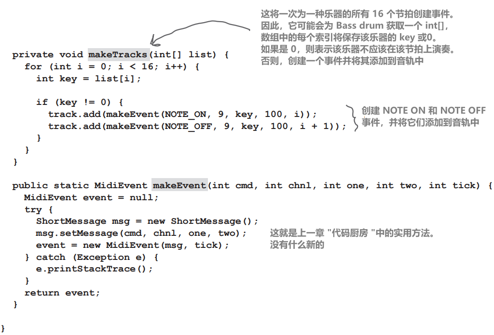

# Swing 组件

组件和容器

组件（Component）是我们一直称之为小部件（widget）的更正确的术语。你放在 GUI 中的东西。用户看到并与之交互的东西。文本字段（Text fields）、按钮、可滚动列表（scrollable lists）、单选按钮等都是组件。事实上，它们都扩展了 `javax.swing.JComponent`

**组件可以嵌套**

在 Swing 中，几乎所有组件都能容纳其他组件。换句话说，你可以把任何东西嵌套到其他任何东西中。但大多数情况下,你会将按钮和列表等用户交互组件添加到框架和面板等背景组件（通常称为容器）中。虽然也可以把面板放在按钮里，但这样做很奇怪，也不会赢得任何可用性奖项

除了 JFrame 之外，交互式组件和背景组件之间的区别是人为的。例如，JPanel 通常用作分组其他组件的背景，但即使是 JPanel 也可以是交互式的。与其他组件一样，你可以注册 JPanel 的事件，包括鼠标点击和按键

**从技术上讲，Widget 是一种 Swing 组件。几乎所有你可以放入GUI中的东西都是从`javax.swing.JComponent`扩展而来的**


> 常见的 Java GUI 编程的组织方式：
> 

> **JFrame**:
> 
> - **`JFrame`** 是顶级窗口，它提供了应用程序的主要框架
> - 在 **`JFrame`** 中，通常包含了整个应用程序的主要布局和功能
> - **`JFrame`** 可以包含多个 **`JPanel`**，以及其他的 GUI 组件，如按钮、文本框等

> **JPanel**:
> 
> - **`JPanel`** 是一个容器，用于组织和管理其他 GUI 组件
> - 在 **`JPanel`** 中，可以添加和布置多个 GUI 组件，以便实现复杂的布局和功能
> - **`JPanel`** 可以嵌套在 **`JFrame`** 中，也可以作为其他 **`JPanel`** 的子容器，以实现更复杂的 GUI 布局

> 在这种方式下，**`JFrame`** 提供了应用程序的整体框架和主窗口，而 **`JPanel`** 负责大块的布局，以及管理和组织其他 GUI 组件
>

# 布局管理器

布局管理器是一个与特定组件关联的 Java 对象，几乎总是一个后台组件。布局管理器控制与其关联的组件中包含的组件。换句话说，如果一个框架包含一个面板，而面板包含一个按钮，那么面板的布局管理器控制按钮的大小和位置，而框架的布局管理器控制面板的大小和位置。而按钮则不需要布局管理器，因为按钮不包含其他组件

如果一个面板容纳了五个部件，那么面板中五个部件的大小和位置都由面板的布局管理器控制。反过来，如果这五个东西还容纳其他东西（例如，如果这五个东西中有任何一个是面板或容纳其他东西的容器），那么这些其他组件将根据包含它们的组件的布局管理器放置

当我们说 "容纳" 时，实际上是指 "添加"，比如面板容纳一个按钮，因为按钮是通过以下方式添加到面板中的：

```java
myPanel.add(button);
```

布局管理器有多种类型，每个后台组件都可以拥有自己的布局管理器。布局管理器在构建布局时有自己的策略。例如，一个布局管理器可能会坚持要求面板中的所有组件必须大小相同，并按网格排列，而另一个布局管理器可能会让每个组件选择自己的大小，但将它们垂直堆叠在一起

以下是嵌套布局的示例：

```java
JPanel panelA = new JPanel();
JPanel panelB = new JPanel();
panelB.add(new JButton("button 1"));
panelB.add(new JButton("button 2"));
panelB.add(new JButton("button 3"));
panelA.add(panelB);
```


# 布局管理器如何决定？

不同的布局管理器有不同的策略来安排组件（比如，按网格排列、大小相同、垂直堆叠等），但被布局的组件至少有一点发言权。一般来说，布局背景组件的过程如下：

## 布局场景

1、制作一个面板并添加三个按钮

2、面板的布局管理器会询问每个按钮想要多大的尺寸

3、面板的布局管理器会使用其布局策略来决定是否尊重全部、部分或都不尊重按钮的偏好

4、将面板添加到框架中

5、框架的布局管理器会询问面板喜欢多大的尺寸

6、框架的布局管理器会使用其布局策略来决定是否尊重面板的全部、部分或都不尊重偏好

## 不同的布局管理器有不同的策略

有些布局管理器尊重组件想要的尺寸。如果按钮希望尺寸为 30 像素乘 50 像素，布局管理器就会为该按钮分配这样的尺寸。其他布局管理器只尊重组件的部分首选尺寸。如果按钮的尺寸是 30 像素乘 50 像素，那么按钮背景面板的宽度就是 30 像素乘 50 像素。还有一些布局管理器只尊重被布局组件中最大组件的偏好，而该面板中的其他组件都采用相同的尺寸。在某些情况下，布局管理器的工作会变得非常复杂，但在大多数情况下，只要你了解了布局管理器的策略，就能知道布局管理器可能会做什么

# 三大布局管理器：边界、流式和框式

## 边框布局（BorderLayout）

<div style="overflow: hidden;">
  <div style="float: left; width: 50%;">
    边框布局管理器将背景组件划分为五个区域。在 BorderLayout 管理器控制的背景中，每个区域只能添加一个组件。由该管理器布局的组件通常无法拥有自己喜欢的尺寸。<b>BorderLayout 是框架的默认布局管理器！</b>
  </div>
  <div style="float: right; width: 50%; text-align: right;">
    
  </div>
</div></br>

## 流式布局（FlowLayout）

<div style="overflow: hidden;">
  <div style="float: left; width: 50%;">
    FlowLayout 管理器的作用有点像文字处理器，只不过使用的是组件而不是文字。每个组件都有自己想要的大小，并按照添加的顺序从左到右排列，同时“自动换行”。因此，当一个组件水平放置不下时，它就会掉到布局中的下一个 "行"。<b>FlowLayout 是面板的默认布局管理器！</b>
  </div>
  <div style="float: right; width: 50%; text-align: right;">
    
  </div>
</div></br>

## 盒子布局（BoxLayout）

<div style="overflow: hidden;">
  <div style="float: left; width: 50%;">
    BoxLayout 管理器与 FlowLayout 相似，每个组件都有自己的大小，而且组件会按照添加的顺序排列。但与 FlowLayout 不同的是，BoxLayout 管理器可以垂直堆叠组件（或水平排列，但通常我们只关心垂直排列）。它就像 FlowLayout，但不是自动 "组件包装"，而是插入一种 "组件返回键"，<b>强制</b>组件从新行开始
  </div>
  <div style="float: right; width: 50%; text-align: right;">
    
  </div>
</div></br>

# BorderLayout 关注五个区域：东、西、北、南和中央

让我们在东边区域添加一个按钮：

```java
import javax.swing.*;
import java.awt.*; //BorderLayout 属于 java.awt 软件包

public class Button1 {
	public static void main(String[] args) {
		Button1 gui = new Button1();
		gui.go();
	}

public void go() {
	JFrame frame = new JFrame();
	JButton button = new JButton("click me");
	frame.getContentPane().add(BorderLayout.EAST, button);//指定区域
	frame.setSize(200, 200);
	frame.setVisible(true);
	}
}
```

## 当我们给按钮更多字符时会发生什么...


```java
public void go() {
    JFrame frame = new JFrame();
    JButton button = new JButton("click like you mean it");
    frame.getContentPane().add(BorderLayout.EAST, button);
    frame.setSize(200, 200);
    frame.setVisible(true);
} 
```


## 让我们尝试在北部区域放置一个按钮


```java
public void go() {
    JFrame frame = new JFrame();
    JButton button = new JButton("There is no spoon...");
    frame.getContentPane().add(BorderLayout.NORTH, button);
    frame.setSize(200, 200);
    frame.setVisible(true);
}
```

### 现在让我们把按钮调高一些

怎么做呢？按钮已经和框架一样宽了。但我们可以尝试通过给它更大的字体来使它更高


```java
public void go() {
    JFrame frame = new JFrame();
    JButton button = new JButton("Click This!");
    Font bigFont = new Font("serif", Font.BOLD, 28);
    button.setFont(bigFont);
    frame.getContentPane().add(BorderLayout.NORTH, button);
    frame.setSize(200, 200);
    frame.setVisible(true);
}
```

## 但如果在中间区域会发生什么？

**如果按钮对象在东部或西部，就能得到想要的宽度，但高度由布局管理器决定。而如果在北部或南部，情况正好相反——得到其喜欢的高度，但没有宽度**

### 中间区域会得到剩下的部分！

(除了一种特殊情况，我们稍后再看）

```java
public void go() {
    JFrame frame = new JFrame();
    
    JButton east = new JButton("East");
    JButton west = new JButton("West");
    JButton north = new JButton("North");
    JButton south = new JButton("South");
    JButton center = new JButton("Center");
    
    frame.getContentPane().add(BorderLayout.EAST, east);
    frame.getContentPane().add(BorderLayout.WEST, west);
    frame.getContentPane().add(BorderLayout.NORTH, north);
    frame.getContentPane().add(BorderLayout.SOUTH, south);
    frame.getContentPane().add(BorderLayout.CENTER, center);
    
    frame.setSize(300, 300);
    frame.setVisible(true);
}
```


# FlowLayout 关注组件的流向：从左到右，从上到下，按照添加的顺序

## 让我们在东边区域添加一个面板

JPanel 的布局管理器默认为 FlowLayout。当我们将面板添加到框架中时，面板的大小和位置仍受 BorderLayout 管理器的控制。但面板内的任何内容（换句话说，通过调用`panel.add(aComponent)` 添加到面板的组件）都受面板的 FlowLayout 管理器控制。我们将首先在框架的东边区域放置一个空面板，然后在接下来的页面中为面板添加内容


## 让我们将一个按钮添加到面板中


## 如果我们在面板上添加两个按钮，会发生什么？


```java
import javax.swing.*;
import java.awt.*;
public class Panel1 {
	
    public static void main(String[] args) {
        Panel1 gui = new Panel1();
        gui.go();
    }
	
    public void go() {
        JFrame frame = new JFrame();
        JPanel panel = new JPanel();
        panel.setBackground(Color.darkGray);
		
        JButton button = new JButton("shock me");
        JButton buttonTwo = new JButton("bliss");
        JButton buttonThree = new JButton("huh?");
		
        panel.add(button);
        panel.add(buttonTwo);
        panel.add(buttonThree);
		
        frame.getContentPane().add(BorderLayout.EAST, panel);
        frame.setSize(250, 200);
        frame.setVisible(true);
    }
}
```


# BoxLayout 来帮忙了！即使有空间并排放置组件，它也能保持组件堆叠

**与 FlowLayout 不同的是，BoxLayout 可以强制 “换行”，使组件换行到下一行，即使它们在水平方向上还有空间**

但现在你必须将面板的布局管理器从默认的 FlowLayout 更改为 BoxLayout


```java
import javax.swing.*;
import java.awt.*;
public class Panel1 {

    public static void main(String[] args) {
        Panel1 gui = new Panel1();
        gui.go();
    }

    public void go() {
        JFrame frame = new JFrame();
        JPanel panel = new JPanel();
        panel.setBackground(Color.darkGray);
        
        panel.setLayout(new BoxLayout(panel, BoxLayout.Y_AXIS));

        JButton button = new JButton("shock me");
        JButton buttonTwo = new JButton("bliss");
        panel.add(button);
        panel.add(buttonTwo);
        frame.getContentPane().add(BorderLayout.EAST, panel);
        frame.setSize(250,200);
        frame.setVisible(true);
    }
}
```

# 为什么不能像添加到面板那样直接添加到框架中？

JFrame 很特别，因为它是使内容显示在屏幕上的关键。虽然所有 Swing 组件都是纯 Java，但 JFrame 必须连接到底层操作系统才能访问显示器。将内容窗格视为 JFrame 上的 100% 纯 Java 层。或者把它想象成 JFrame 是窗框，而内容窗格是......玻璃。也就是窗格。你甚至可以用自己的 JPanel 交换内容窗格，让你的 JPanel 成为框架的内容窗格，使用：`myFrame.setContentPane(myPanel);`

# 我可以更改框架的布局管理器吗？如果我想让框架使用 flow 而不是 border 呢？

最简单的方法是制作一个面板，在面板中按照你想要的方式构建 GUI，然后使用上一个答案中的代码将该面板设置为框架的内容窗格（而不是更改默认的内容窗格）

# 如果我想要不同的首选尺寸怎么办？组件有 setSize() 方法吗？

是的，有 `setSize()`，但布局管理器会忽略它。组件的首选尺寸和你想要的尺寸是有区别的。首选尺寸是基于组件实际需要的尺寸（由组件自己决定）。布局管理器会调用组件的 `getPreferredSize()` 方法，而该方法并不关心你之前是否调用过该组件的 `setSize()` 方法

# 我不能随心所欲地将东西放在我想要的地方吗？我可以关闭布局管理器吗？

可以。可以逐个容器调用 `setLayout(null)`，然后由你来硬编码确切的屏幕位置和尺寸。不过从长远来看，使用布局管理器几乎总是更方便

# 玩转 Swing 组件

你已经学习了布局管理器的基础知识，现在让我们来试试几个最常见的组件：文本字段（text field）、滚动轮廓区域（text area）、复选框（checkbox）和列表（list）。我们不会向你展示每种组件的全部 API，只是向你介绍一些重点。如果您想了解更多信息，请阅读 Dave Wood、Marc Loy 和 Robert Eckstein 合著的 Java Swing2

## JTextField


```java
JTextField field = new JTextField(20);
JTextField field = new JTextField("Your name");
```

### 如何使用它

1、从中获取文本内容

```java
System.out.println(field.getText());
```

2、向其中放入文本

```java
field.setText("whatever");
field.setText("");//This clears the field
```

3、当用户按下 return 或 enter 键时，获取 ActionEvent

```java
field.addActionListener(myActionListener);
```

如果你真的希望每次用户按键时都能听到按键事件，也可以注册按键事件

4、选择/高亮显示字段中的文本

```java
field.selectAll();
```

5、将光标放回字段中（以便用户可以直接开始键入）

```java
field.requestFocus();
```

## JTextArea

与 JTextField 不同，JTextArea 可以有多行文本。由于 JTextArea 不带滚动条或换行功能，因此需要对其进行一些配置。要使 JTextArea 滚动，必须将其置于 JScrollPane 中。JScrollPane 是一个非常喜欢滚动的对象，它可以满足文本区域的滚动需求

## Constructor


```java
JTextArea text = new JTextArea(10, 20);
```

## 如何使用它

### 1、使其只有垂直滚动条


```java
JScrollPane scroller = new JScrollPane(text);
text.setLineWrap(true);

scroller.setVerticalScrollBarPolicy(ScrollPaneConstants.VERTICAL_SCROLLBAR_ALWAYS);
scroller.setHorizontalScrollBarPolicy(ScrollPaneConstants.HORIZONTAL_SCROLLBAR_NEVER);

panel.add(scroller);
```


### 2、替换其中的文本

```java
text.setText("Not all who are lost are wandering");
```

### 3、添加到其中的文本

```java
text.append("button clicked");
```

### 4、选择/高亮显示字段中的文本

```java
text.selectAll();
```

### 5、将光标放回字段中（这样用户就可以开始输入了）

```java
text.requestFocus();
```

## JTextArea example


```java
import javax.swing.*;
import java.awt.*;
import java.awt.event.*;

public class TextArea1 {
    public static void main(String[] args) {
        TextArea1 gui = new TextArea1();
        gui.go();
    }
	
    public void go() {
        JFrame frame = new JFrame();
        JPanel panel = new JPanel();
		
        JButton button = new JButton("Just Click It");
		
        JTextArea text = new JTextArea(10, 20);
        text.setLineWrap(true);
        button.addActionListener(e -> text.append("button clicked \n"));
		
        JScrollPane scroller = new JScrollPane(text);
        scroller.setVerticalScrollBarPolicy(ScrollPaneConstants.VERTICAL_SCROLLBAR_ALWAYS);
        scroller.setHorizontalScrollBarPolicy(ScrollPaneConstants.HORIZONTAL_SCROLLBAR_NEVER);
        
		panel.add(scroller);
        
		frame.getContentPane().add(BorderLayout.CENTER, panel);
        frame.getContentPane().add(BorderLayout.SOUTH, button);
        
		frame.setSize(350, 300);
        frame.setVisible(true);
    }
}
```

# JCheckBox


## Constructor

```java
JCheckBox check = new JCheckBox("Goes to 11");
```

## 怎么使用它

### 1、监听项目事件（选中或取消选中时）

```java
check.addItemListener(this);
```

### 2、处理事件（并查明是否选中了该项目）

```java
 public void itemStateChanged(ItemEvent e) {
	 String onOrOff = "off";
	 if (check.isSelected()) {
		 onOrOff = "on";
	 }
	 System.out.println("Check box is " + onOrOff);
 }
```

### 3、在代码中选择或取消选择

```java
check.setSelected(true);
check.setSelected(false);
```

# 布局管理器真的比它们所值得的麻烦多吗？如果非要这么麻烦，我还不如直接硬编码所有内容的尺寸和坐标

从布局管理器中获得你想要的精确布局可能是个挑战。但请想一想布局管理器真正为你做了什么。即使是看似简单的确定屏幕上各部分位置的任务也可能很复杂。例如，布局管理器可以防止组件相互重叠。换句话说，它知道如何管理组件之间的间距（以及框架边缘之间的间距）。当然，你可以自己这样做，但如果你想让组件紧密地排列在一起，会发生什么呢？你可能会用手将它们摆放得恰到好处，但那只适用于你的 JVM！

为什么？因为不同平台上的组件可能会略有不同，尤其是如果组件使用的是底层平台的本地 “外观和感觉”。一些细微的差别，比如按钮的斜面，会导致在一个平台上整齐排列的组件在另一个平台上突然挤在一起

我们甚至还没有提到布局管理器所做的真正的 “大事”。想想当用户调整窗口大小时会发生什么！或者你的 GUI 是动态的，其中的组件来来去去。如果每次背景组件的大小或内容发生变化时，你都必须跟踪所有组件的重新布局......哎呀！

# JList


## Constructor


```java
String[] listEntries = {"alpha", "beta", "gamma", "delta",
 "epsilon", "zeta", "eta", "theta "};
JList<String> list = new JList<>(listEntries);
```

## 如何使用：

### 1、使其具有垂直滚动条


```java
JScrollPane scroller = new JScrollPane(list);
scroller.setVerticalScrollBarPolicy(ScrollPaneConstants.VERTICAL_SCROLLBAR_ALWAYS);
scroller.setHorizontalScrollBarPolicy(ScrollPaneConstants.HORIZONTAL_SCROLLBAR_NEVER);
panel.add(scroller);
```

### 2、设置滚动前显示的行数

```java
list.setVisibleRowCount(4);
```

### 3、限制用户一次只能选择一件事

```java
list.setSelectionMode(ListSelectionModel.SINGLE_SELECTION);
```

### 4、注册列表选择事件

```java
list.addListSelectionListener(this);
```

### 5、处理事件（找出列表中被选中的内容）


```java
public void valueChanged(ListSelectionEvent e) {
	if (!e.getValueIsAdjusting()) {   //用户是否选择完毕，返回 true 表示选择仍在进行中，返回 false 表示选择已经完成
		String selection = list.getSelectedValue();
		System.out.println(selection);
	}
}
```

# 代码厨房


这部分可有可无。我们将制作完整的 BeatBox，包括 GUI 和所有内容。在第 16 章 “保存对象” 中，我们将学习如何保存和还原鼓模式。最后，在第 17 章 “建立连接” 中，我们将把 BeatBox 变成一个可用的聊天客户端

# 制作 BeatBox

这是此版本 BeatBox 的完整代码清单，其中包含开始、停止和改变节奏的按钮。代码清单非常完整，并附有完整注释，以下是概述：

1、创建一个 GUI，其中包含 256 个复选框 (JCheckBox)，初始状态为未选中、16 个表示乐器名称的标签（JLabel）和四个按钮

2、为四个按钮分别注册一个 ActionListener。我们不需要为单个复选框注册监听器，因为我们并不是要动态地改变声音模式（即用户选中一个复选框时）。相反，我们等到用户点击“开始”按钮，然后遍历所有 256 个复选框以获取它们的状态，并制作一个 MIDI 轨道

3、设置 MIDI 系统（以前做过），包括获取 Sequencer、制作 Sequence 和创建音轨。我们将使用 sequencer 方法 `setLoopCount()`，它允许你指定序列的循环次数。我们还使用序列的节奏因子来向上向下调整节奏的快慢，并在循环的每个迭代之间保持新节奏

4、当用户点击 "开始" 时，真正的操作就开始了。"开始" 按钮的事件处理方法调用 `buildTrackAndStart()` 方法。在该方法中，我们会遍历所有 256 个复选框（每次一行，一个乐器跨越所有 16 拍）以获取它们的状态，然后使用这些信息来构建 MIDI 音轨（使用上一章中使用的便捷 `makeEvent()` 方法）。音轨建立后，我们将启动 Sequencer，它将一直播放（因为我们在循环播放），直到用户点击 "停止"

# BeatBox code




```java
import javax.sound.midi.*;
import javax.swing.*;
import java.awt.*;
import java.util.ArrayList;
import static javax.sound.midi.ShortMessage.*;

public class BeatBox {
    private ArrayList<JCheckBox> checkboxList;
    private Sequencer sequencer;
    private Sequence sequence;
    private Track track;
	
    String[] instrumentNames = {"Bass Drum", "Closed Hi-Hat",
                                "Open Hi-Hat", "Acoustic Snare", "Crash Cymbal", "Hand Clap",
                                "High Tom", "Hi Bongo", "Maracas", "Whistle", "Low Conga",
                                "Cowbell", "Vibraslap", "Low-mid Tom", "High Agogo",
                                "Open Hi Conga"
                               };
    int[] instruments = {35, 42, 46, 38, 49, 39, 50, 60, 70, 72, 64, 56, 58, 47, 67, 63};
    
	public static void main(String[] args) {
        new BeatBox().buildGUI();
    }
    
	public void buildGUI() {
        JFrame frame = new JFrame("Cyber BeatBox");
        frame.setDefaultCloseOperation(JFrame.EXIT_ON_CLOSE);
        BorderLayout layout = new BorderLayout();
        JPanel background = new JPanel(layout);
        background.setBorder(BorderFactory.createEmptyBorder(10, 10, 10, 10));
        
		Box buttonBox = new Box(BoxLayout.Y_AXIS);
        
		JButton start = new JButton("Start");
        start.addActionListener(e -> buildTrackAndStart());
        buttonBox.add(start);
        
		JButton stop = new JButton("Stop");
        stop.addActionListener(e -> sequencer.stop());
        buttonBox.add(stop);
        
		JButton upTempo = new JButton("Tempo Up");
        upTempo.addActionListener(e -> changeTempo(1.03f));
        buttonBox.add(upTempo);
        
		JButton downTempo = new JButton("Tempo Down");
        downTempo.addActionListener(e -> changeTempo(0.97f));
        buttonBox.add(downTempo);
        
		Box nameBox = new Box(BoxLayout.Y_AXIS);
        for (String instrumentName : instrumentNames) {
            JLabel instrumentLabel = new JLabel(instrumentName);
            instrumentLabel.setBorder(BorderFactory.createEmptyBorder(4, 1, 4, 1));
            nameBox.add(instrumentLabel);
        }
        
		background.add(BorderLayout.EAST, buttonBox);
        background.add(BorderLayout.WEST, nameBox);
        
		frame.getContentPane().add(background);
        
		GridLayout grid = new GridLayout(16, 16);
        grid.setVgap(1);
        grid.setHgap(2);
        
		JPanel mainPanel = new JPanel(grid);
        background.add(BorderLayout.CENTER, mainPanel);
        
		checkboxList = new ArrayList<>();
        for (int i = 0; i < 256; i++) {
            JCheckBox c = new JCheckBox();
            c.setSelected(false);
            checkboxList.add(c);
            mainPanel.add(c);
        }
        
		setUpMidi();
        
		frame.setBounds(50, 50, 300, 300);
        frame.pack();
        frame.setVisible(true);
    }
    
	private void setUpMidi() {
        try {
            sequencer = MidiSystem.getSequencer();
            sequencer.open();
            sequence = new Sequence(Sequence.PPQ, 4);
            track = sequence.createTrack();
            sequencer.setTempoInBPM(120);
        } catch (Exception e) {
            e.printStackTrace();
        }
    }
    
	private void buildTrackAndStart() {
        int[] trackList;
        
		sequence.deleteTrack(track);
        track = sequence.createTrack();
        
		for (int i = 0; i < 16; i++) {
            trackList = new int[16];
            
			int key = instruments[i];
            
			for (int j = 0; j < 16; j++) {
                JCheckBox jc = checkboxList.get(j + 16 * i);
                if (jc.isSelected()) {
                    trackList[j] = key;
                } else {
                    trackList[j] = 0;
                }
            }
            
			makeTracks(trackList);
            track.add(makeEvent(CONTROL_CHANGE, 1, 127, 0, 16));
        }
        
		track.add(makeEvent(PROGRAM_CHANGE, 9, 1, 0, 15));
        
		try {
            sequencer.setSequence(sequence);
            sequencer.setLoopCount(sequencer.LOOP_CONTINUOUSLY);
            sequencer.setTempoInBPM(120);
            sequencer.start();
        } catch (Exception e) {
            e.printStackTrace();
        }
    }
    
	private void changeTempo(float tempoMultiplier) {
        float tempoFactor = sequencer.getTempoFactor();
        sequencer.setTempoFactor(tempoFactor * tempoMultiplier);
    }
    
	private void makeTracks(int[] list) {
        for (int i = 0; i < 16; i++) {
            int key = list[i];
            if (key != 0) {
                track.add(makeEvent(NOTE_ON, 9, key, 100, i));
                track.add(makeEvent(NOTE_OFF, 9, key, 100, i + 1));
            }
        }
    }
    
	public static MidiEvent makeEvent(int cmd, int chnl, int one, int two, int tick) {
        MidiEvent event = null;
        try {
            ShortMessage msg = new ShortMessage();
            msg.setMessage(cmd, chnl, one, two);
            event = new MidiEvent(msg, tick);
        } catch (Exception e) {
            e.printStackTrace();
        }
        return event;
    }
}
```

<div style="overflow: hidden;">
  <div style="float: left; width: 50%;">
    
  </div>
  <div style="float: right; width: 50%; text-align: right;">
    
  </div>
</div></br>


