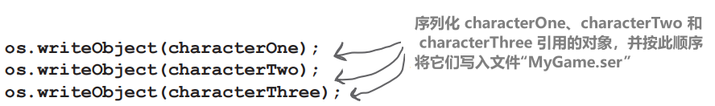
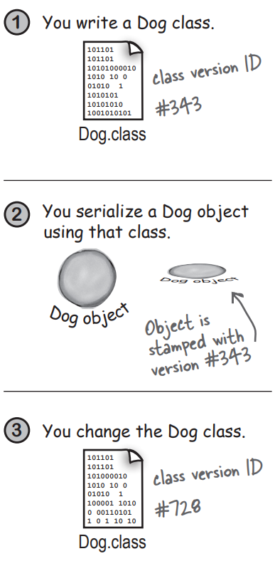
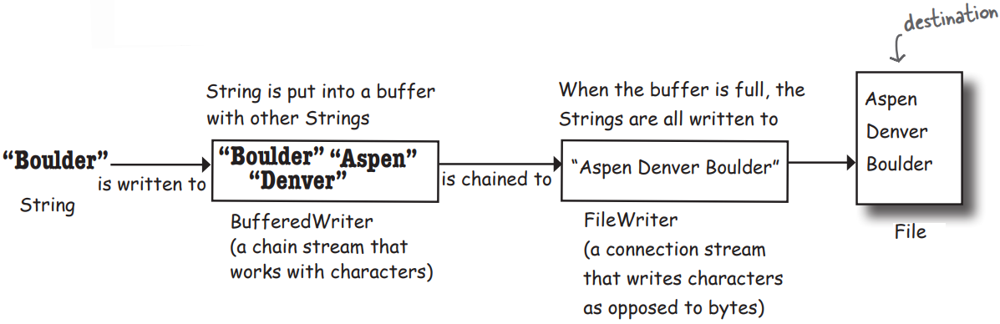
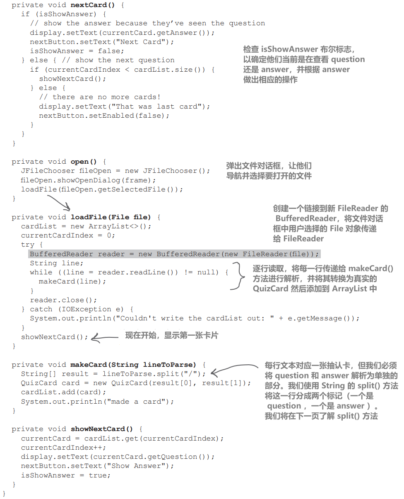

# 序列化和文件I/O

保存对象（和文本）

对象可以压缩和膨胀

对象有状态和行为

**行为存在于类中，但状态存在于每个单独的对象中**

# 捕捉节奏

保存对象

你已经创造了完美的模式。你想要保存这个模式。你可以拿张纸开始涂鸦，但你要点击保存按钮（或从文件菜单中选择保存）。然后给它起个名字，选择一个目录，知道你的杰作不会因为电脑突然崩溃而丢失后，你就可以松一口气了

关于如何保存 Java 程序的状态，你有很多选择，你的选择可能取决于你计划如何使用保存的状态。以下是本章中我们将要看到的选项：

## 如果你的数据只会被生成它的Java程序使用：

### 1、使用序列化（serialization）

编写一个保存扁平化（flattened）（序列化）对象的文件。然后让你的程序从文件中读取序列化对象，并将它们恢复成活生生的、在堆中存在的对象

## 如果你的数据将被其他程序使用：

### 2、编写纯文本文件

编写一个文件，并使用其他程序可以解析的分隔符。例如，电子表格或数据库应用程序可以使用的制表符分隔文件

这些并不是唯一的选择，但如果我们必须选择Java中I/O的两种方法，我们可能会选择这两种。当然，你可以选择任何格式保存数据。例如，你可以将数据写成字节（bytes），而不是写成字符（characters）。或者你可以将任何一种Java原始类型写入Java原始类型——有方法可以写入int、long、boolean等。但无论使用哪种方法，基本的 I/O 技术都是一样的：*向某个对象**写入**一些数据，通常这个对象要么是磁盘上的文件，要么是来自网络连接的数据流*。读取数据的过程则相反：*从磁盘文件或网络连接中**读取**数据*。我们在这一部分中谈到的所有内容都是针对当你不使用实际数据库时的情况

# 保存状态

想象一下，你有一个程序，比如一个奇幻冒险游戏，需要一个以上的会话才能完成。随着游戏的进行，游戏中的角色会变得更强、更弱、更聪明等，还会收集和使用（以及丢失）武器。你可不想每次启动游戏都要从头开始——为了进行一场壮观的战斗，你花了很长时间让你的角色达到最佳状态。因此，你需要一种保存角色状态的方法，以及在恢复游戏时恢复状态的方法。因为你也是游戏程序员，所以你希望整个保存和还原过程尽可能简单（且无误）


## 选项一

将三个序列化角色对象写入文件

创建一个文件并写入三个序列化的角色对象。如果尝试以文本形式读取该文件，内容将毫无意义：

```java
 ̈ÌsrGameCharacter ̈%gê8MÛIpowerLjava/lang/ String;[weaponst[Ljava/lang/ String;xp2tlfur[Ljava.lang.String;≠“VÁ È{Gxptbowtswordtdustsq~»tTrolluq~tb are handstbig axsq~xtMagicianuq~tspe llstinvisibility
```

## 选项二

编写纯文本文件

创建一个文件，写入三行文本，每个角色一行，用逗号分隔状态的各部分：

```java
50,Elf,bow, sword,dust
200,Troll,bare hands,big ax
120,Magician,spells,invisibility
```

序列化文件对人类来说难以阅读，但对于程序来说，从序列化中还原三个对象要比读取保存到文本文件中的对象变量值更容易（也更安全）。举例来说，想象一下你可能会不小心以错误的顺序读回变量值！类类型可能会变成dust，而不是Elf，而Elf变成了武器…

# 将序列化对象写入文件

**保存对象**

以下是序列化（保存）对象的步骤。不用死记硬背，我们将在本章稍后部分详细介绍

## 1、 创建 `FileOutputStream`


```java
FileOutputStream fileStream = new FileOutputStream("MyGame.ser");
```

## 2、创建一个 `ObjectOutputStream`


```java
ObjectOutputStream os = new ObjectOutputStream(fileStream);
```

## 3、写入对象



```java
os.writeObject(characterOne);
os.writeObject(characterTwo);
os.writeObject(characterThree);
```

## 4、关闭 `ObjectOutputStream`


```java
os.close();
```

# 数据在流中从一个地方移动到另一个地方

**连接流（connection streams）表示与源或目标（文件、网络套接字等）的连接，而链式流（chain streams）不能自行连接，必须链接到连接流上**

Java I/O API 中的连接流表示与文件或网络套接字等目标或源的连接，而链式流只有链接到其他流时才能工作

通常情况下，至少需要将两个流连接在一起才能做一些有用的事情——一个用于表示连接，另一个用于调用方法。为什么是两个？因为连接流通常过于低级。例如，`FileOutputStream`（连接流）具有用于写入字节的方法。但我们不想写字节！我们要写对象，所以需要更高级的链式流

好吧，那为什么不只用一个流来做你想做的事情呢？一个可以让你写对象，但在底层将它们转换成字节的流？想想好的面向对象设计。每个类都能做好一件事。`FileOutputStream`将字节写入文件。`ObjectOutputStreams`将对象转化为可写入流的数据。因此，我们创建一个 `FileOutputStream`（连接流），让我们可以向文件写入数据，并在其末端挂接一个 `ObjectOutputStream`（链式流）。当我们在 `ObjectOutputStream`上调用 `writeObject()` 时，对象会被注入流中，然后移动到 `FileOutputStream`，最终以字节形式写入文件

混合和匹配不同的连接和链式流的能力为你提供了巨大的灵活性！如果你被迫仅使用单个流类，你将完全受API设计者的控制，希望他们已经考虑了你可能想做的一切。但是通过链接，你可以拼凑出自己的自定义链条


# 对象序列化后到底会发生什么？

序列化对象

## 1、堆上的对象

堆上的对象具有状态——即对象的实例变量的值。这些值使得同一个类的不同实例之间有所不同

## 2、对象序列化

序列化后的对象保存了实例变量的值，以便在堆上恢复相同的实例（对象）


# 但对象的状态到底是什么？需要保存什么？

现在开始变得有趣了。保存原始值 37 和 70 非常容易。但如果一个对象有一个实例变量是对象引用呢？如果一个对象有五个实例变量都是对象引用呢？如果这些对象实例变量本身也有实例变量呢？

想想吧。对象的哪一部分可能是唯一的？想象一下，为了获得与保存的对象完全相同的对象，需要恢复什么？当然，它的内存位置会有所不同，但我们并不关心这个。我们所关心的是，在堆上，我们将得到一个与保存时状态相同的对象

必须发生什么情况才能保存汽车对象，使其恢复到原始状态？

想一想，以及你可能需要如何保存 Car 对象

如果一个 Engine 对象引用了一个 Carburetor 会发生什么？Tire[] 数组对象中有什么？


**当一个对象被序列化时，它从实例变量中引用的所有对象也会被序列化。这些对象所引用的所有对象也会被序列化。这些对象所引用的所有对象也会被序列化......最棒的是，这一切都会自动发生！**

**序列化会保存整个对象图——从正在序列化的对象开始，包括所有实例变量引用的对象**

该 Kennel 对象有一个指向 Dog[] 数组对象的引用。Dog[] 包含对两个 Dog 对象的引用。每个 Dog 对象包含对一个 String 和一个 Collar 对象的引用。String 对象包含一个字符集，而 Collar 对象包含一个 int


# 如果你想让你的类可序列化，实现 Serializable 接口

Serializable 接口被称为标记或标签接口，因为该接口没有任何需要实现的方法。它的唯一目的是宣布实现该接口的类是可序列化的。换句话说，该类型的对象可以通过序列化机制保存。如果一个类的任何超类是可序列化的，那么子类也会自动序列化，即使子类没有显式声明“`implements Serializable`”。(这就是接口的工作原理。如果你的超类 "IS-A" Serializable，那么你也是可序列化的）


```java
import java.io.*;
public class Square implements Serializable {
    private int width;
    private int height;
	
    public Square(int width, int height) {
        this.width = width;
        this.height = height;
    }
	
    public static void main(String[] args) {
        Square mySquare = new Square(50, 20);
		
        try {
            FileOutputStream fs = new FileOutputStream("foo.ser");
            ObjectOutputStream os = new ObjectOutputStream(fs);
            os.writeObject(mySquare);
            os.close();
        } catch (Exception ex) {
            ex.printStackTrace();
        }
    }
}
```

## 序列化要么全部成功，要么全部失败。你能想象如果对象的某些状态没有正确保存会发生什么吗？

如果一只狗回来时没有体重，或者没有耳朵，或者项圈尺寸变成了 3 而不是 30。这是绝对不能容忍的！

**要么整个对象图正确地序列化，要么序列化失败。如果某个对象的实例变量拒绝被序列化（即没有实现 Serializable），那么就无法序列化 Pond 对象**


## 如果一个实例变量不能（或不应该）被保存，将其标记为 `transient`

如果希望序列化过程跳过某个实例变量，就使用 **`transient`** 关键字标记该变量


如果你有一个实例变量因为不可序列化而无法保存，可以用 transient 关键字标记该变量，这样序列化过程就会直接跳过它

那么为什么一个变量不能被序列化呢？可能是因为类设计者单纯忘记了让类实现 Serializable 接口。或者可能是因为对象依赖于特定运行时信息，而这些信息不能被保存。虽然 Java 类库中的大部分内容都是可序列化的，但你却无法保存网络连接、线程或文件对象等内容。它们都依赖于（并且特定于）特定的运行时“体验”。换句话说，它们是在程序的特定运行、特定平台和特定 JVM 中以独特的方式实例化的。一旦程序关闭，就没有办法以有意义的方式将这些东西复活；它们必须每次都从头开始创建

# 如果序列化如此重要，为什么不是所有类的默认设置？为什么 Object 类不实现 Serializable，然后所有子类都会自动实现 Serializable？

尽管大多数类都会而且应该实现 Serializable，但你总是有选择的余地。在设计每个类时，你必须有意识地逐类决定是否通过实现 Serializable 来 "启用" 序列化。首先，如果序列化是默认的，你要如何关闭它呢？接口表示的是功能，而不是功能的缺失，因此如果你必须说“implements NonSerializable”来告诉世界你不能被保存，那么多态性的模型将无法正确工作

# 我为什么要编写一个不可序列化的类？

原因很少，但举例来说，你可能有一个安全问题，不想存储密码对象。或者，你可能有一个无法保存的对象，因为它的关键实例变量本身不可序列化，所以你没有办法让你的类序列化

# 如果我正在使用的类不是可序列化的，但又没有很好的理由，我可以对这个 "坏" 类进行子类化，并使子类可序列化吗？

可以！如果类本身是可扩展的（即不是 final），你就可以创建一个可序列化的子类，然后在代码需要超类类型的地方替换子类即可（记住，多态性允许这样做）。这就引出了另一个有趣的问题：如果超类不可序列化，这意味着什么？

# 你提到了：如果一个非可序列化的超类有一个可序列化的子类，这意味着什么？

首先，我们得看看类被反序列化时会发生什么（我们将在接下来的几页中讨论这个问题）。简而言之，当一个对象被反序列化，而它的超类不可序列化时，超类构造函数将像创建该类型的新对象一样运行。如果一个类没有正当理由不可序列化，那么创建一个可序列化的子类可能是一个不错的解决方案

# 哇！我突然意识到一个很大的问题...如果你将一个变量标记为“transient”，这意味着在序列化过程中跳过了该变量的值。那么它会发生什么？我们通过将实例变量标记为 transient 解决了不可序列化实例变量的问题，但当对象复活时，我们难道不需要这个变量吗？换句话说，序列化的目的不就是为了保存对象的状态吗？

是的，这是一个问题，但幸运的是有一个解决方案。如果你序列化一个对象，一个 transient 引用实例变量将被还原为 null，无论它在保存时的值是什么。这意味着与该特定实例变量连接的整个对象图不会被保存。这显然不是好事，因为你可能需要该变量的非 null 值

你有两个选择

1. 当对象被还原时，将该空实例变量重新初始化为某个默认状态。如果你的反序列化对象不依赖于该 transient 变量的特定值，这样做就有效。换句话说，Dog 有一个 Collar 可能很重要，但也许所有的 Collar 对象都是一样的，所以给复活的 Dog 一个全新的 Collar 也没有关系；没有人会知道其中的区别
2. 如果 transient 变量的值很重要（例如，如果 transient 项圈的颜色和设计对每个狗都是唯一的），那么你需要保存项圈的关键值，并在狗被还原时使用它们，从而重新创建一个与原始项圈完全相同的全新项圈

# 如果对象图中的两个对象是同一个对象，会发生什么情况？比如，如果你在 Kennel 中有两个不同的 Cat 对象，但两只 Cat 都引用了同一个 Owner 对象。 Owner 会被保存两次吗？我希望不会

这个问题很好！序列化很聪明，知道图中的两个对象是否相同。在这种情况下，只保存其中一个对象，在反序列化过程中，会恢复对该单一对象的任何引用

# 反序列化：还原对象

序列化对象的全部意义在于，以后可以在 JVM 的不同 "运行" 中（甚至可能不是对象被序列化时运行的同一 JVM）将其还原为原始状态。反序列化就像序列化的逆过程

## 1、 创建 `FileInputStream`


```java
FileInputStream fileStream = new FileInputStream("MyGame.ser");
```

## 2、创建一个 `ObjectInputStream`


```java
ObjectInputStream os = new ObjectInputStream(fileStream);
```

## 3、读取对象

每次调用 `readObject()`，都会获得流中的下一个对象。因此，你将按照写入的顺序把它们读回。如果试图读取的对象比写入的多，就会出现严重异常

```java
Object one = os.readObject();
Object two = os.readObject();
Object three = os.readObject();
```

## 4、转换对象类型


```java
GameCharacter elf = (GameCharacter) one;
GameCharacter troll = (GameCharacter) two;
GameCharacter magician = (GameCharacter) three;
```

## 5、关闭 ObjectInputStream

关闭顶部的流会关闭底部的流，因此 FileInputStream（和文件）会自动关闭

```java
os.close();
```

# 反序列化过程中会发生什么？

反序列化对象

当一个对象被反序列化时，JVM 会尝试在堆上创建一个新对象，该对象的状态与序列化对象被序列化时的状态相同，从而使对象重获新生。瞬态（transient）变量除外，它们要么返回null（对于对象引用），要么返回默认原始值


1、对象从流中读取

2、JVM（通过序列化对象存储的信息）确定对象的<span style="color:red;">**类类型**</span>

3、JVM 尝试<span style="color:red;">**查找并加载**</span>对象的类。如果 JVM 无法找到和/或加载类，JVM 就会抛出异常，反序列化失败

4、在堆上为新对象分配空间， <span style="color:red;">**但序列化对象的构造函数不会运行！**</span> 显然，如果构造函数运行，就会将对象的状态恢复到原来的 "新" 状态，而这并不是我们想要的。我们希望对象恢复到序列化时的状态，而不是刚创建时的状态

5、如果对象在其继承树的某处有一个不可序列化的类，<span style="color:red;">**那么该不可序列化类的构造函数将与其上的任何构造函数一起运行（即使它们是可序列化的）**</span>。一旦构造函数链开始运行，就无法停止，这意味着从第一个不可序列化类开始的所有超类都将重新初始化它们的状态

6、<span style="color:red;">**对象的实例变量会被赋予序列化状态的值**</span>。对于Transient变量，对象引用将获得 null 值，原始类型将获得默认值（0、false 等）

# 为什么类不作为对象的一部分保存？这样就不用担心类是否能被找到了

当然，他们可以让序列化以这种方式工作。但这会带来巨大的浪费和开销。当你使用序列化将对象写入本地硬盘驱动器上的文件时，这可能并不困难，但序列化也可用于通过网络连接发送对象。如果每个序列化（可发送）对象都捆绑了一个类，带宽问题将变得比现在更加严重。不过，对于通过网络发送的序列化对象来说，实际上有一种机制可以在序列化对象上“盖章”一个 URL，以便在该 URL 上找到其类。这在 Java 的远程方法调用 Java’s Remote Method Invocation（RMI）中使用，这样就可以将序列化对象作为方法 arg 的一部分发送，如果接收调用的 JVM 没有该类，它就可以使用 URL 从网络中获取该类并加载它，这一切都是自动的。你可能会看到 RMI 被广泛使用，不过你也可能看到对象被序列化为 XML 或 JSON（或其他人类可读格式）通过网络发送

# 静态变量呢？它们会被序列化吗？

不会。请记住，静态的意思是 "每个类一个"，而不是 "每个对象一个"。静态变量不会被保存，当一个对象被反序列化时，它将拥有其类当前拥有的任何静态变量。教训是：不要让可序列化对象依赖于动态变化的静态变量！当对象返回时，静态变量可能就不一样了

# 保存和恢复游戏角色

序列化示例

```java
import java.io.*;
public class GameSaverTest {
    public static void main(String[] args) {  //创建更多的角色
        GameCharacter one = new GameCharacter(50, "Elf",
                                              new String[] {"bow", "sword", "dust"});
        GameCharacter two = new GameCharacter(200, "Troll",
                                              new String[] {"bare hands", "big ax"});
        GameCharacter three = new GameCharacter(120, "Magician",
                                                new String[] {"spells", "invisibility"});
		// imagine code that does things with the characters that changes their state values
        
		try {
            ObjectOutputStream os = new ObjectOutputStream(new FileOutputStream("Game.ser"));
            os.writeObject(one);   //序列化角色
            os.writeObject(two);
            os.writeObject(three);
            os.close();
        } catch (IOException ex) {
            ex.printStackTrace();
        }
        
		try {
            ObjectInputStream is = new ObjectInputStream(new FileInputStream("Game.ser"));//现在从文件中读回它们......
            GameCharacter oneRestore = (GameCharacter) is.readObject();
            GameCharacter twoRestore = (GameCharacter) is.readObject();  //还原角色
            GameCharacter threeRestore = (GameCharacter) is.readObject();
            
			System.out.println("One's type: " + oneRestore.getType());
            System.out.println("Two's type: " + twoRestore.getType()); //检查它是否有效
            System.out.println("Three's type: " + threeRestore.getType());
        } catch (Exception ex) {
            ex.printStackTrace();
        }
    }
}
```


# The GameCharacter class

这是一个基本的类，只是用来测试上一页中的序列化代码。我们没有实际的游戏，但我们留给你来进行实验

```java
import java.io.*;
import java.util.Arrays;

public class GameCharacter implements Serializable {
    private final int power;
    private final String type;
    private final String[] weapons;
	
    public GameCharacter(int power, String type, String[] weapons) {
        this.power = power;
        this.type = type;
        this.weapons = weapons;
    }
	
    public int getPower() {
        return power;
    }
	
    public String getType() {
        return type;
    }
	
    public String getWeapons() {
        return Arrays.toString(weapons);
    }
}
```

# 版本 ID： 序列化的一个大问题

现在你已经看到，Java 中的 I/O 其实非常简单，尤其是如果你坚持使用最常见的连接/链组合。但有一个问题你可能真的很关心

**版本控制至关重要！**

如果你序列化了一个对象，那么你必须拥有该类才能反序列化并使用该对象。好吧，这是显而易见的。但如果在此期间更改了类，会发生什么就不那么明显了。哎呀。试想一下，当 Dog 对象的一个实例变量（非瞬态变量）从 double 变为 String 时，你还想把它带回来吗？这严重违反了 Java 的类型安全性。但这并不是唯一可能影响兼容性的变化。想想下面的情况：

## 对类的更改可能会影响反序列化的情况：

- 删除实例变量
- 更改实例变量的声明类型
- 将非瞬态实例变量改为瞬态
- 在继承层次结构中上下移动类
- 将类（对象图中的任意位置）从可序列化更改为不可序列化（通过从类声明中删除“implements Serializable”）
- 将实例变量改为静态变量

## 通常情况下，对类进行的更改是可以接受的：

- 向类中添加新的实例变量（现有对象在反序列化时将使用它们序列化时没有的实例变量的默认值）
- 向继承树中添加类
- 从继承树中删除类
- 更改实例变量的访问级别（public、private 等）不会影响反序列化为变量赋值的能力
- 将实例变量从瞬态更改为非瞬态（以前序列化的对象将只具有以前瞬态变量的默认值）




# 使用 serialVersionUID

每次序列化一个对象时，该对象（包括其图中的每个对象）都会被 "加盖" 一个对象类的版本 ID 号。该 ID 称为 `serialVersionUID`，是根据类结构的相关信息计算得出的。在对象被反序列化时，如果类在对象被序列化后发生了变化，那么类的 `serialVersionUID` 就可能不同，反序列化就会失败！但你可以控制这一点

<span style="color:red;">**如果你认为你的类有任何演变的可能性，请在你的类中加入一个serial version ID**</span>

Java 尝试反序列化对象时，会将序列化**对象**的 `serialVersionUID` 与 JVM 用于反序列化**对象的类**的 `serialVersionUID` 进行比较。例如，如果一个 Dog 实例的序列化 ID 是 23（实际上 `serialVersionUID` 更长），当 JVM 反序列化 Dog 对象时，它将首先比较 Dog **对象**的 `serialVersionUID` 和 Dog **类**的 `serialVersionUID`。如果这两个数字不匹配，JVM 就会认为该类与之前序列化的对象不兼容，在反序列化过程中就会出现异常

因此，解决办法是在类中加入 `serialVersionUID`，然后随着类的演变，`serialVersionUID` 将保持不变，JVM 就会说 "好的，酷，该类与该序列化对象兼容"，即使类实际上已经发生了变化

只有当你谨慎地更改类时，这种方法才会起作用！换句话说，当一个较旧的对象与一个较新的类重获新生时，你要对出现的任何问题负责

要获取类的 `serialVersionUID`，请使用 Java 开发工具包中的 serialver 工具


## 当你认为你的类可能会在有人序列化它的对象后发生演变时...

### 1、使用 serialver 命令行工具获取类的版本 ID


### 2、将输出粘贴到你的类中


### **3、确保在更改类时，在代码中对更改类的后果负责！例如，确保你的新的Dog类可以处理一个旧的Dog被反序列化，而这个旧的Dog的实例变量是在Dog被序列化之后添加到类中的默认值**

具体来说，如果你的程序中有一些旧的Dog对象已经被序列化（即转化为可以存储或传输的格式），然后你在Dog类中添加了新的实例变量，当你再次反序列化这些旧的Dog对象时，新添加的实例变量将会被赋予默认值。你需要确保你的Dog类和你的程序能够正确处理这种情况。这是一种良好的编程实践，可以帮助你避免因修改类定义而产生的潜在问题

# 将字符串写入文本文件

通过序列化保存对象是在 Java 程序运行之间保存和恢复数据的最简单方法。但有时你需要将数据保存到一个普通的文本文件中。想象一下，你的 Java 程序需要将数据写入一个简单的文本文件，而某些其他程序（可能是非 Java 程序）需要读取该文件。例如，你可能有一个 servlet（在Web服务器中运行的 Java 代码），它接收用户在浏览器中键入的表单数据并将其写入文本文件，然后其他人将其加载到电子表格中进行分析

写入文本数据（实际上是字符串）与写入对象类似，只不过写入的是字符串而不是对象，使用的是 `FileWriter` 而不是 `FileOutputStream`（也不会将其链接到 `ObjectOutputStream` 上）


## 编写序列化对象：

```java
objectOutputStream.writeObject(someObject);
```

## 编写字符串：

```java
fileWriter.write("My first String to save");
```


```java
import java.io.*;

class WriteAFile {
	public static void main(String[] args) {
		try {
			FileWriter writer = new FileWriter("Foo.txt");
			
			writer.write("hello foo!");
			
			writer.close();
		} catch (IOException ex) {
			ex.printStackTrace();
		}
	}
}
```

# 文本文件示例：e-Flashcards

还记得上学时用过的闪卡吗？一面是问题，背面是答案？当你试图理解某个知识点时，这些卡片并不能帮上什么忙，但对于生硬的操练和死记硬背来说，没有什么比它们更有用了。当你必须记住一个事实时。它们也非常适合玩琐事游戏


## 我们将制作一个电子版本，其中包含三个类：

1. `QuizCardBuilder`，一个简单的制作工具，用于创建和保存一组 e-Flashcards
2. `QuizCardPlayer`，一个播放引擎，可以加载闪卡并为用户播放

1. `QuizCard`，一个表示卡片数据的简单类。我们将讲解生成器和播放器的代码，并让你自己创建 QuizCard 类，使用以下内容：


# Quiz Card Builder (code outline)


## Java I/O 至 NIO 至 NIO.2

Java自从诞生以来就包含了I/O功能，你知道的，那还是上个世纪的事了。2002年，Java 1.4发布了，它包含了一种新的I/O方法，称为“NIO”，即非阻塞I/O。2011 年，Java 7 发布，对 NIO 进行了大幅增强。这种全新的 I/O 方法被称为 "NIO.2"。为什么要关心这个问题？在编写新的 I/O 时，你应该使用最新、最好的功能。但你几乎肯定会遇到使用 NIO 方法的旧代码。我们希望你在这两种情况下都能应对自如，因此在本章中：

- 我们将使用原始 I/O 一段时间
- 然后，我们将展示一些 NIO.2

你将在第 17 章 "建立连接" 中，当我们研究网络连接时，你会看到更多的I/O、NIO和NIO.2特性

# Quiz Card Builder code


```java
import javax.swing.*;
import java.awt.*;
import java.io.*;
import java.util.ArrayList;

public class QuizCardBuilder {
    private ArrayList<QuizCard> cardList = new ArrayList<>();
    private JTextArea question;
    private JTextArea answer;
    private JFrame frame;
	
    public static void main(String[] args) {
        new QuizCardBuilder().go();
    }
	
    public void go() {
        frame = new JFrame("Quiz Card Builder");
        JPanel mainPanel = new JPanel();
        Font bigFont = new Font("sanserif", Font.BOLD, 24);
		
        question = createTextArea(bigFont);
        JScrollPane qScroller = createScroller(question);
        answer = createTextArea(bigFont);
        JScrollPane aScroller = createScroller(answer);
		
        mainPanel.add(new JLabel("Question:"));
        mainPanel.add(qScroller);
        mainPanel.add(new JLabel("Answer:"));
        mainPanel.add(aScroller);
		
        JButton nextButton = new JButton("Next Card");
        nextButton.addActionListener(e -> nextCard());
        mainPanel.add(nextButton);
		
        JMenuBar menuBar = new JMenuBar();
        JMenu fileMenu = new JMenu("File");
		
        JMenuItem newMenuItem = new JMenuItem("New");
        newMenuItem.addActionListener(e -> clearAll());
		
        JMenuItem saveMenuItem = new JMenuItem("Save");
        saveMenuItem.addActionListener(e -> saveCard());
		
        fileMenu.add(newMenuItem);
        fileMenu.add(saveMenuItem);
        menuBar.add(fileMenu);
        frame.setJMenuBar(menuBar);
		
        frame.getContentPane().add(BorderLayout.CENTER, mainPanel);
        frame.setSize(500, 600);
        frame.setVisible(true);
    }
	
    private JScrollPane createScroller(JTextArea textArea) {
        JScrollPane scroller = new JScrollPane(textArea);
        scroller.setVerticalScrollBarPolicy(ScrollPaneConstants.VERTICAL_SCROLLBAR_ALWAYS);
        scroller.setHorizontalScrollBarPolicy(ScrollPaneConstants.HORIZONTAL_SCROLLBAR_NEVER);
        return scroller;
    }
	
    private JTextArea createTextArea(Font font) {
        JTextArea textArea = new JTextArea(6, 20);
        textArea.setLineWrap(true);
        textArea.setWrapStyleWord(true);
        textArea.setFont(font);
        return textArea;
    }
	
    private void nextCard() {
        QuizCard card = new QuizCard(question.getText(), answer.getText());
        cardList.add(card);
        clearCard();
    }
	
    private void saveCard() {
        QuizCard card = new QuizCard(question.getText(), answer.getText());
        cardList.add(card);
		
        JFileChooser fileSave = new JFileChooser();
        fileSave.showSaveDialog(frame);
        saveFile(fileSave.getSelectedFile());
    }
    private void clearAll() {
        cardList.clear();
        clearCard();
    }
	
    private void clearCard() {
        question.setText("");
        answer.setText("");
        question.requestFocus();
    }
	
    private void saveFile(File file) {
        try {
            BufferedWriter writer = new BufferedWriter(new FileWriter(file));
            for (QuizCard card : cardList) {
                writer.write(card.getQuestion() + "/");
                writer.write(card.getAnswer() + "\n");
            }
            writer.close();
        } catch (IOException e) {
            System.out.println("Couldn't write the cardList out: " + e.getMessage());
        }
    }
}
```

# java.io.File 类

写入文件

`java.io.File` 类是 Java API 中另一个老类的例子。它已被较新的 `java.nio.file` 包中的两个类 "取代"，但你无疑会遇到使用 File 类的代码。对于新代码，我们建议使用 `java.nio.file` 包而不是 `java.io.File` 类。接下来，我们将介绍 `java.nio.file` 包中最重要的几个功能。说到这里...

`java.io.File` 类表示磁盘上的文件，但实际上并不表示文件的内容。什么意思？把 File 对象想象成文件（甚至目录）的路径名，而不是实际文件本身。例如，File 类没有读写方法。File 对象的一个非常有用的功能是，它提供了一种比仅使用字符串文件名更安全的表示文件的方法。例如，大多数在构造函数中使用字符串文件名的类（如 `FileWriter` 或 `FileInputStream`）都可以使用 File 对象来代替。你可以构造一个 File 对象，验证是否有有效的路径等，然后将 File 对象交给 `FileWriter` 或 `FileInputStream`

<span style="color:red;">**File 对象代表磁盘上文件或目录的名称和路径，例如 /Users/Kathy/Data/Game.txt，但它并不代表文件中的数据，也不允许访问文件中的数据！**</span>

## 一些你可以使用 File 对象做的事情：

### 1、制作一个代表现有文件的 File 对象

```java
File f = new File("MyCode.txt");
```

### 2、新建一个目录

```java
File dir = new File("Chapter7"); 
dir.mkdir();
```

### 3、列出目录内容

```java
if (dir.isDirectory()) {
    String[] dirContents = dir.list();
    for (String dirContent : dirContents) {
        System.out.println(dirContent);
    }
}
```

### 4、删除文件或目录（如果成功则返回 true）

```java
boolean isDeleted = f.delete();
```


# 缓冲区（buffer）的美妙之处

**如果没有buffers，就像购物时没有购物车一样。你得一次搬一个罐头或一卷卫生纸到车里**

缓冲区给你提供了一个临时存放物品的地方，直到存放处（比如手推车）装满为止。使用缓冲器可以大大减少你的搬运次数



请注意，我们甚至不需要保留 `FileWriter` 对象的引用。我们唯一关心的是 `BufferedWriter`，因为它是我们要调用方法的对象，当我们关闭 `BufferedWriter` 时，它将处理链的其余部分

```java
BufferedWriter writer = new BufferedWriter(new FileWriter(aFile));
```

使用缓冲区比不使用它们要高效得多。你可以仅使用`FileWriter`来写入文件，通过调用 `write(someString)` 向文件写入数据，但 `FileWriter` 会每次写入你传给文件的所有数据。这是你不想要也不需要的开销，因为与在内存中操作数据相比，每次访问磁盘都是一件大事。通过将 `BufferedWriter` 链接到 `FileWriter`，`BufferedWriter` 将保存所有写入的内容，直到写满为止。只有当缓冲区已满时，`FileWriter` 才会被告知写入磁盘上的文件

如果你确实想在缓冲区满之前发送数据，你可以控制。只需刷新即可。调用`writer.flush()`表示“立即发送缓冲区中的所有内容！”

# 读取文本文件

读取文件

从文件中读取文本非常简单，但这次我们将使用 File 对象来表示文件，使用 `FileReader` 来完成实际读取，使用 `BufferedReader` 来提高读取效率

读取的方式是在一个 while 循环中读取行，当 `readLine()` 的结果为 null 时结束循环。这是读取数据（几乎所有非序列化对象的数据）的最常见方式：在 while 循环（实际上是 while 循环测试）中读取数据，当没有可读取的数据时终止循环（我们知道这是因为我们使用的读取方法的结果为空）


```java
import java.io.*;
class ReadAFile {
    public static void main(String[] args) {
        try {
            File myFile = new File("MyText.txt");
            FileReader fileReader = new FileReader(myFile);
			
            BufferedReader reader = new BufferedReader(fileReader);

            String line;
            while ((line = reader.readLine()) != null) {
                System.out.println(line);
            }
            reader.close();
			
        } catch (IOException e) {
            e.printStackTrace();
        }
    }
}
```

## Java 8 中的流和I/O

如果你使用的是 Java 8，并且对使用 Streams API 感到得心应手，你可以用以下代码替换 try 代码块中的所有代码：

```java
Files.lines(Path.of("MyText.txt")).forEach(line -> System.out.println(line));
```

我们将在本章稍后部分看到 Files 和 Path 类

# Quiz Card Player (code outline)


# Quiz Card Player code




```java
import javax.swing.*;
import java.awt.*;
import java.io.*;
import java.util.ArrayList;

public class QuizCardPlayer {
    private ArrayList<QuizCard> cardList;
    private int currentCardIndex;
    private QuizCard currentCard;
    private JTextArea display;
    private JFrame frame;
    private JButton nextButton;
    private boolean isShowAnswer;
	
    public static void main(String[] args) {
        QuizCardPlayer reader = new QuizCardPlayer();
        reader.go();
    }
	
    public void go() {
        frame = new JFrame("Quiz Card Player");
        JPanel mainPanel = new JPanel();
        Font bigFont = new Font("sanserif", Font.BOLD, 24);
		
        display = new JTextArea(10, 20);
        display.setFont(bigFont);
        display.setLineWrap(true);
        display.setEditable(false);
		
        JScrollPane scroller = new JScrollPane(display);
        scroller.setVerticalScrollBarPolicy(ScrollPaneConstants.VERTICAL_SCROLLBAR_ALWAYS);
        scroller.setHorizontalScrollBarPolicy(ScrollPaneConstants.HORIZONTAL_SCROLLBAR_NEVER);
        mainPanel.add(scroller);
		
        nextButton = new JButton("Show Question");
        nextButton.addActionListener(e -> nextCard());
        mainPanel.add(nextButton);
		
        JMenuBar menuBar = new JMenuBar();
        JMenu fileMenu = new JMenu("File");
        JMenuItem loadMenuItem = new JMenuItem("Load card set");
        loadMenuItem.addActionListener(e -> open());
        fileMenu.add(loadMenuItem);
        menuBar.add(fileMenu);
        frame.setJMenuBar(menuBar);

        frame.getContentPane().add(BorderLayout.CENTER, mainPanel);
        frame.setSize(500, 400);
        frame.setVisible(true);
    }
	
    private void nextCard() {
        if (isShowAnswer) {
						// show the answer because they’ve seen the question
            display.setText(currentCard.getAnswer());
            nextButton.setText("Next Card");
            isShowAnswer = false;
        } else { // show the next question
            if (currentCardIndex < cardList.size()) {
                showNextCard();
            } else {
								// there are no more cards!
                display.setText("That was last card");
                nextButton.setEnabled(false);
            }
        }
    }
	
    private void open() {
        JFileChooser fileOpen = new JFileChooser();
        fileOpen.showOpenDialog(frame);
        loadFile(fileOpen.getSelectedFile());
    }
	
    private void loadFile(File file) {
        cardList = new ArrayList<>();
        currentCardIndex = 0;
        try {
            BufferedReader reader = new BufferedReader(new FileReader(file));
            String line;
            while ((line = reader.readLine()) != null) {
                makeCard(line);
            }
            reader.close();
        } catch (IOException e) {
            System.out.println("Couldn't write the cardList out: " + e.getMessage());
        }
        showNextCard();
    }
	
    private void makeCard(String lineToParse) {
        String[] result = lineToParse.split("/");
        QuizCard card = new QuizCard(result[0], result[1]);
        cardList.add(card);
        System.out.println("made a card");
    }
	
    private void showNextCard() {
        currentCard = cardList.get(currentCardIndex);
        currentCardIndex++;
        display.setText(currentCard.getQuestion());
        nextButton.setText("Show Answer");
        isShowAnswer = true;
    }
}
```

# 使用字符串 split() 进行解析


## 如何将 question 和 answer 分开？

当你读取文件时， question 和 answer 被挤在一行，用斜杠 “/” 分隔（因为这就是我们在 QuizCardBuilder 代码中写文件的方式）

## String 的 split() 方法可以将一个字符串分成几个部分

split()方法会说：“给我一个分隔符，我就把这个字符串的所有片段都拆分出来，并将它们放入一个字符串数组中”


## 读取器（Readers）和写入器（Writers）仅用于文本

# 我查看了 API，java.io 包中大约有 500 万个类。你怎么知道该使用哪些类？

I/O API 使用模块化的“链接”概念，因此你可以将连接流和链式流（也称为 “过滤 ”流）以多种组合方式挂钩，从而获得你想要的任何东西。这些链不必止于两个级别；你可以将多个链式流相互挂钩，以获得所需的处理量。不过，大多数情况下，你都会使用同样的一小撮类。如果要编写文本文件，`BufferedReader` 和 `BufferedWriter`（链接到 `FileReader` 和 `FileWriter`）可能就是你所需要的全部。如果要编写序列化对象，可以使用 `ObjectOutputStream` 和 `ObjectInputStream`（与 `FileInputStream` 和 `FileOutputStream` 连锁）。换句话说，你通常使用 Java I/O 所做的 90% 的工作都可以使用我们已经介绍过的内容

# 你刚才说我们已经学会了 90% 可能会用到的内容，但我们还没有看到传说中的 NIO.2 内容。这是怎么回事？

NIO.2 将在下一页介绍！但对于读写文本文件，通常还是使用 BufferedReaders 和 BufferedWriters。因此，我们将看看 NIO.2 如何让使用它们变得更容易

# 我的大脑有点累了，我听说NIO.2相当复杂

我们将重点讨论 `java.nio.file` 包中的几个关键概念

# NIO.2 和 `java.nio.file` 包

保存对象

Java NIO.2 通常指 Java 7 中添加的两个包：

`java.nio.file`

`java.nio.file.attribute`

`java.nio.file.attribute` 包允许你操作与计算机的文件和目录相关的元数据。例如，如果你想读取或更改文件的权限设置，就会用到这个包中的类。我们不会进一步讨论这个包

`java.nio.file` 包是你进行普通文本文件读写所需的一切，它还为你提供了操作计算机目录和目录结构的能力。大多数情况下，你会用到 `java.nio.file` 中的三种类型：

- Path 接口：你总是需要一个 Path 对象来定位你要处理的目录或文件
- Paths 类：当你使用 Files 类的方法时，你将使用 `Paths.get()` 方法来创建你需要的 Path 对象
- Files 类： 这个类的（静态）方法可以完成所有你想做的工作：创建新的 Readers 和 Writers，创建、修改和搜索文件系统中的目录和文件

<span style="color:red;"> **Path 对象表示磁盘上文件或目录的位置（名称和路径），例如 /Users/Kathy/Data/Game.txt，但它并不代表文件中的数据，也不能让你访问文件中的数据**</span>

<span style="color:red;"> **File 类中有一个高级但有用的功能，可以 ”遍历"（搜索）目录树**</span>

## 一个小教程，使用NIO.2创建BufferedWriter

### 1、导入 Path、Paths 和 Files：

```java
import java.nio.file.*; 
```

### 2、使用 Paths 类创建一个 Path 对象：

Path 对象用于定位计算机上（即文件系统中）的文件。路径可用于查找当前目录或其他目录中的文件

```java
Path myPath = Paths.get("MyFile.txt");
```

或者，如果文件在一个子目录中，如 `/myApp/files/MyFile.txt`：

```java
Path myPath = Paths.get("/myApp", "files", "MyFile.txt");
```

“/myApp” 中的 ”/" 称为名称分隔符。根据你使用的操作系统，你的名称分隔符可能会有所不同；例如，它可能是“\”

### 3、使用 Path 和 Files 类创建一个新的 `BufferedWriter`：

```java
BufferedWriter writer = Files.newBufferedWriter(myPath);
```

在某个地方——在某些方法的掩盖下——在说 `BufferedWriter writer = new BufferedWriter(..)`

# Path、Paths 和 Files（弄乱目录）

在附录 B 中，我们将讨论如何将 Java 应用程序拆分成包。这包括为应用程序的所有文件创建适当的目录结构。大多数情况下，你会使用命令行或 Finder 或 Windows 资源管理器等实用程序手动创建和移动目录和文件。但你也可以在你的 Java 代码中完成这些操作

警告！在 Java 程序中乱动目录是一个真正的 “麻烦” 话题。要想正确操作，你需要了解路径、绝对路径、相对路径、操作系统权限、文件属性等等。下面是一个大大简化了的乱用目录的例子，只是为了让你感受一下可能发生的事情

假设你想要制作一个安装程序来安装你的杀手级应用程序。你从左侧的目录和文件开始，想要最终得到右侧的目录结构和文件


# 最后，进一步了解 `finally`

几章前，我们了解了 `try-catch-finally` 的工作原理。算是吧。关于 `finally`，我们只说过它是一个放置 “清理代码” 的好地方。没错，但让我们说得更具体些。大多数情况下，当我们谈论 “清理代码” 时，指的是关闭从操作系统借用的资源。当我们打开一个文件或一个套接字（socket）时，操作系统会向我们提供一些资源。当我们使用完这些资源后，就需要将它们归还。下面是 `QuizCardBuilder` 类的一段代码。我们突出显示了对一个构造函数和三个单独方法的调用...

**这四个地方都可能抛出异常！**


如果创建新 `FileWriter` 的调用失败，如果任何多个`write()`调用失败，或者 `close()` 本身失败，都会抛出异常，JVM会跳转到catch块，`writer` 将永远不会关闭。天哪！所有地方都可能抛出异常！

## 请记住，finally 总是运行的！

既然我们真的想确保关闭 writer 文件，那就把 `close()` 的调用放在 `finally` 块中

在 finally 代码块中加入 close() 所需的代码量可能会让你大吃一惊，让我们来看看


```java
private void saveFile(File file) {
    BufferedWriter writer = null;
    try {
        writer = new BufferedWriter(new FileWriter(file));
		
        for (QuizCard card : cardList) {
            writer.write(card.getQuestion() + "/");
            writer.write(card.getAnswer() + "\n");
        }
    } catch (IOException e) {
        System.out.println("Couldn't write the cardList out: " + e.getMessage());
    } finally {
        try {
            writer.close();
        } catch (Exception e) {
            System.out.println("Couldn't close writer: " + e.getMessage());
        }
    }
}
```

每个I/O操作都要写一次有点过于啰嗦和麻烦

## 还有一种更好的方法！

在 Java 的早期，你必须通过这种方式来确保你真的关闭了文件。在查看现有代码时，你很可能会遇到这样的 finally 块。但对于新代码来说，有一种更好的方法：

## Try-With-Resources

接下来我们就来看看它

# 使用 `try-with-resources` (TWR)，语句

如果你使用的是 Java 7 或更高版本（我们当然希望你使用的是！），你可以使用 `try-with-resources` 版本的try语句来简化I/O操作。让我们比较一下我们一直在看的 try 代码和做同样事情的 try-with-resources 代码：


```java
private void saveFile(File file) {
    try (BufferedWriter writer =
                    new BufferedWriter(new FileWriter(file))) {
        for (QuizCard card : cardList) {
            writer.write(card.getQuestion() + "/");
            writer.write(card.getAnswer() + "\n");
        }
    } catch (IOException e) {
        System.out.println("Couldn't write the cardList out: " + e.getMessage());
    }
}
```

# 等等，什么？你告诉我们 try 语句需要一个 catch 和/或 finally？

接得好！事实证明，当你使用 try-with-resources 时，编译器会为你生成一个 finally 代码块。你看不到它，但它是存在的

# Autocloseable，非常小的 catch

在上一页中，我们看到了一种不同的 try 语句，即 `try-with-resources` 语句（TWR）。让我们首先来拆解以下内容，看看如何编写和使用TWR语句：

```java
try (BufferedWriter writer =
                new BufferedWriter(new FileWriter(file))) {
```

只有实现 Autocloseable 的类才能在 TWR 语句中使用！

## 编写一个try-with-resources语句

### 1、在 “try ”和“{”之间添加一组括号：

```java
try ( ... ) {
```

### 2、在括号内声明一个类型为实现 Autocloseable 的对象：

就像我们在本章中使用的所有 I/O 类一样，`BufferedWriter` 实现了 `Autocloseable` 接口

```java
try (BufferedWriter writer =
                new BufferedWriter(new FileWriter(file))) {
```

### 3、在 try 代码块中使用你声明的对象（就像以前一样）：

```java
writer.write(card.getQuestion() + "/");
writer.write(card.getAnswer() + "\n");
```

## Autocloseable，它无处不在

`Autocloseable` 接口是 Java 7 中添加到 `java.lang` 中的一个接口。你要做的几乎所有 I/O 操作都会用到实现 `Autocloseable` 的类。你大多数时候不需要考虑它。关于 TWR 语句，还有一些事情值得了解：

- 你可以在一个 TWR 块中声明并使用多个 I/O 资源：

```java
try (BufferedWriter writer =
                new BufferedWriter(new FileWriter(file));   //使用分号“; ”分隔资源
            BufferedReader reader =
                new BufferedReader(new FileReader(file))) {
```

- 如果声明了多个资源，它们将按照与声明顺序相反的顺序关闭，即先声明的最后关闭
- 如果你添加了 `catch` 或 `finally` 块，系统会优雅地处理多次 `close()` 调用

# Code Kitchen


# 保存 BeatBox 模式

请记住，在 BeatBox 中，鼓模式只不过是一堆复选框而已。当要播放 sequence 时，代码会遍历复选框，以确定在每16拍中播放哪些鼓声。因此，要保存一个模式，我们需要做的就是保存复选框的状态

我们可以创建一个简单的布尔数组，分别保存 256 个复选框的状态。只要数组中的内容是可序列化的，数组对象就是可序列化的，因此我们保存布尔数组不会有任何问题

要重新加载一个模式，我们需要读取单个布尔数组对象（反序列化）并恢复复选框。大部分代码你已经在构建 BeatBox GUI 的 Code Kitchen 中看过了，因此在本章中，我们只关注保存和恢复代码

 Code Kitchen 为下一章做好了准备，在下一章中，我们不是将模式写入文件，而是将其通过网络发送到服务器。每次参与者向服务器发送模式时，我们都会从服务器获取模式，而不是从文件中加载模式

## 序列化模式


```java
private void writeFile() {

    boolean[] checkboxState = new boolean[256];
    
    for (int i = 0; i < 256; i++) {
        JCheckBox check = checkboxList.get(i);
        if (check.isSelected()) {
            checkboxState[i] = true;
        }
    }
    
    try (ObjectOutputStream os =
                    new ObjectOutputStream(new FileOutputStream("Checkbox.ser"))) {
        os.writeObject(checkboxState);
    } catch (IOException e) {
        e.printStackTrace();
    }
}
```

# 恢复 BeatBox 模式

这基本上是保存的反向操作...读取布尔数组，并使用它来恢复GUI复选框的状态。所有这些都发生在用户点击“restore”按钮时


```java
private void readFile() {
    boolean[] checkboxState = null;
    try (ObjectInputStream is =
                    new ObjectInputStream(new FileInputStream("Checkbox.ser"))) {
        checkboxState = (boolean[]) is.readObject();
    } catch (Exception e) {
        e.printStackTrace();
    }
    
    for (int i = 0; i < 256; i++) {
        JCheckBox check = checkboxList.get(i);
        check.setSelected(checkboxState[i]);
    }
    
    sequencer.stop();
    buildTrackAndStart();
}
```

该版本有一个很大的局限性！当你点击 “serializeIt（序列化）”按钮时，它会自动序列化到一个名为 “Checkbox.ser” 的文件（如果该文件不存在，则会被创建）。但每次保存时，都会覆盖之前保存的文件

改进保存和还原功能，加入 JFileChooser，这样就可以随心所欲地命名和保存不同的模式，并从以前保存的任何模式文件中加载/还原