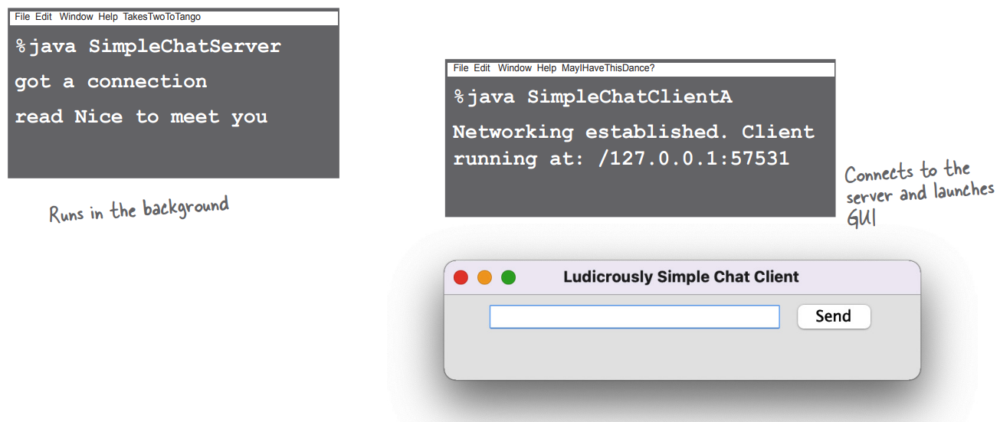
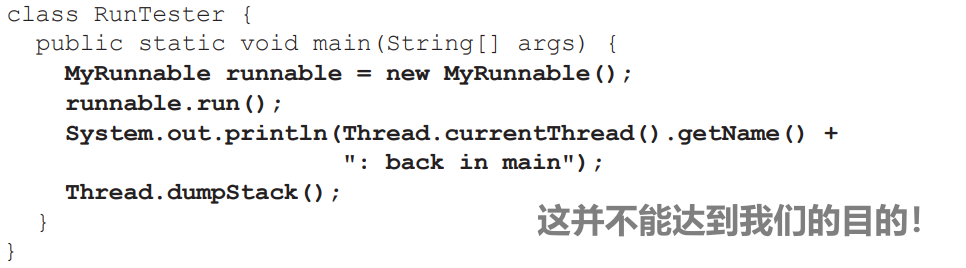

# 网络和线程


所有底层网络细节都由内置的 Java 库处理。Java 的一大优势是，通过网络发送和接收数据就像 I/O 一样，只是在 I/O 链的末端连接方式略有不同

# 实时 BeatBox 聊天

你正在开发一款电脑游戏。你和你的团队正在为游戏的每个部分设计音效。使用“聊天”版本的BeatBox，你的团队可以进行协作——你可以在发送聊天信息的同时发送节拍模式，BeatBox 聊天室中的每个人都能收到。因此，你不仅可以阅读其他参与者的信息，只需点击接收信息区域中的信息，就能加载并播放节拍模式

在本章中，我们将学习如何制作这样一个聊天客户端。我们甚至还要学习一些制作聊天服务器的知识。我们将把完整的 BeatBox Chat 保留到 Code Kitchen 中，但在本章中，你将编写一个非常简单的聊天客户端（Ludicrously Simple Chat Client）和一个非常简单的聊天服务器（Very Simple Chat Server），用于发送和接收文本信息


# 聊天程序概述

## 每个客户端都必须知道服务器的存在。服务器必须知道所有客户端的存在


## 工作原理：


# 连接（Connecting）、发送（sending）和接收（receiving）

**socket connections**

要让客户端正常工作，我们必须学会三件事：

1. 如何在客户端和服务器之间建立初始连接（connection ）
2. 如何从服务器接收（receive）消息
3. 如何向服务器发送（send）消息

为了使这些功能正常工作，需要进行许多低级别的操作。但我们很幸运，因为Java API让程序员可以轻松完成这些任务。在本章中，你将看到比网络和I/O代码更多的GUI代码

而且，这还不是全部

在简单的聊天客户端中潜藏着一个我们在本书中迄今为止没有面对过的问题：同时做两件事。建立连接是一次性操作（要么成功，要么失败）。但在此之后，聊天参与者想要发送出站消息，同时（simultaneously）（通过服务器）接收来自其他参与者的入站消息。嗯......这个问题需要花点心思，不过几页纸就能搞定


# 1. 连接

要与另一台机器对话，我们需要一个代表两台机器之间网络连接的对象。我们可以打开一个`java.nio.channels`。`SocketChannel` 来提供这个连接对象

什么是连接？连接是两台机器之间的一种关系，在这种关系中，两个软件知道对方的存在。最重要的是，这两个软件知道如何相互通信。换句话说，就是如何互相发送比特

幸好我们并不关心这些低级细节，因为它们是在 "网络堆栈" 中更低级的地方处理的。如果你不知道什么是 "网络堆栈"，不用担心。它只是查看信息（bit 位）必须经过的层，以便从某些操作系统上的 JVM 中运行的 Java 程序到物理硬件（例如以太网电缆），然后再返回到其他机器上

你需要担心的部分是高级的。你只需为服务器地址创建一个对象，然后打开一条通往服务器的通道。准备好了吗？

<span style="color:red;">**要建立连接，你需要知道服务器的两件事情：服务器的位置和运行端口。换句话说，就是 IP 地址和 TCP 端口号**</span>


```java
InetSocketAddress serverAddress = new InetSocketAddress("196.164.1.103", 5000);
SocketChannel socketChannel = SocketChannel.open(serverAddress);
```

<span style="color:red;">**连接意味着两台机器拥有彼此的信息，包括网络位置（IP 地址）和 TCP 端口**</span>


# TCP 端口只是一个数字...一个标识服务器上特定程序的16位数字

**知名端口**

你的 Internet Web（HTTP）服务器运行在 80 端口上。这是一个标准。如果你有一个 Telnet 服务器，它运行在 23 端口上。POP3 邮件服务器？110。SMTP 端口？25。时间服务器位于 37 端口。将端口号视为唯一标识符。它们代表与服务器上运行的特定软件的逻辑连接。仅此而已。你不可能把硬件盒子转一圈就能找到一个 TCP 端口。首先，服务器上有 65536 个端口（0-65535）。因此，这些端口显然并不代表可以插入物理设备的地方。它们只是一个代表应用程序的数字


如果没有端口号，服务器就无法知道客户端想要连接哪个应用程序。而且，由于每个应用程序都可能有自己独特的协议，如果没有这些标识符，你会遇到很多麻烦。例如，如果你的Web浏览器连接的是 POP3 邮件服务器，而不是 HTTP 服务器呢？邮件服务器不知道如何解析 HTTP 请求！即使它知道，POP3 服务器也不知道如何为 HTTP 请求提供服务

当你编写服务器程序时，你会在程序中加入代码，告诉程序你希望它在哪个端口号上运行（在本章稍后部分，你会看到如何在 Java 中做到这一点）。在本章编写的聊天程序中，我们选择了 5000。这只是因为我们想这么做。而且因为它符合 1024 和 65535 之间的一个数字的标准。为什么是 1024？因为 0 到 1023 都是为我们刚才谈到的那些著名服务保留的

如果你要编写在公司网络上运行的服务（服务器程序），你应该向系统管理员了解哪些端口已经被占用。例如，系统管理员可能会告诉你，不能使用低于 3000 的端口号。无论如何，如果你重视你的四肢，就不会随意分配端口号。除非这是你的家庭网络。在这种情况下，你只需和你的孩子确认一下

<span style="color:red;">**从 0 到 1023 的 TCP 端口号是为知名服务保留的。不要将它们用于自己的服务器程序！**</span>

我们编写的聊天服务器使用的是 5000 端口。我们只是在 1024 和 65535 之间选择了一个数字

  *好吧，你也许可以使用其中的一个，但你工作的系统管理员会给你写一封措辞激烈的邮件，并抄送你的老板

# 如何知道要连接的服务器程序的端口号？

这取决于该程序是否属于知名服务。如果你要连接的是知名服务，如HTTP、SMTP、FTP 等，你可以在互联网上查找（搜索“众所周知的TCP端口”）。或者问问你友好的系统管理员

但如果程序不属于知名服务，则需要向部署服务的人员了解。询问他们。通常情况下，如果有人编写了网络服务并希望其他人为其编写客户端，他们会发布服务的 IP 地址、端口号和协议。例如，如果你想为 GO 游戏服务器编写客户端，你可以访问 GO 服务器网站，查找有关如何为该服务器编写客户端的信息

# 一个端口上可以运行多个程序吗？换句话说，同一服务器上的两个程序可以使用相同的端口号吗？

不可以！如果你试图将一个程序绑定到一个已经在使用的端口上，你会得到一个 BindException 异常。将程序绑定到端口只是指启动服务器应用程序，并告诉它在特定端口上运行。同样，在本章的服务器部分，你会学到更多相关知识

IP 地址就像指定一个特定的购物中心，比如说，“Flatirons Marketplace”

端口号就像命名一个特定的商店，比如说，“Bob's CD Shop”

# 2、接收

要通过远程连接进行通信，你可以使用普通的 I/O 流，就像我们在前一章中使用的那样。Java 最酷的功能之一是，大部分 I/O 工作都不会关心高级链流实际连接到了什么。换句话说，你可以像从文件中读取时那样使用BufferedReader；区别在于底层连接流连接的是通道（Channel）而不是文件（File）！


## 使用 BufferedReader 从网络读取数据

### 1、与服务器建立连接


```java
SocketAddress serverAddr = new InetSocketAddress("127.0.0.1", 5000);
SocketChannel socketChannel = SocketChannel.open(serverAddr);
```

### 2、从连接中创建或获取一个 Reader


```java
Reader reader = Channels.newReader(socketChannel, StandardCharsets.UTF_8);
```

### 3、创建一个 BufferedReader 并读取！


```java
BufferedReader bufferedReader = new BufferedReader(reader);
String message = bufferedReader.readLine();
```


# 3、发送

在上一章中，我们使用了 `BufferedWriter`。在这里我们有一个选择，但当你一次写一个 String 时，`PrintWriter` 是一个标准的选择。你会发现 `PrintWriter` 中有两个关键方法：`print()` 和 `println()`！就像好的老式 System.out 一样

## 使用PrintWriter写入网络数据

### 1、与服务器建立连接


```java
SocketAddress serverAddr = new InetSocketAddress("127.0.0.1", 5000);
SocketChannel socketChannel = SocketChannel.open(serverAddr);
```

### 2、从连接中创建或获取 Writer


```java
Writer writer = Channels.newWriter(socketChannel, StandardCharsets.UTF_8);
```

### 3、创建一个 PrintWriter 并写入（打印）一些内容


```java
PrintWriter printWriter = new PrintWriter(writer);
writer.println("message to send");
writer.print("another message");
```


# 建立连接的方法不止一种

通道（channels）与套接字（sockets）

如果查看现实生活中与远程计算机对话的代码，你可能会看到许多不同的建立连接、读取和写入远程计算机的方式

使用哪种方法取决于很多因素，包括（但不限于）你使用的 Java 版本和应用程序的需求（例如，同时连接的客户端数量，发送消息的大小，消息的频率等）。其中最简单的方法之一是使用 `java.net.Socket` 而不是通道

## 使用套接字

你可以从套接字获取一个 `InputStream` 或 `OutputStream`，并以与我们已见过的非常相似的方式进行读写


```java
Socket chatSocket = new Socket("127.0.0.1", 5000);

InputStreamReader in = new InputStreamReader(chatSocket.getInputStream());

BufferedReader reader = new BufferedReader(in);
String message = reader.readLine();

PrintWriter writer = new PrintWriter(chatSocket.getOutputStream());

writer.println("message to send");
writer.print("another message");
```

**`java.net.Socket` 类在所有版本的Java中都可用**

**它通过我们已经用于文件 I/O 的 I/O 流支持简单的网络 I/O**

如果 Socket 早在 Java 中就有了，如果编写的代码量较少，并且如果它和Channels做的事情一样，我们为什么还需要Channels呢？

随着我们的世界联系越来越紧密，Java 也在不断发展，提供了更多与远程机器协作的方法

还记得 `Channels` 位于 `java.nio.channels` 包中吗？`java.nio` 包（NIO）是在 Java 1.4 中引入的，在 Java 7 中进行了更多更改和添加（有时称为 NIO.2）

在处理大量网络连接或通过这些连接传输大量数据时，有一些方法可以使用  Channels 和 NIO 获得更好的性能

在本章中，我们使用 Channels 提供与 Sockets 相同的基本连接功能。不过，如果我们的应用程序需要在非常繁忙的网络连接（或大量网络连接！）下正常运行，我们可以对 Channels 进行不同的配置，并充分发挥它们的潜力，这样我们的程序就能更好地应对高网络 I/O 负载

我们选择了最简单的方法来教你如何使用 Channels 开始网络 I/O，这样如果你需要 "升级" 到使用更高级功能，也不至于步履维艰

如果你确实想了解有关 NIO 的更多信息，请阅读 Ron Hitchens 所著的《Java NIO》和 Jeff Friesen 所著的《Java I/O、NIO 和 NIO.2》

Channels 支持高级网络功能，但这些练习并不需要这些功能

通道可以支持非阻塞 I/O、通过 ByteBuffers 读写以及异步 I/O。我们不会向你展示这些功能！但至少现在，当你想了解更多信息时，可以在搜索引擎中输入一些关键词

# The DailyAdviceClient

写一个客户端

在开始构建聊天应用程序之前，让我们先从一个小程序开始。The Advice Guy 是一个服务器程序，它提供实用的灵感提示，帮助你度过漫长的编码工作

我们正在为 The Advice Guy 程序构建一个客户端，它每次连接时都会从服务器中提取一条信息

你还在等什么？如果没有这款应用程序，谁知道你会错过哪些机会呢？


# DailyAdviceClient code

该程序创建一个 `SocketChannel`，（在通道的 Reader 帮助下）创建一个 `BufferedReader`，然后从服务器应用程序（无论运行在 5000 端口的是什么程序）读取一行内容


```java
import java.io.*;
import java.net.InetSocketAddress;
import java.nio.channels.Channels;
import java.nio.channels.SocketChannel;
import java.nio.charset.StandardCharsets;

public class DailyAdviceClient {
    public void go() {
        InetSocketAddress serverAddress = new InetSocketAddress("127.0.0.1", 5000);
        try (SocketChannel socketChannel = SocketChannel.open(serverAddress)) {
            
			Reader channelReader = Channels.newReader(socketChannel, StandardCharsets.UTF_8);
            BufferedReader reader = new BufferedReader(channelReader);
            
			String advice = reader.readLine();
            System.out.println("Today you should: " + advice);
            
			reader.close();
        } catch (IOException e) {
            e.printStackTrace();
        }
    }
    
	public static void main(String[] args) {
        new DailyAdviceClient().go();
    }
}
```

# 编写简单的服务器应用程序

那么，编写一个服务器应用程序需要什么呢？只需几个通道。是的，两个通道。一个 ServerSocketChannel，用于等待客户端请求（当客户端连接时）；一个 SocketChannel，用于与客户端通信。如果有多个客户端，我们将需要多个通道，但我们稍后会处理这个

## 工作原理：

### 1、服务器应用程序创建一个`ServerSocketChannel`，并将其绑定到特定的端口

```java
ServerSocketChannel serverChannel = ServerSocketChannel.open(); 
serverChannel.bind(new InetSocketAddress(5000));
```

这样，服务器应用程序就会开始监听来自端口 5000 的客户端请求


### 2、客户端创建一个连接到服务器应用程序的 `SocketChannel`

```java
SocketChannel svr = SocketChannel.open(new InetSocketAddress("190.165.1.103", 5000));
```

客户端知道 IP 地址和端口号（由服务器应用程序的配置者公布或提供）


### 3、服务器新建一个 `SocketChannel` 与客户端通信

在等待客户端连接时，`accept()` 方法会阻塞（只是静止不动）。当客户端最终连接后，该方法会返回一个知道如何与该客户端通信的 `SocketChannel`

```java
SocketChannel clientChannel = serverChannel.accept();
```

`ServerSocketChannel` 可以返回等待其他客户端。服务器只有一个 `ServerSocketChannel`，每个客户端有一个 `SocketChannel`


# DailyAdviceServer code

该程序创建一个 `ServerSocketChannel` 并等待客户端请求。当收到客户端请求时（即客户端向该服务器创建了一个新的 `SocketChannel`），服务器会向该客户端创建一个新的 `SocketChannel`。服务器会创建一个 `PrintWriter`（使用从 `SocketChannel` 创建的 `Writer`）并向客户端发送信息


```java
import java.io.*;
import java.net.InetSocketAddress;
import java.nio.channels.*;
import java.util.Random;

public class DailyAdviceServer {
    final private String[] adviceList = {
        "Take smaller bites",
        "Go for the tight jeans. No they do NOT make you look fat.",
        "One word: inappropriate",
        "Just for today, be honest. Tell your boss what you *really* think",
        "You might want to rethink that haircut."
    };
    private final Random random = new Random();
	
    public void go() {
		
        try (ServerSocketChannel serverChannel = ServerSocketChannel.open()) {
            serverChannel.bind(new InetSocketAddress(5000));
			
            while (serverChannel.isOpen()) {
                SocketChannel clientChannel = serverChannel.accept();
                PrintWriter writer = new PrintWriter(Channels.newOutputStream(clientChannel));
                
				String advice = getAdvice();
                writer.println(advice);
                writer.close();
                System.out.println(advice);
            }
        } catch (IOException ex) {
            ex.printStackTrace();
        }
    }
	
    private String getAdvice() {
        int nextAdvice = random.nextInt(adviceList.length);
        return adviceList[nextAdvice];
    }
	
    public static void main(String[] args) {
        new DailyAdviceServer().go();
    }
}
```

建议服务器代码有一个非常严重的限制——它看起来一次只能处理一个客户端！有没有办法让服务器可以同时处理多个客户端？例如，这对于聊天服务器来说是绝对行不通的

是的，没错，服务器在处理完当前客户端之前无法接受来自另一个客户端的请求。此时，服务器会开始下一次无限循环迭代，在 `accept()` 调用处等待，直到有新的请求进来，然后再创建一个 `SocketChannel` 向新客户端发送数据，并重新开始这个过程

要同时处理多个客户端，我们需要使用不同的线程

我们将为每个新客户端的 `SocketChannel` 分配一个新线程，每个线程可以独立工作

我们正要学习如何做到这一点！

# 编写聊天客户端

我们将分两个阶段编写聊天客户端程序。首先，我们将制作一个只发送信息的版本，它可以向服务器发送信息，但不能阅读其他参与者的任何信息（这是整个聊天室概念的一个令人兴奋的神秘转折）

然后，我们将制作一个既能发送又能接收聊天信息的完整聊天室

## 版本一：仅发送


### 代码概述

以下是聊天客户端需要提供的主要功能概述。完整代码在下一页


```java
import javax.swing.*;
import java.awt.*;
import java.io.*;
import java.net.InetSocketAddress;
import java.nio.channels.*;
import static java.nio.charset.StandardCharsets.UTF_8;

public class SimpleChatClientA {
    private JTextField outgoing;
    private PrintWriter writer;
	
    public void go() {
        setUpNetworking();
		
        outgoing = new JTextField(20);
		
        JButton sendButton = new JButton("Send");
        sendButton.addActionListener(e -> sendMessage());
		
        JPanel mainPanel = new JPanel();
        mainPanel.add(outgoing);
        mainPanel.add(sendButton);
        JFrame frame = new JFrame("Ludicrously Simple Chat Client");
        frame.getContentPane().add(BorderLayout.CENTER, mainPanel);
        frame.setSize(400, 100);
        frame.setVisible(true);
        frame.setDefaultCloseOperation(WindowConstants.EXIT_ON_CLOSE);
    }
	
    private void setUpNetworking() {
        try {
            InetSocketAddress serverAddress = new InetSocketAddress("127.0.0.1", 5000);
            
			SocketChannel socketChannel = SocketChannel.open(serverAddress);
            writer = new PrintWriter(Channels.newWriter(socketChannel, UTF_8));
            System.out.println("Networking established.");
        } catch (IOException e) {
            e.printStackTrace();
        }
    }
	
    private void sendMessage() {
        writer.println(outgoing.getText());
        writer.flush();
        outgoing.setText("");
        outgoing.requestFocus();
    }
	
    public static void main(String[] args) {
        new SimpleChatClientA().go();
    }
}
```

如果你想现在就试试，可以输入下一页列出的现成聊天服务器代码

首先，在一个终端启动服务器。然后，使用另一个终端启动该客户端

# Ready-Bake Code

## 非常非常简单的聊天服务器

你可以在所有版本的聊天客户端中使用此服务器代码。所有可能的免责声明均在此生效。为了将代码简化到最基本的部分，我们删除了很多使这个成为真正服务器所需的部分。换句话说，它能工作，但至少有一百种方法可以破坏它。如果你想在学完本书后真正提高自己的技能，可以回来把服务器代码写得更健壮一些

学完本章后，你应该能够自己注释这段代码。如果你自己能弄明白发生了什么，会比我们向你解释要好理解得多。话说回来，这是现成的代码，所以你根本不需要理解它。它在这里只是为了支持两个版本的聊天客户端

**要运行聊天客户端，需要两个终端。首先，从一个终端启动服务器，然后从另一个终端启动客户端**

```java
import java.io.*;
import java.net.InetSocketAddress;
import java.nio.channels.*;
import java.util.*;
import java.util.concurrent.*;

//import static java.nio.charset.StandardCharsets.UTF_8;

public class SimpleChatServer {
    private final List<PrintWriter> clientWriters = new ArrayList<>();

    public static void main(String[] args) {
        new SimpleChatServer().go();
    }

    public void go() {
        ExecutorService threadPool = Executors.newCachedThreadPool();
        try {
            ServerSocketChannel serverSocketChannel = ServerSocketChannel.open();
            serverSocketChannel.bind(new InetSocketAddress(5000));

            while (serverSocketChannel.isOpen()) {
                SocketChannel clientSocket = serverSocketChannel.accept();
                PrintWriter writer = new PrintWriter(Channels.newWriter(clientSocket, "UTF-8"));
                clientWriters.add(writer);
                threadPool.submit(new ClientHandler(clientSocket));
                System.out.println("got a connection");
            }
        } catch (IOException ex) {
            ex.printStackTrace();
        }
    }

    private void tellEveryone(String message) {
        for (PrintWriter writer : clientWriters) {
            writer.println(message);
            writer.flush();
        }
    }
	
    public class ClientHandler implements Runnable {
        BufferedReader reader;
        SocketChannel socket;
		
        public ClientHandler(SocketChannel clientSocket) {
            socket = clientSocket;
            reader = new BufferedReader(Channels.newReader(socket, "UTF-8"));
        }
		
        public void run() {
            String message;
            try {
                while ((message = reader.readLine()) != null) {
                    System.out.println("read " + message);
                    tellEveryone(message);
                }
            } catch (IOException ex) {
                ex.printStackTrace();
            }
        }
    }
}
```



# 版本二：发送和接收


## 重要问题： 如何从服务器获取消息？

应该很简单；在建立网络时，也要建立一个 Reader 。然后使用 readLine 读取信息

## 更重要的问题： 何时从服务器获取消息？

想想这个问题。有哪些选项？

### 选项一：每次用户发送信息时都从服务器读取信息

优点：行，非常简单

缺点：愚蠢。为什么要选择这样一个任意的时间来检查信息？如果用户是一个潜水者，不发送任何东西怎么办？

### 选项二：每 20 秒轮询一次服务器

优点：可行，而且解决了潜伏者的问题

缺点：服务器怎么知道你看过什么，没看过什么？服务器必须存储信息，而不是每次收到信息都进行 "分发-遗忘"。为什么是 20 秒？这样的延迟会影响可用性，但当你减少延迟时，你就会冒着不必要地攻击服务器的风险。效率低下

### 选项三： 消息从服务器发送后立即读取

优点：效率最高，可用性最好

缺点：如何同时做两件事？这段代码要放在哪里？总是等待从服务器读取消息。但这应该放在哪里？一旦启动了 GUI，除非 GUI 组件触发了事件，否则不会发生任何事情

## 现在你已经知道我们要选择选项三了

我们希望有一些东西持续运行，不断地检查来自服务器的消息，但不会干扰用户与 GUI 交互的能力！因此，当用户在愉快地输入新信息或滚动浏览接收到的信息时，我们希望有一个后台程序不断读取来自服务器的新输入信息

这意味着我们最终需要一个新的线程。一个新的、独立的堆栈

我们希望在只发送版本（第一版）中所做的一切都能以同样的方式运行，同时运行一个新的进程，从服务器读取信息并在接收文本区域中显示它

其实不然。每个新的 Java 线程实际上并不是运行在操作系统上的独立进程。但感觉上几乎就是

我们将暂时离开聊天应用程序，探索一下它是如何工作的。然后，我们将在本章结尾将其添加到我们的聊天客户端中

## Java 中的多线程

Java 在语言结构中内置了对多线程的支持。创建一个新的执行线程非常容易：

```java
Thread t = new Thread();
t.start();
```

就是这样。通过创建一个新的 Thread 对象，你就启动了一个独立的执行线程，并拥有自己的调用栈

但有一个问题

这个线程实际上什么都不做，所以线程在诞生的一瞬间就 "死亡" 了。当线程死亡时，它的新栈会再次消失。故事结束

因此，我们缺少了一个关键组件——线程的工作。换句话说，我们需要你希望由单独线程运行的代码

Java 中的多线程意味着我们必须同时关注线程和由线程运行的作业。事实上，在 Java 中运行多个作业的方法不止一种，而不仅仅是使用 `java.lang` 包中的 Thread 类。(请记住，`java.lang` 是免费隐式导入的包，其中包含了语言最基本的类，包括 String 和 System）

# Java 有多个线程，但只有一个 Thread 类

threads and Thread

我们可以用小写的 "t" 来称呼 thread，用大写的 "T" 来称呼 Thread。当你看到 thread 时，我们说的是一个独立的执行线程。换句话说，就是一个独立的调用栈。当你看到 Thread 时，想想 Java 的命名规则。在 Java 中，什么以大写字母开头？类和接口。在本例中，Thread 是 `java.lang` 包中的一个类。一个 Thread 对象代表着一个执行线程。在旧版本的 Java 中，每次要启动一个新的执行线程时，都必须创建一个 Thread 类的实例。Java 随着时间的推移不断发展，现在直接使用 Thread 类并不是唯一的方法。在本章接下来的内容中，我们将更详细地了解这一点

<span style="color:red;">

**thread 是一个独立的 "执行线程"，是一个独立的调用栈**

**Thread 是表示一个线程的 Java 类**

**使用 Thread 类并不是在 Java 中执行多线程的唯一方法**

</span>


A thread（小写 "t"）是一个独立的执行线程。这意味着一个独立的调用栈。每个 Java 应用程序都会启动一个主 thread——将 main() 方法放在堆栈底部的thread。JVM 负责启动主 thread（以及它选择的其他 threads，包括垃圾回收 thread）。作为程序员，你可以编写代码来启动自己的其他 threads


Thread（大写 "T"）是一个表示执行线程的类。它拥有启动线程、将一个线程与另一个线程连接、让线程休眠等方法

# 拥有多个调用栈意味着什么？

有了一个以上的调用堆栈，你就可以同时做多件事。如果你在多处理器系统（如大多数现代电脑和手机）上运行，你实际上可以同时做多件事。有了 Java 线程，即使你不是在多处理器系统上运行，或者你运行的进程数超过了可用内核数，你看起来也可以同时进行所有这些事情。换句话说，执行（execution）可以在堆栈之间快速来回移动，以至于你感觉所有调用栈都在同时执行。请记住，Java 只是运行在底层操作系统上的一个进程。因此，首先 Java 本身必须是操作系统上的 "当前执行进程"。但是一旦Java获得执行机会，JVM实际上运行什么呢？执行哪些字节码？当前正在运行的堆栈顶层的内容！在 100 毫秒内，当前执行的代码可能会切换到另一个调用栈上的不同方法

thread 必须做的事情之一，就是跟踪当前在线程栈上执行的是哪条语句（哪种方法）

它可能如下所示：

## 1、JVM 调用 main( ) 方法

```java
public static void main(String[] args) {
... 
} 
```


## 2、main( ) 启动一个新线程。在新线程开始运行时，主线程可能会暂时冻结

```java
Runnable r = new MyThreadJob();//你马上就会了解这是什么意思...
Thread t = new Thread(r);//你马上就会了解这是什么意思...
t.start();
Dog d = new Dog();
```


## 3、JVM 会在新线程（用户线程 A）和原始主线程之间切换，直到两个线程都完成为止


# 要创建新的调用栈，你需要一个任务（job）来运行

Runnable 接口

**对于线程来说，Runnable 就像工作对于工人一样。一个 Runnable 是线程应该运行的任务**

**Runnable 包含新调用栈底部的方法：`run()`**

要启动新的调用栈，线程需要一个 job，即线程启动时要运行的 job。这个job实际上就是新线程堆栈中的第一个方法，它必须始终是一个类似下面这样的方法：

```java
public void run() {
	// code that will be run by the new thread
}
```

Runnable 接口只定义了一个方法，即 `public void run()`。因为它只有一个方法，所以它是一个 SAM 类型，一个函数式接口，如果你愿意，可以使用 lambda 来代替创建一个实现 Runnable 的完整类

线程如何知道该把哪个方法放在栈底呢？因为 Runnable 定义了一个契约。因为 Runnable 是一个接口。线程的 job 可以定义在实现了 Runnable 接口的任何类中定义，或者是一个适合 run 方法的 lambda 表达式

一旦有了 Runnable 类或 lambda 表达式，你就可以告诉 JVM 在一个单独的线程中运行这段代码；这就是在给线程分配工作

# 要为 thread 创建 job，实现 Runnable 接口


## 如何不运行 Runnable

创建一个新的 Runnable 实例并调用 run 方法可能很诱人，但这**还不足以创建一个新的调用栈**



<span style="color:red;">**run() 方法是直接从 main() 方法内部调用的，因此它是主线程调用栈的一部分**</span>


# 以前启动新 thread 的方法

socket connections

启动新线程的最简单方法就是我们前面提到的 Thread 类。这种方法在 Java 诞生以来就存在，但现在已不再是推荐使用的方法。我们在这里展示它是因为：a）它很简单；b）你会在现实世界中看到它。稍后我们将讨论为什么它可能不是最好的方法


# 更好的选择：完全不管理线程

创建并启动一个新 Thread 可以让你对该线程拥有很大的控制权，但缺点是你必须控制它。你必须跟踪所有 Threads，并确保它们在结束时被关闭。如果能有其他东西可以启动、停止甚至重用 Threads，岂不是更好？

让我们介绍一下 `java.util.concurrent` 包中的一个接口， **`ExecutorService`** 。该接口的实现将执行 jobs（Runnables）。在幕后，ExecutorService 将创建、重用和销毁线程以便运行这些 jobs

`java.util.concurrent.Executors` 类提供了创建 `ExecutorService` 实例所需的工厂方法

Executors 从 Java 5 开始就存在了，因此即使你使用的是相当老的 Java 版本，也应该可以使用 Executors。现在实际上没有必要直接使用 Thread 了

<span style="color:red;">

**静态工厂方法可以代替构造函数**

**工厂方法返回的正是我们需要的接口实现。我们不需要知道具体的类或如何创建它们**

</span>

## 运行一个job

对于我们将要开始的简单情况，我们只想在主类之外运行一个job。为此，我们可以使用单线程执行器


```java
class ExecutorTester {

    public static void main(String[] args) {
        Runnable job = new MyRunnable();
        
        ExecutorService executor = Executors.newSingleThreadExecutor();
        executor.execute(job);
        
        System.out.println(Thread.currentThread().getName() +
                           ": back in main");
        Thread.dumpStack();
        executor.shutdown();
    }
}
```

# 新线程的三种状态

线程状态

无论你是创建新的 Thread 并将 Runnable 传递给它，还是使用 Executor 执行 Runnable，job 都将在 Thread 上运行。 Thread 在其生命周期中会经历许多不同的状态，了解这些状态以及它们之间的转换有助于我们更好地理解多线程编程


<span style="color:red;">**但还不止这些。一旦线程变得可运行，它就可以在可运行、运行和另一种状态（暂时不可运行）之间来回移动**</span>

## 典型的可运行/运行循环

通常，一个线程会在可运行和正在运行之间来回移动，因为 JVM 线程调度器会选择一个线程运行，然后将其踢回，让另一个线程获得机会


## 让线程暂时无法运行

由于各种原因，线程调度器可以将正在运行的线程转入阻塞状态。例如，线程可能正在执行从输入流中读取数据的代码，但没有任何数据可供读取。调度程序会将线程移出运行状态，直到有可用数据为止。或者，正在执行的代码可能已经告诉线程让自己进入休眠状态（sleep()）。线程等待的原因可能是它试图调用某个对象上的方法，而该对象被 "锁定" 了。在这种情况下，线程无法继续运行，直到拥有该对象的线程释放了该对象的锁

所有这些情况（还有更多）都会导致线程暂时无法运行


# 线程调度器（scheduler）

线程调度

线程调度器负责决定谁从可运行状态进入运行状态，以及线程何时（在什么情况下）离开运行状态。调度器决定谁在运行、运行多久，以及当它决定将线程踢出当前运行状态时线程的去向

你无法控制调度程序。没有调用调度程序方法的 API。最重要的是，调度没有任何保证！(有一些几乎是保证，但即使是保证也有点模糊）

底线是：**不要基于调度器以特定方式工作来确定程序的正确性！** 调度器的实现因不同的JVM而异，即使在同一台机器上运行相同的程序，也会得到不同的结果。新 Java 程序员最容易犯的错误之一就是在一台机器上测试他们的多线程程序，并认为无论程序在哪里运行，线程调度器都会以这种方式工作

那么，这对 "一次编写，随处运行" 意味着什么呢？这意味着要编写与平台无关的 Java 代码，无论线程调度程序如何运行，你的多线程程序都必须正常运行。例如，这意味着你不能依赖调度程序来确保所有线程都能在运行状态下以完全公平、平等的方式轮流运行。虽然现在这种可能性极小，但你的程序最终可能会运行在一个调度器会说 "好了，五号线程，该你上场了，在我看来，你可以一直待在这里，直到你的 run() 方法完成为止" 的 JVM 上

<span style="color:red;">**线程调度器决定谁运行，谁不运行。通常它让线程轮流运行，非常友好。但是这并不保证。它可能让一个线程尽情运行，而其他线程则“饥饿”**</span>

## 一个展示调度器的不可预测性的例子…

在一台机器上运行这段代码


```java
import java.util.concurrent.ExecutorService;
import java.util.concurrent.Executors;

class ExecutorTestDrive {
    public static void main (String[] args) {
        ExecutorService executor =
            Executors.newSingleThreadExecutor();
            
        executor.execute(() ->
                         System.out.println("top o’ the stack"));
                         
        System.out.println("back in main");
        executor.shutdown();
    }
}
```


不管是使用 ExecutorService（如上面的代码）运行，还是直接使用线程（如下面的代码）运行，都会出现相同的情况

```java
class ThreadTestDrive {
    public static void main (String[] args) {
        Thread myThread = new Thread(() ->
                                     System.out.println("top o’ the stack"));
        myThread.start();
        System.out.println("back in main");
    }
}
```

# 我们为什么会得到不同的结果呢？

线程调度

多线程程序不是确定性的，它们不会每次都以相同的方式运行。每次程序运行时，线程调度器都可以对每个线程进行不同的调度

## 有时会像这样运行：


## 还有时会像这样运行：


<span style="color:red;">**即使新线程很小，如果它只有一行代码要运行，比如我们的 lambda 表达式，它仍然会被线程调度器中断**</span>

# 我应该使用lambda表达式来实现我的Runnable，还是创建一个实现了Runnable接口的新类呢？

这取决于你的 job 有多复杂，也取决于你认为使用 lambda 表达式还是类更容易理解。Lambda 表达式适用于非常小的任务，比如我们的单行 “print” 示例。如果你想将另一个方法中的几行代码转化为 job，那么 Lambda 表达式（或方法引用）也同样适用：

```java
executor.execute(()->printMsg());
```

如果 job 需要将内容存储在字段中，或如果 job 由多个方法组成，则很可能需要使用完整的 Runnable 类。当 job 比较复杂时，更有可能出现这种情况

# 使用 ExecutorService 有什么好处？到目前为止，它的工作原理与创建线程并启动它是一样的

的确，在这些简单的示例中，我们只启动一个线程，让它运行，然后停止应用程序，这两种方法看起来很相似。当我们启动大量独立 job 时，ExecutorServices 就会变得非常有用。我们不一定要为每个 job 创建一个新线程，也不一定要跟踪所有这些线程。根据我们需要启动多少个线程（尤其是当我们不知道需要多少个线程时），有不同的 ExecutorService 实现，包括创建线程池的 ExecutorServices。线程池可让我们重复使用线程实例，这样我们就不必为每项任务启动新线程而付出代价。稍后我们将详细探讨这一点

# 让线程休眠

线程协调

帮助线程轮流运行的一种方法是定期让线程休眠。你只需要调用静态的`sleep()`方法，将你希望线程休眠的时间（以毫秒为单位）传给它即可

例如：

```java
Thread.sleep(2000);
```

将使线程退出运行状态，使其脱离可运行状态两秒钟。在至少两秒过后，该线程才能再次成为运行线程

有点遗憾的是，sleep 方法会抛出一个 InterruptedException（中断异常），这是一个已检查的异常，因此所有对 sleep 的调用都必须用 try/catch 包装（或声明）。所以睡眠调用实际上是这样的：

```java
try { 
    Thread.sleep(2000); 
} catch(InterruptedException ex) { 
    ex.printStackTrace(); 
}
```

现在你知道线程不会在指定的持续时间前醒来，但它有没有可能在 "计时器" 过期后的一段时间内醒来呢？实际上是有可能的。线程不会在指定时间自动唤醒并成为当前运行的线程。当线程唤醒时，线程将再次受线程调度器的支配；因此，无法保证线程会停止运行多长时间

**让一个线程休眠，可以让其他线程有机会运行**

**当线程醒来时，它总是会回到可运行状态，等待线程调度程序再次选择它运行**

有时候很难理解几毫秒代表多长时间。我们可以使用 `java.util.concurrent.TimeUnit` 中的一个便利方法来实现更可读的睡眠时间

```java
TimeUnit.MINUTES.sleep(2);
```

这可能比以下方式更容易理解：

```java
Thread.sleep(120000);
```

(不过你仍然需要将两者都包装在 try-catch 块中）

# 要使程序更可预测，可以使用 sleep

回想一下之前的示例，每次运行时都会给出不同的结果。请回过头来研究一下代码和示例输出。有时，主线程必须等待新线程结束（并打印出 "top o' the stack"），而有时，新线程会在结束前被送回 runnable，从而允许主线程返回并打印出 "back in main"。如何解决这个问题呢？请停下来回答这个问题： "你可以在哪里调用 sleep()，以确保 "back in main"总是在 "top o' the stack"之前打印出来？


```java
class PredictableSleep {
    public static void main (String[] args) {
        ExecutorService executor =
            Executors.newSingleThreadExecutor();
        executor.execute(() -> sleepThenPrint());
        System.out.println("back in main");
        executor.shutdown();
    }
	
    private static void sleepThenPrint() {
        try {
            TimeUnit.SECONDS.sleep(2);
        } catch (InterruptedException e) {
            e.printStackTrace();
        }
        System.out.println("top o’ the stack");
    }
}
```

# 强制线程休眠的缺点

线程协调

## 1、程序必须等待至少这么长的时间

如果我们让线程休眠两秒，那么线程将在那段时间内处于非运行状态。当它醒来时，不会自动成为当前运行的线程。当线程唤醒时，线程将再次受线程调度器的支配。我们的应用程序至少会在这两秒钟内被挂起，甚至更长。这听起来可能不是什么大事，但想象一下，如果一个更大的程序充满了这些停顿，会故意拖慢应用程序的运行速度

## 2、你怎么知道其他 job 会在这段时间内完成？

我们让新线程休眠两秒，假设主线程是运行线程，并在这段时间内完成工作。但如果主线程需要更长的时间才能完成工作呢？如果另一个运行更长 job 的线程被调度了呢？解决这个问题的方法之一就是设置比 job 预期时间更长的睡眠时间，但这样一来，第一个问题就变得更加严重了

## 更好的选择是：等待最佳时机

在我们的示例中，我们真正想要的是等待主线程中的特定事情发生后，再继续我们的新线程。Java 支持多种不同的机制来实现这一目标，如 Future、CyclicBarrier、Semaphore 和 CountDownLatch

## <span style="color:red;">**为了协调多个线程上发生的事件，一个线程可能需要等待另一个线程发出特定信号后才能继续执行**</span>

# 倒计时直至准备就绪

当重要事件发生时，可以让线程进行倒计时。一个（或多个）线程可以等待所有这些事件完成后再继续。你可能需要倒计时，直到最少数量的客户端连接，或者一些服务已经启动

这就是 `java.util.concurrent.CountDownLatch` 的作用。你可以设置一个倒计时数字。然后，任何线程都可以在相关事件发生时告诉锁存器（latch）倒计时

在我们的示例中，我们只有一件事要计数——我们的新线程应该等到主线程打印“back in main”后才能继续

**`CountDownLatch` 是一个屏障（Barrier）同步器。屏障（Barrier）是允许线程相互协调的机制**

**其他例子包括 `CyclicBarrier` 和 `Phaser`**


```java
import java.util.concurrent.*;
class PredictableLatch {
    public static void main (String[] args) {
        ExecutorService executor = Executors.newSingleThreadExecutor();
        CountDownLatch latch = new CountDownLatch(1);
		
        executor.execute(() -> waitForLatchThenPrint(latch));
		
        System.out.println("back in main");
        latch.countDown();
		
        executor.shutdown();
    }
	
    private static void waitForLatchThenPrint(CountDownLatch latch) {
        try {
            latch.await();
        } catch (InterruptedException e) {
            e.printStackTrace();
        }
        System.out.println("top o’ the stack");
    }
}
```

代码与执行休眠的代码非常相似，主要区别在于主方法中的 `latch.countDown` 部分。不过，性能上的差别还是很大的。新线程无需等待至少两秒以确保 main 已打印其信息，而只需等待 main 方法打印其 “back in main” 信息即可

要了解这在实际系统中可能产生的性能差异，我们在 MacBook 上运行了 100 次这段锁存代码，完成全部 100 次运行大约需要 50 毫秒，而且每次输出的顺序都是正确的。如果运行一次 sleep() 版本需要 2 秒多（2000 毫秒），那么可以想象运行 100 次需要多长时间*....200331 毫秒。这要慢 4000 多倍

# 创建并启动两个线程（或更多）

启动多个线程

如果我们想要启动除了主线程之外的多个作业怎么办？显然，如果我们想运行多个线程，就不能使用 `Executors.newSingleThreadExecutor()`。那么还有什么方法呢？

工厂方法中的几种：

**`ExecutorService newCachedThreadPool()`**

创建一个线程池，在需要时创建新线程，但在可用时会重用之前构造的线程

**`ExecutorService newFixedThreadPool(int nThreads)`**

创建一个线程池，重复使用固定数量的线程，这些线程在共享的无界队列中运行

**`ScheduledExecutorService newScheduledThreadPool(int corePoolSize)`**

创建一个线程池，它可以安排命令在给定延迟后运行，或定期执行

**`ExecutorService newSingleThreadExecutor()`**

创建执行器，使用在无界队列上运行的单个工作线程

**`ScheduledExecutorService newSingleThreadScheduledExecutor()`**

创建一个单线程执行器，该执行器可调度命令在给定延迟后运行或定期执行

**`ExecutorService newWorkStealingPool()`**

使用可用处理器数量作为目标并行度级别，创建一个工作窃取线程池

**这些 `ExecutorServices` 使用某种形式的线程池。这是一个线程实例集合，可用于（和重复使用）执行jobs**

**线程池中有多少线程，以及如果要运行的 jobs 多于可用线程该怎么办，这些都取决于 ExecutorService 的实现**

# 线程池

使用资源池，尤其是线程或数据库连接等创建成本较高的资源池，是应用程序代码中常见的模式


创建新的 `ExecutorService` 时，它的线程池可能一开始就有一些线程，也可能是空的

你可以使用 `Executors` 类中的一个辅助方法创建一个带有线程池的 `ExecutorService`

```java
ExecutorService threadPool = Executors.newCachedThreadPool();
```


通过将 job 交给 `ExecutorService`，你可以使用池中的线程来运行 job。然后，`ExecutorService` 可以找出是否有空闲线程来运行该 job

```java
threadPool.execute(() -> run("Job 1"));
```

这意味着，ExecutorService 可以重复使用线程，而不只是创建和销毁线程


当你为 `ExecutorService` 分配更多 jobs 时，它可能会创建并启动新的线程来处理jobs。如果 jobs 多于线程，它可能会将 jobs 存储在队列中

`ExecutorService` 如何处理额外 jobs 取决于它的设置方式

```java
threadPool.execute(() -> run("Job 324"));
```

`ExecutorService` 还可能**终止**已闲置一段时间的线程。这有助于最大限度地减少应用程序所需的硬件资源（CPU、内存）

# 运行多个线程

下面的示例运行两个 jobs，并使用固定大小的线程池创建两个线程来运行 jobs。每个线程都有相同的任务：循环运行，每次迭代都打印当前运行线程的名称


```java
import java.util.concurrent.ExecutorService;
import java.util.concurrent.Executors;

public class RunThreads {
	
    public static void main(String[] args) {
        ExecutorService threadPool = Executors.newFixedThreadPool(2);
        threadPool.execute(() -> runJob("Job 1"));
        threadPool.execute(() -> runJob("Job 2"));
        threadPool.shutdown();
    }
	
    public static void runJob(String jobName) {
        for (int i = 0; i < 25; i++) {
            String threadName = Thread.currentThread().getName();
            System.out.println(jobName + " is running on " + threadName);
        }
    }
}
```


## 会发生什么？

线程会轮流出现吗？你会看到线程名称交替出现吗？多久切换一次？每次迭代？五次迭代之后？

你已经知道答案了：我们不知道！这取决于调度程序。在你的操作系统、特定的 JVM 和 CPU 上，你可能会得到截然不同的结果

在现代多核系统上运行时，两个作业可能会并行运行，但这并不能保证它们会在相同的时间内完成，或以相同的速度输出值

# 关闭线程池的时间

你可能已经注意到，我们的示例在主方法末尾有一个 `threadPool.shutdown()`。尽管线程池会处理我们的各个线程，但我们确实需要负责任地在处理完毕后关闭线程池。这样，线程池就可以清空其 job 队列并关闭所有线程，从而释放系统资源

`ExecutorService` 有两个 `shutdown` 方法。你可以任选其一，但为了安全起见，我们会同时使用这两个方法：

## 1、`ExecutorService.shutdown()`

调用 `shutdown()` 时，`ExecutorService` 会友好地询问它是否介意将事情彻底结束，以便大家都能回家

所有当前运行 jobs 的线程都将允许完成这些 jobs，任何在队列中等待的 jobs 也将被完成。ExecutorService 也将拒绝任何新的 jobs

如果你需要代码等待所有这些工作都完成，你可以使用 `awaitTermination` 坐等工作完成。你可以为 `awaitTermination` 设定一个等待所有工作结束的最长时间，因此 `awaitTermination` 会一直等待，直到 ExecutorService 完成所有工作或超时（以较早者为准）

## 2、`ExecutorService.shutdownNow()`

所有人都退出！调用此函数时，`ExecutorService` 会尝试停止任何正在运行的线程，不会运行任何等待中的 jobs，也绝对不会让任何其他线程进入池中

如果你需要结束一切，可以使用这个方法。有时，在首先调用 `shutdown()` 让作业有机会完成后，再彻底关闭


```java
public class ClosingTime {
    public static void main(String[] args) {
        ExecutorService threadPool = Executors.newFixedThreadPool(2);
		
        threadPool.execute(new LongJob("Long Job"));
        threadPool.execute(new ShortJob("Short Job"));
		
        threadPool.shutdown();
		
        try {
            boolean finished = threadPool.awaitTermination(5, TimeUnit.SECONDS);
            System.out.println("Finished? " + finished);
        } catch (InterruptedException e) {
            e.printStackTrace();
        }
        threadPool.shutdownNow();
    }
}
```

# 多线程会导致并发 "问题"

并发问题会导致竞争条件。竞争条件会导致数据损坏。数据损坏导致恐惧......剩下的你都知道了

这一切都归结为一种潜在的致命情景：两个或更多线程可以访问单个对象的数据。换句话说，两个不同的栈上执行的方法都在调用堆上单个对象的 getter 或 setter

这就是所谓的 "左手不知道右手在做什么"。两个线程毫无顾忌地执行着各自的方法，每个线程都认为自己是唯一真正的线程。唯一重要的线程。毕竟，当一个线程不在运行，处于可运行（或阻塞）状态时，它基本上就失去了意识。当它再次成为当前运行的线程时，它并不知道自己曾经停止过

# 全新升级的 SimpleChatClient

最终聊天客户端

在本章开头，我们创建了一个 SimpleChatClient，它可以向服务器发送传出消息，但无法接收任何消息。还记得吗？因为我们需要一种同时做两件事的方法：向服务器发送消息（与GUI交互），同时读取从服务器传入的消息，并将其显示在滚动文本区域中

这就是新改进的聊天客户端，借助多线程的强大功能，它既能发送信息，也能接收信息！请记住，要运行这段代码，你需要先运行聊天服务器


```java
import javax.swing.*;
import java.awt.*;
import java.awt.event.*;
import java.io.*;
import java.net.InetSocketAddress;
import java.nio.channels.*;
import java.util.concurrent.*;

//import static java.nio.charset.StandardCharsets.UTF_8;

public class SimpleChatClient {
    private JTextArea incoming;
    private JTextField outgoing;
    private BufferedReader reader;
    private PrintWriter writer;
	
    public void go() {
        setUpNetworking();
		
        JScrollPane scroller = createScrollableTextArea();
		
        outgoing = new JTextField(20);
		
        JButton sendButton = new JButton("Send");
        sendButton.addActionListener(e -> sendMessage());
		
        JPanel mainPanel = new JPanel();
        mainPanel.add(scroller);
        mainPanel.add(outgoing);
        mainPanel.add(sendButton);
		
        ExecutorService executor = Executors.newSingleThreadExecutor();
        executor.execute(new IncomingReader());
		
        JFrame frame = new JFrame("Ludicrously Simple Chat Client");
        frame.getContentPane().add(BorderLayout.CENTER, mainPanel);
        frame.setSize(400, 350);
        frame.setVisible(true);
        frame.setDefaultCloseOperation(WindowConstants.EXIT_ON_CLOSE);
    }
	
    private JScrollPane createScrollableTextArea() {
        incoming = new JTextArea(15, 30);
        incoming.setLineWrap(true);
        incoming.setWrapStyleWord(true);
        incoming.setEditable(false);
        JScrollPane scroller = new JScrollPane(incoming);
        scroller.setVerticalScrollBarPolicy(ScrollPaneConstants.VERTICAL_SCROLLBAR_ALWAYS);
        scroller.setHorizontalScrollBarPolicy(ScrollPaneConstants.HORIZONTAL_SCROLLBAR_NEVER);
        return scroller;
    }
	
    private void setUpNetworking() {
        try {
            InetSocketAddress serverAddress = new InetSocketAddress("127.0.0.1", 5000);
            SocketChannel socketChannel = SocketChannel.open(serverAddress);
			
            reader = new BufferedReader(Channels.newReader(socketChannel, "UTF-8"));
            writer = new PrintWriter(Channels.newWriter(socketChannel, "UTF-8"));
			
            System.out.println("Networking established.");
        } catch (IOException ex) {
            ex.printStackTrace();
        }
    }
	
    private void sendMessage() {
        writer.println(outgoing.getText());
        writer.flush();
        outgoing.setText("");
        outgoing.requestFocus();
    }
	
    public class IncomingReader implements Runnable {
        public void run() {
            String message;
            try {
                while ((message = reader.readLine()) != null) {
                    System.out.println("read " + message);
                    incoming.append(message + "\n");
                }
            } catch (IOException ex) {
                ex.printStackTrace();
            }
        }
    }
	
    public static void main(String[] args) {
        new SimpleChatClient().go();
    }
}
```

### 练习题


```java
import java.io.*;
import java.net.InetSocketAddress;
import java.nio.channels.*;
import java.time.format.FormatStyle;
import java.util.concurrent.TimeUnit;

import static java.nio.charset.StandardCharsets.UTF_8;
import static java.time.LocalDateTime.now;
import static java.time.format.DateTimeFormatter.ofLocalizedTime;

public class PingingClient {
    public static void main(String[] args) {
        InetSocketAddress server = new InetSocketAddress("127.0.0.1", 5000);
        try (SocketChannel channel = SocketChannel.open(server)) {
            PrintWriter writer = new PrintWriter(Channels.newWriter(channel, UTF_8));
            System.out.println("Networking established");
            
            for (int i = 0; i < 10; i++) {
                String message = "ping " + i;
                writer.println(message);
                writer.flush();
                String currentTime = now().format(ofLocalizedTime(FormatStyle.MEDIUM));
                System.out.println(currentTime + " Sent " + message);
                TimeUnit.SECONDS.sleep(1);
            }
        } catch (IOException | InterruptedException e) {
            e.printStackTrace();
        }
    }
}
```

# Code Kitchen


现在你已经了解了如何创建聊天客户端，我们有了 BeatBox 的最后一个版本

它连接到一个简单的 MusicServer，这样你就可以与其他客户端发送和接收节奏模式

代码非常长，所以完整的代码列表其实在 [附录 A](./20-附录A.md) 中