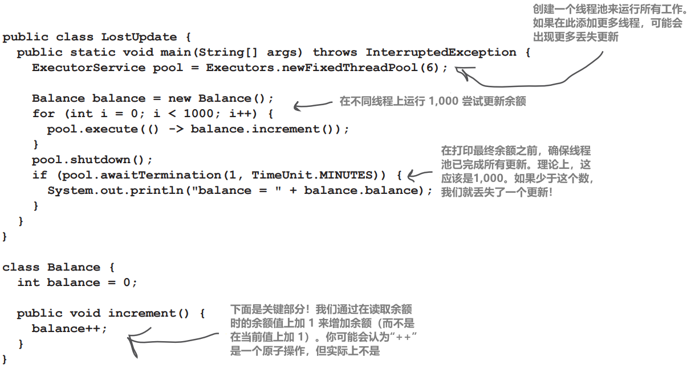
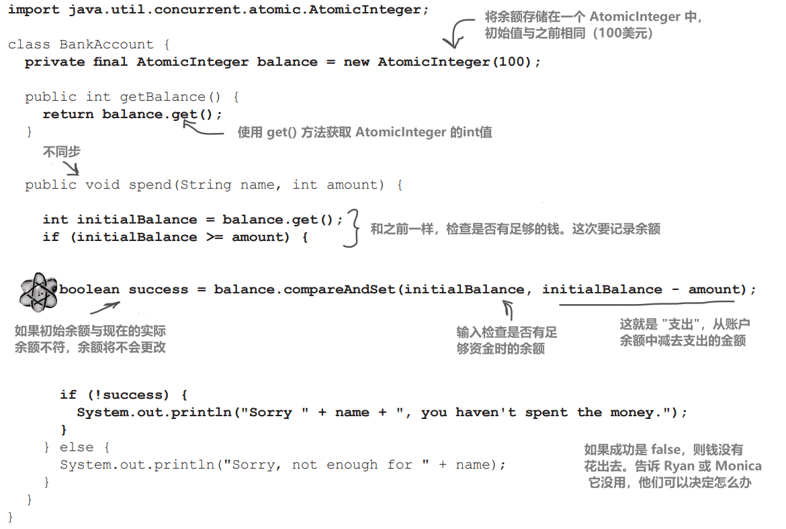
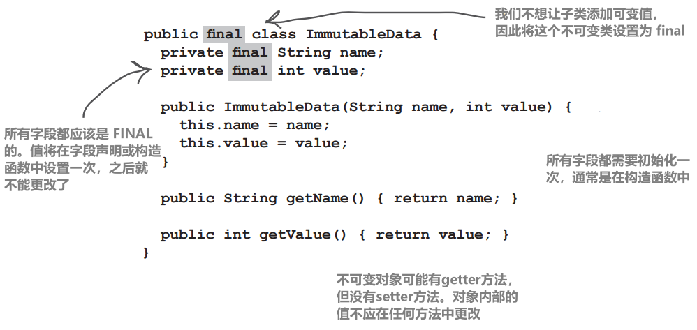
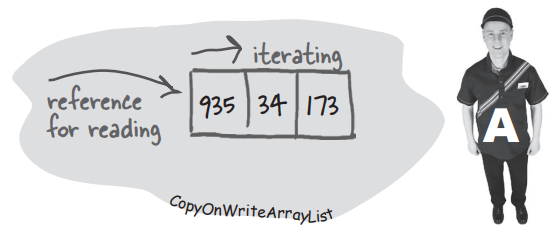

# 处理并发问题

# 竞态条件和不可变数据

# 可能会出什么问题？

## 并发问题

在上一章的结尾，我们暗示过，当你使用多线程代码时，可能并不都是美好的事情。实际上，我们甚至不止是暗示了！我们直接说道：

“这归结为一个潜在的致命场景：两个或更多线程可以访问单个对象的数据。”


为什么两个线程同时读写会有问题？如果一个线程先读取对象的数据，然后再更改它，为什么另一个线程也可能同时写入会有问题？

两夫妻Ryan and Monica同时使用一个银行账户然后透支

# 代码中的 Ryan 和 Monica 问题

下面的示例展示了两个线程（Ryan 和 Monica）共享一个对象（银行账户）时可能发生的情况

代码中有两个类：`BankAccount` 和 `RyanAndMonicaJob`。另外还有一个 `RyanAndMonicaTest` 类，其中包含一个 main 方法来运行所有内容。`RyanAndMonicaJob` 类实现了 `Runnable` 接口，代表了 Ryan 和 Monica 的行为——检查余额和花钱


`RyanAndMonicaJob` 类的实例变量包括共享的 `BankAccount`、个人姓名以及他们想要花费的金额。代码是这样工作的：

## 1、创建共享银行账户实例

创建一个新账户将正确设置所有默认值

```java
BankAccount account = new BankAccount();
```

## 2、为每个人创建一个 `RyanAndMonicaJob` 实例

我们需要为每个人创建一个工作。我们还需要让他们访问银行账户，并告诉他们要花多少钱

```java
RyanAndMonicaJob ryan = new RyanAndMonicaJob("Ryan", account, 50);
RyanAndMonicaJob monica = new RyanAndMonicaJob("Monica", account, 100);
```

## 3、创建 `ExecutorService` 并将两个 jobs 交给它

既然我们知道有两个 jobs，一个是 Ryan 的，另一个是 Monica 的，我们可以创建一个固定大小为两个线程的线程池

```java
ExecutorService executor = Executors.newFixedThreadPool(2);
executor.execute(ryan);
executor.execute(monica);
```

## 4、观看两个 jobs 的运行

一个线程代表 Ryan，另一个代表 Monica。两个线程在花钱前都会检查余额。请记住，当有多个线程同时运行时，不能假定只有你的线程在修改共享对象（如 BankAccount）。即使与共享对象相关的代码只有两行，而且彼此紧挨着

```java
if (account.getBalance() >= amount) {
    account.spend(amount);
} else {
    System.out.println("Sorry, not enough money");
}
```

在 **`goShopping()`** 方法中，执行 `Ryan` 和 `Monica` 要做的事情——检查余额，并且如果有足够的钱，就花钱

这应该可以防止透支账户

除非... 如果 `Ryan` 和 `Monica` 同时花钱，那么在另一个人花钱之前，银行账户中的钱可能就已经没了！

## Ryan和Monica的示例


**goShopping() 方法总是在取款前检查余额，但我们还是透支了**

**下面是一种情况：**

Ryan 查看了余额，发现有足够的钱，于是去结账

与此同时，Monica 查看了余额。她也看到有足够的钱。她不知道瑞安正要付钱

Ryan 完成购买

Monica 完成购买。大问题！在她检查余额并花钱之间的时间内，Ryan已经花了钱！

Monica 对账户的检查是无效的，因为 Ryan 已经检查过了，而且还在购物过程中

必须阻止 Monica 进入账户，直到 Ryan 完成，反之亦然

**这段代码并不是确定的；它并不总是每次都产生相同的结果。你可能需要运行几次才能发现问题**

**这在多线程代码中很常见，因为它取决于哪些线程先开始，以及每个线程何时在 CPU 内核上获得时间**


# 他们需要一个锁（lock）来访问账户！

## 锁的工作原理如下：


# 我们需要将检查余额和花钱作为一个原子操作来执行

**使用 synchronized（同步）**

我们需要确保，一旦某个线程开始购物交易，就必须在其他线程更改银行账户之前允许该线程完成交易

换句话说，我们需要确保一旦某个线程检查了账户余额，该线程就能保证在其他线程检查账户余额之前花费这笔钱！

在方法上或对象上使用 **`synchronized`** 关键字锁定对象，这样一次只能有一个线程使用该对象

这就是保护银行账户的方法！我们可以在进行银行交易的方法中为银行账户加锁。这样，即使该线程被线程调度器从 "运行" 状态中移出，或者另一个线程试图在同一时间进行更改，也只有一个线程可以从头到尾完成整个交易

在接下来的几页中，我们将了解可以锁定的不同内容。以 Ryan 和 Monica 为例，这很简单——我们要将购物交易包装在一个锁定银行账户的代码块中：

**`synchronized` 关键字意味着线程需要一个 key 才能访问同步代码**

**为了保护你的数据（如银行账户），请同步作用于该数据的代码**


（提醒对物理很了解的读者：是的，在这里使用“原子”一词并不反映整个亚原子粒子的事物。在涉及线程或事务的上下文中听到“原子”一词时，请思考牛顿而不是爱因斯坦。嘿，这不是我们的惯例。如果我们掌控了，我们可能会将海森堡不确定性原理应用于几乎所有与线程相关的事情。）

# 为什么不将类中的所有 getter 和 setter 与要保护的数据同步？

同步 getter 和 setter 是不够的。请记住，同步的目的是使代码的特定部分以原子方式工作。换句话说，我们关心的不仅仅是单个方法，而是需要多个步骤才能完成的方法！

想想看。我们在 `goShopping()` 方法中添加了一个同步块。如果同时同步 `getBalance()` 和 `spend()`，那也无济于事——Ryan（或Monica）会在检查余额后就返回了 key！关键是要在两个操作都完成之前保留 key

# 使用对象的锁

每个对象都有一把锁。大多数情况下，锁是未锁定的，你可以想象一个虚拟的钥匙与之相对应。只有当对象有同步块（如上一页）或类有同步方法时，对象锁才会发挥作用。如果方法声明中有 `synchronized` 关键字，该方法就是同步方法

当一个对象有一个或多个同步方法时，<span style="color:red;">**只有当线程可以获得对象锁的 key 时，线程才能进入同步方法！**</span>

锁不是针对方法而是针对对象的。如果一个对象有两个同步方法，这不仅意味着两个线程不能进入同一个方法。它意味着不能有两个线程进入任何一个同步方法。如果在同一个对象上有两个同步方法，即 `method1()` 和 `method2()`，如果一个线程在 `method1()`，第二个线程显然不能进入 `method1()`，但它也不能进入 `method2()`，或该对象上的任何其他同步方法

想想看。如果有多个方法可能作用于对象的实例变量，那么所有这些方法都需要用 `synchronized` 来保护

同步的目的是保护关键数据。但请记住，你锁定的不是数据本身，而是同步访问这些数据的方法

那么，当线程在其调用栈中运行（从 `run()` 方法开始）时，突然遇到一个同步方法，会发生什么情况呢？线程会意识到，在进入该方法之前，它需要该对象的 key。它会查找 key（所有这些都由 JVM 处理；Java 中没有访问对象锁的 API），如果 key 可用，线程就会抓取 key 并进入方法

从那时起，线程就会紧紧抓住该 key，就像线程的生命取决于它一样。直到完成同步方法或代码块，线程才会放弃 key。因此，当该线程持有 key 时，其他线程无法进入该对象的任何同步方法或代码块，因为该对象的 key 无法使用

<span style="color:red;">

**每个 Java 对象都有一个锁。锁只有一个 key**

**大多数情况下，锁是未锁定的，也没人在乎**

**但如果一个对象有同步方法，那么只有在对象锁的 key 可用的情况下，线程才能进入其中一个同步方法。换句话说，只有当另一个线程还没有抢到这把 key 时**

</span>

# 使用同步方法

我们能否同步 `goShopping()` 方法来解决 `Ryan` 和 `Monica` 的问题？


`synchronized` 关键字会锁定一个对象。`goShopping()` 方法位于 RyanAndMonicaJob 中。同步实例方法意味着 "锁定这个 RyanAndMonicaJob 实例"。然而，RyanAndMonicaJob 有两个实例，一个是 "ryan"，另一个是 "monica"。如果 "ryan" 被锁定，"monica" 仍然可以对银行账户进行更改；她并不关心 "ryan" job 是否被锁定

需要锁定的对象，也就是这两个线程争夺的对象，是 BankAccount。在 RyanAndMonicaJob 中的方法上设置同步（并锁定 RyanAndMonicaJob 实例）并不能解决任何问题

# 锁定正确的对象很重要

由于共享的是 `BankAccount` 对象，因此可以说应该由 `BankAccount` 负责确保多个线程可以安全使用。`BankAccount` 上的 `spend()` 方法可以确保有足够的资金并在单笔交易中从账户中扣除


# 如何保护静态变量状态？如果有改变静态变量状态的静态方法，还能使用同步吗？

可以！请记住，静态方法是针对类运行的，而不是针对类的单个实例运行的。那么你可能会想，静态方法会使用谁的对象锁？毕竟，可能根本就没有该类的任何实例。幸运的是，正如每个对象都有自己的锁一样，每个加载的类也有一个锁。也就是说，如果堆上有三个 Dog 对象，那么总共就有四个与 Dog 相关的锁：三个属于三个 Dog 实例，一个属于 Dog 类本身。同步静态方法时，Java 会使用类本身的锁。因此，如果同步一个类中的两个静态方法，线程将需要类锁才能进入其中任何一个方法

# 可怕的 "更新丢失" 问题

这是另一个典型的并发问题。有时你会听到它们被称为 "竞赛条件"，即两个或多个线程同时更改相同的数据。它与 Ryan 和 Monica 的故事密切相关，因此我们将用这个例子来说明更多要点

丢失的更新围绕一个流程进行：

第 1 步：获取账户余额

```java
int i = balance;
```

第 2 步：将余额增加1

```java
balance = i + 1; //可能不是一个原子过程
```

即使我们使用更常见的 `balance++` 语法，也不能保证编译后的字节码是一个 "原子过程"。事实上，它很可能不是——它实际上是多个操作：先读取当前值，然后将其增加一，并将其设置回原始变量

在 "丢失更新" 问题中，我们有多个线程试图增加余额。先看看代码，然后我们再来看看真正的问题：



# 让我们运行这段代码

## 1、线程 A 运行一段时间

读取余额： 0
将余额值设置为 0 + 1
现在余额为 1

读取余额：1
将余额值设置为 1 + 1
现在余额为 2

## 2、线程 B 运行一段时间

读取余额：2
将余额值设置为 2 + 1
现在余额为 3

读取余额： 3
[现在线程 B 在将余额值设置为 4 之前被送回可运行状态］

## 3、线程 A 再次运行，从上次停止的地方继续

读取余额： 3
将余额值设置为 3 + 1
现在余额为 4

读取余额： 4
将余额值设为 4 + 1
现在余额为 5

## 4、线程 B 再次运行，并从上次中断的地方继续运行！

将余额设置为 3 + 1
现在余额为 4

呀！！

线程A将其更新为5，但现在B又回来了，并覆盖了A所做的更新，就好像A的更新从未发生过一样

**我们失去了线程 A 的最后一次更新！线程B之前曾对余额的值进行了“读取”，当B醒来时，它继续进行，就好像从未中断过一样**

# 让 increment() 方法成为原子操作。同步！

通过同步 `increment()` 方法，可以解决“丢失更新”问题，因为它将方法中的步骤（读取余额和增加余额）作为一个不可分割的单元


**一旦一个线程进入该方法，我们必须确保在其他线程进入该方法之前，该方法中的所有步骤都已完成（作为一个原子进程）**

# 为了线程安全，同步一切似乎是个好主意

不，这不是个好主意。同步不是免费的。首先，同步方法有一定的开销。换句话说，当代码使用同步方法时，在解决 "key是否可用" 的问题时，性能会受到影响（尽管通常你不会注意到）

其次，同步方法会降低程序的运行速度，因为同步限制了并发性。换句话说，同步方法会迫使其他线程排队等待。这在你的代码中可能不是问题，但你必须考虑到这一点

第三，也是最可怕的一点，同步方法可能会导致死锁！(我们将在几页中看到这一点）

一个很好的经验法则是只同步应该同步的最少部分。事实上，同步的粒度甚至可以比方法更小。请记住，你可以使用 `synchronized` 关键字来在更细粒度的级别上同步一个或多个语句，而不是在整个方法级别上同步（我们在解决 Ryan 和 Monica 问题的第一个方案中使用了这个方法）


## 1、线程 A 运行一段时间

尝试输入 `increment()` 方法

该方法被同步，因此要获取该对象的 key

读取余额： 0

将余额值设置为 0 + 1

现在余额为 1

**返回 key**（它完成了 increment() 方法）

再次进入 `increment()` 方法并**获取 key**

读取余额：1

[现在线程 A 放回可运行状态，但由于它没有完成同步方法，所以线程 A 保留了 key］

## 2、线程 B 被选中运行

尝试进入 `increment()` 方法。该方法是同步的，因此我们需要获取 key

**key 不可用**

[现在线程B被发送到一个“对象锁不可用”的等候室］

## 3、线程 A 再次运行，从上次停止的地方继续（记住，它仍然拥有 key）

设置余额值 1 + 1

现在余额为 2

**返回 key**

[现在线程 A 被重新放回可运行状态，但由于它已经完成了 increment() 方法，因此线程不会保留 key］

## 4、选择线程 B 运行

尝试进入 `increment()` 方法。该方法被同步，因此我们需要获取 key

这次，key 是可用的；获取 key

读取余额：2

[继续运行......]

# 死锁（Deadlock），同步的致命一面

同步功能让 Ryan 和 Monica 不用同时使用他们的银行账户，也让我们免于丢失更新。但我们也提到过，我们不应该同步所有内容，原因之一是同步会减慢程序的运行速度

还有一个重要的考虑因素：我们需要谨慎使用同步代码，因为没有什么比线程死锁更能让你的程序崩溃了。当两个线程都持有另一个线程想要的键时，就会出现线程死锁。在这种情况下，两个线程无法脱身，只能静静地等待。等待。一直等待

如果你熟悉数据库或其他应用服务器，你可能会认出这个问题；数据库通常有一个类似同步的锁定机制。但真正的事务管理系统有时也会处理死锁。例如，当两个事务耗时过长无法完成时，系统可能会认为发生了死锁。但与 Java 不同的是，应用服务器可以进行 "事务回滚"，将回滚事务的状态恢复到事务（原子部分）开始之前的状态

Java 没有处理死锁的机制。它甚至不知道发生了死锁。因此，你需要谨慎设计。关于死锁的详细内容，我们在本页就不多说了，所以如果你发现自己在写多线程代码，你可能想要学习Brian Goetz等人编写的《Java并发实践》。它详细介绍了你可能在并发中面临的各种问题（如死锁），以及解决这些问题的方法


## 一个简单的死锁情景：


# 不必总是使用 `synchronized`

由于同步会带来一些代价（如性能和潜在的死锁），你应该了解其他管理线程间共享数据的方法。`java.util.concurrent` 包中有大量用于处理多线程代码的类和实用程序

## 原子变量

如果共享数据是 int、long 或 boolean 类型，我们可以用原子变量来代替它。这些类提供的方法是原子的，也就是说，一个线程可以安全地使用这些方法，而不必担心另一个线程会同时改变对象的值

原子变量有几种类型，例如 AtomicInteger、AtomicLong、AtomicBoolean和AtomicReference

我们可以使用 AtomicInteger 来解决更新丢失的问题，而不用同步 increment 方法


因此，只要我想做的只是一个简单的增量，我就可以使用 AtomicInteger。如果我想做复杂计算等正常的事情，这对我有什么帮助？

原子变量在使用比较和交换（compare-and-swap，CAS）操作时会变得更加有趣。CAS 是对数值进行原子更改的另一种方法。你可以使用 `compareAndSet` 方法在原子变量上使用 CAS。是的，名称略有不同！编程就是这样，命名总是最难解决的问题

`compareAndSet` 方法接受一个值，也就是原子变量的预期值，将其与当前值进行比较，如果匹配，则操作完成

事实上，我们可以用它来解决 Ryan 和 Monica 的问题，而不是用 synchronized 来锁定整个银行账户

# 使用原子变量进行比较和交换

原子变量

我们如何利用原子变量和 CAS（通过 `compareAndSet`）来解决 Ryan 和 Monica 的问题呢？

由于 Ryan 和 Monica 都在尝试访问一个 int 值（账户余额），我们可以使用一个 `AtomicInteger` 来存储该余额。然后，当有人想花钱时，我们就可以使用 `compareAndSet` 来更新余额


用简单的英语说："<span style="color:red;">**只有当当前余额与这个预期值相同时，才将余额设置为这个新值，并告诉我余额是否真的发生了变化**</span>"

比较和交换使用乐观锁。乐观锁定意味着你不会阻止所有线程访问对象；你会尝试进行更改，但你要接受更改可能不会发生的事实。如果更改不成功，你将决定如何处理。你可能会决定再试一次，或者发送一条消息让用户知道它没有成功

这可能比简单地将所有其他线程锁定在对象之外更费事，但可能比锁定所有线程更快。例如，如果同时发生多个写入操作的几率很低，或者读取的线程很多而写入的线程不多，那么你可能不想为每次写入支付锁定的代价

<span style="color:red;">**使用 CAS 操作时，必须处理操作不成功的情况**</span>

# Ryan 和 Monica，原子运行

让我们在 Ryan 和 Monica 的银行账户中看看整个过程。我们将余额放入一个 `AtomicInteger` 中，然后使用 `compareAndSet` 对余额进行原子更改




**java.util.concurrent 拥有大量有用的类和实用程序，可用于处理多线程代码。一起来看看吧！**

如果所有这些问题都是由于向共享对象写入数据造成的，那么如果我们阻止线程更改共享对象中的数据呢？有办法做到这一点吗？

<span style="color:red;">**如果要在线程之间共享对象，并且不想让线程更改其数据，那么就应该使对象不可变**</span>

# 编写不可变数据类



有时，添加 final 关键字并不足以防止更改。你认为什么时候 可能会出现这种情况？我们给你提供一条线索.…

# 使用不可变对象

更改共享对象上的数据并假定所有其他线程都能看到这些更改是非常方便的

不过，我们也看到，虽然这样做很方便，但并不安全

另一方面，当一个线程正在处理一个无法更改的对象时，它可以对该对象中的数据做出假设；例如，一旦线程从该对象中读取了一个值，它就知道该数据不会更改

我们不需要使用同步或其他机制来控制由谁更改数据，因为数据不会改变

## 使用不可变对象意味着以一种不同的方式思考

我们不是对同一个对象进行更改，而是用一个新对象替换旧对象。新对象拥有更新后的值，任何需要新值的线程都需要使用新对象

旧对象会怎样呢？好吧，如果它还在被某些东西使用（可能是--有时使用旧数据是完全正确的），它就会挂在堆上。如果它没有被使用，就会被垃圾回收，我们就不用再担心它了

# 更改不可变数据

更改不可变对象

试想一个有客户的系统，每个客户对象都有一个地址，代表客户的街道地址。如果客户的 Address 是不可变对象（其所有字段都是 final，数据不可更改），那么当客户搬家时，如何更改客户的地址呢？

## 1、客户有一个指向包含客户街道地址数据的原始地址对象的引用


## 2、当客户搬家时，会创建一个全新的地址对象，其中包含客户的新街道地址


## 3、客户对象对他们地址的引用被更改，指向新的地址对象


# 如果程序的其他部分引用了旧地址，会发生什么情况？

实际上，有时我们希望这样。想象一下，客户下了一个订单，要把货送到他们原来的地址。我们仍然希望该订单的详细信息包含原始地址；我们不希望它包含新地址的详细信息

一旦客户更改了地址（并且 Customer 包含对新地址对象的引用），那么我们希望新的订单使用新的 Address 对象

请稍等一下！地址对象是不可变的，不会改变，但 Customer 对象仍然必须改变

完全正确。如果系统中的数据会发生变化，那么这些变化就必须发生在某个地方。从这一讨论中得出的关键观点是，并非应用程序中的所有类都必须有变化的数据。事实上，我们主张尽量减少发生变化的地方。这样，需要考虑多个线程同时进行更改时会发生什么情况的地方就少得多

有很多技术可以有效地使用不可变数据类；我们在这里只是浅尝辄止。值得注意的是，Java 16 引入了记录（records），这是一种由语言直接提供的不可变数据类

**尽可能使用不可变数据类。限制多个线程可更改数据的位置数量**

# 共享数据的更多问题

我们就快成功了，我们保证！还有最后一件事要看。到目前为止，我们已经看到了许多可能由多个线程写入相同数据而引发的问题。这也适用于集合中的数据。

如果有很多线程读取相同的数据，即使只有一个线程对其进行修改，也会出现问题

这段代码中只有一个线程在写入集合，但有两个线程在读取集合


# 从不断变化的数据结构中读取数据会导致异常

运行上一页的代码有时会导致异常抛出。现在你已经知道，这类问题在很大程度上取决于硬件、操作系统和 JVM 的奇思妙想


当读取线程正在读取的 List 发生变化时，读取线程会抛出 `ConcurrentModificationException` 异常

**如果一个集合在另一个线程正在读取时被修改，就可能会出现`ConcurrentModificationException` 异常**

# 使用线程安全数据结构

并发数据结构

如果有线程同时读取正在更改的数据，那么好端端的 `ArrayList` 显然无法满足需要。幸运的是，我们还有其他选择。我们需要一个线程安全的数据结构，一个可以同时被多个线程写入和读取的数据结构

`java.util.concurrent` 包中有许多线程安全数据结构，我们将使用 `CopyOnWriteArrayList` 来解决这个特定问题

`CopyOnWriteArrayList` 是一个合理的选择，因为它可以处理一个经**常被读取但不经常更改**的 List。稍后我们将了解原因


```java
public class ConcurrentReaders {
    public static void main(String[] args) {
        List<Chat> chatHistory = new CopyOnWriteArrayList<>();
        ExecutorService executor = Executors.newFixedThreadPool(3);
        for (int i = 0; i < 5; i++) {
            executor.execute(() -> chatHistory.add(new Chat("Hi there!")));
            executor.execute(() -> System.out.println(chatHistory));
            executor.execute(() -> System.out.println(chatHistory));
        }
        executor.shutdown();
    }
}
```


# CopyOnWriteArrayList

`CopyOnWriteArrayList` 使用不可变性来为读取线程提供安全访问，同时其他线程正在写入

它是如何工作的？实际上，它的实现很简单：当线程写入列表时，它实际上是在写入列表的副本。当更改完成后，新的副本将替换原始列表。在此期间，任何在更改之前读取列表的线程都可以安全地读取原始列表

1、`CopyOnWriteArrayList` 的实例包含一组有序的数据，就像数组一样


2、当线程 A 读取 `CopyOnWriteArrayList` 时，它会得到一个迭代器，允许它读取当时的列表数据快照（snapshot）



3、线程 B 通过添加新元素向 `CopyOnWriteArrayList` 写入数据，而 `CopyOnWriteArray` 会在做出任何更改之前创建列表数据的副本。这对任何读取或写入线程都是不可见的


4、当线程 B 对 "列表" 进行更改时，它实际上是对此副本进行更改。它知道更改正在进行中。像线程A这样的读取线程根本不受影响；它们正在遍历原始数据的快照


5、一旦线程 B 完成更新，原始数据就会被新数据替换。如果线程 A 仍在读取，它就在安全地读取旧数据。如果其他线程在更改后开始读取，它们就会获得新数据


# 使用 CopyOnWriteArrayList 是不是意味着某些读取线程将读取旧数据？

是的，读取线程将始终使用它们刚开始读取时的数据快照。这意味着数据在某些时候可能会过时，但至少不会抛出ConcurrentModificationException（并发修改异常）

# 使用过时的数据不好吗？

不一定。在许多系统中，这已经 "足够好" 了。举个例子，想想一个显示实时新闻的网站。是的，你希望它是最新的，但不一定要更新到最新的毫秒；如果有些新闻是几秒钟前的，那也没问题

# 但我不希望我的银行对账单稍有过时！如何确保关键共享数据始终正确？

如果所有线程都需要使用完全相同的数据，那么 `CopyOnWriteArrayList` 可能不是正确的选择。其他数据结构（如 Vector）通过使用锁来确保每次只有一个线程可以访问数据，从而提供线程安全。这样做虽然安全，但速度可能会很慢——如果你的线程需要等待轮到自己访问数据，你就无法从多线程中获得任何好处

# 那么 `CopyOnWriteArrayList` 是一种快速线程安全数据结构吗？

嗯......这要看情况！如果有很多读取线程，而写入线程不多，那么它就是快速的（与锁定的集合相比）。但如果写入量很大，它可能就不是最好的数据结构了。对于某些应用程序来说，每次写入都要创建一个新的数据副本，成本可能太高

# 为什么没有一个简单的答案来说明并发编程的最佳方法？

并发编程就是权衡利弊。你需要充分了解你的应用程序在做什么、应该如何工作以及运行它的硬件和环境。如果你发现自己不知道哪种方法更适合你的应用程序，这可能是学习性能测试的好时机，这样你就能准确衡量每种方法对系统性能的影响

# 你从未告诉过我们，在字段声明中添加 final 并不足以确保该值永不更改。这是怎么回事？

说得好！问题在于，如果你的字段是对另一个对象（如集合或你自己的一个对象）的引用，那么使用 `final` 并不能阻止另一个线程更改该对象内部的值。要确保这种情况不会发生，唯一的办法就是确保所有作为引用的字段只指向不可变对象本身。否则，你的不可变对象可能会有可变的数据。[请参见第662页上的LocalDateTime案例](#共享数据的更多问题)

**Java 早期版本中的线程安全集合是通过锁定实现安全的。例如，`java.util.Vector.Concurrent.Concurrent.Concurrent.SQL`**

**Java 5 在 `java.util.concurrent` 中引入了并发数据结构。这些数据结构不使用锁定**