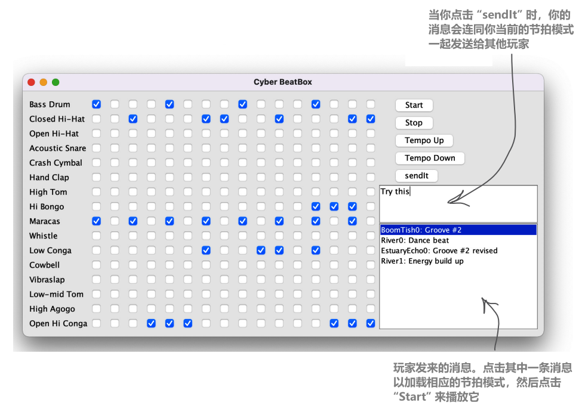
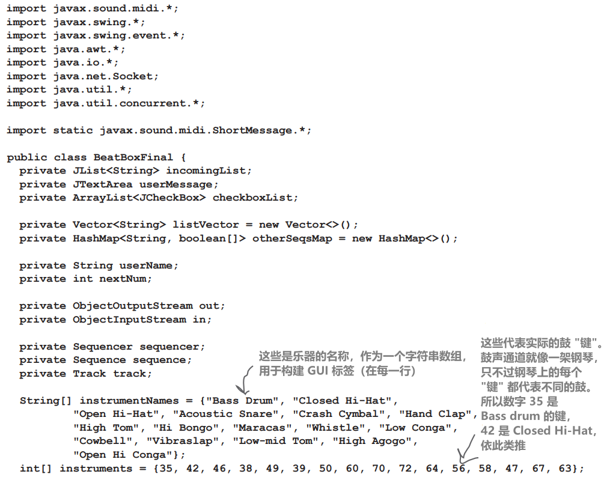
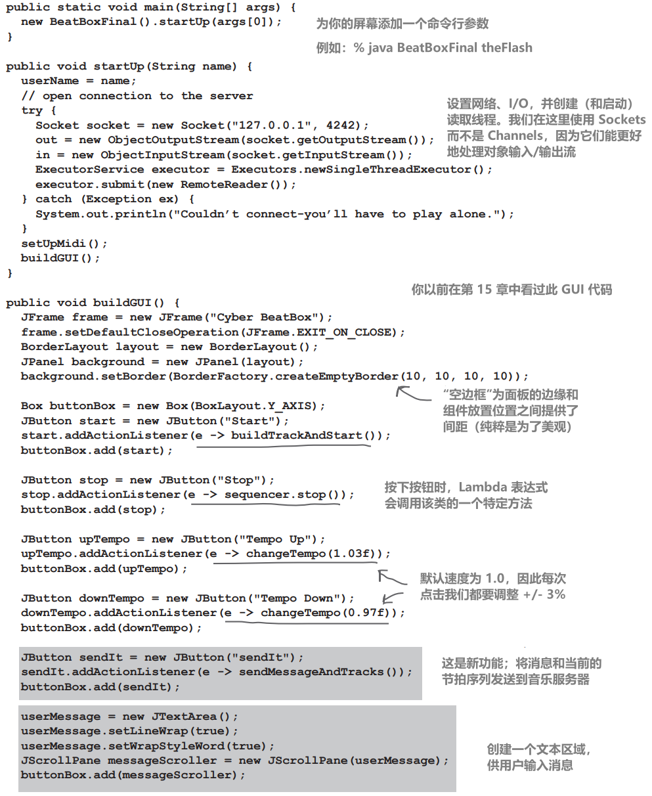
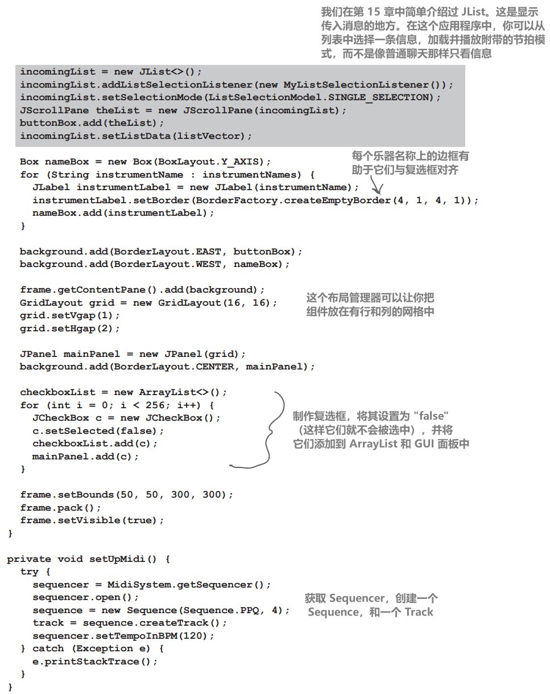
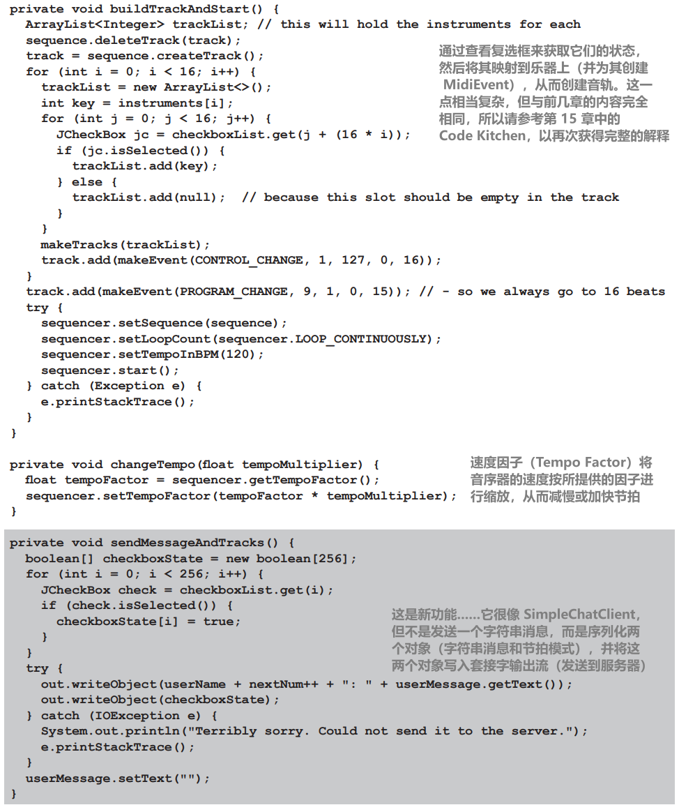
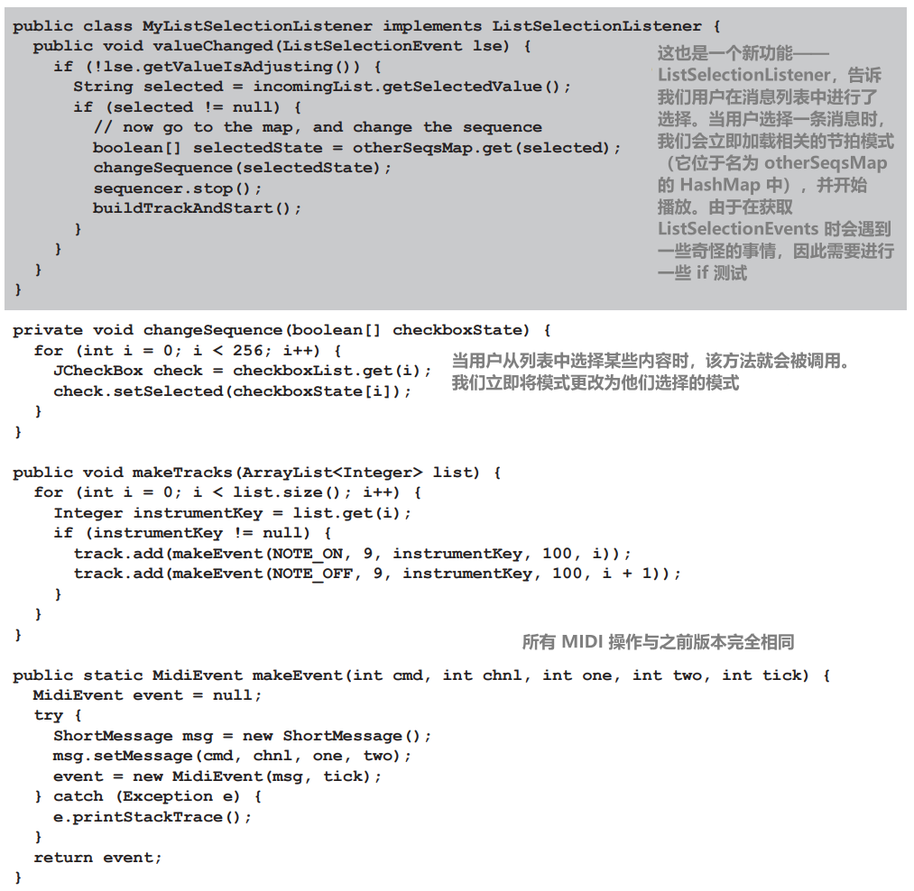
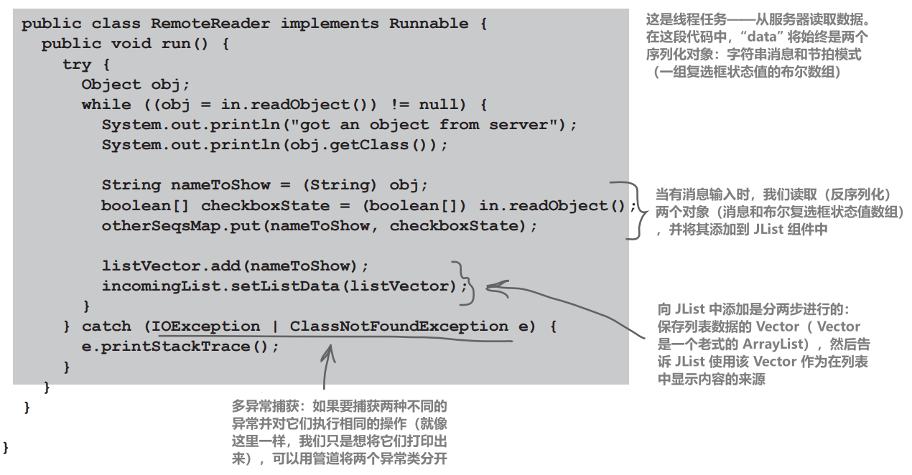
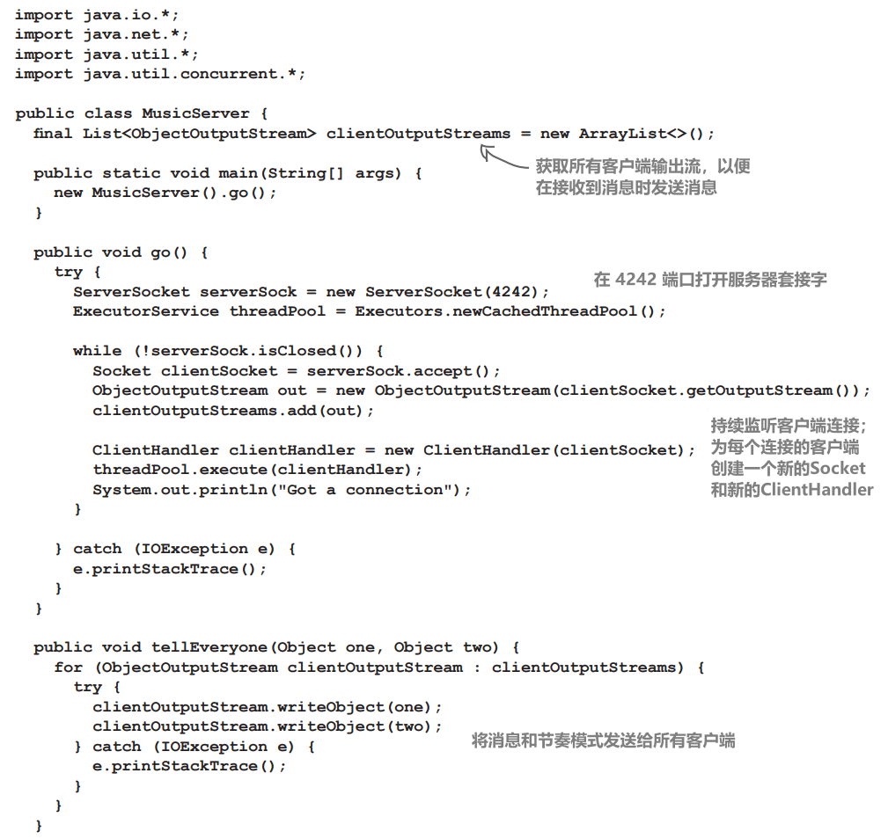
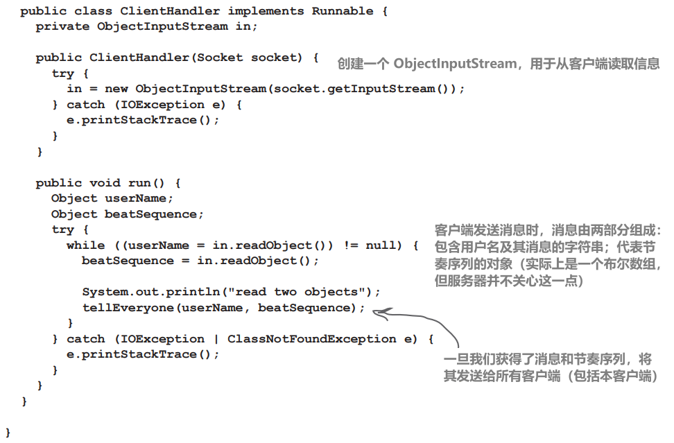

# Final Code Kitchen



**最终，完整版本的BeatBox！**

**这样你就可以与其他客户端发送和接收节拍模式**

# Final BeatBox client program

大部分代码与前几章的 Code Kitchen 中的代码相同，因此我们不会再次对整个代码进行注释。新添加的部分包括：

GUI： 添加了两个新组件，用于显示传入消息的文本区域（实际上是一个滚动列表）和文本字段

网络：与本章中的 SimpleChatClient 一样，BeatBox 现在也能连接服务器并获得输入和输出流

多线程：同样，就像 SimpleChatClient 一样，我们启动了一个 “reader” 任务，不断从服务器查找传入的消息。不过，传入的消息不只是文本，还包括两个对象：字符串消息和序列化数组（保存所有复选框状态的东西）

所有代码请访问 https://oreil.ly/hfJava_3e_examples













```java
import javax.sound.midi.*;
import javax.swing.*;
import javax.swing.event.*;
import java.awt.*;
import java.io.*;
import java.net.Socket;
import java.util.*;
import java.util.concurrent.*;

import static javax.sound.midi.ShortMessage.*;

public class BeatBoxFinal {
    private JList<String> incomingList;
    private JTextArea userMessage;
    private ArrayList<JCheckBox> checkboxList;

    private Vector<String> listVector = new Vector<>();
    private HashMap<String, boolean[]> otherSeqsMap = new HashMap<>();

    private String userName;
    private int nextNum;

    private ObjectOutputStream out;
    private ObjectInputStream in;

    private Sequencer sequencer;
    private Sequence sequence;
    private Track track;

    String[] instrumentNames = {"Bass Drum", "Closed Hi-Hat",
                                "Open Hi-Hat", "Acoustic Snare", "Crash Cymbal", "Hand Clap",
                                "High Tom", "Hi Bongo", "Maracas", "Whistle", "Low Conga",
                                "Cowbell", "Vibraslap", "Low-mid Tom", "High Agogo",
                                "Open Hi Conga"
                               };
    int[] instruments = {35, 42, 46, 38, 49, 39, 50, 60, 70, 72, 64, 56, 58, 47, 67, 63};

    public static void main(String[] args) {
        new BeatBoxFinal().startUp(args[0]);
    }

    public void startUp(String name) {
        userName = name;
        // open connection to the server
        try {
            Socket socket = new Socket("127.0.0.1", 4242);
            out = new ObjectOutputStream(socket.getOutputStream());
            in = new ObjectInputStream(socket.getInputStream());
            ExecutorService executor = Executors.newSingleThreadExecutor();
            executor.submit(new RemoteReader());
        } catch (Exception ex) {
            System.out.println("Couldn’t connect-you’ll have to play alone.");
        }
        setUpMidi();
        buildGUI();
    }

    public void buildGUI() {
        JFrame frame = new JFrame("Cyber BeatBox");
        frame.setDefaultCloseOperation(JFrame.EXIT_ON_CLOSE);
        BorderLayout layout = new BorderLayout();
        JPanel background = new JPanel(layout);
        background.setBorder(BorderFactory.createEmptyBorder(10, 10, 10, 10));

        Box buttonBox = new Box(BoxLayout.Y_AXIS);
        JButton start = new JButton("Start");
        start.addActionListener(e -> buildTrackAndStart());
        buttonBox.add(start);

        JButton stop = new JButton("Stop");
        stop.addActionListener(e -> sequencer.stop());
        buttonBox.add(stop);

        JButton upTempo = new JButton("Tempo Up");
        upTempo.addActionListener(e -> changeTempo(1.03f));
        buttonBox.add(upTempo);

        JButton downTempo = new JButton("Tempo Down");
        downTempo.addActionListener(e -> changeTempo(0.97f));
        buttonBox.add(downTempo);

        JButton sendIt = new JButton("sendIt");
        sendIt.addActionListener(e -> sendMessageAndTracks());
        buttonBox.add(sendIt);

        userMessage = new JTextArea();
        userMessage.setLineWrap(true);
        userMessage.setWrapStyleWord(true);
        JScrollPane messageScroller = new JScrollPane(userMessage);
        buttonBox.add(messageScroller);

        incomingList = new JList<>();
        incomingList.addListSelectionListener(new MyListSelectionListener());
        incomingList.setSelectionMode(ListSelectionModel.SINGLE_SELECTION);
        JScrollPane theList = new JScrollPane(incomingList);
        buttonBox.add(theList);
        incomingList.setListData(listVector);

        Box nameBox = new Box(BoxLayout.Y_AXIS);
        for (String instrumentName : instrumentNames) {
            JLabel instrumentLabel = new JLabel(instrumentName);
            instrumentLabel.setBorder(BorderFactory.createEmptyBorder(4, 1, 4, 1));
            nameBox.add(instrumentLabel);
        }

        background.add(BorderLayout.EAST, buttonBox);
        background.add(BorderLayout.WEST, nameBox);

        frame.getContentPane().add(background);
        GridLayout grid = new GridLayout(16, 16);
        grid.setVgap(1);
        grid.setHgap(2);

        JPanel mainPanel = new JPanel(grid);
        background.add(BorderLayout.CENTER, mainPanel);

        checkboxList = new ArrayList<>();
        for (int i = 0; i < 256; i++) {
            JCheckBox c = new JCheckBox();
            c.setSelected(false);
            checkboxList.add(c);
            mainPanel.add(c);
        }

        frame.setBounds(50, 50, 300, 300);
        frame.pack();
        frame.setVisible(true);
    }

    private void setUpMidi() {
        try {
            sequencer = MidiSystem.getSequencer();
            sequencer.open();
            sequence = new Sequence(Sequence.PPQ, 4);
            track = sequence.createTrack();
            sequencer.setTempoInBPM(120);
        } catch (Exception e) {
            e.printStackTrace();
        }
    }

    private void buildTrackAndStart() {
        ArrayList<Integer> trackList; // this will hold the instruments for each
        sequence.deleteTrack(track);
        track = sequence.createTrack();
        for (int i = 0; i < 16; i++) {
            trackList = new ArrayList<>();
            int key = instruments[i];
            for (int j = 0; j < 16; j++) {
                JCheckBox jc = checkboxList.get(j + (16 * i));
                if (jc.isSelected()) {
                    trackList.add(key);
                } else {
                    trackList.add(null); // because this slot should be empty in the track
                }
            }
            makeTracks(trackList);
            track.add(makeEvent(CONTROL_CHANGE, 1, 127, 0, 16));
        }
        track.add(makeEvent(PROGRAM_CHANGE, 9, 1, 0, 15)); // - so we always go to 16 beats
        try {
            sequencer.setSequence(sequence);
            sequencer.setLoopCount(sequencer.LOOP_CONTINUOUSLY);
            sequencer.setTempoInBPM(120);
            sequencer.start();
        } catch (Exception e) {
            e.printStackTrace();
        }
    }

    private void changeTempo(float tempoMultiplier) {
        float tempoFactor = sequencer.getTempoFactor();
        sequencer.setTempoFactor(tempoFactor * tempoMultiplier);
    }

    private void sendMessageAndTracks() {
        boolean[] checkboxState = new boolean[256];
        for (int i = 0; i < 256; i++) {
            JCheckBox check = checkboxList.get(i);
            if (check.isSelected()) {
                checkboxState[i] = true;
            }
        }
        try {
            out.writeObject(userName + nextNum++ + ": " + userMessage.getText());
            out.writeObject(checkboxState);
        } catch (IOException e) {
            System.out.println("Terribly sorry. Could not send it to the server.");
            e.printStackTrace();
        }
        userMessage.setText("");
    }

    public class MyListSelectionListener implements ListSelectionListener {
        public void valueChanged(ListSelectionEvent lse) {
            if (!lse.getValueIsAdjusting()) {
                String selected = incomingList.getSelectedValue();
                if (selected != null) {
                    // now go to the map, and change the sequence
                    boolean[] selectedState = otherSeqsMap.get(selected);
                    changeSequence(selectedState);
                    sequencer.stop();
                    buildTrackAndStart();
                }
            }
        }
    }

    private void changeSequence(boolean[] checkboxState) {
        for (int i = 0; i < 256; i++) {
            JCheckBox check = checkboxList.get(i);
            check.setSelected(checkboxState[i]);
        }
    }

    public void makeTracks(ArrayList<Integer> list) {
        for (int i = 0; i < list.size(); i++) {
            Integer instrumentKey = list.get(i);
            if (instrumentKey != null) {
                track.add(makeEvent(NOTE_ON, 9, instrumentKey, 100, i));
                track.add(makeEvent(NOTE_OFF, 9, instrumentKey, 100, i + 1));
            }
        }
    }

    public static MidiEvent makeEvent(int cmd, int chnl, int one, int two, int tick) {
        MidiEvent event = null;
        try {
            ShortMessage msg = new ShortMessage();
            msg.setMessage(cmd, chnl, one, two);
            event = new MidiEvent(msg, tick);
        } catch (Exception e) {
            e.printStackTrace();
        }
        return event;
    }

    public class RemoteReader implements Runnable {
        public void run() {
            try {
                Object obj;
                while ((obj = in.readObject()) != null) {
                    System.out.println("got an object from server");
                    System.out.println(obj.getClass());
					
                    String nameToShow = (String) obj;
                    boolean[] checkboxState = (boolean[]) in.readObject();
                    otherSeqsMap.put(nameToShow, checkboxState);
					
                    listVector.add(nameToShow);
                    incomingList.setListData(listVector);
                }
            } catch (IOException | ClassNotFoundException e) {
                e.printStackTrace();
            }
        }
    }
}
```

### 有哪些方式可以改进这个程序呢？

这里有几个想法供您参考：

1. 一旦你选择了一个模式，当前播放的模式就会被覆盖掉。如果这是你正在制作的新模式（或对另一个模式的修改），那就糟糕了。你可能希望弹出一个对话框，询问用户是否想要保存当前的模式
2. 如果你未能输入命令行参数，运行时就会直接抛出异常！在主方法中添加一些代码来检查是否传入了命令行参数。如果用户没有提供参数，可以选择一个默认值，或者打印一条消息，告诉他们需要再次运行程序，但这次要提供一个屏幕名称的参数
3. 可以添加一个功能，让你点击一个按钮，它会为你生成一个随机模式。也许你会喜欢上其中的某一个。更好的是，还可以添加另一个功能，让你加载现有的“基础”模式，比如爵士乐、摇滚乐、雷鬼等等，用户可以添加到其中

你不必输入所有代码！你可以从 https://oreil.ly/hfJava_3e_examples 上的软件仓库克隆它的所有代码

还有另一种 BeatBox 解决方案，它使用了Maps和Lists来代替本解决方案中使用的数组。解决任何问题的方法都不止一种！

# Final BeatBox server program

这段代码的大部分内容与我们在第 17 章 "建立连接" 中创建的 SimpleChatServer 完全相同。事实上，唯一的区别是，该服务器接收并重新发送两个序列化对象，而不是纯字符串（尽管其中一个序列化对象恰好是字符串）





```java
import java.io.*;
import java.net.*;
import java.util.*;
import java.util.concurrent.*;

public class MusicServer {
    final List<ObjectOutputStream> clientOutputStreams = new ArrayList<>();

    public static void main(String[] args) {
        new MusicServer().go();
    }

    public void go() {
        try {
            ServerSocket serverSock = new ServerSocket(4242);
            ExecutorService threadPool = Executors.newCachedThreadPool();

            while (!serverSock.isClosed()) {
                Socket clientSocket = serverSock.accept();
                ObjectOutputStream out = new ObjectOutputStream(clientSocket.getOutputStream());
                clientOutputStreams.add(out);

                ClientHandler clientHandler = new ClientHandler(clientSocket);
                threadPool.execute(clientHandler);
                System.out.println("Got a connection");
            }

        } catch (IOException e) {
            e.printStackTrace();
        }
    }

    public void tellEveryone(Object one, Object two) {
        for (ObjectOutputStream clientOutputStream : clientOutputStreams) {
            try {
                clientOutputStream.writeObject(one);
                clientOutputStream.writeObject(two);
            } catch (IOException e) {
                e.printStackTrace();
            }
        }
    }

    public class ClientHandler implements Runnable {
        private ObjectInputStream in;
		
        public ClientHandler(Socket socket) {
            try {
                in = new ObjectInputStream(socket.getInputStream());
            } catch (IOException e) {
                e.printStackTrace();
            }
        }
		
        public void run() {
            Object userName;
            Object beatSequence;
            try {
                while ((userName = in.readObject()) != null) {
                    beatSequence = in.readObject();
					
                    System.out.println("read two objects");
                    tellEveryone(userName, beatSequence);
                }
            } catch (IOException | ClassNotFoundException e) {
                e.printStackTrace();
            }
        }
    }
}
```