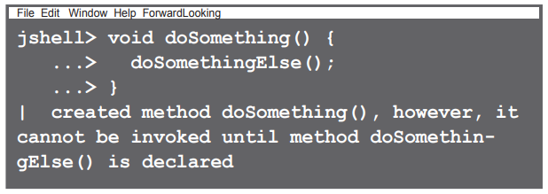
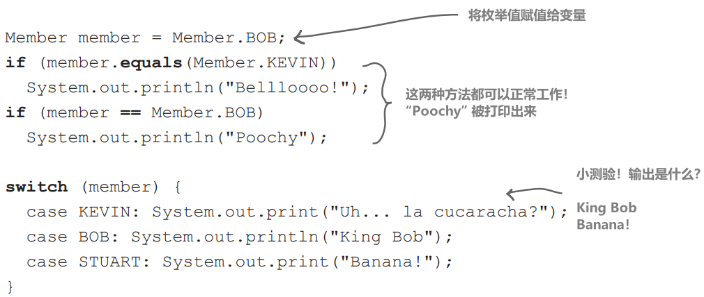
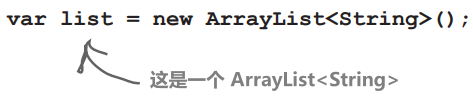

本书其他部分未涉及的十大话题…

# JShell (Java REPL)

## 为什么关心这个问题？

因为它让你能够在不需要完整的应用程序或框架的情况下运行代码片段。REPL（读取-求值-打印循环）是尝试新功能、实验新想法并立即获得反馈的绝佳方式。我们将其放在本附录的开头，以备你使用 JShell 试用我们将在下文中介绍的某些功能

## 启动 REPL

JShell 是 JDK 附带的命令行工具。如果系统路径中有 `JAVA_HOME/bin`，则只需在命令行中键入 `jshell` 即可（关于开始使用的详细信息，请参阅 Oracle 的《JShell 简介》（https://oreil.ly/Ei3Df））


JShell 仅在 JDK 9 及更高版本中可用，但好消息是，即使你在较旧版本的 Java 上运行代码和应用程序，你仍然可以使用较新版本的 JShell，因为它完全独立于你的 "JAVA_HOME" 或 IDE 的 Java 版本。只需从你要使用的 Java 版本的 bin 目录中直接运行即可

## 在没有类的情况下运行 Java 代码

从提示符尝试一些 Java 代码：


注意：

- 无需类
- 不需要 public static main 方法
- 行尾无需分号

只需开始输入 Java！

## 不仅仅是代码行

你可以定义变量和方法：


它支持前向引用，因此你可以勾勒出代码的形状，而不必立即定义所有内容



## 代码建议

如果你在输入过程中按下 Tab 键，就会收到代码建议。你也可以使用上下箭头来循环浏览到目前为止输入的行


## 命令

有很多有用的命令是 JShell 的一部分，而不是 Java 的一部分。例如，输入 `/vars` 可以查看你声明的所有变量。输入 `/exit` 可以退出。使用 `/help` 可以查看命令列表并获取更多信息

Oracle 有一本非常有用的 JShell 用户指南 (https://oreil.ly/Ei3Df)，其中还介绍了如何使用 JShell 创建和运行脚本

# 包

## 包防止类名冲突

尽管包不仅用于防止名称冲突，但这是一个关键特性。如果 OO （面向对象）的部分意义在于编写可重用的组件，那么开发人员就需要能够将各种来源的组件拼凑在一起，并从中构建出新的东西。你的组件必须能够 "很好地与其他组件一起使用"，包括那些你没有编写或甚至不知道的组件

还记得在第 6 章 "使用 Java 库" 中，我们讨论了包名就像类的全名，技术上称为完全限定名吗？List 类其实就是 `java.util.List`，GUI List 其实就是 `java.awt.List`，而 Socket 其实就是 `java.net.Socket`。这就是包名如何帮助防止名称冲突的一个例子——有一个用于数据结构的List和一个用于GUI元素的List，我们可以使用包名来区分它们

请注意，这些类的 "名字" 都是 java。换句话说，它们的完全限定名称的第一部分是 "java"；在考虑包结构时，请考虑层次结构，并相应地组织你的类


## 防止包名称冲突

标准的包命名约定是在每个类的前面加上反向域名。请记住，域名必须是唯一的。两个不同的人可以叫 Bartholomew Simpson，但两个不同的域名不能叫 doh.com


当你查看 https://oreil.ly/hfJava_3e_ 中的代码示例时，你会发现我们将这些类放入了以每章命名的包中，以明确区分示例

<span style="color:red;">

**包可以防止名称冲突，但前提是你选择的包名称必须是唯一的**

**最好的方法是用你的反向域名作为包的前缀**

</span>


## 将类放入包：

### 1、选择一个包名

我们以 `com.headfirstjava` 为例。类名为 `PackageExercise`，因此类的完全限定名现在是 `com.headfirstjava.PackageExercise`

### 2、在类中加入 package 语句

它必须是源代码文件中的第一条语句，位于任何 import 语句之上。每个源代码文件只能有一个包语句，因此源代码文件中的所有类都必须在同一个包中。当然也包括内部类


### 3、设置匹配的目录结构

仅仅在代码中添加一个包语句并不足以说明你的类在一个包中。只有把类放到匹配的目录结构中，类才算真正在包中。因此，如果类的完全限定类名是 `com.headfirstjava.PackageExercise`，你必须将 `PackageExercise` 源代码放在名为 `headfirstjava` 的目录中，而 `headfirstjava` 必须位于名为 `com` 的目录中


## 关于目录的说明

在现实世界中，源文件和类文件通常保存在不同的目录中——你不希望将源代码复制到运行的位置（客户计算机或云），而只想复制类文件

Java 项目最常见的结构是基于 Maven 的*约定：

`MyProject/src/main/java` 应用程序源代码

`MyProject/src/test/java` 测试源

类文件放在其他地方。真正的企业系统通常使用 Maven 或 Gradle 等构建工具来编译和构建应用程序（我们的示例代码使用 Gradle）。每种构建工具都会将类放入不同的文件夹：


*Maven 和 Gradle 是 Java 项目最常用的构建工具

## 编译和运行带有包的代码

我们不需要使用编译工具来分离类文件和源文件。通过使用 `-d` 标志，你可以决定编译后的代码位于哪个目录，而不是接受类文件默认放置在与源代码相同的目录中

使用 `-d` 标志进行编译，不仅可以将编译后的类文件发送到源文件所在目录之外的其他目录，还能将类放入该类所在包的正确目录结构中。此外，使用 `-d` 进行编译告诉编译器如果目录不存在，则创建目录

**`- d` 标志告诉编译器："将该类放入其包目录结构中，将 `-d` 后面指定的类作为根目录。但是......如果没有这些目录，请先创建它们，然后将类放入正确的位置！"**

## 使用 -d（目录）标记进行编译


```java
%cd MyProject/source
%javac -d ../classes com/headfirstjava/PackageExercise.java
```

要编译 com.headfirstjava 包中的所有 .java 文件，请使用：


```java
%javac -d ../classes com/headfirstjava/*.java
```

## 运行代码

从 "classes" 目录运行程序

```java
%cd MyProject/classes
%java com.headfirstjava.PackageExercise
```

你必须给出完全限定的类名！JVM 将看到并立即在其当前目录（classes）内查找，并期望找到一个名为 com 的目录，在该目录中，它期望找到一个名为 headfirstjava 的目录，并在其中找到该类。如果该类在 com 目录中，甚至在 classes 目录中，则无法运行！


# 字符串（Strings）和包装器（Wrappers）中的不可变性

我们在第 18 章中谈到了不可变性，本附录的最后一项也将提到不可变性。本节专门讨论两种重要 Java 类型中的不变性： 字符串和包装器

## 为什么要关注Strings的不可变性？

出于安全目的和节约内存的考虑（无论你是在手机、物联网设备还是云上运行，内存都很重要），Java 中的字符串是不可变的。这意味着当你说：

```java
 String s = "0";
 for (int i = 1; i < 10; i++) {
	 s = s + i;
 }
```

实际上，你正在创建 10 个字符串对象（值分别为 "0"、"01"、"012 "到 "0123456789"）。最后，s 指的是值为 "0123456789" 的字符串，但此时存在 10 个不同的字符串！

同样，如果使用 String 上的方法来 "改变" 一个 String 对象，它根本不会改变该对象，而是会创建一个新的对象：


## 如何节省内存？

每当你创建一个新字符串时，JVM 会将其放入内存中一个特殊的部分，称为 "字符串池"（听起来很新鲜，不是吗？） 如果池中已经有一个相同值的字符串，JVM 不会创建一个重复的字符串，而是将你的引用变量引用到现有的条目中。因此，你不会有 500 个 "customer"（客户）对象（例如），而是有 500 个对单个 "customer" 字符串对象的引用


## 不可变性使重用成为可能

JVM 可以做到这一点，因为字符串是不可变的；一个引用变量不能在另一个引用变量引用相同的字符串时改变字符串的值

## 未使用的字符串会发生什么？

我们的第一个示例创建了大量未使用的中间字符串（"01"、"012" 等）。这些字符串被放在堆上的字符串池中，因此符合垃圾回收的条件（参见第 9 章）。未被使用的字符串最终会被垃圾回收。不过，如果需要进行大量字符串操作（如连接等），可以使用字符串生成器来避免创建不必要的字符串：

```java
StringBuilder s = new StringBuilder("0");
for (int i = 1; i < 10; i++) {
    s.append(i);
}
String finalString = s.toString();
```

这样，每次都会更新单个可变 StringBuilder 来表示中间状态，而不是创建十个不可变 String 实例并丢弃九个中间 String

## 为什么要关心包装器是否不可变？

在第 10 章中，我们谈到了包装类的两个主要用途：

- 将基本类型包装为对象
- 使用静态实用方法（例如 Integer.parseInt()）

重要的是要记住，当你创建一个包装对象，如

```java
Integer iWrap = new Integer(42);
```

这样的包装对象。它的值将永远是 42。**包装对象没有 setter 方法**。当然，你可以将 iWrap 引用到另一个包装对象，但然后你将有两个对象。一旦创建了包装对象，就无法更改该对象的值！

# 访问级别和访问修饰符（谁能看到什么）

Java 有四个访问级别和三个访问修饰符。之所以只有三个修饰符，是因为默认情况（不使用任何访问修饰符时的情况）是四个访问级别中的一个

## 访问级别（按限制程度从低到高排列）

`public`：public 表示任何地方的代码都可以访问公共的内容（“内容”指类、变量、方法、构造函数等）

`protected`：protected 的工作方式与默认访问级别相同（同一包中的代码可以访问），但它还允许位于包外的子类继承受保护的内容

`default`：默认访问级别意味着只有与具有默认内容的类相同包中的代码才能访问默认内容

`private`：private 意味着只有同一类中的代码才能访问私有内容。请记住，它指的是类的私有，而不是对象的私有。一个 Dog 对象可以看到另一个 Dog 对象的私有内容，但 Cat 无法看到 Dog 的私有内容

## 访问修饰符

public

protected

private

大多数情况下，你只会使用 public 和 private 访问级别

### public

用于类、常量（静态 final 变量）、向其他代码公开的方法（例如 getter 和 setter）以及大多数构造函数

### private

用于几乎所有的实例变量，以及不希望外部代码调用的方法（换句话说，类的公共方法所使用的方法）都应该使用 private

虽然你可能不会经常使用其他两种方法（protected 和 default），但你仍然需要知道它们的作用，因为你会在其他代码中看到它们

## default and protected

### default

受保护访问级别和默认访问级别都与包相关联。默认访问权限很简单，它意味着只有同一包中的代码才能访问具有默认访问级别的代码。因此，举例来说，默认类（指未明确声明为 public 的类）只能被与其位于同一包中的类访问 

但访问类的真正含义是什么呢？不能访问类的代码甚至不能考虑该类。所谓 "考虑"，是指在代码中使用该类。例如，如果由于访问限制而无法访问一个类，就不能实例化这个类，甚至不能将其声明为变量、参数或返回值的类型。如果这样做，编译器会报错

想想其中的含义——带有公共方法的默认类意味着公共方法根本不是真正的公共方法。如果你看不到类，就无法访问方法

为什么会有人想要限制对同一包内代码的访问呢？通常情况下，包是作为一组相关的类而设计的。因此，同一个包中的类需要访问彼此的代码，而作为一个包，只有少量的类和方法对外公开（即该包之外的代码），这可能是合理的

好了，这就是默认情况。很简单，如果某个东西有默认访问权限（记住，这意味着没有显式访问修饰符！），那么只有与默认东西（类、变量、方法、内部类）在同一个包内的代码才能访问该东西

那么 protected 有什么用呢？

### protected

受保护的访问权限与默认访问权限几乎完全相同，但有一个例外：它允许子类继承受保护的内容，即使这些子类在它们扩展的超类的包之外。就是这样。这就是 protected 为你带来的好处——让你的子类处于超类的包之外，但仍能继承该类的部分内容，包括方法和构造函数

许多开发人员发现很少有理由使用 protected，但在某些设计中会用到它，也许有一天你会发现它正是你所需要的。protected 的一个有趣之处在于，与其他访问级别不同，protected 访问仅适用于继承。如果一个包外子类有一个指向超类实例的引用（例如，超类有一个 protected 的方法），那么该子类就不能使用该超类引用访问 protected 方法！子类访问该方法的唯一途径就是继承它。换句话说，包外子类并不能直接访问 protected 方法；它只是通过继承拥有该方法

**有经验的开发人员在编写供其他开发人员使用的库时，会发现 default 和 protected 都非常有用**

**这些访问级别可以将库的内部结构与其他开发人员从其代码中调用的 API 分离开来**

# 可变参数（Varargs）

在第 10 章 "数字的重要性" 中，我们学习了 `String.format()` 方法，简单了解了可变参数。在第 11 章 "数据结构" 中，当我们学习 Collections 的便利工厂方法时，也看到过可变参数。只要参数类型相同，可变参数就可以让方法接受任意数量的 args

## 为什么关心这个问题？

你可能不会编写很多（或任何！）带有 Vararg 参数的方法。但是你很可能会使用它们，传递 varargs，因为 Java 库确实提供了一些有用的方法，比如我们刚刚提到的那些，它们可以接受任意数量的 args

## 如何判断一个方法是否接受变量？

让我们看看 String.format() 的 API 文档：

```java
static String format(String format, Object... args)
```

三点（...）表示该方法在 String 参数后可接受任意数量的对象，包括零个。例如

```java
String msg = String.format("Message"); // format()方法对于这种情况来说没有意义，但是是有效的
String msgName = String.format("Message for %s", name); // 一个可变参数参数，“name”
String msgNumName = String.format("%d, messages for %s", number, name); // 两个可变参数参数，“number” 和 “name”
```

接受 varargs 的方法通常并不关心有多少个参数；这并不重要。例如 `List.of()`。它并不关心你想在 List 中添加多少项；它只是将所有 args 添加到新的 list 中

## 创建一个接受 varargs 的方法

一般情况下，你会调用一个接受可变参数的方法，而不是创建它，但我们还是来看看。如果你想定义一个自己的方法，例如打印传入的所有内容，你可以这样做：

```java
void printAllObjects(Object... elements) {
    for (Object element : elements) {
        System.out.println(element);
    }
}
```

param elements 并不神奇，它实际上只是一个对象数组。因此，你可以像创建方法签名一样遍历它：

```java
void printAllObjects(Object[] elements) {
```

不同的是调用代码。你不必创建一个对象数组来传递，而是可以方便地传递任意数量的 params

## 规则

- 一个方法只能有一个 varargs param
- varargs param 必须是最后一个 param

# 注释（Annotations）

你为什么关心注解？

我们在第 12 章 “Lambda和Streams: What, Not How” 中简短地提到了注解：我们提到可以用 lambda 表达式实现的接口可以使用 `@FunctionalInterface` 注解来标记

在代码中添加注解可以增加额外的行为，注解也可以是一种编译器友好文档；也就是说，你只是在代码中标记了一些额外的信息，编译器可以选择使用这些信息

在现实世界中，你肯定会看到注释的使用，而且很有可能会用到它们

## 在哪里可以看到注释？

你会在使用 Java EE/Jakarta EE、Spring/Spring Boot、Hibernate 和 Jackson 等库和框架的代码中看到注解，这些库和框架在Java世界中建立大型和小型应用程序中非常常见

```java
@SpringBootApplication   //类级注释
 public class HelloSpringApplication {
```

你一定会在测试代码中看到注解。在第 5 章 "超强方法" 中，我们介绍了测试代码的概念，但我们没有介绍的是让测试变得更容易的框架。最常见的框架是 JUnit。如果你查看 https://oreil.ly/hfJava_3e_examples 上的代码示例，你会发现在 "test" 文件夹中有一些示例测试类

```java
@Test  //方法级注释
 void shouldReturnAMessage() {
```

<span style="color:red;">**注解可应用于类和方法、变量（局部和实例）、参数，甚至代码中的其他地方**</span>

## 注释可以有元素

有些注解包含元素，这些元素就像带有名称的 params

```java
@Table(name="cust")
public class Customer {
```

如果注解只有一个元素，则无需给出名称

```java
@Disabled("This test isn't finished")
void thisTestIsForIgnoring() {
```

正如你在前面的示例中看到的，你不需要在没有元素的注解中添加括号

你可以为注解的类、方法或变量添加多个注解

## 它们是做什么的？

这要看情况！有些可以用作编译器安全文档。如果你在一个有多个抽象方法的接口上添加 `@FunctionalInterface`，编译器就会出错

其他注解（如 `@NotNull`）可用于 IDE 或分析工具，以检查代码是否正确

许多库都提供注解，供你用来标记代码的某些部分，以便框架知道如何处理你的代码。例如，`@Test` 注解标记了需要由 JUnit 作为单独测试运行的方法；`@SpringBootApplication` 标记了带有主方法的类，该方法是 Spring Boot 应用程序的入口点；`@Entity` 将 Java 类标记为需要由 Hibernate 保存到数据库的数据对象

有些注解提供了代码之上的行为。例如，Lombok 可以使用注解生成常用代码：在类的顶部添加 `@Data`，Lombok 就会生成构造函数、getters 和（如果需要）setters，以及 hashCode、toString 和 equals 方法

**有时，注解就像魔法一样神奇！做艰苦工作的代码被隐藏起来了。如果你使用的注解有详细的文档记录，你就能更好地理解它们的作用和工作方式。这将有助于你解决可能遇到的任何问题**

# Lambdas and Maps

## 为什么在意？

Java 8 为 Java 增加了 lambdas 和流，但鲜为人知的是，`java.util.Map` 也增加了一些接受 lambda 表达式为 args 的新方法。这些方法可以让你更轻松地对 Map 进行常见操作，从而节省你的时间和脑力

## 如果键没有值，则创建一个新值

假设你想跟踪客户在网站上的操作，你可以使用 Actions 对象来实现这一目的。你可能有一个从 String 用户名到 Actions 的Map。当客户执行了某些操作，而你想将这些操作添加到他们的 Actions 对象中时，你需要做的是：

- 为该客户创建一个新的 Actions 对象，并将其添加到 Map 中
- 获取该客户的现有 Actions 对象 使用 if 语句和 null 检查来完成此操作非常常见（Java 8 之前的版本）


```java
Map<String, Actions> custActs = new HashMap<>();
// probably other stuff happens here...

Actions actions = custActs.get(usr);
if (actions == null) {
	
    actions = new Actions(usr);
    custActs.put(usr, actions);
}
// do something with actions
```

虽然代码不多，但这是一个反复使用的模式。如果你使用的是 Java 8 或更高版本，则根本不需要这样做。使用 `computeIfAbsent`，并给它一个 lambda 表达式，说明如果给定键没有条目，如何 "计算"应放入 Map 的值：


```java
Actions actions =
    custActs.computeIfAbsent(usr, name -> new Actions(name));
```

## 仅更新已存在的值

可能还有其他情况，当你只想在值已存在时更新 Map 中的值。例如，你可能有一个用于计数的 Map，比如度量指标，你只想更新你关心的指标。你不想在 Map 中添加任意新的指标。在 Java 8 之前，你可能会使用 `contains`、`get` 和 `put` 的组合来检查 Map 是否有此指标的值，如果有的话则更新它


```java
Map<String, Integer> metrics = new HashMap<>();
// probably other stuff happens here...

if (metrics.containsKey(metric)) {
    Integer integer = metrics.get(metric);
    metrics.put(metric, ++integer);
}
```

Java 8 增加了 `computeIfPresent` 方法，它接受你要查找的键和一个 lambda 表达式，你可以用它来描述如何计算 Map 的更新值。使用这个方法，上面的代码可以简化为：


```java
metrics.computeIfPresent(metric, (key, value) -> ++value);
```

## 其他方法

Map 上还有其他更高级的方法，当你想要“添加一个新值或对现有值进行操作”（甚至删除一个值）时，这些方法可能很有用，比如 merge 和 compute。还有 `replaceAll` 方法，你可以给它一个 lambda 表达式来计算 Map 中所有值的新值（例如，如果需要，我们可以用它来递增前面例子中的所有度量值）。与所有集合一样，它也有一个 `forEach`，可以让我们遍历 Map 中的所有键/值对

Java 库在不断发展，因此即使你认为自己已经了解了一些常用的库，如 `List` 或 `Map`，也值得时刻关注可能会让你的生活更轻松的变化

请记住，如果你想了解一个类上有哪些方法以及这些方法的作用，Java API 文档 (https://oreil.ly/ln5xn) 是一个很好的起点

# 并行流（Parallel Streams）

回溯到第 12 章，Lambdas 和 Streams：What, Not How， 我们对 Streams API 进行了长时间的研究。我们没有看到流的一个真正有趣的特性，那就是你可以利用流来利用现代多核、多 CPU 硬件，并行运行流操作。让我们现在来看看这个问题

到目前为止，我们已经使用 Streams API 有效 "查询" 我们的数据结构。现在，想象一下这些数据结构会变得很大。我们指的是真正的大。比如数据库中的所有数据，或者社交媒体 API 中的实时数据流。我们可以一个接一个地对这些项目进行连续查询，直到得到我们想要的结果。或者，我们可以将工作拆分成多个操作，在不同的 CPU 上同时并行运行。学完第 17 章和第 18 章后，你可能会想编写一个多线程应用程序来实现这一目的，但其实大可不必！

## 并行处理

你可以简单地告诉 Streams API，你希望你的流管道在多个 CPU 内核上运行。有两种方法可以做到这一点

### 1. 启动并行流

还记得第 12 章中的模拟歌曲数据吗？

```java
List<Song> songs = getSongs(); //还记得我们在第12章中使用的模拟歌曲数据吗？
Stream<Song> par = songs.parallelStream();
```

### 2. 将parallel()添加到流管道中

```java
List<Song> songs = getSongs();
Stream<Song> par = songs.stream()
                        .parallel();
```

它们都是做同样的事情，你可以选择自己喜欢的方法

## 现在怎么办？

现在，你只需像在第 12 章中那样编写一个流管道，添加你想要的操作，并以终止符结束。Java 库将会解决以下问题：

- 如何分割数据，以便在多个 CPU 核心上运行流管道
- 运行多少并行操作
- 如何合并多个操作的结果

## 多线程处理

在底层，并行流使用 Fork-Join 框架（我们在本书中并未涉及，请参阅 [https://oreil.ly/XJ6eH](https://oreil.ly/XJ6eH%EF%BC%89%EF%BC%8C%E8%BF%99%E6%98%AF%E5%8F%A6%E4%B8%80%E7%A7%8D%E7%BA%BF%E7%A8%8B%E6%B1%A0%EF%BC%88%E6%88%91%E4%BB%AC%E5%9C%A8%E7%AC%AC)  （我们在第 17 章 "建立连接" 中讨论过）。使用并行流时，你会发现线程数等于运行应用程序的可用内核数。有一些方法可以改变这种设置，但建议使用默认设置，除非你真的知道自己在做什么

## 不要到处都使用并行！

在你跑去把所有流调用都并行化之前，请先等等！还记得我们在第 18 章 "处理并发问题" 中说过，多线程编程很难，因为你选择的解决方案在很大程度上取决于你的应用程序、数据和环境？这同样适用于并行流的使用。并行和使用多个 CPU 内核并不是免费的，也并不意味着应用程序会自动运行得更快

将流管道并行化是有代价的。数据需要拆分，操作需要在不同的线程上对每个数据位运行，最后需要将每个独立并行操作的结果以某种方式组合起来，得出最终结果。所有这些都会增加时间

如果输入流管道的数据是一个简单的集合，就像我们在第 12 章中看到的示例一样（事实上，现在大多数地方都在使用流），那么使用串行流几乎肯定会更快。是的，你没看错：对于大多数普通用例，你并不想采用并行方式

并行流在以下情况下可以提高性能

- 输入集合很大（至少数十万个元素）
- 流管道执行复杂、长时间运行的操作
- 数据/操作的分解（拆分）和结果的合并成本不高

在使用并行之前，你应该测量并行和不并行时的性能。如果想了解更多信息，Richard Warburton 的《Java 8 Lambdas》一书中有关于数据并行的精彩章节

# 枚举（也称为枚举类型或enums）

我们已经讨论过在 API 中定义的常量，例如 `JFrame.EXIT_ON_CLOSE`。你也可以通过标记变量的 `static final` 来创建自己的常量。但有时你会想要创建一组常量值来表示变量的唯一有效值。这组有效值通常被称为枚举。早在 Java 5 中就引入了成熟的枚举

## 谁是乐队成员？

假设你正在为自己喜欢的乐队创建一个网站，你想确保所有的评论都是针对某个乐队成员的

老办法是伪造一个 "枚举"：


```java
public static final int KEVIN = 1;
public static final int BOB = 2;
public static final int STUART = 3;

// later in the code

if (selectedBandMember == KEVIN) {
	// do KEVIN related stuff
}
```

这种方法的好处是，它确实能让代码更容易阅读。另一个好消息是，你永远无法更改所创建的假枚举的值；KEVIN 将始终为 1。坏消息是，没有简单或好的方法来确保selectedBandMember的值始终是1、2或3。如果某些难以找到的代码将 selectedBandMember 设置为 812，那么你的代码很可能会出错

**这是伪造枚举的旧方法，但在现实生活中（如 AWT 等较老的 Java 库）仍能看到这样的代码**

**不过，如果你能控制代码，请尽量使用枚举而不是常量。请看下一页...**

让我们看看使用 "真正的" 枚举时，乐队成员会是什么样子。虽然这是一个非常基本的枚举，但大多数枚举通常都是如此简单

## 一个官方的 “枚举”


```java
public enum Member { KEVIN, BOB, STUART };
public class SomeClass {
    public Member selectedBandMember;
	
	// later in the code...
    void someMethod() {
        if (selectedBandMember == Member.KEVIN) {
			// do KEVIN related stuff
        }
    }
}
```

## 你的枚举扩展了 `java.lang.Enum`

创建枚举时，你将创建一个新类，并隐式扩展 `java.lang.Enum`。你可以在自己的源文件中将枚举声明为自己的独立类，也可以将其声明为另一个类的成员

## 在枚举中使用 "if" 和 "switch"

使用刚刚创建的枚举，我们可以使用 if 或 switch 语句在代码中执行分支。我们还可以使用 `==` 或 `.equals()` 方法比较枚举实例。通常 `==` 被认为是更好的样式



```java
Member member = Member.BOB;
if (member.equals(Member.KEVIN))
    System.out.println("Bellloooo!");
if (member == Member.BOB)
    System.out.println("Poochy");
    
switch (member) {
case KEVIN:
    System.out.print("Uh... la cucaracha?");
case BOB:
    System.out.println("King Bob");
case STUART:
    System.out.print("Banana!");
}
```

你可以在枚举中添加很多东西，比如构造函数、方法、变量、以及一种叫做 "特定常量类主体" 的东西。它们并不常见，但你可能会遇到

# 局部变量类型推断（Local Variable Type Inference） (var)

如果你使用的是 Java 10 或更高版本，那么在声明局部变量（即方法内部的变量，而非方法params或实例变量）时可以使用 `var`

```java
var name = "A Name"; //name is a String
```

这是另一个类型推断的例子，编译器可以利用它已经知道的类型，让你不必再编写更多的类型。编译器知道 name 是字符串，因为它在等号的右侧被声明为字符串


```java
var names = new ArrayList<>();
var customers = getCustomers();
```

## 类型推断，而不是动态类型

当你使用 `var` 声明变量时，它仍然有一个类型。这并不是在 Java 中添加动态或可选类型的方法（与 Groovy 的 def 不同）。它只是一种避免重复编写类型的方法

在声明变量时，你必须以某种方式告诉编译器类型是什么。以后就不能再赋值了。所以，你不能这样做：

```java
var name; //不会编译
```

因为编译器不知道 name 是什么类型

这也意味着以后无法更改其类型：


## 必须有人阅读你的代码

使用 var 确实可以使代码更简洁，而且 IDE 可以准确地告诉你变量的类型，因此你可能会倾向于在所有地方使用 `var`

然而，阅读你代码的人可能并没有使用 IDE，或者对代码的理解与你不同

在本书中，我们没有使用 `var`（尽管这样可以更容易地将代码放在页面上），因为我们想让读者清楚地知道代码在做什么

## 提示：最好使用有用的变量名

如果代码中没有可见的类型信息，那么描述性的变量名和方法名会对读者更有帮助


## 提示： 变量将是具体类型

在第 11 章中，我们开始 "按接口编程"；也就是说，我们将变量声明为接口类型，而不是实现类型：

```java
List<String> list = new ArrayList<>();
```

如果使用 `var`，就不能这样做。类型将是右侧的类型：    



## 提示：不要将 var 与 diamond 运算符一起使用

请看上一个示例。我们首先将 list 声明为 List<String>，然后在右侧使用了菱形运算符 (<>)。编译器从左侧知道 list 元素的类型是字符串

如果像第二个示例中那样使用 var，编译器就不再掌握这一信息。如果希望 list 仍然是字符串列表，则需要在右侧声明；否则，它将包含对象


请阅读 OpenJDK 开发人员提供的所有样式指南 (https://oreil.ly/eVfSd)

# 记录（Records）

## 你为什么要关心它呢？

一个 "简单" 的 Java 数据对象往往一点也不简单。即使是只有几个字段的数据类（由于历史原因，有时也被称为 Java Bean），也需要比你想象的更多的代码

## Java 16 之前的 Java 数据类

想象一个基本的 Customer 类，只有一个名称和一个ID：

```java
public final class Customer {
    private final int id;
    private final String name;
	
    public Customer(int id, String name) {
        this.id = id;
        this.name = name;
    }
	
    public int getId() {
        return id;
    }
	
    public String getName() {
        return name;
    }
	
    public boolean equals(Object o) { }
	
    public int hashCode() { }
	
    public String toString() { }
}
```

我们略去了 equals、hashCode 和 toString 方法的细节，但你可能希望实现这些方法，尤其是如果你要在任何集合中使用该对象的话。我们也省略了 “setters”；这是一个带有 final 字段的不可变对象，但在某些情况下，你可能也想要 setters

代码太多了！这是一个有两个字段的简单类，包括实现在内的全部代码有 41 行！

## 如果数据类有特殊的语法会怎样？

你猜怎么着？如果你使用的是 Java 16 或更高版本，那就有了！与其创建一个类，不如创建一条记录（record）


```java
public record Customer(int id, String name){}
```

就是这样。这就是替换“旧”的 Customer 数据类的42行代码所需做的一切

像这样的 record 有实例变量、构造函数、访问方法以及 equals、hashCode 和 toString 方法

## 使用记录

当你使用已经定义的 record 时，它看起来与标准数据类的情况完全相同：


```java
Customer customer = new Customer(7, "me");
System.out.println(customer);
System.out.println(customer.name());
```

输出结果如下：


## 再见 "get"

你注意到什么了吗？对于读取实例变量的方法，Records 不会使用经典的 "get" 前缀（因此我们小心地将其称为 "访问器" 而非 "获取器"）。它们只使用记录组件的名称作为方法名称

## 可以重写构造函数

默认情况下，构造函数、访问器以及 equals、hashCode 和 toString 方法都会被提供，但如果你需要特定的行为，仍然可以重写它们

大多数情况下，你可能不需要这样做。例如，如果你想在创建 record 时添加验证，可以通过重写构造函数来实现

```java
public record Customer(int id, String name) {
    public Customer(int id, String name) {
        if (id < 0) {
            throw new ValidationException();
        }
        this.id = id;
        this.name = name;
    }
}
```

事实上，比这还要简单。上面的例子是一个规范构造函数，也就是我们一直在使用的普通构造函数。但 records 还有一个紧凑的构造函数。这种紧凑型构造函数假定所有常规的东西都已处理完毕（以正确的顺序拥有正确数量的 params，并且都分配给了实例变量），只允许你定义其他重要的东西，比如验证：


```java
public record Customer(int id, String name) {
    public Customer {
        if (id < 0) {
            throw new ValidationException();
        }
    }
}
```

当你调用 Customer 的构造函数时，你仍然需要向它传递 ID 和名称，而且它们仍然会被分配给实例变量（这些都是由 record 头定义的）。要在构造函数中添加验证，只需使用紧凑表单，其余的交给编译器处理即可


```java
Customer customer = new Customer(7, "me");
```

## 可以重写或添加方法

你可以重写任何方法并添加自己的（public、default或private）方法。如果你要迁移现有数据类以使用 records，你可能需要保留原有的 equals、hashCode 和 toString 方法


```java
public record Customer(int id, String name) {
    public boolean equals(Object o) {
        return id == ((Customer) o).id;
    }
    
    private boolean isValidName(String name) {
	  // some implementation
    }
}
```

你可以创建一个 protected 方法；编译器不会阻止你，但没有意义——records 始终是 final 类，不能被子类化

## Records 不可变

在第 18 章中，我们谈到了如何使数据对象不可变。在并发应用程序中使用不可变对象更安全，因为你知道不可能有多个线程更改数据

如果你知道数据类不会改变，那么推理应用程序中发生的事情也会更容易，因此即使在非多线程应用程序中，你也可能会发现不可变数据对象被使用。在本附录的第 9 条中，我们看到了字符串的不可变性如何节省内存

Records 是不可变的。创建 record 对象后，就无法更改其中的值；没有 “setters” ，也无法更改实例变量。你无法从记录外部直接访问它们，只能通过访问器方法读取它们

如果你尝试从记录内部更改其中一个实例变量，编译器会抛出异常。 record 的实例变量是 final 的

有关 record 的更多信息，请参阅 Oracle Record 类文档 (https://oreil.ly/D7fh3)。在那里，你还可以阅读到一些我们没有机会涵盖的Java 17中的其他新语言特性，如模式匹配、密封类、开关表达式和非常有用的文本块