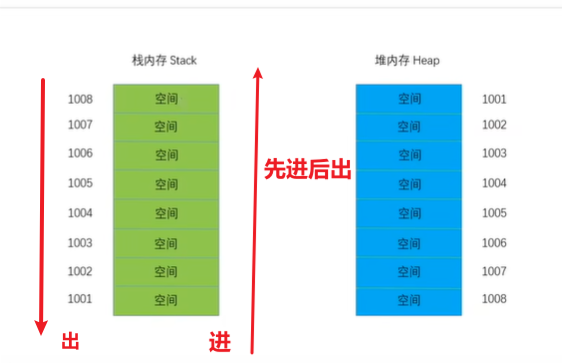
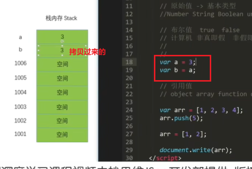
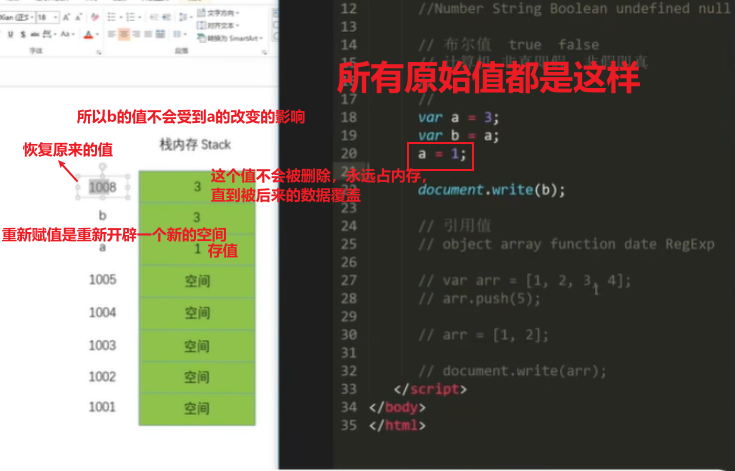
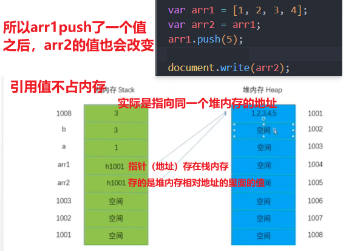
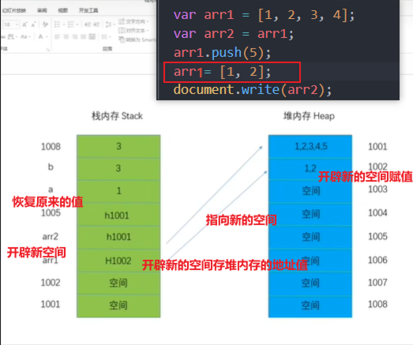

# 发展史
## 5大主流浏览器内核

| 5大主流浏览器 | 内核          |
| ------------- | ------------- |
| IE            | trident       |
| chrome        | webkit  blink |
| safari        | webkit        |
| firefox       | gecko         |
| opera         | presto        |


## 浏览器的历史 和 JS诞生

1、1990

    蒂姆 伯纳斯 李 超文本分享资讯的人
    
    world wide web
    移植到C libwww（真正意义上的浏览器，可以分享资讯的）/nexus
    
    允许别人浏览他人编写的网站

2、1993

    美国 伊利诺大学NCSA组织（马克 安德森）
    
    MOSIAC浏览器 显示图片 
    
    图形化浏览器

3、1994

    马克 安德森和吉姆 克拉克硅图SGI
    
    MOSIAC communication corporation
    
    MOSIAC -> 伊利诺大学

    -> spy class公司
    
    Netscape communication corporation
    
    网景公司 ->netscape navigator -> 2003

4、1996

    微软的公司收购spy class
    -> IE Internet explor 1.0
    
    IE3 JScript

5、1996

    网景公司 Brendan eich在NETSCAPE NAVIGATOR 开发出了livescript

6、1996

    JAVA火起来，网景livescript不温不火，和SUN商量，合作推广和宣传产品，  livescript -> javascript

7、2001

    IE6 XP诞生
    
    JS引擎

8、2003

    mozilla公司 firefox -> netscape navigator 

9、2008

    google基于 WEBKIT BLINK GEARS
    
    chrome -> V8引擎 -> JS引擎

    1、直接翻译机器码
    
    2、独立于浏览器运行

    PROGRESSIVE WEB APP 渐进式WEB APP

10、2009

    甲骨文oracle收购了SUN公司
    
    JS所有权给甲骨文


# ECMA

European Computer Manufactures Association

欧洲计算机制造联合会

评估、开发、认可电信、计算机标准

ECMA -262 脚本语言的规范 ECMAScript

ES5 ES6

规范化脚本语言

# 编程语言

### 高级语言

0 1

分为：编译型    解释型

翻译过程

编译型

    源码 -> 编译器 -> 机器语言 -> 可执行的文编译

解释型

    源码 -> 解释器 -> 解释一行就执行一行


解释型语言 -> 不需要根据不同的系统平台进行移植

.java ->javac -> .class ->JVM解释执行C++ .cpp源码 ->编译器->   .s汇编->汇编器->.obj目标代码 ->链接器 ->可执行文件


### 脚本语言
->脚本引擎 ->解释器

脚本语言 前端 后端

javascript 客户端脚本php服务端脚本

javascript

jscript 微软 IE

vbscript 微软   

asp.net

### 编程语言四要素

变量 数据结构 函数 运算能力

变量 容器 - > 存储数据

var ->varble

```html
<script type="text/javascript">
var a;  //变量声明
a = 3; //变量赋值
var a = 3;  //变量声明并赋值
//两个部分组成
//声明变量 变量赋值
//=


// 会覆盖
var a = 1;
a = 2;
document.write(a);


// 可以都不赋值，上下只有一个赋值也可以，前提是要对其了
// 一个 var 声明多个变量
var x=1,   
    y=2;
</script>
```

>  优先级 ： 运算 > 赋值


### 企业开发  命名规范

  1. 不能以数字开头

  2. 能`字母_$开头`

  3. 可以包含`字母_$数字`

  4. 关键字 保留字 不可以用

  5. 要有语义化和结构化


 js调用写法：js_header  J_header j_header

JQ当类来调用：js-header J-header j-header

小驼峰
myEnglishName MyEnglishName

不要使用拼音


# JS相关
JavaScript

ECMAscript

语法、变量、关键字 保留字 值原始类型，引用类型运算 对象 继承 函数

DOM  document object model  W3C

BOM  browser object model  没有规范

JavaScript JS引擎

**模拟多线程单线程 -> 轮转时间片（Js实际是单线程的）**

1、短时间之内轮流执行多个任务的片段

2、切分任务1 任务2

3、随机排列这些任务片段，组成队列

4、按照这个队列顺序将任务片段送进JS进程

5、JS线程执行一个又一个的任务片段

# JS

## 引入
```html
<!-- 外部引入 -->
<script type="text/javascript" src="./js/index.js"></script>

<!-- 不能这么写，因为会被外部文件的覆盖 -->
<script type="text/javascript" src="./js/index.js">
  document.write('I am an inner JS');  //里面这句话打不出来
</script>

<!-- 也可以写多个，同时显示 -->
<script type="text/javascript" src="./js/index.js"></script>
<script type="text/javascript" src="./js/index1.js"></script>
```

```html
<!-- type="text/csc"，写不写都可以 -->
<style type="text/csc">
</style>

<!-- type="text/javascript"也是 -->
<script type="text/javascript" src="./js/index.js">
    document.write('I am an inner JS');
</script>
```


#### 企业很多这种写法

故意这么写的，不让其执行，原因是里面写的是html，把这个当成一个模板，js中调用这个模板，把里面的值替换掉

```html
<script type="text/tpl" id="tpl">
    <div class="box">{{name}}</div>
</script>
  ```


## JS的值

### 原始值 ->基本类型
```js
Number String Boolean undefined null
```

```js
// Nember 类型 不分小数和整数
var a = 1;
var a = 3.14;

// 不分单双引号都是  String
var str ='我爱编程'; 
```

js是根据值来判断数字类型的，定义的时候并不指明类型，属于弱类型语言

动态语言 -> 脚本语言 -> 解释型语言 -> 弱类型语言

静态语言 -> 编译型语言 -> 强类型语言

布尔值true false
计算机 非真即假 非假即真

##### null 空值   初始化组件   函数  销毁函数   占位

### 引用值

```js
object array function date RegExp
```

### 原始值和引用值存储原理的区别

原始值是在栈内存里面存储

引用值存在堆内存当中，栈内存存堆内存相应的地址

数据从重新赋值不影响之前的
### 原始值






### 引用值





一些js的运算
```js
var x = 3,
    y = 4;
var z = x + y;
document.write(z);  //7


var a = true;
document.write(a); //true

var a;
document.write(a); //undefined


var arr = [1, 2, 3, 4];
arr.push(5);
var arr = [1, 2];
document.write(arr);   //1,2
```


