# 作用域

AO GO作用域

作用域链相关所产生的一切问题

AO -> function&nbsp;&nbsp;独立的仓库&nbsp;&nbsp;互不影响&nbsp;&nbsp;创建出来的空间可以叫做一个独立的作用域


## 对象  obj

属性：键名后面跟了字符串或数据类型

方法：键名后面跟了一个函数

```js
var obj = {
  name: '蓝轨迹', //属性 键名后面跟了字符串或数据类型
  address: '北京',
  teach: function () { //方法  键名后面跟了一个函数

  }
}
console.log(obj.name) //对象有自己的属性和方法
```

**函数也算是一个对象类型**&nbsp;&nbsp;引用类型&nbsp;&nbsp;引用值


```js
test.name   test.length   test.protoytpe 
```

对象 ->有些属性是我们无法访问的&nbsp;&nbsp;&nbsp;&nbsp;JS引擎内部固有的隐式属性

```js
function test(a, b) {

}
console.log(test, length); //2
```


# 作用域链

`[[scope]]`

1. 函数创建时，生成的一个JS内部的隐式属性  只能由JS的引擎读取

2. 函数存储作用域链的容器，作用域链 ：  保存AO/GO的容器

作用域链其实就是 AO/GO

AO，函数的执行期上下文

GO，全局的执行期上下文

函数执行完成以后，AO是要销毁的

AO是一个及时的存储容器，执行新函数的时候产生新的，执行完成之后销毁

scope就是 把AO/GO形成链式从上到下排列，形成链式的关系


分析下列函数的作用域链：

```js
function a() {
  function b() {
    var b = 2;
  }
  var a = 1;
  b();
}
var c = 3;
a();
```

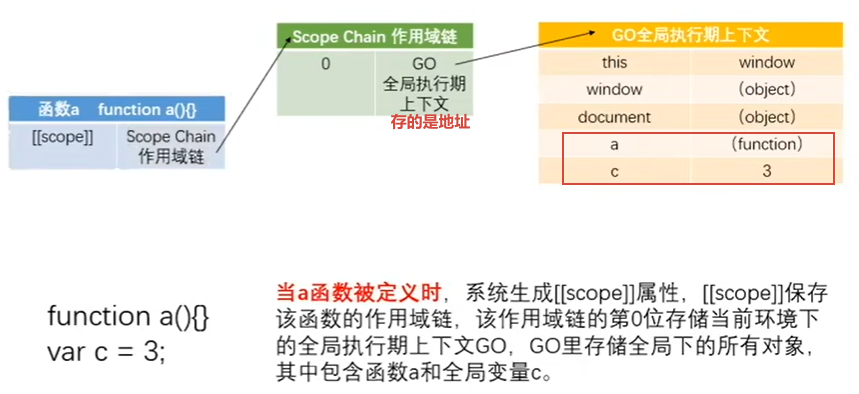

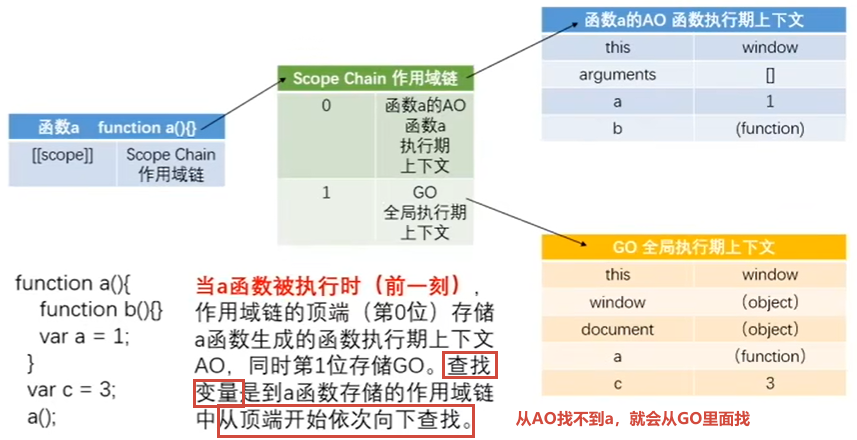

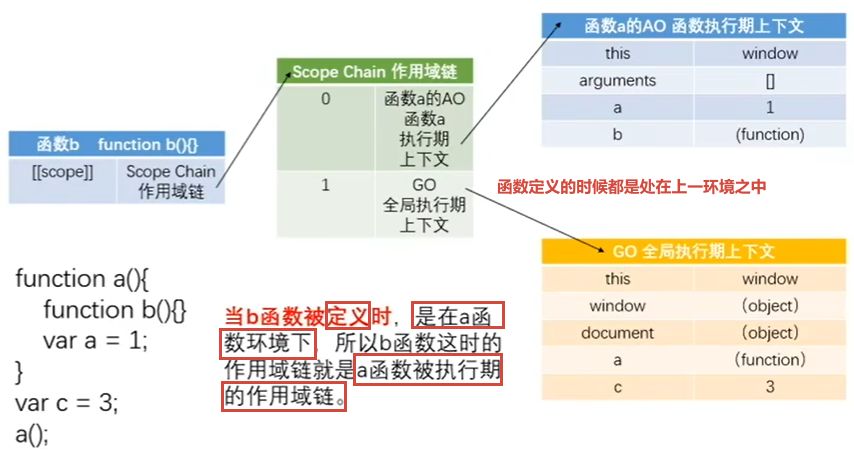

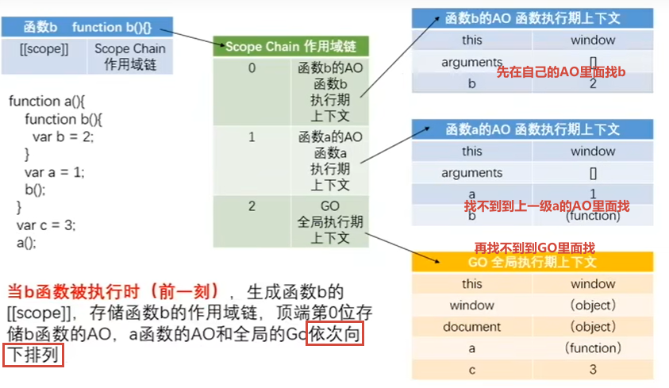

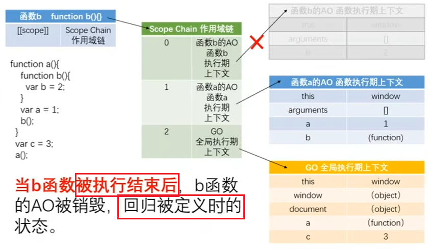

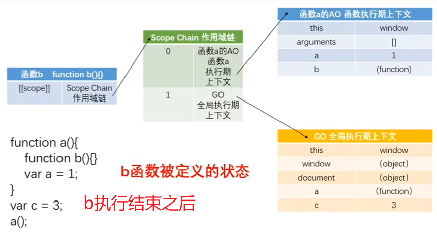

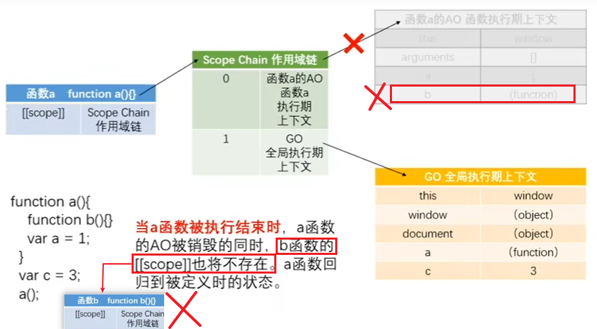

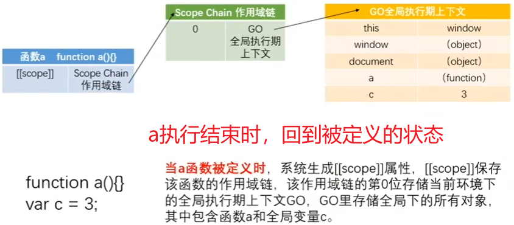


### 总结

1. 函数定义的时候就把GO保存好了   
2. GO永远有一个函数连着，只要不被销毁
3. 每个函数的作用域链都包含GO
4. 每个函数被定义的时候就包含GO
5. 自身的AO都是排在最顶端的
6. 外部访问不到内部原因之一：找变量的时候，每一个函数都是从作用域链顶端往下找的
7. 函数被定义的时候，不会看里面的代码
8. 每个函数都有自己的AO、全局的GO
9. 函数被定义的时候都处在上一环境之中
10. 外函数执行时，内函数被定义
11. GO都是同一个，函数存的是GO的地址
12. 全局在执行的前一刻GO  -> 函数声明已经定义

13. 上级在执行的时候，内部函数被定义

14. 全局执行，内部函数被定义（反过来也成立）

15. 变量赋值是在执行的时候做的

16. 函数被定义的时候已经形成作用与、作用域链、GO，执行的那一刻才生成自己的AO
17. `[[scope]] -> scope chain -> GO -> AO`
18. 定义的时候都有作用域链了


# 预编译

区别以下函数执行过程：

```js
test2();
function test2() {}

test();
var test = function () {}

执行过程：
GO={
  test:undefined- >       执行时函数根本不存在 
       function () {}     全局执行的时候才被赋值
  test2:function test2(){...}   定义函数
}


function test2() {
  function test3(){

  }
  //defined
}
test2();
//AO
```

## 问题

1. 为什么定义的时候要存在GO，就要形成作用域链？

    因为所有函数都必须有一个GO


2. 函数定义时上一级的AO和执行时上一级的AO是不是同一个？ 
      
      是，AO的拿的也是地址

3. 为什么外面无法访问里面的变量
         
      因为外的函教没有内部函数的AO环境，但是内部函教在执行的时候因为引用了外部函数的AO上下文，所以就同时存在多个AO所以能内部能访问外部的

定义的时候拿的是上级的环境

**函数执行结束之前，再执行一次（刷新）就会再生成一个AO环境**

无法访问的例子：

```js
function a() {
  function b() {
    var b = 2;
  }
  var a = 1;
  b();
  console.log(b);
}
var c = 3;
a();

结果
function b() {
  var b = 2;
}


a函数不执行的时候怎么处理，GO只存function a(){...}
function a() {
function b() {
var b = 2;
}
var a = 1;
b();

console.log(b);
}
var c = 3;
//  a();
```


详细分析作用域：

```js
function a() {
  function b() {
    function c() {

    }
    c();
  }
  b();
}
a();

作用域过程：

a定义: a.[[scope]] -> 0:GO

a执行: a.[[scope]] -> 0:a -> AO
                      1:GO

b定义: b.[[scope]] -> 0:a -> AO
                      1:GO

b执行: b.[[scope]] -> 0:b -> AO
                      1:a -> AO
                      2:GO

c定义: c.[[scope]] -> 0:b -> AO
                      1:a -> AO
                      2:GO

c执行: b.[[scope]] -> 0:c -> AO
                      1:b -> AO
                      2:a -> AO
                      3:GO

c结束: c.[[scope]] -> 0:b -> AO
                      1:a -> AO
                      2:GO

b结束: b.[[scope]] -> 0:a -> AO
                      1:GO
       c.[[scope]] X
 
a结束: a.[[scope]] -> 0:GO
       b.[[scope]] X
```


# 闭包

分析下列闭包的过程:

```js
function test1() {
  function test2() {
    var b = 2;
    console.log(a);
  }
  var a = 1;
  return test2();  //只是返回出去，没有保存
}
var c = 3;
var test3 = test1();  //这里才保存
test3();
```

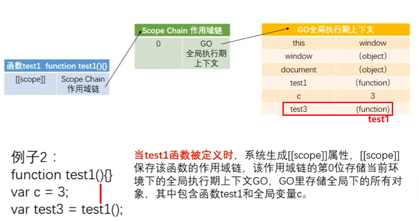

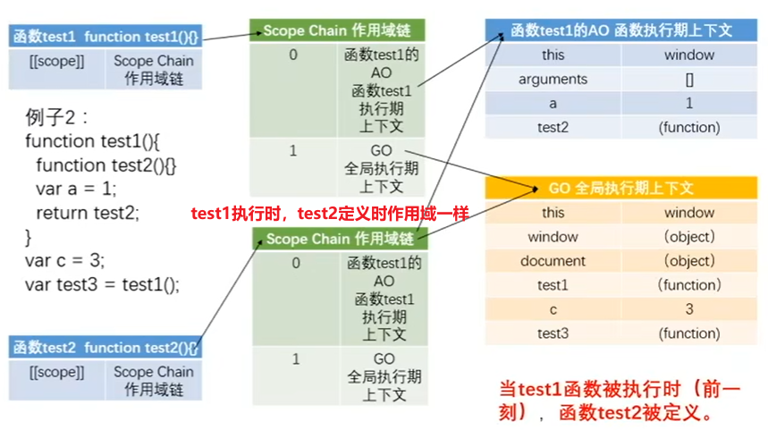

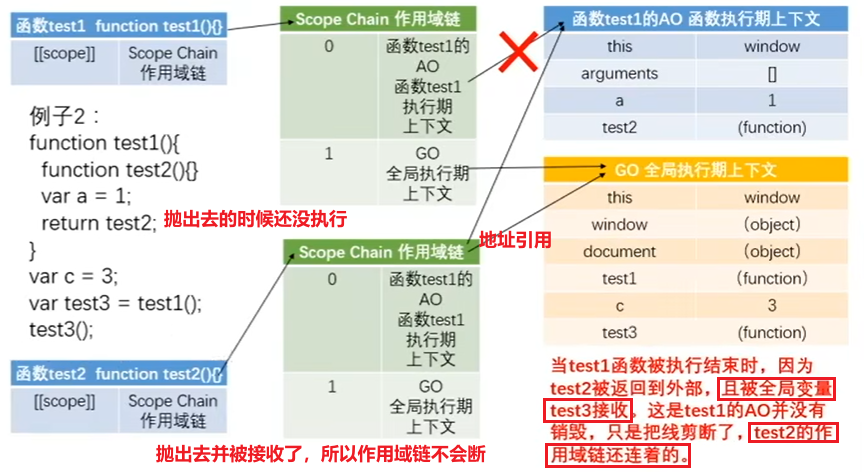

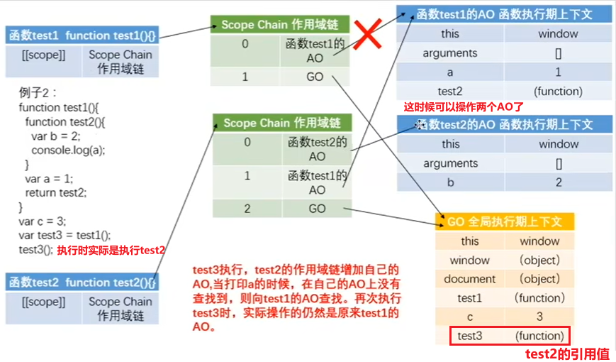

这时修改一下代码：

```js
function test2() {
  var b = 2;
  a=2;
  console.log(a);
}

结果是2，证明了test2被抛出之后可操作test1的AO
```

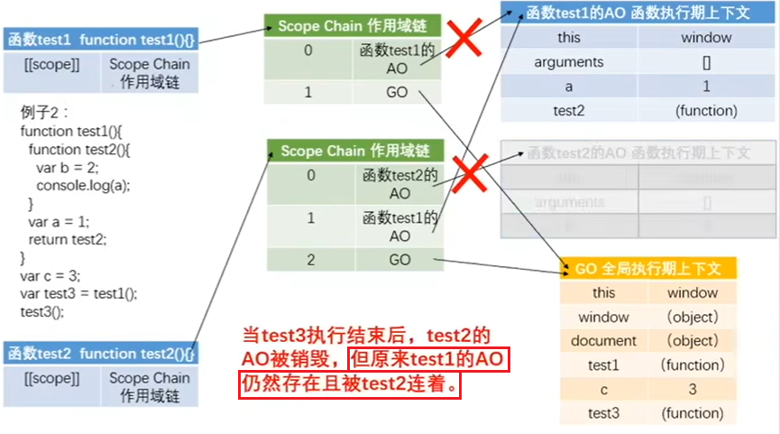


## 总结

当内部函数**被返回到外部并保存时**，**一定会产生闭包**，**闭包会产生原来的作用域链不释放**，过渡的闭包可能会导致**内存泄漏，或加载过慢（常驻内存）**


实例里面的利用：

```js
累加：
function test() {
  var n = 100;

  function add() {
    n++;
    console.log(n);
  }

  function reduce() {
    n--;
    console.log(n);
  }
  return [add, reduce];
}
var arr = test();
arr[0](); // 101
arr[1](); // 100
arr[1](); // 99
arr[1](); // 98
arr[1](); // 97
arr[1](); // 96
arr[1](); // 95


数据缓存：
function breadMgr(num) {
  var breadNum = arguments[0] || 1;   //也可以用num，但是最好用arguments

  function supply() {
    breadNum += 10;
    console.log(breadNum);
  }

  //两个函数平级，没有它们之间互相的AO

  function sale() {
    breadNum--; 
    console.log(breadNum);
  }
  return [supply, sale];
}

var breadMgr = breadMgr(50);
breadMgr[0](); // 60
breadMgr[1](); // 59
breadMgr[1](); // 58
breadMgr[1](); // 57


// 星期天计划管理
function sunSched() {
  var sunSched = '';

  var operation = {
    setSched: function (thing) {
      sunsched = thing;
    },
    showSched: function () {
      console.log("My schedule on sunday is " + sunsched);
    }
  }
  return operation;
}

var sunSched = sunSched();

sunSched.setSched('studying');
sunSched.setSched('walking');    
sunSched.showSched();  //My schedule on sunday is walking


//容易看懂的另一种写法
function sunSched() {
  var sunSched = '';


  function setSched(thing) {
    sunsched = thing;
  }

  function showSched() {
    console.log("My schedule on sunday is " + sunsched);
  }

  return [setSched, showSched];
}

var sunSched = sunSched();
sunSched[0]('studying');
sunSched[1]();


var obj={
  name:'';
  eating: function(){
    // 方法
  }
}键值对之用逗号隔开  为的就是值返回对象即可，然后可以用.语法访问到这个方法

调用
先拿一个东西保存返回的operation
再 用.语法访问到这个方法
```