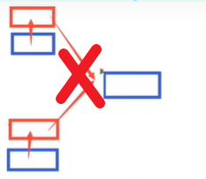

# 对象继承深入

俯视来看这个原型到底是什么

原型其实在构造函数之上 又是构造函数一个属性

构造函数必须经过 new 

不new原型就不存在  原型又在构造函数上生成

实例化出来的对象继承实例化出来的原型属性  

原型实际上就是构造函数的属性 只不过是对象

构造函数的构造函数的所有对象 实例化出来的公共祖先的所有对象  都继承于它的原型

```js
function Person() {

}

Person.prototype.name = 'Lucy';

var p = new Person();
console.log(p);

结果
Person
 [[Prototype]]:Object
   name:"Lucy"   保存在原型上  p里面没有这个属性  只是继承了Person构造函数的属性  通过原型去访问到name
```

原型  ->继承

最下边继承原型链上的所有属性

```js
Professor.prototype = {
  name: 'Mr.zhang',
  tSkill: 'JAVA'
}

function Professor() {}

var professor = new Professor();

// ```````````````分割线```````````````````

Teacher.prototype = professor;  
为了让teacher继承professor 这个原型其实里面什么都没有 因为professor是空  但是professor原型有

function Teacher() {
  this.name = 'Mr.Wang';
  this.mSkill = 'JS/JQ'
}

var teacher = new Teacher();

// ```````````````分割线```````````````````

Student.prototype = teacher;

function Student() {
  this.name = 'Mr. Li';
  this.pSkill = 'HTML/CSS';
}

var student = new Student();

console.log(student); //JAVA


结果
Teacher {mSkill: 'JS/JQ'}
mSkill:"JS/JQ"
[[Prototype]]:ƒ Professor()
  arguments:null
  caller:null         函数为空  什么都没有
  length:0
  name:"Professor"
  prototype:
    name:"Mr.zhang"    prototype里面有
    tSkill:"JAVA"
```

Student是否需要继承所有属性  并不是很科学


# call  apply

问题一：没法访问teacher的原型

```js
Teacher.prototype.wife = 'Ms.Liu';

function Teacher(name, mSkill) {
  this.name = name;
  this.mSkill = mSkill;
}

function Student(name, mSkill, age, major) {
  Teacher.apply(this, [name, mSkill]);  每new一次就要执行一次  也不是很科学  借用别人的属性和方法的时候采用 不是继承 是借用
  this.age = age;
  this.major = major;
}

var student = new Student(
  'Mr.Zhang', 'JS/JQ', 18, 'Computer'
);

console.log(student);  没法访问teacher的原型
```

问题二：teacher.prototype公共原型  指向同一个原型对象的里面，也会更改

问题图解：



```js
function Teacher() {
  this.name = 'Mr.Li';
  this.tSkill = 'JAVA';
}

Teacher.prototype = {
  pSkill: 'JS/JQ'
}

var t = new Teacher();
console.log(t);

function Student() {
  this.name = 'Mr.Wang';
}


Student.prototype = Teacher.prototype;    继承teacher的prototype   但是并没有继承teacher和teacher实例化的属性
Student.prototype.age = 18;    teacher里面的也会更改  不合理

var s = new Student();

console.log(s);


结果
Teacher {name: 'Mr.Li', tSkill: 'JAVA'}
  name: "Mr.Li"
  tSkill: "JAVA"
  [[Prototype]]:Object
    age:18
    pSkill:"JS/JQ"

Student {name: 'Mr.Wang'}
  name:"Mr.Wang"
  [[Prototype]]:Object
    age:18
    pSkill:"JS/JQ"
```

**解决办法**:企业级的方法   圣杯模式  

隔离原型&nbsp;&nbsp;&nbsp;&nbsp;但是还可以继承&nbsp;&nbsp;&nbsp;&nbsp;对象和原型有父子继承关系  

中间的构造函数&nbsp;&nbsp;&nbsp;&nbsp;实例化以后接受`teacher.prototype`  

把 `student.prototype`  等于实例化出来的对象

解决方法图解：


```js
function Teacher() {
  this.name = 'Mr.Li';
  this.tSkill = 'JAVA';
}

Teacher.prototype = {
  pSkill: 'JS/JQ'
}

var t = new Teacher();
console.log(t);

function Student() {
  this.name = 'Mr.Wang';
}

function Buffer() {}
Buffer.prototype = Teacher.prototype;    Buffer不变缓冲用的
var buffer = new Buffer();
console.log(buffer);
// Buffer {}
//   [[Prototype]]:Object
//     pSkill:"JS/JQ"
Student.prototype = buffer;  继承teacher.prototype  student产生生的对象有teacher的prototype
Student.prototype.age = 18;

var s = new Student();
console.log(s);


结果
Teacher {name: 'Mr.Li', tSkill: 'JAVA'}
  name:"Mr.Li"
  tSkill:"JAVA"
  [[Prototype]]:Object       teacher的prototype不变
    pSkill:"JS/JQ"
Buffer {}
  age:18
  [[Prototype]]:Object
    pSkill:"JS/JQ"
Student {name: 'Mr.Wang'}
  name:"Mr.Wang"
  [[Prototype]]:Object
    age:18
    [[Prototype]]:Object
      pSkill:"JS/JQ"
```
总结：
1. 其实就是弄一个不用的对象 做缓冲，就算改 也是改到缓冲的对象，不影响其他
2. 就是想要teacher的prototype，但又不想要teacher实例的属性，那就是把prototype单独拿出来 找个地方赋值给stu的prototype


## 有关最上面一级的prototype能否修改的问题

```js
function Teacher() {
  this.name = 'Mr.Li';
  this.tSkill = 'JAVA';
}

Teacher.prototype = {
  pSkill: 'JS/JQ'
}

var t = new Teacher();
console.log(t);

function Student() {
  this.name = 'Mr.Wang';
}

function Buffer() {}
Buffer.prototype = Teacher.prototype;

var buffer = new Buffer();

Student.prototype = buffer;    不能修改继承的原型

Student.prototype.age = 18;    不是同层的不能更改
var s = new Student();
console.log(s);


结果
Teacher
  name: "Mr.Li"
  tSkill: "JAVA"
  [[Prototype]]: Object
    pSkill: "JS/JQ"
Student {name: 'Mr.Wang'}
  name:"Mr.Wang"
  [[Prototype]]:Object
   age:18
   [[Prototype]]:Object
     pSkill:"JS/JQ"
```

总结：
1. 学生的的prototype是buffer的实例，往学生的原型增加东西，相当于给buffer实例化中增加东西
2. 学生的原型和buffer的实例是同一层， 所以修改学生的原型不会修改老师的原型，**buffer的原型和老师的原型才是同一层**
3. 如果修改buffer的原型，那就会影响老师的原型，因为他们是同一层的 

> 注意：不能修改继承的原型   不是同层的不能更改

这样就牵扯出了圣杯模式

圣杯就是buffer

# 圣杯模式

## css圣杯模式   

双飞翼   三栏设计排成一排

中心自适应  头尾等高  左右等宽


css:

```css
.clearfix::after {
  content: '';
  display: table;
  clear: both;
}

.warp {
  width: 700px;
  margin: 0 auto;
  border: 1px solid #000;
}

.top,
.foot {
  height: 50px;
  background-color: #000;
}

.main {
  padding: 0 100px;
  overflow: hidden;
}

.main .left,
.main .content,
.main .right {
  float: left;
  position: relative;
  background-color: green;
  margin-bottom: -4000px;
  padding-bottom: 4000px;
}

.main .left {
  left: -100px;
  width: 100px;
}

.main .content {
  width: 100%;
  margin-left: -100px;
  background-color: red;
}

.main .right {
  left: 100px;
  width: 100px;
  margin-left: -100px;
}
```

html:

```html
<div class="warp">
<div class="top"></div>
<div class="main clearfix">
  <div class="left">123</div>
  <div class="content">234<br />123</div>
  <div class="right">123</div>
</div>
<div class="foot"></div>
</div>
```


效果图：


## JS圣杯模式企业级写法


初级写法：

```js
function Teacher() {}

function Student() {}

function Buffer() {}
Buffer.prototype = Teacher.prototype;
var buffer = new Buffer();
Student.prototype = buffer;
var s = new Student();
var t = new Teacher();

console.log(s);
console.log(t);
```

###  标准企业级方法

超类/继承源：继承于谁  

```js
Teacher.prototype.name = 'Mr.Zhang';

function Teacher() {}

function Student() {}

function Buffer() {}
inherit(Student, Teacher)
var s = new Student();
var t = new Teacher();

console.log(s);
console.log(t);

function inherit(Target, Origin) {
  function Buffer() {}
  Buffer.prototype = Origin.prototype;
  Target.prototype = new Buffer();        注意顺序
  Target.prototype.constructor = Target;   constructor指向自己  还原构造器  找到真正的构造器指向
  Target.prototype.super_class = Origin;    保存自己的继承源  希望找到真正继承的构造对象
}


结果
Student {}
[[Prototype]]:Teacher
   constructor:ƒ Student()
   super_class:ƒ Teacher()
  [[Prototype]]:Object
     name:"Mr.Zhang" 
```


# 构造函数和闭包

## 闭包

```js
function test() {
  var num = 0;   变成add的私有变量了

  function add() {
    num++;
    console.log(num);
  }
  return add;
}

var add = test();

add();
add();
add();
console.log(num);  报错   因为变成私有变量  无法访问
```


```js
function test() {
var num = 10;     变成add的私有变量了

var compute = {
  add: function () {
    num++;
    console.log(num);
  },
  minus: function () {
    num--;
    console.log(num);
  }
}

return compute;
}

var compute = test();    返回的是对象 ，对象里面的函数形成闭包 

compute.add();
compute.add();
compute.add();
compute.add();
compute.minus();
```


## 构造函数里面的闭包

```js
function Compute() {
  var num = 10;    

  this.add = function () {
    num++;
    console.log(num);
  }
  this.minus = function () {
    num--;
    console.log(num);
  }
  /* var compute = {

  }    两者相等
  var this = {

  }
  return this; */
}

var compute = new Compute();    

compute.add();
compute.add();
compute.add();
compute.add();
compute.minus();
```

```js
function Compute() {
  var num = 10; 

  this.add = function () {
    num++;
    console.log(num);
  }
  this.minus = function () {
    num--;
    console.log(num);
  }
  // return 123/{}; 原始值不用，引用值会改变
}

var compute = new Compute(); 

compute.add();
compute.add();
compute.add();
compute.add();
compute.minus();
console.log(compute);  //{}
```

## 圣杯模式用闭包包装

```js
function tets() {
  var Buffer = function () {}

  function inherit(Target, Origin) {
    Buffer.prototype = Origin.prototype;
    Target.prototype = new Buffer();
    Target.prototype.constructor = Target;
    Target.prototype.super_class = Origin;
  }

  return inherit;       拿到test的AO 里面有 Buffer
}
var inherit = test();   需要变量来接收
```


# 企业模块化

## 企业级的写法   模块化开发  立即执行函数来写

更简洁的写法    防止全局环境污染  利于后期维护  和二次开发

立即执行函数有一个好处就是把作用域封闭在一个空间里面

```js
var inherit = (function () {
  var Buffer = function () {}  声明的变量和外面无关  有自己的变量

  return function (Target, Origin) {
    Buffer.prototype = Origin.prototype;
    Target.prototype = new Buffer();
    Target.prototype.constructor = Target;
    Target.prototype.super_class = Origin;
  }
})();      模块化开发的一种形式

Teacher.prototype.name = 'Mr.Zhang';

function Teacher() {}

function Student() {}
inherit(Student, Teacher);
var s = new Student();
var t = new Teacher();

console.log(s);
console.log(t);
```

实例：

```js
var inherit = (function () {
  var Buffer = function () {} 

  return function (Target, Origin) {
    Buffer.prototype = Origin.prototype;
    Target.prototype = new Buffer();
    Target.prototype.constructor = Target;
    Target.prototype.super_class = Origin;
  }
})(); 


var initProgrammer = (function () {    自启动函数return要有效一定要有变量接收
  var Programmer = function () {}      声明父级构造函数
  Programmer.prototype = {             在原型上增加属性和方法
    name: '程序员',
    tool: '计算机',
    work: '编写应用程序',
    duration: '10个小时',
    say: function () {
      console.log('我是一名' + this.myName + this.name + '我的工作是用' + this.tool + this.work + '我每天工作' + this
        .duration + '，我的工作需要用到' + this.lang.toString() + '。');
    }
  }

  function FrontEnd() {}    只需要return这两个函数出去

  function BackEnd() {}     前后端构造函数

  inherit(FrontEnd, Programmer);   让其继承于Programmer 实例化之后可以访问Programmer.prototype
  inherit(BackEnd, Programmer);

  FrontEnd.prototype.lang = ['HTML', 'CSS', 'JavaScript'];
  FrontEnd.prototype.myName = '前端';                      在前后端原型上增加属性
  BackEnd.prototype.lang = ['Node', 'Java', 'SQL'];
  BackEnd.prototype.myName = '后端';

  return {                  不要声明 直接return return这两个函数出去
    FrontEnd: FrontEnd,
    BackEnd: BackEnd
  }
})();                      声明了自已的空间

var frontEnd = new initProgrammer.FrontEnd();
var backEnd = new initProgrammer.BackEnd();
frontEnd.say();
backEnd.say();


不想用变量接收的话
window.FrontEnd = FrontEnd; 
```
总结：

自己造了一个空间 外面怎么写 里面就怎么写

初始化函数 把所有共功能抛出去 不希望立即执行 给一个变量 需要的时候再执行


## 企业级协同开发   原生企业级开发   现在用webpack
```js
window.onload = function () {
init();
}

function init() {
initComputer();
initFunction();
}
var initCompute = (function () {   init是因为这是我的空间 所有功能都是在initComputer里面实现
var a = 1,
    b = 2;

function add() {
  console.log(a + b);
}

function minus() {
  console.log(a - b);
}

function mul() {
  console.log(a * b);
}

function div() {
  console.log(a / b);
}
return function () {    有需要的再抛出去
  add();
  minus();
  mul();
  div();
}
})();


var initFunction = (function () {

})();
```

### 按需执行
```js
window.onload = function () {    按需执行  毋须立即执行
  init();
}

function init() {
  initComputer();
  initFunction();
}
var initCompute = (function () { 
  var a = 1,
     b = 2;

  function add() {
    console.log(a + b);
  }

  function minus() {
    console.log(a - b);
  }

  function mul() {
    console.log(a * b);
  }

  function div() {
    console.log(a / b);
  }
  xxx.onclick = function () {   这个函数也可以执行
    div();                     达到没抛出去的函数也可以执行的效果
  }
  return function () {       有需要的再抛出去  需要执行的时候再执行
    add();
    minus();
    mul();
  }
})();

initCompute();
```


###  插件化开发 一来就启动

```js
;(function () {     轮播图  一来就启动
  var Slider = function (opt) {}
  Slider.prototype = {

  }
  window.Slider = Slider;
})();


var slider = new Slider({
     配置项
})();
```

> 协同开发不等于插件开发
# 作业

打印一个参数以内能被3或5或7整除的数

打印斐波那契数列的第N位

```js
window.onload = function () {
  init();    //窗口加载完成之后打印
}

function init() {
  console.log(initFb(10));
  console.log(initDiv(100));
}
var initFb = (function () {
  function fb(n) {
    if (n <= 0) {
      return 0;
    }
    if (n <= 2) {
      return 1;
    }
    return fb(n - 1) + fb(n - 2);
  }
  return fb;
})();

var initDiv = (function () {   //先在全局用变量保存这个指向GO里面有些插件也这么写   模块化也叫插件的异类
  function div(n) {
    var arr = []; //用一个容器来接收
    for (var i = 0; i <= n; i++) {
      if (i % 3 === 0 || i % 5 === 0 || i % 7 === 0) {
        arr.push(i); //往数组里面存数用push
      }
    }
    return arr;
  }

  return div; //闭包的原理
})();
```

这样写是把一个立即执行函数保存到一个变量，方便什么时候想执行就执行

立即执行函数执行一遍就被销毁了，如果没有外界接收返回值的话，返回值将不存

在所以说要用一个变量接收

使用模块化开发的情况通常有：
时间去驱动执行

等待延迟执行

**模块化开发的好处**

1. 防止作用域污染  

2. 创造自己独立的作用域空间

return出来的函数保存在全局的GO里面

立即执行函数的写法  一般是插件   出来就执行的   比如 轮播图

```js
插件标配写法
;(function () {
  var Test = function () {
    //构造函数
    // 函数声明  函数表达式
  }

  Test.prototype = {
    //方法 属性
  }

  window.Test = Test; //构造函数保存到全局  外界能访问
})

```

```js
模块化写法
var Test = (function () { //要执行的话  只能Test先执行一次
  var Test = function () {

  }

  Test.prototype = {

  }
  return Test;
})();
```


打印从0到一个数的累加值