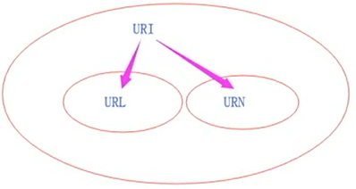

# 错误信息

## 1、 SyntaxError  语法错误

### 变量名不规范
```js
var 1 = 1; //Uncaught SyntaxError: Unexpected number  系统自动抛出的语法错误  错误是一个意外的数字

var 1ab = 1; //Invalid or Unexpected token  无效的意外的标记
```

### 关键字不可赋值
```js
new = 5; //Unexpected token
function = 1; //Unexpected token
```

### 基本的语法错误
```js
var a = 5: //Unexpected token ':'
function 1Test() {}//Invalid or Unexpected token
```

## 2、ReferenceError  引用错误

### 变量或函数未被声明

```js
test(); //Uncaught ReferenceError: test is not defined
console.log(a); //Uncaught ReferenceError: a is not defined
```
### 给无法被赋值的对象赋值的时候

```js
var a = 1 = 2; //Uncaught ReferenceError: Invalid left-hand side in assignment
var a = 1;  异常赋值
console.log(a) = 1; //Uncaught ReferenceError: Invalid left-hand side in assignment
```

## 3、RangeError范围错误

### 数组长度赋值为负数
```js
var arr = [1, 2, 3];  自动在后面加3逗号，两个空项
arr.length = 5;
console.log(arr); //[1, 2, 3, empty × 2]

var arr = [1, 2, 3];
arr.length = -1;
console.log(arr); //Uncaught RangeError: Invalid array length

```

### 对象方法参数超出可行范围
```js
var num = new Number(66.66);
console.log(num.toFixed(1));  留小数点几位 66.7

var num = new Number(66.66);
console.log(num.toFixed(-1)); //Uncaught RangeError: toFixed() digits argument must be between 0 and 100 at Number.toFixed( < anonymous > )
```


## 4、 TypeError 类型错误

### 调用不存在的方法
```js
test(); //Uncaught ReferenceError: test is not defined
123(); //Uncaught TypeError: 123 is not a function   认为123定义没定义 认为不是function 


过程
先判断类型是不是function function才能跟括号 不是则不能 

var obj = {};
obj.say(); //Uncaught TypeError: obj.say is not a function

在对象里找不到这个方法  认为属于属性  看到又有括号就告诉你这不是一个function

obj.say; //不报错
```

> 证明JS没有这个方法认为你是一个属性 只是没有赋值 但是后面属性执行了就是类型错误 因为属性不可能被执行 看到又有括号就告诉你这不是一个function


### 实例化原始值

```js
var a = new 'string'; //Uncaught TypeError: "string" is not a constructor  

new后面一定要跟函数  构造函数/普通函数 

var a = new 123; //Uncaught TypeError: 123 is not a constructor 

实例化的必须是构造函数
```

## 5、URIError   URI错误

```js
URI:UNIFORM RESOURCE IDENTIFIER
     统一资源标识符
URL:UNIFORM RESOURCE LOCATOR
     统一资源定位符
URN:UNIFORM RESOURCE NAME
     统一资源名称
```
关系：



`URL:http://www.baidu.com/news#today`  后面的是资源空间
    
`ftp://www.baidu.com/ftp#developer` 


`URN:www.baidu.com/ftp#developer`   ->ID  指代了资源的唯一性  唯一的资源访问

`href="tel:13900000000"`  URN  不指代特定的可访问的资源  tel：途径/方法

`href="mailto:523579987@qq.coms"` URN 指代资源的名称  无法访问特定的资源/程序   不是自己执行通过该地址访问   而是程序自执行去调用

`encodeURI decodeURI JS内置的方法`

**`encodeURI` 把URL地址里的中文变成中文字符编码**

**`decodeURI` 中文字符编码变成中文**

```js
var myUrl = 'http://www.baidu.cin?name=艾小野';
var newUrl = encodeURI(myUrl);  encodeURI 把URL地址里的中文变成中文字符编码
console.log(newUrl); //http://www.baidu.cin?name=%E8%89%BE%E5%B0%8F%E9%87%8E


var myUrl = '艾小野';
var newUrl = encodeURI(myUrl); 
console.log(newUrl); //%E8%89%BE%E5%B0%8F%E9%87%8E


var myUrl = 'http://www.baidu.cin?name=艾小野';
var newUrl = encodeURI(myUrl);
console.log(newUrl); //http://www.baiddeu.cin?name=%E8%89%BE%E5%B0%8F%E9%87%8E
var newNewUrl = decodeURI(myUrl);  
console.log(newNewUrl); //http://www.baidu.cin?name=艾小野


var str = decodeURI('%fdsdf%'); //Uncaught URIError: URI malformed at decodeURI( < anonymous > )  

不符合常规的URI无法解析  这个URI是乱写的
```

> URI写什么都可以 资源标识 不能判断是否真的有资源 所以可以用encodeURI转为中文编码字符
> 
>  URIError错误基本在这encodeURI decodeURI两个上面


## 6、EvalError eval函数执行错误 

现在不怎么报错 以前是 这个函数不推荐使用

程序写成字符串  放在eval里面就可以执行

eval 基础补充

```js
eval('var a = 1; console.log(a)'); //1  
var str = eval('1');
console.log(str); //1

var obj = {
  a: 1,
  b: 2
}
console.log(eval('obj')); //{a: 1, b: 2}
console.log(eval(obj)); //{a: 1, b: 2}

不规范 应该是字符串才能执行  但是不是字符串也可以  所以不推荐使用
```

这种情况下和对象一样 

只是JSON 一般用双引号  和后端的转义有关  

后端传过来的字符串一般用双引号  所以一般用双引号

JS中JSON也是对象  
```js
var obj = {
  'a': 1,   对象的属性可以写成字符串形式  这种形式就是JSON 
  'b': 2
}
obj['a'] obj.b obj.a


这样的形式其实就是一个JSON对象 不是字符串   变成字符串才是字符串
var obj = {
  "a": 1,
  "b": 2
}

这个就不是JSON字符串/对象了 是普通对象  因为JSON 字符串/对象里面不可以嵌有方法  因为JSON是存储数据用的 
var obj = {
  "a": 1,
  "b": 2,
  "say": function () {}
}
``` 

JSON字符串  后端传过来的数据一般也是这样

```js
 var jsonData = '[' +
    '{' +
    '"name" : "abc"' +
    '},' +
    '{' +
    '"name" : "bcd"' +
    '},' +
    '{' +
    '"name" : "efg"' +
    '}' +
    ']';

  console.log(jsonData); //[{"name" : "abc"},{"name" : "bcd"},{"name" : "efg"}]
  var data = eval('(' + jsonData + ')');   eval很快可以把字符串数据变成可循环的JSON对象
  console.log(data);
  // 0:{name: 'abc'}
  // 1:{name: 'bcd'}
  // 2:{name: 'efg'}

  for (var i in data) {
    var item = data[i];
    console.log(item.name);
  }

结果
abc
bcd
efg
```


> eval最大的用处 后台后端与前端数据对接  JSON数据  后端获取JSON数据


不推荐使用的原因
1. 语法不规范
2. 不好调试
3. 性能问题 不理想 现在json.psrse可也实现 而且性能更高
4. 压缩代码会出错
5. 安全性问题  引起XSS的攻击  不是eval本身问题 可能是写的代码问题   特别是eval input 两标签合用的时候
6. 可读性太差


es6完全抛弃该方法


## 六种错误可以完全人为抛出
### 自定义错误

```js
var error = new SyntaxError('代码错误了');
console.log(error); //SyntaxError: 代码错误了

var error = new ReferenceError('代码错误了');
console.log(error); //ReferenceError: 代码错误了

var error = new TypeError('代码错误了');
console.log(error); //TypeError: 代码错误了
var error = new Error(); //还有这个
```

> 问：错误类型？
>
> 有六种，有1、2、3、....每种类型都对应了一个相应的构造函数，这个构造函数都可以通过实例化错误对象，然后可以输出相应的错误，我可以自定义错误


# try catch 

系统自动为我们抛出错误

```js
console.log('正常执行1');
console.log(a);
console.log('正常执行2');
```
报错后面的就不执行了  有无方法保护一下错误


```js
try {
  console.log('正常执行1');
  console.log(a);
  console.log('正常执行2');   不抛出错误 但是还是出错后面的没执行
} catch (e) {
  console.log(e); //ReferenceError: a is not defined 是一个字符串
  console.log(e.name + ':' + e.message); //ReferenceError:a is not defined
   错了走这里 多了一种备用方案
}
```

```js
try {
  console.log('正常执行1');
  console.log('1');
  console.log('正常执行2');
} catch (e) {      捕获try的错误
  console.log(e);  正常的时候不走里面
}
```

不管有无错误 finally都会执行

```js
try {
  console.log('正常执行1');
  console.log(a);   执行报错
  console.log(b);   不执行
} catch (e) {
  console.log(e.name + ':' + e.message);
} finally {          
  console.log('正常执行3');
}
console.log('正常执行4');


结果
正常执行1
ReferenceError: a is not defined
正常执行3
正常执行4
```


> 多了一种处理程序的可能新性  
> 
> try的内容可能与finally不太相关  
> 
> 把可能出错的放在try，一定要执行的放在finally 分开可能错误和一定要执行 不影响下面函数的执行  
> 
> 这时候finally 和放在外面的函数没有什么区别  只是看起来较为工整  有序列化的感>觉  写在外边序列化感觉就浅一些


## 应用

JSON字符串  等着后端传过来  判断传没传成功

```js
var jsonStr = '';
try {
  console.log('我要执行啦！！！！！');
  var json = JSON.parse(jsonStr);    
  console.log(json);
} catch (e) {
  var errorTip = {      API接入 提示信息集合  
    name: '数据传输失败',
    errorCode: '10010'
  }
  console.log(errorTip);
}


结果
{name: '数据传输失败', errorCode: '10010'}
errorCode:"10010"
name:"数据传输失败"
```
> API接入 提示信息集合  告诉你错误代码是什么  怎么样调试  提示错误编号和名称  这样的信息一般是从后端传回来
>
> JSON.parse里面不能是空串  会报错
>
> 换方案执行  不报错  获取错误以后  换一个方案执行


throw抛出错误信息  自定义信息

```js
var jsonStr = '';
try {
  if (jsonStr == '') {
    throw 'JSON字符串为空';  
  }
  console.log('我要执行啦！！！！！');
  var json = JSON.parse(jsonStr);
  console.log(json);
} catch (e) {
  console.log(e);    JSON字符串为空
  var errorTip = {
    name: '数据传输失败',
    errorCode: '10010'
  }
  console.log(errorTip);
}
```

try catch  用在大型的程序插件比较多  让程序开发者知道是什么  一般程序开发用得不多 


# 严格模式

## 历史进程
```js
ES5严格模式  为ES6做铺垫

ECMAScript  DOM BOM    JavaScript语法规范  方法规范
97   1.0
98   2.0
99   3.0
es5对3.0没做很大的修改
07   4.0  草案  激进 功能前卫复杂  mozilla Brande Eich
08   4.0 中止    容易改变   3.1   Harmony  没发布
3.1 -> ECMAScript5
09   5.0 发布   Harmony -> 1/2(不激进) JS.NEXT    1/2(激进)JS.next.next
11   5.1  ISO 国际标准  还是几乎基于3.0的
13   ES6  =js.next   js.next.next   7
13   ES6草案发布
15   ES6正式发布. ESMAScript2015

```

## 使用须知
```js
ES5  正常模式  严格模式
IE9及以下IE 不支持严格模式
3.0 -> 严格模式  为ES5做铺垫  语法严谨  安全性 效率问题
```

**表达式**
```js
'use strict';
```
为什么用字符串?

因为字符串不会报错  是表达式  怎么写都不报错

浏览器不支持不至于报错

```js
function useStrict(){  3.0  浏览器不支持就会报错  

}  容易报错
useStrict();
```


## `'use strict';`写法

1. 在脚本的最上面一行去写

    不要求的情况下不能这么写
    ```js
    'use strict';   
    ```

2. 绝大部分公司要求这么写 而不是写到全局里面去

    ```js
    function test() {  
      'use strict';

    }
    ```

3. 立即执行函数里面
   
    ```js
    var test = (function test() {
      'use strict';

    })();
    ```


## 需要用到严格模式的地方/注意点

### with 方法

with可以改变作用域 链 填哪个作用域的名称就找哪个作用于里面相应的a

```js
 var a = 1;
var obj = {
  a: 2
}

function test() {
  var a = 3;
  with(test) {
    console.log(a);
  }
}
test(); //3 


var a = 1;
var obj = {
  a: 2
}

function test() {
  var a = 3;
  with(obj) {
    console.log(a);
  }
}
test(); //2


var a = 1;
var obj = {
  a: 2
}

function test() {
  var a = 3;
  with(window) {
    console.log(a);
  }
}
test(); //1
```

严格模式下

```js
'use strict';
var a = 1;
var obj = {
  a: 2
}

function test() {
  var a = 3;
  with(window) {
    console.log(a);
  }
}
test(); //Uncaught SyntaxError: Strict mode code may not include a with statement
```

> with 以后用不到

```js
var a = 1;
var obj = {
  a: 2
}

function test() {
  var a = 3;
  var b = 4;
  with() {   不填值报错
    console.log(a);
    console.log(b);
  }
}
test(); //1
```

### 命名空间问题 

害怕同一个空间出现同一个名称的变量和函数名  涉及到重写问题

```js
var a = 1;
var a = 2;
console.log(a); //2
function test() {
  console.log(1);
}

function test() {
  console.log(2);
}
test(); //2
```
什么情况下会涉及这个问题
1. 程序写大了不清楚
2. 多人协作


#### 不借助框架 直接用JS模块化开发怎么写
```js
window.onload = function () {
  init();
}

function init() {
  initSlider;
  initSlideBar;
}

var initSlider = (function () {
  var a = 1;
  console.log(a);
})();

var initSlider = (function () {
  var a = 2;
  console.log(a);
})();
// 1
// 2

```

以前怎么写的

```js
var namespace = {
  header: {
    Jenny: {
      a: 1,
      b: 2
    },
    Ben: {
      a: 3,
      b: 4,
      c: 5
    }
  },
  sideBar: {
    Crystal: {
      a: 5,
      b: 6
    }
  }
}
// console.log(namespace.header.Ben.a);    但是实际不可能写这么长

用with解决  改变作用域 太消耗性能
with(namespace.header.Ben) {
  console.log(c);
}
```
> 现在用webpack写了 完全组件化来写 模块化多人协作处理


### argument下的一些属性和方法

> ES5严格模式不可以用 arguments下面大部分属性不可用  
> 
> 但是arguments 可以用

#### callee不行
```js
'use strict';

function test() {
  console.log(arguments.callee);  
}
test();
// Uncaught TypeError: 'caller', 'callee', and 'arguments' properties may not be accessed on strict mode functions or the arguments objects for calls to them
```

#### caller不行
```js
'use strict';

function test1() {
  test2();
}
test1();

function test2() {
  console.log(test2.caller);
}
// Uncaught TypeError: 'caller', 'callee', and 'arguments' properties may not be accessed on strict mode functions or the arguments objects for calls to them
```

#### arguments 没问题
```js
function test() {
  console.log(arguments); 
}
test(1, 2, 3);

function test() {
  console.log(arguments.length);
}
test(1, 2, 3);
```

### 声明变量问题

> 严格模式必须声明变量
```js
'use strict';
a = 1; //Uncaught ReferenceError: a is not defined  
```

```js
'use strict';
var a = 1;//Uncaught ReferenceError: a is not defined  
```

```js
'use strict';
a = 1;
var a;//不报错
```

### 严格模式下this的问题

没有实例化  非严格模式下 this指向window
```js
var a = b = 1; //Uncaught ReferenceError: b is not defined
function test() {
  var a = b = 1;
}
test(); //Uncaught ReferenceError: b is not defined

console.log(this); //Window

```

严格模式下 函数内部的this必须要赋值 否则就是undefined

```js
'use strict';
var a = b = 1;
function test() {
  console.log(this);
}
test(); //undefined  
```

this指向构造函数实例化出来的对象

new test 之后 就赋值了 return this  指向test1了 

```js
function test() {
  console.log(this); 
}
var test1 = new test(); //test{}  
```

this严格模式 必须通过call赋值

```js
function test() {
  console.log(this);
}
test();
test.call(1); /* 1 */ this严格模式 必须通过call赋值
new test(); //test {}


function test() {
  console.log(this);
}

test.call(1); //Number {1}
test.call({}); //{}
```
> 数字对象 非严格 call写的不是对象 是原始值的话 也会给你变成对象
>  
> call改变this指向 
> 
> this指向的是对象 也就是说 非严格模式下 call添加任何东西就给你变成相应的对象形式 
> 
> 填1 给你包装类变成数字对象

```js
'use strict';

function test() {
  console.log(this);
}

test.call({}); //{}
```

### 函数的参数不能重复

```js
'use strict';
function test(a, a) {
  console.log(a);

}
test(1, 2); //2
```

```js
'use strict';
function test(a, a) {
  console.log(a);

}
test(1, 2); //Uncaught SyntaxError: Duplicate parameter name not allowed in this context
```


### 对象属性名不允许重复

```js
var obj = {
  a: 1,
  a: 2
}

console.log(obj.a);  /* 2 */    ES5 严格模式下不报错  但是不允许使用

```

### eval严格模式问题

eval 严格模式下是有自己的作用域

外面无法访问

**非严格模式:**

```js
eval('var a = 1;console.log(a)'); //1
console.log(a); //1
```

**严格模式:**

```js
'use strict';
eval('var a=1;console.log(a)'); //eval 
console.log(a); //Uncaught ReferenceError: a is not defined
```