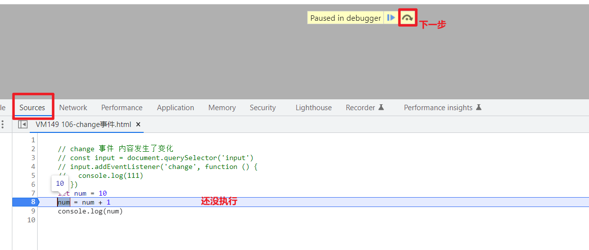
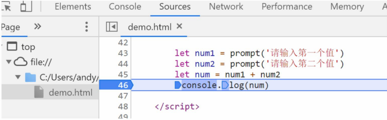

# JavaScript 输入输出语

## 输出语法

语法1：

```js
document.write('要输出的内容')
```
> 作用：向body内输出内容
> 
> 注意：如果输出的内容写的是标签，也会被解析成网页元素

语法2：

```js
alert('要输出的内容')
```
> 作用：页面弹出警告对话框

语法3：

```js
console.log('控制台打印')
```
> 作用：控制台输出语法，程序员调试使用


## 输入语法

语法：

```js
prompt('请输入您的姓名')
```

> 作用：显示一个对话框，对话框中包含一条文字信息，用来提示用户输入文字
>


## JavaScript 代码执行顺序

> 按HTML文档流顺序执行JavaScript代码
> 
> alert() 和 prompt() 它们会跳过页面渲染先被执行（目前作为了解，后期讲解详细执行过程）


# 变量声明
JavaScript 使用专门的关键字 `let` 和 `var` 来声明（定义）变量，在使用时需要注意一些细节：

以下是使用 `let` 时的注意事项：

1. 允许声明和赋值同时进行
2. 不允许重复声明
3. 允许同时声明多个变量并赋值
4. JavaScript 中内置的一些关键字不能被当做变量名

以下是使用 `var` 时的注意事项：

2. 允许声明和赋值同时进行
2. 允许重复声明
3. 允许同时声明多个变量并赋值

大部分情况使用 `let` 和 `var` 区别不大，但是 `let` 相较 `var` 更严谨，因此推荐使用 `let`，后期会更进一步介绍二者间的区别


**let 和 var 区别**：

在较旧的JavaScript，使用关键字 var 来声明变量 ，而不是 let

var 现在开发中一般不再使用它，只是我们可能再老版程序中看到它

let 为了解决 var 的一些问题

var 声明:

- 可以先使用 在声明 (不合理)
- var 声明过的变量可以重复声明(不合理)
- 比如变量提升、全局变量、没有块级作用域等等

> 结论：
> 
> var 就是个bug，别迷恋它了，以后声明变量我们统一使用 let

`const` ：[变量声明](../WebAPI/01-Dom获取&属性操作.md#变量声明)


# 模板字符串

使用场景
- 拼接字符串和变量
- 在没有它之前，要拼接变量比较麻烦

    ```js
    document.write('大家好，我叫' + name + '，今年' + age + '岁')
    ```

语法

```js
`` (反引号)
```

- 在英文输入模式下按键盘的tab键上方那个键（1左边那个键）
- 内容拼接变量时，用` ${ } `包住变量

```js
document.write(`大家好，我叫${name}，今年${age}岁`)
```

# 断点调试

浏览器打开调试界面
1. 按F12打开开发者工具
2. 点到sources一栏
3. 选择代码文件
- 断点：在某句代码上加的标记就叫断点，当程序执行到这句有标记的代码时会暂停下来






# 随机数函数

Math.random() 随机数函数， 返回一个0 - 1之间，并且包括0不包括1的随机小数 [0, 1）

floor() 取整数

公式：

生成N-M之间的随机整数

```js
Math.floor(Math.random()* (M - N + 1)) + N
```

例如：

```js
function getRandom(N, M) {
  return Math.floor(Math.random() * (M - N + 1)) + N
}
console.log(getRandom(4, 8))  //返回4~8的数
```

随机颜色

```js
// 1. 自定义一个随机颜色函数
function getRandomColor(flag = true) {  //给一个默认值，没有参数的时候默认true，有参数就是参数的值
  if (flag) {
    // 3. 如果是true 则返回 #ffffff
    let str = '#'
    let arr = ['0', '1', '2', '3', '4', '5', '6', '7', '8', '9', 'a', 'b', 'c', 'd', 'e', 'f']
    // 利用for循环随机抽6次 累加到 str里面
    for (let i = 1; i <= 6; i++) {
      // 每次要随机从数组里面抽取一个  
      // random 是数组的索引号 是随机的
      let random = Math.floor(Math.random() * arr.length)
      // str = str + arr[random]
      str += arr[random]
    }
    return str

  } else {
    // 4. 否则是 false 则返回 rgb(255,255,255)
    let r = Math.floor(Math.random() * 256)  // 55
    let g = Math.floor(Math.random() * 256)  // 89
    let b = Math.floor(Math.random() * 256)  // 255
    return `rgb(${r},${g},${b})`
  }

}
// 2. 调用函数 getRandomColor(布尔值)
console.log(getRandomColor(false))
console.log(getRandomColor(true))
console.log(getRandomColor())
```

