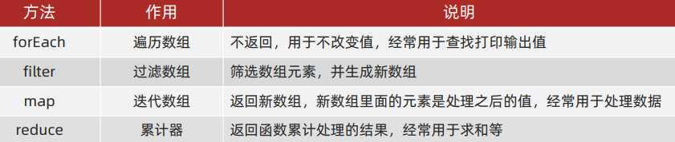

# 深入对象

## 实例成员&静态成员

实例对象的属性和方法即为实例成员

构造函数的属性和方法被称为静态成员


# 内置构造函数

其实字符串、数值、布尔、等基本类型也都有专门的构造函数，这些我们称为包装类型

JS中几乎所有的数据都可以基于构成函数创建

引用类型
- Object，Array，RegExp，Date 等

包装类型
- String，Number，Boolean 等


## Object

`Object` 是内置的构造函数，用于创建普通对象

通过构造函数创建普通对象：

```js
const user = new Object({name: '小明', age: 15})
```

这种方式声明的变量称为【字面量】**（推荐）**：

```js
let student = {name: '杜子腾', age: 21}
```

对象语法简写:

```js
let name = '小红';
let people = {
  // 相当于 name: name
  name,
  // 相当于 walk: function () {}
  walk () {
    console.log('人都要走路...');
  }
}

console.log(student.constructor);
console.log(user.constructor);
console.log(student instanceof Object);
```

总结：

1. 推荐使用字面量方式声明对象，而不是 `Object` 构造函数
2. `Object.assign` 静态方法创建新的对象，常用于对象拷贝，给对象添加属性
3. `Object.keys` 静态方法获取对象中所有属性
4. `Object.values` 表态方法获取对象中所有属性值

```js
const o = {
  uname: 'pink',
  age: 18
} 

// 1.获得所有的属性名
console.log(Object.keys(o)) //返回数组 ['uname','age']

// 2. 获得所有的属性值
console.log(Object.values(o)) //['pink', 18]

// 3. 对象的拷贝
const oo = {}
Object.assign(oo, o)
console.log(oo) //{uname: 'pink', age: 18}

Object.assign(o,{gender:'女'})//可用于追加属性
console.log(o)
```

> 注意： `Object.keys() Object.values()` 返回的是一个数组


## Array


数组常见实例方法-核心方法




### 遍历数组 forEach 方法（重点）

forEach() 方法用于调用数组的每个元素，并将元素传递给回调函数，无返回

语法：

```js
被遍历的数组.forEach(function (当前数组元素，当前元素索引号) {
// 函数体
})
```

> 注意：
> 1. forEach 主要是遍历数组
> 2. 参数当前数组元素是必须要写的，**索引号可选**

forEach 就是遍历 加强版的for循环 适合于遍历**数组对象**

```js
const arr = ['red', 'green', 'pink']
const result = arr.forEach(function (item, index) {
  console.log(item) // 数组元素 red green pink
  console.log(index) // 索引号
})

console.log(result)
```


### 筛选数组 filter 方法（重点）

filter() 方法**创建一个新的数组**，新数组中的元素是通过检查指定数组中符合条件的所有元素

- 主要使用场景： 筛选数组符合条件的元素，并返回筛选之后元素的新数组

```js
被遍历的数组.filter(function(currentValue, index){
  return 筛选条件
})
```
- `返回值`：**返回数组**，包含了符合条件的所有元素。如果没有符合条件的元素则返回空数组
- `参数`：currentValue 必须写， index 可选
- 因为返回新数组，所以不会影响原数组

```js
const arr = [10, 20, 30]
// const newArr = arr.filter(function (item, index) {
// // console.log(item)
// // console.log(index)
// return item >= 20
// })
// 返回的符合条件的新数组

const newArr = arr.filter(item => item >= 20)
console.log(newArr) //[20,30]  
```

> filter`+` 不能写   map`>` `<`不能写


### 数组map方法 迭代数组

**使用场景：**

map 可以遍历数组处理数据，并且**返回新的数组**

**语法：**

```js
const arr = ['red', 'blue', 'green']
// map 方法也是遍历  处理数据  可以返回一个数组
const newArr = arr.map(function (item, i) {
  // console.log(item)//数组元素
  // console.log(i)//下标
  return item + '老师'
})
console.log(newArr) //['red老师', 'blue老师', 'green老师']


const arr1 = [10, 20, 30]
const newArr1 = arr1.map(function (item) {
  return item + 10
})
console.log(newArr1)//[20, 30, 40]
```

>map 也称为映射。映射是个术语，指两个元素的集之间元素相互“对应”的关系
>
>map重点在于有返回值，forEach没有返回值（undefined）


### 数组统计reduce方法

作用：reduce 返回函数累计处理的结果，经常用于求和等

基本语法：

```js
arr.reduce(function(){}, 起始值)

arr.reduce(function(累计值, 当前元素 [,索引号][,源数组])0, 起始值)
```

参数：起始值可以省略，如果写就作为第一次累计的起始值

累计值参数：
1. 如果有起始值，则以起始值为准开始累计， 累计值 = 起始值
2. 如果没有起始值， 则累计值以数组的第一个数组元素作为起始值开始累计
3. 后面每次遍历就会用后面的数组元素 累计到 累计值 里面 （类似求和里面的 sum ）

```js
数组reduce 方法
arr.reduce(function(上一次值，当前值){}，初始值)
```

求和：

```js
const arr = [1, 5, 8]
1.没有初始值
const total = arr.reduce(function (prev, current) {
  return prev + current
})
console.log(total) //14 实现数组的求和

// 上一次值     //当前值      //返回值(第一次循环)
//   1             5                 6
// 上一次值     //当前值     //返回值(第二次循环)
//  6              8                14

2. 有初始值
const total = arr.reduce(function (prev, current) {
  return prev + current
}, 10)
console.log(total) //24


3.箭头函数的写法
const total = arr.reduce((prev, current) => prev + current, 10)
console.log(total) //24


// 上一次值       //当前值      //返回值(第一次循环)
//   10              1                11
// 上一次值      //当前值      //返回值(第二次循环)
//   11             5                 16
// 上一次值      //当前值      //返回值(第三次循环)
//   16             8                24
```

统计薪资

```js
const arr = [{
    name: '张三',
    salary: 10000
  },
  {
    name: '李四',
    salary: 10006
  }, {
    name: '王五',
    salary: 10000
  }
]


// 需求：每个人涨薪30%，当月支出多少薪资
const total = arr.reduce((prev, current) => prev + current.salary * 1.3, 0)   统计对象里面的一定要加0，否则初始值是整个对象
console.log(total) //39000

// 上一次值      //当前值       //返回值(第一次循环)
//    0           13000            13000
// 上一次值      //当前值       //返回值(第二次循环)
//  13000         13000            26000
// 上一次值      //当前值       //返回值(第三次循环)
//  26000        13000             39000
```


### 伪数组转换为真数组

静态方法 `Array.from()`

```js
 Array.from(lis) 把伪数组转换为真数组
const lis = document.querySelectorAll('ul li')
// console.log(lis)
// lis.pop() 报错
const liss = Array.from(lis)
liss.pop()
console.log(liss)
```

数组赋值后，无论修改哪个变量另一个对象的数据值也会相当发生改变

总结：

1. 推荐使用字面量方式声明数组，而不是 `Array` 构造函数

2. 实例方法 `forEach` 用于遍历数组，替代 `for` 循环 (重点)

3. 实例方法 `filter` 过滤数组单元值，生成新数组(重点)

4. 实例方法 `map` 迭代原数组，生成新数组(重点)

5. 实例方法 `join` 数组元素拼接为字符串，返回字符串(重点)

6. 实例方法  `find`  查找元素， 返回符合测试条件的第一个数组元素值，如果没有符合条件的则返回 undefined(重点)

7. 实例方法`every` 检测数组所有元素是否都符合指定条件，如果**所有元素**都通过检测返回 true，否则返回 false(重点)

8. 实例方法`some` 检测数组中的元素是否满足指定条件   **如果数组中有**元素满足条件返回 true，否则返回 false

9. 实例方法 `concat`  合并两个数组，返回生成新数组

10. 实例方法 `sort` 对原数组单元值排序

11. 实例方法 `splice` 删除或替换原数组单元

12. 实例方法 `reverse` 反转数组

13. 实例方法 `findIndex`  查找元素的索引值

```js
// 1. find 查找 找小米 这个对象，并且返回这个对象
const mi = arr.find(item => item.name === '小米')
console.log(mi)

// 2. every 每一个是否都符合条件，如果都符合返回 true ，否则返回false
const arr1 = [10, 20, 30]
const flag = arr1.every(item => item >= 20)
console.log(flag)
```


## 包装类型

在 JavaScript 中的字符串、数值、布尔具有对象的使用特征，如具有属性和方法，如下代码举例：

```js
// 字符串类型
const str = 'hello world!'
// 统计字符的长度（字符数量）
console.log(str.length)

// 数值类型
const price = 12.345
// 保留两位小数
price.toFixed(2) // 12.34
```

之所以具有对象特征的原因是字符串、数值、布尔类型数据是 JavaScript 底层使用 Object 构造函数“包装”来的，被称为包装类型


### String

`String` 是内置的构造函数，用于创建字符串

```js
// 使用构造函数创建字符串
let str = new String('hello world!');

// 字面量创建字符串
let str2 = '你好，世界！';

// 检测是否属于同一个构造函数
console.log(str.constructor === str2.constructor); // true
console.log(str instanceof String); // false
```

总结：

1. 实例属性 `length` 用来获取字符串的度长(重点)
2. 实例方法 `split('分隔符')` 用来将字符串拆分成数组(重点)
3. 实例方法 `substring（需要截取的第一个字符的索引[,结束的索引号]）` 用于字符串截取(重点)
4. 实例方法 `startsWith(检测字符串[, 检测位置索引号])` 检测是否以某字符开头(重点)
5. 实例方法 `includes(搜索的字符串[, 检测位置索引号])` 判断一个字符串是否包含在另一个字符串中，根据情况返回 true 或 false(重点)
5. 实例方法 `toUpperCase` 用于将字母转换成大写
7. 实例方法 `toLowerCase` 用于将就转换成小写
8. 实例方法 `indexOf`  检测是否包含某字符
9. 实例方法 `endsWith` 检测是否以某字符结尾
10. 实例方法 `replace` 用于替换字符串，支持正则匹配
13. 实例方法 `match` 用于查找字符串，支持正则匹配

> 注：String 也可以当做普通函数使用，这时它的作用是强制转换成字符串数据类型


```js
1. split 把字符串 转换为 数组 和 join() 相反
const str = 'pink,red'
const arr = str.split(',')
console.log(arr)
const str1 = '2022-4-8'
const arr1 = str1.split('-')
console.log(arr1)
```

```js
2. 字符串的截取 substring(开始的索引号[， 结束的索引号])
2.1 如果省略 结束的索引号，默认取到最后
2.2 结束的索引号不包含想要截取的部分
const str = '今天又要做核酸了'
console.log(str.substring(5, 7))  //核酸


3. startsWith 判断是不是以某个字符开头
const str = 'pink老师上课中'
console.log(str.startsWith('pink'))


4. includes 判断某个字符是不是包含在一个字符串里面
const str = '我是pink老师'
console.log(str.includes('pink')) // true
console.log(str.includes('pink', 3)) // 从3开始false
```


### Number

`Number` 是内置的构造函数，用于创建数值

```js
// 使用构造函数创建数值
let x = new Number('10')
let y = new Number(5)

// 字面量创建数值
let z = 20
```

总结：

1. 推荐使用字面量方式声明数值，而不是 `Number` 构造函数
2. 实例方法 `toFixed` 用于设置保留小数位的长度


# 小数精度的问题

`(0.1*10 + 0.2* 10) / 10=0.3`
`(0.1*100 + 0.2* 100) / 100=0.3`

乘多少都可以只要是整数