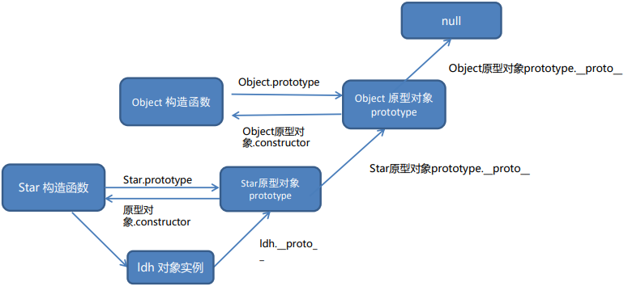

# 构造函数

构造函数存在内存浪费问题


# 原型

构造函数和原型对象中的this 都指向 实例化的对象

JavaScript 中对象的工作机制：**当访问对象的属性或方法时，先在当前实例对象是查找，然后再去原型对象查找，并且原型对象被所有实例共享**

对象都会有一个属性 `__proto__` 指向构造函数的 prototype 原型对象，之所以我们对象可以使用构造函数 prototype 
原型对象的属性和方法，就是因为对象有 `__proto__` 原型的存在


给数组扩展方法

```js
// 自己定义 数组扩展方法  求和 和 最大值 
// 1. 我们定义的这个方法，任何一个数组实例对象都可以使用
// 2. 自定义的方法写到  数组.prototype 身上
// 1. 最大值
const arr = [1, 2, 3]
Array.prototype.max = function () {
  // 展开运算符
  return Math.max(...this)
  // 原型函数里面的this 指向谁？ 实例对象 arr
}
// 2. 最小值
Array.prototype.min = function () {
  // 展开运算符
  return Math.min(...this)
  // 原型函数里面的this 指向谁？ 实例对象 arr
}
console.log(arr.max())
console.log([2, 5, 9].max())
console.log(arr.min())
// const arr = new Array(1, 2)
// console.log(arr)
// 3. 求和 方法 
Array.prototype.sum = function () {
  return this.reduce((prev, item) => prev + item, 0)
}
console.log([1, 2, 3].sum())
console.log([11, 21, 31].sum())
```

## constructor 属性

指向该原型对象的构造函数

使用场景：
如果有多个对象的方法，我们可以给原型对象采取对象形式赋值

但是这样就会覆盖构造函数原型对象原来的内容，这样修改后的原型对象 constructor 就不再指向当前构造函数了

此时，我们可以在修改后的原型对象中，添加一个 constructor 指向原来的构造函数

```js
function Star(name)
this .name = name
Star.prototype = {
  sing: function () { console.log('唱歌') }
  dance: function () {console.log('跳舞')}

console.log(Star.prototype.constructor) // 指向 Object
```

修改后：

```js
function Star(name){
  this .name = name
}
Star.prototype = {
  // 手动利用constructor 指回 Star构造函数
  constructor: Star,
  sing: function () {console.log('唱歌')}
  dance: function () {console.log('跳舞')}
}
console.log(Star.prototype.constructor) // 指向 Star
```


## 原型继承

```js
Peopel是对象写法

Man.prototype = People
// 注意让原型里面的constructor从新指回Man
Man.prototype.constructor = Man

Man.prototype.smoking=function(){}


Woman.prototype = People
```

发现woman也添加了smoking

原因

男人和女人都同时使用了同一个对象，根据引用类型的特点，他们指向同一个对象，修改一个就会都影响

解决：

需求：男人和女人不要使用同一个对象，但是不同对象里面包含相同的属性和方法

答案：构造函数

new 每次都会创建一个新的对象

```js
把People改为构造写法，命名Person

Man.prototype = new Person()
// 注意让原型里面的constructor从新指回Man
Man.prototype.constructor = Man

Man.prototype.smoking=function(){}


Woman.prototype = new Person()
```

完美解决


## 原型链





```js
// function Objetc() {}
console.log(Object.prototype)
console.log(Object.prototype.__proto__)

function Person() {

}
const ldh = new Person()
// console.log(ldh.__proto__ === Person.prototype)
// console.log(Person.prototype.__proto__ === Object.prototype)
console.log(ldh instanceof Person)
console.log(ldh instanceof Object)
console.log(ldh instanceof Array)
console.log([1, 2, 3] instanceof Array)
console.log(Array instanceof Object)
```

① 当访问一个对象的属性（包括方法）时，首先查找这个对象自身有没有该属性。

② 如果没有就查找它的原型（也就是 __proto__指向的 prototype 原型对象）

③ 如果还没有就查找原型对象的原型（Object的原型对象）

④ 依此类推一直找到 Object 为止（null）

⑤ __proto__对象原型的意义就在于为对象成员查找机制提供一个方向，或者说一条路线

⑥ 可以使用 instanceof 运算符用于检测构造函数的 prototype 属性是否出现在某个实例对象的原型链上