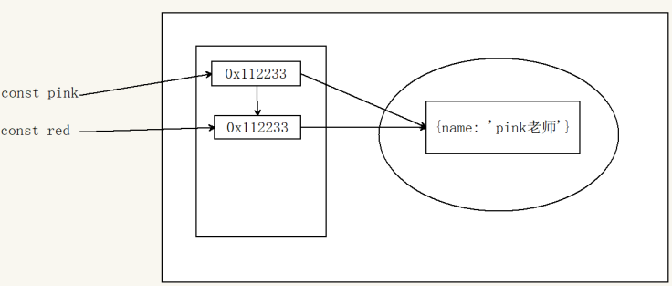

# 深浅拷贝

浅拷贝和深拷贝只针对引用类型

## 浅拷贝

浅拷贝：拷贝的是地址
常见方法：
1. 拷贝对象：`Object.assgin()` / 展开运算符 `{...obj}` 拷贝对象
2. 拷贝数组：`Array.prototype.concat()` 或者 `[...arr]`



是简单数据类型拷贝值，引用数据类型拷贝的是地址 (简单理解： 如果是单层对象，没问题，如果有多层就有问题)

直接赋值和浅拷贝有什么区别？
- 直接赋值的方法，只要是对象，都会相互影响，因为是直接拷贝对象栈里面的地址
- 浅拷贝如果是一层对象，不相互影响，如果出现多层对象拷贝还会相互影响

## 深拷贝

首先浅拷贝和深拷贝只针对引用类型
深拷贝：拷贝的是对象，不是地址
常见方法：
1. 通过递归实现深拷贝
2. lodash/cloneDeep
3. 通过JSON.stringify()实现


#### 递归实现深拷贝

函数递归：
- 由于递归很容易发生“栈溢出”错误（stack overflow），所以必须要加退出条件 return

```js
const obj = {
  uname: 'pink',
  age: 18,
  hobby: ['乒乓球', '足球'],
  family: {
    baby: '小pink'
  }
}
const o = {}
// 拷贝函数
function deepCopy(newObj, oldObj) {
  debugger
  for (let k in oldObj) {
    // 处理数组的问题  一定先写数组 在写 对象 不能颠倒
    if (oldObj[k] instanceof Array) {
      newObj[k] = []
      //  newObj[k] 接收 []  hobby
      //  oldObj[k]   ['乒乓球', '足球']
      deepCopy(newObj[k], oldObj[k])
    } else if (oldObj[k] instanceof Object) {
      newObj[k] = {}
      deepCopy(newObj[k], oldObj[k])
    }
    else {
      //  k  属性名 uname age    oldObj[k]  属性值  18
      // newObj[k]  === o.uname  给新对象添加属性
      newObj[k] = oldObj[k]
    }
  }
}
deepCopy(o, obj) // 函数调用  两个参数 o 新对象  obj 旧对象
console.log(o)
o.age = 20
o.hobby[0] = '篮球'
o.family.baby = '老pink'
console.log(obj)
console.log([1, 23] instanceof Object)
// 复习
// const obj = {
//   uname: 'pink',
//   age: 18,
//   hobby: ['乒乓球', '足球']
// }
// function deepCopy({ }, oldObj) {
//   // k 属性名  oldObj[k] 属性值
//   for (let k in oldObj) {
//     // 处理数组的问题   k 变量
//     newObj[k] = oldObj[k]
//     // o.uname = 'pink'
//     // newObj.k  = 'pink'
//   }
// }
```

#### js库lodash里面cloneDeep内部实现了深拷贝

```html
<!-- 先引用 -->
<script src="./lodash.min.js"></script>
<script>
  const obj = {
    uname: 'pink',
    age: 18,
    hobby: ['乒乓球', '足球'],
    family: {
      baby: '小pink'
    }
  }
  const o = _.cloneDeep(obj)
  console.log(o)
  o.family.baby = '老pink'
  console.log(obj)
</script>
```

#### JSON序列化

```js
const obj = {
  uname: 'pink',
  age: 18,
  hobby: ['乒乓球', '足球'],
  family: {
    baby: '小pink'
  }
}
// 把对象转换为 JSON 字符串
// console.log(JSON.stringify(obj))
const o = JSON.parse(JSON.stringify(obj))
console.log(o)
o.family.baby = '123'
console.log(obj)
```
# 异常处理

- throw 抛异常
- try /catch 捕获异常
- debugger

在代码里面写`debugger`会自动判断


# 处理this

## this指向

### 普通函数

**普通函数**的调用方式决定了 `this` 的值，即【谁调用 `this` 的值指向谁】

```js
// 普通函数
function sayHi() {
  console.log(this)  
}
// 函数表达式
const sayHello = function () {
  console.log(this)
}
// 函数的调用方式决定了 this 的值
sayHi() // window
window.sayHi()


// 普通对象
const user = {
  name: '小明',
  walk: function () {
    console.log(this)
  }
}
// 动态为 user 添加方法
user.sayHi = sayHi
uesr.sayHello = sayHello
// 函数调用方式，决定了 this 的值
user.sayHi()
user.sayHello()
```

> 注： 普通函数没有明确调用者时 `this` 值为 `window`，严格模式下没有调用者时 `this` 的值为 `undefined`

### 箭头函数

**箭头函数**中的 `this` 与普通函数完全不同，也不受调用方式的影响

事实上箭头函数中并不存在 `this` ！

箭头函数中访问的 `this` 不过是箭头函数所在作用域的 `this` 变量

1. 箭头函数会默认帮我们绑定外层 this 的值，所以在箭头函数中 this 的值和外层的 this 是一样的
2. 箭头函数中的this引用的就是最近作用域中的this
3. 向外层作用域中，一层一层查找this，直到有this的定义


```js
console.log(this) // 此处为 window
// 箭头函数
const sayHi = function() {
  console.log(this) // 该箭头函数中的 this 为函数声明环境中 this 一致
}
// 普通对象
const user = {
  name: '小明',
  // 该箭头函数中的 this 为函数声明环境中 this 一致
  walk: () => {
    console.log(this)
  },
  
  sleep: function () {
    let str = 'hello'
    console.log(this)
    let fn = () => {
      console.log(str)
      console.log(this) // 该箭头函数中的 this 与 sleep 中的 this 一致
    }
    // 调用箭头函数
    fn();
  }
}

// 动态添加方法
user.sayHi = sayHi

// 函数调用
user.sayHi()
user.sleep()
user.walk()
```

在开发中【使用箭头函数前需要考虑函数中 `this` 的值】，**事件回调函数**使用箭头函数时，`this` 为全局的 `window`，因此DOM事件回调函数不推荐使用箭头函数

```js
// DOM 节点
const btn = document.querySelector('.btn')
// 箭头函数 此时 this 指向了 window
btn.addEventListener('click', () => {
  console.log(this)
})
// 普通函数 此时 this 指向了 DOM 对象
btn.addEventListener('click', function () {
  console.log(this)
})
```

同样由于箭头函数 `this` 的原因，**基于原型的面向对象也不推荐采用箭头函数**，如下代码所示：

```js
function Person() {
}
// 原型对像上添加了箭头函数
Person.prototype.walk = () => {
  console.log('人都要走路...')
  console.log(this); // window
}
const p1 = new Person()
p1.walk()
```

不适用
- 构造函数，原型函数，字面量对象中函数，dom事件函数

适用
- 需要使用上层this的地方


## 改变this指向

JavaScript允许指定函数中 `this` 的指向，有 3 个方法可以动态指定普通函数中 `this` 的指向：

### call

整体做个了解，后期用的很少

使用 `call` 方法调用函数，同时指定函数中 `this` 的值

语法：

```js
fun.call(thisArg, arg1, arg2, ...) 
```

- thisArg：在 fun 函数运行时指定的 this 值
- arg1，arg2：传递的其他参数
- 返回值就是函数的返回值，因为它就是调用函数


```js
// 普通函数
function sayHi() {
  console.log(this);
}

let user = {
  name: '小明',
  age: 18
}

let student = {
  name: '小红',
  age: 16
}

// 调用函数并指定 this 的值
sayHi.call(user); // this 值为 user
sayHi.call(student); // this 值为 student

// 求和函数
function counter(x, y) {
  return x + y;
}

// 调用 counter 函数，并传入参数
let result = counter.call(null, 5, 10);
console.log(result);
```

总结：

1. `call` 方法能够在调用函数的同时指定 `this` 的值
2. 使用 `call` 方法调用函数时，第1个参数为 `this` 指定的值
3. `call` 方法的其余参数会依次自动传入函数做为函数的参数

### apply

使用 `apply` 方法**调用函数**，同时指定函数中 `this` 的值

语法：

```js
fun.apply(thisArg, [argsArray])
```

- thisArg：在fun函数运行时指定的 this 值
- argsArray：传递的值，必须包含在数组里面
- 返回值就是函数的返回值，因为它就是调用函数
- 因此 apply 主要跟数组有关系，比如使用 Math.max() 求数组的最大值


```js
// 普通函数
function sayHi() {
  console.log(this)
}

let user = {
  name: '小明',
  age: 18
}

let student = {
  name: '小红',
  age: 16
}

// 调用函数并指定 this 的值
sayHi.apply(user) // this 值为 user
sayHi.apply(student) // this 值为 student

// 求和函数
function counter(x, y) {
  return x + y
}
// 调用 counter 函数，并传入参数
let result = counter.apply(null, [5, 10])
console.log(result)
```

总结：

1. `apply` 方法能够在调用函数的同时指定 `this` 的值
2. 使用 `apply` 方法调用函数时，第1个参数为 `this` 指定的值
3. `apply` 方法第2个参数为数组，数组的单元值依次自动传入函数做为函数的参数

### bind

`bind` 方法并**不会调用函数**，而是创建一个指定了 `this` 值的新函数

语法：

```js
fun.bind(thisArg, arg1, arg2, ...)
```

- thisArg：在 fun 函数运行时指定的 this 值
- arg1，arg2：传递的其他参数
- 返回由指定的 this 值和初始化参数改造的 原函数拷贝 （新函数）
- 因此当我们只是想改变 this 指向，并且不想调用这个函数的时候，可以使用 bind，比如改变定时器内部的
this指向.

```js
// 普通函数
function sayHi() {
  console.log(this)
}
let user = {
  name: '小明',
  age: 18
}
// 调用 bind 指定 this 的值
let sayHello = sayHi.bind(user);
// 调用使用 bind 创建的新函数
sayHello()
```

```js
// 需求，有一个按钮，点击里面就禁用，2秒钟之后开启
document.querySelector('button').addEventListener('click', function () {
  // 禁用按钮
  this.disabled = true
  window.setTimeout(function () {
    // 在这个普通函数里面，我们要this由原来的window 改为 btn
    this.disabled = false
  }.bind(this), 2000)   // 这里的this 和 btn 一样
})

定时器默认指向window
```
> 注：`bind` 方法创建新的函数，与原函数的唯一的变化是改变了 `this` 的值


# 性能优化


## 防抖（debounce）

指触发事件后在n秒内函数只能执行一次，如果在n秒内又触发了事件，则会**重新计算**函数执行时间

开发使用场景——搜索框防抖

假设输入就可以发送请求，但是不能每次输入都去发送请求，输入比较快发送请求会比较多

我们设定一个时间，假如300ms， 当输入第一个字符时候，300ms后发送请求，但是在200ms的时候又输入了一个字符，
则需要再等300ms 后发送请求

```js
const box = document.querySelector('.box')
let i = 1  // 让这个变量++
// 鼠标移动函数
function mouseMove() {
  box.innerHTML = ++i
  // 如果里面存在大量操作 dom 的情况，可能会卡顿
}
// 防抖函数
function debounce(fn, t) {
  let timeId
  return function () {
    // 如果有定时器就清除
    if (timeId) clearTimeout(timeId)
    // 开启定时器 200
    timeId = setTimeout(function () {
      fn()
    }, t)
  }
}
// box.addEventListener('mousemove', mouseMove)
box.addEventListener('mousemove', debounce(mouseMove, 200))
```

## 节流（throttle）

指连续触发事件但是在n秒中只执行一次函数

开发使用场景——小米轮播图点击效果 、 鼠标移动、页面尺寸缩放resize、滚动条滚动 就可以加节流

```js
const box = document.querySelector('.box')
let i = 1 // 让这个变量++
// 鼠标移动函数
function mouseMove() {
  box.innerHTML = ++i
  // 如果里面存在大量操作 dom 的情况，可能会卡顿
}
// console.log(mouseMove)
// 节流函数 throttle 
function throttle(fn, t) {
  // 起始时间
  let startTime = 0
  return function () {
    // 得到当前的时间
    let now = Date.now()
    // 判断如果大于等于 500 采取调用函数
    if (now - startTime >= t) {
      // 调用函数
      fn()
      // 起始的时间 = 现在的时间   写在调用函数的下面 
      startTime = now
    }
  }
}
box.addEventListener('mousemove', throttle(mouseMove, 500))
```
## Lodash 库实现节流和防抖

```html
<div class="box"></div>
<script src="./js/lodash.min.js"></script>
<script>
const box = document.querySelector('.box')
let i = 1 // 让这个变量++
// 鼠标移动函数
function mouseMove() {
  box.innerHTML = ++i
  // 如果里面存在大量操作 dom 的情况，可能会卡顿
}

// box.addEventListener('mousemove', mouseMove)
// lodash 节流写法
box.addEventListener('mousemove', _.throttle(mouseMove, 500))
// lodash 防抖的写法
box.addEventListener('mousemove', _.debounce(mouseMove, 500))
</script>
```


# 记录播放位置案例

两个事件:

①：`ontimeupdate` 事件在视频/音频（audio/video）当前的播放位置发送改变时触发

②：`onloadeddata` 事件在当前帧的数据加载完成且还没有足够的数据播放视频/音频（audio/video）的下一帧时触发（需节流）

```js
// 1. 获取元素  要对视频进行操作
const video = document.querySelector('video')
video.ontimeupdate = _.throttle(() => {
  // console.log(video.currentTime) 获得当前的视频时间
  // 把当前的时间存储到本地存储
  localStorage.setItem('currentTime', video.currentTime)
}, 1000)

// 打开页面触发事件，就从本地存储里面取出记录的时间， 赋值给  video.currentTime
video.onloadeddata = () => {
  // console.log(111)
  video.currentTime = localStorage.getItem('currentTime') || 0
}
```
