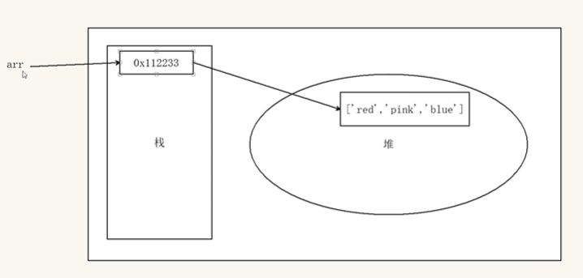
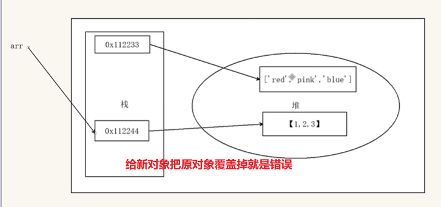

# Web API基本认识

## 变量声明

const 优先，尽量使用const，原因是：const 语义化更好


很多变量我们声明的时候就知道他不会被更改了，那为什么不用 const呢？
    
    因为const有小坑

    基本数据类型变化不能用const

    数组、对象改变就可以用const


原理：

- const 声明的值不能更改，而且const声明变量的时候需要里面进行初始化
- 但是对于引用数据类型，const声明的变量，里面存的不是 值，不是值，不是值，是地址




```js
const names = []
names = [1, 2, 3]  //错误

const obj = {}    
obj = {
  uname:'pink老师'   //错误
}
```
原因：




正确改法：

```js
const names = []
names[0] = 1
names[1] = 2
names[2] = 3

const obj = {}    
obj.uname:'pink老师'   
```


建议：有了变量先给const，如果发现它后面是要被修改的，再改为let

建议数组和对象使用 const 来声明

什么时候使用let声明变量？
- 如果基本数据类型的值或者引用类型的地址发生变化的时候，需要用let
- 比如一个变量进行加减运算，比如 for循环中的 i++


## 作用和分类

作用: 就是使用 JS 去操作 html 和浏览器

分类：DOM (文档对象模型)、BOM（浏览器对象模型）

原来有类名的不要忘记把原先的加上

## 什么是DOM

DOM（Document Object Model——文档对象模型）是用来呈现以及与任意 HTML 或 XML文档交互的API

DOM是浏览器提供的一套专门用来 操作网页内容 的功能

是将**整个 HTML 文档的每一个标签**元素视为一个**对象**，这个对象下包含了许多的属性和方法，通过操作这些属性或者调用这些方法实现对 HTML 的动态更新，为实现网页特效以及用户交互提供技术支撑

DOM作用

开发网页内容特效和实现用户交互

```js
const div = document.querySelector('div')
// dir打印对象
console.dir(div) //js里面div叫dom对象
```

```html
<div>123</div>
<!--html里面div叫标签-->
```

## DOM树

文档树或DOM树：将 HTML 文档以树状结构直观的表现出来

描述网页内容关系的名词

作用：文档树直观的体现了标签与标签之间的关系

```html
<!DOCTYPE html>
<html lang="en">
<head>
  <meta charset="UTF-8">
  <meta name="viewport" content="width=device-width, initial-scale=1.0">
  <title>标题</title>
</head>
<body>
  文本
  <a href="">链接名</a>
  <div id="" class="">文本</div>
</body>
</html>
```


## DOM对象（重要）

DOM对象：浏览器根据html标签生成的 JS对象

所有的标签属性都可以在这个对象上面找到

修改这个对象的属性会自动映射到标签身上

DOM的核心思想

把网页内容当做对象来处理

document 对象
  - 是 DOM 里提供的一个对象
  - 所以它提供的属性和方法都是用来访问和操作网页内容的
       例：document.write()
  - 网页所有内容都在document里

### DOM节点
节点是文档树的组成部分，**每一个节点都是一个 DOM 对象**，主要分为元素节点、属性节点、文本节点等

1. 【元素节点】其实就是 HTML 标签，如上图中 `head`、`div`、`body` 等都属于元素节点。
2. 【属性节点】是指 HTML 标签中的属性，如上图中 `a` 标签的 `href` 属性、`div` 标签的 `class` 属性。
3. 【文本节点】是指 HTML 标签的文字内容，如 `title` 标签中的文字。
4. 【根节点】特指 `html` 标签。
5. 其它...

#### document

`document` 是 JavaScript 内置的专门用于 DOM 的对象，该对象包含了若干的属性和方法，`document` 是学习 DOM 的核心。

```js
// document 是内置的对象
// console.log(typeof document);

// 1. 通过 document 获取根节点
console.log(document.documentElement); // 对应 html 标签

// 2. 通过 document 节取 body 节点
console.log(document.body); // 对应 body 标签

// 3. 通过 document.write 方法向网页输出内容
document.write('Hello World!');
```

# 获取DOM元素

查找元素DOM元素就是利用 JS 选择页面中标签元素

## 根据CSS选择器来获取DOM元素 (重点)

### 选择匹配的第一个元素

语法：

```js
document.querySelector('css选择器')
```
参数:

包含一个或多个有效的CSS选择器**字符串**

返回值：

  - CSS选择器匹配的第一个元素,一个 HTMLElement对象

  - 如果没有匹配到，则返回null

> 能直接操作修改

### 选择匹配的多个元素
语法：

```js
document.querySelectorAll('css选择器')
```

参数:

包含一个或多个有效的CSS选择器 字符串

返回值：

CSS选择器匹配的NodeList 对象集合

例如

```js
document.querySelectorAll('ul li')
```

返回的结果是伪数组：
- 有长度有索引号的数组
- 但是没有 pop() push() 等数组方法


> 想要得到里面的每一个对象，则需要遍历（for）的方式获得

> 哪怕只有一个元素，通过querySelectAll() 获取过来的也是一个伪数组，里面只有一个元素而已
> 
> 不可以直接修改， 只能通过遍历的方式一次给里面的元素做修改


两者小括号里面的参数有神马注意事项？
- 里面写css选择器
- 必须是字符串，也就是必须加引号

实例：

```html
<style>
    .box {
      width: 200px;
      height: 200px;
    }
  </style>
</head>

<body>
  <div class="box">123</div>
  <div class="box">abc</div>
  <p id="nav">导航栏</p>
  <ul class="nav">
    <li>测试1</li>
    <li>测试2</li>
    <li>测试3</li>
  </ul>
  <script>
    1. 获取匹配的第一个元素
    const box = document.querySelector('div')
    const box = document.querySelector('.box')
    console.log(box)

    const nav = document.querySelector('#nav')
    console.log(nav)
    nav.style.color = 'red'

    我要获取第一个 ul li
    const li = document.querySelector('ul li:first-child') //css怎么写就怎么写
    console.log(li)


    2. 选择所有的小li
    const list = document.querySelectorAll('ul li')
    console.log(list)
```

```js
1.获取元素
const lis = document.querySelectorAll('.nav li')
// console.log(lis)
for (let i = 0; i < lis.length; i++) {
  console.log(lis[i]) //每一个小li对象
}

const p = document.querySelectorAll('#nav')
// console.log(p)
p[0].style.color = 'red'//style可以直接修改
```

### 其他获取DOM元素方法（了解）

```js
// 根id获取一个元素
document .getElementById('nav')
// 根 标获取一类元素 获取页面 所有
divdocument .getElementsByTagName('div')
// 根 类名获取元素 获取页面 所有类名为 w的
document .getElementsByClassName('w')
```

总结：

- document.getElementById 专门获取元素类型节点，根据标签的 `id`  属性查找
- 任意 DOM 对象都包含 nodeType 属性，用来检检测节点类型


# 操作元素内容

## 元素innerText 属性

- 将文本内容添加/更新到任意标签位置
- **显示纯文本，不解析标签**

```js
// 1. 获取元素
const box = document.querySelector('.box')
// 2. 修改文字内容    对象.innerText 属性
// console.log(box.innerText) //获取文字内容
box.innerText = '我是一个盒子' //修改文字内
// box.innerText = '<strong>我是一个盒子</strong>' //不解析标签
```


## 元素.innerHTML 属性

- 将文本内容添加/更新到任意标签位置
- 会解析标签，多标签建议使用模板字符


```js
// innerHTML 解析标签
console.log(box.innerHTML)
box.innerHTML = '<strong>我要更换</strong>'
```

> 总结：如果文本内容中包含 `html` 标签时推荐使用 `innerHTML`，否则建议使用 `innerText` 属性


# 操作元素属性

## 操作元素常用属性

语法：

```html
对象.属性 = 值
```

```js
// 1.获取图片元素
const img = document.querySelector('img')
// 2.修改图片对象的属性  对象/属性 = 值
img.src = './images/2.webp'
img.title = 'pink老师的艺术照'
```


## 操作元素样式属性

### 通过 style 属性操作CSS

style生成的是行内样式表 权重高  所以可以覆盖原来的样式

语法：

```html
对象.style.样式属性 = 值
```

```js
// 1.获取元素
const box = document.querySelector('.box')
// 2.修改样式属性 
box.style.width = '300px'
box.style.backgroundColor = 'hotpink'
box.style.border = '2px solid blue'
box.style.borderTop = '2px solid red'
```

> 注意：
> 1. 修改样式通过style属性引出
> 2. 如果属性有-连接符与JS的减运算符冲突，需要转换为小驼峰命名法
> 3. 赋值的时候，需要的时候**不要忘记加css单位**

```js
// console.log(document.body)不用通过querySelector来获取了
function getRandom(N, M) {
  return Math.floor(Math.random() * (M - N + 1)) + N
}

// 随机数
const random = getRandom(1, 10)
document.body.style.backgroundImage = `url(./images/desktop_${random}.jpg)`
```
### 操作类名(className) 操作CSS

如果修改的样式比较多，直接通过style属性修改比较繁琐，我们可以通过借助于css类名的形式

语法：

```js
// active 是一个css类名
元素.className = active
```

```html
<style>
  .pink {
      background: pink;
      color: hotpink;
  }
</style>
</head>
<body>
<div class="box">随便一些文本内容</div>
<script>
  // 获取 DOM 节点
  const box = document.querySelector('.intro')
  box.className = 'pink'
</script>
```

> 注意：
> 1. 由于class是关键字，所以使用className去代替
> 2. 直接使用 className 赋值会覆盖以前的类名，如果需要添加一个类，需要保留之前的类名


### 通过 classList 操作类控制CSS

解决className 容易覆盖以前的类名，我们可以通过classList方式追加和删除类名

```js  
1.  追加类  add()类名不加点，并且是字符串
box.classList.add('active')

2.  删除类 remove()
box.classList.remove('box')

3.  切换类  toggle()  有就删掉，没有就加上
box.classList.toggle('active')

4. 判断是否包合某个类名 有返true，没有返回false
元素.classList.contains('类名')
```

## 操作 表单元素 属性

表单很多情况，也需要修改属性，比如点击眼睛，可以看到密码，本质是把表单类型转换为文本框
比如： disabled、checked、selected

正常的有属性有取值的跟其他的标签属性没有任何区别

获取:`DOM对象.属性名`

设置:`DOM对象.属性名= 新值`

```html
<input type="text" value="请输入">
<button disabled>按钮</button>
<input type="checkbox" name="" id="" class="agree">
<script>
  // 1. 获取元素
  let input = document.querySelector('input')
  // 2. 取值或者设置值  得到input里面的值可以用 value
  // console.log(input.value)
  input.value = '小米手机'
  input.type = 'password'

  // 2. 启用按钮
  let btn = document.querySelector('button')
  // disabled  默认不可用   =  false  这样可以让按钮启用
  btn.disabled = false
  // 3. 勾选复选框
  let checkbox = document.querySelector('.agree')
  checkbox.checked = false
  // ipt.checked = true
  // ipt.checked = 'true' 会选中，不提倡 有隐式转换 字符串里面只有一种情况为false 其余都是true
</script>
```


## 自定义属性

- 在html5中推出来了专门的`data-`自定义属性
- 在标签上一律以`data-`开头
- 在DOM对象上一律以`dataset`对象方式**获取**


```html
<div data-id="1" data-spm="不知道">1</div>
<div data-id="2">2</div>
<div data-id="3">3</div>
<div data-id="4">4</div>
<div data-id="5">5</div>

<script>
  const one = document.querySelector('div')
  console.log(one.dataset) //dataset是集合
  console.log(one.dataset.id) //1
  console.log(one.dataset.spm) //不知道
</script>
```

# 定时器-间歇函数

定时器函数有两种，先讲间歇函数

定时器函数可以开启和关闭定时器
`setInterval` 是 JavaScript 中内置的函数，它的作用是间隔固定的时间自动重复执行另一个函数，也叫定时器函数

1. 开启定时器
- 作用：每隔一段时间调用这个函数
- 间隔时间单位是毫秒

```js
setInterval(函数, 间隔时间)
```

2. 关闭定时器

```js
let 变量名 = setInterval(函数，间隔时间)
clearInterval(变量名)
```
> 一般不会刚创建就停止，而是满足一定条件再停止


```js
function fn() {
  console.log('一秒执行一次')
}

let n = setInterval(fn, 1000) //单位：毫秒
console.log(n) //2  定时器的id=2  每一个定时器的id都是唯一的

setInterval(函数名,间隔时间)  函数名不要加小括号
setInterval(fn, 1000)
setInterval('fn()', 1000)  非要加这样写  但是少用
```


```js
button 双标签用value无法获取值 得使用innerHTML
console.log(btn.innerHTML)  button按钮特殊用innerHTML
```