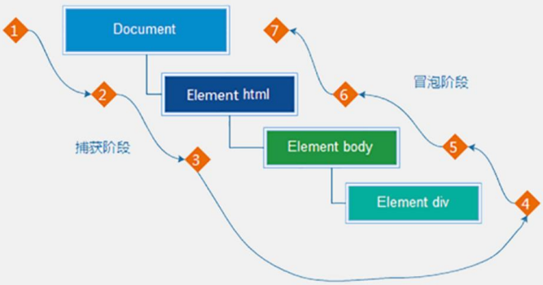
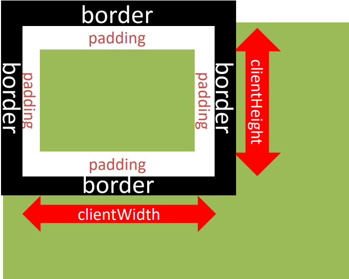
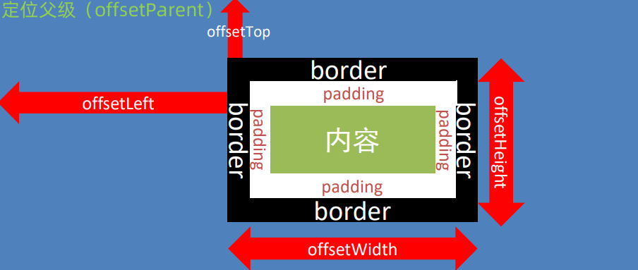
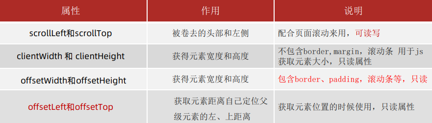

# 事件流

## 事件流和两个阶段

事件流:事件完整执行过程中的流动路径

当触发事件时，会经历两个阶段，分别是**捕获阶段、冒泡阶段**

捕获阶段：父到子 

冒泡阶段：子到父

实际工作都是使用**事件冒泡**为主




## 事件捕获

从DOM的根元素开始去执行对应的事件 (从外到里)

语法：

```js
DOM.addEventListener(事件类型，事件处理函数，是否使用捕获机制)
```

说明：
- addEventListener第三个参数传入 `true`代表是捕获阶段触发（很少使用）
- 若传入`false`代表冒泡阶段触发，默认就是`false`
- 若是用 L0 事件监听，则只有冒泡阶段，没有捕

```js
const fa = document.querySelector('.father')
const son = document.querySelector('.son')
document.addEventListener('click', function () {
  alert('我是爷爷')
}, true)
fa.addEventListener('click', function () {
  alert('我是爸爸')
}, true)
son.addEventListener('click', function () {
  alert('我是儿子')
}, true)
```

## 事件冒泡

当一个元素触发事件后，会依次向上调用所有父级元素的同名事件


- 事件冒泡是默认存在的
- L2事件监听第三个参数是 false，或者默认都是冒泡

## 阻止冒泡

阻止冒泡是指阻断事件的流动，保证事件只在当前元素被执行，而不再去影响到其对应的祖先元素

语法：

```js
事件对象.stopPropagation()
```

> 注意：此方法可以阻断事件流动传播，不光在冒泡阶段有效，捕获阶段也有效

```html
<body>
  <h3>阻止冒泡</h3>
  <p>阻止冒泡是指阻断事件的流动，保证事件只在当前元素被执行，而不再去影响到其对应的祖先元素。</p>
  <div class="outer">
    <div class="inner">
      <div class="child"></div>
    </div>
  </div>
  <script>
    // 获取嵌套的3个节点
    const outer = document.querySelector('.outer')
    const inner = document.querySelector('.inner')
    const child = document.querySelector('.child')

    // 外层的盒子
    outer.addEventListener('click', function () {
      console.log('outer...')
    })

    // 中间的盒子
    inner.addEventListener('click', function (ev) {
      console.log('inner...')

      // 阻止事件冒泡
      ev.stopPropagation()
    })

    // 内层的盒子
    child.addEventListener('click', function (ev) {
      console.log('child...')

      // 借助事件对象，阻止事件向上冒泡
      ev.stopPropagation()
    })
  </script>
</body>
```

结论：事件对象中的 `ev.stopPropagation` 方法，专门用来阻止事件冒泡。

>鼠标经过事件：
>
>mouseover 和 mouseout 会有冒泡效果
>
>mouseenter  和 mouseleave   没有冒泡效果 (推荐)


们某些情况下需要阻止默认行为的发生，比如 阻止 链接的跳

```js
e.preventDefault()
```

```js
const form = document.querySelector('form')
form.addEventListener('submit', function (e) {
  // 阻止默认行为  提交
  e.preventDefault()
})
```


## 解绑事件

### on事件方式

直接使用null覆盖就可以实现事件的解绑

```js
 btn.onclick = function () {
  alert('点击了')
  // L0 事件移除解绑
  btn.onclick = null
}
```

### addEventListener方式

必须使用：

```js
removeEventListener(事件类型, 事件处理函数, [获取捕获或者冒泡阶段])
```

如：

```js
// 匿名函数无法被移除
function fn() {
  alert('点击了')
}
btn.addEventListener('click', fn)
// L2 事件移除解绑
btn.removeEventListener('click', fn)
```


### 两种注册事件的区别

传统on注册（L0）
- 同一个对象,后面注册的事件会覆盖前面注册(同一个事件)
- 直接使用null覆盖就可以实现事件的解绑
- 都是冒泡阶段执行的


事件监听注册（L2）
- 语法: `addEventListener(事件类型, 事件处理函数, 是否使用捕获)`
- 后面注册的事件不会覆盖前面注册的事件(同一个事件)
- 可以通过第三个参数去确定是在冒泡或者捕获阶段执行
- 必须使用`removeEventListener(事件类型, 事件处理函数, 获取捕获或者冒泡阶段)`
- **匿名函数无法被解绑**


# 事件委托

事件委托是利用事件流的特征解决一些现实开发需求的知识技巧，主要的作用是提升程序效率

大量的事件监听是比较耗费性能的，如下代码所示

```js
// 假设页面中有 10000 个 button 元素
const lis = document.querySelectorALL('ul li')
for (let i = 0; i < lis.length; i++) {
  lis[i].addEventListener('click', function () {
    alert('我被点击了')
  })
}
```

优化：

```js
const ul = document.querySelector('ul')
ul.addEventListener('click', function (e) {
  // console.dir(e.target)
  if (e.target.tagName === 'LI') {
    this.style.color = 'pink'
  }
})
```

原理：事件委托其实是利用事件冒泡的特点

- 给父元素注册事件，当我们触发子元素的时候，会冒泡到父元素身上，从而触发父元素的事件
  
- 实现：**`事件对象.target.tagName` 可以获得真正触发事件的元素**
  
事件对象中的属性 `target` 或 `srcElement`属性表示真正触发事件的元素，它是一个元素类型的节点


# 其他事件

## 页面加载事件

### 事件名：load

- 监听页面所有资源加载完毕：
  - 给 window 添加 load 事件

语法：

```js
//页面加载事件
window.addEventListener('load'，function(){
  //执行的动作
})
```

```js
window.addEventListener('load', function () {
  const btn = document.querySelector('button')
  btn.addEventListener('click', function () {
    alert(11)
  })
})


img.addEventListener('load', function () {
  // 等待图片加载完毕，再去执行里面的代码
})
```


- 有些时候需要等页面资源全部处理完了做一些事情
- 老代码喜欢把 script 写在 head 中，这时候直接找 dom 元素找不到

> 注意：不光可以监听整个页面资源加载完毕，也可以针对某个资源绑定load事件

###  事件名：DOMContentLoaded

当初始的HTML文档被完全加载和解析完成之后，DOMContentLoaded 事件被触发，而无需等待样式表、图像等完全加载

- 监听页面DOM加载完毕：
  - 给document添加DOMContentLoaded

```js
document.addEventListener( 'DOMContentLoaded', function (){
// 执行的操作
}
```

```js
document.addEventListener('DOMContentLoaded', function () {
  const btn = document.querySelector('button')
  btn.addEventListener('click', function () {
    alert(11)
  })
})
```

## 元素滚动事件

## scroll

滚动条在滚动的时候持续触发的事件

给 window 或 document 添加 scroll 事件


```js
window.addEventListener('scroll', function() {
  // xxxxx
})
```

监听某个元素的内部滚动直接给某个元素加即可

## 获取位置

`scrollLeft`和`scrollTop`（属性）

- 获取被卷去的大小
- 获取元素内容往左、往上滚出去看不到的距离
- 这两个值是可**读写**的
- 尽量在scroll事件里面获取被卷去的距离

`document.documentElement` HTML 文档返回对象为HTML元素
## 滚动到指定的坐标

`scrollTo()`方法可把内容滚动到指定的坐标   可读写

语法：

```js
元素.scrollTo(x, y)
```

```js
// 让页面滚动到 y 轴e 像素的位置
window.scrollTo(0, 10)
```

## 页面尺寸事件
会在窗口尺寸改变的时候触发事件：
- `resize`

```js
window.addEventListener('resize'，function (){
// 执行的代码
})
```

```js
window.addEventListener('resize', function (){
  let w = document.documentElement.clientWidth
  console.log(w)
})
```


```js
window.addEventListener('scroll', function () {

  console.log(document.documentElement.scrollTop)
  // 必须写到里面
  const n = document.documentElement.scrollTop
  if (n >= 100) {
    div.style.display = 'block'
  } else {
    div.style.display = 'none'
  }
})
```

### 获取元素宽高

获取宽高：
- 获取元素的可见部分宽高（不包含边框，margin，滚动条等）
- clientWidth和clientHeigh




#  元素尺寸与位置

## 尺寸

### offsetWidth和offsetHeight 
- 获取元素的自身宽高、包含元素自身设置的宽高、padding、border

- 获取出来的是数值,方便计算

> 注意: 获取的是可视宽高, 如果盒子是隐藏的，获取的结果是0
>
> **offsetLeft和offsetTop 注意是只读属**

获取元素距离自己定位父级元素的左、上距离

要是父元素有相对定位的话会有影响




### element.getBoundingClientRect()

获取位置：

`element.getBoundingClientRect()`

方法返回元素的大小及其相对于视口的位置


总结：

