# 日期对象

- 日期对象：用来表示时间的对象
- 作用：可以得到当前系统时间


使用 Date 需要借助 new 关键字才能使用

## 实例化

- 在代码中发现了 new 关键字时，一般将这个操作称为实例化
- 创建一个时间对象并获取时间

```js
// 实例化  new
// 1.得到当前时间
const date = new Date()
console.log(date)
// 2.指定时间
const date1 = new Date('2022-5-1 08:30:00')
console.log(date1)
```

## 日期对象方法

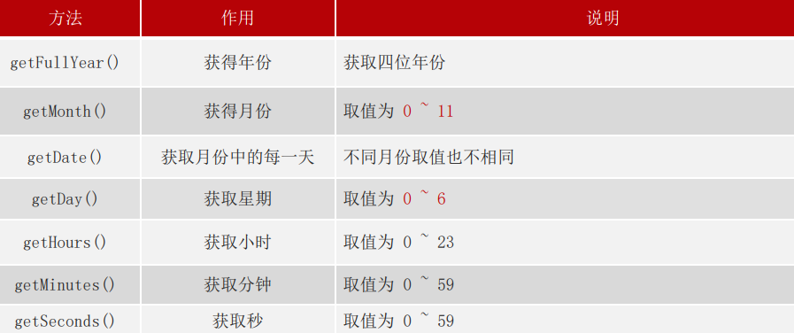

```js
// 获得日期对象
const date = new Date()
// 使用里面的方法
console.log(date.getFullYear())
console.log(date.getMonth() + 1) //月份要+1
console.log(date.getDate())
console.log(date.getDay()) //星期几
```

获得时间的另一种方法

```js
const div = document.querySelector('div')
// 得到日期对象
const date = new Date()
div.innerHTML = date.toLocaleString() //2023/2/28 21:05:24

setInterval(function () {
  const date = new Date()
  div.innerHTML = date.toLocaleString()
}, 1000)

div.innerHTML = date.toLocaleDateString() //2023/2/28
div.innerHTML = date.toLocaleTimeString() //21:11:18
```

## 时间戳

时间戳是指1970年01月01日00时00分00秒起至现在的总秒数或**毫秒数**，它是一种特殊的计量时间的方式

13位的时间戳,其精度是毫秒(ms)

10位的时间戳,其精度是秒(s)

> 注：ECMAScript 中时间戳是以毫秒计的


获取时间戳的方法：

1.  `getTime()` 

    ```js
    // 1. 实例化
    const date = new Date()
    // 2. 获取时间戳
    console.log(date.getTime())
    ```

2. `+new Date()`

    重点记住 +new Date() 因为可以返回当前时间戳或者指定的时间戳

    ```js
    console.log(+new Date())
    ```


3. `Date.now()`
   
    ```js
    console.log(Date.now())
    ```
    - 无需实例化
    - 但是只能得到当前的时间戳， 而前面两种可以返回指定时间的时间戳


注意：
1. 通过时间戳得到是毫秒，需要转换为秒在计算
2. 转换公式：

    ```js
    d = parseInt(总秒数/ 60/60 /24); // 计算天数
    h = parseInt(总秒数/ 60/60 %24) // 计算小时
    m = parseInt(总秒数 /60 %60 ); // 计算分数
    s = parseInt(总秒数%60); // 计算当前秒
    ```


# 节点操作

## DOM 节点

DOM树里每一个内容都称之为节点
-  节点类型
  - 元素节点
    -  所有的标签 比如 `body`、 `div`
    -  `html`是根节点
  - 属性节点
    -  所有的属性 如 `href`
  - 文本节点
    -  所有的文本
  - 其他

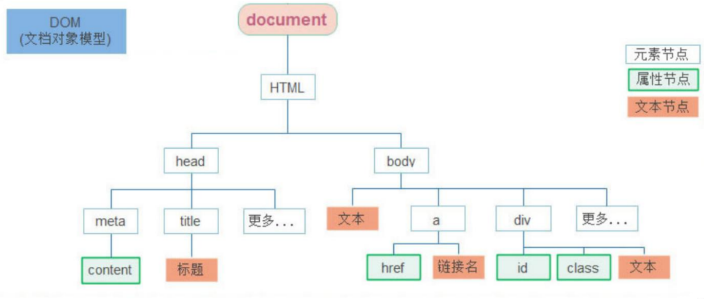


## 查找节点

DOM 树中的任意节点都不是孤立存在的，父子关系or兄弟关系

可以依据节点之间的关系查找节点

### 父子关系

#### 子节点查找

`childNodes`：
- 获得所有子节点、包括文本节点（空格、换行）、注释节点等，回车换行会被认为是空白文本节点


**`children` 属性 （重点）**：
- 仅获得所有元素节点
- 返回的还是一个伪数组

语法：

```js
父元素.children
```

```html
<body>
  <button class="btn1">所有的子节点</button>
  <!-- 获取 ul 的子节点 -->
  <ul>
    <li>HTML</li>
    <li>CSS</li>
    <li>JavaScript 基础</li>
    <li>Web APIs</li>
  </ul>
  <script>
    const btn1 = document.querySelector('.btn1')
    btn1.addEventListener('click', function () {
      // 父节点
      const ul = document.querySelector('ul')

      // 所有的子节点
      console.log(ul.childNodes)  //NodeList(9) [text, li, text, li, text, li, text, li, text]
      // 只包含元素子节点
      console.log(ul.children)   //HTMLCollection(4) [li, li, li, li]
    })
  </script>
</body>
```

#### 父节点查找

`parentNode` 属性
- 返回最近一级的父节点 找不到返回为null
- 获取父节点，以相对位置查找节点，实际应用中非常灵活

语法：

```js
子元素.parentNode
```

```html
<div class="dad">
  <div class="baby">x</div>
</div>
<script>
  const baby = document.querySelector('.baby')
  console.log(baby) ///返回dom对象
  console.log(baby.parentNode) ///返回父节点   dad
  console.log(baby.parentNode.parentNode) ///返回 爷爷节点  body
</script>
```


### 兄弟关系

- `previousSibling` 获取前一个兄弟节点，以相对位置查找节点，实际应用中非常灵活

- `nextSibling` 获取后一个兄弟节点，以相对位置查找节点，实际应用中非常灵活，**包括空节点 文字节点都算**

- `previousElementSibling` 上一个兄弟

- `nextElementSibling`下一个兄弟
  

```html
<body>
<ul>
  <li>1</li>
  <li>2</li>
  <li>3</li>
  <li>4</li>
  <li>5</li>
</ul>
<script>
  const ul = document.querySelector('ul') //ul
  console.log(ul.children) //ul 得到伪数组 选择的是 亲儿子
  const li2 = document.querySelector('ul li:nth-child(2)')
  console.log(li2.previousElementSibling) // 上一个兄弟
  console.log(li2.nextElementSibling) // 下一个兄弟 <li>5</li>
  console.log(li2.nextSibling) // #text
</script>
```


## 增加节点

1. 创建节点
2. 追加节点（在哪加）

### 创建节点

一般先创建节点，然后插入节点

`createElement` 动态创建任意 DOM 节点

语法：

```js
document.createElement('标签名')
```

### 追加节点

要想在界面看到，还得插入到某个父元素中

插入到父元素的最后一个子元素：

```js
父元素.appendChild(要插入的元素)
```

插入到父元素中某个子元素的前面：

```js
父元素.insertBefore(要插入的元素, 在哪个元素前面)
```


```js
// 1. 创建节点
const div = document.createElement('div')
// console.log(div)   在没有body的元素里面创建了div
// 2. 追加节点  作为最后一个子元素
document.body.appendChild(div)
```

```html
<ul>
  <li>我是老大</li>
</ul>
<script>
  const ul = document.querySelector('ul')
  const li = document.createElement('li')
  li.innerHTML = '我是li'
  // ul.appendChild(li)
  // ul.children
  // 3. 追加节点
  // insertBefore(插入的元素, 放到哪个元素的前面)
  ul.insertBefore(li, ul.children[0])
</script>
```

结论：


### 克隆节点

- 复制一个原有的节点
- 把复制的节点放入到指定的元素内部

```js
元素.cloneNode(布尔值)
```

cloneNode会克隆出一个跟原标签一样的元素，括号内传入布尔值
- true，克隆时会包含后代节点一起克隆
- false，克隆时不包含后代节点
- 默认为false


再来看另一种情形的代码演示：

```html
<ul>
  <li>1</li>
  <li>2</li>
  <li>3</li>
</ul>
<script>
  const ul = document.querySelector('ul')
  // 1 克隆节点 元素.cloneNode(true)
  // const li1 = ul.children[0].cloneNode(true)
  // console.log(li1)
  // 2 追加
  ul.appendChild(ul.children[0].cloneNode(true)) //深克隆
  ul.appendChild(ul.children[0].cloneNode()) //<li></li>  浅克隆
</script>
```


## 删除节点

1. 由父节点删除子节点
2. 要删除哪个子节点

```html
<body>
  <!-- 点击按钮删除节点 -->
  <button>删除节点</button>
  <ul>
    <li>HTML</li>
    <li>CSS</li>
    <li>Web APIs</li>
  </ul>

  <script>
    const btn = document.querySelector('button')
    btn.addEventListener('click', function () {
      // 获取 ul 父节点
      let ul = document.querySelector('ul')
      // 待删除的子节点
      let lis = document.querySelectorAll('li')

      // 删除节点
      ul.removeChild(lis[0])
    })
  </script>
</body>
```

> `removeChild` 删除节点时一定是由父子关系


# M端事件

移动端独特的地方：如触屏事件 touch（也称触摸事件）

- 触屏事件 touch（也称触摸事件），Android 和 IOS 都有
- touch 对象代表一个触摸点。触摸点可能是手指/触摸笔。触屏事件可响应用户对屏幕或者触控板操作
- 常见的触屏事件如下：

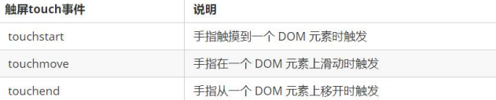


```html
<body>
  <div></div>
  <script>
    const div = document.querySelector('div')
    // 1. 触摸
    div.addEventListener('touchstart', function () {
      console.log('开始摸我了')
    })
    // 2. 离开
    div.addEventListener('touchend', function () {
      console.log('离开了')
    })
    // 3. 移动
    div.addEventListener('touchmove', function () {
      console.log('一直摸，移动')
    })
  </script>
</body>
```


# JS插件

插件: 别人写好的一些代码，只需要复制对应的代码，即可直接实现对应的效果


学习插件的基本过程
- 熟悉官网，了解这个插件可以完成什么需求 https://www.swiper.com.cn/
- 看在线演示，找到符合自己需求的demo https://www.swiper.com.cn/demo/index.html
- 查看基本使用流程 https://www.swiper.com.cn/usage/index.html
- 查看APi文档，去配置自己的插件 https://www.swiper.com.cn/api/index.html
- 注意: 多个swiper同时使用的时候， 类名需要注意区分


先下载：


复制文件到工程文件中：

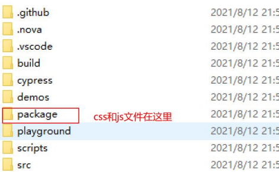

一般情况下只复制这两个文件：

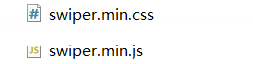

也可以把整个package整个复制


看在线演示，找到符合自己需求的demo

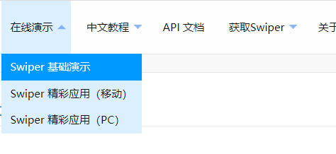

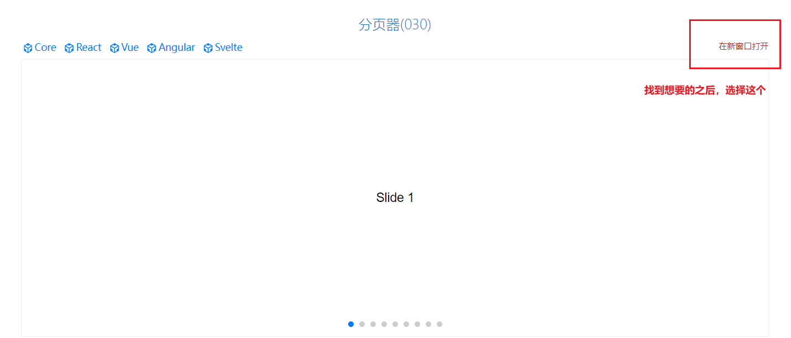

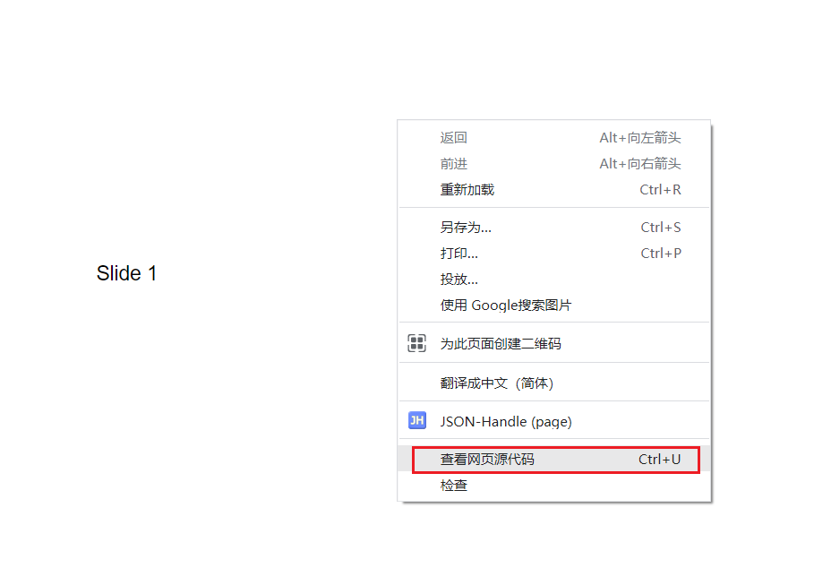

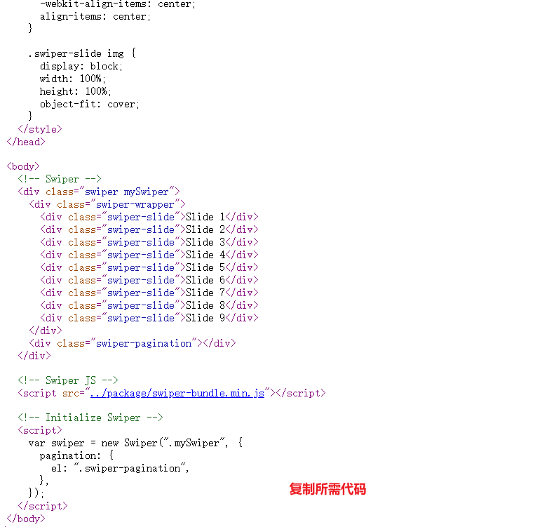


查看基本使用流程

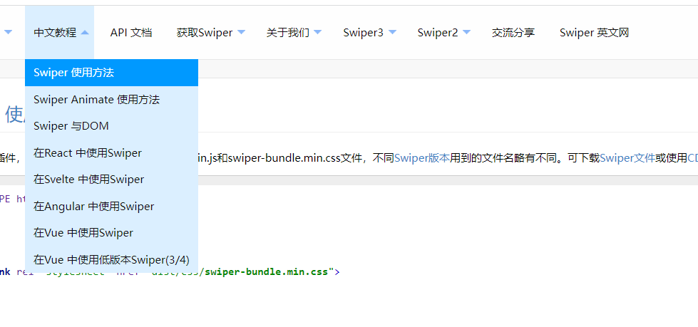

查看APi文档，去配置自己的插件 

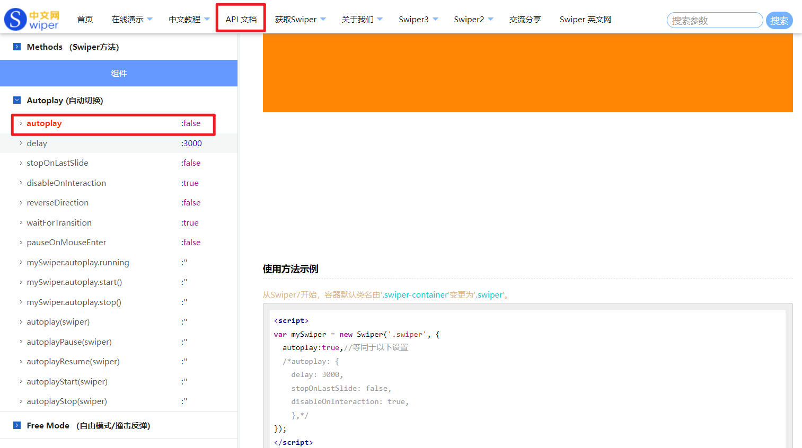


通过调节器查看要修改的元素的名字

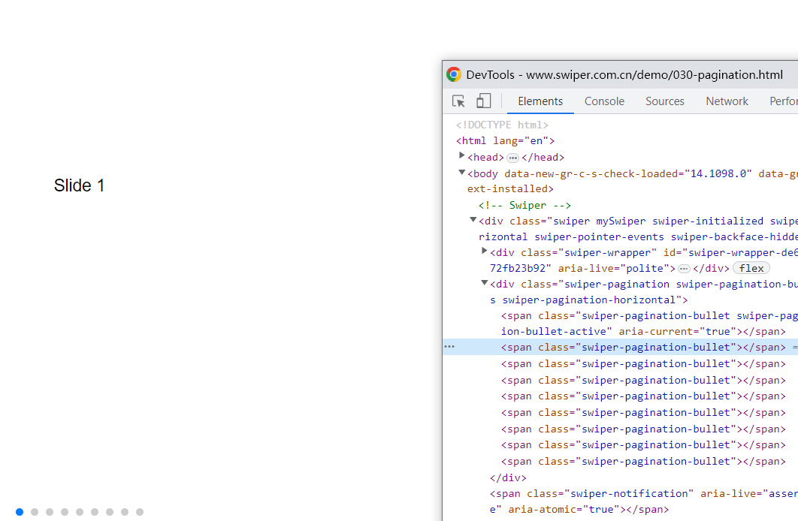


```html
<link rel="stylesheet" href="./css/swiper.min.css">
  <style>
    .box {
      position: relative;
      width: 800px;
      height: 300px;
      background-color: pink;
      margin: 100px auto;
    }

    html,
    body {
      position: relative;
      height: 100%;
    }

    body {
      background: #eee;
      font-family: Helvetica Neue, Helvetica, Arial, sans-serif;
      font-size: 14px;
      color: #000;
      margin: 0;
      padding: 0;
    }

    .swiper {
      overflow: hidden;
      width: 100%;
      height: 100%;
    }

    .swiper-slide {
      text-align: center;
      font-size: 18px;
      background: #fff;

      /* Center slide text vertically */
      display: -webkit-box;
      display: -ms-flexbox;
      display: -webkit-flex;
      display: flex;
      -webkit-box-pack: center;
      -ms-flex-pack: center;
      -webkit-justify-content: center;
      justify-content: center;
      -webkit-box-align: center;
      -ms-flex-align: center;
      -webkit-align-items: center;
      align-items: center;
    }

    .swiper-slide img {
      display: block;
      width: 100%;
      height: 100%;
      object-fit: cover;
    }
  </style>
</head>

<body>
  <div class="box">
    <!-- Swiper -->
    <div class="swiper mySwiper">
      <div class="swiper-wrapper">
        <div class="swiper-slide">Slide 1</div>
        <div class="swiper-slide">Slide 2</div>
        <div class="swiper-slide">Slide 3</div>
        <div class="swiper-slide">Slide 4</div>
        <div class="swiper-slide">Slide 5</div>
        <div class="swiper-slide">Slide 6</div>
        <div class="swiper-slide">Slide 7</div>
        <div class="swiper-slide">Slide 8</div>
        <div class="swiper-slide">Slide 9</div>
      </div>
      <div class="swiper-pagination"></div>
    </div>

  </div>
  <script src="./js/swiper.min.js"></script>

  <script>
    var swiper = new Swiper(".mySwiper", {
      // 小圆点
      pagination: {
        el: ".swiper-pagination",
      },
      // 自动播放
      autoplay: {
        delay: 1000, //1秒切换一次
        disableOnInteraction: false, // 鼠标点击 触摸之后，自动继续播放
      },
      // 可以键盘控制
      keyboard: {
        enabled: true,
        onlyInViewport: true,
      },
    });
  </script>
</body>
```


#  重绘和回流

1. 浏览器是如何进行界面渲染的

-  解析（Parser）HTML，生成DOM树(DOM Tree)
- 同时解析（Parser） CSS，生成样式规则 (Style Rules)
- 根据DOM树和样式规则，生成渲染树(Render Tree)
- 进行布局 Layout(回流/重排):根据生成的渲染树，得到节点的几何信息（位置，大小）
- 进行绘制 Painting(重绘): 根据计算和获取的信息进行整个页面的绘制
- Display: 展示在页面上

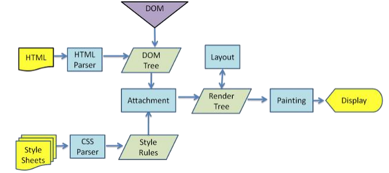

## 回流(重排)
当 Render Tree 中部分或者全部元素的尺寸、结构、布局等发生改变时，浏览器就会重新渲染部分或全部文档的过程

## 重绘
由于节点(元素)的样式的改变并不影响它在文档流中的位置和文档布局时(比如：color、background-color、
outline等)

> 重绘不一定引起回流，而回流一定会引起重绘

## 会导致回流（重排）的操作：
- 页面的首次刷新
- 浏览器的窗口大小发生改变
- 元素的大小或位置发生改变
- 改变字体的大小
- 内容的变化（如：input框的输入，图片的大小）
- 激活css伪类 （如：`:hover`）
- 脚本操作DOM（添加或者删除可见的DOM元素）
简单理解影响到布局了，就会有回流


思考下述代码的重绘重排过程

```js
let s = document.body.style
s.padding = "2px"// 重排 +重绘
s.border = "1px solid red"// 再一次 重排+重绘
s.color ="blue"// 再一次重绘
s.backgroundColor ="#ccc"// 再一次 重绘
s.fontsize="14px"// 再一次重排+重绘
```