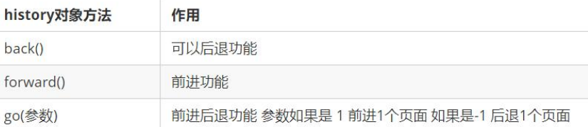

# js组成

JavaScript的组成

- ECMAScript:
  - 规定了js基础语法核心知识。
  - 比如：变量、分支语句、循环语句、对象等等


- Web APIs :
  - DOM   文档对象模型， 定义了一套操作HTML文档的API
  - BOM   浏览器对象模型，定义了一套操作浏览器窗口的API


# Window对象

## BOM(浏览器对象模型)

BOM(Browser Object Model)是浏览器对象模型


- window对象是一个全局对象，也可以说是JavaScript中的顶级对象
- 像`document、alert()、console.log()`这些都是window的属性，**基本BOM的属性和方法都是window的**
- 所有**通过var定义**在全局作用域中的变量、函数都会**变成window对象的属性和方法**
- **window对象下的属性和方法调用的时候可以省略window**


## 定时器-延时函数

JavaScript 内置的一个用来让代码延迟执行的函数，叫 `setTimeout`

**语法：**

```js
setTimeout(回调函数, 延迟时间)
```

`setTimeout` **仅仅只执行一次**，所以可以理解为就是把一段代码延迟执行, 平时省略window

间歇函数 `setInterval` : **每隔一段时间就执行一次**，除非手动清除，平时省略window

**清除延时函数：**

```js
let timerId = setTimeout(回调函数, 延迟时间)
clearTimeout(timerId)
```

>注意点
>
>1. 延时函数需要等待,所以后面的代码先执行
>2. 返回值是一个正整数，表示定时器的编号
>3. 每一次调用延时器都会产生一个新的延时器


```js
// 定时器之延迟函数

// 1. 开启延迟函数
let timerId = setTimeout(function () {
  console.log('我只执行一次')
}, 3000)

// 1.1 延迟函数返回的还是一个正整数数字，表示延迟函数的编号
console.log(timerId)

// 1.2 延迟函数需要等待时间，所以下面的代码优先执行
....


// 2. 关闭延迟函数
clearTimeout(timerId)
```


## JS执行机制

JavaScript 语言的一大特点就是**单线程**，也就是说，**同一个时间只能做一件事**

**单线程**：所有任务需要排队，前一个任务结束，才会执行后一个任务

导致的问题：

若JS执行的时间过长，会造成页面的渲染不连贯，导致页面渲染加载阻塞的感觉

为了解决该问题，利用多核CPU的计算能力，HTML5提出 Web Worker 标准，允许JavaScript脚本创建多个线程

于是，JS 中出现了同步和异步

**同步**
前一个任务结束后再执行后一个任务，程序的执行顺序与任务的排列顺序是一致的、同步的

**异步**
在做这件事的同时，还可以去处理其他事情

**本质区别**： 这条流水线上各个流程的执行顺序


### 同步任务
同步任务都在主线程上执行，形成一个<font color="dd0000">**执行栈**</font>

### 异步任务

JS 的异步是通过回调函数实现的

一般而言，异步任务有以下三种类型:

1. 普通事件，如 `click、resize` 等
2. 资源加载，如 `load、error` 等
3. 定时器，包括 `setInterval、setTimeout` 等
  
异步任务相关添加到<font color="dd0000">**任务队列**</font>中（也称消息队列）

### 执行步骤

1. 先执行执行栈中的**同步任务**
2. **异步任务放入**任务队列中
3. 一旦执行栈中的**所有同步任务执行完毕**，系统就会**按次序**读取任务队列中的**异步**任务，于是被读取的异步任务结束等待状态，**进入执行栈，开始执行**


由于主线程不断的重复获得任务、执行任务、再获取任务、再执行，所以这种机制被称为**事件循环(event loop)**


经典面试题

```js
console.log(1111)
setTimeout(function (){
  console.log(2222)
},1000)
console.log(3333)

// 1111 2222 3333
```

```js
console.log(1111)
setTimeout(function (){
  console.log(2222)
},0)
console.log(3333)

// 1111 2222 3333
```

```js
console.log(1)
document.addEventListener('click', function () {
console.log(4)
})
console.log(2)
setTimeout(function () {
console.log(3)
}, 3000)

// 1 2 4 3 或者   取决于点击事件是发生在 setTimeout之前或之后
// 1 2 3 4
```


## location对象

location (地址) 它拆分并保存了 URL 地址的各个组成部分， 它是一个**对象**

| 属性/方法 | 说明                                                 |
| --------- | ---------------------------------------------------- |
| href      | 属性，获取完整的 URL 地址，赋值时用于地址的跳转      |
| search    | 属性，获取地址中携带的参数，符号 ？后面部分          |
| hash      | 属性，获取地址中的啥希值，符号 # 后面部分            |
| reload()  | 方法，用来刷新当前页面，传入参数 true 时表示强制刷新 |

```html
<body>
  <form>
    <input type="text" name="search"> <button>搜索</button>
  </form>
  <a href="#/music">音乐</a>
  <a href="#/download">下载</a>

  <button class="reload">刷新页面</button>
  <script>
    // location 对象  
    // 1. href属性 （重点） 得到完整地址，赋值则是跳转到新地址
    console.log(location.href)
    // 可以通过js方式跳转到目标地址
    // location.href = 'http://www.itcast.cn'

    // 2. search属性  得到 ? 后面的地址 
    console.log(location.search)  // ?search=笔记本

    // 3. hash属性  得到 # 后面的地址
    console.log(location.hash)
    //后期vue路由的铺垫，经常用于不刷新页面，显示不同页面，比如 网易云音

    // 4. reload 方法  刷新页面
    const btn = document.querySelector('.reload')
    btn.addEventListener('click', function () {
      // location.reload() // 页面刷新
      location.reload(true) // 强制页面刷新 ctrl+f5
    })
  </script>
</body>
```


## navigator对象

navigator是对象，该对象下记录了浏览器自身的相关信息

常用属性和方法：

- 通过 userAgent 检测浏览器的版本及平台

```js
// 检测 userAgent（浏览器信息）
!(function () {
  const userAgent = navigator.userAgent
  // 验证是否为Android或iPhone
  const android = userAgent.match(/(Android);?[\s\/]+([\d.]+)?/)
  const iphone = userAgent.match(/(iPhone\sOS)\s([\d_]+)/)
  // 如果是Android或iPhone，则跳转至移动站点
  if (android || iphone) {
    location.href = 'http://m.itcast.cn'
  }})();

 // !(function () {})()

// ! function () {}()  不加括号加叹号，有些人不喜欢加括号
```


## histroy对象

history (历史)是对象，主要管理历史记录， 该对象与浏览器地址栏的操作相对应，如前进、后退等

**使用场景**

history对象一般在实际开发中比较少用，但是会在一些OA 办公系统中见到

 

常见方法：

 

```html
<body>
  <button class="back">←后退</button>
  <button class="forward">前进→</button>
  <script>
    // histroy对象

    // 1.前进
    const forward = document.querySelector('.forward')
    forward.addEventListener('click', function () {
      // history.forward() 
      history.go(1)
    })
    // 2.后退
    const back = document.querySelector('.back')
    back.addEventListener('click', function () {
      // history.back()
      history.go(-1)
    })
  </script>
</body>
```


# 本地存储

## 本地存储介绍

以前页面写的数据一刷新页面就没有了
为了满足各种各样的需求，会经常性在本地存储大量的数据，HTML5规范提出了相关解决方案

1. 数据存储在**用户浏览器中**
2. 设置、读取方便、甚至页面刷新不丢失数据
3. 容量较大，sessionStorage和localStorage约 5M 左右
   
常见的使用场景：

https://todomvc.com/examples/vanilla-es6/ 页面刷新数据不丢失


## 本地存储分类

###  localStorage（重点）

**作用**：数据可以长期保留在本地浏览器中，**刷新页面和关闭页面，数据也不会丢失**

**特性**：
1. 以键值对的形式存储，并且存储的是字符串， 省略了window
2. 可以多窗口（页面）共享（同一浏览器可以共享）

语法: 

存储数据：

```js
localStorage.setItem(key, value)
```

获取数据：

```js
localStorage.getItem(key)
```

删除数据：

```js
localStorage.removeItem(key)
```

浏览器查看本地数据:


```js
// 本地存储 - localstorage 存储的是字符串 
// 1. 存储
localStorage.setItem('age', 18)

// 2. 获取
console.log(typeof localStorage.getItem('age'))

// 3. 删除
localStorage.removeItem('age')
```

```js
// 1.要存储一个名字  uname pink老师
// localStorage.setItem('键','值')
localStorage.setItem('uname', 'pink老师') //所有的键都要加引号 存储的都是字符串
// 2.获取方式  都加引号
console.log(localStorage.getItem('uname'))
// 3.删除本地存储  只删除名字
localStorage.removeItem('uname')
// 4. 改 如果原来有这个键，则是改，如果么有这个键是增
localStorage.setItem('uname', 'red老师')


// 我要存一个年龄
// 2. 本地存储只能存储字符串数据类型
localStorage.setItem('age', 18)
console.log(localStorage.getItem('age'))
```

### sessionStorage（了解）

特性：

- 用法跟localStorage基本相同
- 区别是：当页面浏览器被关闭时，存储在 sessionStorage 的数据会被清除
- 在同一个窗口(页面)下数据可以共享
- 以键值对的形式存储使

存储：
  
```js
sessionStorage.setItem(key,value)
```

获取：

```js
sessionStorage.getItem(key)
```

删除：

```js
sessionStorage.removeItem(key)
```


## localStorage 存储复杂数据类型

### 存储问题

**问题**：本地只能存储字符串，无法存储复杂数据类型，比如Object类型的数据


**解决**：需要将复杂数据类型转换成JSON字符串，在存储到本地

**语法**：

```js
JSON.stringify(复杂数据类型)
```

JSON字符串：

- 首先是1个字符串
- **属性名**使**用双引号引起来**，不能单引号
- **属性值**如果是**字符串型也必须双引号**

```js
 {
  "uname":"pink老师",
 "age":18,
 "gender":"女"
 }
```

```js
// 本地存储复杂数据类型
const goods = {
  name: '小米',
  price: 1999
}
// localStorage.setItem('goods', goods)
// console.log(localStorage.getItem('goods'))

// 1. 把对象转换为JSON字符串  JSON.stringify
localStorage.setItem('goods', JSON.stringify(goods))
// console.log(typeof localStorage.getItem('goods'))
```


### 取值问题

**问题**：因为本地存储里面取出来的是字符串，不是对象，无法直接使用


**解决**：把取出来的字符串转换为对象

**语法**：

```js
JSON.parse(JSON字符串)
```


```js
// 本地存储复杂数据类型
const goods = {
  name: '小米',
  price: 1999
}
// localStorage.setItem('goods', goods)
// console.log(localStorage.getItem('goods'))

// 1. 把对象转换为JSON字符串  JSON.stringify
localStorage.setItem('goods', JSON.stringify(goods))
// console.log(typeof localStorage.getItem('goods'))

// 2. 把JSON字符串转换为对象  JSON.parse
console.log(JSON.parse(localStorage.getItem('goods')))
```


# 数组join方法

**作用**：join() 方法用于把数组中的所有元素转换一个字符串

**语法**：

```js
const arr = ['red', 'blue', 'pink']

// 数组join方法  把数组转换为字符串
// 小括号为空则逗号分割
console.log(newArr.join())  // red颜色,blue颜色,pink颜色

// 小括号是空字符串，则元素之间没有分隔符
console.log(newArr.join(''))  //red颜色blue颜色pink颜色

console.log(newArr.join('|'))  //red颜色|blue颜色|pink颜色
```

**参数**：

数组元素是通过参数里面指定的分隔符进行分隔的


> 把数据拿出来操作再用map

# 解释

```js
const obj = {}
obj.stuId = 1
obj.uname = 'pink老师'
console.log(obj)
// const obj = {
//   uname: uname.value,
//   age: age.value,
//   gender: gender.value,
//   salary: salary.value,
//   city: city.value,
// }
const o = {
  uname: 'pink'
}

// o.uname  // pink
const item = 'age'
// o['uname'] // pink

o.age = 18
o[item] = 18   //o['age']
o.item = 18  //新增一个item属性 而不是age
// 只要item 是变量，我们不能采取 点的形式 采取的是 中括号的形式
console.log(o)


{
  "uname": "pink",
  "age": 18,
  "item": 18
}
```