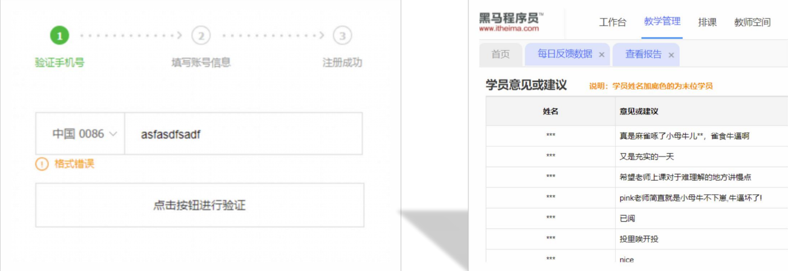
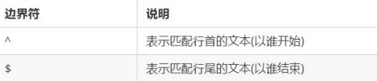
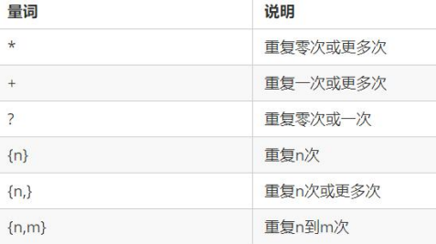
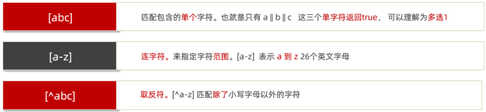
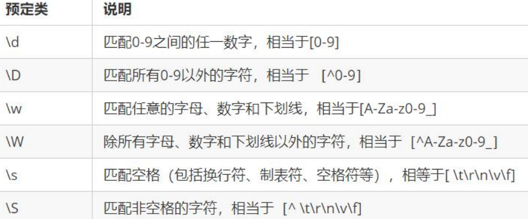

# 正则表达式

**正则表达式**（Regular Expression）是一种字符串匹配的模式（规则）

**使用场景：**

- 表单验证：<font color="dd0000">(匹配)</font>
- 过滤敏感词<font color="dd0000">(替换)</font>
- 从字符串中提取想要的特定部分<font color="dd0000">(提取)</font> 

 


## 正则基本使用

1. 定义规则

   ```js
   const 变量名 =  /表达式/
   ```

   - 其中` /   / `是正则表达式字面量
   - 正则表达式也是`对象 `

   ```js
   const reg =  /前端/
   ```

> 一般用reg命名，因为是英文正则表达式的缩写


2. 使用正则

   - `test()方法`   用来查看正则表达式与指定的字符串是否匹配
   - 如果正则表达式与指定的字符串匹配 ，返回`true`，否则`false`

    ```js
    regObj.test(被检测的字符)
    ```

```js
// 正则表达式的基本使用
const str = 'web前端开发'
// 1. 定义规则
const reg = /web/

// 2. 使用正则  test()
console.log(reg.test(str))  // true  如果符合规则匹配上则返回true
console.log(reg.test('java开发'))  // false  如果不符合规则匹配上则返回 false
```

3. 检索（查找）符合规则的字符串

`exec()`方法 在一个指定字符串中执行一个搜索匹配

语法：

```js
regObj.exec(被检测的字符)
```

> 如果匹配成功，exec() 方法返回一个数组，否则返回null

```js
const str = '我们在学习前端，希望学习前端能高薪毕业'
// 正则表达式使用：
// 1. 定义规则
const reg = /前端/
// 2. 是否匹配
// console.log(reg.test(str)) //true
// 3.exec()
console.log(reg.exec(str)) //返回数组

// ['前端', index: 5, input: '我们在学习前端，希望学习前端能高薪毕业', groups: undefined]
```


## 元字符

1. **普通字符**

- 大多数的字符仅能够描述它们本身，这些字符称作普通字符，例如所有的字母和数字
- 普通字符只能够匹配字符串中与它们相同的字符
- 比如，规定用户只能输入英文26个英文字母，普通字符的话  /[abcdefghijklmnopqrstuvwxyz]/

2. **元字符(特殊字符)**

- 是一些具有特殊含义的字符，可以极大提高了灵活性和强大的匹配功能。
- 比如，规定用户只能输入英文26个英文字母，换成元字符写法： /[a-z]/  

元字符又大概分为三类：

### 边界符

表示位置，开头和结尾，必须用什么开头，用什么结尾，主要有两个字符

>如果 ^ 和 $ 在一起，表示必须是精确匹配



```js
// 元字符之边界符
// 只要有相应的字就可以
console.log(/哈/.test('哈')) // true
console.log(/二哈/.test('二哈')) // true
console.log(/二哈/.test('很二哈哈')) // true


// 1. 匹配开头的位置 ^
const reg = /^web/
console.log(reg.test('web前端'))  // true
console.log(reg.test('前端web'))  // false
console.log(reg.test('前端web学习'))  // false
console.log(reg.test('we'))  // false

// 2. 匹配结束的位置 $
const reg1 = /web$/
console.log(reg1.test('web前端'))  //  false
console.log(reg1.test('前端web'))  // true
console.log(reg1.test('前端web学习'))  // false
console.log(reg1.test('we'))  // false  

// 3. 精确匹配 ^ $
const reg2 = /^web$/
console.log(reg2.test('web前端'))  //  false
console.log(reg2.test('前端web'))  // false
console.log(reg2.test('前端web学习'))  // false
console.log(reg2.test('we'))  // false 
console.log(reg2.test('web'))  // true
console.log(reg2.test('webweb'))  // flase 
```


### 量词

量词用来设定某个模式重复次数



> 注意： 逗号左右两侧千万不要出现空格

```js
// 元字符之量词
// 1. * 重复次数 >= 0 次
const reg1 = /^w*$/
console.log(reg1.test(''))  // true
console.log(reg1.test('w'))  // true
console.log(reg1.test('ww'))  // true
console.log('-----------------------')

// 2. + 重复次数 >= 1 次
const reg2 = /^w+$/
console.log(reg2.test(''))  // false
console.log(reg2.test('w'))  // true
console.log(reg2.test('ww'))  // true
console.log('-----------------------')

// 3. ? 重复次数  0 || 1 
const reg3 = /^w?$/
console.log(reg3.test(''))  // true
console.log(reg3.test('w'))  // true
console.log(reg3.test('ww'))  // false
console.log('-----------------------')


// 4. {n} 重复 n 次
const reg4 = /^w{3}$/
console.log(reg4.test(''))  // false
console.log(reg4.test('w'))  // flase
console.log(reg4.test('ww'))  // false
console.log(reg4.test('www'))  // true
console.log(reg4.test('wwww'))  // false
console.log('-----------------------')

// 5. {n,} 重复次数 >= n 
const reg5 = /^w{2,}$/
console.log(reg5.test(''))  // false
console.log(reg5.test('w'))  // false
console.log(reg5.test('ww'))  // true
console.log(reg5.test('www'))  // true
console.log('-----------------------')

// 6. {n,m}   n =< 重复次数 <= m
const reg6 = /^w{2,4}$/
console.log(reg6.test('w'))  // false
console.log(reg6.test('ww'))  // true
console.log(reg6.test('www'))  // true
console.log(reg6.test('wwww'))  // true
console.log(reg6.test('wwwww'))  // false

// 7. 注意事项： 逗号两侧千万不要加空格否则会匹配失败
```


### 字符类

表示字符的范围，定义的规则限定在某个范围，比如只能是英文字母，或者数字等等，用表示范围

 


 `[a-zA-Z]`表示大小写都可以

```js
// 元字符之范围  []  
// 1. [abc] 匹配包含的单个字符， 多选1
const reg1 = /^[abc]$/
console.log(reg1.test('a'))  // true
console.log(reg1.test('b'))  // true
console.log(reg1.test('c'))  // true
console.log(reg1.test('d'))  // false
console.log(reg1.test('ab'))  // false

// 2. [a-z] 连字符 单个
const reg2 = /^[a-z]$/
console.log(reg2.test('a'))  // true
console.log(reg2.test('p'))  // true
console.log(reg2.test('0'))  // false
console.log(reg2.test('A'))  // false

// 想要包含小写字母，大写字母 ，数字
const reg3 = /^[a-zA-Z0-9]$/
console.log(reg3.test('B'))  // true
console.log(reg3.test('b'))  // true
console.log(reg3.test(9))  // true
console.log(reg3.test(','))  // flase

// 用户名可以输入英文字母，数字，可以加下划线，要求 6~16位
const reg4 = /^[a-zA-Z0-9_]{6,16}$/
console.log(reg4.test('abcd1'))  // false 
console.log(reg4.test('abcd12'))  // true
console.log(reg4.test('ABcd12'))  // true
console.log(reg4.test('ABcd12_'))  // true

// 3. [^a-z] 取反符
const reg5 = /^[^a-z]$/
console.log(reg5.test('a'))  // false 
console.log(reg5.test('A'))  // true
console.log(reg5.test(8))  // true
```

2. 字符类 . (点)代表什么意思？
- 匹配除换行符之外的任何单个字符


3. 预定义
   
   某些常见模式的简写方式，区分字母和数字




```js
日期格式: ^\d[4]-\d{1,2}-\d{1,2}
```


## 替换和修饰符

### 修饰符

修饰符约束正则执行的某些细节行为，如是否区分大小写、是否支持多行匹配等

语法：

```js
/表达式/修饰符
```

- `i` 是单词 ignore 的缩写，正则匹配时字母不区分大小写
- `g` 是单词 global 的缩写，匹配所有满足正则表达式的结果

```js
// 替换和修饰符
const str = '欢迎大家学习前端，相信大家一定能学好前端，都成为前端大神'

// 2. 修饰符 g 全部替换
const strEnd = str.replace(/前端/g, 'web')
console.log(strEnd)


console.log(/a/i.test('a')) // true
console.log(/a/i.test('A'))// true
```


### replace 替换

完成字符的替换

```js
字符串.replace(/正则表达式/, '替换的文本')
```

```js
// 替换和修饰符
const str = '欢迎大家学习前端，相信大家一定能学好前端，都成为前端大神'
// 1. 替换  replace  需求：把前端替换为 web
// 1.1 replace 返回值是替换完毕的字符串
const strEnd = str.replace(/前端/, 'web') 只能替换一个
```


## 正则插件

 


## change 事件

给input注册 change 事件，值被修改并且失去焦点后触发

```js
// change 事件 内容发生了变化
const input = document.querySelector('input')
input.addEventListener('change', function () {
  console.log(111)
})
```

## 判断是否有类

```js
// 添加类名
元素.classList.add('类名')
// 删除类名
元素.classList.remove('类名')
// 切换类名
元素.classList.toggle('类名')
// 判断是否包合某个类名 有返true，没有返回false
元素.classList.contains('类名')
```

`元素.classList.contains()`看看有没有包含某个类，如果有则返回true，么有则返回false


下拉选项 不让其通过

```js
autocomplete='off' 
```

`retuired` H5 非空的  H5新方法  空的就让你去填


# 排错技巧
不报错一般是事件有错


