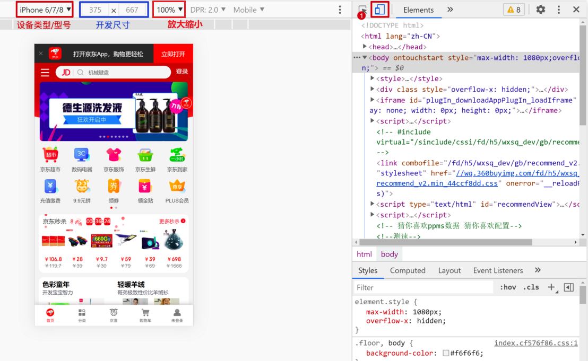
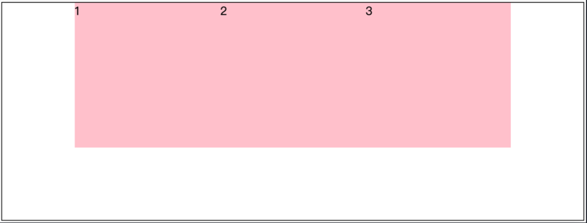
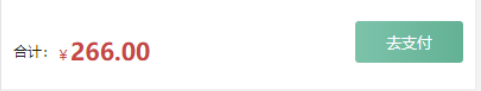

# 移动端特点

## PC端/移动端不同点

PC端

- 屏幕大，网页固定版心
- 端浏览器繁多，更多考虑兼容性问题。（布局： 浮动+定位+标准流）

移动端

- 手机屏幕小，网页宽度多数为100%，是适配手机屏幕宽度
- 移动端则基本不需要考虑兼容性问题，放心大胆使用CSS新特性


##  谷歌模拟器




##  分辨率
屏幕尺寸
- 指的是屏幕对角线的长度，一般用英寸来度量

  
 
1. 物理分辨率：硬件所支持的，屏幕出厂就设定无法修改
2. 逻辑分辨率：软件可以达到的， **我们开发中写的是逻辑分辨率**

1 逻辑分辨率 = 2 物理分辨率

**PC端**逻辑分辨率和物理分辨率的关系：

相等的。 ```1逻辑分辨率 = 1物理分辨率```

**移动端**逻辑分辨率和物理分辨率的关系：

  


## 二倍图

使用像素大厨软件测量二倍图中元素的尺寸

网页美工设计稿参考设备实际机型的像素 产出设计稿保证图片够清晰

我们要做的：
- 先把设计稿缩小一半，改为 375px 来写代码
- 手机显示会按照物理像素显示为 750px ，这样图片就不会失真了，因为设计稿原版就是750px

 以后拿到美工的设计稿，我们先使用像素大厨把设计图改为2X，来写代码

 Pxcook是web模式的项目

  

### 背景精灵图
背景精灵图也存在二倍图

核心做法：
- 到像素大厨里面选择2X，利用background-size缩放背景图片
- 测量坐标即可

## 三倍图

  

  

  


##  视口
默认情况下，网页的宽度和逻辑分辨率不同， 默认网页宽度是980px
  

视口（viewport）就是浏览器显示页面内容的**屏幕区域**

视口的分类：

1. 布局视口 
   
   **iOS, Android基本都将这个视口分辨率设置为980px**，所以PC上的网页大多都能在手机上呈现，一般默认可手动缩放网页

   

2. 视觉视口
   
   用户<font color="dd0000">正在看到的**网站的区域**</font>
  
   可以通过缩放去操作视觉视口，但不会影响布局视口，布局视口仍保持原来的宽度

   

1. 理想视口
   
   <font color="dd0000">设备有多宽，我的网页就显示有多宽</font>

   


### 视口标签

有了视口标签，可以达到我们想要的理想视口

```css
<meta name="viewport" content="width=device-width, initial-scale=1.0, maximum-scale=1.0, user-scalable=0">
```

- width=device-width：视口宽度=设备宽度
- initial-scale=1.0：初始页面缩放倍数
- maximum-scale=1.0：最大缩放倍数
- user-scalable=0：   
  - =0 / no：不允许用户缩放页面（移动端） 
  - =1 / yes：允许用户缩放

京东移动端写法如下：


```css
<meta name="viewport" content="width=device-width, initial-scale=1.0, maximum-scale=1.0, user-scalable=0">
```


# 百分比布局

百分比布局， 也叫流式布局（少用）

效果： 宽度自适应，高度固定

```css
width:40%;
height:100px
```


# Flex布局

Flex布局/弹性布局：
- 浏览器提倡的布局模型
- 布局网页更简单、灵活
- 避免浮动脱标的问题
- 非常适合结构化布局

组成部分
- 弹性容器（父级， 添加display:flex的盒子）
- 弹性盒子（子级，项目）
- 主轴（默认水平）
- 侧轴 / 交叉轴（默认垂直）

   


设置方式

> **父元素**添加 ```display: flex;```，子元素可以自动的挤压或拉伸
>
> <font color="dd0000">一定一定是给父元素添加</font>

在Flex布局模型中，**调节主轴或侧轴的对齐方式来设置盒子之间的间距**


## 主轴对齐方式

> 主轴不一定是水平的，是会变化方向的，默认的主轴是水平的

修改主轴对齐方式属性: ```justify-content```

属性值：

   

重点记住标红的，其中`space-between `用得最多

```css
justify-content: space-between;
```

效果：**两侧没缝隙**


```css
justify-content: space-around;
```

效果：**记住2倍**


```css
justify-content: space-evenly;
```

效果：**记住空隙一样大**


```css
 justify-content: center;
```

效果： **经常用于让一个盒子水平居中**



记忆：

1. 两侧没缝隙是 between
2. 缝隙一样大是 evenly
3. 2倍缝隙是 around

**小技巧：**

 

见到这个效果，最简单的做法就是： 给**大盒**一个左右的`padding`， 然后再加 `justify-content: space-between`


## 侧轴的对齐方式

修改侧轴对齐方式属性: 

- `align-items`（添加到弹性容器-**父级(里面的所有盒子都会适用)** ）
- `align-self`  控制某个弹性盒子在侧轴的对齐方式（添加到弹性盒子-**子级（仅有子盒自身适用）**）

属性：

 

重点记住center ，可以让元素垂直居中

```css
align-items: center;
```

通过flex让一个子盒子水平和垂直居中

 

```css
.father {
    width: 500px;
    height: 500px;
    background-color: pink;
    /* 设置为flex布局 */
    display: flex;
    /* 主轴水平居中 */
    justify-content: center;
    /* 侧轴垂直居中 */
    align-items: center;
}

.son {
    width: 200px;
    height: 200px;
    background-color: purple;
}
```


## 伸缩比

把父盒子分为若干份数，每个子盒子各占几份

语法：

```css
flex: 值(整数);
```

比如有一个父盒子里面有三个子盒子，每个子盒子写 flex：1；  此时每个子盒子各占三分之一

css：

```css
.father {
    display: flex;
    height: 300px;
}

.father div {
    /* 每个孩子各占1份 */
    flex: 1;
    /* 默认子盒子和父亲一样高 */
}
```

html：

```html
<div class="father">
    <div>1</div>
    <div>2</div>
    <div>3</div>
</div>
```

显示效果：


> 1. **一定要给子盒子添加**
> 2. 子盒子默认高度会和父盒子一样高
> 3. 只占用**父盒子剩余尺寸**

加了margin也不用担心掉下来，因为把所有值都算进去了，把剩余的值来匹配


### 圣杯布局

 左右两边大小固定不变，中间宽度自适应

一般这种布局方式适用于各种移动端顶部搜索部分，这是最常见的，如京东手机版主页面顶部搜索


核心思路：

- 两侧盒子写固定大小
- 中间盒子 `flex: 1;`  占满剩余空间

```css
.top {
    display: flex;
    justify-content: center
}

.top div:first-child {
    width: 50px;
    height: 50px;
    background-color: red;
}

.top div:last-child {
    width: 50px;
    height: 50px;
    background-color: red;
}

.top div:nth-child(2) {
    flex: 1;
    height: 50px;
    background-color: pink;
}
```


>注意：中间flex: 1;     和 width 有冲突。  **优先**执行 flex：1；


**************

flex圣杯


传统圣杯（少用）


### 小结

1. 在flex眼中，标签不再分类
   - 简单说就是没有块级元素，行内元素和行内块元素
   - **任何一个元素**都可以直接给宽度和高度一行显示

2. Flex不存在脱标的情况：也就是基本淘汰了浮动，更不用清除浮动

3. 当然存在兼容性问题，如果不考虑兼容性可以大量使用，如果是移动端则不用考虑直接flex

   <https://caniuse.com/>   可以查看兼容性
4. `display: flex;`
默认按主轴排列
5. 不一定所有要都用flex


## 设置主轴方向

主轴默认是水平方向, 侧轴默认是垂直方向

修改主轴方向属性: ```flex-direction```  

取值：


语法：

```css
flex-direction：column;
```


修改完毕，主轴是Y轴， 侧轴是X轴

```css
.box {
  display: flex;
  /* 改变主轴的方向 */
  flex-direction: column;
  /* 侧轴居中 */
  align-items: center;
  /* 主轴对齐 */
  justify-content: center;
  width: 500px;
  height: 500px;
  border: 1px solid pink;
  text-align: center;
}
```

### 修改主轴经常的使用场景：

请完成如下场景：

比如：

 

 

```css
background: url(./mimg/nav测量坐标用的.png) no-repeat;
/* 背景图片必须要缩放 宽度缩放为 28 高度 auto 自动等比例缩放 */
/* background-size: x y; */
background-size: 28px auto;
```


携程的排列分析：

 


## 弹性盒子换行

> 特性：  给父亲添加了 `display: flex;` 所有的子盒子（弹性盒子）都会在一行显示，不会自动换行

弹性盒子换行显示：`flex-wrap`

特别是多行的情况下，我们需要给弹性盒子换行，给**父盒子**弹性容器加

语法：

```css
flex-wrap: wrap;
```

调整行对齐方式 ：`align-content`

取值与justify-content基本相同

> 注意：
> `flex:1;` 有了这个之后就不能换行，想要换行就不能flex:1;


## 设置侧轴对齐方式

> 注意:
> 1. 设置侧轴**多行**的垂直对齐方式。  align-content（**少用，因为开发中一般不给盒子高度，由子盒子撑开**）
> 2. 和前面学过的 `align-items` （侧轴**单行**垂直对齐） （**多，原因也是没有高度，所以用得多**）
> 3. `align 垂直` 比如： align-items 垂直对齐  ；    align-content 多行垂直对齐
> 4. `content `：    主轴  justify-content  ;   align-content  侧轴多行对齐

```css
align-content：center；
```

| 属性值        | 作用                                                |
| ------------- | --------------------------------------------------- |
| flex-start    | 默认值, 起点开始依次排列                            |
| flex-end      | 终点开始依次排列                                    |
| center        | 沿主轴居中排列                                      |
| space-around  | 弹性盒子沿主轴均匀排列,  空白间距均分在弹性盒子两侧 |
| space-between | 弹性盒子沿主轴均匀排列,  空白间距均分在相邻盒子之间 |

 


## flex 总结梳理

flex 它是一种布局方式。 主要目的是通过父盒子控制子盒子如何排列

flex一般是把高度写死，宽度不写


# 主轴排列方式

默认的水平，但是可以转换

1. 给父盒子添加 `display: flex` 

    

2.  `justify-content: center;`

    

3. `justify-content: space-between;` 左右两侧无缝隙

    

4. `justify-content: space-around;`   两倍关系

    

5. `justify-content: space-evenly;`   缝隙均等

    

# 侧轴对齐方式-单行对齐

1. 默认的对齐方式  stretch 拉伸

2. 顶对齐  flex-start

   

2.  align-items: center;   (重点)

    

# 侧轴对齐方式-多行

1.  `align-content: space-between;`

    

2. `align-content: space-around; `

   

3. `align-content: space-evenly; `

   

4. `align-content: center;`

   


原理：


`flex:1;`和`display: flex;`同时出现很正常

```css
.overview .item{
  flex: 1;
  display: flex;
  height: 91px;
  /* 主轴排列 */
  justify-content: space-evenly;
  /* 侧轴居中 */
  align-items: center;
  }
```

默认垂直拉伸和父盒子一样高

高尽量不要动


#### 左边的不想随着右边的内容被拉长

```css
.center-wrapper{
  width: 1240px;
  margin: 30px auto 0;
  display: flex;
  justify-content: space-between;
  /* 加这句 顶对其 */
  align-items: flex-start;
}
```
拉伸，父盒子多高子盒子就多高，让左边的顶对其不拉伸即可

**父元素设置为 flex布局时，子元素的宽度由内容撑开，高度变为 100%**