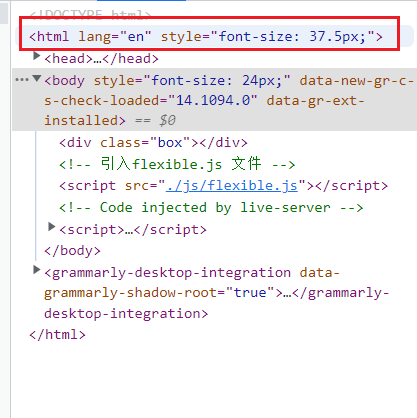
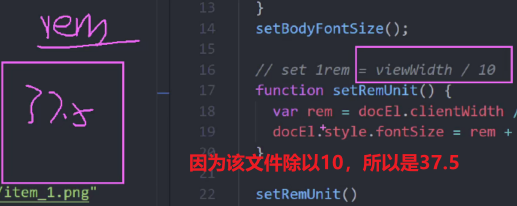
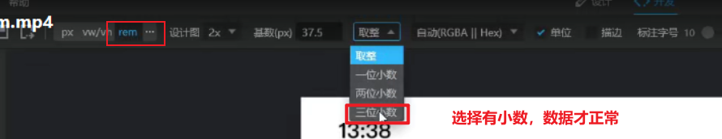
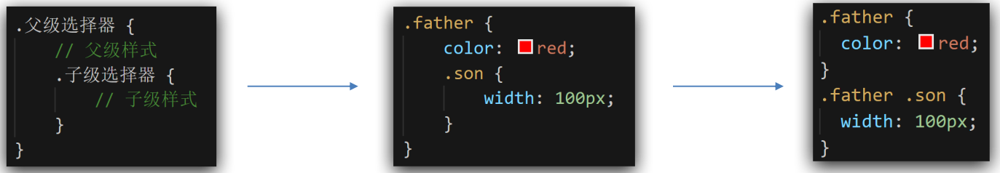
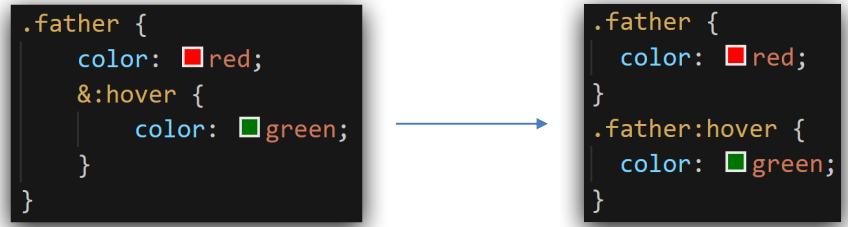
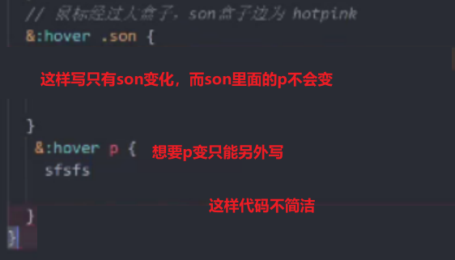
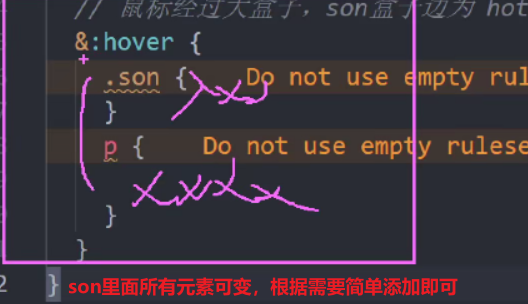
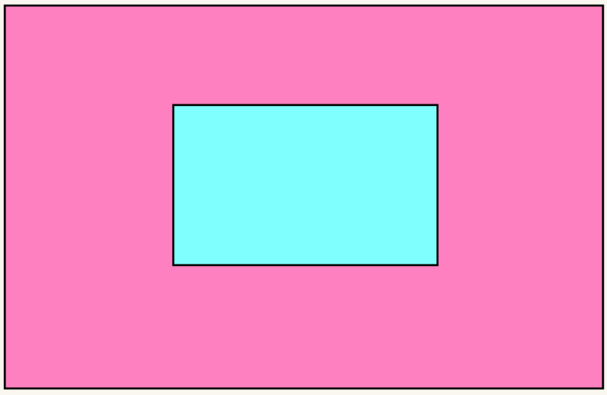
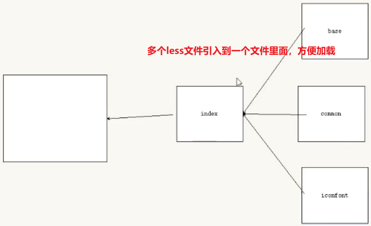
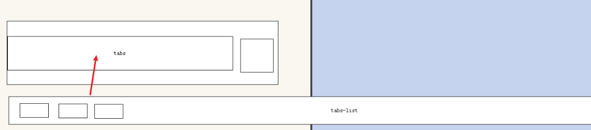

# 移动适配方案

屏幕宽度发生变化，页面元素的尺寸（宽度和高度）也随之变化

解决方案：
- 百分比布局或者flex完成整体元素排列布局
- 配合rem或者vw/vh单位设置元素的尺寸（宽度/高度）最终适配

## 适配方案
移动端的适配方案：

1.  flex + rem单位   做适配效果  （比如淘宝和小米移动端） 当前市场最多       
2.  flex + viewport  width /vh单位  做适配效果  （比如 B站移动端 ） 新兴，马上的一个趋势

>让flex做布局（盒子摆放），让rem或者vw/vh 实现网页元素的尺寸（宽度和高度）适配屏幕


## rem 适配

### rem 单位

rem 是一个**相对**单位，**仅相对于HTML标签**的字号计算结果

`1rem = 1HTML字号大小`

只需要修改html的文字大小，就可以完成元素大小的等比例缩放


比如

```css
html {
    font-size: 35px;
}
```

则此时  1rem 就是 35像素

px 绝对单位

html字体默认大小是16px

em容易受父盒子的影响，少用

### 媒体查询（了解）

媒体查询 media query：可自动检测视口的宽度，然后编写差异化的 CSS 样式

当某个条件成立, 执行对应的CSS样式

媒体查询一个非常大的作用：`根据屏幕宽度修改html文字大小`

> 使用媒体查询, 根据不同的视口宽度, 设置不同的根字号 ，就完成了适配

**语法：**

```css
@media (媒体特性) {
  选择器 {
      CSS属性
  }
}
```

css：

```css
@media (width:375px) {
    html {
        font-size: 40px;
    }
}

@media (width:320px) {
    html {
        font-size: 30px;
    }
}
```

综合：

```css
@media (width:375px) {
    html {
        font-size: 37.5px;
    }
}
@media (width:414px) {
    html {
        font-size: 41.4px;
    }
}

.box {
    width: 5rem;
    height: 5rem;
    background-color: pink;
}
```

>通过媒体查询，检测不同的视口宽度，设定不同的html文字大小，元素设置rem单位后，可以达到元素适配效果


### flexible.js 

媒体查询麻烦、检测不够精确，因此使用 flexible.js 这个 js文件，通过js 实时检测屏幕窗口的变化实现检测视口宽度。

值得提倡使用的一种方式

>该js文件，可自动检测屏幕宽度，**自动修改html文字大小**，即可让盒子配合rem完成适配

```html
<script src="./js/flexible.js"></script>
```
看到调试器里面有这句话就是引入成功了：




原理：




### 如何把设计稿的px转换为rem 

目前rem布局方案中，将网页等分成10份， HTML标签的字号为视口宽度的 1/10

1. flexible 能够修改html文字大小，修改文字大小:   当前屏幕 1 / 10  就是文字大小

   例如：  当前屏幕 375px，则加了 flexible之后，html文字大小为 37.5px 

2. 设计稿里面元素大小固定，px单位 ，开发的时候，要使用 rem 才能适配
   
3. 查看设计稿宽度 → 确定参考设备宽度(视口宽度) → 确定基准根字号（1/10视口宽度）

4. 把测量的px 转换为适配的rem的方法：
   > 直接使用测量的px值 /  37.5 就是 rem的值

#### 利用pxcook测量rem




## LESS

less 可以帮我们把px单位转换到rem单位

Less是一个CSS预处理器,其文件后缀.less

扩充CSS语言, 使CSS具备一定的逻辑性、计算能力

css不支持计算，如果计算的话一定是less里面写代码，在下载easy less插件自动生成css文件

> 注意：浏览器不识别Less代码，目前阶段，网页要引入对应的CSS文件

### Less语法

注释：
- 单行注释
  - 语法：`// 注释内容`
  - 快捷键：`ctrl + /`
- 块注释
  - 语法：`/* 注释内容 */`
  - 快捷键： `shift + alt + A`


### less 运算

less:

```less
.box {
  width: 100px + 100;
  // 注意：单位的转换 计算的时候以第一个单位为准
  height: (100 / 37.5rem);
  // height: (100rem / 37.5);
  // height: 100px - 50;
  margin: (20px * 5) auto;
  // 除法特殊 尽量小括号
  padding: (10px / 5);
  border: 1px + 2 * 3 solid red;
}
```

注意点：

1. 计算以第一个单位为准， 单位尽量写到最后一个数字上。 比如

   ```less
   height: (100 / 37.5rem);
   ```

2. 除法比较特殊，必须添加小括号

3. 计算别忘了先乘除后加减


###  less 嵌套

可以生成后代选择器

语法：



> 注意：&（代替父元素）不生成后代选择器，表示当前选择器，通常配合伪类或伪元素使用
>
> 

less：

```less
.father {
    width: 500px;
    height: 500px;
    background-color: purple;
    // 孩子
    .son {
        width: 200px;
        height: 200px;
        background-color: pink;
        p {
            color: red;
        }
    }
}
```

生成css之后：

```css
.father {
  width: 500px;
  height: 500px;
  background-color: purple;
}
.father .son {
  width: 200px;
  height: 200px;
  background-color: pink;
}
.father .son p {
  color: red;
}
```


less：

```less
.nav {
  width: 100px;
  height: 100px;
  background-color: pink;
  &::before {
    content: '1';
  }
  &:hover::before {
    color: red;
  }
}
```

生成css之后：

```css
.nav {
  width: 100px;
  height: 100px;
  background-color: pink;
}
.nav::before {
  content: '1';
}
.nav:hover::before {
  color: red;
}
```

> 注意写法的问题
>
> 这样写代码不够简洁：
> 
> 
>
> 简洁的应该这样写：
>
> 


### less 变量

变量最大的优点是： 方便使用和修改

语法：

   定义变量：
   
   ```css
   @变量名: 值;
   @fontSize: 16px;
   ```
   使用变量：

   ```css
   CSS属性：@变量名;
   ```

less：

```less
@suibian: hotpink;

p {
  background-color: @suibian;
}
```

```css
p {
  background-color: hotpink;
}
```
> 若要更改颜色，只需要改变变量里的一个值即可，非常方便
> 
### 小练习

需求1： 使用less 完成以下效果   大盒子 father  小盒子  son

 

需求2： 鼠标经过大盒子，小盒子颜色变为 hotpink色

需求3： 请将 hotpink 颜色定义为一个变量。   @bgcolor     

`建议： 小驼峰命名法     @backGroundColor`

```less
// 背景颜色变量
@backGroundColor: deeppink;
// 定义边框
@bd: 3px solid green;
.father {
  width: 500px;
  height: 500px;
  background-color: pink;
  display: flex;
  justify-content: center;
  align-items: center;
  border: @bd;
  .son {
    width: 200px;
    height: 200px;
    background-color: skyblue;
    border: @bd;
  }
  // &:hover .son {
  //   background-color: hotpink;
  // }
  &:hover {
    .son {
      background-color: @backGroundColor;
    }
  }
}
```

### less导入

less的导入实际 是  less 文件的导入 

```less
@import './变量.less';
@import url(./变量.less);
```

使用less导入的好处是：  减少了html页面 的 link标签数量



### less 导出

设置 → 搜索EasyLess → 在setting.json中编辑 → 添加代码（注意，**必须是双引号**）


使用插件来设置导出：

```less
"less.compile": {
  "out": "../css/" // 设置导出css路径
},
```
含义：翻到根目录，查看是否已经创建css文件夹，若未创建则创建，并导入自动生成的css文件该文件夹中；已创建的直接导入


#### 手动给每个less文件指定导出

>导出必须写到第一行

1. 
    ```less
    // out: 路径/文件名
    ```
    
    ```css
    // out: ./mycss/pink.css
    ```
    
    设置导出：  当面目录下，创建一个 mycss 文件    夹， 生成 一个 pink.css （**做了改名**）

2. 
   ```css
   // out: ./mycss/
   ```
   
   设置导出：  当面目录下，创建一个 mycss 文件   夹， 生成 一个 跟less一样的文件名（原名）

   > 注意文件夹名称后面添加 

### less 禁止导出


适用一些less文件放在根目录中或者引入一个less文件里的那些less文件

```less
// out: false
```


## 小结

我们的需求的是要做移动端适配： 页面中的元素尺寸跟随屏幕宽度等比例缩放（适当调整大小）

方案如下：

flex + rem  + flexiable.js  + less  

1. 我们移动端采取 `flex 布局`
2. rem单位：  做移动端`适配`
   - rem相对单位，跟html文字大小有关系
3. 媒体查询： `检测屏幕的视口宽度`
4. flexiable.js ：`可以根据屏幕的宽度自动修改html文字大小`
5. less:  `less让我们的css具有了计算能力`
   - less 可以让我们很方便的 把 px 转换为 rem 
6. 没有.less后缀不会有影响，但是最好写
7. 开发完之后less可以扔掉
8. 一定是放在文件夹中

## 基准值

 1. 1个html文字大小就是 1rem
  
 2. flexiable.js 把屏幕默认划分为 10等份 

  ```js
   // set 1rem = viewWidth / 10
  function setRemUnit () {
    var rem = docEl.clientWidth / 10
    docEl.style.fontSize = rem + 'px'
  }
  ```
  
 标准的写代码设计稿的宽：  375px  
  
 每一份是 37.5像素  375 / 10 = 37.5
  
 flexiable.js 把 一份37.5 px作为  1rem 
  
 1rem =  37.5px
  
 我们就作为基准值  37.5 
  
 假如 有一个  37.5px的 盒子   转换完毕之后是   1  rem  


 1. 1个html文字大小就是 1rem
  
  
 2. flexiable.js 把屏幕默认划分为 20等份  
  
  ```js
   // set 1rem = viewWidth / 20
  function setRemUnit () {
    <!-- 除以20 -->
    var rem = docEl.clientWidth / 20
    docEl.style.fontSize = rem + 'px'
  }
  ```

 标准的写代码设计稿的宽：  375px
  
 每一份是  18.75像素  375 / 20 = 18.75
  
 1rem =  18.75px
  
作为基准值  18.75
  
假如 有一个  37.5px的 盒子   转换完毕之后是   2  rem  

其实都还是37.5px的盒子
  
 flex 布局+rem（html标签文字大小）+ flexiable.js（修改html文字大小） + less（计算、嵌套） 
  
  


## vw适配（趋势）

vw就是视口的宽度，vw 是个相对单位

不管在什么屏幕下， 我们把屏幕分为平均的 100等份 

vw：viewport width
- `1vw = 1/100视口宽度(屏幕宽度)`
  
vh：viewport height
- `1vh = 1/100视口高`


1vw  和    1%  

widith: 1vw; 

width: 1%;


基准值也会变哦

开发中vh基本不用
高度很少拉动，只是宽度变化

高宽度都加50，所以只用一个就够了


### vw 和  1% 的区别：

1. vw 永远是以**视口的宽度**为准
   - 在 375设计稿下， 1vw 永远是  3.75px
2. **百分比以父盒子为准**
   - 假如父盒子是 200px，则 1% 是 2px

## px 如何转为vw

我们设计稿是 iphone 678  是  375px， vw 把屏幕划分了100等份， 则 1vw  =  3.75 px

有个盒子的宽度是 3.75px * 3.75px ，则 写成 vw 是多少？    1vw * 1vw

一个盒子，宽度和高度分别是  37.5px 和 37.5px  ，则 转换为vw 是多少？  10vw * 10vw 

一个盒子  68px  *  29px ，则我们写代码 less  vw  ？

```less
width: (68 / 3.75vw);
height: (29 / 3.75vw);
```

## tabs 布局分析



里面需要放一个 tabs-list 盒子   这个盒子放 a 

拖动的时候，拖动的是   tabs-list 

里面有很多小链接， 不允许换行

给 tabs-list  添加 display: flex;   因为 加了弹性容器 ，里面所有的弹性盒子都会沿着主轴一行显示，不会换行。

文字不允许换行

```css
white-space: nowrap;
```


#  rem 和 vw / vh 的区别

rem:
- 市场比较常见：
1. 需要不断修改html文字大小
2. 需要媒体查询media
3. 需要 flexible.js

vm/vh:
- 将来(马上)趋势
1. 省去各种判断和修改
代表：
b站..


# px  pt  em   rem   vw  几个单位
   - px  绝对单位 网页布局最常用的单位， 一般用于pc端布局。  px 像素的意思。  版心是 1200px  
   - pt  点  常用于 印刷。   或者 ios 常用的单位。 我们前端基本不用。
   - em   相对单位。   1em 就是当**前的一个文字**大小。 场景：   段落首行缩进 2个字。   `text-indent: 2em;`
   - rem 相对单位。  相对于 **html标签** 的文字大小，跟其余标签没有任何关系
     -   场景： 做适配
   - vw 可以看做是适配的终极版本。  vw也是相对单位。  vw 把屏幕划分了 100等份
     - 场景： 做适配