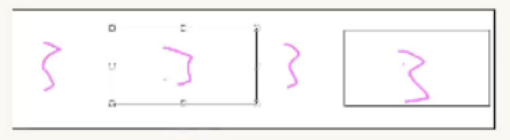
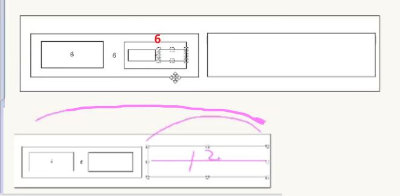

# 媒体查询

现在开发中，响应式页面会比较少

 学会如何去使用前端 UI 框架

1. 媒体查询作为了解
2. Bootstrap 框架，我们是学会怎么去用，而不是怎么去做东西，因为后面有更好的框架： 饿了吗 和 vant

学习媒体查询的目的：

1. 了解如何使用媒体查询做响应式页面
2. 为接下来学的 Bootstrap  做铺垫

## 语法

媒体特性常用写法

```css
@media (媒体特性) {
  选择器{
    样式
  }
}
```

完整写法:

```css
@media 关键词 媒体类型 and (媒体特性){ CSS代码 }
```

### 连接词
- and
- only
- not
### 媒体类型

用来区分设备类型的，如屏幕设备、打印设备等，其中手机、电脑、平板都属于屏幕设备


比如:

```css
@media screen andv(max-width: 1189px) .main .core 
{
  width:-492px;pxoverflow:hidden;
}
```

### 媒体特性

主要用来描述媒体类型的具体特征，如当前屏幕的宽高、分辨率、横屏或竖屏等


## 引入

外链式CSS引入

```html
<link rel="stylesheet" media="逻辑符 媒体类型 and (媒体特性) href="xx.css">
```

## 媒体查询常用代码和方式

**min-width（数值从小到大写）**

**max-width（数值从大到小写）**

因为后面会覆盖前面的


需求
- 默认网页背景色是灰色
- 屏幕宽度在768-992之间, 网页背景色是粉色
- 屏幕宽度在992-1200之间, 网页背景色是skyblue
- 屏幕宽度大于1200, 网页背景色是绿色

```css
body {
    background-color: gray;
}

/* 大于等于768px 为粉色 */
@media (min-width: 768px) {
    body {
        background-color: pink;
    }
}

/* 大于等于992px 为蓝色 */
@media (min-width: 992px) {
    body {
        background-color: skyblue;
    }
}

/* 大于等于992px 为绿色 */
@media (min-width: 1200px) {
    body {
        background-color: green;
    }
}
```

图示:

   

如果用max-width写的:

   


### 外部引入
在css文件里面写了不同body的样式,但是更改代码在html头部


   

   

html:

```html
<link rel="stylesheet" media="(max-width:1200px)" href="./css/pc.css">
<link rel="stylesheet" media="(max-width:992px)" href="./css/pad.css">
<link rel="stylesheet" media="(max-width:768px)" href="./css/m.css">
```

也可达到适应不同的页面来更换背景颜色

效果:


## 媒体查询使用场景

### 1-约束移动端不要超过规定大小

```css
body {
  /* body最大宽度是 540px */
    max-width: 540px;
    margin: 0 auto;
}

/* 大于等于540px 则不允许缩放 
而我们的页面通过rem 
不让rem缩放，实际不让 html文字大小有变化 
html文字大小再改动，强制定为 54px*/
@media (min-width: 540px) {
    html {
        font-size: 54px !important;
    }
}
```

但是其中的toolbar是固定定位和body无关,想要让也不超过特定大小

```css
.toolbar{
  position: fixed;
  /* 加上中间两句 */
  left: 50%;
  transform: translateX(-50%);
  bottom: 0;
}
```

实例:

```css
@media (min-width: 540px) {
  html {
    font-size: 54px !important;
  }
}

@media (max-width: 320px) {
  html {
    font-size: 32px !important;
  }
}

/* body最大宽度是 540px */
body {
  max-width: 540px;
  /* 页面最小宽度是 320px */
  min-width: 320px;
  /* 让页面不管怎么拉都是居中 */
  margin: auto;
}
```

### 2-元素的显示和隐藏


```css
@media (max-width: 800px) {
  .box {
        width: 1000px;
  }
  .box div:nth-child(2) {
        display: none;
  }

  .box div:last-child {
        width: 350px;
  }
}
```

### 3-响应式原理

```html
<!DOCTYPE html>
<html lang="en">

<head>
  <meta charset="UTF-8">
  <meta http-equiv="X-UA-Compatible" content="IE=edge">
  <meta name="viewport" content="width=device-width, initial-scale=1.0">
  <title>Document</title>
  <style>
    .box {
      width: 1000px;
      height: 150px;
      /* background-color: pink; */
      margin: 0 auto;
      display: flex;
      flex-wrap: wrap;
    }

    .box div {
      width: 25%;
      background-color: skyblue;
      height: 150px;
      margin-bottom: 20px;
    }

    .box div:nth-child(even) {
      background-color: pink;
    }

    @media (max-width: 992px) {
      .box {
        width: 768px;
      }

      .box div {
        width: 50%;
      }
    }

    @media (max-width: 768px) {
      .box {
        width: 100%;
      }

      .box div {
        width: 100%;
      }
    }
  </style>
</head>

<body>
  <div class="box">
    <div>1</div>
    <div>2</div>
    <div>3</div>
    <div>4</div>
  </div>
</body>

</html>
```


# BootStrap

## UI框架

将常见效果进行统一封装后形成的一套代码, 如：BootStrap

作用
- 基于框架开发，效率高，稳定性高

## 使用配置
Bootstrap 是由 Twitter 公司开发维护的前端 **UI 框架**，它提供了大量编写好的 CSS 样式，允许开发者结合一定 HTML 结构及JavaScript，快速编写功能完善的网页及常见交互效果

中文官网: <https://www.bootcss.com/>

### 下载安装包


### 使用步骤：

1. 复制 css文件

    

   并且引入到html文件中

   ```html
   <link rel="stylesheet" href="./css/bootstrap.min.css">
   ```

2. 复制字体图标文件夹

    

3. 如果需要js，则复制js文件，并引入html文件中


   > 注意，所有插件都依赖 jQuery （也就是说，jQuery必须在所有插件之前引入页面），引入是在body里面写

   


   ```html
    <!-- 引入jquery 依赖关系，jquery必须在上面引入 -->
   <script src="./js/jquery-3.5.1.min.js"></script>
   <!-- 后引入 bs的 js -->
   <script src="./js/bootstrap.min.js"></script>
   ```

4. 使用内部预定义好的类即可

    打开中文文档，据需要选择使用即可

   

   ```html
   <!-- container：响应式布局版心类 -->
   <div class="container">我的内容</div>
   ```


## 栅格系统

栅格系统(gridsystems),也叫“网格系统，它就是通过一系列的行（row）与列（column）的组合创建页面布局

简单说，栅格系统也是一种布局方式BootStrap 给咱们内置好了一套布局系统

**BootStrap3默认将网页分成12等份**


超大屏幕下一个通栏的大盒子

```html
<div class="container">
  <div class="col-lg-12">我自己独占一行</div>
</div>
```

超大屏幕，一行平分左右

~~~html
<div class="container">
  <div class="col-lg-6">我占左边6个</div>
  <div class="col-lg-6">我站右边6个</div>
</div>
~~~


超大屏下，一行放4个

```html
<div class="container">
  <div class="col-lg-3">我占左边3个</div>
  <div class="col-lg-3">我站右边3个</div>
  <div class="col-lg-3">我站右边3个</div>
  <div class="col-lg-3">我站右边3个</div>
</div>
```




实现不同屏幕下，不同的显示个数，可以通过使用不同类名实现

还是这4个盒子，在中等屏幕下放3个

```html
<div class="container">
  <div class="col-lg-3 col-md-4">盒子内容</div>
  <div class="col-lg-3 col-md-4">盒子内容</div>
  <div class="col-lg-3 col-md-4">盒子内容</div>
  <div class="col-lg-3 col-md-4">盒子内容</div>
</div>
```

> 注意：只有col-md-4，代表在lg的时候也是3个，因为中屏是三个，则大于中屏的也是三个


还是这4个盒子，在小屏幕下放2个

```html
<div class="container">
  <div class="col-lg-3 col-md-4 col-sm-6">盒子内容</div>
  <div class="col-lg-3 col-md-4 col-sm-6">盒子内容</div>
  <div class="col-lg-3 col-md-4 col-sm-6">盒子内容</div>
  <div class="col-lg-3 col-md-4 col-sm-6">盒子内容</div>
</div>
```


还是这4个盒子，在超小屏幕下放1个

```html
<div class="container">
  <div class="col-lg-3 col-md-4 col-sm-6 col-xs-12">盒子内容</div>
  <div class="col-lg-3 col-md-4 col-sm-6 col-xs-12">盒子内容</div>
  <div class="col-lg-3 col-md-4 col-sm-6 col-xs-12">盒子内容</div>
  <div class="col-lg-3 col-md-4 col-sm-6 col-xs-12">盒子内容</div>
</div>
```


### 栅格系统布局响应式

bs内部做响应式的效果

`container`是 Bootstrap 中专门提供的类名，所有应用该类名的盒子，默认**已被指定宽度且居中**，已经通过媒体查询处理了屏幕范围

container的默认最大宽度是 1170px。若需要更大宽度（如：1280px），在总的.css文件里添加

`.container-fluid`Bootstrap专门提供的类名，所有应用该类名的盒子，宽度均为 100%（不怎么用），适合于单独移动端开发


若份数除不尽的时候改为百分比
  ```html
  <!-- 有内边距，麻烦，不怎么用 -->
  <div class="container-fluid">123</div>
  ```

分别使用`.row类名`和 `.col类`名定义栅格布局的行和列


注意: 
1. container类自带间距15px; 
2. row类自带间距-15px

**row 可以去container默认的内边距**

同时写col、row就会自动去掉内边距


### 列偏移

列偏移 通过  `col-lg-offset-*`  

让盒子**往右侧走**，左边有几份

**偏移都是往右走**

如：

```css
.first div {
  height: 100px;
  background-color: pink;
}

.second div {
  background-color: purple;
  height: 100px;
}

.third div {
  height: 100px;
  background-color: skyblue;
}

```

```html
<div class="container">
  <div class="row first">
    <div class="col-lg-4">左侧</div>
    <div class="col-lg-4 col-lg-offset-4">右侧</div>
  </div>
  <div class="row second">
    <div class="col-lg-3 col-lg-offset-3">1侧</div>
    <div class="col-lg-3 col-lg-offset-3">2侧</div>
  </div>
  <div class="row third">
    <!-- 盒子居中对齐 -->
    <div class="col-lg-6 col-lg-offset-3"></div>
  </div>
</div>
```

效果如下：


### 列嵌套

一个盒子里面可以再嵌套其他的盒子，但是站在这个盒子的角度来看，它又分为了12份




```css
.container .row div {
  height: 100px;
  background-color: pink;
}
```

```html
<div class="container">
  <div class="row">
    <div class="col-lg-4">
      <p class="col-lg-6">登录</p>
      <p class="col-lg-6">注册</p>
    </div>
    <div class="col-lg-4">2</div>
    <div class="col-lg-4">3</div>
  </div>
</div>
```

效果：


## 全局样式

分类：
-  布局样式
-  内容美化样式

手册用法：
BootStrap预定义了大量类用来美化页面，**掌握手册的查找方法是学习全局样式的重点**

网站首页 → BootStrap3中文文档 → 全局CSS样式 → 按分类导航查找目标类

***使用时直接看文档，把所需的class名复制即可***

### 布局样式

布局类：表格、按钮、表单、辅助类（浮动/居中...）、响应式工具

#### 响应式工具（不同屏幕尺寸隐藏或显示页面内容）


```html
<div class="container">
  <div class="row">
    <div class="col-md-3">1</div>
    <div class="col-md-3">2</div>
    <div class="col-md-3 hidden-sm hidden-xs">3</div>
    <div class="col-md-3">4</div>
  </div>
</div>
```

### 美化内容类

图片，改变图片形状大小之类的


> 不需要的样式直接删即可

## 组件

组件
- BootStrap提供的常见功能，包含了HTML结构和CSS样式

使用方法
- 引入BootStrap样式
- 复制结构，修改内容

**Glyphicons字体图标的使用步骤**
- HTML页面引入BootStrap样式文件
- 空标签调用对应类名
- glyphicon
- 图标类


## 插件

 BootStrap提供的常见效果, 包含了HTML结构，CSS样式与JavaScript

插件的使用步骤
- 引入BootStrap样式
- 引入js文件：jQuery.js + BootStrap.min.js
- 复制HTML结构, 并适当调整结构或内容

```html
<!-- 引入jquery 依赖关系，jquery必须在上面引入 -->
<script src="./js/jquery-3.5.1.min.js"></script>
<!-- 后引入 bs的 js -->
<script src="./js/bootstrap.min.js"></script>
```

## 定制

定制步骤
- 导航菜单 → 定制
- 输入目标变量值
- 编译并下载，使用定制后的框架


# 使用BootStrap的小技巧

`&` 代表当前选择器

乱的话，删了重抄

都是先引入别人的再引入自己的
container有内边距，一般是加row再写四个盒子

只要加了col就会有内边距，默认是15px，这时候只需要在里面再套一个盒子，宽度100%，就不需要再考虑间隔了

bootstrap默认小屏就是显示一行


