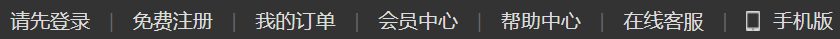
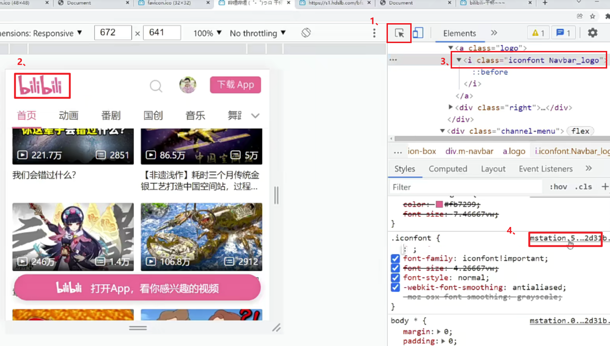
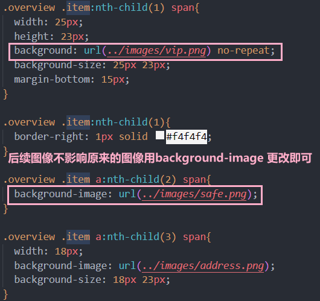

# 项目前置认知
## 网页与网站的关系

网站是提供特定服务的**一组网页集合**

网页是网站中的每一“页”


## SEO三大标签
1. title：网页标题标签
2. description：网页描述标签
3. keywords：网页关键词标签，让别人可以搜索到


## 有语义的布局标签

- header：网页头部
- nav：网页导航
- footer：网页底部
- aside：网页侧边栏
- section：网页区块
- article：网页文章


## ico图标的设置
场景：显示在标签页标题左侧的小图标，习惯使用.ico格式的图标


常见代码：
```<link rel="shortcut icon" href="ico图标路径" type="image/x-icon";```

> 一般习惯将ico图标放在项目根目录

## 版心的介绍
场景：把页面的主体内容约束在网页中间

作用：让不同大小的屏幕都能看到页面的主体内容

```css
/*版心*/
.container {
    width: 1240px;
    margin: 0 auto;
}
```
> 注意点：
> 
> 版心类名常用：container（基本开发中都用这个）、wrapper、w 等


## CSS的书写顺序
**不同的CSS书写顺序会影响浏览器的渲染性能，推荐前端工程师使用专业的书写顺序习惯**


> 注意点：
> - 开发中推荐<font color="dd0000">**多用类 + 后代**</font>，但不是层级越多越好，一个选择器中的类选择器的个数推荐<font color="dd0000">**不要超过3个**</font>


# 项目结构搭建
## 文件和目录准备
1. 新建项目文件夹 xtx-pc-client，在VScode中打开
   - 在实际开发中，项目文件夹不建议使用中文
   - 所有项目相关文件都保存在 xtx-pc-client 目录中
2. 复制 favicon.ico 到 xtx-pc-client 目录
   - **一般习惯将ico图标放在项目根目录**
3. 复制 images 和 uploads 目录到 xtx-pc-client 目录中
   - images ：存放网站**固定使用**的图片素材，如：logo、样式修饰图片… 等
   - uploads：存放网站**非固定使用**的图片素材，如：商品图片、宣传图片…等
4. 新建 index.html 在根目录
5. 新建 css 文件夹保存网站的样式，并新建以下CSS文件：
   - ```base.css```：基础公共样式
   - ```common.css```：该网站中多个网页相同模块的重复样式，如：头部、底部
   - ```index.css```：首页样式

文件结构


## 基础公共样式
场景：一般项目开始前，首先会**去除掉浏览器默认样式**，设置为**当前项目需要的初始化样式**

作用：防止不同浏览器中标签默认样式不同的影响，**统一不同浏览器的默认显示效果，方便后续项目开发**


## 骨架结构


### 骨架结构标签

```html
<!DOCTYPE html>
```

文档类型声明，告诉浏览器该网页的 HTML版本


>注意点：DOCTYPE需要写在页面的第一行，**不属于HTML标签**


```html
<html lang="en">
```
标识网页使用的语言

作用：搜索引擎归类 + 浏览器翻译

常见语言：zh-CN简体中文/en英文


```html
<meta charset="UTF-8">
```
标识网页使用的字符编码

作用：保存和打开的字符编码需要统一设置，否则可能会出现乱码

常见字符编码：
1. UTF-8：万国码，国际化的字符编码，收录了全球语言的文字
2. GB2312：6000+ 汉字 简体
3. GBK：20000+ 汉字

> 注意点：开发中统一使用UTF-8 字符编码即可

```html
<meta http-equiv="X-UA-Compatible" content="IE=edge">
```
```content="IE=edge"```表示按照IE浏览器开发，一般选择按照版本高的浏览器来开发

## 同一项目中建立新的页面时
1. 新建一个 user.html 文件

2. 新建一个user.css 文件

3. user.html 页面 复制进入 头部 header 和 footer  html结构

4. user.html 页面引入相关样式和标签


# 项目开发中需要注意的点
## logo导航栏做法
1. logo 里面要放```<h1>```标签，突出重要性  
2. ```<h1>```标签里面一定要放链接```<a>```
3. ```<a>```里面要放网站的名称 
4. 最好添加一个title 
5. logo里面是给```<a>```**添加背景图片**，而不是插图图片

~~~html
<div class="logo">
     <h1>
         <a href="./index.html" title="小兔鲜儿">小兔鲜儿</a>
     </h1>
</div>
~~~

**隐藏logo链接里面文字的小技巧：**

因为浏览器解析的需要，```<a>```里面的文字不能删除

第一种方法：  小米

>1. ```​overflow: hidden;```   溢出隐藏
>2. ```​text-indent: -9999em;```  首行缩进文字 去左侧 移走

第二种方法：京东

> ```font-size: 0; ```  把文字直接设置为0像素


## 小竖线的写法

一般的效果如图



1. 给每个小li或者小a直接加右边框
2. 另写一个小li，里面写竖线
3. 另写小li，不写东西，直接给宽高和背景色


## 小图片
1. 定位压住 ```<i><em><span>```
2. 伪元素  在盒子上给，不要在input，input是单标签无法在里面再添加盒子，因此在上一个盒子上添加为元素压住input


## 底部模块

### 偷懒实现居中的方法
行内和行内块所有元素水平居中方法：

给父元素添加```text-align: center;```

会比浮动之后再移位会简单很多

如果是行内块元素直接加小p即可
改成和父元素相同的元素也会继承父元素的样式

> 让多个行内块元素顶部对齐的写法: ```vertical-align: top```

>所有底部的导航栏不需要用li包含，只要写一个a即可

common.css只能准备头和底部的样式


## css写轮播图


其实是ul在移动


## 小图标的做法：

给a添加 伪元素， 但是和文字一行上，所以，我们尽量用 行内块元素

> 注意：  第2个a里面的before 伪元素的写法是 ：   .xtx-service a:nth-child(2)::before


## 子元素比父元素的高度高解决方案

标题标签元素一般会有一些自身的高度

下面元素布局不对很有可能就是上面的盒子影响了

1. 把子元素高度写死
2. 子元素输入```line-height:1```
3. 父元素直接```overflow: hidden;```


```letter-spacing: 1px;```
行高越小字越近 


最好的写法是写死
```css
.remen-list li{
    width: 244px;
    height: 306px;
}
.remen-list li img{
    width: 244px;
    height: 306px;
}
```


## 鼠标移动过后有板块出现

要把原盒子压住，直接再html结构中相应模块下方加一个div


然后鼠标经过的时候，移回到盒子里面的底部


在下面的盒子要隐藏，在父盒子加```overflow: hidden;```

再加点过渡效果

以下代码只保留了关键部分：

html：
```html
<li>
    <a href="#">
        ...
    </a>

    <div class="baby">
        <h3>找相似</h3>
        <a href="#">发现更多宝贝 > </a>
    </div>
</li>
```

css：
```css
.goods-content-r li {
    overflow: hidden;
    position: relative;
}
.baby {
    position: absolute;
    bottom: -84px;
    transition: .4s;
}
/* 鼠标经过了li ， 发现宝贝盒子移动 */
.goods-content-r li:hover .baby {
    bottom: 0;
}
```


## 获取网页图标的方法

只需要在网址输入```https:://xxxx.xxxxx.com/favicon.ico```

## 获取网站独有的字体图标的方法



有显示链接的,也可以直接点击打开


## 项目中使用字体图标

如果对字体图标没有高的要求（如样式的宽高等）可以直接这么写

css:

```css
.news-b span{
    display: inline-block;
    height: 16px;
    font-size: 14px;
    font-family: 'iconfont';  
}
```

html:

```html
<div class="news-b">
    <span>&#xe66f; 1220</span>
    <span>1880</span>
    <span>246</span>
</div>
```

如果对样式有高要求

css:

```css
.news-b span{
    display: inline-block;
    height: 16px;
    font-size: 14px;
    /* 不要忘了这句话，在需要使用的元素里面加 */
    font-family: 'iconfont';  
}

.news-b span::before{
    content: '\e66f';
    display: inline-block;
    vertical-align: middle;
    font-size: 18px;
    margin-top: -7px;
    font-weight: 700;
}
.news-b span:nth-child(2)::before{
     content: '\e667';
}
.news-b span:nth-child(3)::before{
     content: '\e669';
}
```

html:

```html
<div class="news-b">
    <span>1220</span>
    <span>1880</span>
    <span>246</span>
</div>
```

### li后面有小箭头的做法

#### 简单做法

css:

```css
ul li {
    width: 300px;
    height: 50px;
    border: 1px solid pink;
    line-height: 50px;
}

ul li:after {
    content: '\e666';
    float: right;
}
```

html:

```html
<ul>
    <li class="iconfont">我是pink老师</li>
</ul>
```

####  复杂一点的
css:

```css
.category ul li{
    position: relative;
    height: 50px;
    line-height: 50px;
    padding-left: 36px;
    color: #fff;
    transition: all .4s;
    /* html结构中没引用样式的，在css里面要写这句 */
    font-family: 'iconfont';
}
.category ul li:hover{
    padding-left: 40px;
    background-color: #27ba9b;
}
.category ul li::after{
    position: absolute;
    top: 18px;
    right: 22px;
    content: '\e666';
   /* 子元素可以重新写一个行高，避免继承的行影响布局 */
    line-height: 14px;
}
```

html:

```html
<ul>
    <li>
        生鲜
        <a href="#">水果</a>
        <a href="#">蔬菜</a>
    </li>
</ul>
```

## 全屏首页的制作方法

### 全屏效果
body不是和浏览器一样大的，没有内容高度就是零

```css
* {
    margin: 0;
    padding: 0;
}

html,
body {
    width: 100%;
    height: 100%;
}

body {
      background: url(./images/f1_1.jpg) no-repeat top center/cover;
    }
```
> top center 必须写，保证页面核心在中间


## 图像的注意点




# 移动端的项目搭建

移动端 CSS 初始化推荐使用 normalize.css/
- Normalize.css：保护了有价值的默认值
- Normalize.css：修复了浏览器的bug
- Normalize.css：是模块化的
- Normalize.css：拥有详细的文档

官网地址： http://necolas.github.io/normalize.css/

**手机端的a能多大就多大**

## 移动端适配方案

flex + rem  + flexiable.js  + less

意思是不允许拉伸，图片和盒子一样大小：

```css
max-width: 100%;
```
  
flex修改文字大小
rem跟文字大小走，文字越大，rem越大

flex居中布局，一般做法是`先横后竖`

**手机端一般用类来表示哪个子盒子是active状态**


如果图片一定要和页面一起拉伸

```css
display: block;
width: 100%;
/* 高随着盒子自适应 */
height: auto;
```

打开的头是多少，基准根字号就是多少
@rootSize: 37.5rem;

不要过于迷恋nth：child()，最好直接加类
但是ul那种不容易乱的才用

修改base.less的时候，同时也要保存一下index，重新保存才会重新导入base.css，就会导入更新的内容


## 鼠标经过为元素之后的less写法
```less
.box{

  // 伪元素
  &::before{
    content: '';
  }
  // 鼠标经过
  // &:hover{
  //   left: 110px;
  // }

//   鼠标经过之后，伪元素 移动 .box:hover::before
  &:hover{
    &::before{
      left: 110px;
    }
  }
//   &:hover::before{
//     left: 110px;
// }
}
```


# 细节

*制作 HTML 结构。我们遵循，先有结构，后有样式的原则。**结构永远最重要**，写的时候要注意先行后列，从左往右*

*所以, 先理清楚布局结构，再写代码尤为重要，这需要多写多积累*

*一般盒子的大小和间距这些数据能够是偶数就偶数*

*有缝隙补背景色，设置浮动，一般做搜索按钮都只给背景色，然后上图*

*高度剩余法，则不需要再一次margin和padding*

*一般都是先写完再用a包起来*

*有些标题是一行，有些是两行，这样的话可直接给盒子一个固定的高度，使得盒子下面的文字在同一高度上*
  
*图片底部有缝隙，所以像素会溢出*
  
*写样式的时候一定要写离样式近的父元素*
  
*右边的组大盒子是右浮动，里面的三个小盒子是左浮动，右浮动的话会是倒序*

*before\after对页面无伤大雅的时候可以使用，在有些浏览器会渲染不出来*

*不方便给宽的一般用padding值*

*想要实现一行显示多个的话不要忘记是可以转为行内块的*

*伪元素也是元素，权重1*

*行高的测量方法：从下沿到下沿*

*给了绝对定位的盒子即使是行元素也不用转换元素直接给宽高即可*

*小盒子有了行高可以不用给高，一般行高就可以把盒子撑开*

*before和after难更改*

*不想清除浮动可以直接给宽高*

*图要按大的来做*

*小li里面直接使用text-align会导致文字也居中，把图片转化为块元素，用margin居中*

*鼠标移动要加边框的一般在实际开发中会先给一个隐形的边框，这样就不会出现盒子内缩的效果*

实际开发模块行数一般是固定的
1. 固定高度
2. ```overflow:hidden```


*父盒子有高度，且上面的盒子有高度，则里面的盒子可以不用给高度*

*子绝父绝有定位就行*

*有的元素害怕名字冲突，可以直接给父元素取名*

*子元素可以重新写一个行高，避免继承的行影响布局*

*实际开发，会写组件引入*

*使用定位时，要看父盒子是否给了宽高*

这两个很容易一起出现：

```css
display: inline-block;
vertical-align: middle;
```

*可以直接在vscode查看图片，可看到图片的大小*

*css书写顺序会影响代码的执行*

*bottom要往下走的话是负数，因为这个含义是距离盒子的距离，正数是往上走*

*下划线的名字一般是暗示用js*

*固定、绝对定位必定要给宽高*

*标准流才是默认和父盒子一样的宽高*

*共同条件抽出来*

*实际开发名字和电话要分开*

*bacground: 背景位置/背景缩放;  分开还是组合写都要按这个顺序才有效*

*font: 12px/25px = font-size:12px; line-height:25px;也是类似*

*开发喜欢用a，防止被爬虫*

*图片等比例缩放，也只给宽高其中一个确定值即可*

*一般都是给中间的盒子宽高,会省很多代码*

*嵌套要细一点*

*字体图标文件统一都是命名为fonts*


