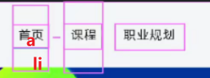

# 页面制作

## 准备工作

1. 创建 study 目录文件夹 (用于存放我们这个页面的相关内容)

2. 用vscode打开study目录文件夹

3. study 目录内放入事先准备好的 images 文件夹，用于保存图片

4. 新建首页文件 index.html（以后我们的网站首页统一规定为 index.html )

5. study 目录内新建 css 文件夹，用于保存css文件

6. css 文件夹内里面新建一个index.css 文件，放入初始化css 代码

   ```css
   /* css 初始化代码  css reset */

   * {
       /* 清除默认内外边距 */
       margin: 0;
       padding: 0;
       /* 內减模式 */
       box-sizing: border-box;
   }
   /* 去掉列表默认样式 */
   li {
       list-style: none;
   }
   /* 去掉链接默认下划线 */
   a {
       text-decoration: none;
   }
   /*去掉button 默认自带的边框*/
   button {
   	border: none;
   }
   body {
   	background-color: #f3f5f7;
   }
   ```

7. 我们本次采用外链样式表，讲css文件引入到html页面中。

   ```html
   <link rel="stylesheet" href="./css/index.css">
   ```

## CSS 属性书写顺序(重点)

**建议**遵循以下顺序：

1. 布局定位属性：```display / position / float /clear / visibility / overflow```（建议 display 第一个写，毕竟关系到模式）
2. 自身属性盒子模型：```width / height / margin / padding/ border / background```
3. 文本属性：```color / font / text-decoration /text-align / vertical-align / white- space / break-word```
4. 其他属性（CSS3）：```content / cursor /border-radius / box-shadow / text-shadow / background:linear-gradient …```

比如：

```css
.jdc {
    /* 第一档 */
    display: block;
    position: relative;
    float: left;
     /* 第二档 */
    width: 100px;
    height: 100px;
    margin: 0 10px;
    padding: 20px 0;
     /* 第三档 */
    font-family: Arial, 'Helvetica Neue', Helvetica, sans-serif;
    color: #333;
     /* 第四档 */
    background: rgba(0,0,0,.5);
    border-radius: 10px;
 } 
```

## 页面布局思路

为了提高网页制作的效率，布局时通常有以下的整体思路：

1. 必须确定页面的版心（可视区），我们测量可得知
2. 分析页面中的行模块，以及每个行模块中的列模块
3. 一行中的列模块经常浮动布局, 先确定每个列的大小，之后确定列的位置
4. ***制作 HTML 结构。我们还是遵循，先有结构，后有样式的原则。**结构永远最重要**，写的时候要注意先行后列，从左往右***
5. ***所以, 先理清楚布局结构，再写代码尤为重要，这需要我们多写多积累***

## 学成在线版心

***这个页面的版心是 1200 像素，每个版心都要水平居中对齐，可以定义版心为公共类：***

```css
 .w {
    width: 1200px;
    margin: auto;
 }

```

##  学成在线头部制作- header

1. 首先准备一个大盒子，作为头部模块, 设定好宽、高（1200*41）、背景色 ，居中对齐
2. ***一般这些数据能够是偶数就偶数
有缝隙补背景色，设置浮动，一般做搜索按钮都只给背景色，然后上图***

   ```css
   <div class="header">  </div>
   ```

3. 里面可以划分为4个小模块


- 版心盒子里面包含 1 号盒子，我们命名为  logo
- 版心盒子里面包含 2 号盒子导航栏模块， 我们命名为  nav
- 版心盒子里面包含 3 号盒子搜索框模块， 我们命名为  search
- 版心盒子里面包含 4 号盒子用户模块， 我们命名为  user

> 注意： 要求里面的 4 个子盒子必须都是浮动，这样才会在一条线上。

## 学成在线banner制作

1. 首先准备一个通栏的大盒子，给个高度（420px），然后给一个蓝色的背景颜色、背景图片。

   相对路径：

   - 同一级  
   - 下一级     /  
   - 上一级    ../    

   > 注意背景图片，要水平局中对齐，顶部靠上对齐

2. 里面放版心（.w）局中对齐。   里面包含左右2部分。

   - 左侧是左侧导航栏， 我们命名为  category (种类、类别)
   - 小箭头一般使用字体图标制作

   - 右侧是课程表模块， 我们命名为  course  （课程）

   - h2 标题    

   - ul 里面包含小li 模块，多行文字不能用line-height实现文字垂直居中

   - 下部是 链接模块   .all 



```html
<div class="course">
    <h2>我的课程表</h2>
    <ul>
        <li>
            <a href="#">
                <h4>继续学习 程序语言设计</h4>
                <p>正在学习-使用对象</p>
            </a>
        </li>
        <li>
            <a href="#">
                <h4>继续学习 程序语言设计</h4>
                <p>正在学习-使用对象</p>
            </a>
        </li>
        <li>
            <a href="#">
                <h4>继续学习 程序语言设计</h4>
                <p>正在学习-使用对象</p>
            </a>
        </li>
    </ul>
</div>
```

```css
.category {
    float: left;
    width: 190px;
    height: 420px;
    background: rgba(0,0,0,.3);
    padding-top: 8px;
}
.category ul li a {
    display: block;
    height: 44px;
    line-height: 44px;
    /* padding-left: 20px;
    padding-right: 20px; */
    padding: 0 20px;
    color: #fff;
    font-size: 14px;
}
/* 伪元素 */
.category ul li a::after {
    content: '>';
    float: right;
    /* margin-right: 20px; */ 
}
.category ul li a:hover {
    background: rgba(0,0,0,.6);
    color: #00a4ff;
}
.course {
    float: right;
    width: 228px;
    height: 300px;
    background-color: #fff;
    margin-top: 50px;
}
.course h2 {
    height: 48px;
    background-color: #9bceea;
    text-align: center;
    line-height: 48px;
    color: #fff;
    font-size: 18px;
}
.course ul {
    margin-top: 8px;
    padding: 0 20px;
}
.course ul li {
    height: 60px;
    padding-top: 12px;
    border-bottom: 1px solid #ccc;
}
.course ul li h4 {
    font-weight: 400;
    color: #4e4e4e;
}
.course ul li p {
    font-size: 14px;
    color: #a5a5a5;
}

.all {
    display: block;
    /* width: 200px; */
    height: 41px;
    border: 1px solid #00a4ff;
    margin: 5px 14px;
    text-align: center;
    line-height: 41px;
    color: #00a4ff;
    font-weight: 700;
}
.all:hover {
    background-color:#00a4ff;
    color: #fff;
}
```

##  学成在线 标签 模块


标签模块：命名为 tag 

- 左侧标题 H3 左侧浮动
- 中间盒子左侧浮动  goods-item 距离可以控制链接的左右内边距（注意行内元素只给左右内边距）
- 右侧盒子右浮动  mod 修改  a 


## 学成在线楼层区域-精品推荐

大盒子命名为：  recommend     /ˌrekəˈmend/        推荐

里面包含上下2部分：

1. 上部分  头部 我们命名为  floorhd    
   - 左侧是 h3 放标题
   - 右侧是 链接   查看全部
2. 下部分  内容 我们命名为  reco-inner
   - 里面用ul和小 li 即可

***高度剩余法，则不需要再一次margin和padding***

***一般都是先写完再用a包起来***

> 注意： 此处需要用到 清除浮动。

## 学成在线楼层区域-编程入门


大盒子命名为：  programme         编程

里面包含上下2部分：

1. 上部分  头部 我们命名为  floorhd    
   - 左侧是 h3 放标题
   - 中间 是 ul 放 4个小li 
   - 右侧是 链接   查看全部
2. 下部分  内容 我们命名为  pro-inner
   - 左侧是 left  盒子 左浮动
   - 右侧是 right  右侧浮动
     - 右侧里面分为上盒子  right-top    放图片即可
     - 右侧里面分为下盒子  right-bottom   里面放 ul 和 li  
     - ***有些标题是一行，有些是两行，这样的话可以直接给盒子一个固定的高度，使得盒子下面的文字在同一高度上***
     - ***图片底部有缝隙，所以像素会溢出***
     - ***写样式的时候一定要写离样式近的父元素***

## 学成在线楼层区域- 前端开发工程师

大盒子命名为：  web   

里面包含上下2部分：

1. 上部分  头部 我们命名为  floorhd    
   - 左侧是 h3 放标题
   - 中间 是 ul 放 4个小li 
   - 右侧是 链接   查看全部
2. 下部分  内容 我们命名为  reco-inner  里面放 5个小li即可  跟 精品推荐模块类似

## 底部模块

- 1 号盒子是通栏大盒子，底部footer 给高度，底色是白色
- 2 号盒子版心水平居中
- 3 号盒子版权 copyright  左对齐 
- 4 号盒子链接组 links  右对齐

***右边的组大盒子是右浮动，里面的三个小盒子是左浮动，右浮动的话会是倒序***


