#  Header 部分开发

## 布局分析：header

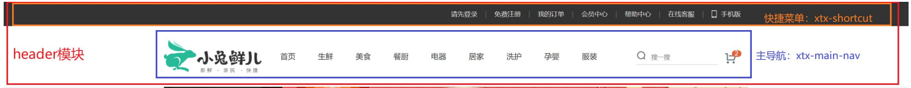

## 布局分析：xtx-shortcut

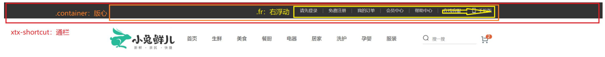

## 布局分析：xtx-main-nav

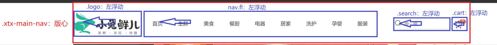

>注意：使用相应的布局标签写

#  Footer 部分开发

## 布局分析：footer

里面分为上下两个大的模块：

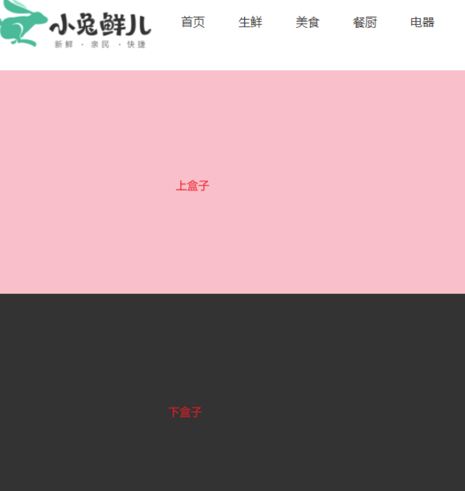

再在里面上下两个盒子里面细分

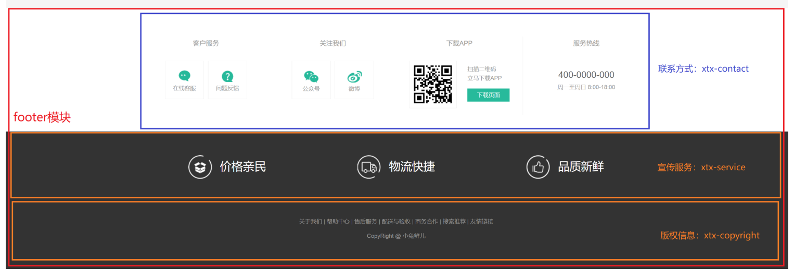

## footer-t模块  底部上部分     
**客户  customer**

**我们  us** 

先给版心，再四个盒子宽度均匀分布

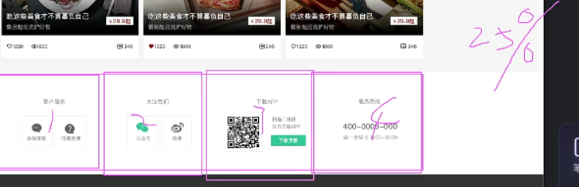

小盒子里面的布局
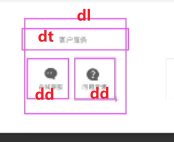

详细布局

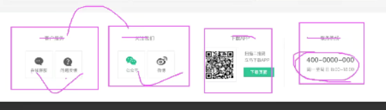

dl布局全部统一

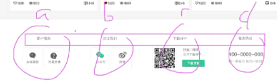

热线布局

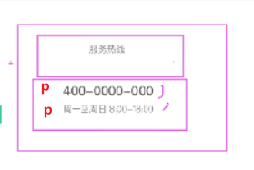

## 布局分析：xtx-service

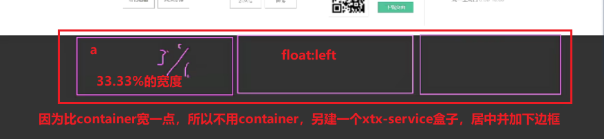

## 布局分析：xtx-copyright
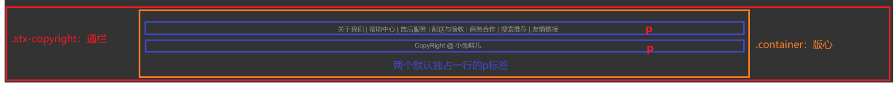

# 网站入口 xtx-entry 部分开发

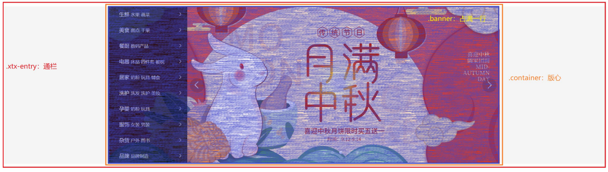

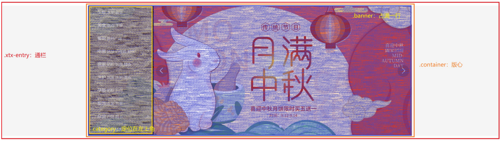

### 侧边栏模块  category
注意这个模块不要写到 轮播图里面去啦~~   他和轮播图是**兄弟 姐妹**关系

所以这个模块一定要绝对定位， 版心盒子作为他的父亲加相对定位

# 新鲜好物面板 xtx-new-goods 部分开发
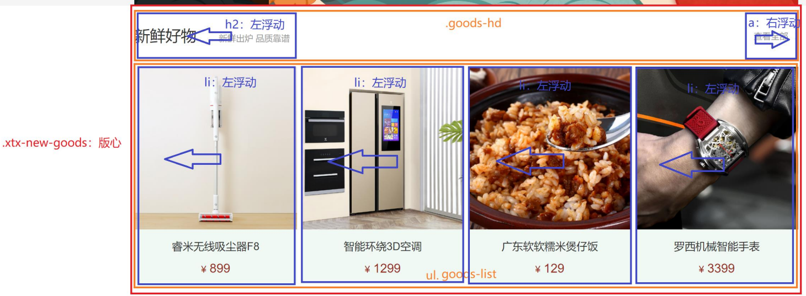

# 生鲜商品面板 xtx-fresh-goods 部分开发
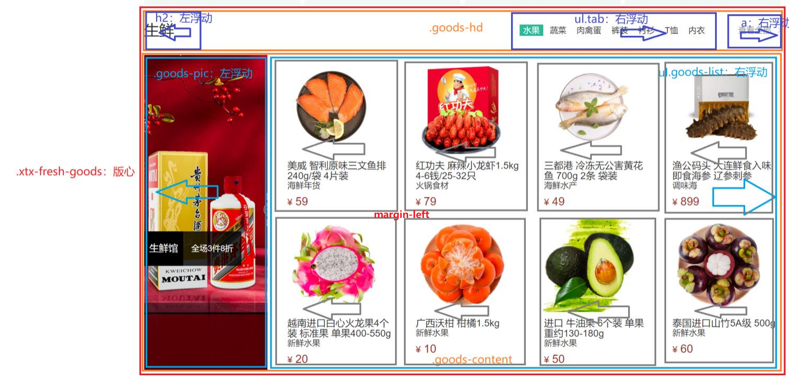

# 用户中心布局

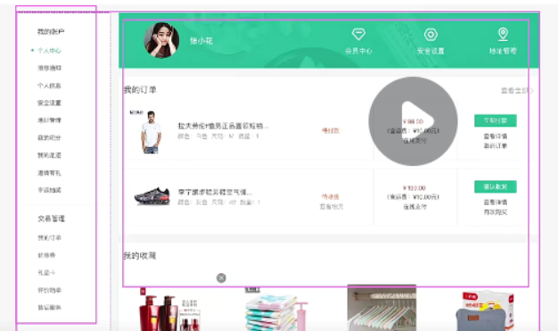

# 用户中心侧边栏开发

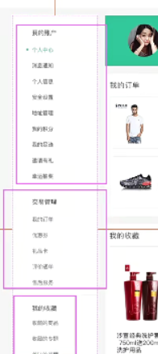

方法一：

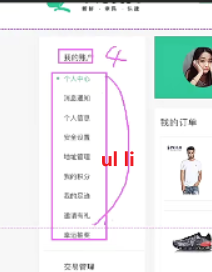

方法二：

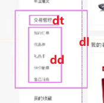

方法三：

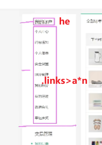

细节布局

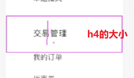

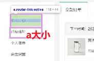

不要忘记清除浮动

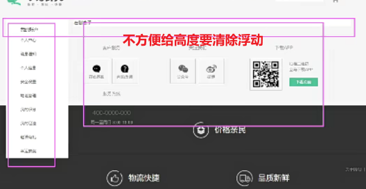

# 用户中心右边开发

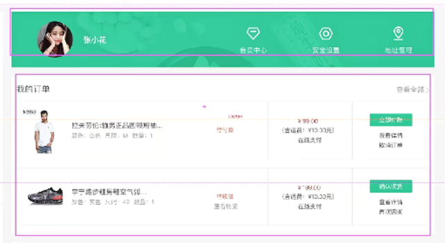

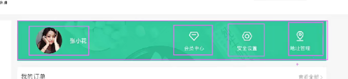

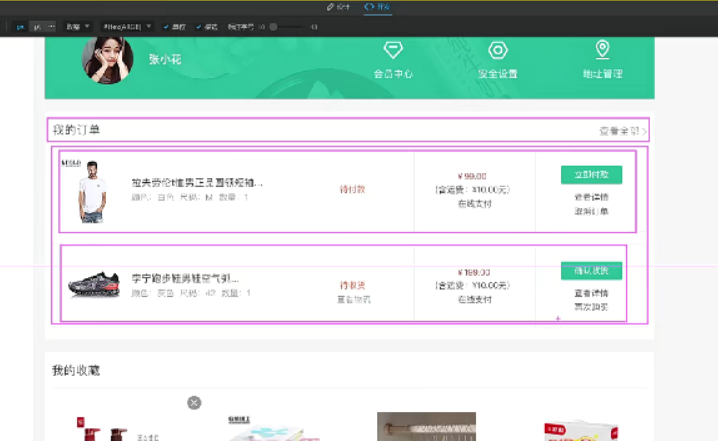

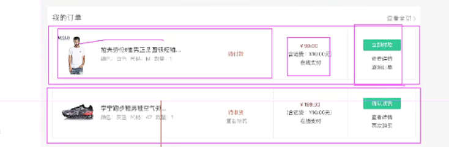

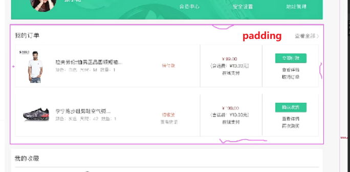

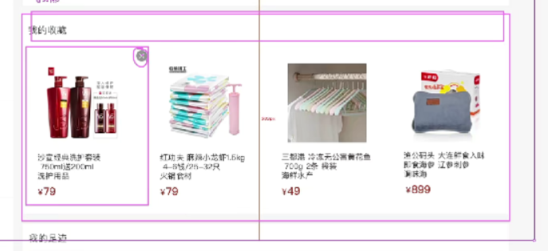